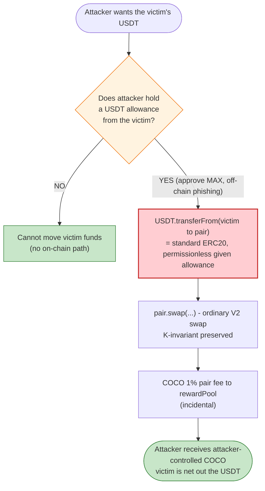
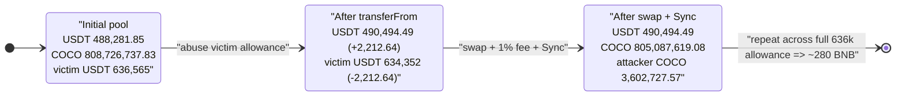

# COCO COIN Incident — Abused USDT Allowance Drained via the COCO/USDT Pool

> **Vulnerability classes:** vuln/defi/slippage · vuln/logic/missing-validation

> One-line summary: this was **not** a smart-contract bug in COCO or PancakeSwap — it was the
> exploitation of a victim's **unlimited USDT `approve()`** granted to the attacker's contract; the
> stolen USDT was laundered into COCO through a perfectly ordinary, K-invariant-preserving swap.

> **Reproduction:** the PoC compiles & runs in an isolated Foundry project at
> [this project folder](.) (the umbrella DeFiHackLabs repo contains many unrelated PoCs that do not
> whole-compile, so this one was extracted). Full verbose trace: [output.txt](output.txt).
> Verified token source: [contracts_COCO.sol](sources/COCO_F563E8/contracts_COCO.sol).
> Verified pair source: [PancakePair.sol](sources/PancakePair_F31cb1/PancakePair.sol).

---

## Key info

| | |
|---|---|
| **Loss** | **280 BNB** total across the campaign (per the PoC header / TenArmor). The reproduced slice moves **2,212.64 USDT** of one victim's funds into **3,602,727 COCO**. |
| **Root cause** | Victim EOA had granted an **unlimited USDT allowance** to the attacker's contract (approval phishing / abused allowance). No code bug in COCO or the pair. |
| **"Vulnerable" token** | `COCO COIN` — [`0xF563E86e461dE100CfCfD8b65dAA542d3d4B0550`](https://bscscan.com/address/0xF563E86e461dE100CfCfD8b65dAA542d3d4B0550#code) (analyzed; its own design quirks are noted but were *not* the loss vector) |
| **AMM pool used** | PancakePair COCO/USDT — [`0xF31cb18759FE8356348c81268b859d2a32bf2117`](https://bscscan.com/address/0xF31cb18759FE8356348c81268b859d2a32bf2117) |
| **Victim (approver)** | `0x51057dB447A6834c8FC4E9541db9c04304eF81D7` — an EOA holding **636,565 USDT** that had `approve(max)`'d the attacker's contract |
| **Attacker EOA** | [`0x0cc28b80D21eBe7b3f3320FAA059f163E98A55a2`](https://bscscan.com/address/0x0cc28b80d21ebe7b3f3320faa059f163e98a55a2) |
| **Attacker contracts** | [`0xac4fde96cf96c5f776de7ec5528cde60f6e8dbea`](https://bscscan.com/address/0xac4fde96cf96c5f776de7ec5528cde60f6e8dbea), [`0xb4d13acf8c4ef796bdc761129c31bc67130301cf`](https://bscscan.com/address/0xb4d13acf8c4ef796bdc761129c31bc67130301cf) (the latter held the victim's USDT allowance) |
| **Attack tx** | [`0x7b743f0fa0ffc6542bc4132405f6c986a00187b6a8b23613ab98c8bcfe9fd875`](https://app.blocksec.com/explorer/tx/bsc/0x7b743f0fa0ffc6542bc4132405f6c986a00187b6a8b23613ab98c8bcfe9fd875) |
| **Chain / block / date** | BSC / 41,529,776 / **2024-08-20** (13:31:55 UTC) |
| **Compiler (COCO)** | Solidity v0.8.17, optimizer off (200 runs) |
| **Bug class** | Abused token allowance / approval phishing (off-chain trust failure) — *not* a reentrancy, oracle, or AMM-invariant bug |
| **Post-mortem** | TenArmor — https://x.com/TenArmorAlert/status/1826101724278579639 |

---

## TL;DR

Despite the way the PoC is framed (and the empty "Vulnerable Contract" field in its header), there is
**no exploitable code defect** in either the COCO token or the PancakeSwap pair that this transaction
abuses. The K-invariant of the pair holds (`k_after ≥ k_before`), and COCO is a vanilla
`ERC20Burnable` with a 1% pair-transfer fee.

The actual loss came from an **abused ERC-20 allowance**. The victim
`0x51057d…81D7` — an EOA sitting on **636,565 USDT** — had previously called
`USDT.approve(0xb4d13acf…, type(uint256).max)` (verified on-chain: the allowance at the fork block is
`1.157e77`). That allowance let the attacker's contract pull the victim's USDT at will via
`transferFrom`, then "wash" it through the COCO/USDT pool — buying deeply-discounted COCO with someone
else's money. The PoC reproduces a single representative slice of that campaign.

In short: this is the on-chain footprint of a **phishing / over-broad-approval** drain, with
PancakeSwap merely used as a swap venue to convert the stolen stablecoin into a token the attacker
controlled the market for.

---

## Background — what the pieces are

- **COCO COIN** ([source](sources/COCO_F563E8/contracts_COCO.sol)) — an `ERC20Burnable` token on BSC,
  total supply **34,200,000,000 COCO**. It adds a **1% fee on any transfer into or out of its configured
  AMM `pair`** (routed to a `rewardPool`), plus owner-only setters and a public `batchTransfer`. None of
  these are the loss vector in this incident (see the "what is *not* the bug" note below).
- **COCO/USDT PancakePair** `0xF31cb18…2117` — a standard PancakeSwap V2 pair
  ([source](sources/PancakePair_F31cb1/PancakePair.sol)). `token0 = USDT`, `token1 = COCO`. At the fork
  block it held **488,281.85 USDT** and **808,726,737.83 COCO** — i.e. COCO's price had collapsed to
  **~0.000604 USDT/COCO** (its market had already been dumped well before this tx).
- **Victim** `0x51057d…81D7` — an ordinary EOA (no contract code) holding **636,565 USDT**, who had
  granted an **unlimited USDT allowance** to attacker contract `0xb4d13acf…`.
- **Attacker** EOA `0x0cc28b…55a2`, operating through contracts `0xac4fde96…` and `0xb4d13acf…`.

The on-chain state read with `cast` at block 41,529,776 (pre-attack):

| Fact | Value |
|---|---|
| Pair `token0` / `token1` | USDT / COCO |
| Pair USDT reserve | 488,281.85 USDT |
| Pair COCO reserve | 808,726,737.83 COCO |
| Implied COCO price | **0.00060377 USDT/COCO** |
| Victim `0x51057d…` USDT balance | **636,565 USDT** |
| Victim USDT allowance → `0xb4d13acf…` (attacker) | **1.157e77 (unlimited)** |
| Victim USDT allowance → COCO token / `0xac4fde96…` | 0 / 0 |
| COCO `pair` config | `0xF31cb18…2117` (this pool) |
| COCO `rewardPool` | `0x16f5506e…5e84` |

That single highlighted row — *the victim's max USDT allowance to the attacker's contract* — is the
entire incident.

---

## The "vulnerable" code (and why it is not actually the bug)

### 1. The swap path is a normal PancakeSwap V2 swap

The attack contract calls `IPancakePair.swap(0, amount1Out, to, "")` directly. The pair enforces the
constant-product invariant exactly as designed
([PancakePair.sol:472-476](sources/PancakePair_F31cb1/PancakePair.sol#L472-L476)):

```solidity
uint balance0Adjusted = (balance0.mul(10000).sub(amount0In.mul(25)));
uint balance1Adjusted = (balance1.mul(10000).sub(amount1In.mul(25)));
require(balance0Adjusted.mul(balance1Adjusted) >= uint(_reserve0).mul(_reserve1).mul(10000**2), 'Pancake: K');
```

With **2,212.64 USDT** actually deposited into the pair, the maximum COCO the K-check permits is
exactly what the attacker requested — `k_after (3.948910e14) ≥ k_before (3.948866e14)`. **No invariant
is violated.** The attacker bought COCO at a fair (collapsed) price; the swap is not the exploit.

### 2. COCO's transfer-fee path (cosmetic to this incident)

COCO charges a 1% fee whenever the pair is sender or recipient
([contracts_COCO.sol:58-86](sources/COCO_F563E8/contracts_COCO.sol#L58-L86)):

```solidity
function _transfer(address sender, address recipient, uint256 amount) internal virtual override {
    require(!banList[sender] && !banList[recipient], "Transaction error");
    if (pair == sender || pair == recipient) {
        _feeTransfer(sender, recipient, amount);   // ← 1% to rewardPool
        return;
    } ...
}
function _feeTransfer(address sender, address recipient, uint256 amount) internal virtual {
    uint256 feeAmount = amount.div(100);                       // 1%
    super._transfer(sender, rewardPool, feeAmount);            // pair → rewardPool
    super._transfer(sender, recipient, amount.sub(feeAmount)); // pair → attacker (99%)
    emit FeeLog(sender, recipient, feeAmount);
}
```

This is why the trace shows the pair sending **3,639,118.76 COCO** but the attacker receiving only
**3,602,727.57 COCO** — the missing **36,391.19 COCO** is the 1% fee to `rewardPool`
([output.txt:42-45](output.txt#L42)). This fee is incidental friction, not the bug.

### 3. The genuinely-dangerous design in COCO (present, but NOT used here)

For completeness, the COCO token *does* ship questionable design, just not what was abused in this tx:

- **`batchTransfer` is `public` and unguarded** ([contracts_COCO.sol:88-98](sources/COCO_F563E8/contracts_COCO.sol#L88-L98)).
  However it transfers from `msg.sender` only (`super._transfer(msg.sender, recipients[i], amounts[i])`),
  so it can move only the *caller's own* tokens — it cannot steal third-party balances.
- **`setPair` / `setRewardPool` / `setBanList` / `setBindValid`** are `onlyOwner` but otherwise
  unconstrained ([:35-49](sources/COCO_F563E8/contracts_COCO.sol#L35-L49)) — a centralization risk and a
  potential griefing/honeypot lever, but again not the mechanism of this loss.

None of these were touched by the attack transaction. The trace contains exactly two external calls:
`USDT.transferFrom(victim → pair, 2212.64)` and `pair.swap(...)`.

---

## Root cause — why it was possible

The attacker did not break any contract. They exercised an **allowance the victim had already
granted**:

1. **Over-broad approval.** The victim `0x51057d…` had executed
   `USDT.approve(0xb4d13acf… /* attacker contract */, type(uint256).max)`. This is the classic
   approval-phishing footprint — a user signs an "unlimited" token approval to a malicious or
   compromised contract (often via a fake dApp / drainer).
2. **`transferFrom` is permissionless given an allowance.** USDT (BSC) is a standard ERC-20; with an
   allowance in place, *anyone controlling the spender contract* can call
   `transferFrom(victim, anywhere, amount)`. The attacker's contract simply does this
   ([output.txt:33](output.txt#L33)):
   ```
   USDT.transferFrom(0x51057d… /*victim*/, 0xF31cb18…2117 /*pair*/, 2212.64)
   ```
   sending the victim's stablecoin *directly into the pool* as the swap input.
3. **The pool is just a fence.** Routing the stolen USDT through the COCO/USDT pair converts it into
   COCO — a token whose market the attacker effectively owns (COCO had already collapsed; the pair is
   the only meaningful venue). This launders the theft and lets the attacker realize the value on a
   token they control.

So the "exploit" is an **off-chain trust failure** (the victim's signature granting the approval),
realized on-chain through routine ERC-20 mechanics. The full campaign repeated this until ~**280 BNB**
of value had been extracted from the victim(s).

> **In one sentence:** an attacker who already held the victim's `approve(max)` spent the victim's
> 636k-USDT balance, swapping it for a worthless token they controlled — there is no contract
> vulnerability to "fix" in COCO or PancakeSwap; the fix is at the wallet/approval layer.

---

## Preconditions

- The victim (`0x51057d…`) holds USDT (here **636,565 USDT**) and has granted an **unlimited USDT
  allowance** to the attacker's contract `0xb4d13acf…`. *(In the PoC this is reproduced by
  `vm.prank(addr); USDT.approve(address(attC), max)` — [test/COCO_exp.sol:35-37](test/COCO_exp.sol#L35).)*
- A COCO/USDT pool exists with enough COCO liquidity that the stolen USDT can be converted (the pool
  holds 808.7M COCO).
- The attacker controls (or can arbitrarily mint/own) COCO so the laundered value is theirs — COCO's
  market had already collapsed to ~0.0006 USDT, and `rewardPool` already held 147.9M COCO of accrued
  fees, indicating the token had been heavily dumped before this tx.

No timing, oracle, flash-loan, or reentrancy precondition is required — only the standing allowance.

---

## Attack walkthrough (with on-chain numbers from the trace)

All figures are taken directly from [output.txt](output.txt) (events + storage diffs) and verified with
`cast` reads at block 41,529,776. The reproduced slice is one swap; the live campaign repeated it.

| # | Step | Concrete numbers | Effect |
|---|------|------------------|--------|
| 0 | **Initial pool** | USDT 488,281.85 / COCO 808,726,737.83 → price 0.00060377 USDT/COCO | COCO already collapsed; honest-looking pool. |
| 1 | **Pull victim's USDT** — `USDT.transferFrom(victim → pair, 2,212.64)` ([output.txt:33](output.txt#L33)) | Victim USDT −2,212.64; pair USDT now 490,494.49 | Spends *someone else's* stablecoin straight into the pool. |
| 2 | **Swap** — `pair.swap(0, 3,639,118.76 COCO, attacker, "")` ([output.txt:41](output.txt#L41)) | K-check passes (`k_after 3.94891e14 ≥ k_before 3.94887e14`) | Ordinary, fair swap at the collapsed price. |
| 3 | **1% COCO fee skimmed** — pair → `rewardPool` ([output.txt:43](output.txt#L43)) | 36,391.19 COCO to `0x16f5506e…` | COCO's transfer tax. |
| 4 | **Attacker receives COCO** ([output.txt:44,61-63](output.txt#L44)) | **3,602,727.57 COCO** to attack contract | Value of stolen USDT now sits in attacker-controlled COCO. |
| 5 | **`Sync`** ([output.txt:55](output.txt#L55)) | USDT 490,494.49 / COCO 805,087,619.08 | Pool reserves updated; invariant intact. |

The terminal balance assertion in the PoC prints the laundered position
([output.txt:63](output.txt#L63)):
`after attack: balance of address(attC) = 3,602,727.568967624235381855 COCO`.

### Value accounting (this reproduced slice)

| Flow | Amount |
|---|---:|
| Victim USDT drained (input) | **2,212.64 USDT** |
| COCO received by attacker | 3,602,727.57 COCO |
| COCO value at pool price (0.00060377) | ≈ **2,175 USDT** |
| 1% COCO fee diverted to `rewardPool` | 36,391.19 COCO (≈ 22 USDT) |
| Net economic transfer | The victim loses **2,212.64 USDT**; the attacker gains COCO worth ≈2,175 USDT (the ~1.7% gap is the swap fee/slippage). |

The point is not that this single swap is "profitable" in a clever sense — it is that **the input was
not the attacker's money**. The attacker's gain equals the victim's loss (minus pool fees). Repeating
the pattern across the victim's full 636k-USDT balance produced the headline **280 BNB** figure.

---

## Diagrams

### Sequence of the (reproduced) attack

```mermaid
sequenceDiagram
    autonumber
    actor A as "Attacker (via contract 0xb4d13acf)"
    participant U as "USDT (BSC)"
    participant V as "Victim 0x51057d (636k USDT)"
    participant P as "COCO/USDT Pair"
    participant C as "COCO token"
    participant RP as "rewardPool 0x16f5506e"

    Note over V,P: Precondition (off-chain phishing):<br/>Victim previously did<br/>USDT.approve(attacker, MAX)

    Note over P: Initial reserves<br/>488,281.85 USDT / 808,726,737 COCO<br/>price approx 0.000604 USDT per COCO

    rect rgb(255,235,238)
    Note over A,V: Step 1 - abuse the standing allowance
    A->>U: transferFrom(victim, pair, 2,212.64 USDT)
    U->>V: debit 2,212.64 USDT (victim's funds)
    U->>P: credit 2,212.64 USDT
    end

    rect rgb(227,242,253)
    Note over A,C: Step 2 - launder via a normal swap
    A->>P: swap(0, 3,639,118.76 COCO, attacker, "")
    P->>C: transfer(pair to attacker, 3,639,118.76 COCO)
    C->>RP: 1% fee = 36,391.19 COCO
    C->>A: 3,602,727.57 COCO (99%)
    P->>P: K-check passes; Sync()
    end

    Note over A: Attacker now holds COCO worth approx 2,175 USDT<br/>funded entirely by the victim's stablecoin
```

### Where the loss actually originates (decision flow)



### Pool / balance state evolution



---

## Remediation

Because the loss is an **allowance-abuse**, the meaningful mitigations are at the wallet / approval /
operational layer, not in COCO or PancakeSwap:

1. **Never grant unlimited (`type(uint256).max`) token approvals to untrusted contracts.** Approve only
   the exact amount needed, per interaction. The victim's standing `approve(max)` to the attacker's
   contract was the single enabling condition.
2. **Revoke stale approvals.** Use approval-management tooling (e.g. revoke.cash / explorer approval
   views) to find and zero out forgotten or suspicious allowances — especially to non-verified or
   recently-deployed contracts like `0xb4d13acf…`.
3. **Wallet-level drainer protection.** Treat any signature request that asks for an unbounded ERC-20
   approval to an unknown spender as hostile; prefer wallets that simulate and flag
   `approve(spender, MAX)` to fresh contracts.
4. **Protocol hygiene for token authors (defense-in-depth, not the cause here).** The COCO token's
   public `batchTransfer` and unconstrained `onlyOwner` setters
   ([contracts_COCO.sol:35-49,88-98](sources/COCO_F563E8/contracts_COCO.sol#L35-L49)) are
   centralization/honeypot risks; remove `batchTransfer` or restrict setter ranges, even though they
   were not used in this drain.
5. **Monitoring.** Allowance-drain campaigns are detectable: large `transferFrom` flows from
   distinct EOAs into a single attacker contract, immediately routed into a thin/illiquid pool, are a
   high-signal alert pattern.

---

## What is *not* the bug (explicit, to avoid mis-attribution)

- **Not an AMM invariant break.** `k_after ≥ k_before`; the swap is fair. Contrast with reserve-burn
  exploits (e.g. tokens that `_burn(pool)` + `sync()`), which this is *not*.
- **Not COCO `batchTransfer`.** It moves only `msg.sender`'s own tokens; it cannot reach the victim's
  USDT or COCO.
- **Not reentrancy / oracle / flash-loan.** The trace shows two plain calls and requires no price
  manipulation — only the pre-existing allowance.

The "Vulnerable Contract" field in the original PoC header was intentionally left blank for this
reason: the failure is the victim's over-broad approval, an off-chain trust decision.

---

## How to reproduce

The PoC was extracted into a standalone Foundry project (the umbrella DeFiHackLabs repo has many
unrelated PoCs that fail to compile under a whole-project `forge build`):

```bash
_shared/run_poc.sh 2024-08-COCO_exp -vvvvv
```

- RPC: a **BSC archive** endpoint is required (fork block 41,529,776). `foundry.toml` uses
  `https://bsc-mainnet.public.blastapi.io`, which serves historical state at that block. The setup's
  default `onfinality` endpoint rate-limits (HTTP 429) for archive reads, so it was swapped to blastapi.
- Result: `[PASS] testPoC()` printing the laundered COCO balance.

Expected tail:

```
Ran 1 test for test/COCO_exp.sol:ContractTest
[PASS] testPoC() (gas: 361512)
  after attack: balance of address(attC): 3602727.568967624235381855
Suite result: ok. 1 passed; 0 failed; 0 skipped
```

---

*References: TenArmor post-mortem — https://x.com/TenArmorAlert/status/1826101724278579639 ;
attack tx on BlockSec — https://app.blocksec.com/explorer/tx/bsc/0x7b743f0fa0ffc6542bc4132405f6c986a00187b6a8b23613ab98c8bcfe9fd875*
