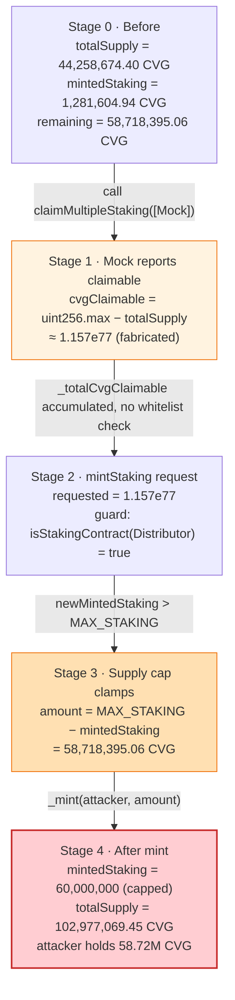
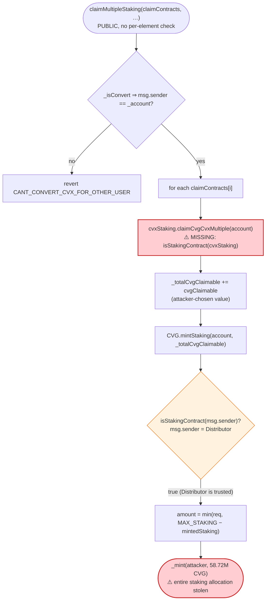

# Convergence Finance Exploit — Unvalidated `claimContracts` Lets a Fake Staking Contract Mint the Entire Staking Allocation

> One-line summary: `CvxRewardDistributor.claimMultipleStaking()` calls `claimCvgCvxMultiple()` on a **caller-supplied** contract array without checking that those contracts are registered staking services, so an attacker-controlled mock returns an enormous "claimable" CVG amount that the trusted distributor then mints — draining the whole remaining `MAX_STAKING` allocation in one transaction.

> **Reproduction:** the PoC compiles & runs in this isolated Foundry project at
> [this project folder](.) (the umbrella DeFiHackLabs repo contains many unrelated PoCs that do
> not compile together, so this one was extracted).
> Full verbose trace: [output.txt](output.txt).
> Verified vulnerable sources: [CvxRewardDistributor.sol](sources/CvxRewardDistributor_47c69e/contracts_Staking_Convex_CvxRewardDistributor.sol) and [Cvg.sol](sources/Cvg_97efFB/contracts_Token_Cvg.sol).

---

## Key info

| | |
|---|---|
| **Loss** | ~$200,000 — **58,718,395.06 CVG** minted out of thin air (the entire unminted staking allocation) |
| **Vulnerable contract** | `CvxRewardDistributor` (proxy [`0x2b083beaaC310CC5E190B1d2507038CcB03E7606`](https://etherscan.io/address/0x2b083beaaC310CC5E190B1d2507038CcB03E7606#code), impl [`0x47c69e8c909ce626Af73c955A5e34A20B7c71f19`](https://etherscan.io/address/0x47c69e8c909ce626Af73c955A5e34A20B7c71f19#code)) |
| **Co-victim contract** | `Cvg` ERC20 token — [`0x97efFB790f2fbB701D88f89DB4521348A2B77be8`](https://etherscan.io/address/0x97efFB790f2fbB701D88f89DB4521348A2B77be8#code) |
| **Registry** | `CvgControlTowerV2` (proxy [`0xB0Afc8363b8F36E0ccE5D54251e20720FfaeaeE7`](https://etherscan.io/address/0xB0Afc8363b8F36E0ccE5D54251e20720FfaeaeE7#code)) |
| **Attacker EOA** | [`0x03560a9d7a2c391fb1a087c33650037ae30de3aa`](https://etherscan.io/address/0x03560a9d7a2c391fb1a087c33650037ae30de3aa) |
| **Attacker contract** | [`0xee45384d4861b6fb422dfa03fbdcc6e29d7beb69`](https://etherscan.io/address/0xee45384d4861b6fb422dfa03fbdcc6e29d7beb69) |
| **Attack tx** | [`0x636be30e58acce0629b2bf975b5c3133840cd7d41ffc3b903720c528f01c65d9`](https://etherscan.io/tx/0x636be30e58acce0629b2bf975b5c3133840cd7d41ffc3b903720c528f01c65d9) |
| **Chain / block / date** | Ethereum mainnet / 20,434,450 / Aug 1, 2024 |
| **Compiler** | `CvxRewardDistributor`: v0.8.24, optimizer 250 runs · `Cvg`: v0.8.17, optimizer 250 runs |
| **Bug class** | Missing input validation / arbitrary external call to an unvalidated contract → unauthorized token mint |

---

## TL;DR

The Convergence reward path `CvxRewardDistributor.claimMultipleStaking()` accepts a `claimContracts`
array **directly from the caller** and, for each element, calls
`claimContracts[i].claimCvgCvxMultiple(account)`
([CvxRewardDistributor.sol:137-139](sources/CvxRewardDistributor_47c69e/contracts_Staking_Convex_CvxRewardDistributor.sol#L137-L139)).
It **never checks** that those contracts are genuine staking services registered in the control tower.
Whatever `cvgClaimable` value each contract returns is accumulated and then minted via
`CVG.mintStaking(account, total)`
([:192](sources/CvxRewardDistributor_47c69e/contracts_Staking_Convex_CvxRewardDistributor.sol#L192),
[:211-213](sources/CvxRewardDistributor_47c69e/contracts_Staking_Convex_CvxRewardDistributor.sol#L211-L213)).

`Cvg.mintStaking()` only authorizes that **its caller** (the distributor) is a registered staking
contract — it does not, and cannot, know that the *claimable amount* was fabricated by a fake
sub-contract one frame deeper
([Cvg.sol:66-80](sources/Cvg_97efFB/contracts_Token_Cvg.sol#L66-L80)).

So the attacker:

1. Deploys a `Mock` contract whose `claimCvgCvxMultiple()` returns `type(uint256).max - CVG.totalSupply()`.
2. Calls `claimMultipleStaking([mock], attacker, 1, true, 1)`.
3. The distributor accumulates the bogus `cvgClaimable` and calls `CVG.mintStaking(attacker, ~1.157e77)`.
4. `mintStaking`'s supply cap clamps the actual mint to `MAX_STAKING - mintedStaking`, so the attacker
   walks away with **58,718,395.06 CVG** — the *entire* remaining staking allocation — and pins
   `mintedStaking` at the 60M cap.

The supply cap was the only thing standing between this and an unbounded mint; it still let the
attacker steal 100% of the unminted staking supply, worth roughly $200K at the time.

---

## Background — what Convergence does

Convergence Finance (`$CVG`) is a yield/voting-escrow protocol. Users hold ERC-721 "staking
positions" against various staking-position-service contracts and periodically claim accrued **CVG**
emissions plus underlying **Convex (CVX)** rewards.

`CvxRewardDistributor`
([source](sources/CvxRewardDistributor_47c69e/contracts_Staking_Convex_CvxRewardDistributor.sol))
is the gas-optimization layer for claims. Instead of minting/transferring on each individual staking
contract, it offers `claimMultipleStaking()`: the user passes a list of their staking-position-service
contracts; the distributor loops over them, asks each how much CVG and CVX is claimable, **sums it
all up**, and performs a single `CVG.mintStaking()` plus the CVX payouts at the end.

The minting authority is centralized in the `Cvg` token
([source](sources/Cvg_97efFB/contracts_Token_Cvg.sol)):

- `mintBond()` — callable only by registered bond contracts (`cvgControlTower.isBond`).
- `mintStaking()` — callable only by registered staking contracts (`cvgControlTower.isStakingContract`),
  capped at `MAX_STAKING = 60,000,000 CVG`.

The control tower `CvgControlTowerV2` (proxy `0xB0Afc8...`) is the registry that answers
`isStakingContract(addr)`. The `CvxRewardDistributor` proxy `0x2b083bea...` is itself a registered
staking contract, which is exactly why `Cvg.mintStaking` trusts it.

On-chain state at the fork block (block 20,434,449, read from the trace):

| Parameter | Value |
|---|---|
| `MAX_STAKING` | 60,000,000 CVG |
| `CVG.totalSupply()` (before) | 44,258,674.397309 CVG |
| `Cvg.mintedStaking` (before, slot 6) | 1,281,604.943182 CVG |
| Remaining staking allocation (`MAX_STAKING − mintedStaking`) | **58,718,395.056818 CVG** ← the prize |
| `isStakingContract(0x2b083bea…)` | `true` (the distributor is trusted) |

---

## The vulnerable code

### 1. The distributor calls a caller-supplied contract with no whitelist check

`claimMultipleStaking` iterates over the **caller-provided** `claimContracts` array and invokes
`claimCvgCvxMultiple()` on each, with **no validation** that the element is a real, registered staking
service:

```solidity
function claimMultipleStaking(
    ICvxStakingPositionService[] calldata claimContracts,   // ⚠️ fully attacker-controlled
    address _account,
    uint256 _minCvgCvxAmountOut,
    bool _isConvert,
    uint256 cvxRewardCount
) external {
    require(claimContracts.length != 0, "NO_STAKING_SELECTED");

    if (_isConvert) {
        require(msg.sender == _account, "CANT_CONVERT_CVX_FOR_OTHER_USER");
    }
    uint256 _totalCvgClaimable;
    ICommonStruct.TokenAmount[] memory _totalCvxClaimable = new ICommonStruct.TokenAmount[](cvxRewardCount);

    for (uint256 stakingIndex; stakingIndex < claimContracts.length; ) {
        ICvxStakingPositionService cvxStaking = claimContracts[stakingIndex];   // ⚠️ no isStakingContract() check

        (uint256 cvgClaimable, ICommonStruct.TokenAmount[] memory _cvxRewards) = cvxStaking.claimCvgCvxMultiple(
            _account
        );                                                     // ⚠️ trusts whatever the contract returns
        _totalCvgClaimable += cvgClaimable;                    // ⚠️ bogus value accumulated
        ...
    }

    _withdrawRewards(_account, _totalCvgClaimable, _totalCvxClaimable, _minCvgCvxAmountOut, _isConvert);
}
```
[CvxRewardDistributor.sol:110-193](sources/CvxRewardDistributor_47c69e/contracts_Staking_Convex_CvxRewardDistributor.sol#L110-L193)

The `_isConvert ⇒ msg.sender == _account` check at
[:120-122](sources/CvxRewardDistributor_47c69e/contracts_Staking_Convex_CvxRewardDistributor.sol#L120-L122)
is the *only* gate — and it merely prevents claiming-on-behalf-of-others during conversion. There is
nothing preventing the supplied contracts from being arbitrary, attacker-deployed code.

### 2. `_withdrawRewards` mints the accumulated total

```solidity
function _withdrawRewards(
    address receiver,
    uint256 totalCvgClaimable,
    ...
) internal {
    if (totalCvgClaimable > 0) {
        CVG.mintStaking(receiver, totalCvgClaimable);   // ⚠️ mints the fabricated amount
    }
    ...
}
```
[CvxRewardDistributor.sol:203-213](sources/CvxRewardDistributor_47c69e/contracts_Staking_Convex_CvxRewardDistributor.sol#L203-L213)

### 3. The token only authorizes the *caller*, not the *amount*

```solidity
function mintStaking(address account, uint256 amount) external {
    require(cvgControlTower.isStakingContract(msg.sender), "NOT_STAKING");  // ✓ distributor IS registered
    uint256 _mintedStaking = mintedStaking;
    require(_mintedStaking < MAX_STAKING, "MAX_SUPPLY_STAKING");

    /// @dev ensure every tokens will be minted from staking
    uint256 newMintedStaking = _mintedStaking + amount;
    if (newMintedStaking > MAX_STAKING) {        // ← cap clamps the absurd request…
        newMintedStaking = MAX_STAKING;
        amount = MAX_STAKING - _mintedStaking;   // … to the remaining allocation: 58,718,395.06 CVG
    }

    mintedStaking = newMintedStaking;
    _mint(account, amount);
}
```
[Cvg.sol:66-80](sources/Cvg_97efFB/contracts_Token_Cvg.sol#L66-L80)

`msg.sender` here is the trusted `CvxRewardDistributor` proxy, so the `isStakingContract` check passes
(trace: `isStakingContract(0x2b083bea…) → true`). The token has no visibility into the fact that the
`amount` originated from a fake sub-contract. The `MAX_STAKING` cap is the *only* limiter — it converts
an unbounded mint request into "mint the entire remaining staking allocation."

---

## Root cause — why it was possible

The protocol split a single privileged action across two contracts and authorized the wrong link of
the chain:

1. **`CvxRewardDistributor.claimMultipleStaking` treats arbitrary user input as a trusted oracle of
   claimable rewards.** The `claimContracts` array is the user's, but the function calls
   `claimCvgCvxMultiple()` on each entry and *believes the returned amount*. A staking contract is
   supposed to compute the *real* accrued CVG for a position; here, the attacker's mock simply returns
   `type(uint256).max - totalSupply`.

2. **The whitelist (`isStakingContract`) exists but is checked in the wrong place.** `Cvg.mintStaking`
   verifies that *its caller* (the distributor) is registered, and `claimCvgCvxSimple`
   ([:96](sources/CvxRewardDistributor_47c69e/contracts_Staking_Convex_CvxRewardDistributor.sol#L96))
   even checks `isStakingContract(msg.sender)`. But `claimMultipleStaking` performs **no such check on
   the contracts it itself calls**. The trust boundary is the registry, and the distributor walks
   right across it on the user's behalf.

3. **The distributor is itself a fully-trusted minter.** Because the distributor proxy is a registered
   staking contract, anything it asks the token to mint succeeds (up to the cap). So a single missing
   validation inside the distributor is sufficient to abuse the token's mint authority — no other
   contract needs to be compromised.

In short: *the right to mint was delegated to the distributor, and the distributor delegated the
"how much" decision to whatever contract the caller passed in.* That is an arbitrary-external-call /
missing-input-validation bug that escalates directly into an unauthorized mint.

---

## Preconditions

- `Cvg.mintedStaking < MAX_STAKING` — there must be *some* unminted staking allocation left to steal.
  At the fork block, `60,000,000 − 1,281,604.94 = 58,718,395.06 CVG` remained. (If the cap were already
  reached, the mint would revert with `MAX_SUPPLY_STAKING`.)
- The `CvxRewardDistributor` proxy is registered as a staking contract in the control tower (it was —
  it is the legitimate Convex reward distributor).
- No capital and no flash loan required: the attack is a single permissionless call to
  `claimMultipleStaking` plus one self-deployed mock contract. Gas-only.

---

## Attack walkthrough (with on-chain numbers from the trace)

All figures are taken directly from [output.txt](output.txt).

| # | Step | Concrete values | Effect |
|---|------|-----------------|--------|
| 0 | **Read state** | `CVG.totalSupply() = 44,258,674.397309 CVG`; `mintedStaking = 1,281,604.943182 CVG` | Baseline. |
| 1 | **Deploy `Mock`** | Mock's `claimCvgCvxMultiple` returns `(type(uint256).max − totalSupply, [])` | The fake "staking contract" that reports a fabricated reward. |
| 2 | **Call** `claimMultipleStaking([mock], attacker, 1, true, 1)` | `_isConvert=true`, `msg.sender==attacker==_account` ✓ passes the only guard | Enters the loop. |
| 3 | Distributor calls `mock.claimCvgCvxMultiple(attacker)` | returns `cvgClaimable = 115,792,089,…,374,013,825` (`uint256.max − 4.4258e25 ≈ 1.157e77`), empty CVX array | Bogus claimable accumulated into `_totalCvgClaimable`. |
| 4 | `_withdrawRewards` → `CVG.mintStaking(attacker, 1.157e77)` | `isStakingContract(0x2b083bea…) → true`; cap clamps `amount` to `MAX_STAKING − mintedStaking` | The cap turns the absurd request into a full-allocation drain. |
| 5 | `_mint(attacker, 58,718,395.056818 CVG)` | `Transfer(0x0 → attacker, 5.8718395e25)`; `mintedStaking` slot 6: `0x010f63…078a9e → 0x31a17e…000000` (= 60,000,000e18) | Attacker receives the entire remaining staking allocation; cap now fully consumed. |
| 6 | **Final balance** | `CVG.balanceOf(attacker) = 58,718,395.056818121904518498 CVG` | Theft complete. |

The PoC's emitted log confirms the end state to the wei:
`[End] Attacker CVG balance after exploit: 58718395.056818121904518498`.

In the live incident the attacker subsequently swapped the freshly-minted CVG through the
`CVG/ETH` and `CVG/FRAX` Curve pools (the `ICurveTwocryptoOptimized` interfaces declared in the PoC)
to realize ~$200K before the price collapsed.

### Profit / loss accounting

| Item | Amount |
|---|---:|
| CVG minted to attacker (free) | 58,718,395.056818 CVG |
| Attacker capital at risk | 0 (gas only) |
| `mintedStaking` before → after | 1,281,604.94 → 60,000,000.00 CVG (cap consumed) |
| CVG total supply before → after | 44,258,674.40 → 102,977,069.45 CVG |
| Realized loss (after Curve dumps, per @DecurityHQ) | **~$200,000** |

Every CVG the attacker received was newly minted dilution borne by all existing CVG holders, plus the
liquidity drained from the Curve pools when the minted tokens were sold.

---

## Diagrams

### Sequence of the attack

```mermaid
sequenceDiagram
    autonumber
    actor A as "Attacker (EOA + contract)"
    participant M as "Mock (fake staking)"
    participant D as "CvxRewardDistributor (trusted minter)"
    participant T as "Cvg token"
    participant CT as "CvgControlTowerV2 (registry)"

    Note over A: Deploy Mock whose claimCvgCvxMultiple<br/>returns uint256.max − totalSupply

    A->>D: claimMultipleStaking([Mock], attacker, 1, true, 1)
    Note over D: only guard: _isConvert ⇒ msg.sender == _account ✓
    D->>M: claimCvgCvxMultiple(attacker)
    M->>T: totalSupply() (= 44,258,674.40 CVG)
    M-->>D: cvgClaimable ≈ 1.157e77 (bogus), cvx = []
    Note over D: _totalCvgClaimable += 1.157e77<br/>(no isStakingContract check on Mock)
    D->>T: mintStaking(attacker, 1.157e77)
    T->>CT: isStakingContract(Distributor)?
    CT-->>T: true (Distributor IS registered)
    Note over T: cap: amount = MAX_STAKING − mintedStaking<br/>= 58,718,395.06 CVG
    T->>A: _mint(attacker, 58,718,395.06 CVG)
    Note over A: Attacker holds 58.72M CVG;<br/>later dumped on Curve for ~$200K
```

### State evolution of the CVG staking allocation



### Where the trust boundary was crossed



---

## Remediation

1. **Validate every contract the distributor calls.** Inside `claimMultipleStaking` (and any similar
   batch helper), require each element to be a registered staking service before calling it:
   ```solidity
   require(cvgControlTower.isStakingContract(address(cvxStaking)), "NOT_STAKING");
   ```
   This is the direct fix — it mirrors the check already present in `claimCvgCvxSimple` and
   `Cvg.mintStaking`, just applied to the *callees* rather than the caller.
2. **Authorize the amount, not just the caller.** A trusted intermediary (the distributor) that mints
   on behalf of others should never forward an externally-supplied amount unchecked. Re-derive the
   claimable amount from canonical position state inside the trusted path, or have the token verify the
   originating staking contract.
3. **Defense in depth on `mintStaking`.** The `MAX_STAKING` cap saved this from being an unbounded
   mint, but a per-call sanity bound (e.g., reject mints exceeding a reasonable per-epoch emission, or
   require the mint amount to be reconcilable against `CvgRewards` accounting) would have blocked the
   theft of the *entire* remaining allocation in one call.
4. **Prefer pull-from-known-set over push-arbitrary-list.** Batch claim helpers should iterate over a
   *protocol-maintained* set of staking contracts the user is enrolled in, not an arbitrary
   caller-supplied array.

---

## How to reproduce

The PoC was extracted into a standalone Foundry project (the umbrella DeFiHackLabs repo has many
unrelated PoCs that fail to compile under a single whole-project build):

```bash
_shared/run_poc.sh 2024-08-Convergence_exp -vvvvv
```

- RPC: an **Ethereum mainnet archive** endpoint is required (fork block 20,434,449). `foundry.toml`
  is preconfigured with an Infura archive endpoint; most pruned public RPCs fail at this historical
  block with `missing trie node`.
- Result: `[PASS] testExploit()` with the attacker holding **58,718,395.056818121904518498 CVG**.

Expected tail:

```
Ran 1 test for test/Convergence_exp.sol:ContractTest
[PASS] testExploit() (gas: 378119)
Logs:
  [End] Attacker CVG balance after exploit: 58718395.056818121904518498

Suite result: ok. 1 passed; 0 failed; 0 skipped
```

---

*References: Original disclosure by Decurity — https://x.com/DecurityHQ/status/1819030089012527510 ·
Attack tx `0x636be30e58acce0629b2bf975b5c3133840cd7d41ffc3b903720c528f01c65d9`.*
