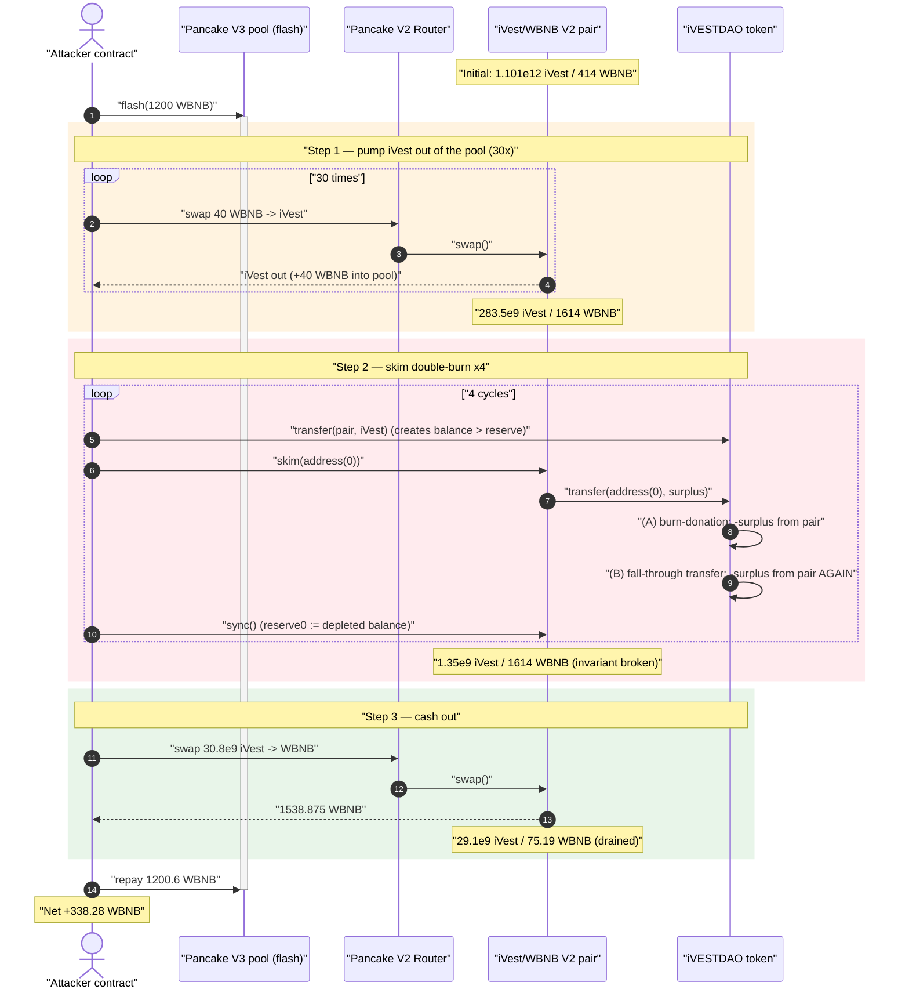
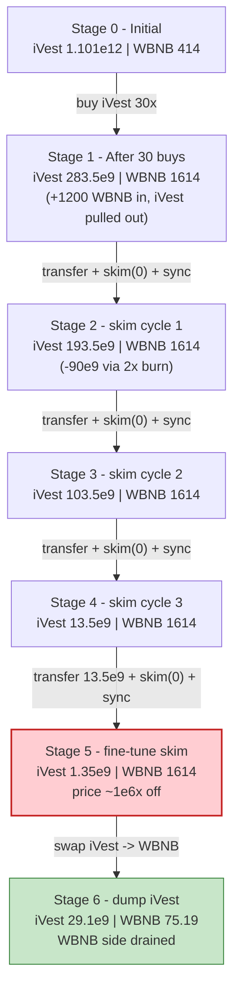
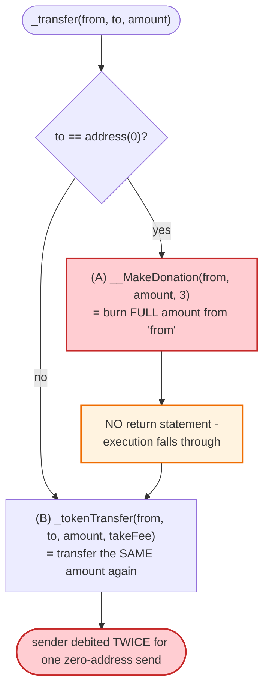
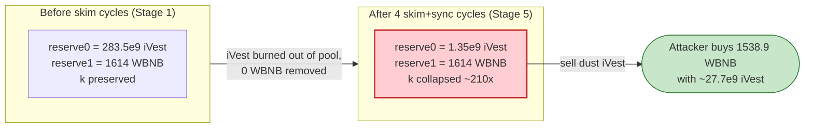

# iVestDAO Exploit — `skim()` Re-Routed Through a Reflection Token's Burn-Donation Hook

> **One-liner:** iVestDAO is a reflection token whose `_transfer` treats *any* send to `address(0)` as a 100%-burn "donation" **and then keeps going to do a second, ordinary fee-bearing transfer of the same amount**. PancakeSwap's `skim(address(0))` therefore destroys **double** the surplus it forces out of the pair; repeating skim+`sync()` ratchets the pair's iVest reserve down to ~0 while the WBNB reserve is untouched, letting the attacker buy out the entire WBNB side with dust iVest.

> **Reproduction:** the PoC compiles & runs in this isolated Foundry project ([this folder](.)).
> Full verbose trace: [output.txt](output.txt).
> Verified vulnerable source: [iVESTDAO.sol](sources/iVESTDAO_786fCF/iVESTDAO.sol) · [PancakePair.sol](sources/PancakePair_260711/PancakePair.sol).

---

## Key info

| | |
|---|---|
| **Loss** | **~338.28 WBNB** (~$190K at the time) — net profit drained from the iVest/WBNB pair |
| **Vulnerable contract** | `iVESTDAO` token — [`0x786fCF76dC44B29845f284B81f5680b6c47302c6`](https://bscscan.com/address/0x786fCF76dC44B29845f284B81f5680b6c47302c6#code) |
| **Victim pool** | iVest/WBNB PancakeSwap **V2** pair — [`0x2607118D363789f841d952f02e359BFa483955f9`](https://bscscan.com/address/0x2607118D363789f841d952f02e359BFa483955f9) |
| **Flash-loan source** | PancakeSwap **V3** WBNB pool — `0x36696169C63e42cd08ce11f5deeBbCeBae652050` |
| **Attack tx** | [`0x12f27e81e54684146ec50973ea94881c535887c2e2f30911b3402a55d67d121d`](https://app.blocksec.com/explorer/tx/bsc/0x12f27e81e54684146ec50973ea94881c535887c2e2f30911b3402a55d67d121d) |
| **Chain / block / date** | BSC / 41,289,497 / Aug 12, 2024 |
| **Token compiler** | Solidity v0.8.26, optimizer (20 runs) — see [`_meta.json`](sources/iVESTDAO_786fCF/_meta.json) |
| **Bug class** | Business-logic flaw: reflection-token transfer hook double-spends on a burn-address send, weaponized via `skim()` to break the AMM `x·y=k` invariant |
| **Credit** | [@AnciliaInc](https://x.com/AnciliaInc/status/1822870201698050064) |

---

## TL;DR

`iVESTDAO` is an RFI-style **reflection token** (4 decimals, 1e9 max supply) with a "donations & karma"
layer bolted on top. Inside its `_transfer`
([iVESTDAO.sol:1445-1532](sources/iVESTDAO_786fCF/iVESTDAO.sol#L1445-L1532)):

```solidity
//Transfers directly to the burn address will be considered a Burn donation
if (to == address(0)){
    __MakeDonation(from, amount, 3);   // (A) burns the FULL `amount` from `from`
}
...
//transfer amount, it will take tax, burn, liquidity fee
_tokenTransfer(from, to, amount, takeFee);   // (B) THEN transfers `amount` AGAIN
```

When `to == address(0)`, the function executes **both** paths: `__MakeDonation(..., mode 3)` burns the
entire `amount` from the sender's balance *(A)*, and then control falls through to `_tokenTransfer`,
which moves the **same `amount` a second time** *(B)*. A single "send `X` to the zero address" therefore
removes **`2·X`** from the sender.

The attacker turns the victim pair into "the sender" by abusing PancakeSwap V2's
`skim(to)` ([PancakePair.sol:483-488](sources/PancakePair_260711/PancakePair.sol#L483-L488)):

```solidity
function skim(address to) external lock {
    _safeTransfer(_token0, to, IERC20(_token0).balanceOf(address(this)).sub(reserve0));
    _safeTransfer(_token1, to, IERC20(_token1).balanceOf(address(this)).sub(reserve1));
}
```

`skim(address(0))` makes the *pair* call `iVest.transfer(address(0), surplus)` — which triggers the
double-burn, deleting `2·surplus` of iVest from the pair. Following each skim with `sync()`
([PancakePair.sol:491-493](sources/PancakePair_260711/PancakePair.sol#L491-L493)) writes the pair's
shrunken iVest balance back as its reserve, **with no matching WBNB outflow**. Repeating
`transfer→skim→sync` drives the pair's iVest reserve from ~283.5e9 down to **1.35e9** while its WBNB
reserve stays pinned at **1614 WBNB**. iVest is now wildly over-priced inside the pool, so the attacker
swaps ~27.7e9 dust iVest back for **1538.9 WBNB**, repays the 1200.6 WBNB flash loan, and walks with
**338.28 WBNB**.

---

## Background — what iVESTDAO is

`iVESTDAO` ([source](sources/iVESTDAO_786fCF/iVESTDAO.sol)) is a reflection/"frictionless yield" token
in the SafeMoon/RFI lineage, plus a community "donation/karma/vesting" feature set. Its on-chain config
at the fork block:

| Parameter | Value | Note |
|---|---|---|
| `_decimals` | **4** | tokens carry 4 decimals, not 18 |
| `_tTotal` (max supply) | `10000000000000` | = 1e13 raw = **1,000,000,000 iVest** |
| `_burnFee` | 1% | deflationary burn on standard transfers |
| `_whaleDonationFee` | 3% | extra donation if sender/recipient is a "whale" |
| `_WhaleThreshold` | `100000000000` | = 1e11 raw = **10,000,000 iVest** (1% of supply) |
| `_liquiditypool` (registered) | `0x624B…4282` | **not** the exploited pair |
| `_vestingpool` | `0x1CC6…6cB4` | donation sink |
| `LiquidityShield` | `0x6E80…4e53` | fee sink |
| `DAOwallet` | `0x0CaB…D344` | fee sink |

Three facts make the bug reachable and lucrative:

1. **The exploited pair (`0x2607…`) is NOT the token's registered `_liquiditypool`.** So transfers
   to/from it do **not** take the special LP code path (`_transferFromLP`) — they fall through to the
   generic logic, including the `to == address(0)` burn-donation hook.
2. **Reflection accounting tracks balances in `_rOwned`,** and a burn-donation debits the *sender's*
   `_rOwned` directly ([`_transferBURNDonation`, :1648-1660](sources/iVESTDAO_786fCF/iVESTDAO.sol#L1648-L1660)).
   The PancakeSwap pair holds real iVest, so the burn comes straight out of the pool's reserve.
3. **The donation hook does not `return`** — it is an `if` with no early exit, so after burning it
   continues into the normal transfer below.

---

## The vulnerable code

### 1. `_transfer`: the burn-address hook + fall-through (the core bug)

[iVESTDAO.sol:1445-1532](sources/iVESTDAO_786fCF/iVESTDAO.sol#L1445-L1532):

```solidity
function _transfer(address from, address to, uint256 amount) internal override {
    require(from != address(0), "ERC20: transfer from the zero address");
    require(amount >= 10000, "...at least 1 iVest...");
    require(_MASTER_TRANSFERS_ENABLED, "...");

    if (to == _vestingpool){ __MakeDonation(from, amount, 1); }

    //Transfers directly to the burn address will be considered a Burn donation
    if (to == address(0)){
        __MakeDonation(from, amount, 3);     // ⚠️ (A) burns the FULL amount, then DOES NOT return
    }

    ...                                       // (LP branches; not taken for the 0x2607 pair)

    //transfer amount, it will take tax, burn, liquidity fee
    _tokenTransfer(from, to, amount, takeFee); // ⚠️ (B) transfers the SAME amount a second time
}
```

### 2. `__MakeDonation` mode 3 → `_transferBURNDonation`: a 100% burn of `amount`

[iVESTDAO.sol:1599-1632](sources/iVESTDAO_786fCF/iVESTDAO.sol#L1599-L1632) and
[:1648-1660](sources/iVESTDAO_786fCF/iVESTDAO.sol#L1648-L1660):

```solidity
function _transferBURNDonation(address sender, uint256 tAmount) private {
    uint256 currentRate = _getRate();
    (uint256 rAmount, uint256 tBurn) = (tAmount*currentRate, tAmount);
        _rOwned[sender] = _rOwned[sender]-(rAmount);   // debits the WHOLE amount from sender
        ...
        __burnFee(tBurn);                              // reduces _tTotal / _rTotal (true burn)
        emit Transfer(sender, address(0x0…0), tAmount);
}
```

So path (A) removes the full `amount` from the sender (here, the pair). Path (B),
`_tokenTransfer → _transferStandard/_transferToExcluded`, then moves `amount` *again*. One zero-address
send debits the sender twice.

### 3. PancakeSwap V2 `skim` / `sync` (the lever)

[PancakePair.sol:483-493](sources/PancakePair_260711/PancakePair.sol#L483-L493):

```solidity
// force balances to match reserves
function skim(address to) external lock {
    _safeTransfer(_token0, to, IERC20(_token0).balanceOf(address(this)).sub(reserve0)); // sends surplus
    _safeTransfer(_token1, to, IERC20(_token1).balanceOf(address(this)).sub(reserve1));
}
// force reserves to match balances
function sync() external lock {
    _update(IERC20(token0).balanceOf(address(this)), IERC20(token1).balanceOf(address(this)), reserve0, reserve1);
}
```

`skim(to)` is permissionless and computes the surplus as `balance - reserve`. With `to == address(0)`,
the pair itself becomes the `from` of an iVest burn-donation transfer, so the surplus is destroyed
**twice over**, then `sync()` commits the depleted balance as the new reserve.

---

## Root cause — why it was possible

The bug is the composition of two independently-reasonable behaviors:

1. **iVESTDAO's `_transfer` double-spends on `to == address(0)`.** The intent was "treat manual burns as
   donations." But the code branches with an `if` that has **no `return`**, so a zero-address send both
   burns (A) *and* then performs the regular taxed transfer (B). A correct implementation would either
   `return` after `__MakeDonation`, or only count the donation once. Because the burn debits the
   *sender's* balance, and `skim` lets an external caller name the pair as the sender, this becomes an
   attacker-controlled, un-compensated drain of one side of the AMM reserve.

2. **`skim(to)` lets anyone route the pair's surplus through arbitrary token logic.** Uniswap-V2/Pancake
   pairs assume token transfers are value-preserving. A fee/burn-on-transfer token already violates that;
   a token that **burns 2× on a zero-address send** turns `skim(address(0))` into a reserve-shredder.
   `sync()` then trusts the post-burn balance and bakes the broken invariant in.

Together: the attacker repeatedly *donates* iVest into the pair (creating a `balance > reserve` surplus),
then `skim(address(0))` to delete `2×surplus` of iVest from the pool, then `sync()` to ratchet `reserve0`
down. WBNB never moves. After enough cycles the pair holds 1614 WBNB against only ~1.35e9 (135,201 iVest)
of reserve — a price ~1,000,000× the honest one — and a tiny iVest sell buys essentially all the WBNB.

> The profit equals the WBNB liquidity that honest LPs had in the pair (≈1614 − ~75 left behind),
> minus the 0.6 WBNB flash-loan fee.

---

## Preconditions

- `_MASTER_TRANSFERS_ENABLED == true` (token transfers live) — true at the fork block.
- The exploited pair is a normal Pancake-V2 iVest/WBNB pair (so `skim`/`sync` exist and are
  permissionless) and is **not** the token's registered `_liquiditypool` (so generic + burn-donation
  logic applies). Both true for `0x2607…`.
- The attacker must briefly hold >`_WhaleThreshold` (10M) iVest so its own donation transfers take the
  3% whale path — but this is incidental; the drain is driven by the **skim** double-burn, not the
  attacker's own fees.
- Working WBNB capital to buy iVest from the pool and to leave a thin WBNB float; fully recovered
  intra-transaction, hence **flash-loanable** (the PoC borrows 1200 WBNB from a Pancake-V3 pool).

---

## Step-by-step attack walkthrough (ground-truth numbers from the trace)

The pair's `token0 = iVest` (4 dec), `token1 = WBNB` (18 dec), so `reserve0 = iVest`, `reserve1 = WBNB`.
All reserve figures are taken from the `Sync` events in [output.txt](output.txt). iVest amounts are raw
(÷10,000 for human iVest).

| # | Step (PoC line) | iVest reserve0 | WBNB reserve1 | Effect |
|---|---|---:|---:|---|
| 0 | **Flash-borrow 1200 WBNB** from V3 pool ([:28](test/IvestDao_exp.sol#L28)) | 1.101e12 | 414.07 | Honest pool before the attack. |
| 1 | **30× buy 40 WBNB → iVest** via router ([:34-37](test/IvestDao_exp.sol#L34-L37)) | 283,520,128,050 | 1614.07 | Attacker pumps 1200 WBNB into the pool, accumulating ~283e9 iVest; reserve1 rises by 40 WBNB each buy. |
| 2 | **transfer 100e9 iVest → pair, `skim(0)`, `sync()`** (cycle 1, [:40-42](test/IvestDao_exp.sol#L40-L42)) | **193,520,128,050** | 1614.07 | 100e9 in, 10% fee ⇒ pair receives 90e9 (balance 373.5e9). `skim(0)` deletes **180e9** (2×90e9) via the double-burn. `sync()` ⇒ reserve0 −90e9. |
| 3 | **cycle 2** (transfer 100e9 / skim / sync) | **103,520,128,050** | 1614.07 | reserve0 −90e9 again. |
| 4 | **cycle 3** | **13,520,128,050** | 1614.07 | reserve0 −90e9 again. |
| 5 | **transfer 13,520,128,050 iVest → pair, `skim(0)`, `sync()`** ([:45-47](test/IvestDao_exp.sol#L45-L47)) | **1,352,012,804** | 1614.07 | Fine-tuning skim drains the pair down to ~1.35e9 iVest (135,201 iVest) while WBNB is untouched — **invariant broken**. |
| 6 | **swap 30,820,994,590 iVest → WBNB** ([:50](test/IvestDao_exp.sol#L50)) | 29,090,907,937 | **75.19** | With reserve0 ≈ 1.35e9 vs reserve1 = 1614 WBNB, ~27.7e9 iVest reaching the pair (after fees) buys **1538.875 WBNB** out. |
| 7 | **repay flash loan** 1200.6 WBNB ([:51](test/IvestDao_exp.sol#L51)) | — | — | 1200 principal + 0.6 fee returned to the V3 pool. |

**Why one skim deletes 2× the surplus** (cycle 1, exact trace values):
- After 30 buys: pair iVest balance = reserve0 = `283,520,128,050` ([:1991](output.txt#L1991)).
- Attacker sends 100e9 iVest; 10% in fees ⇒ pair receives 90e9 ⇒ pair balance = `373,520,128,050`
  ([:2010](output.txt#L2010), [:2028-2029](output.txt#L2028-L2029)). reserve0 unchanged.
- `skim(0)` computes surplus = `373,520,128,050 − 283,520,128,050 = 90,000,000,000` and calls
  `iVest.transfer(address(0), 90e9)` *as the pair* ([:2030](output.txt#L2030)).
- That transfer's `to == address(0)` ⇒ burn-donation **(A)** burns 90e9 from the pair, then fall-through
  **(B)** transfers 90e9 from the pair again ⇒ pair loses **180e9**.
- Pair balance ends at `373,520,128,050 − 180,000,000,000 = 193,520,128,050`
  ([:2069-2070](output.txt#L2069-L2070)); `sync()` writes it as reserve0 ([:2073](output.txt#L2073)).

The WBNB reserve (`reserve1`) never changes across cycles 1-5 — it stays exactly `1614.068902…` WBNB —
which is the entire point: all the deletion lands on iVest.

### Profit / loss accounting (WBNB)

| Direction | Amount (WBNB) |
|---|---:|
| Borrowed (flash) | 1200.000000 |
| Received — final iVest→WBNB swap | **1538.875089** |
| Repaid — flash principal + fee (0.05%) | −1200.600000 |
| **Net profit to attacker** | **+338.275089** |

`balanceOf(attacker)` at the end = `338,275,088,869,257,198,253` wei = **338.275088869257198253 WBNB**
([:2401-2403](output.txt#L2401-L2403)), matching the PoC's "[End]" log to the wei. The pair's WBNB
reserve fell from 1614.07 to 75.19, i.e. ~1538.9 WBNB extracted, of which ~338.3 is the attacker's net
take after returning the borrowed 1200.6.

---

## Diagrams

### Sequence of the attack



### Pool state evolution (skim double-burn ratchet)



### The flaw inside `iVESTDAO._transfer` (no `return` after burn-donation)



### Why the skim is theft: reserves before vs. after



---

## Remediation

1. **`return` after the donation hooks.** The most direct fix: in `_transfer`, a transfer to
   `address(0)` (or `_vestingpool`) must `return` immediately after `__MakeDonation` so the amount is
   only ever moved once. As written, the `if (to == address(0))` branch falls through into the regular
   taxed transfer, double-debiting the sender.
2. **Do not let externally-named accounts be the `from` of a burn.** A burn must only destroy tokens the
   *protocol/treasury* owns. Treating *any* incoming send-to-zero as a "donation that burns the sender's
   balance" lets `skim(address(0))` weaponize the pair as the sender.
3. **Make the token incompatible with `skim`-based reserve manipulation.** Either block transfers where
   `msg.sender`/`from` is a known AMM pair through the donation path, or — better — design the token to
   be transfer-fee-free for AMM pairs so reserve accounting stays value-preserving.
4. **At the integration level, treat fee/burn-on-transfer tokens as hostile to V2 `skim`/`sync`.** Any
   protocol relying on a Pancake/Uniswap-V2 pair holding such a token should assume reserves can be
   moved by third parties via `skim(address(0))` + `sync()` and avoid pricing off the raw reserves.
5. **Cap single-operation reserve impact / use a TWAP for pricing.** A burn that can erase ~100% of one
   pool reserve in a single externally-triggered call should be impossible; spot-reserve pricing of a
   token with this behavior is unsafe.

---

## How to reproduce

The PoC was extracted into a standalone Foundry project (the umbrella DeFiHackLabs repo has several
unrelated PoCs that fail to compile under a whole-project `forge test`):

```bash
_shared/run_poc.sh 2024-08-IvestDao_exp -vvvvv
```

- RPC: a **BSC archive** endpoint is required (fork block 41,289,497). `foundry.toml` uses
  `https://bsc-mainnet.public.blastapi.io`, which serves historical state at that block; most public BSC
  RPCs prune it and fail with `header not found` / `missing trie node`.
- Result: `[PASS] testExploit()`.

Expected tail:

```
Ran 1 test for test/IvestDao_exp.sol:ContractTest
[PASS] testExploit() (gas: 12459365)
Logs:
  [Begin] Attacker WBNB before exploit: 0.000000000000000000
  [End] Attacker WBNB after exploit: 338.275088869257198253
```

---

*Reference: AnciliaInc — https://x.com/AnciliaInc/status/1822870201698050064 (iVestDAO, BSC, ~338 WBNB).*
