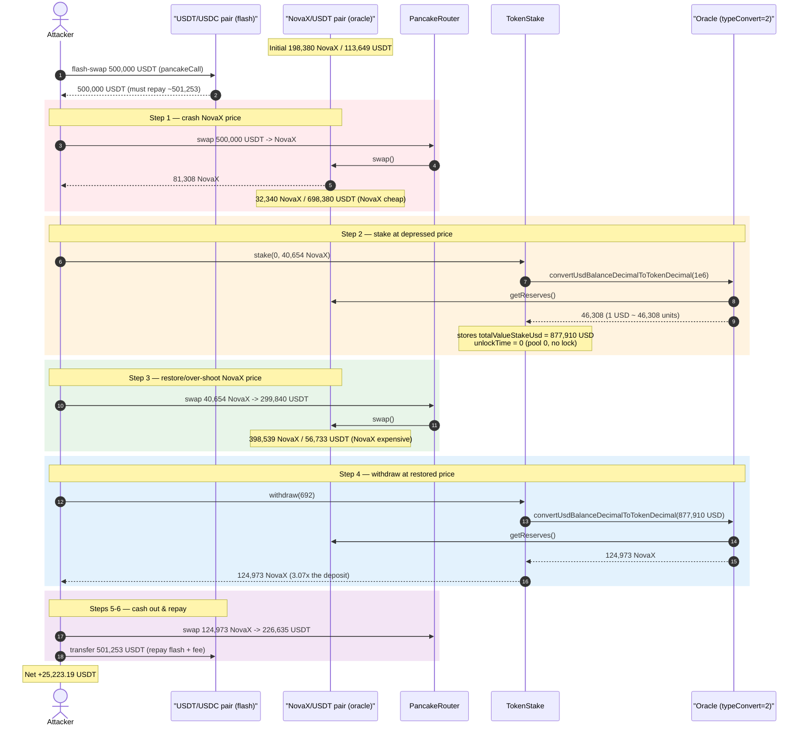
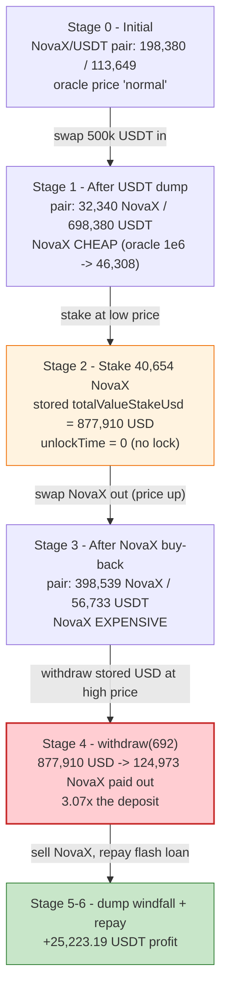
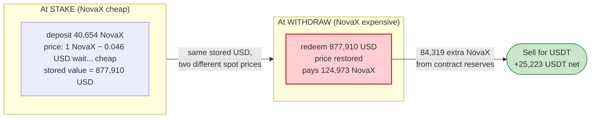

# NovaX M2E Exploit — Stake/Withdraw USD-Value Sandwich via Manipulable AMM Oracle

> **Reproduction:** the PoC compiles & runs in an isolated Foundry project at
> [this project folder](.) (the umbrella DeFiHackLabs repo contains many unrelated
> PoCs that do not whole-compile, so this one was extracted).
> Full verbose trace: [output.txt](output.txt).
> Verified vulnerable source: [contracts_token_stake_TokenStake.sol](sources/TokenStake_55C9EE/contracts_token_stake_TokenStake.sol)
> and [contracts_oracle_Oracle.sol](sources/Oracle_aEb77F/contracts_oracle_Oracle.sol).

---

## Key info

| | |
|---|---|
| **Loss** | ~$25,223 — net **25,223.19 USDT** extracted in a single transaction |
| **Vulnerable contract** | `TokenStake` — [`0x55C9EEbd368873494C7d06A4900E8F5674B11bD2`](https://bscscan.com/address/0x55C9EEbd368873494C7d06A4900E8F5674B11bD2#code) |
| **Faulty price source** | `Oracle` — [`0xaEb77FF298970A7fB6DC6f5c4a7f02426Db814Ea`](https://bscscan.com/address/0xaEb77FF298970A7fB6DC6f5c4a7f02426Db814Ea#code) (`typeConvert = 2`, reads PancakeSwap pair reserves) |
| **Victim pool / price oracle pair** | NovaX/USDT PancakeSwap pair — `0x05a911Cc7B9e1481a795Ba548049285715a6c7BC` |
| **Flash-loan source** | USDT/USDC pair — `0x7EFaEf62fDdCCa950418312c6C91Aef321375A00` (flash-swap of 500,000 USDT) |
| **NovaX token (M2E)** | `0xB800AFf8391aBACDEb0199AB9CeBF63771FcF491` |
| **Attack tx** | [`0xb1ad1188d620746e2e64785307a7aacf2e8dbda4a33061a4f2fbc9721048e012`](https://bscscan.com/tx/0xb1ad1188d620746e2e64785307a7aacf2e8dbda4a33061a4f2fbc9721048e012) |
| **Chain / block / date** | BSC / 41,116,210 / 2024-08-06 (04:05:48 UTC) |
| **Compiler** | Solidity ^0.8.8 |
| **Bug class** | Price-oracle manipulation — stored-USD-value sandwich across stake↔withdraw using a spot-AMM oracle |
| **Credit** | [@EXVULSEC](https://x.com/EXVULSEC/status/1820676684410147276) |

---

## TL;DR

`TokenStake` lets users stake the NovaX (M2E) token and later withdraw the **same dollar value** they
staked. The catch is *how* "dollar value" is measured. At **stake** time the contract converts the
deposited token amount into a USD figure and **stores that USD figure**
([TokenStake.sol:421,432](sources/TokenStake_55C9EE/contracts_token_stake_TokenStake.sol#L421-L432)).
At **withdraw** time it converts that *stored* USD figure back into tokens at the *then-current* price
([TokenStake.sol:632](sources/TokenStake_55C9EE/contracts_token_stake_TokenStake.sol#L632)). Both
conversions go through an `Oracle` whose price is just the **spot reserve ratio of the NovaX/USDT
PancakeSwap pair** (`typeConvert = 2`,
[Oracle.sol:48-68](sources/Oracle_aEb77F/contracts_oracle_Oracle.sol#L48-L68)).

Because the staked pool used (`poolId = 0`) has `duration = 0`, the stake has **no lock period** —
`unlockTime = 0`, so withdrawal is permitted in the very same transaction
([TokenStake.sol:424,626](sources/TokenStake_55C9EE/contracts_token_stake_TokenStake.sol#L424)).

The attacker therefore sandwiches their own stake/withdraw:

1. **Flash-borrow** 500,000 USDT and dump it into the NovaX/USDT pair, **crashing the NovaX price**
   (NovaX now appears cheap → 1 USD buys many NovaX).
2. **Stake** 40,654 NovaX while the price is depressed. With NovaX cheap, `tokenToUsd` records an
   **inflated** stored value of **877,910 USD** for those tokens.
3. **Buy NovaX back** from the pair, **restoring (over-shooting) the NovaX price** (NovaX now
   expensive → 1 USD buys few NovaX).
4. **Withdraw** the stake. `usdToToken` converts the stored 877,910 USD back into tokens at the
   *restored* high price, paying out **124,973 NovaX** — three times what was staked.
5. **Dump** the extra NovaX and the rest of the position back into the pair for USDT, repay the flash
   loan, and keep the difference.

The contract effectively buys NovaX from the attacker at the low price and sells it back at the high
price within one transaction. Net profit: **25,223.19 USDT**, drawn out of the staking contract's
NovaX reserves.

---

## Background — what NovaX TokenStake does

NovaX (M2E) is a Move-to-Earn project on BSC. The `TokenStake` contract
([source](sources/TokenStake_55C9EE/contracts_token_stake_TokenStake.sol)) is its single-token
staking module with an MLM/referral commission layer. Relevant mechanics:

- **Staking pools.** Six pools are predefined in `initStakePool`
  ([:74-116](sources/TokenStake_55C9EE/contracts_token_stake_TokenStake.sol#L74-L116)). **Pool 0**
  has `duration = 0` and `maxStakePerWallet = 0` (unlimited), and crucially a zero duration means a
  **zero unlock time** — i.e. *no lock at all*.
- **USD-denominated bookkeeping.** Each stake stores **both** the token amount (`totalValueStake`)
  and a USD valuation (`totalValueStakeUsd`) computed at deposit
  ([:431-432](sources/TokenStake_55C9EE/contracts_token_stake_TokenStake.sol#L431-L432)).
- **Withdrawal returns USD value, not the original tokens.** `withdraw` does **not** return the tokens
  you deposited; it converts your *stored USD value* back into tokens at the current oracle price and
  sends you that amount
  ([:632-634](sources/TokenStake_55C9EE/contracts_token_stake_TokenStake.sol#L632-L634)).
- **Price comes from an AMM-spot Oracle.** `tokenToUsd` / `usdToToken` both call the per-token
  `Oracle.convertUsdBalanceDecimalToTokenDecimal`
  ([:464-472](sources/TokenStake_55C9EE/contracts_token_stake_TokenStake.sol#L464-L472)).

On-chain state at the fork block (read from the trace):

| Parameter | Value |
|---|---|
| `oracle.typeConvert` | **2 ("only pancake")** — price = NovaX/USDT pair reserve ratio |
| Oracle `pairAddress` | `0x05a911…` (NovaX/USDT PancakeSwap pair) |
| NovaX/USDT pair reserves (pre-attack) | 198,380 NovaX / 113,649 USDT *(reserves shift heavily during the attack)* |
| NovaX held by `TokenStake` (payout reserve) | ~1,587,299 NovaX |
| Pool used by attacker | `poolId = 0` → `duration = 0` → `unlockTime = 0` (no lock) |

The `Oracle` source ships with a default `typeConvert = 1` (the *fixed* internal-swap rate from
`InternalSwap`), but the deployed instance was configured to `typeConvert = 2`, which returns the live
PancakeSwap reserve ratio — the trace shows the oracle call reading `getReserves()` and returning
exactly `(1e6 × tokenReserve) / stableReserve`. **That single configuration choice is what makes the
price manipulable.**

---

## The vulnerable code

### 1. Stake stores a USD value measured at the current (manipulable) price

```solidity
function stake(uint256 _poolId, uint256 _stakeValue) external override lock {
    ...
    stakeIndex = stakeIndex + 1;
    uint256 stakeValueUsd = tokenToUsd(stakeToken, _stakeValue);          // ⚠️ price snapshot at deposit

    // if pool duration = 0 => no limit for stake time, can claim every time
    uint256 unlockTimeEstimate = stakeTokenPools[_poolId].duration == 0
        ? 0                                                               // ⚠️ pool 0 ⇒ unlockTime = 0
        : (block.timestamp + (2592000 * stakeTokenPools[_poolId].duration));
    ...
    stakedToken[stakeIndex].totalValueStake     = _stakeValue;
    stakedToken[stakeIndex].totalValueStakeUsd  = stakeValueUsd;         // ⚠️ stored USD value
    ...
}
```
[TokenStake.sol:410-444](sources/TokenStake_55C9EE/contracts_token_stake_TokenStake.sol#L410-L444)

### 2. Withdraw pays out *tokens worth the stored USD value at the current price*

```solidity
function withdraw(uint256 _stakeId) public override lock {
    StakedToken memory _stakedUserToken = stakedToken[_stakeId];
    require(_stakedUserToken.userAddress == msg.sender, "TS:O");
    require(!_stakedUserToken.isWithdraw, "TS:W");
    require(canNotWithdraw[_stakeId] == 0, "TS:C");
    require(_stakedUserToken.unlockTime <= block.timestamp, "TS:T");      // ⚠️ pool 0: 0 <= now ⇒ passes immediately

    claimInternal(_stakeId);

    StakeTokenPools memory stakeTokenPool = stakeTokenPools[_stakedUserToken.poolId];
    address stakeToken = stakeTokenPool.stakeToken;
    uint256 withdrawTokenValue = usdToToken(stakeToken, _stakedUserToken.totalValueStakeUsd); // ⚠️ stored USD → tokens at NEW price
    require(IERC20(stakeToken).balanceOf(address(this)) >= withdrawTokenValue, "TS:E");
    require(IERC20(stakeToken).transfer(_stakedUserToken.userAddress, withdrawTokenValue), "TS:U");
    ...
}
```
[TokenStake.sol:621-658](sources/TokenStake_55C9EE/contracts_token_stake_TokenStake.sol#L621-L658)

### 3. Both conversions read a spot-AMM oracle

```solidity
function tokenToUsd(address token, uint256 _tokenAmount) public view returns (uint256) {
    address oracleContract = oracleContracts[token];
    return (1000000 * _tokenAmount) / IOracle(oracleContract).convertUsdBalanceDecimalToTokenDecimal(1000000);
}

function usdToToken(address token, uint256 _usdAmount) public view returns (uint256) {
    address oracleContract = oracleContracts[token];
    return IOracle(oracleContract).convertUsdBalanceDecimalToTokenDecimal(_usdAmount);
}
```
[TokenStake.sol:464-472](sources/TokenStake_55C9EE/contracts_token_stake_TokenStake.sol#L464-L472)

```solidity
// Oracle, with typeConvert == 2 ("only pancake"):
function convertUsdBalanceDecimalToTokenDecimal(uint256 _balanceUsdDecimal) public view returns (uint256) {
    ...
    if (pairAddress != address(0)) {
        (uint256 _reserve0, uint256 _reserve1, ) = IPancakePair(pairAddress).getReserves();
        (uint256 _tokenBalance, uint256 _stableBalance) = address(tokenAddress) < address(stableToken)
            ? (_reserve0, _reserve1) : (_reserve1, _reserve0);
        ...
        uint256 _tokenAmount = (_balanceUsdDecimal * _tokenBalance) / _stableBalance; // ⚠️ pure spot reserve ratio
        ...
        tokenPairConvert = _tokenAmount;
    }
    if (typeConvert == 1)      { return tokenInternalSwap; }
    else if (typeConvert == 2) { return tokenPairConvert; }   // ⚠️ deployed config: spot AMM price
    else { ... }
}
```
[Oracle.sol:48-80](sources/Oracle_aEb77F/contracts_oracle_Oracle.sol#L48-L80)

The oracle has **no TWAP, no staleness window, and no manipulation guard** — it returns the exact
instantaneous reserve ratio of a single PancakeSwap pair that anyone can move with a swap.

---

## Root cause — why it was possible

The protocol's invariant is *"a stake is worth a fixed number of dollars; withdrawal returns that
many dollars' worth of tokens."* That is only safe if "dollars" is measured by a **manipulation-
resistant** price. Here it is measured by the **spot reserve ratio of a PancakeSwap pair**, which a
single swap can move arbitrarily within one transaction. Three design facts compose into the bug:

1. **Spot-AMM oracle, both directions.** `tokenToUsd` (stake) and `usdToToken` (withdraw) read the
   same manipulable pair. The attacker controls the price at *each* of those two moments
   independently, in the same transaction.
2. **The USD valuation is frozen at deposit but redeemed at the current price.** Staking at a
   *depressed* NovaX price mints an *inflated* stored USD value; withdrawing at a *restored* price
   turns that inflated USD value into *more tokens* than were deposited. The asymmetry between the two
   prices is pure profit.
3. **Pool 0 has no lock (`duration = 0 ⇒ unlockTime = 0`).** This collapses the entire stake→withdraw
   cycle into a single transaction/block, so the attacker can wrap it in a flash-swap and never carry
   price risk.

Mechanically (numbers verified against the trace):

> **Stake:** at the depressed price, `convertUsdBalanceDecimalToTokenDecimal(1e6) = 46,308`
> (i.e. 1 USD ≈ 46,308 token-units worth, NovaX very cheap), so staking 40,654 NovaX records
> `totalValueStakeUsd = 1e6 × 40,654e18 / 46,308 = 877,910 USD`.
>
> **Withdraw:** at the restored price, the same oracle is re-queried with the stored 877,910 USD and
> returns `usdToToken = 877,910 × tokenReserve/stableReserve = 124,973 NovaX`.
>
> The contract paid out **124,973 NovaX for a 40,654 NovaX deposit — a 3.07× multiplier** funded
> entirely by the staking contract's own reserves.

This is the classic *"convert deposit to a stored fiat value, redeem the fiat value at spot"* pattern
combined with an unprotected AMM oracle — a known critical anti-pattern.

---

## Preconditions

- **`typeConvert = 2`** on the Oracle (or `0`, averaged with a manipulable pair) so the staking price
  tracks live AMM reserves. (Confirmed on-chain via the trace: oracle returns the pair-reserve ratio.)
- A staking pool with **no lock period** so stake and withdraw fit in one transaction. Pool 0
  (`duration = 0`) satisfies this.
- The `TokenStake` contract must hold enough NovaX to pay the inflated withdrawal (it held
  ~1.59M NovaX; the payout was 124,973 NovaX).
- Liquidity to swing the NovaX/USDT pair both ways and back — supplied here by a **flash swap** of
  500,000 USDT from the USDT/USDC pair, so **zero up-front capital** is required.

---

## Attack walkthrough (with on-chain numbers from the trace)

All figures are taken directly from the `Transfer`/`Swap`/`Sync` events and the oracle return values
in [output.txt](output.txt). Token amounts are 18-decimal; "NovaX/USDT pair" is `0x05a911…`.

| # | Step | NovaX/USDT pair state | Effect |
|---|------|-----------------------|--------|
| 0 | **Flash-borrow** 500,000 USDT from the USDT/USDC pair `0x7EFa…` ([output.txt:46-52](output.txt)) | NovaX 198,380 / USDT 113,649 *(pre-swap)* | Attacker holds 500,000 USDT, owes ~501,253 back. |
| 1 | **Swap 500,000 USDT → 81,308 NovaX** (USDT into the pair) ([output.txt:61-96](output.txt)) | NovaX **32,340** / USDT **698,380** | NovaX price **crashed**: pair now token-scarce, USDT-rich. |
| 2 | **Stake 40,654 NovaX into pool 0** ([output.txt:106-141](output.txt)). Oracle `convert(1e6)=46,308` ⇒ `totalValueStakeUsd = 877,910 USD` (storage slot `…080e`) | unchanged | Inflated USD value locked in; `unlockTime = 0`. |
| 3 | **Swap 40,654 NovaX → 299,840 USDT** (sell remaining NovaX back) ([output.txt:149-184](output.txt)) | NovaX **398,539** / USDT **56,733** | NovaX price **restored/over-shot**: pair now token-rich, USDT-scarce. |
| 4 | **`withdraw(692)`** ([output.txt:187-217](output.txt)). Oracle `convert(877,910 USD)=124,973 NovaX` ⇒ pays out **124,973 NovaX** | unchanged | Contract returns **3.07×** the staked tokens. |
| 5 | **Swap 124,973 NovaX → 226,635 USDT** (dump the windfall) ([output.txt:225-260](output.txt)) | NovaX **171,903** / USDT **131,717** | Converts the extra NovaX to USDT. |
| 6 | **Repay flash swap** — transfer **501,253.13 USDT** back to `0x7EFa…` ([output.txt:261-278](output.txt)) | — | Loan + 0.25% fee repaid. |
| 7 | **Final balance** ([output.txt:279-281](output.txt)) | — | Attacker USDT = **25,223.19** (profit). |

### The two oracle prices (the heart of the sandwich)

| Moment | Pair reserves (NovaX / USDT) | `convertUsdBalanceDecimalToTokenDecimal(1e6)` | Interpretation |
|---|---|---|---|
| **Stake** (after USDT dump) | 32,340 / 698,380 | **46,308** | NovaX dirt-cheap → small USD/token → records *huge* stored USD value |
| **Withdraw** (after buy-back) | 56,733 / 398,539 | **142,361** *(implied)* | NovaX expensive → stored USD buys *more* tokens back |

> Staking 40,654 NovaX recorded **877,910 USD**; that USD redeemed for **124,973 NovaX** at withdrawal.
> Net NovaX siphoned from the staking contract: **84,319 NovaX**, monetised to **25,223 USDT** after
> swap slippage, the 0.5% NovaX transfer tax (paid to `0xb45Fe3…`), and the flash-loan fee.

### Profit accounting (USDT)

| Direction | Amount (USDT) |
|---|---:|
| Flash-borrowed | 500,000.00 |
| Received — sell of staked NovaX (step 3) | 299,840.55 |
| Received — sell of withdrawal windfall (step 5) | 226,635.77 |
| **Total USDT in hand before repay** | **1,026,476.32** |
| Repaid — flash swap + 0.25% fee (step 6) | 501,253.13 |
| Returned to pair (capital that came from borrowed funds, net) | — |
| **Net profit** | **+25,223.19** |

The profit equals the NovaX the staking contract overpaid (84,319 NovaX) converted to USDT, minus AMM
slippage, the NovaX 0.5% sell tax, and the flash-loan fee — matching the trace's final attacker
balance of **25,223.193129471138 USDT** to the wei.

---

## Diagrams

### Sequence of the attack



### Pool / price state evolution



### Why the stored-USD redemption is theft



---

## Why each magic number

- **Flash-borrow 500,000 USDT** ([NovaXM2E_exp.sol:39-40](test/NovaXM2E_exp.sol#L39-L40)): large
  enough to dominate the NovaX/USDT pair's ~113k-USDT reserve and swing the price hard in both
  directions, yet repayable from the proceeds. Repaid as `swapamount * 10_000 / 9_975 + 1000`
  ([:57](test/NovaXM2E_exp.sol#L57)) — the PancakeSwap 0.25% flash-swap fee.
- **Stake `balance / 2`** ([NovaXM2E_exp.sol:52](test/NovaXM2E_exp.sol#L52)): the attacker stakes half
  the NovaX bought at the low price; the *other half* is immediately sold to push the price back up
  before withdrawal. Staking the full balance would leave nothing to move the price with.
- **Pool id `0`** ([:52](test/NovaXM2E_exp.sol#L52)): chosen precisely because `duration = 0` ⇒
  `unlockTime = 0`, the only pool that allows same-transaction withdrawal.

---

## Remediation

1. **Do not price stakes with a spot-AMM oracle.** Use a manipulation-resistant price: a Chainlink
   feed, or at minimum a time-weighted average price (TWAP) over several blocks. The single line
   `_tokenAmount = (_balanceUsdDecimal * _tokenBalance) / _stableBalance`
   ([Oracle.sol:57](sources/Oracle_aEb77F/contracts_oracle_Oracle.sol#L57)) is the root sink — it must
   not be reachable from value-bearing accounting.
2. **Withdraw the tokens that were deposited, not a re-priced USD value.** If the product goal is
   "stake X tokens, withdraw X tokens (+ yield)," store and return `totalValueStake` (the token
   amount), and use USD only for display. Converting deposit→USD→tokens across two independent prices
   is the entire vulnerability.
3. **Enforce a real lock / time delay on every pool.** A non-zero minimum lock makes a single-
   transaction stake↔withdraw impossible, defeating the flash-loan wrapper even if a manipulable
   oracle remains. Pool 0's `duration = 0` should never have been combined with USD-denominated
   redemption.
4. **Sample the price once, consistently.** If a stake records its value at price P, redemption should
   honor an invariant tied to P (e.g. return min(deposited tokens, USD-equivalent at a guarded price)),
   never a fresh, independently-manipulable spot read.
5. **Add deviation / sanity bounds.** The oracle already has `minTokenAmount`/`maxTokenAmount` clamp
   logic, but under `typeConvert = 2` it is bypassed
   ([Oracle.sol:59-67](sources/Oracle_aEb77F/contracts_oracle_Oracle.sol#L59-L67)) — the clamp result
   is overwritten by the raw `_tokenAmount` and then returned directly. Make per-call deviation limits
   binding for all `typeConvert` modes.

---

## How to reproduce

The PoC was extracted into a standalone Foundry project (the umbrella DeFiHackLabs repo has many
unrelated PoCs that fail under a whole-project `forge build`):

```bash
_shared/run_poc.sh 2024-08-NovaXM2E_exp -vvvvv
```

- RPC: a **BSC archive** endpoint is required (fork block 41,116,210 is historical). `foundry.toml`
  is pre-configured with a fork-capable BSC archive; most pruned public RPCs will fail with
  `header not found` / `missing trie node`.
- Result: `[PASS] testExploit()` with the attacker's USDT balance rising from 0 to **25,223.19**.

Expected tail:

```
Ran 1 test for test/NovaXM2E_exp.sol:ContractTest
[PASS] testExploit() (gas: 652398)
Logs:
  [End] Attacker USDT balance before exploit: 0.000000000000000000
  [End] Attacker USDT balance after exploit: 25223.193129471138332884

Suite result: ok. 1 passed; 0 failed; 0 skipped
```

---

*References: PoC header in [test/NovaXM2E_exp.sol](test/NovaXM2E_exp.sol); disclosure by
[@EXVULSEC](https://x.com/EXVULSEC/status/1820676684410147276); attack tx
[0xb1ad1188…48e012](https://bscscan.com/tx/0xb1ad1188d620746e2e64785307a7aacf2e8dbda4a33061a4f2fbc9721048e012).*
