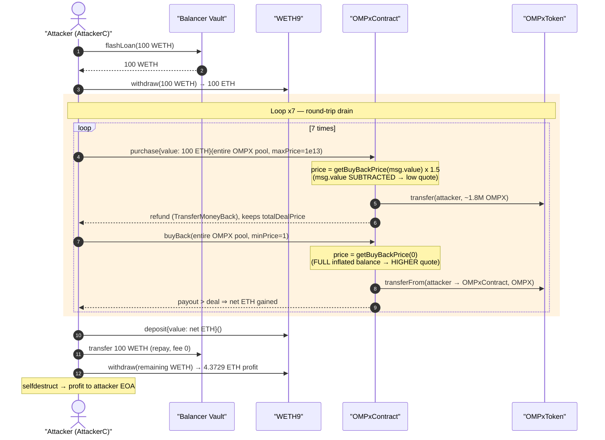
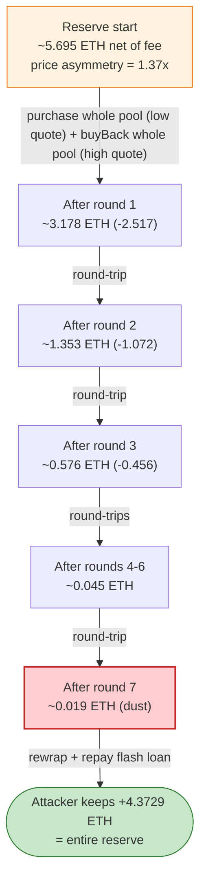
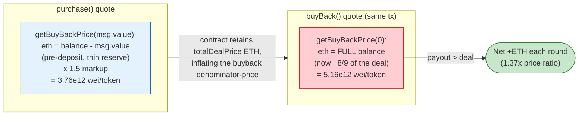

# OMPxContract Exploit — Purchase/BuyBack Price Asymmetry Round-Trip Drain

> **Vulnerability classes:** vuln/logic/incorrect-state-transition · vuln/logic/price-calculation

> One-line: a thinly-funded internal "market-maker" prices its OMPX token off its own ETH-balance/total-supply, and because a single `purchase` retains most of the buyer's ETH into that balance, the immediately-following `buyBack` quotes a *higher* per-token price than the purchase did — so buying the whole token pool and instantly selling it back nets free ETH, repeated until the reserve is empty.

> **Reproduction:** the PoC compiles & runs in an isolated Foundry project at
> [this project folder](.). Full verbose trace: [output.txt](output.txt).
> Verified vulnerable source: [OMPxContract.sol](sources/OMPxContract_09A801/OMPxContract.sol).

---

## Key info

| | |
|---|---|
| **Loss** | **4.372869914943298 ETH** (~$11,527 at the time) — the entire ETH reserve of `OMPxContract` |
| **Vulnerable contract** | `OMPxContract` — [`0x09A80172ED7335660327cD664876b5df6FE06108`](https://etherscan.io/address/0x09A80172ED7335660327cD664876b5df6FE06108#code) |
| **Victim / pool** | `OMPxContract` itself (it is its own ETH↔OMPX market-maker); OMPX token = [`0x633B041C41f61D04089880D7B5C7ED0F10fF6f85`](https://etherscan.io/address/0x633B041C41f61D04089880D7B5C7ED0F10fF6f85) |
| **Attacker EOA** | [`0x40d115198d71cab59668b51dd112a07d273d5831`](https://etherscan.io/address/0x40d115198d71cab59668b51dd112a07d273d5831) |
| **Attacker contract** | [`0xfaddf57d079b01e53d1fe3476cc83e9bcc705854`](https://etherscan.io/address/0xfaddf57d079b01e53d1fe3476cc83e9bcc705854) |
| **Attack tx** | [`0xd927843e30c6b2bf43103d83bca6abead648eac3cad0d05b1b0eb84cd87de9b6`](https://app.blocksec.com/explorer/tx/eth/0xd927843e30c6b2bf43103d83bca6abead648eac3cad0d05b1b0eb84cd87de9b6) |
| **Chain / block / date** | Ethereum mainnet / fork at 20,468,779 (`20_468_780 - 1`) / August 2024 |
| **Funding** | Balancer Vault flash loan (100 WETH, 0 fee) — only used as transient working capital |
| **Compiler** | OMPxContract & OMPxToken: Solidity **v0.4.21**, optimizer 200 runs |
| **Bug class** | Broken internal-AMM pricing invariant — purchase vs. buyback price asymmetry against a thin reserve |

---

## TL;DR

`OMPxContract` lets users `purchase()` OMPX with ETH and `buyBack()` OMPX for ETH. Both sides
price OMPX off the same formula —
`getBuyBackPrice = (contractEthBalance − feeBalance) · 1e18 / token.totalSupply()`
([OMPxContract.sol:347-359](sources/OMPxContract_09A801/OMPxContract.sol#L347-L359)) — i.e. the token
is "backed" by `contractBalance / totalSupply`.

The flaw is a **directional asymmetry combined with a thin reserve**:

- `purchase()` quotes its price via `getBuyBackPrice(msg.value)`, which **subtracts the incoming
  `msg.value` back out** of the balance before dividing
  ([:354](sources/OMPxContract_09A801/OMPxContract.sol#L354)), then applies a fixed `1.5×`
  discount-coefficient markup.
- `buyBack()` quotes via `getBuyBackPrice(0)` — the **full** current balance, which now *includes*
  the ~8/9 of the deal that `purchase()` just retained.

When the contract's standing ETH reserve (≈ **5.69 ETH** net of fee) is *tiny* relative to the
ETH a buyer pushes in (100 ETH from a flash loan), buying the **entire** OMPX pool and immediately
selling it back yields a per-token buyback price *higher* than the effective purchase price. Each
round-trip drains net ETH from the reserve. The attacker:

1. Flash-borrows 100 WETH from Balancer, unwraps to ETH.
2. Loops **7 times**: `purchase(entirePool, maxPrice=1e13)` with 100 ETH (most refunded), then
   `buyBack(entirePool, minPrice=1)`.
3. Each loop nets a shrinking slice of the reserve (2.52 → 1.07 → 0.46 → … ETH) until it is empty.
4. Rewraps and repays the 100 WETH flash loan; keeps **4.3729 ETH** of pure profit.

No price oracle, no liquidity pool, no roles were needed — just the contract's own broken quote math.

---

## Background — what OMPxContract does

`OMPxContract` ([source](sources/OMPxContract_09A801/OMPxContract.sol)) is a self-contained
ETH↔OMPX exchange written in 2018-era Solidity 0.4.21. It mints and holds `OMPxToken`
([source](sources/OMPxToken_633B04/OMPxToken.sol)) and acts as its own market-maker:

- **`purchase(tokensToPurchase, maxPrice)`** ([:374-419](sources/OMPxContract_09A801/OMPxContract.sol#L374-L419))
  — pay ETH, receive OMPX (minting more if the contract's own inventory is short). Excess ETH over
  the deal is refunded ("TransferMoneyBack"). A flat **9% "system support fee"** is set aside into
  `feeBalance`.
- **`buyBack(tokensToBuyBack, minPrice)`** ([:422-435](sources/OMPxContract_09A801/OMPxContract.sol#L422-L435))
  — return OMPX, receive ETH at the current buyback price.
- **Pricing** is *reserve-backed*: the per-token value is
  `(contractEthBalance − feeBalance) / totalSupply`
  ([getBuyBackPrice, :347-359](sources/OMPxContract_09A801/OMPxContract.sol#L347-L359)).
- **`getPurchasePrice`** marks that up by a tiered "buyer contribution coefficient"
  ([:362-369](sources/OMPxContract_09A801/OMPxContract.sol#L362-L369)). For very large amounts the
  coefficient is `150` against `descPrecision = 1e2`, i.e. a **1.5× markup**
  ([Discountable, :94-131](sources/OMPxContract_09A801/OMPxContract.sol#L94-L131)).

The on-chain state at the fork block (reconstructed from the trace):

| Quantity | Value |
|---|---|
| `token.totalSupply()` | **2,269,323 OMPX** (`2269323e18`) — constant throughout the attack |
| OMPX held by `OMPxContract` (its sellable inventory) | **1,799,614 OMPX** (`1799614e18…`) — the whole "pool", constant |
| `OMPxContract` ETH reserve net of `feeBalance`, before attack | **≈ 5.69 ETH** ← the prize |
| Discount coefficient for the attack amount | **150** (1.5× markup) |
| `descPrecision` / `defaultCoef` | `1e2` / `200` |

The decisive fact: the standing reserve (~5.69 ETH) is **17× smaller** than the 100 ETH the attacker
shoves through `purchase()`. That mismatch is what flips the normally-protective 1.5× markup into a
loss for the protocol.

---

## The vulnerable code

### 1. Reserve-backed price (the shared quote)

```solidity
// base price. How much eth-wui for 1e18 of wui-tokens (1 real token).
function getBuyBackPrice(uint256 buyBackValue) public view returns(uint256 price_) {
    if (address(this).balance==0) { return 0; }
    uint256 eth;
    uint256 tokens = token.totalSupply();
    if (buyBackValue > 0) {
        eth = address(this).balance.sub(buyBackValue);   // ← subtracts the inflow in purchase
    } else {
        eth = address(this).balance;                     // ← full balance in buyBack
    }
    return (eth.sub(feeBalance)).mul(1e18).div(tokens);
}
```
[OMPxContract.sol:347-359](sources/OMPxContract_09A801/OMPxContract.sol#L347-L359)

### 2. Purchase — quotes off `getBuyBackPrice(msg.value)`, marks up 1.5×, keeps the ETH

```solidity
function getPurchasePrice(uint256 purchaseValue, uint256 amount) public view returns(uint256 price_) {
    uint256 buyerContributionCoefficient = getDiscountByAmount(amount);          // 150 here
    uint256 price = getBuyBackPrice(purchaseValue).mul(buyerContributionCoefficient).div(descPrecision);
    if (price <= 0) {price = 1e11;}
    return price;
}

function purchaseSafe(uint256 tokensToPurchase, uint256 maxPrice) internal returns(uint256) {
    uint256 currentPrice = getPurchasePrice(msg.value, tokensToPurchase);        // msg.value subtracted inside
    require(currentPrice <= maxPrice);
    ...
    uint256 totalDealPrice = currentPrice.mul(tokensWuiAvailableByCurrentPrice).div(1e18);
    feeBalance = feeBalance + totalDealPrice.div(9);                             // 9% fee set aside
    ...
    token.safeTransfer(msg.sender, tokensWuiAvailableByCurrentPrice);
    // money back: refund msg.value - totalDealPrice  → contract NET-RETAINS totalDealPrice
    if (totalDealPrice < msg.value) {
        uint256 oddEthers = msg.value.sub(totalDealPrice);
        msg.sender.transfer(oddEthers);
    }
}
```
[OMPxContract.sol:362-419](sources/OMPxContract_09A801/OMPxContract.sol#L362-L419)

### 3. BuyBack — quotes off `getBuyBackPrice(0)` (full, now-inflated balance)

```solidity
function buyBack(uint256 tokensToBuyBack, uint256 minPrice) public {
    uint currentPrice = getBuyBackPrice(0);                                      // full balance, no subtraction
    require(currentPrice >= minPrice);
    uint256 totalPrice = tokensToBuyBack.mul(currentPrice).div(1e18);
    ...
    token.safeTransferFrom(msg.sender, this, tokensToBuyBack);
    msg.sender.transfer(totalPrice);                                            // pay out at the higher price
}
```
[OMPxContract.sol:422-435](sources/OMPxContract_09A801/OMPxContract.sol#L422-L435)

---

## Root cause — why it was possible

Conceptually the price is "ETH reserve per token." A sound market-maker must guarantee that
**what it pays out on a sell never exceeds what it took in on the matching buy.** OMPxContract's
two-quote design violates that:

1. **The purchase quote pretends the buyer's ETH is not there.** `getBuyBackPrice(msg.value)`
   subtracts the full `msg.value` ([:354](sources/OMPxContract_09A801/OMPxContract.sol#L354)) so the
   buyer is priced against the *pre-deposit* reserve. With a thin reserve (5.69 ETH) the base price
   is tiny: `5.69e18 · 1e18 / 2,269,323e18 ≈ 2.51e12` wei/token. The 1.5× markup gives a purchase
   price of `≈ 3.76e12` wei/token.

2. **The buyback quote uses the full, freshly-inflated reserve.** `purchase()` net-retains
   `totalDealPrice` ETH (the refund only returns the excess), so right after a purchase the standing
   reserve has grown by ~8/9 of the deal (1/9 goes to `feeBalance`, which is subtracted out). The
   buyback then divides this *larger* balance by the *same* total supply:
   `(5.69 + 6.77·8/9) ≈ 11.72 ETH` ⇒ price `≈ 5.16e12` wei/token.

3. **Buyback price (5.16e12) > purchase price (3.76e12).** Selling the same tokens back therefore
   pays more than the purchase cost. The 1.5× markup that *should* have created a protective spread is
   overwhelmed because the deal itself moves the reserve by far more than the markup, when the reserve
   starts thin relative to `msg.value`.

In one line:

> **Buying the entire token pool moves the reserve-backed price up by more than the purchase markup,
> so an instant round-trip (`purchase` → `buyBack`) is profitable whenever the standing reserve is
> small compared to the ETH pushed through the purchase.**

Two compounding design errors enable it:

- **Pricing off the contract's own mutable ETH balance** (a single-sided, manipulable quantity) rather
  than off a conserved invariant. The very act of trading changes the quote in the trader's favor.
- **Asymmetric `buyBackValue` handling** between the two entry points: purchase nets out the inflow,
  buyback does not. This is the exact lever the attacker pulls — and it requires no privileged role.

Note the attacker buys the **entire** inventory each time (`tokensToPurchase = balanceOf(OMPxContract)`)
and immediately returns it, so OMPX inventory and total supply are unchanged round-to-round; only the
ETH reserve is drained.

---

## Preconditions

- The contract's standing ETH reserve must be **small relative to the purchase `msg.value`**. With
  reserve ≈ 5.69 ETH and `msg.value = 100 ETH`, the asymmetry is large; the attacker top-loads the
  purchase from a flash loan precisely to maximize this ratio.
- `maxPrice` on `purchase` must be ≥ the quoted purchase price (attacker passes `1e13`, comfortably
  above the `≈3.76e12` quote) and `minPrice` on `buyBack` must be ≤ the quoted buyback price (attacker
  passes `1`). Both are caller-controlled, so trivially satisfied.
- Sufficient transient ETH to fund the 100-ETH purchases — supplied by a **Balancer flash loan**
  (100 WETH, **0 fee**), fully repaid in the same transaction. No real capital at risk.
- No access control or special state needed: `purchase` and `buyBack` are permissionless.

---

## Attack walkthrough (ground-truth numbers from the trace)

The attacker contract (`AttackerC`) runs the entire exploit inside `receiveFlashLoan`
([OMPxContract_exp.sol:65-94](test/OMPxContract_exp.sol#L65-L94)):

1. Borrow **100 WETH** from Balancer Vault, `withdraw()` to native ETH.
2. Loop 7×:
   - `purchase{value: 100 ether}(balanceOf(OMPxContract), 10_000_000_000_000)` — buys the **whole**
     OMPX inventory (`1,799,614 OMPX`), most of the 100 ETH refunded as `TransferMoneyBack`.
   - `buyBack(balanceOf(self), 1)` — returns the whole inventory, receives ETH at the higher buyback
     price.
3. `deposit()` net ETH back to WETH, `transfer` 100 WETH to Balancer (fee 0), `withdraw()` the
   remaining WETH → keep the ETH profit. `selfdestruct` sends profit to the attacker EOA.

All ETH figures below are taken directly from the `Purchase` / `TransferMoneyBack` / `BuyBack` events
in [output.txt](output.txt). "Reserve" = contract ETH net of `feeBalance`.

| # | Reserve before (ETH) | `purchase` deal kept (ETH) | `buyBack` paid out (ETH) | Net drained (ETH) | Reserve after (ETH) |
|---|---:|---:|---:|---:|---:|
| 1 | 5.6950 | 6.7743 | 9.2914 | **2.5171** | 3.1778 |
| 2 | 2.4251 | 2.8847 | 3.9566 | **1.0719** | 1.3532 |
| 3 | 1.0327 | 1.2284 | 1.6849 | **0.4564** | 0.5763 |
| 4 | 0.4398 | 0.5231 | 0.7175 | **0.1944** | 0.2454 |
| 5 | 0.1873 | 0.2228 | 0.3055 | **0.0828** | 0.1045 |
| 6 | 0.0797 | 0.0949 | 0.1301 | **0.0352** | 0.0445 |
| 7 | 0.0340 | 0.0404 | 0.0554 | **0.0150** | 0.0189 |
| | | | | **Σ 4.3729** | |

Each round captures a geometrically-shrinking slice of the reserve (the asymmetry gets smaller as the
reserve grows relative to the 100-ETH inflow effect after partial drains — but it never turns negative,
so the attacker simply harvests until it is dust). The first round alone takes **2.52 ETH** of the
~5.7-ETH reserve; seven rounds extract **4.3729 ETH** total — confirmed by the end-of-test log:

```
[Start] Attacker ETH balance before exploit: 0.000000000000000000
[End]   Attacker ETH balance after  exploit: 4.372869914943298279
```

### Per-iteration price asymmetry (iteration 1, exact)

| Quantity | Value | Source |
|---|---|---|
| `totalSupply` | 2,269,323e18 | `OMPxToken::totalSupply()` |
| OMPX inventory bought | 1,799,614e18 (+574900 wei) | `OMPxToken::balanceOf(OMPxContract)` |
| Purchase price quoted | `3.7643e12` wei/token | `Purchase.deal / inventory` |
| BuyBack price quoted | `5.1630e12` wei/token | `BuyBack.payout / inventory` |
| **Price ratio (buyback / purchase)** | **1.372×** | profit lever |
| `purchase` deal retained | 6.7743 ETH | `Purchase` event param2 |
| `buyBack` payout | 9.2914 ETH | `BuyBack` event olasAmount |
| Net to attacker | **+2.5171 ETH** | payout − deal |

---

## Profit / loss accounting (ETH)

| Direction | Amount |
|---|---:|
| Flash-loan principal in (WETH→ETH) | 100.000000 (transient) |
| Σ ETH net-retained by contract across the 7 `purchase()` calls | 11.768581 |
| Σ ETH received from the 7 `buyBack()` calls | 16.141451 |
| Flash-loan repaid (WETH, fee 0) | 100.000000 (transient) |
| **Net profit to attacker** (`16.141451 − 11.768581`) | **+4.372869914943298** |
| **Loss to OMPxContract (reserve drained)** | **−4.372869914943298** |

The net profit equals the contract's entire pre-attack ETH reserve (net of `feeBalance`) to the wei.
The flash loan washes out completely (0 fee, fully repaid); it is purely a capital amplifier that
maximizes the reserve-vs-`msg.value` asymmetry.

---

## Diagrams

### Sequence of the attack



### Reserve evolution (the round-trip drain)



### Why a round-trip is profitable (the quote asymmetry)



---

## Why each magic number

- **100 ETH purchase `msg.value`:** chosen far larger than the ~5.7-ETH reserve. The asymmetry is
  driven by the ratio `msg.value / reserve`; a large `msg.value` makes `getBuyBackPrice(msg.value)`
  price the buyer against an almost-empty reserve (cheap) while the retained deal then richly inflates
  the buyback quote. Sourced from a 0-fee flash loan so it costs nothing.
- **`maxPrice = 1e13`:** an upper bound on the purchase price; the real quote (`≈3.76e12`) is well
  under it, so `require(currentPrice <= maxPrice)` passes every round.
- **`minPrice = 1`:** a lower bound on the buyback price; any positive quote clears it.
- **`tokensToPurchase = balanceOf(OMPxContract)`:** buy the *entire* OMPX inventory so the maximum
  reserve-backed value is round-tripped; selling it all back at the higher buyback price extracts the
  largest possible slice per loop.
- **7 iterations:** empirically the point of diminishing returns — by round 7 the per-loop net is only
  0.015 ETH and the reserve is dust; further loops would net negligible amounts.

---

## Remediation

1. **Never price both sides off the contract's own mutable ETH balance without conservation.** A
   self-AMM must guarantee `payout(sell) ≤ cost(buy)` for an instant round-trip. Either use a
   conserved invariant (constant-product / virtual reserves that both sides update symmetrically) or
   an external price source, not `balance / totalSupply` which the trade itself moves.
2. **Make the two quotes symmetric.** The bug is that `purchase` subtracts `msg.value` while
   `buyBack` does not. Price both directions against the *same* reference balance (e.g. the
   pre-trade balance for both), so the markup actually produces a protective spread instead of being
   swamped by the deposit's effect on the reserve.
3. **Cap single-trade size relative to the reserve.** Reject any `purchase`/`buyBack` whose
   `msg.value` (or token amount) exceeds a small fraction of the standing reserve, so no single trade
   can dominate the quote.
4. **Add a round-trip / same-block guard.** Disallow buying and selling within the same transaction
   or block, defeating the instant arbitrage loop and any flash-loan amplification.
5. **Charge the fee on both legs and credit it consistently.** The asymmetric treatment of
   `feeBalance` between the buy and sell quotes contributes to the directional bias; fee accounting
   must not create a price gap that favors round-trips.

---

## How to reproduce

```bash
_shared/run_poc.sh 2024-08-OMPxContract_exp -vvvvv
```

- RPC: a **mainnet archive** endpoint is required (fork block 20,468,779). `foundry.toml` uses an
  Infura archive endpoint; the flash loan + replayed exchange calls need historical state at that
  block.
- Result: `[PASS] testExploit()`, attacker ETH balance `0 → 4.372869914943298279`.

Expected tail ([output.txt](output.txt)):

```
[PASS] testExploit() (gas: 1475935)
Logs:
  [Start] Attacker ETH balance before exploit: 0.000000000000000000
  [End] Attacker ETH balance after exploit: 4.372869914943298279

Suite result: ok. 1 passed; 0 failed; 0 skipped
```

---

*Vulnerable sources fetched via Etherscan V2 into [sources/](sources/):
[OMPxContract.sol](sources/OMPxContract_09A801/OMPxContract.sol) and
[OMPxToken.sol](sources/OMPxToken_633B04/OMPxToken.sol). PoC: [test/OMPxContract_exp.sol](test/OMPxContract_exp.sol).*
