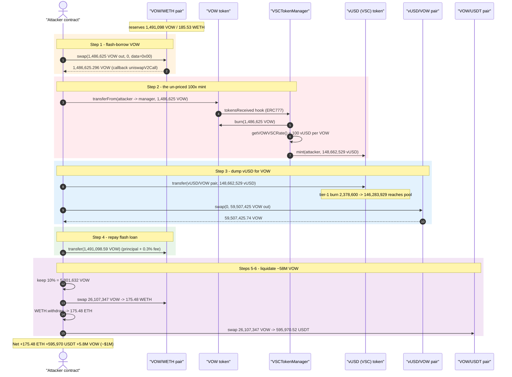
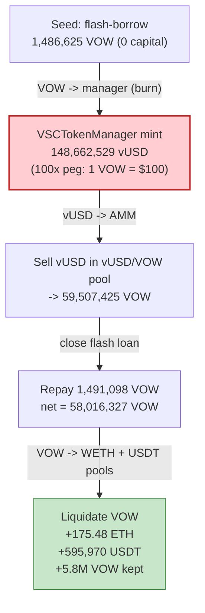
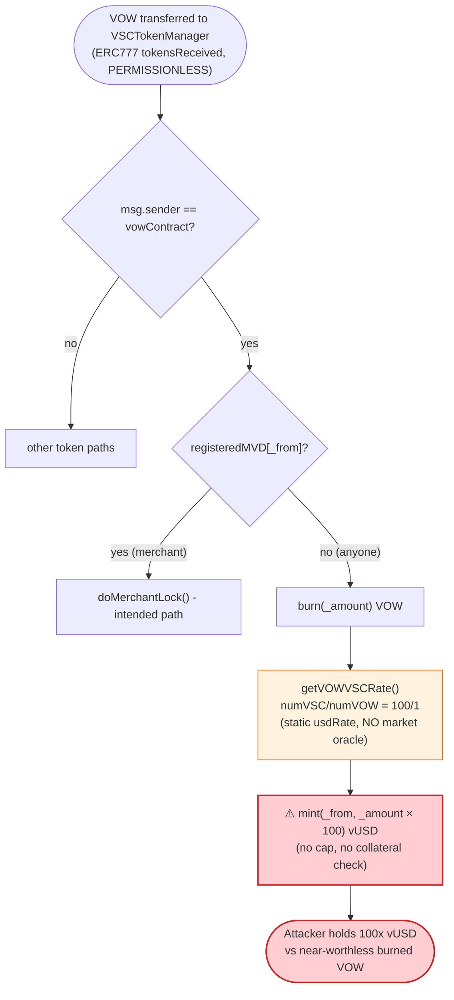
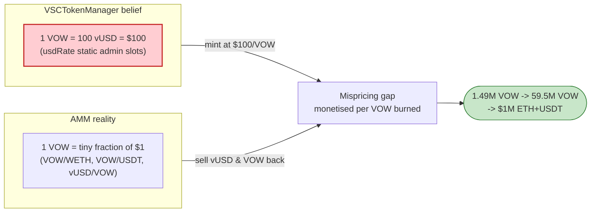

# VOW / Vow Finance Exploit — Permissionless 100× VOW→vUSD `tokensReceived` Mint Mispricing

> One-liner: anyone could send VOW to the `VSCTokenManager` and have it burn that VOW and mint **100× its
> nominal value in vUSD (VSC)** for free — at a `usdRate` that was wildly above VOW's real market price —
> which the attacker recycled through the vUSD/VOW pool to multiply ~1.49M VOW into ~58M VOW and drain
> the VOW/WETH and VOW/USDT pools.

> **Reproduction:** the PoC compiles & runs in this isolated Foundry project at
> [this project folder](.) (the umbrella DeFiHackLabs repo does not whole-compile, so this PoC was
> extracted standalone). Full verbose trace: [output.txt](output.txt).
> Verified vulnerable source: [VSCTokenManager.sol](sources/VSCTokenManager_184497/VSCTokenManager.sol).

---

## Key info

| | |
|---|---|
| **Loss** | ~$1.0M — **175.48 ETH** + **595,970.52 USDT** + **5,801,632.71 VOW** extracted, draining the VOW/WETH, VOW/USDT and vUSD/VOW pools |
| **Vulnerable contract** | `VSCTokenManager` — [`0x184497031808F2b6A2126886C712CC41f146E5dC`](https://etherscan.io/address/0x184497031808F2b6A2126886C712CC41f146E5dC#code) (the un-priced burn-and-mint hook) |
| **Mispriced token** | `VOWToken` (VOW) — [`0x1BBf25e71EC48B84d773809B4bA55B6F4bE946Fb`](https://etherscan.io/address/0x1BBf25e71EC48B84d773809B4bA55B6F4bE946Fb#code) ; `VSCToken`/vUSD — [`0x0fc6C0465C9739d4a42dAca22eB3b2CB0Eb9937A`](https://etherscan.io/address/0x0fc6C0465C9739d4a42dAca22eB3b2CB0Eb9937A#code) |
| **Victim pools** | VOW/WETH (Uni-V2) `0x7FdEB46b3a0916630f36E886D675602b1007Fcbb` · vUSD/VOW `0x97BE09f2523B39B835Da9EA3857CfA1D3C660cBb` · VOW/USDT `0x1E49768714E438E789047f48FD386686a5707db2` |
| **Attacker EOA** | [`0x48de6bF9e301946b0a32b053804c61DC5f00c0c3`](https://etherscan.io/address/0x48de6bf9e301946b0a32b053804c61dc5f00c0c3) |
| **Attack contract** | `0xb7f221e373e3f44409f91c233477ec2859261758` |
| **Attack tx** | [`0x758efef41e60c0f218682e2fa027c54d8b67029d193dd7277d6a881a24b9a561`](https://etherscan.io/tx/0x758efef41e60c0f218682e2fa027c54d8b67029d193dd7277d6a881a24b9a561) |
| **Chain / block / date** | Ethereum mainnet / fork at 20,519,308 (attack block 20,519,309) / Aug 13, 2024 |
| **Compiler** | Vulnerable contracts: Solidity **v0.6.7** (optimizer off, 200 runs); PoC: ^0.8.x |
| **Bug class** | Economic / oracle mispricing — un-validated, permissionless mint at a stale internal `usdRate` peg far above market price |

---

## TL;DR

`VSCTokenManager` implements the VOW→vUSD conversion: send VOW to it (via the ERC777 `tokensReceived`
hook), it **burns** the VOW and **mints** you vUSD ("VSC", a $1-pegged stablecoin) at an internal
*price oracle* expressed as `usdRate`. The conversion rate is computed as
`vscAmount = vowAmount × numVSC / numVOW`, where `numVSC` / `numVOW` come purely from the two tokens'
hard-coded `usdRate` storage slots ([VSCTokenManager.sol:2752-2767](sources/VSCTokenManager_184497/VSCTokenManager.sol#L2752-L2767)).

At the fork block those rates valued **1 VOW at 100 vUSD** (`numVSC/numVOW = 100`), i.e. the protocol
priced VOW at **$100** internally — but on the open market VOW was worth a tiny fraction of that. The
conversion is:

- **permissionless** — anyone who isn't a registered MVD merchant hits the plain burn-and-mint path;
- **un-collateralised** — vUSD is minted out of thin air, backed only by the burned VOW *valued at the
  bogus $100 peg*;
- **oracle-free** — `usdRate` is a static admin value, never reconciled against the VOW/WETH, VOW/USDT or
  vUSD/VOW AMM prices.

So the attacker:

1. **Flash-borrows 1,486,625.30 VOW** from the VOW/WETH pair (a Uni-V2 `swap` with a callback, repaid at
   the end).
2. Sends that VOW to `VSCTokenManager`, which burns it and **mints 148,662,529.62 vUSD** (×100).
3. **Dumps the vUSD into the vUSD/VOW pool**, receiving **59,507,425.74 VOW** back — turning 1.49M VOW
   into ~59.5M VOW.
4. **Repays** the 1.49M-VOW flash loan, keeping a net **~58,016,327 VOW**.
5. Liquidates that VOW: 10% kept as VOW, half sold for **175.48 ETH** (via VOW/WETH), the rest sold for
   **595,970.52 USDT** (via VOW/USDT).

Net result ≈ **$1M** in ETH + USDT + VOW, all from a single un-priced mint.

---

## Background — what Vow Finance does

Vow is a "stored-value" / merchant-settlement system built on a family of ERC777+ERC20 tokens (the
`Token` → `VOWToken` → `VSCToken` hierarchy in
[VSCTokenManager.sol](sources/VSCTokenManager_184497/VSCTokenManager.sol)):

- **VOW** — the protocol's main token, with a `usdRate` (a `uint256[2]` numerator/denominator giving its
  USD value) settable by an `usdRateSetter` ([:904-905](sources/VSCTokenManager_184497/VSCTokenManager.sol#L904-L905), [:981-988](sources/VSCTokenManager_184497/VSCTokenManager.sol#L981-L988)).
- **VSC / vUSD** — a "value stable coin" derived from `VOWToken` ([VSCToken:1033](sources/VSCTokenManager_184497/VSCTokenManager.sol#L1033)). It has its own `usdRate`
  (pegged to $1) plus tier-1 burn mechanics on transfer.
- **VSCTokenManager** — the conversion engine ([:2644](sources/VSCTokenManager_184497/VSCTokenManager.sol#L2644)). When VOW lands on it via the ERC777 recipient hook it
  burns VOW and mints vUSD according to the two tokens' `usdRate`s. When vUSD lands on it, it performs
  merchant unlock accounting.

All tokens are ERC777, so transfers route through the ERC-1820 registry to the recipient's
`tokensReceived` hook — that hook is what makes the manager's logic fire automatically on a plain
`transfer`/`transferFrom`.

The on-chain `usdRate` configuration at the fork block (read directly from the trace's `usdRate(...)`
staticcalls, [output.txt:100-107](output.txt#L100-L107)):

| Call | Returned |
|---|---|
| `VOWToken.usdRate(0)` (VOW numerator) | **1** |
| `VOWToken.usdRate(1)` (VOW denominator) | **100** |
| `VSCToken.usdRate(0)` (vUSD numerator) | **1** |
| `VSCToken.usdRate(1)` (vUSD denominator) | **1** |

Plugging into `getVOWVSCRate()`:

```
numVOW = VOW.usdRate(0) × vUSD.usdRate(1) = 1 × 1   = 1
numVSC = VOW.usdRate(1) × vUSD.usdRate(0) = 100 × 1 = 100
```

→ **1 VOW mints 100 vUSD.** The protocol internally believes 1 VOW = $100. That belief was the entire
attack.

---

## The vulnerable code

### 1. The permissionless burn-and-mint hook

```solidity
// VSCTokenManager.tokensReceived — fires automatically when VOW is transferred to the manager
function tokensReceived(address, address _from, address, uint256 _amount, bytes calldata _data, bytes calldata)
    external virtual override
{
    if (msg.sender == vowContract)
        tokensReceivedVOW(_from, _data, _amount);   // ← the VOW path the attacker uses
    else if (msg.sender == token)
        tokensReceivedThisVSC(_from, _data, _amount);
    else
        revert("Bad token");
}
```
[VSCTokenManager.sol:2727-2739](sources/VSCTokenManager_184497/VSCTokenManager.sol#L2727-L2739)

```solidity
function tokensReceivedVOW(address _from, bytes memory _data, uint256 _amount) private {
    if (registeredMVD[_from]) {                       // merchants take the locking path...
        (address merchant, bytes memory data) = abi.decode(_data, (address, bytes));
        doMerchantLock(_from, merchant, _amount, data);
        return;
    }

    VOWToken(vowContract).burn(_amount, "");          // ⚠️ burn the VOW the sender just delivered
    (uint256 numVOW, uint256 numVSC) = getVOWVSCRate();
    uint256 vscAmount = _amount.mul(numVSC).div(numVOW); // ⚠️ = _amount × 100  (no oracle, no cap)
    VSCToken(token).mint(_from, vscAmount);           // ⚠️ mint 100× vUSD to the sender

    emit LogBurnAndMint(_from, _amount, vscAmount);
}
```
[VSCTokenManager.sol:2752-2767](sources/VSCTokenManager_184497/VSCTokenManager.sol#L2752-L2767)

Any address that is **not** a `registeredMVD` falls straight through to the plain mint path. There is no
KYC, no whitelist, no per-tx cap, and no reconciliation of `numVSC/numVOW` against any market price.

### 2. The "price oracle" is two static admin slots

```solidity
function getVOWVSCRate() public view returns (uint256 numVOW_, uint256 numVSC_) {
    VSCToken vscToken = VSCToken(token);
    VOWToken vowToken = VOWToken(vowContract);
    numVOW_ = vowToken.usdRate(0).mul(vscToken.usdRate(1));   // 1 × 1   = 1
    numVSC_ = vowToken.usdRate(1).mul(vscToken.usdRate(0));   // 100 × 1 = 100
}
```
[VSCTokenManager.sol:2741-2750](sources/VSCTokenManager_184497/VSCTokenManager.sol#L2741-L2750)

`usdRate` is plain storage, settable only by the `usdRateSetter`
([VSCTokenManager.sol:981-988](sources/VSCTokenManager_184497/VSCTokenManager.sol#L981-L988)) — it is a
*manually-maintained peg*, not a live oracle. When VOW's real market price drifted far below the $100
internal value, the burn-and-mint became a money printer.

### 3. vUSD is mintable for free by the manager

`mint` is gated by `onlyMinter` ([Token:804-809](sources/VSCTokenManager_184497/VSCTokenManager.sol#L804-L809)), and the
`VSCTokenManager` is an authorised minter — so its un-priced `mint(_from, vscAmount)` call always
succeeds with no collateral lock-up.

---

## Root cause — why it was possible

The protocol treats `usdRate` as ground truth for converting VOW into a *dollar-pegged stablecoin*, but:

1. **The price feed is a static admin parameter, not a market oracle.** `getVOWVSCRate()` reads only the
   two `usdRate` slots. Nothing checks them against the VOW/WETH, VOW/USDT or vUSD/VOW AMM prices, so any
   gap between the internal peg ($100/VOW) and the market price (≪ $1/VOW) is directly monetisable.
2. **The conversion is permissionless and uncapped.** `tokensReceivedVOW`'s mint branch is reachable by
   any non-merchant address with arbitrary `_amount`
   ([:2752-2764](sources/VSCTokenManager_184497/VSCTokenManager.sol#L2752-L2764)). There is no per-block
   throttle and no slippage/size guard, so the attacker minted nine figures of vUSD in one call.
3. **Minting a "stablecoin" with no backing reconciliation.** vUSD is minted *as if* the burned VOW were
   worth $100 each, but the only thing destroyed is the (near-worthless) VOW. The freshly-minted vUSD is
   then immediately sellable into the deep vUSD/VOW liquidity, converting paper value into real VOW.
4. **A closed arbitrage loop exists on-chain.** Because VOW ⇄ vUSD (manager) and vUSD ⇄ VOW (AMM) both
   exist and are mispriced relative to each other, the cycle `VOW → 100× vUSD → ~40× VOW` is a
   self-funding loop. A flash loan supplies the seed VOW with zero capital at risk.

In one sentence: **the manager minted a $1 stablecoin against VOW valued at a hard-coded $100 peg that no
longer matched reality, with no access control, no cap, and no oracle.**

---

## Preconditions

- VOW's real market price ≪ the internal `usdRate` peg (1 VOW ≈ $100 internally). Met: VOW had collapsed,
  so the 100× mint massively overpaid.
- The attacker is **not** a `registeredMVD` (so it hits the plain mint branch, not `doMerchantLock`). Met:
  a fresh EOA/contract.
- Deep vUSD/VOW liquidity to absorb the minted vUSD and return VOW (pool held ~74M vUSD / ~89.7M VOW).
  Met.
- Seed VOW to enter the loop — obtained with **zero capital** by flash-borrowing 1.49M VOW from the
  VOW/WETH pair via a Uni-V2 `swap` + `uniswapV2Call` callback
  ([VOW_exp.sol:58](test/VOW_exp.sol#L58), [:92-112](test/VOW_exp.sol#L92-L112)). The whole exploit
  fits in a single transaction.

---

## Attack walkthrough (with on-chain numbers from the trace)

The attack runs entirely inside the `uniswapV2Call` flash-swap callback
([VOW_exp.sol:92-112](test/VOW_exp.sol#L92-L112)) plus the post-callback liquidation in `testExploit`.
All figures are taken directly from `Swap` / `Sync` / `LogBurnAndMint` events and `getReserves`
staticcalls in [output.txt](output.txt).

| # | Step | Numbers (from trace) | Effect |
|---|------|----------------------|--------|
| 1 | **Flash-borrow VOW** from VOW/WETH pair (`swap(vowBalance-1, 0, …)`) | borrow **1,486,625.296 VOW** ([:52-53](output.txt#L52-L53)) | seed capital, repaid in step 6 |
| 2 | **Send VOW → VSCTokenManager** (`transferFrom(attacker → manager)`), firing `tokensReceived` | burns 1,486,625.296 VOW, mints **148,662,529.62 vUSD** ([:89](output.txt#L89), [:108](output.txt#L108), [:119](output.txt#L119)) | **100× mint** — the core bug |
| 3 | **Dump vUSD into vUSD/VOW pool** (`transfer` applies a 2,378,600 VSC tier-1 burn, then `swap`) | 146,283,929.14 vUSD in → **59,507,425.74 VOW out** ([:149](output.txt#L149), [:188](output.txt#L188)) | 1.49M VOW → 59.5M VOW |
| 4 | **Repay flash loan** to VOW/WETH pair | return **1,491,098.59 VOW** (1.486M principal + 0.3% fee) ([:194](output.txt#L194), [:213](output.txt#L213)) | callback satisfied |
| 5 | **Net VOW captured** in attack contract | **58,016,327.15 VOW** ([:220](output.txt#L220)) | the prize, denominated in VOW |
| 6a | Keep **10%** of VOW (`transfer(attacker, bal/10)`) | **5,801,632.71 VOW** to attacker ([:221](output.txt#L221)) | |
| 6b | Sell **half** of VOW for ETH via VOW/WETH (then `WETH.withdraw`) | 26,107,347.22 VOW → **175.4778 WETH → ETH** ([:253-265](output.txt#L253-L265), [:269](output.txt#L269)) | |
| 6c | Sell **remainder** of VOW for USDT via VOW/USDT | 26,107,347.22 VOW → **595,970.52 USDT** ([:297-309](output.txt#L297-L309)) | |

### Reserves seen along the way

| Pool (token0 / token1) | Before | After |
|---|---|---|
| vUSD/VOW `0x97BE…0cBb` (vUSD/VOW) | 74,044,071.31 vUSD / 89,718,744.18 VOW ([:144](output.txt#L144)) | 220,328,000.46 vUSD / 30,211,318.44 VOW ([:187](output.txt#L187)) |
| VOW/WETH `0x7FdE…Fcbb` (VOW/WETH) | 1,491,098.59 VOW / 185.53 WETH ([:235](output.txt#L235)) | 27,598,445.81 VOW / 10.05 WETH ([:264](output.txt#L264)) |
| VOW/USDT `0x1E49…7db2` (VOW/USDT) | 1,953,847.94 VOW / 640,706.57 USDT ([:279](output.txt#L279)) | 28,061,195.16 VOW / 44,736.05 USDT ([:308](output.txt#L308)) |

The VOW/WETH pool's WETH reserve falls from 185.53 → 10.05 (≈ 175.48 WETH out), and the VOW/USDT pool's
USDT reserve falls from 640,706.57 → 44,736.05 (≈ 595,970.52 USDT out) — both pools were essentially
drained of their non-VOW side.

### Profit accounting

| Asset | Attacker before | Attacker after | Δ |
|---|---:|---:|---:|
| ETH | 0.143035 | 175.620817 | **+175.477782** ([:49](output.txt#L49), [:333](output.txt#L333)) |
| USDT | 0 | 595,970.517680 | **+595,970.52** ([:48](output.txt#L48), [:332](output.txt#L332)) |
| VOW | 0 | 5,801,632.714644 | **+5,801,632.71** ([:43](output.txt#L43), [:327](output.txt#L327)) |

At Aug-2024 prices (ETH ≈ $2,700) the ETH + USDT alone ≈ **$1.07M**; public reporting put the loss at
~$1M. The minted-and-recycled VOW carried no real capital cost — the seed was flash-borrowed and repaid —
so essentially the **entire haul is profit**.

---

## Diagrams

### Sequence of the attack



### Value loop / state evolution



### The flaw inside `tokensReceivedVOW`



### Why it is theft: internal peg vs. market price



---

## Remediation

1. **Price the conversion against a real, manipulation-resistant oracle — not a static admin slot.**
   `getVOWVSCRate()` should derive VOW's USD value from a Chainlink feed or a TWAP, and *refuse* to mint
   if the internal `usdRate` deviates beyond a tight band from the market price. The static `usdRate`
   peg ([:2741-2750](sources/VSCTokenManager_184497/VSCTokenManager.sol#L2741-L2750)) is the root cause.
2. **Collateralise vUSD.** A $1-pegged stablecoin must be backed by assets worth $1 at the time of mint.
   Minting vUSD against VOW valued at a peg that exceeds VOW's market price creates undercollateralised
   supply that is immediately arbitrageable.
3. **Gate and cap the mint path.** `tokensReceivedVOW`'s non-merchant branch
   ([:2752-2764](sources/VSCTokenManager_184497/VSCTokenManager.sol#L2752-L2764)) should at minimum apply
   per-tx / per-block size limits and slippage protection, or restrict large conversions to
   whitelisted/KYC'd flows — un-throttled nine-figure mints should be impossible.
4. **Break the self-funding loop.** Where both a manager conversion (VOW→vUSD) and an AMM (vUSD→VOW)
   exist, ensure the two prices are reconciled so no round-trip yields more than it costs; otherwise any
   flash loan turns the gap into free money.
5. **Disable conversions when the peg is stale.** Add a freshness/heartbeat check so that if `usdRate`
   has not been updated within a configured window (or diverges from the oracle), `tokensReceivedVOW`
   reverts instead of minting at a stale price.

---

## How to reproduce

The PoC was extracted into a standalone Foundry project (the umbrella DeFiHackLabs repo does not
whole-compile under `forge test`):

```bash
_shared/run_poc.sh 2024-08-VOW_exp -vvvvv
```

- RPC: an **Ethereum mainnet archive** endpoint is required (fork block 20,519,308 is from Aug 2024).
  `foundry.toml` uses an Infura archive endpoint; pruned RPCs fail with `missing trie node`.
- Result: `[PASS] testExploit()`.

Expected tail (from [output.txt](output.txt)):

```
[PASS] testExploit() (gas: 571518)
  After exploit: VOW balance of attacker:: 5801632.714644004917570378
  After exploit: USDT balance of attacker:: 595970.517680
  After exploit: ETH balance of attacker:: 175.620817063726256189

Suite result: ok. 1 passed; 0 failed; 0 skipped
```

---

*Reference: SlowMist / DeFiHackLabs — Vow Finance (VOW), Ethereum, Aug 13 2024, ~$1M. The vulnerable
contract is the verified `VSCTokenManager` at
[0x184497031808F2b6A2126886C712CC41f146E5dC](https://etherscan.io/address/0x184497031808F2b6A2126886C712CC41f146E5dC#code).*
