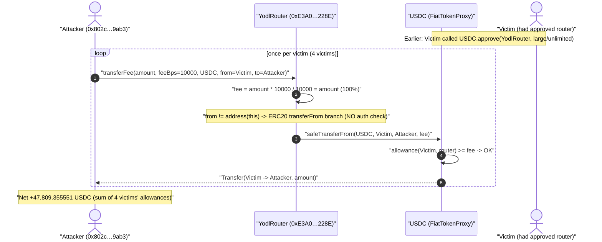
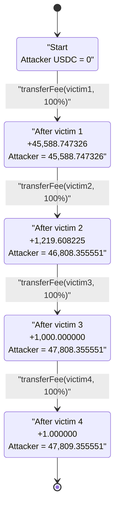
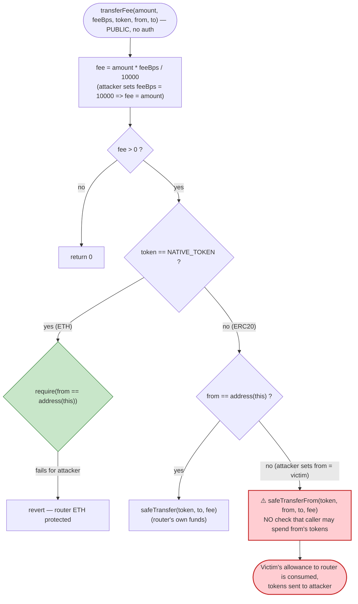

# Yodl Router Exploit — Permissionless `transferFee()` Drains Pre-Approved User Allowances

> **Vulnerability classes:** vuln/access-control/missing-auth · vuln/logic/missing-validation

> **Reproduction:** the PoC compiles & runs in an isolated Foundry project at
> [this project folder](.) (the umbrella DeFiHackLabs repo does not whole-compile,
> so this PoC was extracted into a standalone Foundry project).
> Full verbose trace: [output.txt](output.txt).
> Verified vulnerable source: [src_AbstractYodlRouter.sol](sources/YodlRouter_E3A0bc/src_AbstractYodlRouter.sol).

---

## Key info

| | |
|---|---|
| **Loss** | **47,809.355551 USDC** (~$47.8K; the PoC header rounds to "~5k", but the on-chain drain reproduced here is ~$47.8K) drained from 4 wallets that had approved the router |
| **Vulnerable contract** | `YodlRouter` — [`0xE3A0bc3483AE5a04DB7eF2954315133a6F7D228E`](https://etherscan.io/address/0xE3A0bc3483AE5a04DB7eF2954315133a6F7D228E#code) |
| **Victims** | EOAs that previously `approve()`d the router for USDC: `0x5322…9Bb0`, `0xa7b7…916E`, `0x2c34…7881`, `0x96D0…6BF9` |
| **Attacker EOA** | [`0xedee6379fe90bd9b85d8d0b767d4a6deb0dc9dcf`](https://etherscan.io/address/0xedee6379fe90bd9b85d8d0b767d4a6deb0dc9dcf) |
| **Attacker contract** | [`0x802cfff8d7cb27879e00496843bb69361ff09ab3`](https://etherscan.io/address/0x802cfff8d7cb27879e00496843bb69361ff09ab3) |
| **Attack tx** | [`0x54f659773dae6e01f83184d4b6d717c7f1bb71c0aa59e8c8f4a57c25271424b3`](https://etherscan.io/tx/0x54f659773dae6e01f83184d4b6d717c7f1bb71c0aa59e8c8f4a57c25271424b3) |
| **Chain / block / date** | Ethereum mainnet / 20,520,368 / Aug 2024 |
| **Compiler** | Solidity v0.8.26+commit.8a97fa7a, optimizer **1 run** |
| **Bug class** | Missing access control on a token-moving function + attacker-controlled `from`/`feeBps` (allowance-abuse / arbitrary-`transferFrom`) |

---

## TL;DR

`YodlRouter` exposes a **`public`, unauthenticated** helper `transferFee(amount, feeBps, token, from, to)`
([src_AbstractYodlRouter.sol:162-187](sources/YodlRouter_E3A0bc/src_AbstractYodlRouter.sol#L162-L187)).
Every single parameter is attacker-controlled, and when `from != address(this)` the function does:

```solidity
TransferHelper.safeTransferFrom(token, from, to, fee);   // fee = amount * feeBps / 10000
```

So the function is, in effect, **`transferFrom(from, to, amount * feeBps / 10000)` with no caller
check at all.** Anyone can:

1. Set `from` = any address that has an outstanding ERC20 allowance to the router (a normal Yodl user
   who approved the router for a payment).
2. Set `to` = the attacker.
3. Set `feeBps` = `10_000` so that `fee = amount * 10000 / 10000 = amount` — i.e. a **100% "fee"**.
4. Set `amount` = the victim's full approved/spendable balance.

The router then pulls the victim's tokens straight to the attacker. The attacker simply repeated the
call once per victim wallet, sweeping each one's USDC allowance. Total stolen in the reproduced
transaction: **47,809.355551 USDC** across 4 victims.

The intended caller of `transferFee` is the router *itself* (from `yodlWithToken`, to move the small
protocol fee from the payer to the fee receiver). Marking it `public` instead of `internal` turned an
internal accounting helper into an open `transferFrom` proxy over every allowance the router had ever
been granted.

---

## Background — what Yodl / the router does

Yodl is a payments router: a payer calls something like `yodlWithToken(...)` and the router moves an
ERC20 (or native token) from the payer to a receiver, optionally taking a small protocol fee and an
"extra fee" for a third party, and optionally applying Chainlink price-feed conversion.

To use the ERC20 path, a payer **must first `approve()` the router** to spend their token (the router
calls `TransferHelper.safeTransferFrom(token, msg.sender, receiver, amount)` internally —
[YodlTransferRouter.sol:135](sources/YodlRouter_E3A0bc/src_routers_YodlTransferRouter.sol#L135)).
Many users set generous or unlimited allowances. That standing allowance is exactly what the bug
weaponizes.

The on-chain `YodlRouter` ([EthereumYodlRouter.sol](sources/YodlRouter_E3A0bc/src_chains_EthereumYodlRouter.sol))
inherits `YodlTransferRouter`, `YodlCurveRouter`, and `YodlUniswapRouter`, all of which extend
`AbstractYodlRouter` — where the vulnerable `transferFee` lives. Constructor sets
`yodlFeeBps = 20` (0.2%), `yodlFeeTreasury`, and the wrapped native token; none of that gates
`transferFee`.

The relevant fee math:

| Helper | Formula | Notes |
|---|---|---|
| `calculateFee(amount, feeBps)` | `amount * feeBps / 10000` | feeBps=10000 ⇒ fee = full amount |
| `MAX_EXTRA_FEE_BPS` | `5_000` (50%) | **only enforced inside `yodlWithToken`**, never inside `transferFee` |

---

## The vulnerable code

### `transferFee` is `public` and moves tokens with attacker-chosen `from`/`to`/`fee`

[src_AbstractYodlRouter.sol:162-187](sources/YodlRouter_E3A0bc/src_AbstractYodlRouter.sol#L162-L187):

```solidity
function transferFee(uint256 amount, uint256 feeBps, address token, address from, address to)
    public                                   // ⚠️ should be internal — no caller restriction
    returns (uint256)
{
    uint256 fee = calculateFee(amount, feeBps);   // fee = amount * feeBps / 10000
    if (fee > 0) {
        if (token != NATIVE_TOKEN) {
            // ERC20 token
            if (from == address(this)) {
                TransferHelper.safeTransfer(token, to, fee);
            } else {
                // safeTransferFrom requires approval
                TransferHelper.safeTransferFrom(token, from, to, fee);   // ⚠️ arbitrary from→to
            }
        } else {
            require(from == address(this), "can only transfer eth from the router address");
            (bool success,) = to.call{value: fee}("");
            require(success, "transfer failed in transferFee");
        }
        return fee;
    } else {
        return 0;
    }
}
```

Note the asymmetry: the **native-ETH branch is access-controlled** — it `require(from == address(this), ...)`
so you cannot drain the router's own ETH. But the **ERC20 branch has no such guard**. For ERC20 it
happily takes `from` = any address, relying only on that address having granted an allowance to the
router — which legitimate users routinely do.

### `calculateFee` lets `feeBps = 10000` mean "take everything"

[src_AbstractYodlRouter.sol:136-138](sources/YodlRouter_E3A0bc/src_AbstractYodlRouter.sol#L136-L138):

```solidity
function calculateFee(uint256 amount, uint256 feeBps) public pure returns (uint256) {
    return (amount * feeBps) / 10_000;     // feeBps = 10_000  ⇒  fee == amount  (100%)
}
```

`transferFee` does **not** clamp `feeBps`. The `MAX_EXTRA_FEE_BPS = 5_000` (50%) bound exists only in
`yodlWithToken` ([YodlTransferRouter.sol:107](sources/YodlRouter_E3A0bc/src_routers_YodlTransferRouter.sol#L107)),
which is never on the path the attacker uses. With `feeBps = 10_000`, the "fee" is the entire `amount`.

### How `transferFee` is *supposed* to be used

The only legitimate caller is `yodlWithToken`, where the router moves a real fee from the actual payer
(`msg.sender`) to a fee receiver
([YodlTransferRouter.sol:109-116](sources/YodlRouter_E3A0bc/src_routers_YodlTransferRouter.sol#L109-L116)):

```solidity
totalFee += transferFee(
    finalAmount,
    params.extraFeeBps,                                  // bounded < 50% above
    params.token,
    params.token == NATIVE_TOKEN ? address(this) : msg.sender,   // from = the actual payer
    params.extraFeeReceiver
);
```

In the intended flow `from` is forced to `msg.sender` (the payer who consented). Exposing the same
helper publicly lets an attacker set `from` to *someone else*.

---

## Root cause — why it was possible

Three design decisions compose into a critical arbitrary-`transferFrom`:

1. **`transferFee` is `public` instead of `internal`.** It is an accounting helper meant to be called
   only from within `yodlWithToken`. Public visibility makes it a standalone, unauthenticated entry
   point.
2. **`from` is a free parameter on the ERC20 path with no `from == msg.sender` / `from == address(this)`
   check.** The function trusts that any caller asking to move `from`'s tokens is allowed to — but the
   only thing it actually checks is that `from` granted the *router* (not the caller) an allowance.
   ERC20 allowances are granted to the **router**, so any caller can spend them.
3. **`feeBps` is unbounded inside `transferFee`.** The "this is just a fee" framing collapses once
   `feeBps = 10_000` turns the fee into 100% of `amount`. There is no cap, so the "fee" is the whole
   balance.

The net effect: `transferFee(amount, 10000, token, victim, attacker)` ≡
`token.transferFrom(victim, attacker, amount)` callable by anyone, against the router's entire pool of
standing allowances. The attacker only needs to know *which* addresses have an active allowance and
how much they can spend — both readable on-chain.

---

## Preconditions

- A victim has an **outstanding ERC20 allowance to the router** (`allowance(victim, router) > 0`) and a
  spendable balance. This is the normal state for anyone who has used / pre-approved the router.
- The attacker supplies `feeBps` such that `amount * feeBps / 10000` ≤ `min(allowance, balance)`.
  Choosing `feeBps = 10_000` and `amount` = the victim's spendable amount drains the maximum.
- **No capital, no flash loan, no special role** required — the attack is a sequence of plain external
  calls. The attacker batched 4 victims into a single transaction.

---

## Attack walkthrough (with on-chain numbers from the trace)

The attacker's contract (`NoName` in the PoC, `0x802c…9ab3` on mainnet) made four `transferFee` calls,
one per victim, each with `feeBps = 10_000` (100%) and `to` = attacker. The `from`/`amount` for each
were pre-computed off-chain to equal that victim's drainable USDC. Numbers below are taken directly
from the `transferFee` calls and `Transfer` events in [output.txt](output.txt).

| # | Victim (`from`) | `amount` (raw) | `feeBps` | `fee = amount` | USDC pulled |
|---|------------------|---------------:|--------:|---------------:|------------:|
| 1 | `0x5322BFF3…969Bb0` | 45,588,747,326 | 10,000 | 45,588,747,326 | **45,588.747326** |
| 2 | `0xa7b7d4eb…f2916E` |  1,219,608,225 | 10,000 |  1,219,608,225 |  **1,219.608225** |
| 3 | `0x2c349022…1Bc7881` |  1,000,000,000 | 10,000 |  1,000,000,000 |  **1,000.000000** |
| 4 | `0x96D0F726…ebc6BF9` |      1,000,000 | 10,000 |      1,000,000 |      **1.000000** |
|   | | | | **Total** | **47,809.355551 USDC** |

Each call:

- `YodlRouter::transferFee(amount, 10000, USDC, victim, attacker)`
- → `calculateFee(amount, 10000) = amount` (100% fee)
- → `from (victim) != address(this)` ⇒ `TransferHelper.safeTransferFrom(USDC, victim, attacker, amount)`
- → `FiatTokenV2_2::transferFrom(victim, attacker, amount)` succeeds because `allowance(victim, router) ≥ amount`
- → `emit Transfer(victim → attacker, amount)`

The trace's storage diff on the first call confirms the standing allowance: victim 0's
allowance slot dropped from `0xff…f6282c50ff` (an effectively-unlimited approval) by exactly the drained
amount, and the attacker's USDC balance slot rose from `0` to `0x0a9d4d143e` (= 45,588,747,326).

Final state (from the `balanceLog` modifier in [test/YodlRouter_exp.sol](test/YodlRouter_exp.sol)):

```
Attacker Before exploit USDC Balance: 0.000000
Attacker After  exploit USDC Balance: 47809.355551
```

### Profit / loss accounting (USDC)

| | Amount |
|---|---:|
| Attacker USDC before | 0.000000 |
| Drained from victim 1 | +45,588.747326 |
| Drained from victim 2 | +1,219.608225 |
| Drained from victim 3 | +1,000.000000 |
| Drained from victim 4 | +1.000000 |
| **Attacker USDC after** | **47,809.355551** |
| **Net profit** | **+47,809.355551 USDC** |

Cost basis to the attacker is essentially just gas — no capital was put at risk.

---

## Diagrams

### Sequence of the attack



### Pool / allowance state evolution (cumulative attacker USDC)



### The flaw inside `transferFee`



---

## Why each parameter

- **`feeBps = 10_000`:** makes `calculateFee` return the full `amount` (100% "fee"). `transferFee`
  never caps `feeBps`, so the "fee" becomes the whole transfer.
- **`from` = victim address:** the ERC20 branch passes `from` straight into
  `safeTransferFrom(token, from, to, fee)`. The only thing that must be true is `allowance(from, router) ≥ fee`
  — which holds for any user who approved the router.
- **`to` = attacker:** destination of the stolen funds.
- **`amount` = victim's drainable USDC:** pre-computed per victim (e.g. 45,588.747326 for victim 1) so
  the 100% fee equals the most the router can pull given that victim's `min(balance, allowance)`.
- **4 calls in one tx:** the attacker simply enumerated 4 wallets with live allowances and swept them
  in a single transaction.

---

## Remediation

1. **Make `transferFee` `internal`.** It is an accounting helper for `yodlWithToken`; it should never
   be an external entry point. This single change closes the bug.
2. **If it must stay external, authenticate the `from`.** Require `from == msg.sender` (the caller may
   only move *their own* tokens) or `from == address(this)` (router-owned funds). The ETH branch
   already does the latter — the ERC20 branch must do the same.
3. **Bound `feeBps` everywhere, not just in `yodlWithToken`.** Enforce `feeBps <= MAX_EXTRA_FEE_BPS`
   inside `transferFee`/`calculateFee` so a "fee" can never be 100% of the principal.
4. **Don't rely on standing allowances for privileged moves.** Prefer pull-then-push within a single
   user-initiated call, or use `permit`/EIP-2612 signatures so each transfer is explicitly consented to,
   rather than letting any caller spend a router-scoped allowance.
5. **Users:** revoke outstanding approvals to the router; in general, avoid unlimited approvals to
   routers/aggregators and approve only the exact amount per payment.

---

## How to reproduce

The PoC was extracted into a standalone Foundry project (the umbrella DeFiHackLabs repo has several
unrelated PoCs that fail to compile under `forge test`'s whole-project build):

```bash
_shared/run_poc.sh 2024-08-YodlRouter_exp -vvvvv
```

- RPC: an **Ethereum mainnet archive** endpoint is required (fork block 20,520,368). `foundry.toml`
  uses an Infura archive endpoint; most pruned public RPCs would fail with `missing trie node` at this
  block.
- Result: `[PASS] testExploit()` with the attacker's USDC balance going `0 → 47,809.355551`.

Expected tail:

```
  Attacker Before exploit USDC Balance: 0.000000
  Attacker After exploit USDC Balance: 47809.355551

Suite result: ok. 1 passed; 0 failed; 0 skipped
Ran 1 test suite: 1 tests passed, 0 failed, 0 skipped (1 total tests)
```

---

*Reference: DeFiHackLabs — Yodl Router, Ethereum, Aug 2024. PoC header rounds the loss to "~5k"; the
reproduced on-chain drain in this transaction totals 47,809.355551 USDC.*
