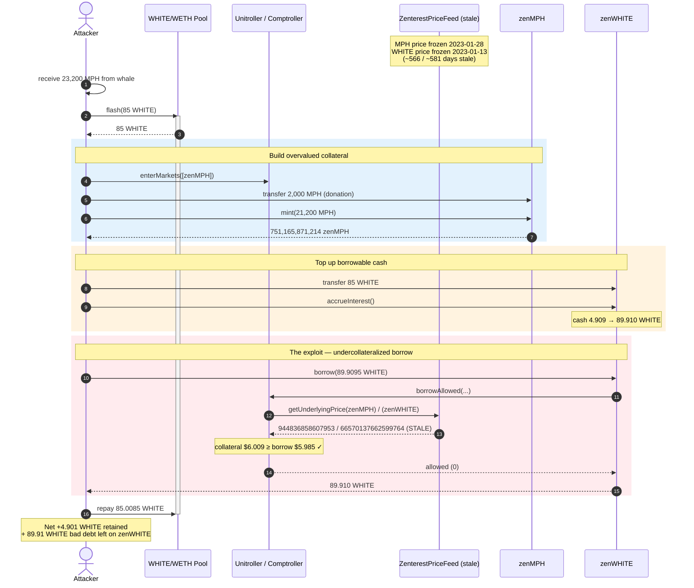
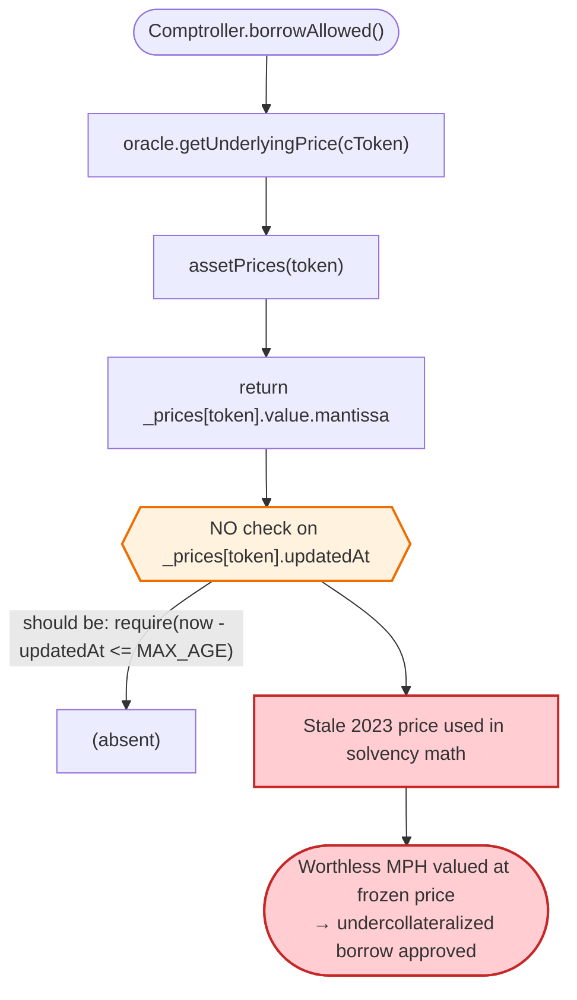
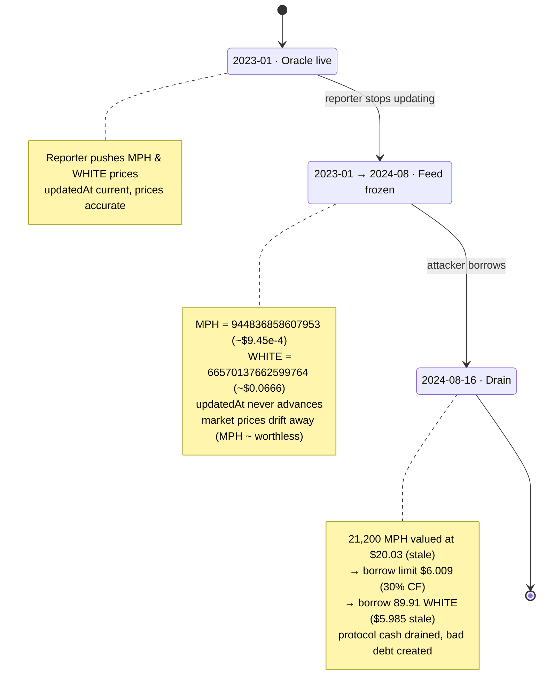

# Zenterest Exploit — Stale-Oracle Collateral Mispricing on a Compound Fork

> **Vulnerability classes:** vuln/oracle/stale-price · vuln/oracle/missing-validation

> **One-liner:** Zenterest's price oracle stored a `updatedAt` timestamp for every price but **never checked it on read**, so a ~566-day-old zombie price for the worthless `MPH` token let an attacker deposit near-valueless MPH as collateral and borrow out the lending market's entire real `WHITE` cash reserve.

> **Reproduction:** the PoC compiles & runs in an isolated Foundry project at
> [this project folder](.) (the umbrella DeFiHackLabs repo contains many unrelated PoCs that do not
> whole-compile, so this one was extracted).
> Full verbose trace: [output.txt](output.txt).
> Verified vulnerable source: [ZenterestPriceFeed.sol](sources/ZenterestPriceFeed_47D748/home_nicklatkovich_pixelplex_riochain_zenterest-price-feed_contracts_contracts_ZenterestPriceFeed.sol).

---

## Key info

| | |
|---|---|
| **Loss** | ~$21,000 — the attacker drained `zenWHITE`'s available cash by borrowing 89.91 WHITE against worthless collateral, leaving unbacked bad debt |
| **Vulnerable contract** | `ZenterestPriceFeed` (oracle) — [`0x47D748C9BAbD5cCa642F9f98e07442C0B5b04d2f`](https://etherscan.io/address/0x47D748C9BAbD5cCa642F9f98e07442C0B5b04d2f#code) |
| **Directly affected markets** | `zenMPH` ([`0x4dD6D5D861EDcD361455b330fa28c4C9817dA687`](https://etherscan.io/address/0x4dD6D5D861EDcD361455b330fa28c4C9817dA687#code)), `zenWHITE` ([`0xE3334e66634acF17B2b97ab560ec92D6861b25fa`](https://etherscan.io/address/0xE3334e66634acF17B2b97ab560ec92D6861b25fa#code)) |
| **Comptroller (Unitroller)** | [`0x606246e9EF6C70DCb6CEE42136cd06D127E2B7C7`](https://etherscan.io/address/0x606246e9EF6C70DCb6CEE42136cd06D127E2B7C7#code) |
| **Collateral token (overpriced)** | MPH `0x8888801aF4d980682e47f1A9036e589479e835C5` |
| **Borrowed token (drained)** | WHITE `0x5F0E628B693018f639D10e4A4F59BD4d8B2B6B44` |
| **Bootstrap liquidity** | WHITE/WETH Uniswap-V3 pool `0xC5c134A1f112efA96003f8559Dba6fAC0BA77692` (flash-loaned 85 WHITE) |
| **Attack tx** | [`0xfe8bc757d87e97a5471378c90d390df47e1b29bb9fca918b94acd8ecfaadc598`](https://etherscan.io/tx/0xfe8bc757d87e97a5471378c90d390df47e1b29bb9fca918b94acd8ecfaadc598) |
| **Chain / block / date** | Ethereum mainnet / 20,541,640 / 2024-08-16 |
| **Compiler** | Oracle: Solidity v0.6.12 · cTokens/Comptroller: v0.5.16 (Compound v2 fork) |
| **Bug class** | Missing oracle staleness check → collateral mispricing → undercollateralized borrow |

---

## TL;DR

`ZenterestPriceFeed` is a push-style oracle: an off-chain `reporter` periodically signs/submits prices via
`updatePrice` / `updateDelegatedPrice`, each carrying an `updatedAt` timestamp that is **stored** in the
`Price` struct ([ZenterestPriceFeed.sol:14-17](sources/ZenterestPriceFeed_47D748/home_nicklatkovich_pixelplex_riochain_zenterest-price-feed_contracts_contracts_ZenterestPriceFeed.sol#L14-L17), [:173-184](sources/ZenterestPriceFeed_47D748/home_nicklatkovich_pixelplex_riochain_zenterest-price-feed_contracts_contracts_ZenterestPriceFeed.sol#L173-L184)).

But the **read path** the Comptroller uses — `getUnderlyingPrice` → `assetPrices` — returns
`_prices[token].value.mantissa` and **completely ignores `updatedAt`**
([:49-58](sources/ZenterestPriceFeed_47D748/home_nicklatkovich_pixelplex_riochain_zenterest-price-feed_contracts_contracts_ZenterestPriceFeed.sol#L49-L58)). There is no maximum-age check, no
revert-on-stale, nothing.

By the time of the attack, the reporter had **stopped updating** these tokens. On-chain reads at the fork
block show:

| Token | Oracle price (mantissa) | `updatedAt` | Age at exploit |
|---|---:|---|---:|
| MPH | `944836858607953` (≈ $9.45e-4 / token) | 1674902100 = **2023-01-28** | **~566 days** |
| WHITE | `66570137662599764` (≈ $0.0666 / token) | 1673634900 = **2023-01-13** | **~581 days** |

MPH was effectively dead on the open market, yet the lending protocol still valued it at its frozen
January-2023 price. So the attacker:

1. Acquired 23,200 MPH (transferred from a large holder).
2. Deposited 21,200 MPH into `zenMPH` as collateral; at the stale price the Comptroller credited it with
   ~$20 of value → a ~$6 borrow limit (30% collateral factor).
3. Flash-loaned 85 WHITE from the Uniswap-V3 pair, donated it into `zenWHITE` to top up its borrowable cash,
   and **borrowed out the full 89.91 WHITE** of available cash.
4. Repaid the 85.0085 WHITE flash loan and walked away with the difference — the protocol's real WHITE
   liquidity — while leaving behind ~89.91 WHITE of bad debt that is "collateralized" only by the dead MPH.

The whole borrow was permitted because the Comptroller's solvency check trusted a 1.5-year-old price.

---

## Background — what Zenterest is

Zenterest is a **Compound v2 fork** (a money market). Users supply assets to `CErc20` markets
(`zenMPH`, `zenWHITE`, …), receive interest-bearing `cTokens`, and may borrow other assets against their
supplied collateral. The `Unitroller`/`Comptroller` enforces solvency: an account may borrow only while

```
Σ (collateralFactor · cTokenBalance · exchangeRate · price)  ≥  Σ (borrowBalance · price)
```

Every `price` in that inequality comes from the oracle via `PriceOracle.getUnderlyingPrice(cToken)`
([contracts_PriceOracle.sol:15](sources/Unitroller_606246/contracts_PriceOracle.sol#L15)). Zenterest's
oracle implementation is `ZenterestPriceFeed`, a reporter-pushed price feed.

Relevant on-chain parameters at the fork block (read via `cast`/from the trace):

| Parameter | Value |
|---|---|
| `zenMPH` collateral factor | `0x429d069189e0000` = **0.30 (30%)** |
| `zenMPH` exchange rate | 28,222,794,475,109,390,118,782,771,529 (`2.822e28`) |
| `zenWHITE` exchange rate | 26,204,447,932,880,747,707,996,955,515 (`2.620e28`) |
| `zenWHITE` available cash (own) | **4.909 WHITE** (before the attacker's top-up) |
| MPH oracle price | `944836858607953` (frozen since 2023-01-28) |
| WHITE oracle price | `66570137662599764` (frozen since 2023-01-13) |

The two stale-price facts are the whole game: MPH was priced as if it were still worth ~$0.000945 a token
even though its real market value had collapsed, so a pile of MPH bought cheaply still "counted" as real
collateral.

---

## The vulnerable code

### 1. The price struct *has* a freshness field…

```solidity
struct Price {
    AttoDecimal value;
    uint256 updatedAt;        // ← recorded on every push…
}
```
[ZenterestPriceFeed.sol:14-17](sources/ZenterestPriceFeed_47D748/home_nicklatkovich_pixelplex_riochain_zenterest-price-feed_contracts_contracts_ZenterestPriceFeed.sol#L14-L17)

…and `updatedAt` is dutifully written on every update:

```solidity
function _updatePrice(address token, uint256 newPriceMantissa, uint256 updatedAt) internal {
    Price storage actualPrice = _prices[token];
    uint256 lastUpdatedAt = actualPrice.updatedAt;
    require(lastUpdatedAt < updatedAt, "Price already updated");
    actualPrice.value = AttoDecimal({mantissa: newPriceMantissa});
    actualPrice.updatedAt = updatedAt;          // ← stored
    emit PriceUpdated(token, newPriceMantissa, updatedAt);
}
```
[ZenterestPriceFeed.sol:173-184](sources/ZenterestPriceFeed_47D748/home_nicklatkovich_pixelplex_riochain_zenterest-price-feed_contracts_contracts_ZenterestPriceFeed.sol#L173-L184)

### 2. …but the read path the Comptroller calls never checks it

```solidity
function assetPrices(address token) public view returns (uint256 price) {
    return _prices[token].value.mantissa;        // ⚠️ updatedAt ignored entirely
}

function getUnderlyingPrice(ICorroborativeToken corroborative) public view returns (uint256) {
    if (keccak256(abi.encodePacked(corroborative.symbol())) == CORROBORATIVE_ETH_SYMBOL_COMPORATOR) {
        return AttoDecimalLib.ONE_MANTISSA;
    }
    return assetPrices(corroborative.underlying());   // ⚠️ returns possibly-ancient price, no age guard
}
```
[ZenterestPriceFeed.sol:49-58](sources/ZenterestPriceFeed_47D748/home_nicklatkovich_pixelplex_riochain_zenterest-price-feed_contracts_contracts_ZenterestPriceFeed.sol#L49-L58)

There is **no** `require(block.timestamp - _prices[token].updatedAt <= MAX_AGE)` anywhere on the read path.
A price reported once and then abandoned is served forever as if current.

### 3. The Comptroller blindly trusts it during solvency checks

`CToken.borrowFresh` calls `comptroller.borrowAllowed(...)`
([contracts_CToken.sol:736-741](sources/CErc20Immutable_4dD6D5/contracts_CToken.sol#L736-L741)), which in turn
evaluates account liquidity using `oracle.getUnderlyingPrice(cToken)` for **both** the collateral and the
borrowed asset. With both prices frozen at 2023 values, the inequality balances out in the attacker's favor.

In the trace you can see the oracle being queried during `borrowAllowed`, returning exactly the stale
mantissas (`66570137662599764` for WHITE, `944836858607953` for MPH):

```
ZenterestPriceFeed::getUnderlyingPrice(zenWHITE) → 66570137662599764   (stale 2023-01-13 price)
ZenterestPriceFeed::getUnderlyingPrice(zenMPH)   → 944836858607953     (stale 2023-01-28 price)
```
[output.txt:1697-1722](output.txt#L1697-L1722)

---

## Root cause — why it was possible

A push oracle is only safe if consumers **reject prices older than some bound** — otherwise the feed silently
degrades into a constant the moment the off-chain reporter goes quiet (operator wind-down, key loss, dead
project, etc.). Zenterest's oracle:

1. **Records `updatedAt` but never reads it on the consumer path.** The freshness field is decorative.
   `getUnderlyingPrice`/`assetPrices` return the last-known mantissa unconditionally.
2. **The Comptroller has no independent staleness defense either.** Compound v2's `getUnderlyingPrice`
   contract is a single `uint` with no timestamp, so the Comptroller cannot tell a 1-second-old price from a
   566-day-old one. The freshness contract lived *only* inside the oracle — and the oracle skipped it.
3. **The reporter stopped updating these illiquid markets long ago.** Both MPH and WHITE prices froze in
   January 2023. By August 2024 they were ~1.5 years stale, while the tokens' real market values had moved
   drastically — MPH in particular was essentially worthless, but the oracle still priced it at its old value.
4. **Collateral can be acquired cheaply.** Because the *market* price of MPH had collapsed but the *oracle*
   price had not, the attacker could obtain a large MPH balance for almost nothing and have the protocol value
   it at the old, much higher price. That mispricing is the entire profit lever.

The result is the classic stale-oracle undercollateralized-borrow: deposit cheap-but-oracle-overpriced
collateral, borrow real assets, never repay.

---

## Preconditions

- The oracle's reporter had **abandoned** the MPH and WHITE feeds (last update Jan 2023), so the served prices
  no longer reflected market reality. This is the necessary condition the attacker exploited; it was already
  true on-chain.
- The attacker needed a quantity of MPH to deposit as collateral. In the live attack it was sourced from a
  large holder (`0x90744C…f15`); the PoC reproduces this with `vm.prank` + `transfer`
  ([test/Zenterest_exp.sol:31-32](test/Zenterest_exp.sol#L31-L32)).
- Working WHITE capital to top up `zenWHITE`'s borrowable cash so the full reserve could be pulled in one
  borrow. This was supplied as a **flash loan** of 85 WHITE from the WHITE/WETH Uniswap-V3 pair and repaid
  in the same transaction ([test/Zenterest_exp.sol:33,51](test/Zenterest_exp.sol#L33-L51)), so the attack is
  effectively zero-capital.

---

## Attack walkthrough (with on-chain numbers from the trace)

All figures below come from [output.txt](output.txt) (single transaction, inside the
`uniswapV3FlashCallback`).

| # | Step | Concrete numbers | Effect |
|---|------|------------------|--------|
| 0 | **Seed MPH** — whale `0x9074…f15` transfers MPH to attacker | 23,200 MPH | Attacker now holds collateral. [:1589](output.txt#L1589) |
| 1 | **Flash loan** — `Pool.flash(attacker, 85 WHITE, 0)` | borrow 85 WHITE (fee 0.0085) | Bootstrap WHITE capital. [:1595-1600](output.txt#L1595-L1600) |
| 2 | **Enter market** — `enterMarkets([zenMPH])` | — | MPH now counts as collateral. [:1607-1615](output.txt#L1607-L1615) |
| 3 | **Donate + mint** — transfer 2,000 MPH into `zenMPH`, then `mint(21,200 MPH)` | mint → **751,165,871,214 zenMPH** (exchangeRate 2.822e28) | Collateral position created. [:1621-1670](output.txt#L1621-L1670) |
| 4 | **Top up borrowable cash** — transfer the 85 WHITE into `zenWHITE`, `accrueInterest()` | `zenWHITE` cash: 4.909 → **89.910 WHITE** | Enough cash to drain in one borrow. [:1673-1690](output.txt#L1673-L1690) |
| 5 | **Borrow** — `zenWHITE.borrow(89.9095 WHITE)` | Comptroller approves using **stale** prices; 89.910 WHITE sent to attacker | **Undercollateralized borrow succeeds.** [:1693-1741](output.txt#L1693-L1741) |
| 6 | **Repay flash** — transfer 85.0085 WHITE back to pool | −85.0085 WHITE | Flash loan settled. [:1751-1756](output.txt#L1751-L1756) |

The decisive moment is step 5. The Comptroller's liquidity check, using the frozen oracle prices, sees:

- **Collateral value:** 751,165,871,214 zenMPH × exchangeRate (2.822e28) ≈ **21,200 MPH underlying**,
  × stale MPH price `944836858607953` ≈ **$20.03**, × collateral factor 0.30 ≈ **$6.009 borrow limit**.
- **Borrow value:** 89.9095 WHITE × stale WHITE price `66570137662599764` ≈ **$5.985**.

Since $5.985 ≤ $6.009, the borrow is allowed. Both sides are computed from prices that are ~1.5 years out of
date; the protocol has no idea the MPH backing this loan is, in reality, near-worthless.

### Profit / loss accounting (WHITE)

| Direction | Amount (WHITE) |
|---|---:|
| Flash loan received | +85.000000 |
| Transferred into `zenWHITE` (top-up) | −85.000000 |
| **Borrowed out of `zenWHITE`** | **+89.909549** |
| Flash loan repaid (incl. 0.0085 fee) | −85.008500 |
| **Net WHITE retained by attacker** | **+4.901049** |

Of the 89.91 WHITE borrowed, 85 was the attacker's own recycled flash capital and **4.909 WHITE was the
protocol's real, pre-existing cash reserve** — drained to the attacker. More importantly, the *entire* 89.91
WHITE borrow is now **bad debt**: it is backed only by 21,200 MPH that the oracle says is worth ~$20 but the
market says is worth almost nothing. The protocol-level loss (unrecoverable debt + drained cash) is the
~$21,000 reported figure; the literal token retained in the PoC is **4.901 WHITE**, with the rest of the harm
being the unbacked loan left on `zenWHITE`'s books.

> The PoC stops after the borrow (it demonstrates that an undercollateralized borrow is *permitted*, which is
> the vulnerability). It does not separately liquidate the retained WHITE to USD.

---

## Diagrams

### Sequence of the attack



### Price-feed read path — where the check is missing



### Oracle / market state evolution



---

## Remediation

1. **Enforce a maximum price age on the read path.** The simplest, complete fix is to make
   `assetPrices`/`getUnderlyingPrice` revert (or signal failure to the Comptroller) when
   `block.timestamp - _prices[token].updatedAt > MAX_PRICE_AGE`. The `updatedAt` field already exists — it
   just has to be *used*:
   ```solidity
   function assetPrices(address token) public view returns (uint256) {
       Price storage p = _prices[token];
       require(block.timestamp - p.updatedAt <= MAX_PRICE_AGE, "stale price");
       return p.value.mantissa;
   }
   ```
2. **Fail safe in the Comptroller.** When the oracle cannot supply a fresh price, the Comptroller should treat
   that asset's collateral value as 0 (and ideally block new borrows against it), rather than letting a stale
   value through. Compound's own later designs return 0 / revert for missing prices.
3. **Decommission abandoned markets.** Markets whose feeds are no longer maintained (illiquid/dead tokens)
   should be paused for borrowing and collateral via `_setCollateralFactor(0)` / borrow-cap 0, so a forgotten
   feed cannot become an attack surface.
4. **Prefer market-derived or multi-source pricing for thin tokens.** A single push reporter is a single point
   of failure; combining it with a sanity bound (TWAP / secondary feed) prevents a frozen value from being
   trusted in isolation.
5. **Monitor feed liveness.** Off-chain alerting on "price not updated in N hours" would have surfaced the
   1.5-year-stale feeds long before they were weaponized.

---

## How to reproduce

The PoC was extracted into a standalone Foundry project (the umbrella DeFiHackLabs repo has several unrelated
PoCs that fail to compile under a whole-project `forge build`):

```bash
_shared/run_poc.sh 2024-08-Zenterest_exp -vvvvv
```

- RPC: an **Ethereum mainnet archive** endpoint is required (fork block 20,541,639). `foundry.toml` is
  pre-configured with an Infura archive endpoint.
- Result: `[PASS] testExploit()`. The trace shows the oracle returning the stale 2023 mantissas during
  `borrowAllowed`, and the 89.9095 WHITE borrow succeeding against worthless MPH collateral.

Expected tail:

```
Ran 1 test for test/Zenterest_exp.sol:ContractTest
[PASS] testExploit() (gas: 606550)
Suite result: ok. 1 passed; 0 failed; 0 skipped
```

---

*Reference: the PoC header documents TX `0xfe8bc757…dc598`, "~21000 USD", reason "Price Out Of Date".
SlowMist Hacked — https://hacked.slowmist.io/ (Zenterest, Ethereum).*
