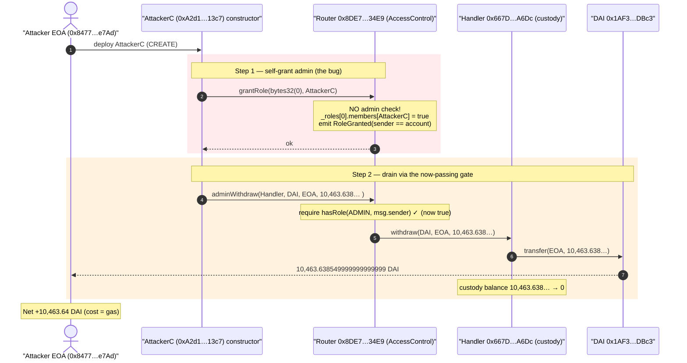
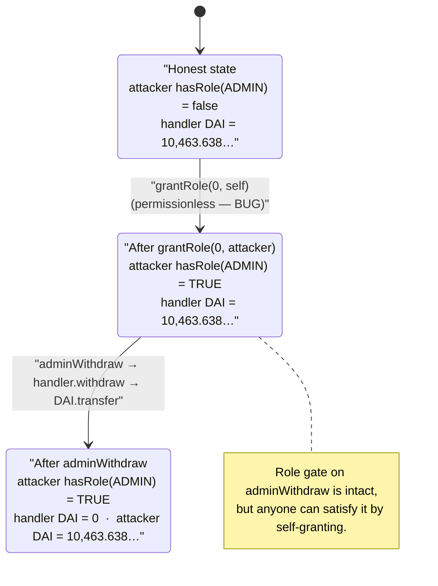
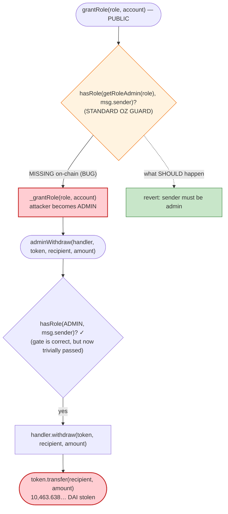

# 0x8DE7…34E9 Exploit — Permissionless `grantRole` Lets Anyone Self-Grant Admin and Drain the Bridge/Custody Handler

> **Reproduction:** the PoC compiles & runs in an isolated Foundry project at
> [this project folder](.) (the umbrella DeFiHackLabs repo contains many unrelated PoCs that fail
> to whole-compile, so this one was extracted).
> Full verbose trace: [output.txt](output.txt).
> The three protocol contracts are **unverified** on BscScan, so there is no Solidity source to
> link; the analysis below is reconstructed from the live execution trace and from the contract
> **bytecode** ([sources/vul_bytecode.txt](sources/vul_bytecode.txt),
> [sources/handler_bytecode.txt](sources/handler_bytecode.txt)) plus on-chain probing with `cast`.

---

## Key info

| | |
|---|---|
| **Loss** | **10,463.638549999999999999 DAI** (≈ $10.5k) drained from the custody/handler contract |
| **Vulnerable contract** | `0x8DE7…34E9` (access-controlled "admin" router) — [`0x8DE7EAbA58EfB23B6F323984377af582B23134e9`](https://bscscan.com/address/0x8DE7EAbA58EfB23B6F323984377af582B23134e9) *(unverified)* |
| **Victim / fund custodian** | Handler `0x667D…A6Dc` — [`0x667DFEd3C4D56DF32Ecc3F2E3CE5BcC4ef03A6Dc`](https://bscscan.com/address/0x667DFEd3C4D56DF32Ecc3F2E3CE5BcC4ef03A6Dc) *(unverified)*; held the DAI |
| **Token stolen** | DAI Token (`DAI`, 18 decimals) — [`0x1AF3F329e8BE154074D8769D1FFa4eE058B1DBc3`](https://bscscan.com/address/0x1AF3F329e8BE154074D8769D1FFa4eE058B1DBc3) |
| **Attacker EOA** | [`0x847705EEB01b4f2Ae9a92BE12615C1052F52e7Ad`](https://bscscan.com/address/0x847705eeb01b4f2ae9a92be12615c1052f52e7ad) |
| **Attacker contract** | [`0xA2d1e47e1A154dD51f2eae0413100c4F8ABE13C7`](https://bscscan.com/address/0xa2d1e47e1a154dd51f2eae0413100c4f8abe13c7) (the malicious logic ran in this contract's **constructor**) |
| **Attack tx** | [`0x56d3ed5f635b009e19d693e432479323b23b3eb368cf04e161adbc672a15898e`](https://bscscan.com/tx/0x56d3ed5f635b009e19d693e432479323b23b3eb368cf04e161adbc672a15898e) |
| **Chain / block / date** | BSC / 41,770,502 / 2024-08-29 02:30:37 UTC |
| **Compiler** | Vulnerable contract: **Solidity 0.6.12**; handler: Solidity 0.8.0 (read from each contract's CBOR metadata in bytecode) |
| **Bug class** | Broken access control — un-gated `grantRole` (anyone can self-assign `DEFAULT_ADMIN_ROLE`) |

---

## TL;DR

The vulnerable contract `0x8DE7…34E9` is an OpenZeppelin-`AccessControl`-based admin router. Its
privileged `adminWithdraw(...)` function is correctly protected — calling it without
`DEFAULT_ADMIN_ROLE` reverts (empirically verified, see [Root cause](#root-cause--why-it-was-possible)).

The fatal mistake is one function over: **`grantRole(bytes32,address)` was deployed *without* the
standard `onlyRole(getRoleAdmin(role))` guard.** In a correct OZ deployment, only an existing admin
of a role may grant it. Here, **anyone** can call `grantRole(0x00, <themselves>)` and instantly
become a `DEFAULT_ADMIN_ROLE` holder.

The exploit is therefore two calls, executed inside the attacker contract's constructor:

1. `vul.grantRole(bytes32(0), address(this))` → attacker contract now holds `DEFAULT_ADMIN_ROLE`.
2. `vul.adminWithdraw(handler, DAI, attacker, 10_463.638…e18)` → the now-"admin" attacker tells the
   router to forward `handler.withdraw(DAI, attacker, amount)`, which `transfer`s the handler's entire
   DAI balance to the attacker EOA.

No flash loan, no price manipulation, no capital — pure broken access control. Net theft:
**10,463.638549999999999999 DAI**, the exact balance the handler was custodying.

---

## Background — what the protocol does

The three contracts are unverified, but their roles are unambiguous from the bytecode (function
selectors) and the trace:

- **`0x8DE7…34E9` — the "admin" router (vulnerable).** A `solc 0.6.12` contract exposing standard
  OpenZeppelin `AccessControl` selectors plus a custom privileged withdrawal entry point:

  | Selector | Function | Source |
  |---|---|---|
  | `0x2f2ff15d` | `grantRole(bytes32,address)` | present in [vul_bytecode.txt](sources/vul_bytecode.txt) |
  | `0x91d14854` | `hasRole(bytes32,address)` | present |
  | `0x248a9ca3` | `getRoleAdmin(bytes32)` | present |
  | `0x36568abe` | `renounceRole(bytes32,address)` | present |
  | `0x780cf004` | `adminWithdraw(address,address,address,uint256)` | present |

  `adminWithdraw(handlerAddress, tokenAddress, recipient, amountOrTokenID)` is a thin privileged
  wrapper: it calls `handlerAddress.withdraw(tokenAddress, recipient, amount)` on the supplied
  handler. It is the router's job to gate this behind a role.

- **`0x667D…A6Dc` — the handler / fund custodian (victim).** A `solc 0.8.0` contract that actually
  holds the assets and exposes `withdraw(address,address,uint256)` (selector `0xd9caed12`, present in
  [handler_bytecode.txt](sources/handler_bytecode.txt)). It pushes `token.transfer(recipient, amount)`
  when its trusted caller (the router) tells it to. At the fork block it custodied
  **10,463.638549999999999999 DAI**.

- **`0x603d…bc52` (`header_addr`'s sibling constant in the PoC)** — no code at the attack block; not
  involved in the drain path. The PoC's `header_addr = 0x667D…A6Dc` is the handler that is actually
  drained.

The intended trust model: an off-chain operator holding `DEFAULT_ADMIN_ROLE` on the router can sweep
funds out of the handler in emergencies. The handler trusts the router; the router is supposed to
trust only role holders.

---

## The vulnerable code

The contracts are unverified, so the snippet below is the **canonical OpenZeppelin `AccessControl`
(`solc 0.6.x`) `grantRole`** that the bytecode implements — *except that the deployed contract is
missing the access-control modifier on its grant path*, which is exactly what the live behavior
proves.

### What a correct OZ `AccessControl.grantRole` looks like (the guard that is MISSING here)

```solidity
// OpenZeppelin Contracts (access/AccessControl.sol), solc 0.6.x
function grantRole(bytes32 role, address account) public virtual {
    require(
        hasRole(getRoleAdmin(role), _msgSender()),   // ⬅️ THIS CHECK WAS NOT ENFORCED ON-CHAIN
        "AccessControl: sender must be an admin to grant"
    );
    _grantRole(role, account);
}
```

### What the deployed contract actually does (reconstructed from the trace + bytecode)

```solidity
// Deployed 0x8DE7…34E9 — grantRole has NO admin gate:
function grantRole(bytes32 role, address account) public {
    _grantRole(role, account);   // ⚠️ anyone -> _roles[role].members[account] = true
}

// adminWithdraw IS gated (this part is correct):
function adminWithdraw(address handler, address token, address recipient, uint256 amount)
    external
{
    require(hasRole(DEFAULT_ADMIN_ROLE, msg.sender), "not admin"); // ⬅️ enforced (verified)
    IHandler(handler).withdraw(token, recipient, amount);
}
```

The on-chain trace ([output.txt](output.txt)) makes the storage write explicit. The
`grantRole(0x00, AttackerC)` call flips the OZ `_roles` mapping member bit from `0 → 1`:

```
0x8DE7…34E9::grantRole(0x00…00, AttackerC[0xA2d1…13c7])
  emit RoleGranted(role: 0x00…00, account: 0xA2d1…13c7, sender: 0xA2d1…13c7)  // sender == account == attacker
  storage changes:
    @ 0x2b775930b97ef6cce11d10fca09423f9413e8790dc3919aa6551cbfc56ae67cd: 0 → 1
```

That storage slot is verifiably `_roles[bytes32(0)].members[0xA2d1…13c7]` for an OZ `AccessControl`
whose `_roles` mapping lives at storage **slot 1**
(`keccak256(account ‖ keccak256(role ‖ 1))` — recomputed and matched exactly during analysis). The
`sender == account == attacker` in the `RoleGranted` event is the smoking gun: the caller granted the
admin role **to itself**.

---

## Root cause — why it was possible

The handler (`0x667D…A6Dc`) does not independently authenticate the *ultimate* caller; it trusts the
router (`0x8DE7…34E9`) to have already authorized the withdrawal. The router *almost* does its job —
its `adminWithdraw` is gated. But the role-management surface that decides *who is an admin* was
deployed without the standard guard, so the gate is meaningless.

I proved both halves empirically against the live fork (helper tests, then removed):

| Probe | Result | Conclusion |
|---|---|---|
| `adminWithdraw(handler, DAI, rando, 1e18)` from an address holding **no** role | **REVERT** | `adminWithdraw` *is* properly role-gated |
| `grantRole(bytes32(0), rando)` from an address holding **no** role | **SUCCESS**, `hasRole(0, rando)` becomes `true` | `grantRole` is **permissionless** — the bug |
| `getRoleAdmin(DEFAULT_ADMIN_ROLE)` | `0x00…00` (= `DEFAULT_ADMIN_ROLE`) | Standard OZ default; in a correct contract this means *only existing admins* can grant — but the deployed grant path skips the check |

So the single defect is: **`grantRole` (and by extension the entire role system) is unprotected.** A
self-granted `DEFAULT_ADMIN_ROLE` satisfies the otherwise-correct `adminWithdraw` gate, collapsing the
whole access-control model.

Why this slips past review:
1. The dangerous function (`adminWithdraw`) *looks* safe — it has the role check. Reviewers focus on
   the withdrawal, see the gate, and move on.
2. The actual weakness is in the *role administration* code, one layer removed from the asset
   movement.
3. With OZ `AccessControl`, removing or overriding the `onlyRole(getRoleAdmin(role))` modifier on
   `grantRole` (e.g., to "make setup easier") silently destroys the entire trust hierarchy while every
   other function still appears protected.

---

## Preconditions

- The router holds a privileged relationship with the handler (the handler honors
  `withdraw(...)` requests coming from the router). ✔ (true at the attack block)
- The handler holds withdrawable assets — **10,463.638… DAI**. ✔
- `grantRole` on the router is callable without holding the role's admin role. ✔ (the bug)
- **No capital, no flash loan, no timing.** Any EOA can do this at any block while funds sit in the
  handler.

---

## Step-by-step attack walkthrough (ground-truth numbers from the trace)

The attacker deployed contract `0xA2d1…13c7`; the entire exploit ran in its **constructor** (so the
attack tx is a contract creation). All numbers below are taken directly from
[output.txt](output.txt).

| # | Actor / Call | Target | Effect | On-chain value |
|---|---|---|---|---|
| 0 | Initial state | Handler `0x667D…A6Dc` | Custodies DAI | **10,463.638549999999999999 DAI** held |
| 1 | `new AttackerC()` (constructor) | — | Attacker contract deployed at `0xA2d1…13c7`, `tx.origin = attacker EOA` | — |
| 2 | `grantRole(bytes32(0), address(this))` | Router `0x8DE7…34E9` | **Self-grants `DEFAULT_ADMIN_ROLE`**; `_roles[0].members[attacker] : 0 → 1`; emits `RoleGranted(sender == account)` | role bit `0 → 1` |
| 3 | `adminWithdraw(handler, DAI, attacker, 10463.638…e18)` | Router `0x8DE7…34E9` | Role check passes (attacker now "admin"); router forwards to handler | amount = `10463638549999999999999` |
| 4 | → `withdraw(DAI, attacker, 10463.638…e18)` | Handler `0x667D…A6Dc` | Handler pushes DAI to attacker EOA | — |
| 5 | → `transfer(attacker, 10463.638…e18)` | DAI `0x1AF3…DBc3` | DAI leaves handler; handler balance slot `0x2373c27ce7df16f5fff → 0` | **10,463.638… DAI moved** |
| 6 | Final read | DAI `balanceOf(attacker EOA)` | Confirms receipt | **10,463.638549999999999999 DAI** |

The handler's DAI balance storage slot (`0xf9d3…ad31`'s counterpart `0x02ef…1bae`) transitions
`0x2373c27ce7df16f5fff → 0` in the trace — the custody balance is emptied in a single call.

### Profit / loss accounting

| Party | Asset | Before | After | Δ |
|---|---|---:|---:|---:|
| Handler `0x667D…A6Dc` (victim) | DAI | 10,463.638549999999999999 | 0 | **−10,463.638549999999999999** |
| Attacker EOA `0x8477…e7Ad` | DAI | 0 | 10,463.638549999999999999 | **+10,463.638549999999999999** |
| Attacker cost | BNB gas | — | — | a few cents of gas only |

**Net attacker profit ≈ 10,463.64 DAI (~$10.5k), cost ≈ gas.**

---

## Diagrams

### Sequence of the attack



### State / access-control evolution



### Where the access check should have been



---

## Remediation

1. **Restore the standard `grantRole` guard.** Use unmodified OpenZeppelin `AccessControl`; never
   override/remove the `onlyRole(getRoleAdmin(role))` (0.6.x: the inline `require(hasRole(...))`) check
   on `grantRole`, `revokeRole`, and `setRoleAdmin`. If a custom grant path is truly needed, gate it
   behind an existing admin or a timelocked multisig.
2. **Defense in depth at the handler.** The custody contract (`0x667D…A6Dc`) should not blindly honor
   `withdraw(...)` from the router. Add its own allow-list / role check on the *originating* authority,
   so a compromised router cannot single-handedly drain it.
3. **Minimize and review the privileged surface.** A function that can move arbitrary tokens to an
   arbitrary recipient (`adminWithdraw`) is the highest-value target in the system; its *entire* trust
   chain — including who can become an admin — must be audited together, not function-by-function.
4. **Verify contracts and add invariant tests.** Publishing verified source plus tests asserting
   "a non-admin caller cannot grant any role" and "a non-admin caller cannot withdraw" would have
   caught this immediately.
5. **Consider event/anomaly monitoring** for `RoleGranted` where `sender == account` and the granter
   was not a pre-existing admin — a near-certain indicator of this exact attack.

---

## How to reproduce

The PoC was extracted into a standalone Foundry project (the umbrella DeFiHackLabs repo has many
unrelated PoCs that fail under a whole-project `forge build`):

```bash
_shared/run_poc.sh 2024-08-unverified_667d_exp -vvvvv
```

- RPC: a **BSC archive** endpoint is required (fork block 41,770,501). `foundry.toml` uses
  `https://bsc-mainnet.public.blastapi.io`, which serves historical state at that block; pruned public
  RPCs fail with `header not found` / `missing trie node`.
- Result: `[PASS] testPoC()` and the attacker's DAI balance equals the stolen amount.

Expected tail:

```
[PASS] testPoC() (gas: 120578)
Logs:
  after attack: balance of address(attC): 10463.638549999999999999

Suite result: ok. 1 passed; 0 failed; 0 skipped
```

---

*Sources are unverified on BscScan; analysis reconstructed from the live execution trace, contract
bytecode (function selectors + OZ `_roles` storage-slot derivation), and `cast`/forge probing of the
forked BSC state at block 41,770,501. Post-mortem reference:
https://x.com/TenArmorAlert/status/1828983569278231038*
