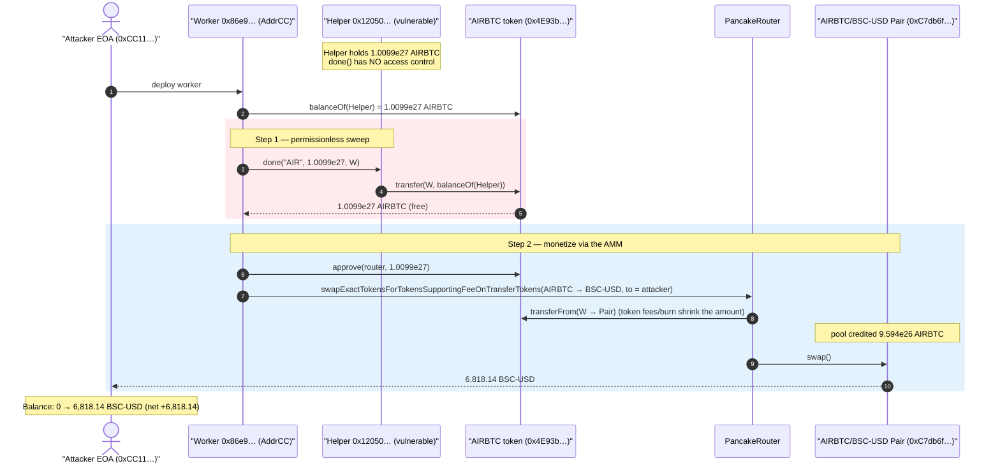
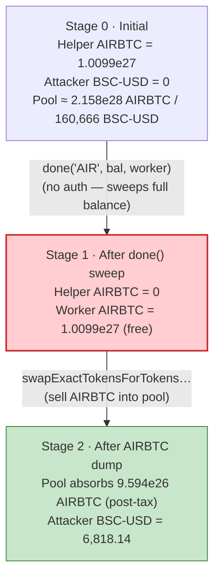
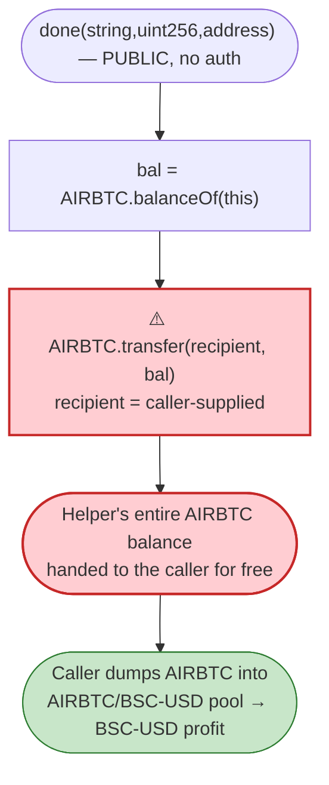

# AIRBTC Exploit — Permissionless `done()` Token-Sweep Drain of a Helper Contract

> **Reproduction:** the PoC compiles & runs in an isolated Foundry project at
> [this project folder](.) (the umbrella DeFiHackLabs repo contains many unrelated PoCs
> that do not whole-compile, so this one was extracted).
> Full verbose trace: [output.txt](output.txt).
> The vulnerable contract `0x12050…` is **unverified** on BscScan; its behaviour is
> reconstructed from the on-chain execution trace. The AIRBTC token source (a fee-on-transfer
> "Panda" token that holds the swap leg of the attack) is verified:
> [sources/PandaToken_4E93bF/PandaToken.sol](sources/PandaToken_4E93bF/PandaToken.sol).

---

## Key info

| | |
|---|---|
| **Loss** | ~$6.8k — **6,818.14 BSC-USD** drained from the AIRBTC/BSC-USD PancakeSwap pair |
| **Vulnerable contract** | unverified helper `0x12050…` — [`0x12050E4355a392162698C6cF30eB8c9e0777300d`](https://bscscan.com/address/0x12050E4355a392162698C6cF30eB8c9e0777300d) |
| **Asset swept** | **AIRBTC** token — [`0x4E93bFCD6378e564C454bF99E130AE10a1C7b2dd`](https://bscscan.com/address/0x4E93bFCD6378e564C454bF99E130AE10a1C7b2dd#code) |
| **Victim pool** | AIRBTC/BSC-USD PancakePair — [`0xC7db6f26c3B42F1d27865a41917C182614E63A66`](https://bscscan.com/address/0xC7db6f26c3B42F1d27865a41917C182614E63A66) |
| **Attacker EOA** | [`0xCC116696F9852C238A5c8D3d96418ddBa02357fc`](https://bscscan.com/address/0xcc116696f9852c238a5c8d3d96418ddba02357fc) |
| **Attacker contracts** | `0x62F57A14C2e8F3aC9DB05B81c8170d60F91F1B7A` (outer) → `0x86e9F4CA67E72312F5ed668d2FbEbC5Dc65e9E52` (worker) |
| **Attack tx** | [`0x00e4bbc86369d67e21b1910c4f9178c8257ce96192039a7839bd4d3593e1cd27`](https://app.blocksec.com/explorer/tx/bsc/0x00e4bbc86369d67e21b1910c4f9178c8257ce96192039a7839bd4d3593e1cd27) |
| **Chain / block / date** | BSC / 42,157,592 (forked at −1) / 2024-09-11 |
| **Compiler** | AIRBTC token: Solidity v0.8.18, optimizer 200 runs |
| **Bug class** | Missing access control — permissionless token-sweep (`done(string,uint256,address)`) |

---

## TL;DR

The helper contract `0x12050…` (unverified, AIRBTC-related, `owner() = 0xff3F3A…`) held a huge
balance of **AIRBTC** tokens — `1,009,907,600,196,326,551,673,167,843` wei (≈ 1.01e9 AIRBTC).
It exposes a function **`done(string,uint256,address)`** (selector `0x008ea502`) that, when invoked,
simply does:

```solidity
AIRBTC.transfer(recipient, AIRBTC.balanceOf(address(this)));   // sweeps its ENTIRE AIRBTC balance
```

There is **no access control** on `done()` — anyone can call it and name themselves as the
recipient. The attacker:

1. Read the AIRBTC balance held by `0x12050…` (`balanceOf(0x12050) = 1.0099e27`).
2. Called `done("AIR", 1.0099e27, attackerWorker)` — sweeping all of those AIRBTC into the
   attacker's worker contract `0x86e9…` for free.
3. Dumped the swept AIRBTC into the AIRBTC/BSC-USD PancakeSwap pool via
   `swapExactTokensForTokensSupportingFeeOnTransferTokens`, receiving **6,818.14 BSC-USD**, sent to
   the attacker EOA.

Net result: the attacker walked off with **6,818.14 BSC-USD (~$6.8k)** of pool liquidity, financed
entirely by tokens it was handed for free by the unprotected sweep. Profit = **+6,818.14 BSC-USD**,
starting from **0**.

---

## Background — what the pieces are

- **AIRBTC** ([sources/PandaToken_4E93bF/PandaToken.sol](sources/PandaToken_4E93bF/PandaToken.sol#L154)):
  a fee-on-transfer / auto-LP / reflection "Panda" template token (verified, symbol `AIRBTC`,
  18 decimals). It is `token0` of the victim pair. It charges large buy/sell fees, performs airdrop
  dust transfers, mines LP rewards, and burns to `0xdEaD` on sells — which is why the 1.0099e27 AIRBTC
  the attacker dumped did **not** all reach the pool intact (most was eaten by the token's own
  sell-tax / burn machinery — see the walkthrough).

- **`0x12050…`** (vulnerable, **unverified**): a 24 KB AIRBTC-ecosystem helper contract that, at the
  fork block, held `1,009,907,600,196,326,551,673,167,843` AIRBTC wei. It exposes
  `done(string,uint256,address)`. From the execution trace, the *only* thing this call does is
  `AIRBTC.transfer(recipient, AIRBTC.balanceOf(address(this)))` — i.e. it hands out its full AIRBTC
  balance to whatever address the caller passes, with no caller check.

- **AIRBTC/BSC-USD PancakePair** `0xC7db6f…`: the AMM pool holding the real BSC-USD liquidity that the
  attacker ultimately extracted. token0 = AIRBTC, token1 = BSC-USD (`0x55d398…`).

---

## The vulnerable code

`0x12050…` is unverified, so the snippet below is the **decoded behaviour** observed in the trace,
not verified Solidity. The function selector and arguments are decoded by Foundry directly from the
calldata the PoC builds.

### What `done()` does (decoded from the trace)

```text
# selector 0x008ea502  ==  done(string,uint256,address)
0x12050…::done("AIR", 1009907600196326551673167843, 0x86e9…AddrCC)
  └─ AIRBTC(0x4E93b…)::transfer(0x86e9…AddrCC, 1009907600196326551673167843)   # == balanceOf(0x12050)
       └─ Transfer(from: 0x12050…, to: 0x86e9…AddrCC, value: 1009907600196326551673167838)
       └─ ← true
  └─ ← Stop
```

[output.txt:1579-1696](output.txt#L1579-L1696) — the `done()` frame contains exactly one external
call: an AIRBTC `transfer` of the helper's *entire* AIRBTC balance to the attacker-controlled
recipient. There is no `require(msg.sender == owner)`, no role check, no signature — the call
succeeds for an arbitrary external caller.

### How the PoC reaches it

The PoC encodes the `done()` calldata by hand
([test/AIRBTC_exp.sol:52-58](test/AIRBTC_exp.sol#L52-L58)):

```solidity
// read the helper's full AIRBTC balance
uint256 bal = AIRBTC.balanceOf(0x12050…);

// done("AIR", bal, address(this)) — selector 0x008ea502, manual ABI encoding
bytes memory data = abi.encodeWithSelector(
    bytes4(0x008ea502),
    uint256(96),                    // offset to the string arg
    bal,                            // uint256 amount  == the full balance
    address(this),                  // recipient  == attacker worker
    uint256(3),                     // string length = 3
    bytes32(hex"4149520000…")       // "AIR"
);
(bool ok2,) = 0x12050….call(data);  // succeeds — no access control
```

The attacker then approves the router for the received AIRBTC and dumps it for BSC-USD
([test/AIRBTC_exp.sol:64-80](test/AIRBTC_exp.sol#L64-L80)).

---

## Root cause — why it was possible

A privileged "sweep / distribute" entry point on the helper contract was left **callable by anyone**:

1. **No authorization on `done()`.** The function transfers the contract's *entire* AIRBTC balance to
   a caller-supplied address. It should have been restricted to the owner / an internal distribution
   flow, but anyone can call it and set `recipient = self`.
2. **The helper custodied a large, liquid balance.** `0x12050…` held ≈ 1.0099e27 AIRBTC. Because the
   AIRBTC/BSC-USD pool had real BSC-USD liquidity, those swept tokens were directly monetizable: the
   attacker only needed to sell them into the pool.
3. **The asset is freely tradeable.** AIRBTC is listed against BSC-USD on PancakeSwap, so the swept
   tokens convert to a stablecoin in the same transaction — no off-chain step, no counterparty.

The AIRBTC token's heavy sell-tax / burn machinery actually *reduced* the take (most of the 1.0099e27
AIRBTC was burned/redistributed by the token on the way into the pool), but it could not prevent the
loss — the residual that did reach the pool was still enough to extract 6,818 BSC-USD of liquidity.

---

## Preconditions

- The helper `0x12050…` holds a non-zero AIRBTC balance (here ≈ 1.0099e27 AIRBTC).
- `done(string,uint256,address)` is externally callable by any address with no caller check.
- A liquid AIRBTC market exists (the AIRBTC/BSC-USD PancakeSwap pair) so the swept tokens can be sold.
- No capital is required: the attacker starts with **0** BSC-USD and **0** AIRBTC; the swept tokens
  are the entire working capital. The attack is a single self-contained transaction.

---

## Attack walkthrough (with on-chain numbers from the trace)

The pair is AIRBTC(`token0`)/BSC-USD(`token1`). All figures are taken from the `Transfer`, `Swap` and
`Sync` events in [output.txt](output.txt).

| # | Step | Concrete on-chain values | Source |
|---|------|--------------------------|--------|
| 0 | **Start** — attacker EOA holds 0 BSC-USD | `balanceOf(attacker) = 0` | [output.txt:1568-1570](output.txt#L1568-L1570) |
| 1 | Deploy attacker worker `0x86e9…` (AddrCC) inside `0x62F57…` (AttackerC) | — | [output.txt:1573-1574](output.txt#L1573-L1574) |
| 2 | Read helper's AIRBTC balance | `balanceOf(0x12050) = 1,009,907,600,196,326,551,673,167,843` (≈1.0099e27) | [output.txt:1577-1578](output.txt#L1577-L1578) |
| 3 | **Call `done("AIR", 1.0099e27, 0x86e9…)`** — unprotected sweep | helper transfers its full balance; worker receives `1,009,907,600,196,326,551,673,167,838` AIRBTC | [output.txt:1579-1588](output.txt#L1579-L1588) |
| 4 | Approve router for the swept AIRBTC | `approve(router, 1.0099e27)` | [output.txt:1699-1700](output.txt#L1699-L1700) |
| 5 | **Dump AIRBTC → BSC-USD** via `swapExactTokensForTokensSupportingFeeOnTransferTokens` | pool reserves before: **AIRBTC ≈ 2.158e28**, **BSC-USD ≈ 160,666 (1.6066e23)** | [output.txt:1704-1707](output.txt#L1704-L1707) |
| 5a | AIRBTC token's own fee/burn machinery fires during the transfer-in (sell tax, LP mine, burn to `0xdEaD`) — only part of the 1.0099e27 reaches the pool | AIRBTC actually credited to pool: **959,412,220,186,510,224,089,509,443** (9.594e26) | [output.txt:1815](output.txt#L1815) |
| 5b | Pair pays out BSC-USD to attacker EOA | `swap(0, 6,818,136,796,686,754,532,584, attacker, 0x)` → **6,818.14 BSC-USD** transferred to attacker | [output.txt:1836-1838](output.txt#L1836-L1838) |
| 6 | **End** — attacker EOA balance | `balanceOf(attacker) = 6,818,136,796,686,754,532,584` (**6,818.14 BSC-USD**) | [output.txt:1559](output.txt#L1559) |

> Note: between steps 5 and 5b the token also routed some BSC-USD/AIRBTC through its internal
> `swapTokenForFund` / `addLiquidity` accounting (the `0x63FF56…` and `0x72468E…` sub-swaps and the
> `mint()` at [output.txt:1794-1804](output.txt#L1794-L1804)). These are the token's own fee plumbing,
> not separate attacker actions — the attacker's logic is just *sweep, then sell*.

### Profit accounting

| | BSC-USD |
|---|---:|
| Attacker EOA balance before | 0.000000 |
| Swept AIRBTC cost to attacker | 0 (handed out for free by `done()`) |
| Attacker EOA balance after | **6,818.136797** |
| **Net profit** | **+6,818.136797 BSC-USD (~$6.8k)** |

The entire profit is unbacked: the attacker injected no capital, the AIRBTC came for free from the
unprotected sweep, and the BSC-USD came out of the pool's real liquidity.

---

## Diagrams

### Sequence of the attack



### Helper-balance / pool-state evolution



### The flaw inside `done()`



---

## Remediation

1. **Add access control to `done()`.** Any function that moves the contract's custodied token balance
   must check the caller — `onlyOwner` / a role / a trusted distributor. A privileged "finalize /
   distribute" routine must never be invocable by an arbitrary external address.
2. **Never let the caller name the beneficiary of a treasury transfer.** If a distribution must send
   tokens out, the destination(s) should be fixed in storage or derived from vetted state, not taken
   verbatim from `msg.data`.
3. **Do not custody large liquid balances in a thin helper.** The helper held > 1e9 AIRBTC against a
   live BSC-USD pool. Hold protocol funds in a hardened vault/treasury with explicit withdrawal
   authorization and limits, not in an ancillary contract.
4. **Add unit/invariant tests asserting that privileged sweeps revert for non-owners.** A single
   `vm.prank(attacker); vm.expectRevert(); helper.done(...)` test would have caught this.

---

## How to reproduce

The PoC was extracted into a standalone Foundry project (the umbrella DeFiHackLabs repo has many
unrelated PoCs that fail to whole-compile under `forge test`):

```bash
_shared/run_poc.sh 2024-09-AIRBTC_exp -vvvvv
```

- RPC: a **BSC archive** endpoint is required (fork block 42,157,591). `foundry.toml` uses
  `https://bsc-mainnet.public.blastapi.io`, which serves historical state at that block; most public
  BSC RPCs prune it and fail with `header not found` / `missing trie node`.
- Result: `[PASS] testPoC()` with the attacker EOA ending at **6,818.14 BSC-USD** from a 0 start.

Expected tail:

```
Ran 1 test for test/AIRBTC_exp.sol:ContractTest
[PASS] testPoC() (gas: 2008581)
Logs:
  before attack: balance of attacker: 0.000000000000000000
  after attack: balance of attacker: 6818.136796686754532584

Suite result: ok. 1 passed; 0 failed; 0 skipped
```

---

*Reference: TenArmor post-mortem — https://x.com/TenArmorAlert/status/1833825098962550802 (AIRBTC, BSC, ~$6.8K).*
