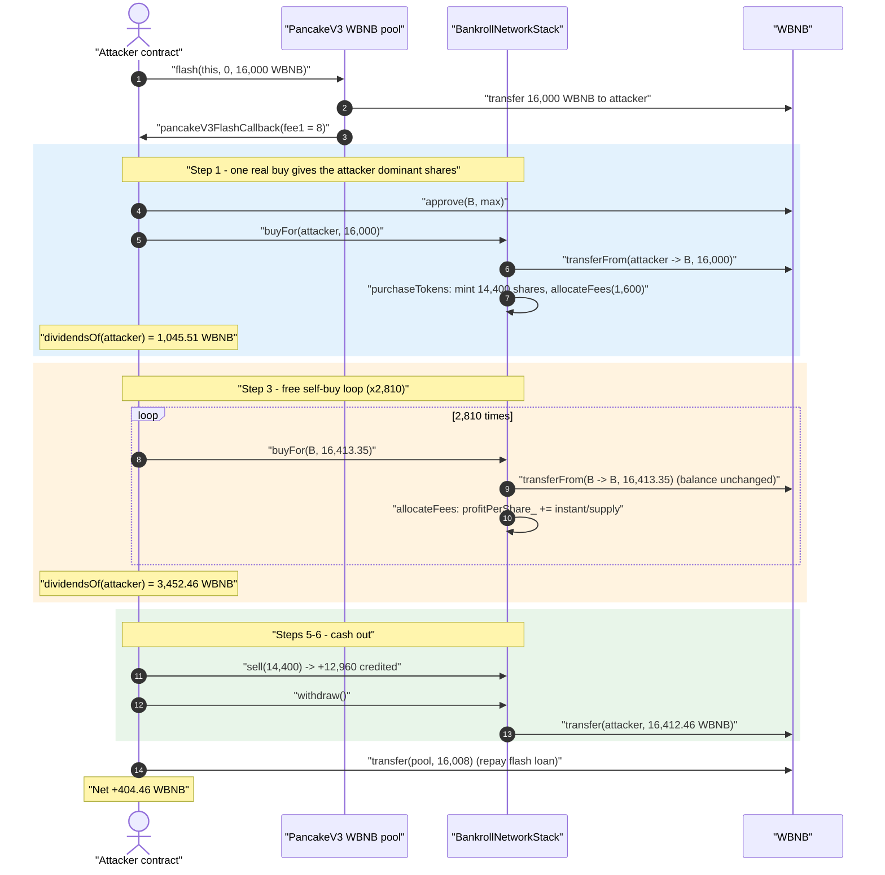
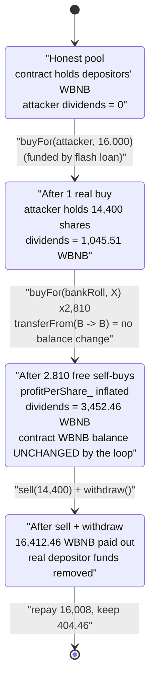
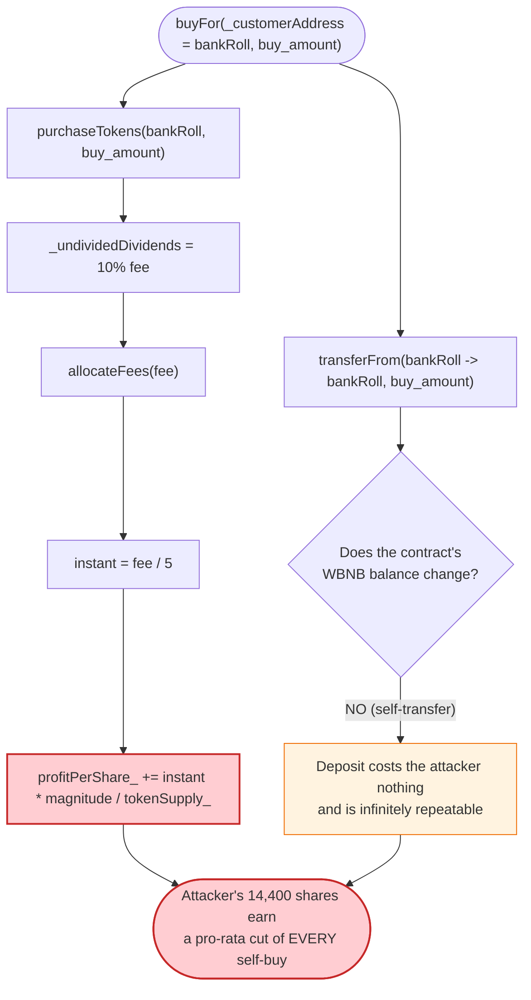

# Bankroll Network Stack Exploit — Self-Buy Dividend Inflation via `buyFor(bankRoll, …)`

> **Reproduction:** the PoC compiles & runs in an isolated Foundry project at
> [this project folder](.) (the umbrella DeFiHackLabs repo does not whole-compile,
> so this PoC was extracted into a standalone project).
> Full verbose trace: [output.txt](output.txt).
> Verified vulnerable source: [BankrollNetworkStack.sol](sources/BankrollNetworkStack_564D41/BankrollNetworkStack.sol).

---

## Key info

| | |
|---|---|
| **Loss** | **~404.46 WBNB** net profit (≈ 412.46 WBNB drained from the BankrollNetworkStack contract) |
| **Vulnerable contract** | `BankrollNetworkStack` — [`0x564D4126AF2B195fFAa7fB470ED658b1D9D07A54`](https://bscscan.com/address/0x564d4126af2b195ffaa7fb470ed658b1d9d07a54#code) |
| **Victim / value pool** | The `BankrollNetworkStack` contract's WBNB balance (LP/depositor funds) |
| **Liquidity source for attack** | PancakeSwap V3 WBNB pool `0x36696169C63e42cd08ce11f5deeBbCeBae652050` (flash loan only) |
| **Attacker EOA** | `0x4645863205b47a0a3344684489e8c446a437d66c` |
| **Attacker contract** | `0x8f921e27e3af106015d1c3a244ec4f48dbfcad14` (created contract `0x40122cEcaAaD5dd1c1da4d8cEc42120565C547D7`) |
| **Attack tx** | `0xd4c7c11c46f81b6bf98284e4921a5b9f0ff97b4c71ebade206cb10507e4503b0` |
| **Chain / block / date** | BSC / 42,481,611 (forked at `42,481,610`) / September 2024 |
| **Compiler** | Solidity **v0.4.26** (optimizer, 200 runs) |
| **Bug class** | Broken dividend-accounting invariant — a holder credits itself dividends by funding *other* accounts' purchases with the contract's own money |

---

## TL;DR

`BankrollNetworkStack` is a "dividend / staking pool" token (a TRX/ETH-clone "dapp" contract).
Every purchase pays a **10% entry fee**, and **one-fifth of that fee is paid out *instantly*** to the
pool's existing token holders by bumping the global `profitPerShare_`
([BankrollNetworkStack.sol:487-500](sources/BankrollNetworkStack_564D41/BankrollNetworkStack.sol#L487-L500)).

The fatal mistake is that **`buyFor(address _customerAddress, uint buy_amount)` is permissionless and
lets the caller direct a purchase to ANY address while funding it from that address's allowance**
([:200-216](sources/BankrollNetworkStack_564D41/BankrollNetworkStack.sol#L200-L216)). The attacker
calls `buyFor(address(bankRoll), …)` — i.e. it makes the **contract buy from itself**:

- The `transferFrom(bankRoll, bankRoll, X)` moves WBNB from the contract **to the contract** — its
  balance does not change, so the buy is *free* to repeat.
- But each such buy still runs the 10% fee through `allocateFees`, crediting `1/5` of the fee
  *instantly* to `profitPerShare_`, which the attacker (who holds real tokens) collects as dividends.

So the attacker:

1. Flash-borrows 16,000 WBNB from a PancakeSwap V3 pool.
2. Does one real buy — `buyFor(attacker, 16,000)` — to acquire 14,400 pool tokens. This single buy
   already mints **1,045.5 WBNB** of dividends to the attacker (the instant-fee + drip from its own
   16,000 deposit, applied to a pool the attacker now dominates).
3. Loops **`buyFor(bankRoll, 16,413)` 2,810 times** — each iteration is a self-funded "buy" that costs
   the contract nothing but pumps `profitPerShare_`, inflating the attacker's dividends from
   1,045.5 → **3,452.46 WBNB**.
4. `sell()`s its 14,400 tokens (another 12,960 WBNB credited) and `withdraw()`s everything —
   pulling **16,412.46 WBNB** out of the contract.
5. Repays the 16,008 WBNB flash loan and walks away with **404.46 WBNB**.

The loss is borne by the real depositors whose WBNB sat in `BankrollNetworkStack`.

---

## Background — what BankrollNetworkStack does

`BankrollNetworkStack` ([source](sources/BankrollNetworkStack_564D41/BankrollNetworkStack.sol)) is a
classic "staking / dividend" contract in the lineage of the old TRON/ETH "PoWH/Bankroll" dapps,
ported to BSC and denominated in **WBNB** (the `token` it accounts in is WBNB).

Users **buy** internal pool tokens with WBNB; holders receive **dividends** sourced from the
buy/sell fees of everyone else. The accounting is the standard "masternode" pattern:

- `tokenBalanceLedger_[user]` — internal token (share) balance of `user`.
- `tokenSupply_` — total internal shares.
- `profitPerShare_` — a global accumulator (scaled by `magnitude = 2**64`) of WBNB-per-share earned.
- `payoutsTo_[user]` — a per-user offset so a user only earns dividends accrued *after* they bought.
- `dividendsOf(user) = (profitPerShare_ * tokenBalanceLedger_[user] - payoutsTo_[user]) / magnitude`
  ([:428-429](sources/BankrollNetworkStack_564D41/BankrollNetworkStack.sol#L428-L429)).

On-chain parameters at the fork block:

| Parameter | Value | Meaning |
|---|---|---|
| `entryFee_` | **10** | 10% fee on every buy |
| `exitFee_` | **10** | 10% fee on every sell |
| `dripFee` | 80 | 80% of fees go to the slow "drip", 20% paid instantly |
| `payoutRate_` | 2 | 2% of the drip pool released per day |
| `magnitude` | `2**64` | fixed-point scaling for `profitPerShare_` |
| `distributionInterval` | 2 s | how often the drip is pushed into `profitPerShare_` |

The instant payout is hard-coded as `instant = fee / 5` (i.e. **20% of the fee**) in `allocateFees`
([:491](sources/BankrollNetworkStack_564D41/BankrollNetworkStack.sol#L491)).

---

## The vulnerable code

### 1. `buyFor` — permissionless, third-party-funded, self-targetable

```solidity
function buyFor(address _customerAddress, uint buy_amount) public returns (uint256)  {
    require(token.transferFrom(_customerAddress, address(this), buy_amount));   // ⚠️ pulls from _customerAddress
    totalDeposits += buy_amount;
    uint amount = purchaseTokens(_customerAddress, buy_amount);                 // credits shares to _customerAddress
    emit onLeaderBoard(...);
    distribute();
    return amount;
}
```
([BankrollNetworkStack.sol:200-216](sources/BankrollNetworkStack_564D41/BankrollNetworkStack.sol#L200-L216))

Anyone can call this with **any** `_customerAddress`. When `_customerAddress == address(this)`
(the contract itself), `transferFrom(bankRoll, bankRoll, buy_amount)` is a no-op on the contract's
balance — yet the buy is processed in full.

### 2. `purchaseTokens` → `allocateFees` — every buy mints instant dividends to all holders

```solidity
function purchaseTokens(address _customerAddress, uint256 _incomingeth) internal returns (uint256) {
    ...
    uint256 _undividedDividends = SafeMath.mul(_incomingeth, entryFee_) / 100;     // 10% fee
    uint256 _amountOfTokens     = SafeMath.sub(_incomingeth, _undividedDividends); // 90% → shares
    ...
    tokenSupply_ += _amountOfTokens;
    allocateFees(_undividedDividends);                                             // ⚠️ distributes the fee
    tokenBalanceLedger_[_customerAddress] += _amountOfTokens;
    payoutsTo_[_customerAddress] += (int256)(profitPerShare_ * _amountOfTokens);
    ...
}

function allocateFees(uint fee) private {
    uint256 instant = fee.div(5);                                                  // 20% of the fee, paid NOW
    if (tokenSupply_ > 0) {
        profitPerShare_ = SafeMath.add(profitPerShare_, (instant * magnitude) / tokenSupply_); // ⚠️ global credit
    }
    dividendBalance_ += fee.safeSub(instant);                                      // 80% → slow drip
}
```
([:534-581](sources/BankrollNetworkStack_564D41/BankrollNetworkStack.sol#L534-L581),
[:487-500](sources/BankrollNetworkStack_564D41/BankrollNetworkStack.sol#L487-L500))

`profitPerShare_` is global. The instant fee from a buy targeted at the contract itself is credited to
**every** holder pro-rata — including the attacker, who deliberately holds nearly all of the
"real" share weight.

### 3. `withdraw` — pays out the inflated dividends in real WBNB

```solidity
function withdraw() onlyStronghands public {
    address _customerAddress = msg.sender;
    uint256 _dividends = myDividends();                       // inflated by the loop
    payoutsTo_[_customerAddress] += (int256)(_dividends * magnitude);
    token.transfer(_customerAddress, _dividends);             // ⚠️ real WBNB leaves the contract
    ...
}
```
([:260-290](sources/BankrollNetworkStack_564D41/BankrollNetworkStack.sol#L260-L290))

---

## Root cause — why it was possible

The dividend model assumes a buy is **net-new capital entering the pool**: someone deposits WBNB,
keeps 90% as shares, and gifts 10% (split instant/drip) to existing holders. The 20%-instant slice is
"safe" only because the depositor *forfeits* it.

`buyFor` breaks that assumption in two compounding ways:

1. **The buy can be funded from an account the caller doesn't own** — `transferFrom(_customerAddress, …)`.
   The function never checks `msg.sender == _customerAddress` nor that an *external* party actually
   parted with funds. Pointing `_customerAddress` at the **contract itself** makes the deposit a
   balance-neutral self-transfer: `transferFrom(bankRoll, bankRoll, X)` leaves the contract's WBNB
   balance unchanged.

2. **Every buy unconditionally bumps `profitPerShare_`** (via `allocateFees`), regardless of whether
   the "deposit" added any real WBNB to the contract. A self-buy therefore *manufactures* dividends
   out of nothing: no new WBNB came in, but `profitPerShare_` still rose by
   `(instant * magnitude) / tokenSupply_`, and the attacker — holding real shares — pockets its
   pro-rata cut.

Because the self-buy is free (no balance change) and can be repeated arbitrarily, the attacker pumps
`profitPerShare_` 2,810 times until its own `dividendsOf(...)` exceeds the WBNB it must repay. The
dividends are paid from the contract's **standing WBNB balance** — i.e. the funds of honest
depositors — so the manufactured "profit" is in reality a theft of pool reserves.

The contract is built around the (false) invariant `contract WBNB balance ≈ Σ deposits − Σ withdrawals`.
A self-funded buy increments the accounting (`totalDeposits`, `profitPerShare_`, share supply) **without**
moving the corresponding WBNB, so the payable dividends drift above the WBNB actually backing them, and
the first withdrawer drains the difference.

---

## Preconditions

- The contract holds a meaningful WBNB balance from real depositors (so there is something to drain).
- The attacker can supply WBNB to perform the **one** real buy that gives it dominant share weight.
  This is fully **flash-loanable** — the PoC borrows 16,000 WBNB from a PancakeSwap V3 pool and repays
  it in the same transaction.
- `buyFor` is `public` with no caller/recipient validation and no reentrancy/economic guard — true on
  the deployed contract.

There is **no** privileged role, no timing window, and no oracle involved — any EOA can execute this.

---

## Attack walkthrough (with on-chain numbers from the trace)

All figures are taken directly from the events/returns in
[output.txt](output.txt). The pool token uses no decimals scaling in the dividend math; WBNB has 18.

| # | Step | Call | Concrete numbers | Effect |
|---|------|------|------------------|--------|
| 0 | **Flash loan** | `pool.flash(this, 0, 16_000e18)` | borrow **16,000 WBNB**, fee **8 WBNB** | attacker now holds 16,000 WBNB |
| 1 | **Approve + first real buy** | `bankRoll.buyFor(attacker, 16_000e18)` | fee = 1,600; shares minted = **14,400**; `dividendsOf(attacker)` jumps to **1,045.51 WBNB** | attacker holds 14,400 shares and is the dominant holder |
| 2 | **Read state** | `myTokens()` / `dividendsOf()` | balance 14,400 shares; dividends **1,045.51 WBNB** | baseline before the pump |
| 3 | **Self-buy loop ×2,810** | `bankRoll.buyFor(bankRoll, 16,413.35e18)` | each: `transferFrom(bankRoll→bankRoll)` (balance unchanged), fee 1,641.33, instant 328.27 added to `profitPerShare_`; shares minted 14,772 each | `profitPerShare_` pumped repeatedly; **no WBNB enters the contract** |
| 4 | **Read state** | `dividendsOf(attacker)` | dividends now **3,452.46 WBNB** | dividends inflated ≈3.3× by the free self-buys |
| 5 | **Sell shares** | `bankRoll.sell(14,400e18)` | taxed proceeds **12,960 WBNB** credited (10% exit fee) | attacker's claimable balance grows further |
| 6 | **Withdraw** | `bankRoll.withdraw()` | `token.transfer(attacker, **16,412.46 WBNB**)` | real WBNB leaves the contract to the attacker |
| 7 | **Repay flash loan** | `WBNB.transfer(pool, 16,008e18)` | 16,000 principal + 8 fee | loan closed |
| 8 | **Settle** | — | attacker WBNB balance = **404.46 WBNB** | net profit |

### The self-buy is balance-neutral (the crux)

In step 3 every iteration emits:

```
buyFor(bankRoll, 16413.35e18)
  └─ WBNB.transferFrom(from: bankRoll, to: bankRoll, value: 16413.35e18)  → true   (balance unchanged)
     onTokenPurchase(bankRoll, 16413.35e18, 14772.01e18, …)                        (fee processed anyway)
```
The contract "buys from itself": its WBNB balance is untouched, but `allocateFees` still credits
`instant = 16413.35 × 10% / 5 = 328.27` WBNB-equivalent into `profitPerShare_`, of which the attacker's
14,400 shares earn a pro-rata slice. 2,810 free iterations turn 1,045.51 WBNB of dividends into
3,452.46 WBNB.

### Profit / loss accounting (WBNB)

| Direction | Amount (WBNB) |
|---|---:|
| Flash-borrowed | 16,000.00 |
| Flash repaid (principal + 8 fee) | 16,008.00 |
| Withdrawn from `BankrollNetworkStack` (`withdraw()`) | 16,412.46 |
| **Net profit to attacker** | **+404.46** |
| **Net drained from the contract** (404.46 + 8 flash fee) | **≈412.46** |

The 404.46 WBNB profit (matching the PoC's `[End] Attacker WBNB after exploit: 404.45...`) is paid
out of the honest depositors' WBNB held by `BankrollNetworkStack`.

---

## Diagrams

### Sequence of the attack



### Dividend-accounting state evolution



### Why the self-buy is free yet still pays dividends



---

## Remediation

1. **Validate `buyFor` funding.** Either require `msg.sender == _customerAddress`, or ensure the
   funding account is *not* the contract itself (`require(_customerAddress != address(this))`).
   Better: make `buyFor` pull from `msg.sender` and only assign shares to `_customerAddress`, so a buy
   always reflects real, externally-supplied capital.
2. **Tie dividend minting to real balance deltas.** `allocateFees` should only credit `profitPerShare_`
   based on WBNB the contract *actually received* in this call — e.g. measure
   `token.balanceOf(this)` before/after the `transferFrom` and treat a zero delta as a zero-fee buy.
   A balance-neutral self-transfer must produce zero dividends.
3. **Disallow the contract as a holder.** The contract should never appear in `tokenBalanceLedger_`
   or fund its own purchases; reject `_customerAddress == address(this)` everywhere.
4. **Add a global solvency invariant.** Before any `withdraw`/`sell` payout, assert that the sum of
   claimable dividends plus share-backing does not exceed `token.balanceOf(address(this))`, so the
   pool can never pay out more WBNB than it actually holds.
5. **Add reentrancy/economic rate-limits.** Although this exploit is not a reentrancy bug, gating
   purchase volume per block and disabling self-referential flows would have blunted the 2,810-iteration
   pump.

---

## How to reproduce

The PoC was extracted into a standalone Foundry project (the umbrella DeFiHackLabs repo has several
unrelated PoCs that fail to compile under a single `forge test` build):

```bash
_shared/run_poc.sh 2024-09-Bankroll_exp -vvvvv
```

- RPC: a **BSC archive** endpoint is required (the fork block 42,481,610 is old). `foundry.toml` uses
  `https://bsc-mainnet.public.blastapi.io`, which serves historical state at that block; most pruned
  public BSC RPCs fail with `header not found` / `missing trie node`.
- Result: `[PASS] testExploit()`.

Expected tail:

```
  [Before] Attacker bank roll balance: 14400000000000000000000.0
  [Before] Attacker bank roll dividends: 1045508120107718533654.0
  [After] Attacker bank roll balance: 14400000000000000000000.0
  [After] Attacker bank roll dividends: 3452458722182696226367.0
  [End] Attacker WBNB after exploit: 404.458722182696226367

Suite result: ok. 1 passed; 0 failed; 0 skipped
```

---

*Reference: PoC header — Total Lost ~404 WBNB. Analysis: https://x.com/Phalcon_xyz/status/1838042368018137547*
