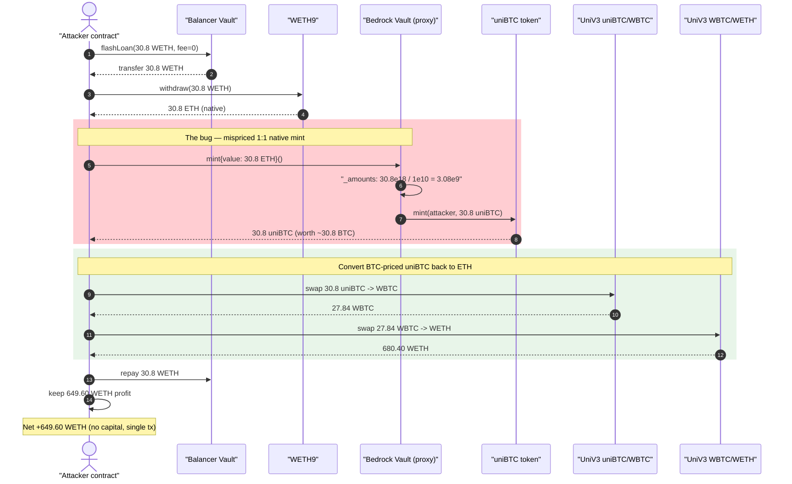
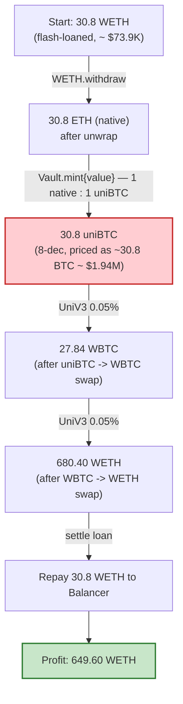
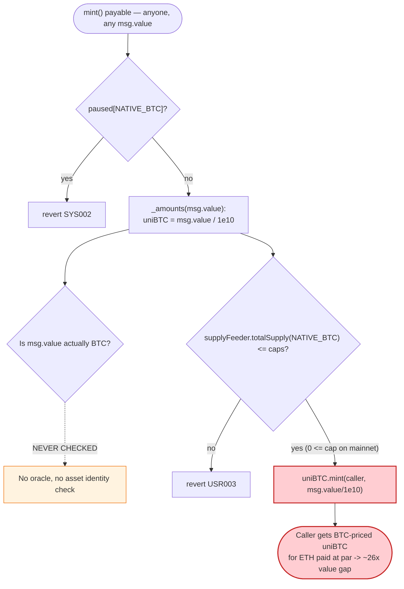

# Bedrock DeFi (uniBTC) Exploit — `mint()` Prices Native ETH 1:1 as Native BTC

> **Reproduction:** the PoC compiles & runs in an isolated Foundry project at
> [this project folder](.) (the umbrella DeFiHackLabs repo contains many
> unrelated PoCs that do not whole-compile, so this one was extracted).
> Full verbose trace: [output.txt](output.txt).
> Verified vulnerable source: [Vault.sol](sources/Vault_702696/Vault.sol).

---

## Key info

| | |
|---|---|
| **Loss** | ~**$1.7M** total during the incident; this PoC reproduces a single flash-loan round netting **649.60 WETH** (≈ $1.55M at the time) |
| **Vulnerable contract** | Bedrock `Vault` (implementation) — [`0x702696b2aA47fD1D4feAAF03CE273009Dc47D901`](https://etherscan.io/address/0x702696b2aa47fd1d4feaaf03ce273009dc47d901#code) |
| **Proxy (entry point)** | `Vault` `TransparentUpgradeableProxy` — [`0x047D41F2544B7F63A8e991aF2068a363d210d6Da`](https://etherscan.io/address/0x047D41F2544B7F63A8e991aF2068a363d210d6Da) |
| **Minted token** | `uniBTC` (8-decimal, BTC-pegged) — `0x004E9C3EF86bc1ca1f0bB5C7662861Ee93350568` |
| **Drained via** | Uniswap V3 `uniBTC/WBTC` 0.05% pool `0x3a32F5040Bc4d8417e78E236eb2C48c90e003FDa`, then `WBTC/WETH` 0.05% pool `0x4585FE77225b41b697C938B018E2Ac67Ac5a20c0` |
| **Attacker EOA** | [`0x2bFB373017349820dda2Da8230E6b66739BE9F96`](https://etherscan.io/address/0x2bFB373017349820dda2Da8230E6b66739BE9F96) |
| **Attacker contract** | [`0x0C8da4f8B823bEe4D5dAb73367D45B5135B50faB`](https://etherscan.io/address/0x0C8da4f8B823bEe4D5dAb73367D45B5135B50faB) |
| **Attack tx** | [`0x725f0d65340c859e0f64e72ca8260220c526c3e0ccde530004160809f6177940`](https://etherscan.io/tx/0x725f0d65340c859e0f64e72ca8260220c526c3e0ccde530004160809f6177940) |
| **Chain / block / date** | Ethereum mainnet / fork at 20,836,583 (attack block 20,836,584) / Sept 26, 2024 |
| **Compiler** | Solidity v0.8.17, optimizer **200 runs** |
| **Bug class** | Mispriced minting — native asset (ETH) assumed to be BTC; wrong-chain / missing-oracle deployment |

---

## TL;DR

Bedrock's `Vault.mint()` payable function mints `uniBTC` (a 1:1 BTC-pegged token, 8 decimals) in
exchange for the chain's **native coin**, treating `msg.value` as if it were native BTC at a flat
**1 native : 1 uniBTC** ratio. The only conversion applied is a pure decimal rescale —
`uniBTCAmt = msg.value / 1e10` ([Vault.sol:2531-2534](sources/Vault_702696/Vault.sol#L2531-L2534)) —
which turns 18-decimal native into 8-decimal uniBTC. There is **no price oracle and no asset check**:
the code implicitly assumes "the native coin of this chain *is* BTC."

That assumption is only true on Bitcoin-L2 chains (where the gas token is BTC). On **Ethereum
mainnet**, the deployed `Vault` happily accepts **ETH** and mints the *same nominal amount* of uniBTC —
so 1 ETH (≈ $2,400 at the time) buys 1 uniBTC (≈ $63,000 worth of BTC). The attacker simply:

1. Flash-loans **30.8 WETH** from Balancer (zero fee), unwraps to 30.8 ETH.
2. Calls `Vault.mint{value: 30.8 ETH}()` → receives **30.8 uniBTC** (3.08e9 wei, 8 dec).
3. Swaps that uniBTC → **27.84 WBTC** on the uniBTC/WBTC Uni-V3 pool.
4. Swaps the WBTC → **680.40 WETH** on the WBTC/WETH Uni-V3 pool.
5. Repays the 30.8 WETH flash loan and keeps **649.60 WETH** profit — all in one transaction.

The bug is permissionless, deterministic, and flash-loan-funded; profit scales linearly with available
flash-loan size (the `testPoCMinimal` test shows 200 ETH → 200 uniBTC just as cleanly).

---

## Background — what Bedrock / uniBTC is

Bedrock is a liquid-(re)staking protocol; **uniBTC** is its BTC-denominated receipt token. Users
deposit BTC (or wrapped BTC such as WBTC) and receive uniBTC 1:1 against the BTC value deposited.
The same `Vault` contract is deployed on multiple chains, including Bitcoin-L2s where the native gas
coin is BTC itself — there, accepting `msg.value` as BTC is correct.

The `Vault` ([source](sources/Vault_702696/Vault.sol)) exposes two minting paths:

- **`mint()` payable** ([:2413-2416](sources/Vault_702696/Vault.sol#L2413-L2416)) — mint uniBTC against
  the **native coin** (`msg.value`). Intended for native-BTC chains.
- **`mint(address _token, uint256 _amount)`** ([:2421-2424](sources/Vault_702696/Vault.sol#L2421-L2424))
  — mint uniBTC against a wrapped-BTC ERC20 (e.g. WBTC), pulling the token via `safeTransferFrom`.

Both ultimately rescale by decimals only — they never consult a BTC/native price. The wrapped-token
path is at least *somewhat* safe by construction (the caller has to hand over real WBTC), but the
**native path on a non-BTC chain is free money**: ETH is ~26× cheaper than BTC, yet mints uniBTC at par.

On-chain facts at the fork block (from the trace):

| Parameter | Value | Source |
|---|---|---|
| `EXCHANGE_RATE_BASE` | `1e10` (the 18→8 decimal divisor) | [:2399](sources/Vault_702696/Vault.sol#L2399) |
| `NATIVE_BTC` sentinel | `0xbeDF…FFFF` | [:2396](sources/Vault_702696/Vault.sol#L2396) |
| `NATIVE_BTC_DECIMALS` | `18` | [:2397](sources/Vault_702696/Vault.sol#L2397) |
| `supplyFeeder.totalSupply(NATIVE_BTC)` | **0** (no real native-BTC tracked on mainnet) | trace |
| `caps[NATIVE_BTC]` | non-zero (cap check passed) | trace (`USR003` not raised) |
| uniBTC decimals | 8 | trace (`mint(...,2e10)` for 200 native) |

---

## The vulnerable code

### 1. The payable mint accepts native value with no asset/price check

```solidity
// Vault.sol:2413
function mint() external payable {
    require(!paused[NATIVE_BTC], "SYS002");
    _mint(msg.sender, msg.value);              // ⚠️ msg.value (ETH) treated as native BTC
}
```

### 2. `_mint` only checks a cap, never a price

```solidity
// Vault.sol:2500
function _mint(address _sender, uint256 _amount) internal {
    (, uint256 uniBTCAmount) = _amounts(_amount);   // ⚠️ decimal rescale only
    require(uniBTCAmount > 0, "USR010");

    uint256 totalSupply = ISupplyFeeder(supplyFeeder).totalSupply(NATIVE_BTC);
    require(totalSupply <= caps[NATIVE_BTC], "USR003");   // ⚠️ cap checked WITHOUT +_amount

    IMintableContract(uniBTC).mint(_sender, uniBTCAmount); // mints uniBTC to caller
    emit Minted(NATIVE_BTC, _amount);
}
```

### 3. The "conversion" is a pure decimal shift — 1 native = 1 uniBTC

```solidity
// Vault.sol:2531
function _amounts(uint256 _amount) internal returns (uint256, uint256) {
    uint256 uniBTCAmt = _amount / EXCHANGE_RATE_BASE;     // 1e18 native → 1e8 uniBTC
    return (uniBTCAmt * EXCHANGE_RATE_BASE, uniBTCAmt);
}
```

`30.8e18` wei of ETH ÷ `1e10` = `3.08e9` = **30.8 uniBTC** (8-dec). No oracle, no haircut, no asset
identity check. The same arithmetic governs the wrapped-token 18-decimal branch
([:2539-2547](sources/Vault_702696/Vault.sol#L2539-L2547)).

---

## Root cause — why it was possible

The protocol's economic model is *"uniBTC is worth exactly the BTC backing it,"* and the native-mint
path enforces that **only on chains where the native coin is BTC.** The mainnet deployment carried that
assumption across to a chain whose native coin is **ETH**, which breaks the peg backing:

> `mint()` mints `msg.value / 1e10` uniBTC unconditionally. On mainnet, `msg.value` is ETH. The
> contract has no way to know it is being paid in the wrong asset — there is **no price feed comparing
> the deposited asset to BTC**, and the `NATIVE_BTC` sentinel is just a bookkeeping key, not a check
> that the native coin equals BTC.

Three compounding factors turn this into a one-shot, capital-free drain:

1. **No oracle / no value parity.** uniBTC is minted 1:1 by *nominal* amount, not by *value*. With
   BTC≈26× ETH, every 1 ETH minted yields ~26× its value in uniBTC.
2. **Deep liquid exit markets.** uniBTC→WBTC and WBTC→WETH both have liquid Uniswap V3 pools, so the
   over-minted uniBTC is immediately convertible to ETH at near-BTC pricing.
3. **Flash-loanable input.** The native coin needed is just unwrapped WETH; a zero-fee Balancer flash
   loan supplies it, so the attacker risks **no capital** and profit is bounded only by exit-pool depth.

The cap check (`totalSupply <= caps[NATIVE_BTC]`) was not a meaningful guard: it (a) checks the cap
*before* adding the new amount, and (b) reads `supplyFeeder.totalSupply(NATIVE_BTC) = 0` on mainnet, so
it trivially passed.

---

## Preconditions

- The mainnet `Vault` has the native-mint path **unpaused** (`paused[NATIVE_BTC] == false`) and a
  non-zero `caps[NATIVE_BTC]`. Both held at the attack block.
- A liquid path from uniBTC back to ETH exists (uniBTC/WBTC + WBTC/WETH Uni-V3 pools). It did.
- Working ETH to feed `mint()`. Fully flash-loanable — the PoC borrows **30.8 WETH** from Balancer
  ([Bedrock_DeFi_exp.sol:73](test/Bedrock_DeFi_exp.sol#L73)) with **zero fee**
  (`getFlashLoanFeePercentage()` returned 0 in the trace).

---

## Attack walkthrough (with on-chain numbers from the trace)

All figures are taken directly from the `Transfer`/`Swap`/`Withdrawal` events in
[output.txt](output.txt). Units: ETH/WETH are 18-dec; uniBTC and WBTC are 8-dec.

| # | Step | Amount in | Amount out | Effect |
|---|------|-----------|------------|--------|
| 0 | **Flash loan** 30.8 WETH from Balancer (fee = 0) | — | 30.8 WETH | Borrowed capital, no fee. |
| 1 | `WETH.withdraw(30.8e18)` → unwrap to native ETH | 30.8 WETH | 30.8 ETH | Attacker contract now holds 30.8 ETH. |
| 2 | `Vault.mint{value: 30.8 ETH}()` | 30.8 ETH | **3,080,000,000 uniBTC** (30.8 uniBTC) | ⚠️ Mispriced 1:1 mint. ETH valued as BTC. |
| 3 | Uni-V3 swap uniBTC→WBTC (0.05% pool) | 3.08e9 uniBTC | **2,783,925,883 WBTC** (27.84 WBTC) | uniBTC dumped near its peg into WBTC. |
| 4 | Uni-V3 swap WBTC→WETH (0.05% pool) | 2.784e9 WBTC | **680,404,054,576,756,594,919 wei** (680.40 WETH) | WBTC converted to WETH at BTC price. |
| 5 | Repay flash loan: `WETH.transfer(Balancer, 30.8e18)` | 30.8 WETH | — | Loan settled. |
| 6 | `WETH.transfer(attacker EOA, …)` | — | **649,604,054,576,756,594,919 wei** (649.60 WETH) | Profit swept to attacker. |

Sanity check on step 2 in the standalone `testPoCMinimal` test: `mint{value: 200 ETH}()` minted exactly
`20,000,000,000` uniBTC = **200 uniBTC** — confirming the flat 1 native : 1 uniBTC rate
([Bedrock_DeFi_exp.sol:44-47](test/Bedrock_DeFi_exp.sol#L44-L47)).

### Profit accounting (WETH)

| Direction | Amount (WETH) |
|---|---:|
| Borrowed (Balancer flash loan) | 30.80 |
| Repaid (flash loan, 0 fee) | 30.80 |
| Gross received from WBTC→WETH swap | 680.40 |
| **Net profit to attacker** | **+649.60** |

The 649.60 WETH net (≈ $1.55M at the time) is the value gap between the BTC-priced uniBTC the vault
minted and the ETH actually paid in. The reported total incident loss across the multi-round campaign
was **~$1.7M**.

---

## Diagrams

### Sequence of the attack



### Value transformation per hop



### Why `mint()` overpays — decision flow



---

## Remediation

1. **Never mint a pegged asset against an unverified collateral.** The native-mint path must only be
   enabled on chains where the native coin *is* BTC. On any other chain, `mint()` payable should be
   disabled (or the contract should not be deployed with that path live). A per-chain config flag
   gating the native path would have prevented this entirely.
2. **Price by value, not by nominal amount.** If accepting non-BTC collateral is intended, run the
   deposited asset through a BTC-denominated oracle and mint `uniBTC = depositValueInBTC`, not
   `deposit / 1e10`. The decimal-only `_amounts()` conversion conflates "rescale decimals" with
   "convert value."
3. **Validate the cap correctly.** `_mint` checks `totalSupply <= caps[NATIVE_BTC]` *before* adding the
   new mint; it should be `totalSupply + uniBTCAmount <= caps[NATIVE_BTC]` (as the wrapped-token branch
   does at [:2520](sources/Vault_702696/Vault.sol#L2520)). A correctly low NATIVE_BTC cap on mainnet
   would also have bounded the loss.
4. **Pause unused mint paths on deploy.** The native path should have been `paused[NATIVE_BTC] = true`
   by default on EVM chains where it is meaningless, with explicit opt-in only on BTC-L2s.
5. **Treat receipt-token mints as the highest-risk surface.** Any function that creates protocol IOUs
   from external value needs an oracle, a sanity bound, and an asset-identity check — minting at a flat
   ratio with no price reference is the canonical "mispriced mint" failure.

---

## How to reproduce

The PoC was extracted into a standalone Foundry project (the umbrella DeFiHackLabs repo has many
unrelated PoCs that fail to compile under a single `forge test` build):

```bash
_shared/run_poc.sh 2024-09-Bedrock_DeFi_exp -vvvvv
```

- RPC: an **Ethereum mainnet archive** endpoint is required (fork block 20,836,583). `foundry.toml`
  uses an Infura archive endpoint; if it 401s/rate-limits, rotate the `/v3/<key>` to another key.
- Result: both tests pass. `testPoCMinimal()` shows the 1:1 mint (200 ETH → 200 uniBTC);
  `testPoCReplicate()` runs the full flash-loan round and prints **649.60 WETH** of profit.

Expected tail:

```
[PASS] testPoCMinimal() (gas: 93858)
  Final balance in uniBTC : 20000000000
[PASS] testPoCReplicate() (gas: 4155552)
  Final balance in WETH : 649604054576756594919
Suite result: ok. 2 passed; 0 failed; 0 skipped
```

---

*References: DeFiHackLabs PoC by [rotcivegaf](https://twitter.com/rotcivegaf); SlowMist Hacked —
https://hacked.slowmist.io/ (Bedrock DeFi, Ethereum, ~$1.7M).*
