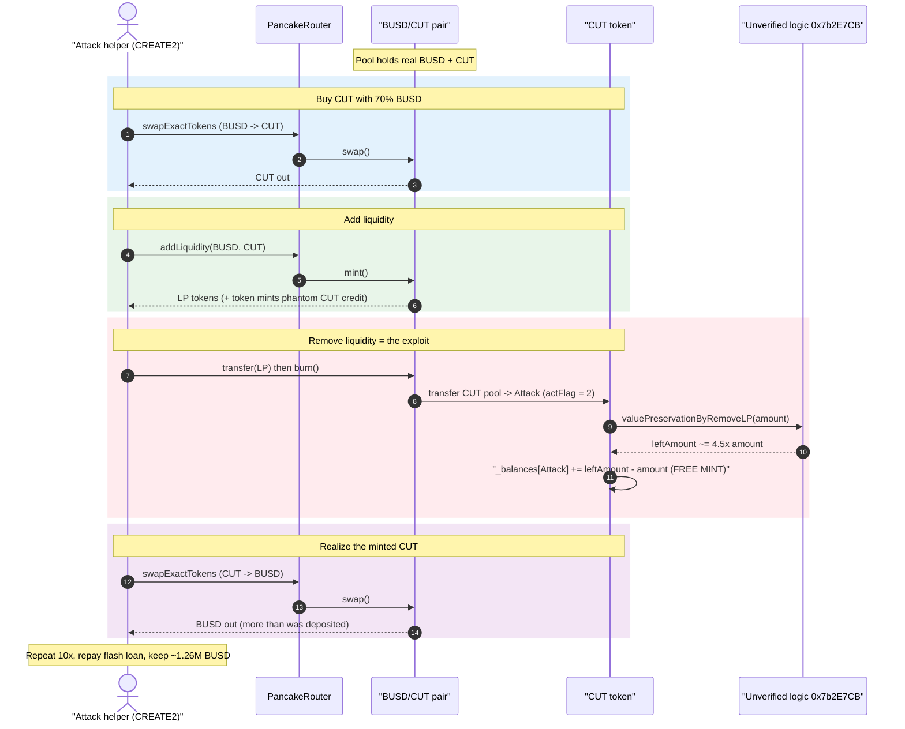
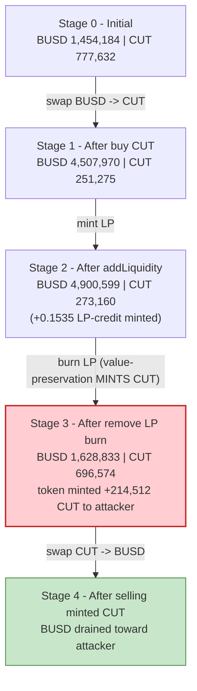
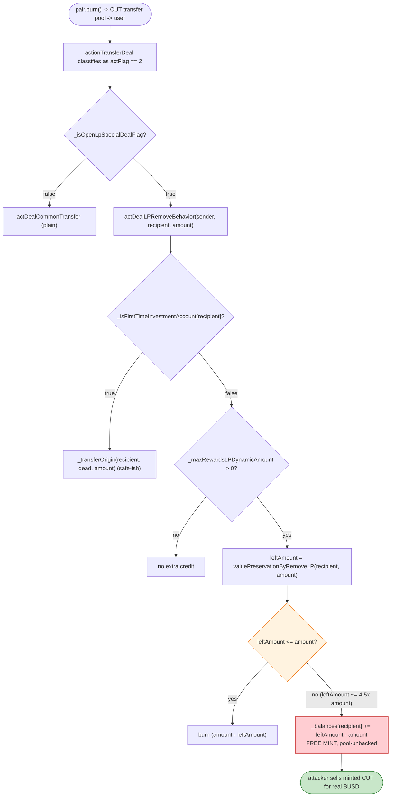

# Caterpillar Coin (CUT) Exploit — LP-Removal "Value Preservation" Mints Free Tokens

> **Vulnerability classes:** vuln/logic/incorrect-state-transition · vuln/arithmetic/rounding

> **Reproduction:** the PoC compiles & runs in an isolated Foundry project at
> [this project folder](.) (the umbrella DeFiHackLabs repo contains several unrelated PoCs that
> do not whole-compile, so this one was extracted).
> Full verbose trace: [output.txt](output.txt).
> Verified vulnerable source (CUT token logic): [Main.sol](sources/BEP20USDT_7057F3/flat/Main.sol).
> PoC: [test/Caterpillar_Coin_CUT_exp.sol](test/Caterpillar_Coin_CUT_exp.sol).

---

## Key info

| | |
|---|---|
| **Loss** | ~$1.26M — **1,260,378 BUSD** net profit drained from the BUSD/CUT PancakeSwap pool (PoC header rounds the campaign to ~$1.4M across all attack txs) |
| **Vulnerable contract** | `CUT` token (verified as `BEP20USDT`) — [`0x7057F3b0F4D0649B428F0D8378A8a0E7D21d36a7`](https://bscscan.com/address/0x7057F3b0F4D0649B428F0D8378A8a0E7D21d36a7#code), with logic in unverified helper [`0x7b2E7CB89824236CB7096cDE7A153AF30f3EcBaf`](https://bscscan.com/address/0x7b2E7CB89824236CB7096cDE7A153AF30f3EcBaf) |
| **Victim pool** | BUSD/CUT pair — `0x83681F67069A154815a0c6C2C97e2dAca6eD3249` |
| **Attacker EOA** | `0x5766d1F03378f50c7c981c014Ed5e5A8124f38A4` |
| **Attacker contracts** | `0x87EFb39a716860eCd2324A944Cb40EC5128e56Dd`, `0xD9ad954Bea4ad65578904CEFE6Ee2A6EB13879dB` (+ 10 ephemeral `Attack` helpers via CREATE2) |
| **Attack tx** | `0x2c123d08ca3d50c4b875c0b5de1b5c85d0bf9979dffbf87c48526e3a67396827` (also `0xce6e47…`, `0x6262c0…`) |
| **Chain / block / date** | BSC / 42,131,696 (fork) / Sep 10, 2024 |
| **Compiler** | CUT token: Solidity v0.8.26, optimizer 200 runs |
| **Bug class** | Token-mints-tokens on LP removal — "price/value preservation" mechanism inflates the remover's balance beyond what the pool actually holds |

---

## TL;DR

`CUT` (token name `CUT`, but the verified contract is named `BEP20USDT`) is a "DeFi marketing token"
that overloads `_transfer` with bespoke buy/sell/add-LP/remove-LP behaviors, dispatched by an
**unverified** helper contract `0x7b2E7CB…::actionTransferDeal`. When a user **removes liquidity**
(a `pair.burn()` transfers CUT out of the pool to the user, classified as `actFlag == 2`), the token
runs a "price protection mechanism" inside
[`actDealLPRemoveBehavior`](sources/BEP20USDT_7057F3/flat/Main.sol#L187-L215):

```solidity
uint256 leftAmount = IActCheckContract(_transferFunDealTypeContractAddress)
                        .valuePreservationByRemoveLP(recipient, amount);
if (leftAmount <= amount) {
    _transferOrigin(recipient, _deadHoleAddress, amount - leftAmount);
} else {
    _balances[recipient] = _balances[recipient].add(leftAmount - amount);  // ⚠️ MINT out of thin air
}
```

`valuePreservationByRemoveLP` returns a "value-preserved" amount that, in the attack, is **~4.5× the
CUT the user actually removed** (e.g. 275,165 ⟵ from 60,652 in the first round). Because
`leftAmount > amount`, the token **credits the difference directly to the remover's `_balances`** —
no transfer in, no burn, pure inflation. The attacker turns that minted CUT back into BUSD by selling
it into the very pool it just removed liquidity from.

Wrapped in one flash loan, the attacker repeats add-LP → remove-LP → sell **10 times** (one fresh
CREATE2 `Attack` helper per round), draining the BUSD/CUT pool and netting **1,260,378 BUSD**.

---

## Background — what CUT does

`CUT` ([Main.sol](sources/BEP20USDT_7057F3/flat/Main.sol)) is a BEP20 with a marketing/referral engine
bolted onto every transfer. `_transfer` ([:304-313](sources/BEP20USDT_7057F3/flat/Main.sol#L304-L313))
calls `dealTransferFun`, which asks an external helper to *classify* the transfer and then runs one of
five branches ([:217-285](sources/BEP20USDT_7057F3/flat/Main.sol#L217-L285)):

| `actFlag` | Meaning | Handler |
|---|---|---|
| 1 | Add liquidity | `actDealLPAddBehavior` + `actDealCommonTransfer` |
| 2 | **Remove liquidity** | **`actDealLPRemoveBehavior`** ← the bug |
| 3 | Buy (pool → user) | `actDealBuyThingsSwap` (1% burn fee + 1% LP fee) |
| 4 | Sell (user → pool) | `actDealSellThingSwap` (1% burn fee + 1% LP fee) |
| else | Ordinary transfer | `actDealCommonTransfer` |

The classification (`actionTransferDeal`) and the "value preservation" math
(`valuePreservationByRemoveLP`) both live in the **unverified** contract
`0x7b2E7CB89824236CB7096cDE7A153AF30f3EcBaf`, so they cannot be read from source — but the on-chain
trace shows exactly what they return.

A second oddity worth noting is the **`balanceOf` override**
([:393-399](sources/BEP20USDT_7057F3/flat/Main.sol#L393-L399)): for ordinary holders it returns
`_balances[account] + activeOrdersByAddressReadOnly(account)` — i.e. a *phantom* "pending reward"
balance read from the yield contract `0x0917914b…`. This is the referral/yield gimmick that the
"value preservation" minting feeds into; the attacker simply lets the token credit it directly.

On-chain parameters at the fork block (from [Main.sol](sources/BEP20USDT_7057F3/flat/Main.sol) and the trace):

| Parameter | Value |
|---|---|
| `_decimals` | **6** (CUT) |
| `_totalSupply` | 210,000,000 CUT |
| `_blackWholeRate` / `_lpSwitchAddrRate` | 10 / 10 bps-of-1000 ⇒ **1% burn + 1% LP** per buy/sell |
| `_removeLPToBlackWholeRate` | 20 / 1000 ⇒ 2% |
| **BUSD/CUT pool — BUSD reserve (`reserve0`)** | **1,454,183.77 BUSD** ← the prize |
| BUSD/CUT pool — CUT reserve (`reserve1`) | 777,631.98 CUT |
| Pool LP `totalSupply` | 1.762e18 |

---

## The vulnerable code

### 1. LP removal mints the "value-preserved" surplus

[`actDealLPRemoveBehavior`](sources/BEP20USDT_7057F3/flat/Main.sol#L187-L215) — runs when `pair.burn()`
sends CUT from the pool back to a liquidity remover:

```solidity
function actDealLPRemoveBehavior(address sender, address recipient, uint256 amount) private{
    IActCheckContract(_transferFunDealTypeContractAddress)
        .actDealLPRemoveBehaviorTrue(sender, recipient, amount);
    ...
    _transferOrigin(sender, recipient, amount);                 // the real CUT leaving the pool
    // Price protection mechanism
    if (_isFirstTimeInvestmentAccount[recipient] == false) {
        if (_maxRewardsLPDynamicAmount > 0) {
            uint256 leftAmount =
                IActCheckContract(_transferFunDealTypeContractAddress)
                    .valuePreservationByRemoveLP(recipient, amount);   // returns ~4.5×amount
            if (leftAmount <= amount) {
                _transferOrigin(recipient, _deadHoleAddress, amount - leftAmount);
            } else {
                _balances[recipient] = _balances[recipient].add(leftAmount - amount);  // ⚠️ FREE MINT
            }
            uint256 feeDealAmount =
                SafeMath.div(leftAmount * _removeLPToBlackWholeRate, _baseRateAmount, "…");
            if (_balances[recipient] >= feeDealAmount) {
                _transferOrigin(recipient, _deadHoleAddress, feeDealAmount);           // ~2% fee
            }
        }
    } else {
        _transferOrigin(recipient, _deadHoleAddress, amount);
    }
}
```

### 2. The classifier routes LP removal to that branch

[`dealTransferFun`](sources/BEP20USDT_7057F3/flat/Main.sol#L217-L252) (branch `actFlag == 2`):

```solidity
uint256 actFlag = IActCheckContract(_transferFunDealTypeContractAddress)
    .actionTransferDeal(_routerContractAddress, _swapPlatformSendAddress, address(this),
                        msg.sender, sender, recipient, amount);
...
} else if (actFlag == 2) {                       // pool → user, recognized as "remove LP"
    require(_openPlatfromTime < block.timestamp || _isWhiteAddress[recipient], "_transfer deny is 2!");
    if (_isOpenLpSpecialDealFlag == false) {
        actDealCommonTransfer(sender, recipient, amount);
    } else {
        actDealLPRemoveBehavior(sender, recipient, amount);   // ← runs the minting path
    }
    transferTimeCheck(recipient);
}
```

### 3. The `balanceOf` override that the minted CUT plays into

[`balanceOf`](sources/BEP20USDT_7057F3/flat/Main.sol#L393-L399):

```solidity
function balanceOf(address account) public override view returns (uint256) {
    if (account == _swapPlatformSendAddress || account == _routerContractAddress
        || account == _otherPairContractAddress || account == address(this)) {
        return _balances[account];
    } else {
        return _balances[account] + ILPFutureYieldContract(_lpFutureYieldContractAddress)
            .activeOrdersByAddressReadOnly(account);     // phantom pending reward
    }
}
```

---

## Root cause — why it was possible

The protocol implemented a "value preservation" feature meant to *compensate* liquidity providers for
impermanent loss/fees when they withdraw: on LP removal it computes a "fair" CUT value and, if that
value exceeds what the pool returned, **mints the shortfall to the withdrawer**.

That is fundamentally unsound for an AMM-backed token:

> A token must never **mint to itself out of thin air** as a function of how much liquidity a user
> removes. The minted CUT is not backed by any pool reserve — yet it is fully sellable into the same
> pool, which still holds the real BUSD. So "value preservation" is just a **token-printing press
> keyed to LP withdrawals**.

The four design decisions that compose into a critical bug:

1. **`valuePreservationByRemoveLP` returns more than the removed amount** (≈4.5× in the attack) and the
   surplus is credited via `_balances[recipient] = _balances[recipient].add(leftAmount - amount)`
   ([:205](sources/BEP20USDT_7057F3/flat/Main.sol#L205)) — a mint, not a transfer.
2. **Anyone can trigger it permissionlessly** by simply removing liquidity (`pair.burn`), as long as
   trading is open (`_openPlatfromTime < block.timestamp`) and they are not a "first-time investor"
   (`_isFirstTimeInvestmentAccount[recipient] == false`). A fresh attacker contract that buys, adds,
   then removes within the same call satisfies this.
3. **The minted CUT is immediately sellable** for BUSD against the real reserves. There is no lock,
   no vesting, no check that pool reserves can back the minted value.
4. **The whole cycle is atomic and capital-cheap**, so it is **flash-loanable**: borrow BUSD, run
   buy→add→remove→sell, repeat, repay. The attacker repeated it 10 times with shrinking per-round
   capital as the pool drained.

The 1–2% burn/LP fees (`_blackWholeRate`, `_lpSwitchAddrRate`, `_removeLPToBlackWholeRate`) the token
collected on each leg were trivial next to the ~4.5× over-mint, so they never came close to clawing
the value back.

---

## Preconditions

- Trading open: `_openPlatfromTime < block.timestamp` (true at the fork block).
- `_isOpenLpSpecialDealFlag == true` so the LP-special branches (not plain transfers) run.
- `_maxRewardsLPDynamicAmount > 0` (the "reward pool" budget the value-preservation draws against —
  initialized to 207,000,000 CUT in the constructor, [:76](sources/BEP20USDT_7057F3/flat/Main.sol#L76)).
- The remover is not flagged `_isFirstTimeInvestmentAccount` — satisfied by buying CUT first, then
  adding+removing LP in the same flow with a fresh address.
- Working BUSD to seed each round. Each round's `Attack` is seeded with `BUSD.balanceOf(pool) * 3`,
  fully recovered intra-transaction, hence **flash-loanable** (the PoC flash-borrows 4,500,000 BUSD
  from the WBNB/USDT pair `0x16b9a8…`).

---

## Attack walkthrough (with on-chain numbers from the trace)

The outer PoC flash-borrows **4,500,000 BUSD** from the WBNB/USDT pair via `pancakeCall`, then runs a
10-iteration loop ([test/Caterpillar_Coin_CUT_exp.sol:52-62](test/Caterpillar_Coin_CUT_exp.sol#L52-L62)).
Each iteration:

1. Sends `BUSD.balanceOf(BUSD/CUT pool) * 3` BUSD to a freshly **CREATE2-deployed `Attack`** helper.
2. The `Attack` **constructor** ([:99-131](test/Caterpillar_Coin_CUT_exp.sol#L99-L131)) does the work:
   - Buy CUT with 70% of its BUSD (`swapExactTokensForTokensSupportingFeeOnTransferTokens`).
   - **Add liquidity** with 30% of remaining BUSD + the CUT → receives LP and the token MINTS an extra
     ~0.1535 CUT-LP-credit (the `Mint from 0x0` events).
   - Swap that CUT back to BUSD.
   - **Remove liquidity**: `BUSDCUT.transfer(BUSDCUT, lpBalance)` then `BUSDCUT.burn(Attack)` — the
     `burn` sends CUT back, hits `actDealLPRemoveBehavior`, and **mints ~4.5× CUT** into the helper.
   - Sell all that inflated CUT for BUSD and return BUSD to the loop contract.

Representative reserves through the **first** round (from `Sync`/`Swap` events in
[output.txt](output.txt)). The pair is `token0 = BUSD`, `token1 = CUT`:

| # | Step | BUSD reserve | CUT reserve (6 dec) | Note |
|---|------|-------------:|--------------------:|------|
| 0 | **Initial pool** | 1,454,183.77 | 777,631.98 | Honest pool. |
| 1 | Buy CUT (3,053,786 BUSD in) | 4,507,969.68 | 251,274.57 | Attacker now holds ~515,830 CUT. |
| 2 | Add liquidity (392,629.6 BUSD + 21,885 CUT) → LP minted; token also mints +0.1535 LP-credit | 4,900,599.30 | 273,159.78 | LP `mint` returns 0.1535e18 to attacker. |
| 3 | Swap CUT → BUSD (493,945 CUT in) | — | — | converts bought CUT back. |
| 4 | Pool burn (remove LP) — CUT out = 60,652; `valuePreservationByRemoveLP` returns **275,165** ⇒ **+214,512 CUT minted** to attacker | 1,628,833.00 | 696,573.50 | ⚠️ free CUT credited via `_balances.add(leftAmount - amount)`. |
| 5 | Sell the inflated CUT (269,661 CUT) → BUSD | … | … | realizes the minted value as BUSD. |

That single round's `valuePreservationByRemoveLP(60,652) → 275,165` (≈ **4.54×**) is the engine. The
remaining 9 rounds repeat the same pattern with progressively smaller capital (the per-round BUSD seed
falls 4,362,551 → 673,874 as the pool's BUSD is drained), each minting a larger raw CUT surplus
(value-preservation returns grow 275,165 → 407,145 across rounds) until the pool is exhausted.

### Profit accounting (BUSD)

| Item | Amount (BUSD) |
|---|---:|
| Attacker BUSD before | 26.54 |
| Flash-loan borrowed | 4,500,000.00 |
| Flash-loan repaid (0.25% fee) | 4,511,278.20 |
| Attacker BUSD after | 1,260,404.60 |
| **Net profit** | **+1,260,378.06** |

The drained BUSD came straight out of the BUSD/CUT pool's ~1.45M BUSD of genuine liquidity, plus the
follow-on rounds that pulled the BUSD swapped back in during each cycle.

---

## Diagrams

### Sequence of one exploit round



### Pool state evolution (round 1)



### The flaw inside `actDealLPRemoveBehavior`



---

## Remediation

1. **Never mint tokens as a function of LP withdrawal.** The line
   `_balances[recipient] = _balances[recipient].add(leftAmount - amount)`
   ([Main.sol:205](sources/BEP20USDT_7057F3/flat/Main.sol#L205)) creates pool-unbacked supply that is
   immediately sellable. Remove the mint branch entirely; "value preservation" must at most *reduce*
   what a withdrawer receives (the `leftAmount <= amount` branch), never increase it.
2. **If LP-loss compensation is a real product goal, fund it from a real reserve.** Pay it out of a
   pre-funded treasury balance the protocol *owns*, transfer-based, and only after verifying the
   payout cannot exceed available, pool-uncorrelated funds.
3. **Do not let an unverified, mutable helper decide minting.** Both `actionTransferDeal` and
   `valuePreservationByRemoveLP` live in an unverified contract that the owner can swap via
   `settransferFunDealTypeContractAddress` ([:494-496](sources/BEP20USDT_7057F3/flat/Main.sol#L494-L496)).
   Any logic that can credit balances must be in the audited, immutable token contract.
4. **Reject atomic add-then-remove LP cycles for non-whitelisted users**, or apply a withdrawal
   cooldown / same-block guard, so a flash-loaned buy→add→remove→sell cannot complete in one tx.
5. **Cap per-operation supply impact.** Any path that can increase a user's balance by multiples of
   the tokens they actually moved (here ~4.5×) is a red flag and should revert.

---

## How to reproduce

The PoC was extracted into a standalone Foundry project (the umbrella DeFiHackLabs repo has several
unrelated PoCs that fail to compile under `forge test`'s whole-project build):

```bash
_shared/run_poc.sh 2024-09-Caterpillar_Coin_CUT_exp -vvvvv
```

- RPC: a **BSC archive** endpoint is required (fork block 42,131,696 is from Sep 2024). `foundry.toml`
  uses `https://bsc-mainnet.public.blastapi.io`, which serves historical state at that block; the
  default `onfinality` public endpoint rate-limited (HTTP 429) mid-fork and had to be swapped.
- Result: `[PASS] testExploit()` with the attacker's BUSD going from ~26.5 to **1,260,404.6**.

Expected tail:

```
[PASS] testExploit() (gas: 11981851)
  [Begin] Attacker BUSD before exploit: 26.542161622221038197
  [End] Attacker BUSD after exploit: 1260404.601154167131057421
Suite result: ok. 1 passed; 0 failed; 0 skipped
```

---

*Reference: CertiK incident analysis — https://www.certik.com/zh-CN/resources/blog/caterpillar-coin-cut-token-incident-analysis*
