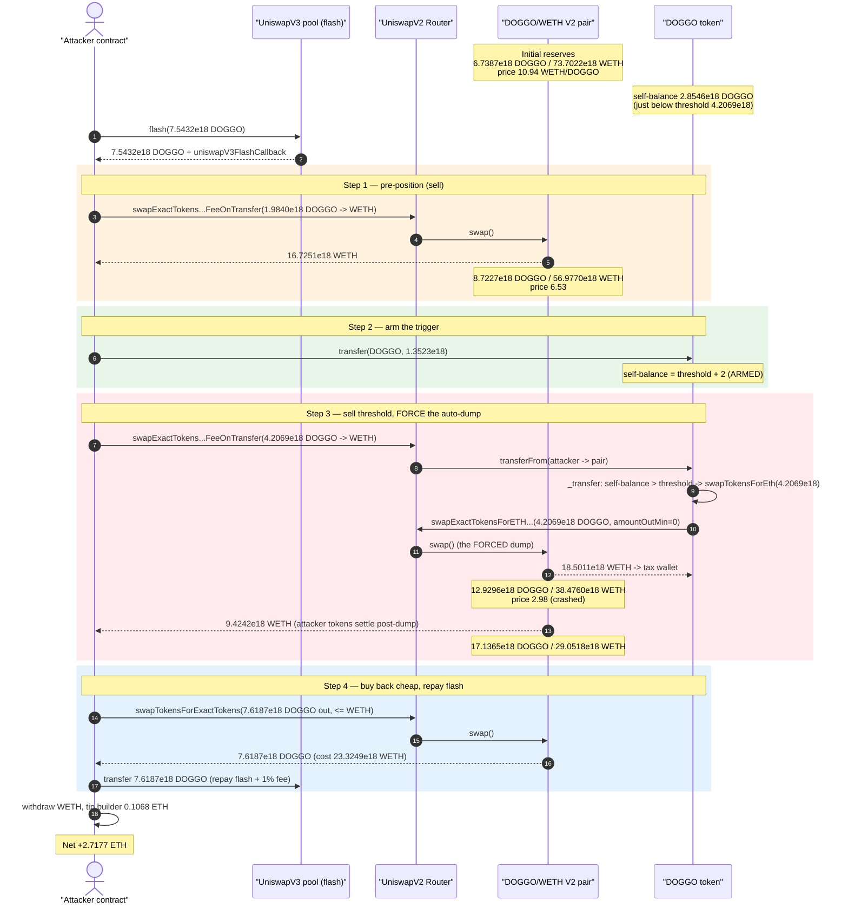
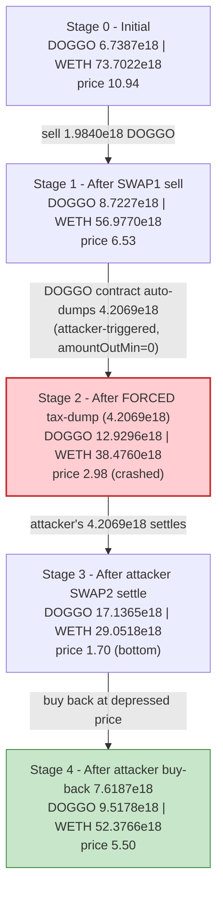
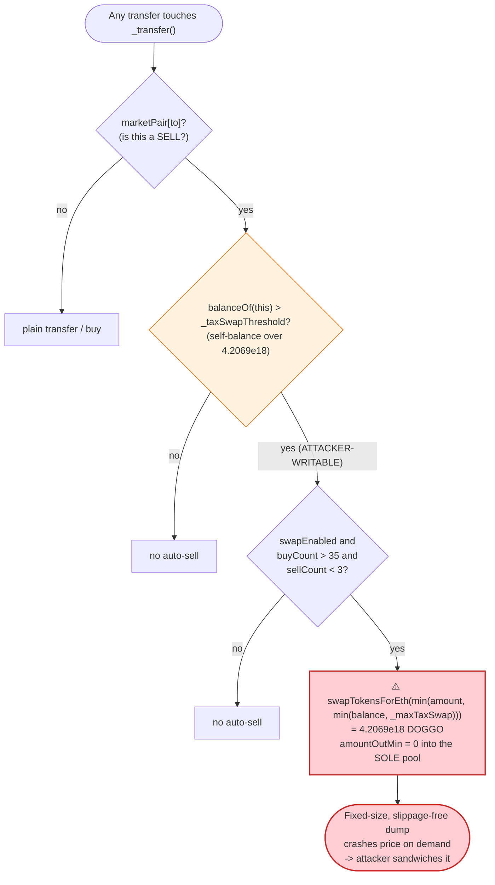

# DOGGO Exploit — Attacker-Triggered Tax Auto-Sell Self-Sandwich

> **Vulnerability classes:** vuln/defi/sandwich-attack · vuln/oracle/spot-price

> **One-liner:** A meme token's "swap accumulated sell-tax for ETH" routine fires automatically
> on any sell once the contract's *own* token balance crosses a fixed threshold. By flash-borrowing
> DOGGO and donating just enough to the token contract to cross that threshold, the attacker forces a
> large, fixed-size auto-dump into the only liquidity pool **at a moment of their choosing**, brackets
> it with their own sell-then-buy, and pockets the price spread.

> **Reproduction:** the PoC compiles & runs in an isolated Foundry project at
> [this project folder](.). Full verbose trace: [output.txt](output.txt).
> Verified vulnerable source: [DOGGO.sol](sources/DOGGO_240Cd7/DOGGO.sol).

---

## Key info

| | |
|---|---|
| **Loss** | ~$7K — net **2.7177 ETH** extracted by the attacker in one transaction |
| **Vulnerable contract** | `DOGGO` token — [`0x240Cd7b53d364a208eD41f8cEd4965D11F571B7a`](https://etherscan.io/address/0x240Cd7b53d364a208eD41f8cEd4965D11F571B7a#code) |
| **Victim pool** | DOGGO/WETH UniswapV2 pair — `0x7EB6D3466600b4857eb60a19e0d2115e65aa815e` |
| **Flash-loan source** | UniswapV3 DOGGO/WETH pool — `0xeA5A12A857E8302D70fcb1123D5F8f57EF7B7d0B` |
| **Attacker EOA** | `0x7248939f65bdd23Aab9eaaB1bc4A4F909567486e` |
| **Attacker contract** | `0xBdb0bc0941BA81672593Cd8B3F9281789F2754D1` |
| **Attack tx** | [`0x9e074d70e4f9022cba33c1417a6f6338d8248b67d6141c9a32913ca567d0efca`](https://app.blocksec.com/explorer/tx/eth/0x9e074d70e4f9022cba33c1417a6f6338d8248b67d6141c9a32913ca567d0efca) |
| **Chain / block / date** | Ethereum mainnet / 20,794,802 / ~Sep 20, 2024 |
| **Compiler** | Solidity v0.8.25, optimizer 200 runs |
| **Bug class** | Attacker-controllable, fixed-size tax auto-sell into the sole pool → self-sandwich / price manipulation |

---

## TL;DR

`DOGGO` is a Uniswap-style meme token with an "auto-swap the accumulated sell tax to ETH" feature.
Inside every transfer it checks whether **its own DOGGO balance** has crossed `_taxSwapThreshold`
(4,206,900,000 DOGGO = `4.2069e18` at 9 decimals); if so, on a sell it dumps up to `_maxTaxSwap`
(also `4.2069e18`) DOGGO into the **only** liquidity pool via
`swapExactTokensForETHSupportingFeeOnTransferTokens`
([DOGGO.sol:266-287](sources/DOGGO_240Cd7/DOGGO.sol#L266-L287),
[swapTokensForEth :304-316](sources/DOGGO_240Cd7/DOGGO.sol#L304-L316)).

The fatal property: **anyone can make `balanceOf(address(this))` cross the threshold by simply sending
DOGGO to the contract.** The token contract trusts its own balance as the signal for "time to sell
the tax," but that balance is a public, attacker-writable number. So the attacker decides *when* the
big fixed-size dump happens and *brackets it with their own trades*.

The attacker (all in a single tx, funded by a Uniswap V3 flash loan of `7.5432e18` DOGGO):

1. **Sells** part of the borrowed DOGGO into the V2 pool (depresses price, pre-positions).
2. **Donates** `1.3523e18` DOGGO to the DOGGO contract — pushing its self-balance from `2.8546e18`
   (just below threshold) to `threshold + 2`, arming the auto-sell.
3. **Sells** another `threshold` (`4.2069e18`) DOGGO into the pool. This sell *triggers* the DOGGO
   contract to first dump its own `4.2069e18` DOGGO into the same pool — a forced, fixed-size sale
   that crashes the DOGGO price from ~6.53 → ~2.98 WETH/DOGGO. The attacker's own tokens settle
   *after* this dump, at the depressed price.
4. **Buys back** exactly `7.5432e18 + 1%` DOGGO (`7.6187e18`) at the now-cheap price to repay the
   flash loan, keeping the WETH spread.

Net result: the attacker ends with **2.7177 ETH** profit (after a small builder tip), having started
with 378 wei. The value comes from arbitraging a large price move that the attacker themselves caused
and timed via the protocol's own tax-dump logic.

---

## Background — what DOGGO does

`DOGGO` ([source](sources/DOGGO_240Cd7/DOGGO.sol)) is a 9-decimal ERC20 meme token (total supply
`420,690,000,000 DOGGO`) with the usual "fair-launch tax token" machinery:

- **Buy/sell tax** — a percentage of each market trade is skimmed into the contract's own balance
  (`_balances[address(this)] += taxAmount`,
  [DOGGO.sol:290-293](sources/DOGGO_240Cd7/DOGGO.sol#L290-L293)). By the fork block the live tax was
  0% (`_buyCount` had long exceeded `_reduceSellTaxAt = 35`), but the contract had already accumulated
  `2.8546e18` DOGGO of historical tax sitting in its balance.
- **Auto-sell of accumulated tax** — inside `_transfer`, on a *sell* (transfer to a market pair) the
  contract sells its accumulated DOGGO for ETH and forwards the ETH to the tax wallet, *but only once
  its own balance exceeds `_taxSwapThreshold`* ([DOGGO.sol:266-287](sources/DOGGO_240Cd7/DOGGO.sol#L266-L287)).
- **Single liquidity venue** — the only meaningful DOGGO/WETH liquidity is the UniswapV2 pair
  `0x7EB6…815e`. The auto-sell dumps directly into that same pair, so the dump is also the price
  oracle everyone else trades against.

The on-chain parameters at the fork block:

| Parameter | Value (9 decimals) | In `e18` terms |
|---|---|---|
| `_taxSwapThreshold` | `4,206,900,000` | `4.2069e18` |
| `_maxTaxSwap` | `4,206,900,000` | `4.2069e18` |
| `_maxTxAmount` / `_maxWalletSize` | `8,413,800,000` | `8.4138e18` (= 2× threshold) |
| `_finalSellTax` / `_finalBuyTax` | `0` | tax inactive at this point |
| `swapEnabled` / `tradingOpen` | `true` | |
| **DOGGO held by the token contract** | `2,854,585,760` | **`2.8546e18`** ← just below threshold |
| DOGGO held by the V2 pair (reserve) | `6,738,656,515` | `6.7387e18` |
| WETH held by the V2 pair (reserve) | — | `73.7022e18` ← the prize pool |

The decisive facts: the contract's tax balance (`2.8546e18`) sits **just below** the
`4.2069e18` trigger, and the dump size is a **fixed `_maxTaxSwap = 4.2069e18`** regardless of how the
balance got there.

---

## The vulnerable code

### 1. The auto-sell trigger keys off the contract's own (attacker-writable) balance

```solidity
uint256 contractTokenBalance = balanceOf(address(this));
if (!inSwap && marketPair[to] && swapEnabled
        && contractTokenBalance > _taxSwapThreshold      // ⚠️ signal is a public balance
        && _buyCount > _preventSwapBefore) {
    if (block.number > lastSellBlock) { sellCount = 0; }
    require(sellCount < sellsPerBlock);
    swapTokensForEth(min(amount, min(contractTokenBalance, _maxTaxSwap)));  // ⚠️ dump into the pool
    uint256 contractETHBalance = address(this).balance;
    if(contractETHBalance > 0) { sendETHToFee(address(this).balance); }
    sellCount++;
    lastSellBlock = block.number;
}
```
[DOGGO.sol:266-279](sources/DOGGO_240Cd7/DOGGO.sol#L266-L279)

### 2. The dump is a market sell into the only DOGGO/WETH pool

```solidity
function swapTokensForEth(uint256 tokenAmount) private lockTheSwap {
    address[] memory path = new address[](2);
    path[0] = address(this);
    path[1] = uniswapV2Router.WETH();
    _approve(address(this), address(uniswapV2Router), tokenAmount);
    uniswapV2Router.swapExactTokensForETHSupportingFeeOnTransferTokens(
        tokenAmount,                 // up to _maxTaxSwap = 4.2069e18 DOGGO
        0,                           // ⚠️ amountOutMin = 0 — accepts any price
        path,
        address(this),
        block.timestamp
    );
}
```
[DOGGO.sol:304-316](sources/DOGGO_240Cd7/DOGGO.sol#L304-L316)

### 3. Tax accrues into the contract's balance — so "donating" DOGGO is indistinguishable from real tax

```solidity
if(taxAmount>0){
  _balances[address(this)]=_balances[address(this)].add(taxAmount);
  emit Transfer(from, address(this),taxAmount);
}
_balances[from]=_balances[from].sub(amount);
_balances[to]=_balances[to].add(amount.sub(taxAmount));
```
[DOGGO.sol:290-296](sources/DOGGO_240Cd7/DOGGO.sol#L290-L296)

A plain `transfer(address(DOGGO), x)` increases `_balances[address(this)]` exactly like genuine tax
would. There is no distinction between "tax the protocol earned" and "tokens someone pushed in to game
the trigger."

---

## Root cause — why it was possible

The token converts an **internal accounting condition** (its own DOGGO balance vs a threshold) into a
**market action** (a large fixed-size sell into the sole pool with `amountOutMin = 0`) — and the
internal condition is **freely writable by any external account**. Concretely, four design choices
compose into the bug:

1. **Trigger is a public balance.** `contractTokenBalance > _taxSwapThreshold` uses
   `balanceOf(address(this))`, which anyone can raise by sending DOGGO to the contract. The attacker
   therefore controls *when* the dump fires, picking the exact moment that maximizes their sandwich.
2. **Dump size is fixed and independent of need.** The sale is `min(amount, min(balance, _maxTaxSwap))`
   — effectively `_maxTaxSwap = 4.2069e18` here — irrespective of how much price impact that causes in
   the thin pool. A `4.2069e18` DOGGO sale into a `6.74e18`-DOGGO pool is a ~62%-of-reserve dump.
3. **No slippage protection on the dump.** `amountOutMin = 0` means the token will sell at *any* price,
   so an attacker who has pre-moved the pool extracts the full dislocation.
4. **The dump and the price oracle are the same pool.** Because all DOGGO liquidity lives in one V2
   pair, the forced tax-sale directly moves the price the attacker trades against — the dump *is* the
   manipulation, and the attacker simply brackets it.

The result is a textbook **self-sandwich**: the attacker front-runs (sells), the protocol's own logic
executes the big market-moving dump, and the attacker back-runs (buys back cheap). The "victim" of the
sandwich is the protocol's tax mechanism and the pool's liquidity providers — the slippage on the
`4.2069e18` forced dump is captured by the attacker rather than realized as fair value for the tax
wallet.

---

## Preconditions

- The contract has accumulated DOGGO tax sitting **just below** `_taxSwapThreshold` (here
  `2.8546e18` vs `4.2069e18`), so a modest donation crosses the trigger. (Even from zero, an attacker
  could donate the full threshold; the closer the balance starts, the cheaper the setup.)
- `swapEnabled == true`, `_buyCount > _preventSwapBefore (35)` — both satisfied long after launch.
- `sellCount < sellsPerBlock (3)` for the block — satisfied (the attacker uses the first sell of the
  block).
- A DOGGO source to fund the setup, repaid intra-transaction. The attacker uses a **UniswapV3 flash
  loan** of `7.5432e18` DOGGO (1% fee), so the attack needs essentially **zero capital** — it began
  with 378 wei.

---

## Attack walkthrough (with on-chain numbers from the trace)

The V2 pair `0x7EB6…815e` has `token0 = DOGGO`, `token1 = WETH`, so `reserve0 = DOGGO`,
`reserve1 = WETH`. All figures are taken from the `Sync`/`Swap`/`Transfer` events in
[output.txt](output.txt).

| # | Step | Trace | DOGGO reserve | WETH reserve | Price (WETH/DOGGO) |
|---|------|-------|-------------:|------------:|-------------------:|
| 0 | **Initial** pool state | [L61](output.txt#L61) | 6.7387e18 | 73.7022e18 | 10.94 |
| 1 | **Flash-borrow** 7.5432e18 DOGGO from V3 pool | [L28-34](output.txt#L28) | — | — | — |
| 2 | **SWAP1** — sell `1.9840e18` DOGGO → `16.7251e18` WETH (pre-position) | [L49-82](output.txt#L49) | 8.7227e18 | 56.9770e18 | 6.53 |
| 3 | **Donate** `1.3523e18` DOGGO to the DOGGO contract → self-balance `threshold + 2` | [L85-90](output.txt#L85) | 8.7227e18 | 56.9770e18 | 6.53 |
| 4 | **SWAP2 begins** — sell `4.2069e18` (threshold) DOGGO; this **triggers** the auto-dump | [L98](output.txt#L98) | — | — | — |
| 4a| ↳ **DOGGO contract auto-dumps** its own `4.2069e18` DOGGO → `18.5011e18` WETH to tax wallet | [L103-145](output.txt#L103) | 12.9296e18 | 38.4760e18 | **2.98** |
| 4b| ↳ attacker's `4.2069e18` DOGGO then settles at depressed price → `9.4242e18` WETH | [L161-178](output.txt#L161) | 17.1365e18 | 29.0518e18 | 1.70 |
| 5 | **Buy back** `7.6187e18` DOGGO (flash + 1% fee) for `23.3249e18` WETH at the low price | [L187-214](output.txt#L187) | 9.5178e18 | 52.3766e18 | 5.50 |
| 6 | **Repay** flash: transfer `7.6187e18` DOGGO back to V3 pool | [L217-228](output.txt#L217) | — | — | — |
| 7 | Unwrap `2.8244e18` WETH, tip builder `0.1068e18`, send **2.7177 ETH** to EOA | [L234-243](output.txt#L234) | — | — | — |

### How the magic numbers line up

- **Flash size `7.5432e18` DOGGO** = exactly the DOGGO held by the V3 pool that can be flash-borrowed
  ([L30](output.txt#L30): `7543239134633386635`, minus 1 wei).
- **SWAP1 `amountIn = 1.9840e18`** = `flashBalance + selfBalance − (2·threshold + 2)`
  = `7.5432e18 + 2.8546e18 − 8.4138e18` ([PoC L78](test/DOGGO_exp.sol#L78)). This leaves the attacker
  holding exactly enough DOGGO to (a) top the contract to `threshold + 2` and (b) sell exactly
  `threshold` next.
- **Donation `1.3523e18`** = `(threshold + 2) − selfBalance` = `4.2069e18 + 2 − 2.8546e18`
  ([PoC L90](test/DOGGO_exp.sol#L90)). It arms the trigger with the *minimum* DOGGO the attacker has
  to permanently give up.
- **Forced dump `4.2069e18`** = `min(amount=threshold, min(selfBalance=threshold+2, _maxTaxSwap=threshold))`
  = `_maxTaxSwap`. The fixed cap is what makes the price move large and predictable.
- **Buy-back `7.6187e18`** = `flash 7.5432e18 + 1% fee 0.0754e18` ([L228](output.txt#L228) Flash
  `paid0 = 75432391346333867`).

### Profit accounting (WETH / ETH)

| Direction | Amount |
|---|---:|
| Received — SWAP1 sell (1.9840e18 DOGGO) | +16.7251 WETH |
| Received — SWAP2 sell (4.2069e18 DOGGO, post-dump) | +9.4242 WETH |
| **Total received** | **+26.1493 WETH** |
| Spent — buy back 7.6187e18 DOGGO to repay flash | −23.3249 WETH |
| **Leftover WETH** | **+2.8244 WETH** |
| Builder tip (`block.coinbase`) | −0.1068 ETH |
| **Net to attacker EOA** | **+2.7177 ETH** |

The attacker permanently gave up only the `1.3523e18` DOGGO donation (worthless dust relative to the
ETH extracted) and walked away with **2.7177 ETH** — the slippage value of the forced `4.2069e18`
tax-dump that should have accrued fairly to the protocol/LPs.

---

## Diagrams

### Sequence of the attack



### Pool price evolution



### The flaw inside `_transfer` / `swapTokensForEth`



---

## Remediation

1. **Do not derive market actions from a public, writable balance.** Track tax owed in a dedicated
   internal accumulator that only increments inside the tax-skim path
   ([DOGGO.sol:290-293](sources/DOGGO_240Cd7/DOGGO.sol#L290-L293)), and sell *that* — never
   `balanceOf(address(this))`. A direct `transfer` into the contract must not be able to inflate the
   amount that gets dumped.
2. **Protect the auto-sell with slippage / oracle bounds.** `swapTokensForEth` passing
   `amountOutMin = 0` ([DOGGO.sol:309-315](sources/DOGGO_240Cd7/DOGGO.sol#L309-L315)) lets the token
   sell at any price. Bound the output against a TWAP/oracle, or refuse to sell when the spot price
   deviates materially from a reference.
3. **Cap single-operation price impact.** A `_maxTaxSwap` of `4.2069e18` into a `~6.7e18`-DOGGO pool
   is a ~62%-of-reserve sale in one shot. Size tax sells as a small percentage of the *pool's* current
   reserve, not a fixed token count, so one dump cannot dislocate the price.
4. **Don't let the tax-sell venue be the price the protocol trades against.** Spreading liquidity or
   using a neutral pricing source removes the "the dump is the manipulation" coupling.
5. **Reentrancy-safe ordering.** The auto-sell fires *in the middle of* a user's `transferFrom`
   (router swap), so the attacker's tokens settle after the dump. Performing the tax-swap outside the
   user's transfer (e.g., a separately gated keeper call with slippage protection) removes the
   self-sandwich window entirely.

---

## How to reproduce

The PoC was extracted into a standalone Foundry project (the umbrella DeFiHackLabs repo has several
unrelated PoCs that fail to compile under a whole-project `forge test`):

```bash
_shared/run_poc.sh 2024-09-DOGGO_exp -vvvvv
```

- RPC: an **Ethereum mainnet archive** endpoint is required (fork block 20,794,802).
  `foundry.toml` uses an Infura archive endpoint.
- Result: `[PASS] testPoC()` — the attacker's balance grows from `378 wei` to **2.7177 ETH**.

Expected tail:

```
Ran 1 test for test/DOGGO_exp.sol:ContractTest
[PASS] testPoC() (gas: 1684405)
  before attack: balance of attacker: 0.000000000000000378
  after attack: balance of attacker: 2.717677533473243819
```

---

*References: TenArmor post-mortem — https://x.com/TenArmorAlert/status/1837358462076080521.
Attack tx on BlockSec Explorer —
https://app.blocksec.com/explorer/tx/eth/0x9e074d70e4f9022cba33c1417a6f6338d8248b67d6141c9a32913ca567d0efca.*
