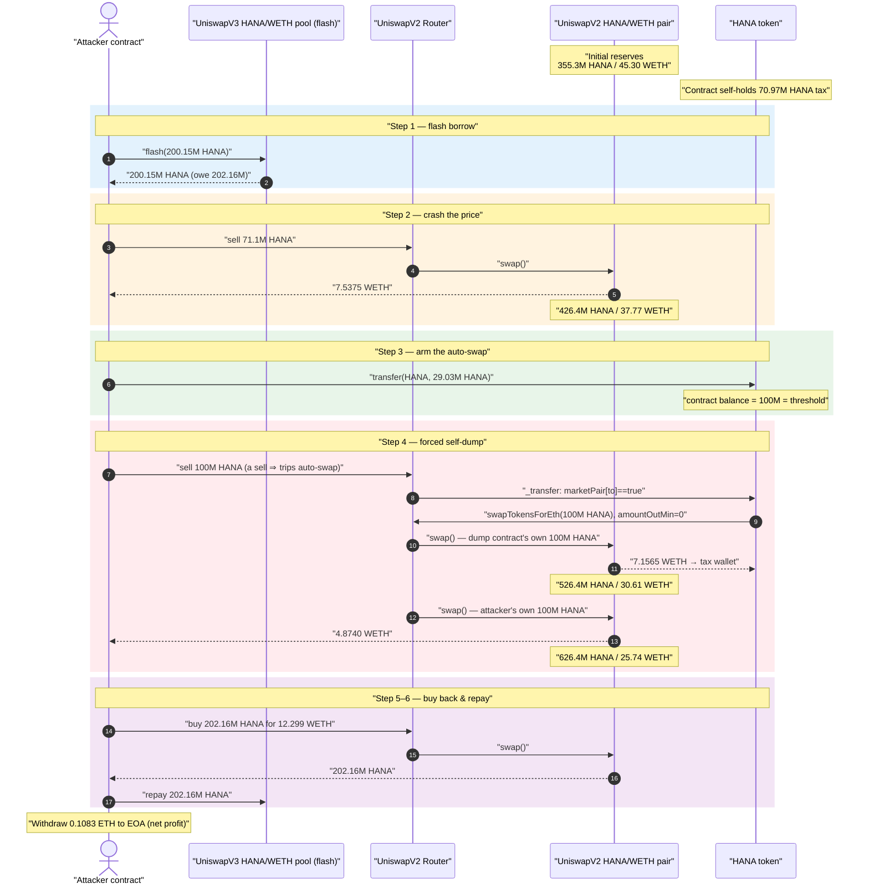
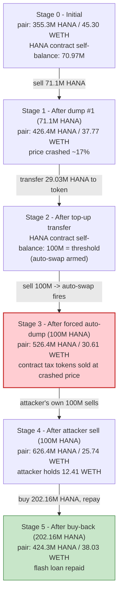
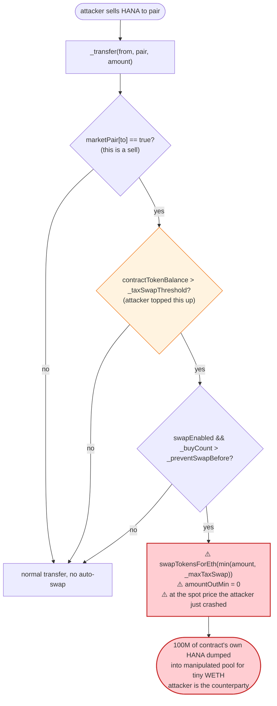

# HANA Token Exploit — Tax-Swap Self-Dump Price Manipulation via Forced Auto-Sell

> **Vulnerability classes:** vuln/defi/sandwich-attack · vuln/oracle/spot-price

> **Reproduction:** the PoC compiles & runs in an isolated Foundry project at
> [this project folder](.) (the main DeFiHackLabs repo contains many unrelated PoCs that do not
> whole-compile, so this one was extracted).
> Full verbose trace: [output.txt](output.txt).
> Verified vulnerable source: [HANA.sol](sources/HANA_B3912b/HANA.sol).

---

## Key info

| | |
|---|---|
| **Loss** | ~**$283** — **0.10833 ETH** extracted by the attacker EOA |
| **Vulnerable contract** | `HANA` token — [`0xB3912b20b3aBc78C15e85E13EC0bF334fbB924f7`](https://etherscan.io/address/0xB3912b20b3aBc78C15e85E13EC0bF334fbB924f7#code) |
| **Victim pool** | HANA/WETH UniswapV2 pair — [`0xE7b4e528308c84FD6698906b6224615E9e30d236`](https://etherscan.io/address/0xE7b4e528308c84FD6698906b6224615E9e30d236) |
| **Flash-loan source** | HANA/WETH UniswapV3 pool — [`0xf3cB07A3e57bf69301c3A51D8aC87427c53Aa357`](https://etherscan.io/address/0xf3cB07A3e57bf69301c3A51D8aC87427c53Aa357) |
| **Attacker EOA** | [`0x7248939f65bdd23Aab9eaaB1bc4A4F909567486e`](https://etherscan.io/address/0x7248939f65bdd23aab9eaab1bc4a4f909567486e) |
| **Attacker contract** | [`0xBdb0bc0941BA81672593Cd8B3F9281789F2754D1`](https://etherscan.io/address/0xbdb0bc0941ba81672593cd8b3f9281789f2754d1) |
| **Attack tx** | [`0xe8cee3450545a865b4a8fffd93938ae93429574dc8e01b02bc6a02f2f4490e4e`](https://app.blocksec.com/explorer/tx/eth/0xe8cee3450545a865b4a8fffd93938ae93429574dc8e01b02bc6a02f2f4490e4e) |
| **Chain / block / date** | Ethereum mainnet / 20,827,436 / Sep 25, 2024 |
| **Compiler** | HANA source: Solidity v0.8.25, optimizer 200 runs (PoC built with 0.8.34) |
| **Bug class** | Token tax-swap logic dumps the contract's own balance into a flash-loan-manipulated pool at a price the attacker controls |

---

## TL;DR

`HANA` is a Shib-style "tax token." On every sell it can auto-liquidate its own accumulated tax
tokens — but the routine `swapTokensForEth(...)`
([HANA.sol:310-322](sources/HANA_B3912b/HANA.sol#L310-L322)) sells those tokens **into the same
UniswapV2 pool, at the spot price in effect during the attacker's transaction**, with
`amountOutMin = 0` ([HANA.sol:315-321](sources/HANA_B3912b/HANA.sol#L315-L321)).

The attacker:

1. **Flash-borrows** 200.15M HANA from the UniswapV3 HANA/WETH pool.
2. **Dumps** ~71.1M HANA into the V2 pair, crashing the HANA price.
3. **Tops up** the HANA contract's own balance to exactly the `_taxSwapThreshold` (100M HANA) with a
   plain `transfer(HANA, …)`, arming the auto-swap.
4. **Sells** 100M HANA to the pair. That single sell trips the auto-swap branch, so the HANA contract
   *also* dumps **another 100M of its own HANA** into the already-depressed pool with no slippage
   guard — selling it for a pittance and handing that ETH to the tax wallet.
5. **Buys back** just enough HANA to repay the flash loan, then withdraws the leftover WETH as ETH.

The net effect: the contract's own tax tokens (and the pool's real WETH liquidity) are sold at a price
the attacker manufactured, and the attacker walks away with **0.1083 ETH** of the value that should
have gone to the tax wallet / honest LPs. The loss is small here only because the HANA contract held
just ~71M tax tokens and the pool was thin; the *mechanism* is a clean, repeatable value leak.

---

## Background — what HANA does

`HANA` ([source](sources/HANA_B3912b/HANA.sol)) is a standard meme/tax-token template (9 decimals,
10,000,000,000 total supply) with a fee-on-transfer + auto-liquidate feature:

- **Buy/sell tax** — a percentage of each AMM trade is siphoned into the contract's own balance
  (`taxAmount`, [HANA.sol:296-299](sources/HANA_B3912b/HANA.sol#L296-L299)). Sell tax uses
  `_initialSellTax = 20%` until `_buyCount > _reduceSellTaxAt`
  ([HANA.sol:140-146,264-266](sources/HANA_B3912b/HANA.sol#L264-L266)).
- **Auto-swap of accumulated tax** — when the contract's HANA balance exceeds `_taxSwapThreshold`
  (100,000,000 HANA) *and* the current transfer is a **sell** (`marketPair[to] == true`), the contract
  swaps up to `_maxTaxSwap` (100,000,000 HANA) of its own tokens for ETH and forwards the proceeds to
  the tax wallet ([HANA.sol:272-293](sources/HANA_B3912b/HANA.sol#L272-L293)).

The relevant on-chain parameters at the fork block:

| Parameter | Value |
|---|---|
| `_decimals` | 9 |
| `_taxSwapThreshold` | 100,000,000 HANA (`= 1e17` raw) |
| `_maxTaxSwap` | 100,000,000 HANA (`= 1e17` raw) |
| `swapEnabled` / `tradingOpen` | `true` |
| `_buyCount` | already `> _preventSwapBefore (35)` (token had been trading for hours) |
| **HANA held by the token contract itself** | **70,973,627 HANA** (accumulated tax) |
| V2 pair reserves (HANA / WETH) | **355,307,792 HANA / 45.30 WETH** |
| HANA held by the V3 pool (flash source) | 200,153,617 HANA |

The auto-swap branch and its helper are the heart of the bug:

```solidity
uint256 contractTokenBalance = balanceOf(address(this));
if (!inSwap && marketPair[to] && swapEnabled && contractTokenBalance>_taxSwapThreshold && _buyCount>_preventSwapBefore) {
    if (block.number > lastSellBlock) { sellCount = 0; }
    require(sellCount < sellsPerBlock);
    swapTokensForEth(min(amount,min(contractTokenBalance,_maxTaxSwap)));   // ← dumps contract's own tokens
    uint256 contractETHBalance = address(this).balance;
    if(contractETHBalance > 0) { sendETHToFee(address(this).balance); }
    sellCount++;
    lastSellBlock = block.number;
}
```
([HANA.sol:272-285](sources/HANA_B3912b/HANA.sol#L272-L285))

```solidity
function swapTokensForEth(uint256 tokenAmount) private lockTheSwap {
    address[] memory path = new address[](2);
    path[0] = address(this);
    path[1] = uniswapV2Router.WETH();
    _approve(address(this), address(uniswapV2Router), tokenAmount);
    uniswapV2Router.swapExactTokensForETHSupportingFeeOnTransferTokens(
        tokenAmount,
        0,                  // ⚠️ amountOutMin = 0 — NO slippage protection
        path,
        address(this),
        block.timestamp
    );
}
```
([HANA.sol:310-322](sources/HANA_B3912b/HANA.sol#L310-L322))

---

## The vulnerable code

### 1. The auto-swap fires inside the attacker's own transaction, at the attacker's price

The condition that gates the auto-swap is purely *state-based* — contract balance over threshold +
the current transfer being a sell:

```solidity
if (!inSwap && marketPair[to] && swapEnabled && contractTokenBalance>_taxSwapThreshold && _buyCount>_preventSwapBefore) {
    ...
    swapTokensForEth(min(amount, min(contractTokenBalance, _maxTaxSwap)));
    ...
}
```
([HANA.sol:273-285](sources/HANA_B3912b/HANA.sol#L273-L285))

There is no check that the pool price is sane, no TWAP, and `amountOutMin` is hard-coded to `0`. So the
auto-swap will happily dump up to 100M HANA into a pool whose price the attacker has just crushed with
a flash loan, in the **same transaction**, locking in a terrible execution price.

### 2. Anyone can arm the auto-swap by pushing tokens to the contract

The trigger condition is `contractTokenBalance > _taxSwapThreshold`. `contractTokenBalance` is just the
ERC20 balance of the HANA contract, which **any external account can increase** with a plain
`transfer(HANA_address, amount)`. The attacker does exactly this to bring the contract's balance from
70.97M up to exactly 100M HANA (= the threshold), so the very next sell trips the branch
([test/HANAToken_exp.sol:89](test/HANAToken_exp.sol#L89)):

```solidity
// inside the flash callback, after dumping HANA to crash price:
if (hanaBalContract < 100000000000000001) {
    IHANA(HANA).transfer(HANA, 100000000000000002 - hanaBalContract);  // top contract up to threshold
    ...
}
```

### 3. `_maxTaxSwap` is a fixed absolute amount, independent of pool depth

`_maxTaxSwap = 100,000,000 HANA` ([HANA.sol:159](sources/HANA_B3912b/HANA.sol#L159)). Because the pool
held only ~355M HANA / 45 WETH, dumping 100M HANA in one go is a ~28% increase of the HANA reserve —
an enormous, un-slippage-protected market sell that the attacker has positioned themselves to be the
counterparty of.

---

## Root cause — why it was possible

A fee-on-transfer token that auto-liquidates its treasury **must not do so at the instantaneous spot
price during an arbitrary user's transaction**, and **must not let arbitrary users decide when that
liquidation happens**. HANA violates both:

1. **The liquidation is triggered by attacker-controllable state.** The only gate is
   "contract balance > threshold AND this transfer is a sell." Both are externally controllable: the
   attacker funds the contract over the threshold with a direct `transfer`, then performs a sell — so
   the attacker, not the protocol, decides the exact block, price, and pool state at which the dump
   occurs.
2. **The liquidation uses zero slippage protection at a manipulated price.** `swapTokensForEth` passes
   `amountOutMin = 0` into the router ([HANA.sol:315-321](sources/HANA_B3912b/HANA.sol#L315-L321)). The
   attacker first flash-dumps 71M HANA to push the HANA price down, so the forced 100M-HANA auto-sell
   executes at a fraction of fair value. The proceeds (which the contract sends to the tax wallet) are
   minimized, and the corresponding WETH is left in the pool for the attacker to scoop up on the
   buy-back.
3. **The swap happens atomically inside the attacker's call.** Because the auto-swap runs synchronously
   during the attacker's sell — *after* the attacker has already crashed the price and *before* the
   attacker repays the flash loan — the attacker is the de-facto counterparty to the contract's dump
   and can immediately buy the cheap HANA back.

In effect, the contract sells its own tax tokens (and indirectly the pool's WETH) to the attacker at a
price the attacker manufactured with borrowed liquidity. This is the canonical "tax-token auto-swap +
flash loan" pattern (compare HANA-like clones across 2023-2024).

---

## Preconditions

- `swapEnabled == true` and `_buyCount > _preventSwapBefore (35)` — both already satisfied; HANA had
  been trading for hours, accruing ~71M HANA of tax tokens in the contract.
- The HANA contract holds nearly-but-not-quite `_taxSwapThreshold` worth of HANA, so a small top-up
  arms the auto-swap. (Here it held 70.97M; threshold is 100M.)
- A flash-loan source for HANA to manufacture the price move. The attacker used the UniswapV3 HANA/WETH
  pool's `flash()` (fee 0.01%).
- A thin V2 pool, so a single 100M-HANA forced sell at `amountOutMin = 0` moves the price massively.
- Starting capital: essentially **zero** — the PoC funds the attacker with `3.9e-16 ether` (390 wei),
  purely to pay the trivial flash-loan fee; everything else is intra-transaction.

---

## Attack walkthrough (with on-chain numbers from the trace)

The V2 pair has `token0 = HANA`, `token1 = WETH`, so `reserve0 = HANA`, `reserve1 = WETH`.
HANA uses **9 decimals**, so all HANA figures below are shown in whole HANA (raw / 1e9). WETH is 18
decimals. Reserves are taken from the `Sync` events in [output.txt](output.txt).

| # | Step (trace line) | HANA reserve | WETH reserve | Effect |
|---|------|-----------:|-------------:|--------|
| 0 | **Initial** ([:36](output.txt)) | 355,307,792 | 45.3037 | Honest pool. Contract self-holds **70,973,627 HANA** of tax. |
| 1 | **Flash-borrow** 200,153,617 HANA from the V3 pool ([:3](output.txt)) | — | — | Attacker now holds 200.15M HANA; owes 202,155,154 HANA back (0.01% fee). |
| 2 | **Dump #1** — sell **71,127,245 HANA** → 7.5375 WETH ([:24-56](output.txt)) | 426,435,037 | 37.7662 | Crashes HANA price ~17%. `amountIn = balThis + balToken − 200000000000000002 = 71.1M`. |
| 3 | **Top-up** — `transfer(HANA, 29,026,372 HANA)` ([:60](output.txt)) | 426,435,037 | 37.7662 | Contract balance: 70.97M → **exactly 100,000,000 HANA** = `_taxSwapThreshold`. Auto-swap now armed. |
| 4 | **Sell #2** — attacker sells **100,000,000 HANA** to the pair ([:73](output.txt)) | — | — | `marketPair[to] == true` ⇒ trips the auto-swap branch. |
| 4a | ↳ **Forced auto-dump** — HANA contract dumps its own **100,000,000 HANA** → 7.1565 WETH, sent to tax wallet ([:78-116](output.txt)) | 526,435,037 | 30.6097 | The contract's tax tokens sold at the crashed price, `amountOutMin = 0`. |
| 4b | ↳ **Attacker's own 100M HANA** sells → **4.8740 WETH** ([:137-149](output.txt)) | 626,435,037 | 25.7357 | Attacker WETH balance now **12.4115 WETH** ([:154](output.txt)). |
| 5 | **Buy-back** — swap 12.2991 WETH → **202,155,154 HANA** (exact-out) ([:163-190](output.txt)) | 424,279,883 | 38.0347 | Buys back exactly enough HANA to repay the flash loan. |
| 6 | **Repay flash** — `transfer(V3pool, 202,155,154 HANA)` ([:193](output.txt)) | — | — | Loan + fee repaid; `Flash` event confirms `paid0 = 0.002 HANA` fee ([:204](output.txt)). |
| 7 | **Unwrap & exfil** — withdraw remaining **0.11246 WETH** → ETH ([:208-213](output.txt)); send **0.10833 ETH** to attacker EOA ([:217](output.txt)) | — | — | Done. |

### Profit accounting (WETH/ETH)

| Direction | Amount (WETH/ETH) |
|---|---:|
| Received — Dump #1 (71.1M HANA) | +7.53753 |
| Received — Sell #2, attacker's own 100M HANA | +4.87400 |
| **Gross WETH after both sells** | **12.41154** |
| Spent — buy-back of 202.16M HANA to repay flash | −12.29908 |
| **WETH remaining** | **0.11246** |
| Withdrawn to ETH and forwarded to attacker EOA | **0.10833** |
| Retained in attacker contract (dust) | 0.00412 |

Verified against the PoC's own logs: attacker balance `390 wei → 108,334,790,875,911,824 wei`
(0.10833 ETH) ([:1570,1797](output.txt)). At ~$2,614/ETH that is **≈ $283**, matching the PoC header's
"Total Lost : 283 USD."

The value the attacker captured is essentially the WETH that the *forced auto-dump* (step 4a, 7.1565
WETH worth at fair price) and the pool's own liquidity bled out at the crashed price — money that
should have ended up with the tax wallet and honest LPs.

---

## Diagrams

### Sequence of the attack



### Pool / contract state evolution



### The flaw inside `_transfer` / `swapTokensForEth`



---

## Why each magic number

- **`200,153,617,922,546,735` (flash borrow):** essentially the *entire* HANA balance of the V3 pool —
  the deepest single source of HANA available to borrow and dump.
- **Dump #1 = `balThis + balToken − 200000000000000002`
  ([test/HANAToken_exp.sol:78](test/HANAToken_exp.sol#L78)):** `balThis` = borrowed HANA (200.15M),
  `balToken` = contract's current tax balance (70.97M). Subtracting `200000000000000002` (≈ 2×threshold)
  leaves the attacker holding exactly enough to (a) top the contract up to the threshold and (b) keep
  100M HANA to perform sell #2. The arithmetic is tuned so that after dumping `amountIn = 71.13M`, the
  remaining HANA partitions cleanly into the 29.03M top-up + the 100M sell.
- **Top-up to `100,000,000,000,000,002`
  ([test/HANAToken_exp.sol:89](test/HANAToken_exp.sol#L89)):** brings the contract's balance to just
  over `_taxSwapThreshold` (1e17 raw), the minimum needed to arm the auto-swap.
- **Buy-back exact-out `202,155,154,101,772,203`
  ([test/HANAToken_exp.sol:102](test/HANAToken_exp.sol#L102)):** the flash-loan principal **plus** the
  0.01% V3 fee, repaid to the penny so no HANA is wasted.

---

## Remediation

1. **Never auto-swap treasury tokens at the live spot price inside an arbitrary user's transaction.**
   The single most effective fix is to remove the in-`_transfer` auto-liquidation entirely and have the
   tax wallet (or a keeper) swap accrued tax tokens in a separate, access-controlled call where it can
   set a real `amountOutMin` and check the price.
2. **If auto-swap is kept, set a non-zero `amountOutMin`.** Passing `0`
   ([HANA.sol:317](sources/HANA_B3912b/HANA.sol#L317)) is the proximate enabler — derive a minimum from
   a TWAP/oracle so a flash-loan-crashed spot price reverts the swap.
3. **Do not let externally-controllable balance arm protocol actions.** The auto-swap trigger keys off
   `balanceOf(address(this))`, which anyone can inflate with a direct transfer. Track accrued tax in an
   internal accumulator that is only incremented by the tax logic, not by raw incoming transfers.
4. **Cap the per-trade auto-swap relative to pool depth.** A fixed `_maxTaxSwap = 100M` is a huge
   fraction of a thin pool. Bound the swap to a small percentage of the pool reserve so a single forced
   sell cannot move the price materially.
5. **Add reentrancy/flash-loan awareness.** Detect that the caller's sell is part of a price-manipulating
   sequence (e.g., disallow auto-swap when the transaction already moved the reserve beyond a threshold),
   or simply gate the swap behind a trusted role.

---

## How to reproduce

The PoC was extracted into a standalone Foundry project (the umbrella DeFiHackLabs repo has many
unrelated PoCs that fail to compile under `forge test`'s whole-project build):

```bash
_shared/run_poc.sh 2024-09-HANAToken_exp -vvvvv
```

- RPC: an **Ethereum mainnet archive** endpoint is required (fork block 20,827,436, Sep 2024).
  `foundry.toml` uses an Infura archive endpoint.
- Result: `[PASS] testPoC()`. The attacker's ETH balance goes from `0.00000000000000039` (390 wei,
  funded only to pay the flash fee) to `0.108334790875911824` ETH.

Expected tail:

```
Ran 1 test for test/HANAToken_exp.sol:ContractTest
[PASS] testPoC() (gas: 1645149)
  before attack: balance of attacker: 0.000000000000000390
  after attack: balance of attacker: 0.108334790875911824
Suite result: ok. 1 passed; 0 failed; 0 skipped; finished in 13.44s
```

---

*Reference: TenArmor post-mortem — https://x.com/TenArmorAlert/status/1838963740731203737 (HANA, Ethereum, ~$283).*
