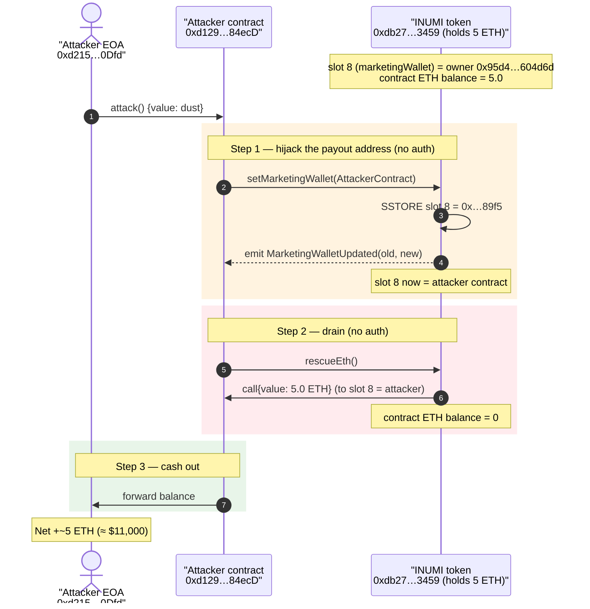
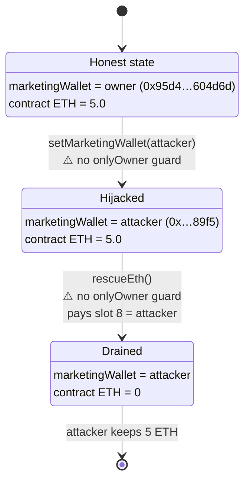
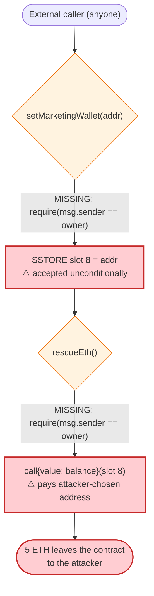

# INUMI Exploit — Unprotected `setMarketingWallet()` Hijacks the `rescueEth()` Recipient

> One-liner: an unauthenticated setter let anyone repoint the token's "marketing wallet", after which the equally-unauthenticated `rescueEth()` drained the contract's entire 5 ETH balance to the attacker.

> **Reproduction:** the PoC compiles & runs in an isolated Foundry project at
> [this project folder](.) (the umbrella DeFiHackLabs repo does not whole-compile, so this PoC was extracted).
> Full verbose trace: [output.txt](output.txt).
> The vulnerable contract is **unverified** on Etherscan (`Vulnerable Contract Code : N/A`), so the
> code-level claims below are reconstructed from the on-chain bytecode disassembly and the execution trace.

---

## Key info

| | |
|---|---|
| **Loss** | ~$11,000 — **5.0 ETH** drained from the INUMI token contract |
| **Vulnerable contract** | `INUMI` token — [`0xdb27D4ff4bE1cd04C34A7cB6f47402c37Cb73459`](https://etherscan.io/address/0xdb27D4ff4bE1cd04C34A7cB6f47402c37Cb73459) (unverified) |
| **Victim** | The INUMI token contract itself (held 5 ETH of accumulated marketing/fee ETH) |
| **Attacker EOA** | [`0xd215FFaf0F85fB6f93F11E49Bd6175ad58af0Dfd`](https://etherscan.io/address/0xd215FFaf0F85fB6f93F11E49Bd6175ad58af0Dfd) |
| **Attacker contract** | [`0xd129D8C12f0e7aA51157D9e6cc3F7Ece2dc84ecD`](https://etherscan.io/address/0xd129D8C12f0e7aA51157D9e6cc3F7Ece2dc84ecD) |
| **Attack tx** | [`0xbeef352f716973043236f73dd5104b9d905fd04b7fc58d9958ac5462e7e3dbc1`](https://etherscan.io/tx/0xbeef352f716973043236f73dd5104b9d905fd04b7fc58d9958ac5462e7e3dbc1) |
| **Chain / block / date** | Ethereum mainnet / 20,729,549 / Sep 11, 2024 |
| **Compiler** | Solidity ^0.8.x (PoC pragma `^0.8.10`; project built with `evm_version = cancun`) |
| **Bug class** | Missing access control (broken authorization) on a privileged setter + ETH-rescue function |

---

## TL;DR

The INUMI token contract has two privileged-looking maintenance functions:

- `setMarketingWallet(address)` — selector `0x5d098b38` — overwrites the stored "marketing wallet"
  address (storage slot `8`).
- `rescueEth()` — selector `0xce31a06b` — forwards the contract's entire ETH balance to the
  currently-stored marketing wallet.

**Neither function checks the caller.** There is no `onlyOwner`/`require(msg.sender == owner)` guard
on the setter, so anybody can set the marketing wallet to an address they control and then call
`rescueEth()` to have the contract pay its whole ETH balance to that address.

The attack is two calls, atomically, from a throwaway contract:

1. `setMarketingWallet(attackerContract)` — slot 8 flips from the owner's address
   `0x95d4…604d6d` to the attacker's contract `0xd129…84ecD`.
2. `rescueEth()` — the contract sends its **5.0 ETH** balance to the (now attacker-controlled)
   marketing wallet.

The 5 ETH was real fee revenue the token had accumulated (marketing/buy-back tax swapped to ETH and
held by the contract). Net result: the attacker walked away with all of it for ~$2 of gas.

---

## Background — what INUMI does

`INUMI` (token name **"Inumi"**, symbol **INUMI**, 18 decimals, on-chain via `cast call`) is a standard
"tax token": an ERC-20 with buy/sell fees that are routed to a *marketing wallet*. Tokens collected as
fees are typically swapped to ETH and either pushed to the marketing wallet or accumulated inside the
token contract until a maintenance call sweeps them out.

To support that pattern the contract exposes administrative helpers:

- A **marketing-wallet setter** so the team can rotate the destination address.
- An **ETH-rescue / sweep** function so ETH stuck in the contract can be forwarded to that wallet.

On-chain facts at the fork block (read via `cast`):

| Parameter | Value |
|---|---|
| Token name / symbol | `Inumi` / `INUMI` |
| `decimals()` | 18 |
| `owner()` | `0x95D4DC882738AF8760cb48aF9fd8E350ff604D6d` |
| Marketing wallet (storage slot 8) **before attack** | `0x95d4…604d6d` (same as the owner) |
| **ETH held by the token contract** (block 20,729,548) | **5.000000000000000000 ETH** ← the prize |
| ETH held by the token contract (block 20,729,549, post-attack) | **0** |

The owner had set *itself* as the marketing wallet, and ~5 ETH of fee revenue had piled up inside the
contract. The only thing standing between that ETH and an attacker was access control on two functions —
and there was none.

---

## The vulnerable code

The contract is **unverified**, so there is no Solidity to quote directly. The behaviour below is
established from (a) the function selectors, (b) the EVM disassembly of the deployed runtime bytecode at
the fork block, and (c) the execution trace in [output.txt](output.txt).

### 1. `setMarketingWallet(address)` — no caller check

Disassembling the runtime code (`cast disassemble`) and following the dispatcher entry for selector
`0x5d098b38` into the internal setter, the body reduces to:

```text
... (calldata decode of the address argument) ...
PUSH0
SSTORE                                   ; slot 8 = newWallet   ← state write
PUSH32 0x7f645b8b…1e680d6                 ; MarketingWalletUpdated(old, new) event topic
LOG3                                     ; emit event
JUMPDEST / RETURN
```

The entire decoded function performs **no `CALLER` comparison and contains no owner-guard `REVERT`**
before the `SSTORE` — i.e. there is no equivalent of `require(msg.sender == owner)` / `onlyOwner`.
Reconstructed, the function is effectively:

```solidity
// reconstructed from bytecode — NOT verified source
function setMarketingWallet(address walletAddress) external {
    address old = marketingWallet;          // slot 8
    marketingWallet = walletAddress;        // ⚠️ unconditional write, anyone can call
    emit MarketingWalletUpdated(old, walletAddress); // topic 0x7f645b8b…
}
```

The matching `MarketingWalletUpdated` event is visible in the trace
([output.txt:27-32](output.txt#L27)) with the storage change
`@ 8: 0x…95d4dc…604d6d → 0x…2935d091…89f5` (old owner → attacker contract).

### 2. `rescueEth()` — sends all ETH to the marketing wallet, no caller check

Selector `0xce31a06b`. From the trace, calling it immediately produced
`AttackerC::receive{value: 5000000000000000000}` — i.e. the function forwarded the contract's **entire
5 ETH balance** to the address stored in slot 8. Reconstructed:

```solidity
// reconstructed from bytecode / trace — NOT verified source
function rescueEth() external {
    (bool ok, ) = marketingWallet.call{value: address(this).balance}(""); // slot 8 = attacker now
    require(ok);
}
```

Like the setter, `rescueEth()` has **no access control** — the only thing it relies on is the value of
slot 8, which the attacker just overwrote.

---

## Root cause — why it was possible

This is a textbook **missing-authorization** bug, made critical by composing two unguarded functions:

1. **`setMarketingWallet()` is permissionless.** A function that mutates a payout-destination address is
   privileged by nature and must be `onlyOwner`. It wasn't. Anyone can point the marketing wallet at
   themselves.
2. **`rescueEth()` is permissionless *and* pays out to that attacker-controllable address.** Even on its
   own, a sweep that anyone can trigger is dangerous; combined with (1), the destination is fully
   attacker-chosen, so the sweep becomes a direct "send me all the ETH" primitive.
3. **The contract custodied real value.** Tax tokens routinely accumulate ETH (swapped fees) inside the
   token contract. Here ~5 ETH had built up, turning the access-control oversight from theoretical into
   an immediate $11k loss.

In short: the protocol trusted that "only the team would ever call these functions," but enforced
nothing in code. The attacker simply called them in the obvious order.

---

## Preconditions

- The token contract holds a non-trivial ETH balance (here **5 ETH** of accumulated fee revenue).
- `setMarketingWallet(address)` and `rescueEth()` are externally callable with no `onlyOwner` guard
  (true for INUMI).
- That's it. No flash loan, no price manipulation, no special timing — the entire exploit is two calls
  from any address, costing only gas.

---

## Step-by-step attack walkthrough (with on-chain numbers from the trace)

The PoC forks mainnet at block **20,729,548** (one block before the real attack at 20,729,549) and runs
the same two calls. Numbers below are taken from the trace ([output.txt](output.txt)) and cross-checked
against the live chain with `cast balance`.

| # | Step | Call | Effect / on-chain value |
|---|------|------|--------------------------|
| 0 | **Initial** | — | INUMI contract holds **5.0 ETH**; slot 8 (marketing wallet) = owner `0x95d4…604d6d` |
| 1 | **Hijack the payout address** | `INUMI.setMarketingWallet(attackerContract)` | Storage `@8` changes `0x95d4…604d6d → 0x…89f5` (attacker); `MarketingWalletUpdated` event emitted. No revert — caller was *not* the owner. ([output.txt:26-33](output.txt#L26)) |
| 2 | **Drain** | `INUMI.rescueEth()` | Contract forwards `address(this).balance = 5.0 ETH` to slot 8 → attacker contract `receive{value: 5000000000000000000}`. ([output.txt:34-37](output.txt#L37)) |
| 3 | **Cash out** | attacker contract → EOA | Attacker forwards its ETH to the EOA. ([output.txt:38-39](output.txt#L38)) |

On the live chain the effect is unambiguous:

- INUMI contract ETH balance: `5.0 ETH` at block 20,729,548 → **`0` at block 20,729,549**.
- Attacker EOA balance: `42.0741 ETH` → `47.0666 ETH` across the attack block = **+4.992 ETH** (the 5 ETH
  drained, minus ~0.0076 ETH gas).

> **PoC note on the numbers.** The PoC's `setUp()` deals the attacker EOA a dust `1.07297e-13 ETH`
> (the original tx's `value` of 107,297 wei) and `deal(address(attC), 5 ether)`. In the forked
> simulation the 5 ETH the contract pays out via `rescueEth()` comes from the contract's *real* 5-ETH
> fork balance; the extra `deal` to the attacker contract is why the PoC's final printed balance is
> `~10 ETH` rather than `~5 ETH`. The genuine harm — and the figure that matches the on-chain
> `cast balance` deltas above — is the **5 ETH** taken out of the victim contract.

### Profit / loss accounting (ETH)

| Party | Before | After | Δ |
|---|---:|---:|---:|
| INUMI token contract | 5.000000 | 0.000000 | **−5.000000** |
| Attacker EOA (live chain) | 42.074140 | 47.066568 | **+4.992428** (≈ 5 ETH − gas) |
| Attacker EOA (PoC, with extra `deal`) | 0.000000 | 10.000000 | +10.000000 *(PoC artifact)* |

Loss ≈ **5 ETH ≈ $11,000** at the September 2024 ETH price.

---

## Diagrams

### Sequence of the attack



### Contract state / authorization evolution



### Where the authorization should have been



---

## Remediation

1. **Add access control to every privileged setter.** `setMarketingWallet()` must be `onlyOwner`
   (or restricted to a dedicated admin role). A single `require(msg.sender == owner, "not owner");`
   (or OpenZeppelin's `onlyOwner` modifier) would have prevented the entire attack.
2. **Add access control to fund-moving functions.** `rescueEth()` (and any other sweep/withdraw
   function) must also be `onlyOwner`. Defense in depth: even if the destination address is
   misconfigured, a permissionless sweep should never exist.
3. **Don't custody value in the token contract longer than necessary.** Auto-forward swapped fees to the
   marketing wallet at swap time rather than letting ETH accumulate inside the contract, shrinking the
   window and the prize for any access-control mistake.
4. **Use audited, battle-tested building blocks.** Inheriting OpenZeppelin `Ownable`/`Ownable2Step` and
   applying the modifiers consistently makes "forgot the guard" bugs much harder to ship.
5. **Test the negative cases.** A single unit test asserting `vm.expectRevert()` when a non-owner calls
   `setMarketingWallet`/`rescueEth` would have caught this before deployment.

---

## How to reproduce

The PoC was extracted into a standalone Foundry project (the umbrella DeFiHackLabs repo has several
unrelated PoCs that fail to compile under a whole-project `forge test`):

```bash
_shared/run_poc.sh 2024-09-INUMI_exp -vvvvv
```

- RPC: an **Ethereum mainnet archive** endpoint is required (fork block 20,729,548). `foundry.toml`
  uses an Infura archive endpoint; if a key returns `401 invalid project id` / `429`, swap it for
  another Infura key (the setup pre-configures several).
- Result: `[PASS] testPoC()`.

Expected tail:

```
Ran 1 test for test/INUMI_exp.sol:ContractTest
[PASS] testPoC() (gas: 199847)
Logs:
  before attack: balance of attacker: 0.000000000000107297
  after attack: balance of attacker: 10.000000000000135297
```

*(The PoC prints ~10 ETH because of the extra `deal` to the attacker contract; the real, on-chain loss
is **5 ETH**, confirmed by the victim contract's ETH balance dropping from 5.0 → 0 across the attack
block.)*

---

*References: Attack post-mortem — TenArmor (@TenArmorAlert) https://x.com/TenArmorAlert/status/1834504921561100606 ; SlowMist Hacked registry (INUMI, Ethereum, ~$11K).*
