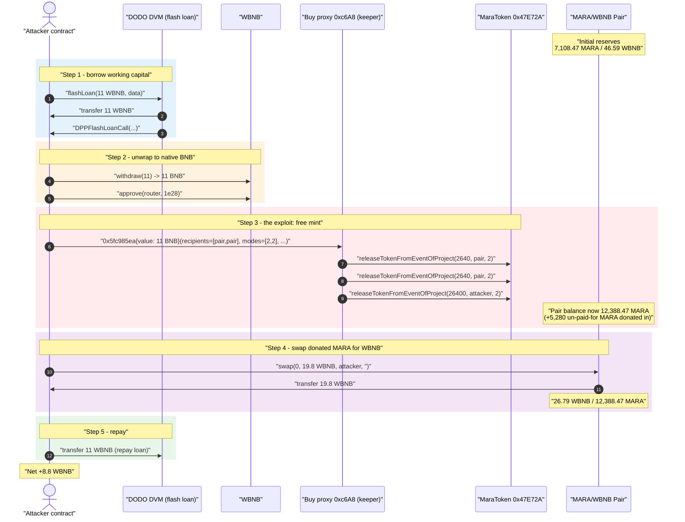
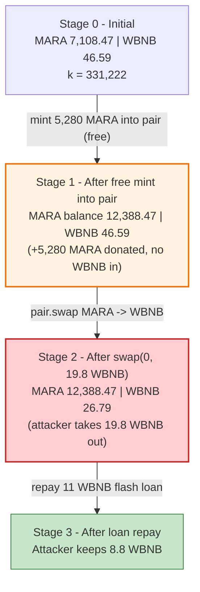
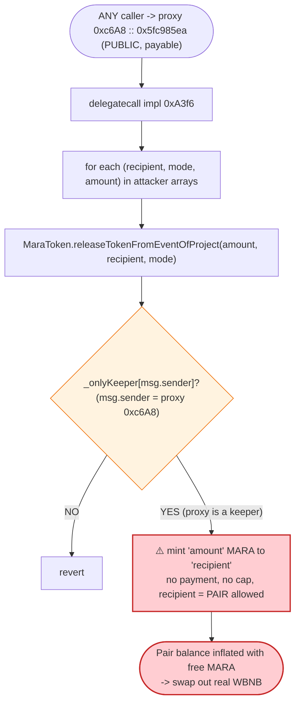
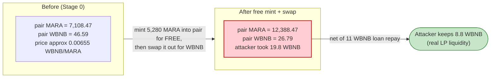

# MARA (MaraToken) Exploit — Permissionless Mint via an Unprotected "Buy" Proxy that is a Token Keeper

> **Vulnerability classes:** vuln/access-control/missing-auth · vuln/access-control/centralization

> **Reproduction:** the PoC compiles & runs in an isolated Foundry project at
> [this project folder](.) (the umbrella DeFiHackLabs repo contains many unrelated PoCs that do not
> whole-compile under `forge test`, so this one was extracted).
> Full verbose trace: [output.txt](output.txt).
> Verified vulnerable mint logic: [sources/MaraToken_47E72A/MaraToken.sol](sources/MaraToken_47E72A/MaraToken.sol).
> The "buy" proxy (`0xc6A8…`) and its implementation (`0xA3f6…`) are **unverified on BscScan**; their
> behaviour below is reconstructed empirically from the execution trace.

---

## Key info

| | |
|---|---|
| **Loss** | **~8.8 WBNB** (≈ \$4.8K at ~\$550/BNB, Sep 2024) — drained from the MARA/WBNB PancakeSwap pair |
| **Vulnerable token (mint)** | `MaraToken` — [`0x47E72A0D0ce0080E74B06C367dbEfc68B9c2d0d3`](https://bscscan.com/address/0x47E72A0D0ce0080E74B06C367dbEfc68B9c2d0d3#code) |
| **Vulnerable entry proxy** | `0xc6A8C02dd5A3DD1616eC072BFC7c9d3DF9682A63` (unverified) → impl `0xA3f6Af29001874Ed06C1bF41427e33256B1D97D4` (unverified) |
| **Victim pool** | MARA/WBNB PancakePair — `0x6E82575Ffa729471b9B412d689EC692225b1fFcB` |
| **Flash-loan source** | DODO DVM — `0x6098A5638d8D7e9Ed2f952d35B2b67c34EC6B476` |
| **Attacker EOA** | `0x3026c464d3bd6ef0ced0d49e80f171b58176ce32` |
| **Attacker contract** | `0x1c4684b838cf4344c152ba18650d1524af4f0f12` |
| **Attack tx** | [`0x0fe3716431f8c2e43217c3ca6d25eed87e14d0fbfa9c9ee8ce4cef2e5ec4583c`](https://bscscan.com/tx/0x0fe3716431f8c2e43217c3ca6d25eed87e14d0fbfa9c9ee8ce4cef2e5ec4583c) |
| **Chain / block / date** | BSC / 42,538,916 / September 2024 |
| **Compiler (token)** | Solidity v0.5.16, optimizer 200 runs |
| **Bug class** | Broken access control → unauthorized mint → AMM reserve inflation/drain |

---

## TL;DR

`MaraToken` exposes a privileged mint function, `releaseTokenFromEventOfProject(amount, _to, _mode)`,
guarded only by `require(_onlyKeeper[msg.sender])`
([MaraToken.sol:704-712](sources/MaraToken_47E72A/MaraToken.sol#L704-L712)). The project's "buy" proxy
`0xc6A8…` was registered as a keeper. That proxy exposes a **permissionless, payable** function
(selector `0x5fc985ea`) which — given attacker-controlled `(recipients[], modes[], amounts[])` arrays —
forwards into `releaseTokenFromEventOfProject` and **mints arbitrary MARA to arbitrary addresses**, with
no on-chain payment that matches the value of the minted tokens.

The attacker chained this into a textbook pool drain:

1. **Flash-loan 11 WBNB** from a DODO DVM pool (only used as working capital / to satisfy the proxy's
   `payable` plumbing; it is repaid in full).
2. **Mint MARA straight into the AMM pair** — two calls mint `2,640 MARA` each (`5,280 MARA` total)
   directly to the MARA/WBNB pair, and one call mints `26,400 MARA` to the attacker — all for free.
3. **Swap on the pair**: because `5,280` un-paid-for MARA were just injected into the pair's balance,
   the attacker calls `pair.swap(0, 19.8 WBNB, attacker, "")`. The constant-product check passes (the
   donated MARA covers the input leg), so the pair pays out **19.8 WBNB**.
4. **Repay** the 11 WBNB flash loan and keep the rest.

Net result: attacker walks away with **8.8 WBNB** (19.8 received − 11 repaid), funded entirely by MARA
that the protocol minted to the attacker for nothing.

---

## Background — what MaraToken is

`MaraToken` ([source](sources/MaraToken_47E72A/MaraToken.sol)) is a BEP-20 ("MARA", 18 decimals,
nominal supply 300,000,000) with a custom three-bucket balance model and a keeper-gated event-minting
mechanism:

- **Three balance buckets.** A holder's balance is the sum of three mappings:
  `balanceOf(a) = _Aabcabcabc[a] + _Babcabcabc[a] + _Cabcabcabc[a]`
  ([MaraToken.sol:447-450](sources/MaraToken_47E72A/MaraToken.sol#L447-L450)). The `_mode` argument to
  the mint/burn functions selects which bucket (1/2/3) receives the new tokens.
- **Keeper role.** `_onlyKeeper[]` is a boolean mapping. The deployer is seeded as a keeper in the
  constructor ([:406](sources/MaraToken_47E72A/MaraToken.sol#L406)), and keepers can add more keepers
  via `setKepperOfSystem` ([:472-480](sources/MaraToken_47E72A/MaraToken.sol#L472-L480)). Every
  privileged action — config setters, mint, burn — checks `require(_onlyKeeper[msg.sender])`.
- **Event minting.** `releaseTokenFromEventOfProject` is the keeper-gated mint
  ([:704-731](sources/MaraToken_47E72A/MaraToken.sol#L704-L731)). It is meant to issue MARA to users as
  part of "project events" (airdrops / buy rewards), driven by the project's off-chain/on-chain
  backend.

The protocol's intended flow was: a user buys MARA through the project's "buy" contract
(`0xc6A8…`), the buy contract — being a keeper — calls `releaseTokenFromEventOfProject` to issue the
purchased MARA. The fatal assumption was that *only the legitimate buy flow* could reach that keeper.

On-chain facts at the fork block (from the trace):

| Fact | Value |
|---|---|
| MARA/WBNB pair reserves (before attack) | **7,108.47 MARA / 46.59 WBNB** |
| Pair `token0 / token1` | MARA / WBNB |
| Marginal MARA price | ≈ 0.00655 WBNB/MARA |
| `0xc6A8…` proxy is a MARA keeper? | **Yes** |
| Proxy `0x5fc985ea` access control | **None (permissionless, payable)** |

---

## The vulnerable code

### 1. The keeper-gated mint (verified MaraToken source)

```solidity
// MaraToken.sol:704
function releaseTokenFromEventOfProject(
    uint256 amount,
    address _to,
    uint256 _mode
) public returns (bool) {
    require(_onlyKeeper[msg.sender]);          // ← ONLY gate: caller must be a keeper
    _releaseTokenFromEventOfProject(amount, _to, _mode);
    return true;
}

function _releaseTokenFromEventOfProject(
    uint256 amount,
    address _to,
    uint256 _mode
) internal {
    require(_to != address(0), "BEP20: mint to the zero address");
    if (_mode == 1) { _Aabcabcabc[_to] = _Aabcabcabc[_to].add(amount); }
    if (_mode == 2) { _Babcabcabc[_to] = _Babcabcabc[_to].add(amount); }   // ← attacker used mode 2
    if (_mode == 3) { _Cabcabcabc[_to] = _Cabcabcabc[_to].add(amount); }
    emit Transfer(address(0), _to, amount);    // ← looks like a real mint to the pair
}
```
([MaraToken.sol:704-731](sources/MaraToken_47E72A/MaraToken.sol#L704-L731))

Two things stand out:
- The function mints **arbitrary `amount` to an arbitrary `_to`** with **no payment, supply cap, or
  per-caller accounting** of any kind. The only protection is keeper-membership.
- The mint **does not update `_totalSupply`** ([:395](sources/MaraToken_47E72A/MaraToken.sol#L395)); it
  just inflates the bucket mappings. The freshly-minted MARA is fully transferable and `balanceOf`
  counts it, so as far as the PancakePair is concerned, real MARA appeared in its balance.

### 2. Keeper membership is the whole trust boundary

```solidity
// MaraToken.sol:472
function setKepperOfSystem(address _user, bool _is) external returns (bool) {
    require(_onlyKeeper[msg.sender]);
    _onlyKeeper[_user] = _is;                  // a keeper can anoint any address a keeper
    return true;
}
```
([MaraToken.sol:472-480](sources/MaraToken_47E72A/MaraToken.sol#L472-L480))

The project's "buy" proxy `0xc6A8…` had been added as a keeper so it could mint purchased MARA. The
token therefore fully trusts that proxy to mint responsibly.

### 3. The permissionless entry that abuses that trust (unverified proxy `0xc6A8…` / impl `0xA3f6…`)

The proxy is unverified, so we describe it from the trace. Calling selector `0x5fc985ea` on `0xc6A8…`
(payable, value = 11 WBNB worth of native BNB after the attacker unwrapped the flash loan) decodes to
three parallel arrays:

| Decoded field | Value used by attacker |
|---|---|
| `recipients[]` | `[pair, pair]` (`0x6E82575…`, `0x6E82575…`) |
| `modes[]` | `[2, 2]` |
| `amounts[]`(multipliers) | `[10, 10]` |

Inside, the proxy `delegatecall`s impl `0xA3f6…`, which makes **three** `releaseTokenFromEventOfProject`
calls (it is a keeper, so all three pass the `_onlyKeeper` check):

```
0x47E72A…(MaraToken)::releaseTokenFromEventOfProject(2640e18, pair, 2)        // mint to pair
0x47E72A…(MaraToken)::releaseTokenFromEventOfProject(2640e18, pair, 2)        // mint to pair
0x47E72A…(MaraToken)::releaseTokenFromEventOfProject(26400e18, attacker, 2)   // mint to attacker
emit BuyToken(attacker, 26400e18)
```
([output.txt:1589-1607](output.txt#L1589-L1607))

The proxy mints MARA based purely on attacker-supplied parameters with **no enforced economic
relationship** between the BNB sent and the MARA issued — and, critically, it lets the caller name the
**AMM pair itself** as a mint recipient.

---

## Root cause — why it was possible

The token's mint authority is delegated to a contract whose mint-triggering entry point is
**permissionless and parameter-driven**. Concretely, two independent failures compose into a critical
bug:

1. **Over-broad keeper trust + arbitrary mint primitive.** `releaseTokenFromEventOfProject` is an
   unconstrained mint (any amount, any recipient, no cost) gated only by a binary keeper flag. There is
   no cap, no payment check, and no link between minted value and consideration received. Whoever
   controls a keeper controls infinite MARA.

2. **The keeper itself (`0xc6A8…`) is publicly callable and lets the caller pick the recipient.**
   Anyone can call `0x5fc985ea` and direct the resulting mint to **any address — including the
   liquidity pool**. Minting MARA *into the AMM pair* is economically identical to donating real tokens
   to the pair: it lets the donor immediately swap that donated balance out for the *other* asset
   (WBNB) via `pair.swap`, because Uniswap-V2/Pancake's `swap()` only checks that
   `balance × balance ≥ k` — and the donated MARA already raised the pair's MARA balance to satisfy the
   input leg.

In other words, the attacker didn't need to buy MARA and sell it through the router. By minting MARA
**directly into the pair's balance for free**, the attacker satisfied the pair's input-token
requirement at zero cost and called `swap` to take out WBNB. The proxy's `BuyToken(attacker, 26400e18)`
event makes it look like a legitimate purchase, but no purchase value backs it.

---

## Preconditions

- The vulnerable proxy `0xc6A8…` is a registered MARA keeper (it was, by design).
- The proxy's `0x5fc985ea` entry is reachable by anyone and accepts attacker-chosen recipient/amount
  arrays (confirmed by the trace; the proxy is unverified).
- A MARA/WBNB AMM pair holds real WBNB liquidity (≈ 46.59 WBNB at the fork block).
- Working capital to satisfy the proxy's `payable` plumbing. The attacker flash-borrowed 11 WBNB from a
  DODO DVM pool and **repaid it in full** — so the attack is effectively self-funded / flash-loanable.

---

## Attack walkthrough (with on-chain numbers from the trace)

The pair's `token0 = MARA`, `token1 = WBNB`, so `reserve0 = MARA`, `reserve1 = WBNB`. All figures are
read from the `Transfer` / `Sync` / `Swap` events in [output.txt](output.txt).

| # | Step | Pair MARA balance | Pair WBNB reserve | Effect |
|---|------|------------------:|------------------:|--------|
| 0 | **Initial** | 7,108.47 | 46.59 | Honest pool ([output.txt:1620](output.txt#L1620) Sync decodes pre-state). |
| 1 | **Flash-loan 11 WBNB** from DODO DVM → attacker | 7,108.47 | 46.59 | Working capital; later repaid ([:1568-1576](output.txt#L1568-L1576)). |
| 2 | **`wbnb.withdraw(11)`** → 11 native BNB; `approve(router, 1e28)` | 7,108.47 | 46.59 | Prepares BNB for the proxy `value:` ([:1577-1588](output.txt#L1577-L1588)). |
| 3 | **Call proxy `0x5fc985ea{value:11 BNB}`** → 3 keeper mints | — | — | Mints `2,640 + 2,640 = 5,280 MARA` to the pair and `26,400 MARA` to the attacker, **free** ([:1589-1607](output.txt#L1589-L1607)). |
| 3a | … pair MARA balance after the two pair-mints | **12,388.47** | 46.59 | Pair now holds 5,280 un-paid-for MARA above its recorded reserve. |
| 4 | **`pair.swap(0, 19.8 WBNB, attacker, "")`** | 12,388.47 | **26.79** | Pair pays out 19.8 WBNB; `Swap(amount0In = 5,280 MARA, amount1Out = 19.8 WBNB)` ([:1609-1626](output.txt#L1609-L1626)). |
| 5 | **`wbnb.transfer(DVM, 11)`** — repay flash loan | 12,388.47 | 26.79 | Loan closed ([:1627-1632](output.txt#L1627-L1632)). |
| 6 | **End** — attacker WBNB | — | — | `8.8 WBNB` retained ([:1645-1647](output.txt#L1645-L1647)). |

**Why the swap pays out 19.8 WBNB:** PancakeSwap's `getAmountOut` is
`out = (in·9975·reserveOut) / (reserveIn·10000 + in·9975)`. With `reserveIn = 7,108.47 MARA`,
`reserveOut = 46.59 WBNB`, and `in = 5,280 MARA` (the freshly-minted, donated MARA), the maximum
output is `≈ 19.83 WBNB`. The attacker requested **19.8 WBNB**, leaving a hair of margin so the pair's
`k`-invariant check passes ([output.txt:1620-1621](output.txt#L1620-L1621) — post-swap reserves
`12,388.47 MARA / 26.79 WBNB`).

### Profit accounting (WBNB)

| Direction | Amount |
|---|---:|
| In — DODO flash loan | +11.0 |
| Out — swap proceeds from the pair | +19.8 |
| Out — flash-loan repayment | −11.0 |
| **Net profit** | **+8.8** |

The 8.8 WBNB profit is exactly the slice of the pair's real WBNB liquidity the attacker extracted by
selling MARA it never paid for (the pair's WBNB reserve fell `46.59 → 26.79`, a 19.8 WBNB outflow, of
which 11 round-tripped to repay the loan).

---

## Diagrams

### Sequence of the attack



### Pool / state evolution



### The flaw: who can reach the mint



### Why it is theft: free mint donated straight into the pool



---

## Why each magic number

- **Flash loan = 11 WBNB.** Used only as native BNB to feed the proxy's `payable` entry and as a
  round-trip buffer; fully repaid. The proxy's `BuyToken(attacker, 26400e18)` event suggests the impl
  scales minted MARA off the sent value (11 BNB → 26,400 MARA "purchased" + 5,280 minted into the
  pair), but no value backs the pair-targeted mints.
- **5,280 MARA minted into the pair (2,640 × 2).** This is the *input leg* of the subsequent swap. It
  raises the pair's MARA balance above its recorded `reserve0` so that `pair.swap` sees a valid
  MARA-in and pays out WBNB without the attacker ever transferring purchased tokens.
- **`amountOut = 19.8 WBNB`.** Sized just under the AMM maximum (`≈ 19.83 WBNB` for 5,280 MARA in
  against 46.59 WBNB reserve) so the constant-product check in `swap()` passes by a small margin.
- **`_mode = 2`.** Selects the `_Babcabcabc` balance bucket; any of the three buckets would have worked
  since `balanceOf` sums all three.

---

## Remediation

1. **Do not delegate an unconstrained mint to a publicly-callable contract.** The keeper
   `releaseTokenFromEventOfProject` is an arbitrary-amount, arbitrary-recipient, zero-cost mint. If a
   keeper contract must be able to call it, that keeper's externally-reachable entry points must
   enforce the full economic policy (payment, per-user limits, supply caps) *before* minting — never
   accept caller-supplied recipient/amount arrays verbatim.
2. **Never let an external caller name the AMM pair (or any address) as a mint recipient.** Minting
   tokens directly into a Uniswap-V2/Pancake pair is equivalent to a free token donation that can be
   instantly swapped out for the paired asset. Restrict mint recipients to vetted addresses, or route
   purchase rewards only to the buyer's own account.
3. **Bind minted value to consideration received.** A "buy" function must verify that the value paid
   (BNB/stable) matches the value of MARA issued at an oracle/AMM-derived price, and revert otherwise.
   The exploited proxy minted MARA with no such check.
4. **Constrain the mint primitive itself.** Add a per-transaction / per-epoch mint cap, update and
   enforce `_totalSupply` on every mint, and consider a maximum-supply ceiling so that even a
   compromised keeper cannot inflate supply without bound.
5. **Minimise and review the keeper set.** Audit every address in `_onlyKeeper`; a keeper is, in
   effect, an unlimited minter. Remove contract keepers that expose permissionless entry points.

---

## How to reproduce

The PoC was extracted into a standalone Foundry project (the umbrella DeFiHackLabs repo has many
unrelated PoCs that fail to compile under `forge test`'s whole-project build):

```bash
_shared/run_poc.sh 2024-09-MARA_exp -vvvvv
```

- RPC: a **BSC archive** endpoint is required (fork block 42,538,915). `foundry.toml` uses
  `https://bsc-mainnet.public.blastapi.io`, which serves historical state at that block; most public
  BSC RPCs prune it and fail with `header not found` / `missing trie node`.
- Result: `[PASS] testExploit()` with the attacker holding **8.8 WBNB** at the end.

Expected tail:

```
  [Begin] Attacker WBNB before exploit: 0.000000000000000000
  ...
  [End] Attacker WBNB after exploit: 8.800000000000000000

Suite result: ok. 1 passed; 0 failed; 0 skipped; finished in 9.08s
Ran 1 test suite: 1 tests passed, 0 failed, 0 skipped (1 total tests)
```

---

*Reference: DeFiHackLabs — MARA, BSC, September 2024, ~8.8 WBNB. SlowMist Hacked DB: https://hacked.slowmist.io/*
