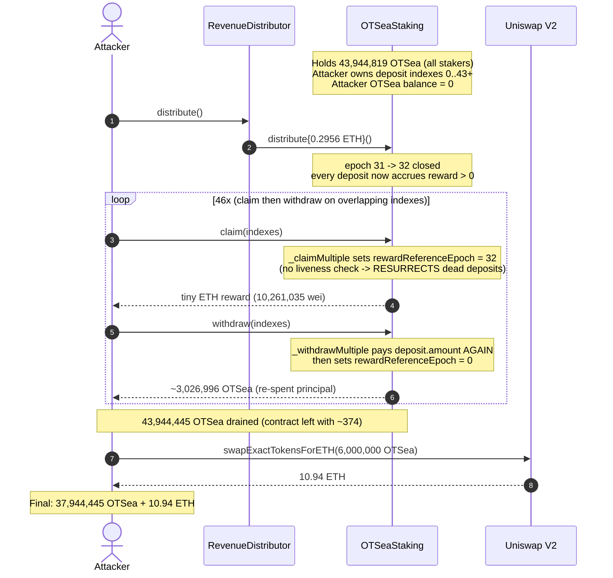
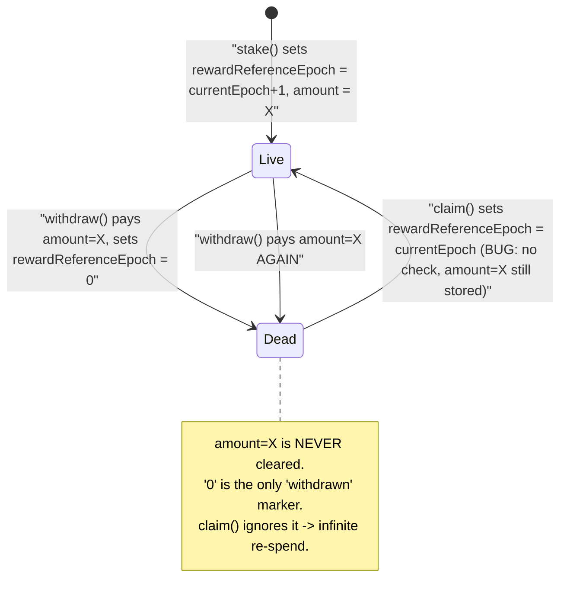
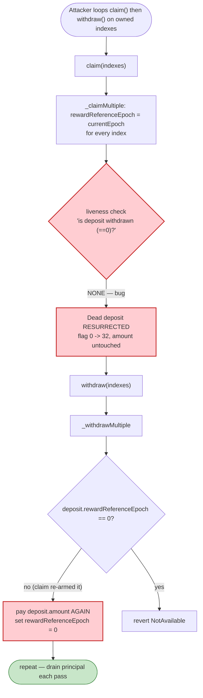

# OTSea Staking Exploit — `claim()` Re-Arms Already-Withdrawn Deposits (Double-Withdraw Drain)

> **Reproduction:** the PoC compiles & runs in an isolated Foundry project at
> [this project folder](.) (the umbrella DeFiHackLabs repo contains many unrelated PoCs that do not
> whole-compile, so this one was extracted).
> Full verbose trace: [output.txt](output.txt).
> Verified vulnerable source: [contracts_token_OTSeaStaking.sol](sources/OTSeaStaking_F2c8e8/contracts_token_OTSeaStaking.sol).

---

## Key info

| | |
|---|---|
| **Loss** | ~**$26K** — **43,944,445 OTSea** tokens drained from the staking contract (99.999% of its holdings) |
| **Vulnerable contract** | `OTSeaStaking` — [`0xF2c8e860ca12Cde3F3195423eCf54427A4f30916`](https://etherscan.io/address/0xf2c8e860ca12cde3f3195423ecf54427a4f30916#code) |
| **Victim** | Honest stakers — the staking contract's pooled OTSea deposits |
| **Token / DEX cash-out** | OTSea ERC20 `0x5dA151B95657e788076D04d56234Bd93e409CB09`; sold 6M OTSea → 10.94 ETH via Uniswap V2 |
| **Attacker EOA** | `0x000000003704BC4ffb86000046721f44Ef3DBABe` |
| **Attacker contract** | `0xd11eE5A6a9EbD9327360D7A82e40d2F8C314e985` (PoC pranks the staking position `0x5AeC8469414332d62Bf5058fb91F2f8457e5C5CB`) |
| **Attack tx** | `0x90b4fcf583444d44efb8625e6f253cfcb786d2f4eda7198bdab67a54108cd5f4` |
| **Chain / block / date** | Ethereum mainnet / 20,738,190 (fork = attack block − 1) / Sep 2024 |
| **Compiler** | Solidity `=0.8.20` |
| **Bug class** | Broken accounting / missing reentry-into-state guard — `claim()` resurrects deposits that `withdraw()` already consumed, enabling unlimited re-withdrawal of the same principal |

---

## TL;DR

`OTSeaStaking` lets a user manage many individual deposits (a `Deposit[]` per account). A deposit's
`rewardReferenceEpoch` field doubles as both its reward-accounting anchor **and** its
"is-this-deposit-still-alive" flag:

- `withdraw()` pays out the deposit's principal and marks it dead by writing
  `rewardReferenceEpoch = 0` ([:382](sources/OTSeaStaking_F2c8e8/contracts_token_OTSeaStaking.sol#L382)),
  guarding against immediate double-withdraw with a `rewardReferenceEpoch == 0 ⇒ revert` check
  ([:381](sources/OTSeaStaking_F2c8e8/contracts_token_OTSeaStaking.sol#L381)).
- `claim()` — meant only to harvest ETH rewards — **unconditionally overwrites**
  `rewardReferenceEpoch = currentEpoch`
  ([:416](sources/OTSeaStaking_F2c8e8/contracts_token_OTSeaStaking.sol#L416)) for every index passed,
  **with no check that the deposit is still alive**.

So `claim()` *re-arms a dead (already-withdrawn) deposit*: it flips `rewardReferenceEpoch` from `0`
back to a non-zero value, while leaving `deposit.amount` fully intact. The deposit looks brand-new
again, and `withdraw()` happily pays out its `amount` a second time.

The attacker (whose own pre-existing OTSea balance was **0**) simply looped
`claim(indexes) → withdraw(indexes)` over their own deposit indexes. Each pass paid out the same
principal again. After 46 such loops they had pulled **43,944,445 OTSea** out of a contract that held
**43,944,819 OTSea** — draining essentially everyone's stake — then dumped 6M of it on Uniswap for ETH.

---

## Background — what OTSeaStaking does

`OTSeaStaking` ([source](sources/OTSeaStaking_F2c8e8/contracts_token_OTSeaStaking.sol)) is a
fee/revenue-sharing staking vault for the OTSea token:

- Users `stake()` OTSea; each stake creates a `Deposit{ rewardReferenceEpoch, amount }` pushed onto
  `_deposits[msg.sender]` ([:152-163](sources/OTSeaStaking_F2c8e8/contracts_token_OTSeaStaking.sol#L152-L163),
  `_createDeposit` [:357-363](sources/OTSeaStaking_F2c8e8/contracts_token_OTSeaStaking.sol#L357-L363)).
- The `OTSeaRevenueDistributor` periodically calls `distribute()` (or `skipEpoch()`), which closes the
  current epoch and rolls a `sharePerToken` accumulator forward
  ([:133-146](sources/OTSeaStaking_F2c8e8/contracts_token_OTSeaStaking.sol#L133-L146)). Rewards for a
  deposit are `amount × (sharePerToken[now-1] − sharePerToken[ref-1]) / PRECISION`
  (`_calculateRewards` [:451-460](sources/OTSeaStaking_F2c8e8/contracts_token_OTSeaStaking.sol#L451-L460)).
- Users `claim()` ETH rewards for a list of deposit indexes (without unstaking), or `withdraw()` to
  both claim and pull their OTSea principal back.

The `Deposit.rewardReferenceEpoch` field carries a triple meaning that the NatSpec itself spells out
([:44-53](sources/OTSeaStaking_F2c8e8/contracts_token_OTSeaStaking.sol#L44-L53)):

> - On deposit → `currentEpoch + 1`
> - On claim → `currentEpoch`
> - On withdraw → `0`

That overloading — using `0` as the "withdrawn / dead" sentinel **and** letting `claim()` write a
non-zero value with no liveness check — is the entire bug.

---

## The vulnerable code

### 1. `withdraw` kills a deposit (sets the dead-sentinel) and uses it as the only double-spend guard

```solidity
function _withdrawMultiple(uint256[] calldata _indexes)
    private returns (uint88 totalAmount, uint256 totalRewards)
{
    uint256 length = _indexes.length;
    _validateListLength(length);                       // only checks 1..500, NOT uniqueness
    uint256 total = getTotalDeposits(_msgSender());
    uint32 currentEpoch = _currentEpoch;
    for (uint256 i; i < length; ) {
        if (total <= _indexes[i]) revert DepositNotFound(_indexes[i]);
        totalRewards += _calculateRewards(_msgSender(), _indexes[i]);
        Deposit memory deposit = _deposits[_msgSender()][_indexes[i]];
        if (deposit.rewardReferenceEpoch == 0) revert OTSeaErrors.NotAvailable();   // L381 guard
        _deposits[_msgSender()][_indexes[i]].rewardReferenceEpoch = 0;              // L382 mark dead
        _epochs[...].totalStake -= deposit.amount;
        totalAmount += deposit.amount;                                             // L396 pay principal
        unchecked { i++; }
    }
}
```
[`_withdrawMultiple`, :370-402](sources/OTSeaStaking_F2c8e8/contracts_token_OTSeaStaking.sol#L370-L402)

The `amount` is **never zeroed** — only `rewardReferenceEpoch` is. The deposit struct keeps its full
principal forever; the only thing that says "this principal is already gone" is `rewardReferenceEpoch == 0`.

### 2. `claim` resurrects any deposit — including dead ones

```solidity
function _claimMultiple(uint256[] calldata _indexes) private returns (uint256 totalRewards) {
    uint256 length = _indexes.length;
    _validateListLength(length);
    uint256 total = getTotalDeposits(_msgSender());
    uint32 currentEpoch = _currentEpoch;
    for (uint256 i; i < length; ) {
        if (total <= _indexes[i]) revert DepositNotFound(_indexes[i]);
        totalRewards += _calculateRewards(_msgSender(), _indexes[i]);
        _deposits[_msgSender()][_indexes[i]].rewardReferenceEpoch = currentEpoch;   // ⚠️ no liveness check
        unchecked { i++; }
    }
    if (totalRewards == 0) revert NoRewards();
    return totalRewards;
}
```
[`_claimMultiple`, :408-423](sources/OTSeaStaking_F2c8e8/contracts_token_OTSeaStaking.sol#L408-L423)

There is **no** `if (deposit.rewardReferenceEpoch == 0) revert` here. A deposit that `withdraw()` set
to `0` is silently flipped back to `currentEpoch`. Because the deposit's `amount` was never cleared,
it is now indistinguishable from a live deposit, and the next `withdraw()` pays its principal again.

The `claim`/`withdraw` public wrappers ([:170-191](sources/OTSeaStaking_F2c8e8/contracts_token_OTSeaStaking.sol#L170-L191))
add no further protection, and `_validateListLength`
([ListHelper.sol:71-73](sources/OTSeaStaking_F2c8e8/contracts_helpers_ListHelper.sol#L71-L73)) only
bounds the array length to `[1, 500]` — it never rejects **duplicate indexes** either, which is a
second, independent way to re-spend the same deposit.

---

## Root cause — why it was possible

`rewardReferenceEpoch` is asked to be two things at once:

1. a **reward-math anchor** that `claim()` legitimately needs to advance, and
2. a **liveness flag** where `0` means "this deposit has been withdrawn, never pay it again".

`withdraw()` respects role #2 (it refuses to act on a `0`). `claim()` only knows about role #1, so it
overwrites the flag back to a live value without ever asking "is this deposit still alive?". The two
functions disagree about what the field means, and the attacker exploits that disagreement:

> **`withdraw` consumes a deposit by setting `rewardReferenceEpoch = 0`. `claim` undoes that by
> setting it back to `currentEpoch`. Looping the two reuses the same `amount` indefinitely.**

The same field-overloading mistake also leaves the deposit's `amount` resident in storage after
withdrawal. A correct design would either delete the deposit entry on withdraw, or carry a separate
boolean `withdrawn` flag that `claim()` must honor.

Contributing factors:

- **No duplicate-index rejection.** `_validateListLength` checks length only, so even a single
  `withdraw([i, i, …])` would (absent the L381 guard) re-spend `i`; and a single
  `claim([i, i, …])` re-arms the same index repeatedly.
- **`claim()` is permissionless and free.** Re-arming a dead deposit costs only gas, and a closed epoch
  (any non-zero accrued reward) is enough to clear the `NoRewards` revert in `_claimMultiple`.

---

## Preconditions

- The attacker must own at least one deposit (they staked legitimately first; deposit indexes 0..43+
  belong to them). In the PoC the staking position address already held those deposits at the fork
  block.
- There must be at least one closed epoch with non-zero accrued reward so that `claim()` passes its
  `totalRewards == 0 ⇒ NoRewards` check ([:421](sources/OTSeaStaking_F2c8e8/contracts_token_OTSeaStaking.sol#L421)).
  The PoC manufactures this by first calling `OTSeaRevenueDistributor.distribute()`, which ends the
  current epoch (epoch 31 → 32, distributing 0.2956 ETH) so that `_calculateRewards` returns a small
  positive value for every deposit.
- No working capital is needed — the attack pulls the contract's principal directly; the only ETH out
  is the tiny per-claim reward (`10,261,035` wei) and the optional 6M-OTSea → ETH cash-out at the end.

---

## Attack walkthrough (with on-chain numbers from the trace)

All figures are taken directly from the `Withdrawal`/`Claimed` events and storage diffs in
[output.txt](output.txt).

| # | Step | Call | OTSea moved out | Notes |
|---|------|------|----------------:|-------|
| 0 | **Setup** | `OTSeaRevenueDistributor.distribute()` | — | Ends epoch 31 → 32 (0.2956 ETH distributed); now every deposit accrues a non-zero reward so `claim()` won't revert. Staking contract holds **43,944,819 OTSea**; attacker holds **0**. |
| 1 | **Re-arm** | `claim([0..19, 20])` | — | Sets `rewardReferenceEpoch = 32` on indexes 0–20 (pays 10,261,035 wei reward). |
| 2 | **Withdraw #1** | `withdraw([0..19, 20])` | **3,026,996.65** | Pays full principal of indexes 0–20; zeroes their `rewardReferenceEpoch`. |
| 3 | **Re-arm again** | `claim([0..19, 21])` | — | Resurrects the just-withdrawn indexes 0–19 (flag `0 → 32`) plus index 21. |
| 4 | **Withdraw #2** | `withdraw([0..19, 21])` | **3,026,996.65** | Re-pays indexes 0–19 (already withdrawn!) plus index 21. |
| … | **Batch 1 loop** ×14 | `claim/withdraw([0..19, 20+i])` | 14 × 3,026,996.65 = **42,377,953** | Same principal paid 14 times. |
| 5 | **Batch 2 loop** ×10 | `claim/withdraw([0, 34+i])` | 10 × 151,349.83 = **1,513,498** | Re-spends index 0 (+ a fresh high index) ten more times. |
| 6 | **Batch 3 loop** ×22 | `claim/withdraw([20..42, 70, 43+i])` | 22 × 2,408.81 = **52,994** | Mops up remaining indexes. |
| 7 | **Cash out** | `swapExactTokensForETHSupportingFeeOnTransferTokens(6,000,000 OTSea)` | −6,000,000 OTSea | Sells 6M OTSea on Uniswap V2 → **10.94 ETH** (pool reserves 10.28M OTSea / 30.53 ETH). |
| 8 | **Final** | `balanceOf(attacker)` | — | **37,944,445 OTSea** retained (43.94M drained − 6M sold) + 10.94 ETH. |

The repetition is visible in the raw amounts: 14 consecutive `Withdrawal` events of
`3,026,996.6474802836xx` OTSea (decrementing only in the last few wei as `totalStake` accounting
shifts), then 10 of `151,349.83`, then 22 of `2,408.80`.

### Profit / loss accounting

| | OTSea |
|---|---:|
| Staking contract balance **before** (all stakers' deposits) | 43,944,819 |
| Attacker OTSea balance **before** | 0 |
| Total drained via 46× `claim→withdraw` loops | **43,944,445** |
| Staking contract balance **after** | ~374 (dust) |
| Attacker's *legitimate* one-time entitlement (first full withdraw, indexes 0–20) | ~3,026,997 |
| **Stolen from other stakers** (drained − legit entitlement) | **≈ 40,917,448 OTSea (~14× over-withdraw)** |
| Final attacker holdings | 37,944,445 OTSea + 10.94 ETH (from selling 6M OTSea) |

Reported headline loss: **~$26K** (OTSea's market value of the stolen principal at the time).

---

## Diagrams

### Sequence of the attack



### Deposit-state evolution (the resurrection cycle)



### Where the two functions disagree about `rewardReferenceEpoch`



---

## Remediation

1. **Give `claim()` a liveness check.** Mirror `withdraw`'s guard inside `_claimMultiple`: skip or
   revert on any deposit whose `rewardReferenceEpoch == 0`. A withdrawn deposit must never be claimable
   or re-armable.
   ```solidity
   // in _claimMultiple, inside the loop:
   if (_deposits[_msgSender()][_indexes[i]].rewardReferenceEpoch == 0)
       revert OTSeaErrors.NotAvailable();
   ```
2. **Stop overloading one field for two jobs.** Track withdrawal with a dedicated `bool withdrawn`
   (or delete the deposit / zero `amount` on withdraw) instead of using `rewardReferenceEpoch == 0` as
   both reward anchor and tombstone. Then no amount of `claim()` can revive consumed principal.
3. **Reject duplicate indexes.** `withdraw`/`claim` should reject repeated indexes in the input list
   (require strictly increasing indexes, or dedup), closing the within-a-single-call re-spend variant
   that `_validateListLength` does not cover.
4. **Zero the principal on withdraw.** Setting `deposit.amount = 0` (in addition to the epoch flag)
   makes a re-armed deposit pay out nothing, defending in depth even if a liveness check is missed.

---

## How to reproduce

The PoC was extracted into a standalone Foundry project (the umbrella DeFiHackLabs repo has many
unrelated PoCs that fail to compile under a whole-project `forge build`):

```bash
_shared/run_poc.sh 2024-09-OTSeaStaking_exp -vvvvv
```

- RPC: an **Ethereum mainnet archive** endpoint is required (fork block 20,738,190). `foundry.toml`
  is preconfigured with an Infura archive endpoint; the test reads historical state at that block.
- Result: `[PASS] testExploit()` with `Attacker earned: 37944445168159512442507586` (≈ 37.94M OTSea).

Expected tail:

```
Ran 1 test for test/OTSeaStaking_exp.sol:ContractTest
[PASS] testExploit() (gas: 6416132)
  Attacker earned: 37944445168159512442507586

Suite result: ok. 1 passed; 0 failed; 0 skipped; finished in 37.72s (36.29s CPU time)
```

---

*Reference: OTSea Staking, Ethereum mainnet, Sep 2024, ~$26K. PoC source: [test/OTSeaStaking_exp.sol](test/OTSeaStaking_exp.sol).*
