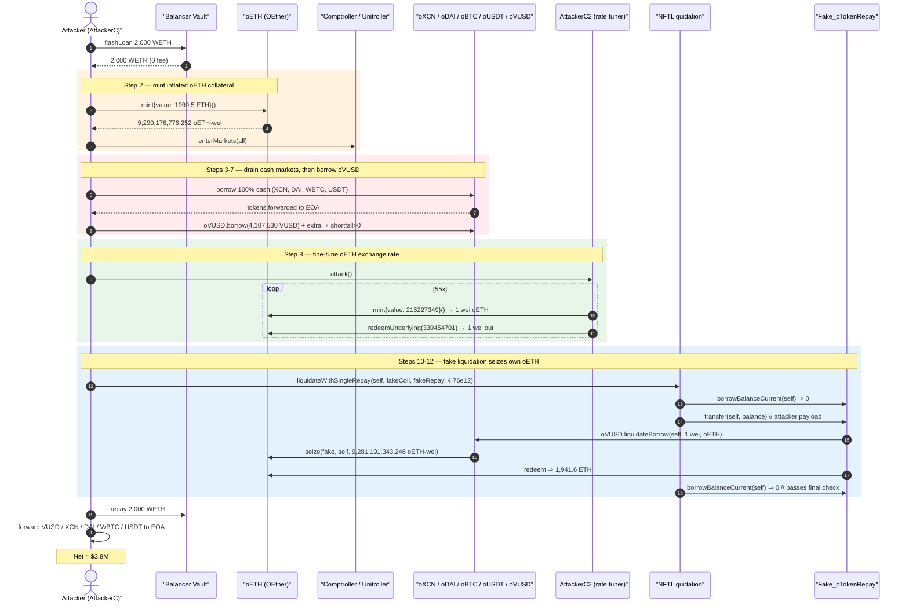
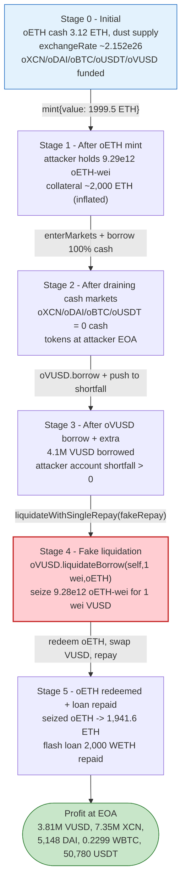
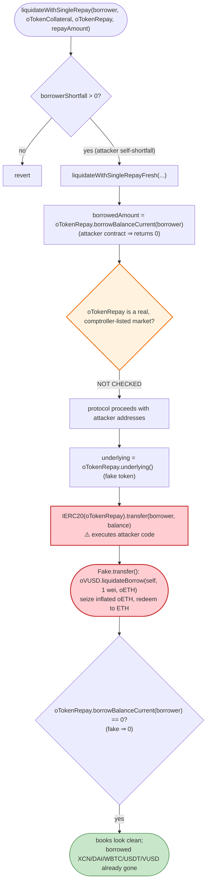

# Onyx Protocol (OnyxDAO) Exploit — Empty-Market Exchange-Rate Inflation + Attacker-Controlled `oTokenRepay` Liquidation

> **Reproduction:** the PoC compiles & runs in an isolated Foundry project at
> [this project folder](.) (the umbrella DeFiHackLabs repo contains many unrelated
> PoCs that do not whole-compile, so this one was extracted).
> Full verbose trace: [output.txt](output.txt).
> Verified vulnerable source: [NFTLiquidation.sol](sources/NFTLiquidation_f10bc5/NFTLiquidation.sol).

---

## Key info

| | |
|---|---|
| **Loss** | ~$3.8M — **4,107,530 VUSD borrowed** (3.81M VUSD net), **7,350,326 XCN**, **5,148 DAI**, **0.2299 WBTC**, **50,780 USDT** |
| **Vulnerable contract** | `NFTLiquidation` (impl) — [`0xf10bc5be84640236c71173d1809038af4ee19002`](https://etherscan.io/address/0xf10bc5be84640236c71173d1809038af4ee19002#code), proxied by `NFTLiquidationProxy` [`0x323398DE3C35F96053D930d25FE8d92132F83d44`](https://etherscan.io/address/0x323398DE3C35F96053D930d25FE8d92132F83d44) |
| **Victim** | Onyx Protocol lending markets (Compound v2 fork): `oVUSD`, `oXCN`, `oDAI`, `oBTC`, `oUSDT`, `oETH` |
| **Attacker EOA** | [`0x680910cf5fc9969a25fd57e7896a14ff1e55f36b`](https://etherscan.io/address/0x680910cf5fc9969a25fd57e7896a14ff1e55f36b) (PoC re-labels the receiving EOA `0x9dF0…6B4e`) |
| **Attack contract (main)** | [`0xa57eda20be51ae07df3c8b92494c974a92cf8956`](https://etherscan.io/address/0xa57eda20be51ae07df3c8b92494c974a92cf8956) (PoC: `AttackerC` @ `0x9599…1d6a`) |
| **Rate manipulator** | [`0xae7d68b140ed075e382e0a01d6c67ac675afa223`](https://etherscan.io/address/0xae7d68b140ed075e382e0a01d6c67ac675afa223) (PoC: `AttackerC2`) |
| **Fake `oTokenRepay`** | [`0x4f8b8c1b828147c1d6efc37c0326f4ac3e47d068`](https://etherscan.io/address/0x4f8b8c1b828147c1d6efc37c0326f4ac3e47d068) (PoC: `Fake_oTokenRepay`) |
| **Attack tx** | [`0x46567c731c4f4f7e27c4ce591f0aebdeb2d9ae1038237a0134de7b13e63d8729`](https://etherscan.io/tx/0x46567c731c4f4f7e27c4ce591f0aebdeb2d9ae1038237a0134de7b13e63d8729) |
| **Chain / block / date** | Ethereum mainnet / 20,834,658 / Sep 26, 2024 |
| **Compiler** | Onyx contracts: Solidity v0.5.17 (optimizer, 200 runs); PoC: ^0.8.13 |
| **Bug class** | Empty-market exchange-rate inflation (Compound-fork "donation" attack) **composed with** a liquidation entry point that trusts an attacker-supplied `oTokenRepay` collateral/repay token |

---

## TL;DR

Onyx Protocol is a Compound-v2 fork. Two facts make it exploitable:

1. **The `oETH` (OEther) market had a near-empty token supply,** so its exchange rate
   `exchangeRate = (cash + borrows − reserves) / totalSupply`
   ([contracts_OToken.sol:340-370](sources/OEther_2CCb7d/contracts_OToken.sol#L340-L370))
   was inflated to **≈ 2.152 × 10²⁶** (≈ 2.15 × 10⁸ ETH of underlying per `oETH`-wei). A tiny `oETH`
   balance therefore represented enormous collateral value, and Compound's integer rounding in
   `mint`/`redeemUnderlying` lets an attacker round the rate up further for free.

2. **`NFTLiquidation.liquidateWithSingleRepay()`** lets the caller pass an arbitrary `oTokenRepay`
   and `oTokenCollateral` address. The contract calls `IOErc20(oTokenRepay).borrowBalanceCurrent(borrower)`,
   `.underlying()`, and crucially `IERC20(oTokenRepay).transfer(...)` on those **attacker-controlled
   contracts** ([NFTLiquidation.sol:696-738](sources/NFTLiquidation_f10bc5/NFTLiquidation.sol#L696-L738)).
   By supplying a fake `oTokenRepay`, the attacker turns the liquidation into a reentrant hook that runs
   arbitrary code inside the protocol's trust boundary.

The attacker:

1. Flash-borrows **2,000 WETH** from Balancer.
2. **Mints `oETH`** by depositing 1,999.5 ETH, becoming the dominant supplier of the empty `oETH` market —
   getting `oETH` collateral worth ≈ 2,000 ETH at the inflated rate.
3. **Enters all markets** and **borrows 100 % of the cash** of every juicy market — draining
   `oXCN`, `oDAI`, `oBTC`, `oUSDT` completely (7.35M XCN, 5,148 DAI, 0.2299 WBTC, 50,780 USDT) — and forwards
   each to the attacker EOA.
4. Borrows `oVUSD` (4,107,530 VUSD) and then a tiny extra slice to push its own account into **shortfall**,
   so it qualifies as a liquidatable "borrower".
5. Runs `AttackerC2` to fine-tune the `oETH` exchange rate via a `mint` / `redeemUnderlying` loop.
6. Calls **`liquidateWithSingleRepay(self, fakeCollateral, fakeRepay, …)`**. The fake `oTokenRepay`
   reports `borrowBalanceCurrent == 0` (so the protocol thinks nothing must be repaid) and, inside its
   `transfer()` hook, performs a **real** `oVUSD.liquidateBorrow(attacker, 1 wei, oETH)` that seizes the
   attacker's own inflated `oETH` collateral for **1 wei of VUSD**, then redeems that `oETH` back to ETH.
7. Repays the 2,000 WETH flash loan and walks away with all borrowed tokens.

Net: the four cash markets are emptied and 3.81M VUSD is extracted, ~**$3.8M** total.

---

## Background — what Onyx Protocol does

Onyx Protocol (the OnyxDAO lending market) is a **Compound v2 fork** with an added NFT-collateral
liquidation module:

- Each asset has an `oToken` (`oETH` = `OEther`, `oVUSD`/`oXCN`/`oDAI`/`oBTC`/`oUSDT` = `OErc20Delegator`
  proxies to `OErc20Delegate`). Supplying mints `oTokens`; the `oToken→underlying` ratio is the
  **exchange rate**. Borrowing requires posted collateral to cover the position per the comptroller's
  collateral factors.
- The `Comptroller` (behind `Unitroller`) tracks account liquidity via
  `getAccountLiquidity()` and enforces `mintAllowed` / `borrowAllowed` / `liquidateBorrowAllowed` /
  `seizeAllowed`.
- The **`NFTLiquidation`** contract is a convenience router for liquidating positions whose collateral is
  an NFT (`OErc721`). `liquidateWithSingleRepay()` is meant to: take a real `oTokenRepay`, repay the
  borrower's debt in that token, seize the NFT collateral, and forward any extra repay (minus a protocol
  fee) back.

On-chain state at the fork block (block 20,834,657, read from the trace):

| Parameter | Value |
|---|---|
| `oETH` exchange rate (`exchangeRateStored`) | **215,227,336,159,115,788,993,379,851** ≈ 2.152 × 10²⁶ |
| `oETH` total cash before attack (`getCash`) | 3.12 ETH (`3120992194061734426` wei) — **near-empty market** |
| `oXCN` cash (drained) | 7,350,326,135,730,346,092,551,099 = **7,350,326 XCN** |
| `oDAI` cash (drained) | 5,148,046,590,995,580,075,613 = **5,148 DAI** |
| `oBTC` cash (drained) | 22,990,636 = **0.2299 WBTC** |
| `oUSDT` cash (drained) | 50,780,121,544 = **50,780 USDT** |
| `oVUSD` borrowed | 4,107,530,423,554 = **4,107,530 VUSD** (6 decimals) |
| `protocolFeeMantissa` | applied to `extraRepayAmount` ([:711-712](sources/NFTLiquidation_f10bc5/NFTLiquidation.sol#L711-L712)) |

The combination of an **inflated, near-empty `oETH` market** and a **liquidation router that trusts
attacker addresses** is the whole game.

---

## The vulnerable code

### 1. `liquidateWithSingleRepay` trusts attacker-supplied `oTokenRepay` / `oTokenCollateral`

```solidity
// NFTLiquidation.sol
function liquidateWithSingleRepay(address payable borrower, address oTokenCollateral, address oTokenRepay, uint256 repayAmount)
    external payable nonReentrant
{
    require(borrower != address(0), "invalid borrower address");

    (, , uint256 borrowerShortfall) = IComptroller(comptroller).getAccountLiquidity(borrower);
    require(borrowerShortfall > 0, "invalid borrower liquidity shortfall"); // ← attacker is the "borrower"
    liquidateWithSingleRepayFresh(borrower, oTokenCollateral, oTokenRepay, repayAmount);
    transferSeizedTokenFresh(oTokenCollateral, false);
}
```
[NFTLiquidation.sol:667-674](sources/NFTLiquidation_f10bc5/NFTLiquidation.sol#L667-L674)

```solidity
function liquidateWithSingleRepayFresh(address payable borrower, address oTokenCollateral, address oTokenRepay, uint256 repayAmount) internal {
    require(extraRepayAmount == 0, "invalid initial extra repay amount");

    uint256 borrowedAmount = IOErc20(oTokenRepay).borrowBalanceCurrent(borrower); // ← FAKE returns 0
    require(repayAmount >= borrowedAmount, "invalid token repay amount");          // 4.76e12 >= 0 ✓
    extraRepayAmount = repayAmount.sub(borrowedAmount);                            // extra = repayAmount

    if (oTokenRepay != oEther) {
        address underlying = IOErc20(oTokenRepay).underlying();                    // ← FAKE returns fake token
        IERC20(underlying).transferFrom(msg.sender, address(this), repayAmount);   // fake token: no-op
        IERC20(underlying).approve(oTokenRepay, borrowedAmount);
        require(IOErc20(oTokenRepay).liquidateBorrow(borrower, borrowedAmount, oTokenCollateral) == 0, "...");// FAKE: returns 0
        ...
        require(IOErc20(oTokenRepay).mint(remained) == 0, "otoken mint failed");   // FAKE: returns false → "0" path
        IERC20(oTokenRepay).transfer(borrower, IERC20(oTokenRepay).balanceOf(address(this))); // ⚠️ FAKE.transfer() = attacker code
        ...
    }
    require(IOErc20(oTokenRepay).borrowBalanceCurrent(borrower) == 0, "..."); // FAKE returns 0 ✓
    extraRepayAmount = 0;
}
```
[NFTLiquidation.sol:696-738](sources/NFTLiquidation_f10bc5/NFTLiquidation.sol#L696-L738)

Every external call in this function — `borrowBalanceCurrent`, `underlying`, `transferFrom`, `liquidateBorrow`,
`mint`, `transfer` — targets the **attacker-supplied `oTokenRepay`/`underlying` addresses**. There is **no
allowlist check** that `oTokenRepay`/`oTokenCollateral` are genuine markets registered with the comptroller.

### 2. The attacker's `Fake_oTokenRepay.transfer()` is the payload

Inside the trusted call at `liquidateWithSingleRepayFresh` L716, the fake's `transfer()` performs the real
seize against a genuine market ([OnyxDAO_exp.sol:224-231](test/OnyxDAO_exp.sol#L224-L231)):

```solidity
// Fake_oTokenRepay.transfer() — runs inside NFTLiquidation's context
function transfer(address, uint256) external returns (bool) {
    IFS(VUSD).approve(oVUSD, type(uint256).max);
    IFS(oVUSD).liquidateBorrow(attackerC, 1, oETH);  // ⚠️ real liquidation: repay 1 wei VUSD, seize oETH
    uint256 bal_oETH = IFS(oETH).balanceOf(address(this));
    IFS(oETH).redeem(bal_oETH);                       // turn seized oETH back into ETH
    payable(attackerC).transfer(address(this).balance);
    return true;
}
```

### 3. The inflated `oETH` exchange rate (Compound empty-market rate)

```solidity
// OToken.sol — exchangeRateStoredInternal
if (_totalSupply == 0) {
    return (MathError.NO_ERROR, initialExchangeRateMantissa);
} else {
    uint totalCash = getCashPrior();
    addThenSubUInt(totalCash, totalBorrows, totalReserves) / _totalSupply; // ← tiny supply ⇒ huge rate
}
```
[contracts_OToken.sol:340-370](sources/OEther_2CCb7d/contracts_OToken.sol#L340-L370)

With `totalSupply` of `oETH` extremely small, the rate sat at **≈ 2.152 × 10²⁶**. The attacker's
`AttackerC2` then performs a round-trip loop of `mint{value: 215227349}()` (→ mints exactly **1** `oETH`-wei
because `215227349 / 2.152e26` rounds to 1) and `redeemUnderlying(330454701)` (→ burns 1 `oETH`-wei but
withdraws 330,454,701 wei), nudging the stored rate upward by leaving dust in `reserves`/`cash`. This both
maximizes the value of the attacker's `oETH` collateral and keeps the seize math favorable.

---

## Root cause — why it was possible

This was a **two-bug composition**, both rooted in misplaced trust:

1. **`NFTLiquidation` calls into caller-controlled token addresses with no validation.**
   `oTokenRepay` and `oTokenCollateral` are passed straight from `msg.sender` into low-level external calls
   (`borrowBalanceCurrent`, `underlying`, `liquidateBorrow`, `mint`, `transfer`). A genuine liquidation
   router must verify these are markets listed by the comptroller (`isListed`) and must never invoke
   arbitrary `transfer()` on an attacker-chosen ERC20-like address inside its own privileged flow. Because
   it does, the attacker injects code via `Fake_oTokenRepay.transfer()` that runs a **real** seize while the
   router believes "nothing was owed, nothing was repaid" (`borrowBalanceCurrent == 0`).

2. **The `oETH` market was near-empty, inflating its exchange rate.**
   Compound v2's `exchangeRate = (cash + borrows − reserves)/totalSupply` is meaningless when `totalSupply`
   is dust. A single attacker can become the dominant supplier of an empty market and then use the inflated
   rate as massive borrowing power, and abuse integer rounding in `mint`/`redeemUnderlying` to ratchet the
   rate. This is the classic Compound-fork "first depositor / donation" inflation; Onyx never seeded or
   guarded the `oETH` market against it.

3. **The self-liquidation laundering trick.** To borrow against the inflated collateral and then keep the
   borrowed funds, the attacker:
   - borrowed slightly more `oVUSD` than its collateral could honestly support, putting **its own** account
     into `shortfall > 0` so it passes the `borrowerShortfall > 0` gate; then
   - "liquidated itself" through the fake-`oTokenRepay` path, seizing its own `oETH` for 1 wei and redeeming
     it for real ETH — clearing the books while the borrowed XCN/DAI/WBTC/USDT/VUSD had already been shipped
     to the EOA.

In short: an empty market gave the attacker unbounded fake collateral, and the liquidation router's blind
trust in caller-supplied token addresses let the attacker turn the protocol's own liquidation machinery into
an arbitrary-code reentrancy hook to extract the loot.

---

## Preconditions

- The `oETH` market has **near-zero supply** (≈ 3.12 ETH cash, dust `totalSupply`), so its exchange rate is
  inflated to ≈ 2.152 × 10²⁶ and an attacker can become the dominant supplier in one transaction.
- The four cash markets (`oXCN`, `oDAI`, `oBTC`, `oUSDT`) and `oVUSD` hold withdrawable liquidity (their
  `getCash` > 0). The attacker borrows 100 % of each.
- `NFTLiquidation.liquidateWithSingleRepay` accepts arbitrary `oTokenRepay`/`oTokenCollateral` (no
  market-allowlist) — true here.
- Working capital in ETH/WETH to mint the `oETH` collateral. Fully recovered intra-transaction, so it is
  **flash-loanable** — the PoC borrows 2,000 WETH from Balancer (0 fee).

---

## Attack walkthrough (with on-chain numbers from the trace)

All figures below are taken directly from [output.txt](output.txt).

| # | Step | Trace evidence | Effect |
|---|------|----------------|--------|
| 0 | **Flash loan** 2,000 WETH from Balancer | `flashLoan(…, 2e21, 0x3030)` ([L1582](output.txt)) | 0-fee working capital. |
| 1 | Unwrap WETH → 2,000 ETH; **mint `oETH`** with 1,999.5 ETH | `OEther::mint{value: 1999500000000000000000}` → `mintTokens: 9290176776252` ([L1605](output.txt)) | Attacker now holds **9,290,176,776,252 `oETH`-wei**; cash 3.12 → 2,002.6 ETH. |
| 2 | `enterMarkets(all)`; borrow back the original `oETH` cash | `OEther::borrow(3120992194061734426)` ([L1673](output.txt)) | Establishes a borrow position; collateral = inflated `oETH`. |
| 3 | **Drain `oXCN`** — borrow 100 % of cash, send to EOA | `OErc20Delegator::borrow(7350326135730346092551099)` ([L2012](output.txt)) | **7,350,326 XCN** taken. |
| 4 | **Drain `oDAI`** | `borrow(5148046590995580075613)` ([L2389](output.txt)) | **5,148 DAI** taken. |
| 5 | **Drain `oBTC`** | `borrow(22990636)` ([L2766](output.txt)) | **0.2299 WBTC** taken. |
| 6 | **Drain `oUSDT`** | `borrow(50780121544)` ([L3143](output.txt)) | **50,780 USDT** taken. |
| 7 | Read account liquidity (`liq = 1e30`); borrow `oVUSD = liq/1e12` | `OErc20Delegator::borrow(4107530423554)` ([L3828](output.txt)) | **4,107,530 VUSD** borrowed; account driven toward shortfall. |
| 8 | `AttackerC2.attack()` — `mint{value:215227349}` / `redeemUnderlying(330454701)` ×55 | `exchangeRateStored → 2.152e26` ([L4189](output.txt)) | Fine-tunes `oETH` rate; recovers ETH dust. |
| 9 | Deploy `Fake_underlying`, `Fake_oTokenCollateral`, `Fake_oTokenRepay`; send 1 wei VUSD to fake | `new Fake_oTokenRepay@0x6AF6…` ([L6294](output.txt)) | Builds the malicious "repay token". |
| 10 | **`liquidateWithSingleRepay(self, fakeCollateral, fakeRepay, 4764735291322)`** | `NFTLiquidation::liquidateWithSingleRepay(…)` ([L6301](output.txt)) | Enters the trusted flow with attacker addresses. |
| 11 | Inside fake `transfer()`: **`oVUSD.liquidateBorrow(attacker, 1, oETH)`** | `OErc20Delegate::liquidateBorrow(AttackerC, 1, OEther)` ([L6627](output.txt)) | Seizes attacker's `oETH` for **1 wei VUSD**. |
| 12 | `OEther::seize(fake, attacker, 9281191343246)` then `redeem(9021317985636)` → 1,941.6 ETH | `seize(…, 9281191343246)` ([L7021](output.txt)); `Redeem(redeemAmount: 1941634238686633900780)` ([L7066](output.txt)) | `oETH` collateral converted back to ETH. |
| 13 | Swap 300,000 VUSD → 71.9 WETH (Uniswap V3); wrap remaining ETH | `SwapRouter::exactInputSingle(VUSD→WETH, 3e11)` ([L7099](output.txt)) | Assembles WETH to repay the flash loan. |
| 14 | **Repay 2,000 WETH** to Balancer | `WETH9::transfer(0xBA12…, 2e21)` ([L7156](output.txt)) | Flash loan closed (fee 0). |
| 15 | Forward profits to EOA | `VUSDFiatToken::transfer(attacker, 3807530423553)` ([L7160](output.txt)) | EOA ends with the loot. |

### Why the fake liquidation works

- `liquidateWithSingleRepay` only requires `borrowerShortfall > 0` for the **borrower** — and the borrower
  is the **attacker itself**, deliberately pushed into shortfall in step 7.
- `Fake_oTokenRepay.borrowBalanceCurrent()` returns **0**, so `extraRepayAmount = repayAmount` and the final
  `require(borrowBalanceCurrent == 0)` passes — the router believes the debt is fully cleared without any
  real VUSD repayment.
- The genuine seize is hidden inside `Fake_oTokenRepay.transfer()`, invoked at
  [NFTLiquidation.sol:716](sources/NFTLiquidation_f10bc5/NFTLiquidation.sol#L716). It calls the **real**
  `oVUSD.liquidateBorrow(attacker, 1, oETH)`, seizing **9,281,191,343,246 `oETH`-wei** for **1 wei** of VUSD,
  exploiting the liquidation-incentive math against the empty `oETH` market.

### Profit accounting

| Asset | Final attacker balance (trace) | Decimals | Human |
|---|---:|---:|---:|
| VUSD | `3807530423553` | 6 | **3,807,530 VUSD** |
| XCN | `7350326135730346092551099` | 18 | **7,350,326 XCN** |
| DAI | `5148046590995580075613` | 18 | **5,148 DAI** |
| WBTC | `22990636` | 8 | **0.2299 WBTC** |
| USDT | `50780121544` | 6 | **50,780 USDT** |

The 2,000 WETH flash loan is fully repaid in the same transaction (fee = 0). The PoC's working ETH is
recovered via the `oETH` seize/redeem and the VUSD→WETH swap, so the **net** position is the table above —
roughly **$3.8M** at the time of the hack (matching the PoC header `>$3.8M USD`).

---

## Diagrams

### Sequence of the attack



### Market state evolution



### The flaw inside `liquidateWithSingleRepayFresh`



---

## Remediation

1. **Allowlist markets in the liquidation router.** Before any external call, require that
   `oTokenRepay` and `oTokenCollateral` are markets registered with the comptroller
   (`Comptroller.isListed(oToken) == true`). Never invoke `transfer()`/`liquidateBorrow()`/`underlying()`
   on caller-supplied addresses inside a privileged flow. This single check breaks the entire fake-token
   payload.
2. **Do not call arbitrary `transfer()` on the repay token.** The pattern
   `IERC20(oTokenRepay).transfer(borrower, balanceOf(this))`
   ([NFTLiquidation.sol:716](sources/NFTLiquidation_f10bc5/NFTLiquidation.sol#L716)) hands control to the
   token. Use pull-based settlement with a known, listed token, or `safeTransfer` on an asset the router
   actually holds — never on an address chosen by `msg.sender`.
3. **Seed and guard every market against empty-market exchange-rate inflation.** Mint a permanent,
   protocol-owned floor of `oTokens` at deployment (the well-known Compound/Sonne/Hundred fix), or enforce a
   minimum `totalSupply`/minimum borrow, so `exchangeRate = (cash+borrows−reserves)/totalSupply` can never be
   driven to absurd values by a single supplier. Onyx had previously been hit by exactly this empty-market
   class.
4. **Block self-liquidation and reentrant liquidation.** Require `liquidator != borrower`, and apply a
   reentrancy guard that also covers nested liquidation calls into the comptroller's markets (the `nonReentrant`
   on `liquidateWithSingleRepay` did not stop a call into a *different* market via the fake token).
5. **Cap per-account borrow exposure relative to real, deep collateral.** Borrowing 100 % of a market's cash
   in a single tx against a freshly minted, inflated collateral should be impossible — use supply caps,
   borrow caps, and oracle-priced collateral that ignores manipulated exchange rates.

---

## How to reproduce

The PoC was extracted into a standalone Foundry project (the umbrella DeFiHackLabs repo has many unrelated
PoCs that fail to whole-compile under `forge test`):

```bash
_shared/run_poc.sh 2024-09-OnyxDAO_exp -vvvvv
```

- RPC: an **Ethereum mainnet archive** endpoint is required (fork block `20,834,657`). `foundry.toml` uses an
  Infura archive endpoint; pruned/public RPCs fail with `header not found` / `missing trie node`.
- Result: `[PASS] testPoC()`.

Expected tail:

```
[PASS] testPoC() (gas: 12694782)
  Final balance in VUSD : 3807530423553
  Final balance in XCN: 7350326135730346092551099
  Final balance in DAI: 5148046590995580075613
  Final balance in WBTC: 22990636
  Final balance in USDT: 50780121544
Suite result: ok. 1 passed; 0 failed; 0 skipped
```

---

*Reference: Onyx Protocol (OnyxDAO) exploit, Ethereum mainnet, Sep 26 2024, ~$3.8M. PoC author: [rotcivegaf](https://twitter.com/rotcivegaf). This is the second Onyx incident involving Compound-fork empty-market exchange-rate inflation.*
