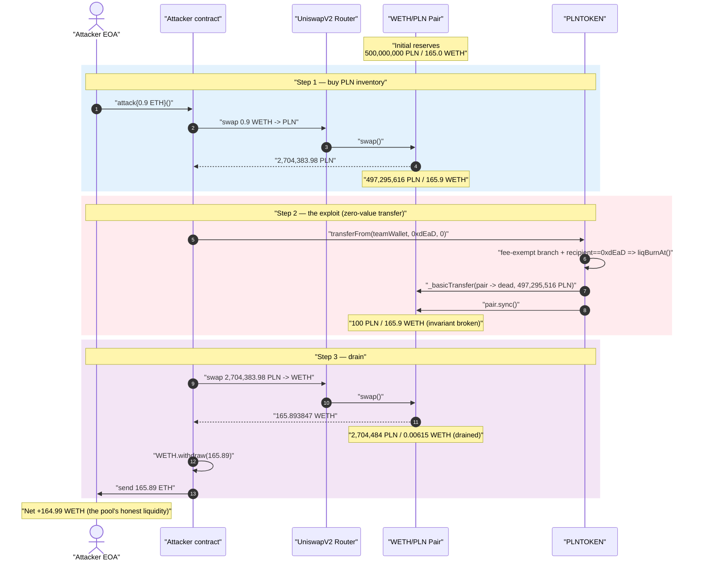
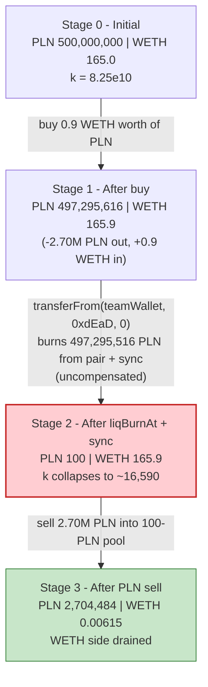
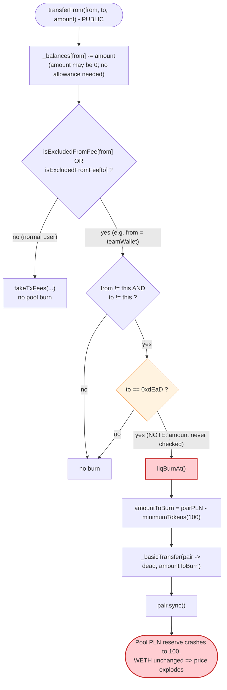

# Planet Finance (PLN) Exploit — Zero-Amount Transfer Triggers Uncompensated Pool Burn

> One-liner: A single **zero-value** `transferFrom(teamWallet, 0xdEaD, 0)` makes PLN burn the
> Uniswap pair's *entire* PLN reserve down to a 100-token floor and `sync()` it, collapsing the
> `x·y=k` invariant so the attacker drains ~165.89 WETH (~$400k) from 0.9 ETH of working capital.

> **Reproduction:** the PoC compiles & runs in this isolated Foundry project ([this folder](.)).
> The umbrella DeFiHackLabs repo does not whole-compile, so this PoC was extracted.
> Full verbose trace: [output.txt](output.txt).
> Verified vulnerable source: [PLNTOKEN.sol](sources/PLNTOKEN_e0c218/PLNTOKEN.sol).

---

## Key info

| | |
|---|---|
| **Loss** | ~**$400k** — **164.99 WETH** net drained from the WETH/PLN Uniswap-V2 pair (attacker received 165.89 WETH for 0.9 ETH in) |
| **Vulnerable contract** | `PLNTOKEN` ("Planet Finance", PLN) — [`0xe0c218e1633A5C76d57Ff4f11149F07BfFF16aeA`](https://etherscan.io/address/0xe0c218e1633A5C76d57Ff4f11149F07BfFF16aeA#code) |
| **Victim pool** | WETH/PLN Uniswap-V2 pair — `0x2b818DD5134CD1761dECdeaA157683a83D32C849` |
| **Excluded-from-fee enabler** | `teamWallet` = `0x3f5a63B89773986Fd436a65884fcD321DE77B832` (used as `from` so the fee-exempt branch is reached) |
| **Attacker EOA** | [`0x67404bcd629E920100c594d62f3678340F40D95a`](https://etherscan.io/address/0x67404bcd629E920100c594d62f3678340F40D95a) |
| **Attacker contract** | `0xbe01c53AD466Ef011e3f8A67F6e23C34E2e9976C` |
| **Attack tx** | [`0xcc36283cee837a8a0d4af0357d1957dc561913e44ad293ea9da8acf15d874ed5`](https://etherscan.io/tx/0xcc36283cee837a8a0d4af0357d1957dc561913e44ad293ea9da8acf15d874ed5) |
| **Chain / block / date** | Ethereum mainnet / 20,681,142 / Sep 5, 2024 |
| **Compiler** | Solidity v0.8.19, optimizer **200 runs** |
| **Token decimals** | PLN = **9**, WETH = 18 |
| **Bug class** | Broken AMM invariant via a permissionless, un-compensated reserve burn triggered by a no-cost (amount = 0) transfer to `0xdEaD` |

---

## TL;DR

`PLNTOKEN` is a "deflationary" meme token (Planet Finance). Inside its `_transfer` it has a
special branch: when a **fee-exempt** address sends tokens to the dead address it calls
`liqBurnAt()` ([PLNTOKEN.sol:712-716](sources/PLNTOKEN_e0c218/PLNTOKEN.sol#L712-L716)).

`liqBurnAt()` reads the **liquidity pair's** PLN balance, subtracts a `minimumTokens` floor (100
PLN), `_basicTransfer`s that entire remainder out of the pair to `0xdEaD`, and then calls
`pair.sync()` ([:546-562](sources/PLNTOKEN_e0c218/PLNTOKEN.sol#L546-L562)). This is an
**un-compensated** deletion of one side of the pool's reserves — PLN is removed from the pair with
**no matching WETH outflow**, then the pair is forced to accept the shrunken balance as its new
reserve. That single operation **breaks the constant-product invariant `x·y = k`** in the
attacker's favor.

Two design failures combine into the exploit:

1. **The dead-address-burn branch lives in the fee-exempt path and is amount-independent.** Because
   the `liqBurnAt()` call is reached *before* the amount is used, a transfer of **0 tokens**
   triggers the full pool burn. The attacker only needs a fee-exempt address as `from` — here
   `teamWallet`, which the constructor marks `isExcludedFromFee`
   ([:495](sources/PLNTOKEN_e0c218/PLNTOKEN.sol#L495)). `transferFrom(teamWallet, dead, 0)` is free
   (zero amount ⇒ zero allowance needed) and anyone can call it.
2. **The burn floor is a fixed absolute amount (100 PLN), not proportional to pool size.** So the
   burn always wipes the pool's PLN reserve down to ~100 PLN regardless of how much real liquidity
   is in it.

The attacker:

1. **Buys a tiny bit of PLN** (0.9 WETH → 2,704,383.98 PLN) so it holds inventory to dump later.
2. **Calls `transferFrom(teamWallet, 0xdEaD, 0)`** — the fee-exempt + dead-recipient branch fires
   `liqBurnAt()`, which burns **497,295,516 PLN** out of the pair (leaving exactly 100 PLN) and
   `sync()`s the pair. Pool reserves go from `165.9 WETH / 497,295,616 PLN` to
   `165.9 WETH / 100 PLN`.
3. **Sells its 2,704,383.98 PLN back** into the now-degenerate pool. With the PLN reserve at 100
   and WETH reserve untouched at 165.9, the swap returns essentially the whole WETH side:
   **165.89 WETH**.

Net profit ≈ **164.99 WETH** (~$400k) — the entire honest liquidity of the pool, recovered intra-transaction.

---

## Background — what PLNTOKEN does

`PLNTOKEN` ([source](sources/PLNTOKEN_e0c218/PLNTOKEN.sol)) is a standard meme/deflationary ERC20
with buy/sell tax, wallet limits, max-tx limits, and a `swapAndLiquify` feature. The relevant on-chain
constants ([:431-478](sources/PLNTOKEN_e0c218/PLNTOKEN.sol#L431-L478)):

| Parameter | Value |
|---|---|
| `_name` / `_symbol` | "Planet Finance" / **PLN** |
| `_decimals` | **9** |
| `_totalSupply` | 1,000,000,000 PLN |
| `minimumTokens` | `100 * 10**9` = **100 PLN** (the burn floor / `liqBurnAt` leftover) |
| `deadAddress` | `0x000000000000000000000000000000000000dEaD` |
| `uniswapV2Pair` | `0x2b818DD5134CD1761dECdeaA157683a83D32C849` (WETH/PLN) |
| `teamWallet` | `0x3f5a63B89773986Fd436a65884fcD321DE77B832` (marked `isExcludedFromFee` in constructor) |

The pool at the fork block held **165 WETH** and **~500,000,000 PLN** in reserves
([getReserves @ output.txt:49](output.txt)). That ~165 WETH of honest liquidity is the prize.

---

## The vulnerable code

### 1. The fee-exempt branch fires a pool burn on a dead-address transfer — regardless of amount

[PLNTOKEN.sol:708-728](sources/PLNTOKEN_e0c218/PLNTOKEN.sol#L708-L728):

```solidity
_balances[sender] = _balances[sender].sub(amount, "Insufficient Balance"); // amount can be 0

uint256 finalAmount = 0;

if (isExcludedFromFee[sender] || isExcludedFromFee[recipient]) {
    finalAmount = amount;
    if (sender != address(this) && recipient != address(this)) {
        if (recipient == address(0xdead)) liqBurnAt();   // ⚠️ triggered even when amount == 0
    }
} else {
    finalAmount = takeTxFees(sender, recipient, amount);
}
...
_balances[recipient] = _balances[recipient].add(finalAmount);
emit Transfer(sender, recipient, finalAmount);            // here: Transfer(teamWallet, dead, 0)
```

Because `sender = teamWallet` is fee-exempt, the first branch is taken. The `liqBurnAt()` call is
gated only on `recipient == 0xdead` — **not** on `amount > 0`. So a zero-value transfer to the dead
address fully triggers the pool burn while moving no tokens of its own.

### 2. `liqBurnAt()` empties the pair and `sync()`s it

[PLNTOKEN.sol:546-562](sources/PLNTOKEN_e0c218/PLNTOKEN.sol#L546-L562):

```solidity
function liqBurnAt() internal returns (bool) {
    // get balance of liquidity pair
    uint256 liquidityPairBalance = _balances[uniswapV2Pair];

    // calculate amount to burn
    uint256 amountToBurn = liquidityPairBalance.sub(minimumTokens);   // ~all of the pool's PLN

    if (amountToBurn > 0) {
        _basicTransfer(uniswapV2Pair, deadAddress, amountToBurn);     // ⚠️ delete PLN from the pair
    }

    //sync price since this is not in a swap transaction!
    IUniswapV2Pair pair = IUniswapV2Pair(uniswapV2Pair);
    pair.sync();                                                      // ⚠️ force the new (broken) reserve
    return true;
}
```

`_basicTransfer` ([:732-737](sources/PLNTOKEN_e0c218/PLNTOKEN.sol#L732-L737)) just moves balances
and emits a `Transfer(uniswapV2Pair, dead, amountToBurn)`. No WETH is removed from the pair. `sync()`
([Uniswap-V2 pair](https://github.com/Uniswap/v2-core)) then sets `reservePLN = balanceOf(pair) = 100 PLN`
while `reserveWETH` stays at 165.9 WETH.

---

## Root cause — why it was possible

A Uniswap-V2 pair prices assets purely from its reserves and only enforces `x·y ≥ k` *inside
`swap()`*. `sync()` exists to let the pair re-read its true balances — it trusts that token balances
change only through mechanisms it can reason about (mint/burn LP, swap, plain transfers in). PLN's
`liqBurnAt` violates that trust:

> It **destroys** PLN held by the pair (`_basicTransfer(pair, dead, …)`) and then calls
> `pair.sync()`, telling the pair "your PLN reserve is now 100." No WETH leaves the pair. `k`
> collapses and the marginal price of PLN explodes — **for free, callable by anyone.**

The specific decisions that compose into a critical bug:

1. **Amount-independent trigger.** The `if (recipient == address(0xdead)) liqBurnAt();` check does
   not require `amount > 0`. A zero-value transfer (which needs no allowance and no balance) fires
   the entire pool burn.
2. **Permissionless reachability.** `transferFrom` is public; with `amount = 0` the allowance
   check `_allowances[sender][msg.sender].sub(0)` never underflows, so *any* caller can route a
   zero-transfer through any fee-exempt `sender` to `0xdEaD`. The attacker used `teamWallet` as the
   fee-exempt `from`.
3. **Burning from the pool is a value transfer to PLN holders.** Removing PLN from the pair without
   removing WETH shifts the entire WETH side toward whoever still holds PLN. The attacker pre-buys
   2.7M PLN so it is effectively the only seller into the wrecked pool.
4. **Fixed absolute burn floor.** `minimumTokens = 100 PLN` is independent of pool size, so the burn
   always leaves the pool with ~100 PLN no matter how deep the real liquidity was.

---

## Preconditions

- A **fee-exempt** address exists to use as `from` so the `_transfer` fee-exempt branch is taken.
  Here it is the constructor-configured `teamWallet`
  ([:495](sources/PLNTOKEN_e0c218/PLNTOKEN.sol#L495)). No private key or approval is needed — the
  transfer amount is 0.
- `tradingActive == true` OR `sender/recipient` excluded from fee. The fee-exempt `sender`
  also satisfies the `tradingActive` gate ([:682-684](sources/PLNTOKEN_e0c218/PLNTOKEN.sol#L682-L684)).
- The pool holds more than `minimumTokens` (100) PLN so `amountToBurn > 0` — trivially true for a
  live pool.
- A small amount of WETH to (a) buy PLN inventory before the burn and (b) cover gas. The attack used
  **0.9 ETH** and is fully self-financing intra-transaction.

---

## Attack walkthrough (with on-chain numbers from the trace)

Pair `token0 = WETH` (`0xC02a…`), `token1 = PLN` (`0xe0c2…`). All figures are taken from the
`Sync` / `Swap` events and `balanceOf` reads in [output.txt](output.txt). PLN is shown in human
units (÷1e9), WETH in ether (÷1e18).

| # | Step | PLN reserve | WETH reserve | Effect |
|---|------|-----------:|-------------:|--------|
| 0 | **Initial** ([getReserves @ L49](output.txt)) | 500,000,000 | 165.0 | Honest pool. |
| 1 | **Buy PLN** — swap 0.9 WETH → 2,704,383.98 PLN to attacker ([Swap @ L64](output.txt)) | 497,295,616 | 165.9 | Attacker now holds 2.70M PLN inventory. |
| 2 | **`transferFrom(teamWallet, 0xdEaD, 0)`** → `liqBurnAt()`: `_basicTransfer(pair → dead, 497,295,516 PLN)` then `sync()` ([Transfer/Sync @ L74-L80](output.txt)) | **100** | 165.9 | **Invariant broken**: ~99.99998% of pool PLN annihilated; WETH untouched. |
| 3 | **Sell PLN** — swap 2,704,383.98 PLN → **165.893847 WETH** to attacker ([Swap @ L119](output.txt)) | 2,704,484 | 0.00615 | Drains essentially the whole WETH reserve. |
| 4 | **Unwrap & exfiltrate** — `WETH.withdraw(165.89)`, send ETH to `tx.origin` ([L128-L135](output.txt)) | — | — | Attacker EOA balance 0.9 → **165.89 ETH**. |

**Why a 2.7M-PLN sell empties 165.9 WETH:** after the burn the pool is `reservePLN = 100,
reserveWETH = 165.9`. Uniswap's `getAmountOut` is `out = (in·997·reserveOut)/(reserveIn·1000 +
in·997)`. With `in = 2,704,383.98 PLN` swamping `reserveIn = 100 PLN`, the input term dwarfs the
reserve term, so `out → ~reserveOut`. The sell therefore claims almost the entire 165.9 WETH side
for tokens that, pre-burn, were worth a fraction of a WETH.

### Profit accounting

| Direction | Amount |
|---|---:|
| Spent — WETH in (buy PLN) | 0.900000 WETH |
| Received — WETH out (sell PLN) | 165.893847 WETH |
| **Net profit** | **+164.993847 WETH (~$400k)** |

The attacker EOA went from 0.9 ETH to **165.893847 ETH**
([output.txt:6-7, L140](output.txt)), confirming it walked off with the pool's honest ~165 WETH of
liquidity.

---

## Diagrams

### Sequence of the attack



### Pool state evolution



### The flaw inside `_transfer` / `liqBurnAt`



---

## Remediation

1. **Never burn from the liquidity pool.** A burn must only ever destroy tokens the protocol *owns*
   (its own balance / a treasury). Removing the `_basicTransfer(uniswapV2Pair, deadAddress, …)` +
   `pair.sync()` from `liqBurnAt()` eliminates the bug entirely. If "deflation reaching the pool" is
   a product requirement, implement it as a balanced LP redemption (the protocol's own LP tokens are
   burned via `pair.burn()`), not as a side-channel reserve deletion.
2. **Guard the burn on a positive amount and a sane trigger.** At minimum require `amount > 0`
   before invoking `liqBurnAt()`; better, do not couple a global pool burn to an individual user
   transfer at all. The current `if (recipient == address(0xdead)) liqBurnAt();` lets a no-cost
   zero-value transfer wreck the pool.
3. **Make the burn proportional, not a fixed floor.** `minimumTokens = 100 PLN` means the pool is
   always reduced to dust. Any operation that can move a pool reserve by more than a small
   percentage should revert; a full-pool burn that leaves 100 tokens is a red flag.
4. **Restrict who can shrink pool reserves.** If a deflationary burn that touches the pool is truly
   required, gate it behind a trusted keeper/timelock and cap single-operation reserve impact, so it
   cannot be sandwiched by an attacker's pre-buy/post-sell.

---

## How to reproduce

The PoC was extracted into a standalone Foundry project (the umbrella DeFiHackLabs repo has several
unrelated PoCs that fail to compile under a whole-project `forge test` build):

```bash
_shared/run_poc.sh 2024-09-PLN_exp -vvvvv
```

- RPC: an **Ethereum mainnet archive** endpoint is required (fork block 20,681,142). `foundry.toml`
  uses an Infura archive endpoint; if it returns 401/429, rotate the `/v3/<key>` to another key.
- Result: `[PASS] testPoC()` with the attacker EOA going from 0.9 → 165.89 ETH.

Expected tail:

```
Ran 1 test for test/PLN_exp.sol:ContractTest
[PASS] testPoC() (gas: 964359)
Logs:
  before attack: balance of attacker: 0.900000000000000000
  after attack: balance of attacker: 165.893847285453536788

Suite result: ok. 1 passed; 0 failed; 0 skipped
```

---

*Reference: TenArmor post-mortem — https://x.com/TenArmorAlert/status/1831525062253654300 (Planet Finance / PLN, Ethereum, ~$400K).*
