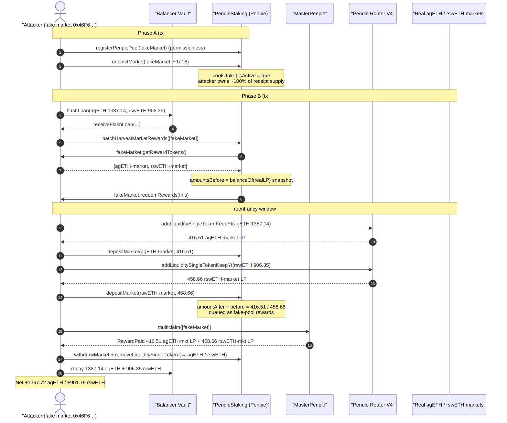
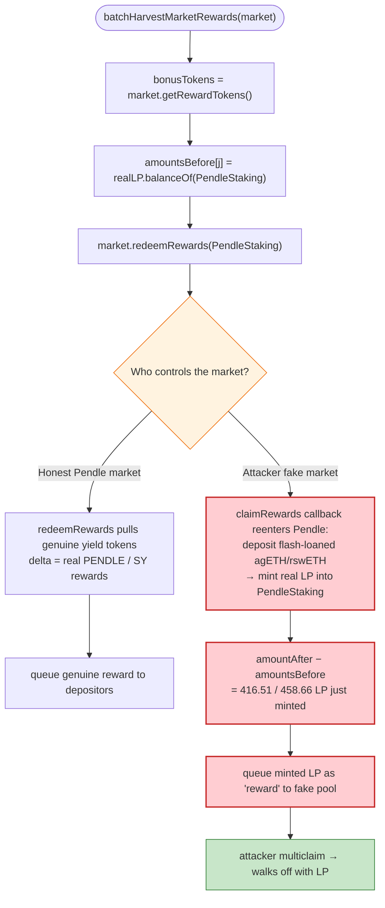
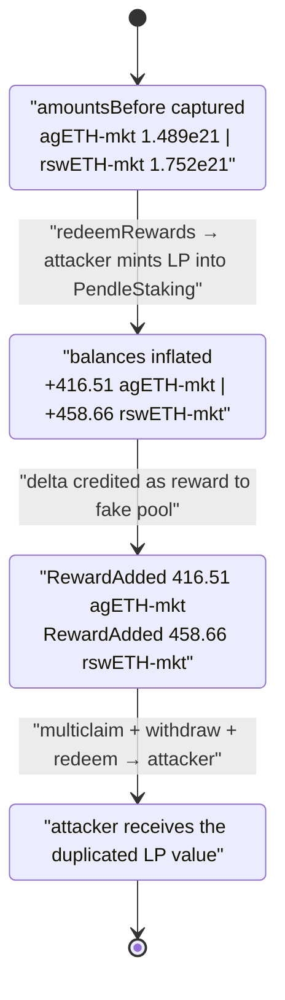

# Penpie Exploit — Fake-Market Reward Inflation via Attacker-Controlled `getRewardTokens()`

> **Reproduction:** the PoC compiles & runs in an isolated Foundry project at
> [this project folder](.) (the umbrella DeFiHackLabs repo contains many
> unrelated PoCs that do not whole-compile, so this one was extracted).
> Full verbose trace: [output.txt](output.txt).
> Verified vulnerable source: [contracts_pendle_PendleStakingBaseUpg.sol](sources/PendleStaking_FF51c6/contracts_pendle_PendleStakingBaseUpg.sol).

---

## Key info

| | |
|---|---|
| **Loss** | This PoC slice nets **1,367.72 agETH + 901.79 rswETH** (~2,270 ETH, ≈ **$5.6M** @ ~$2.5k/ETH). The full Penpie incident drained **~$27.3M** by repeating this pattern across multiple Pendle markets/loops. |
| **Vulnerable contract** | `PendleStaking` (impl) — [`0xFF51c6b493c1E4Df4e491865352353EAdff0f9f8`](https://etherscan.io/address/0xFF51c6b493c1E4Df4e491865352353EAdff0f9f8#code), behind proxy [`0x6E799758CEE75DAe3d84e09D40dc416eCf713652`](https://etherscan.io/address/0x6E799758CEE75DAe3d84e09D40dc416eCf713652) |
| **Victim funds** | agETH ([`0xe1B4…6c2e`](https://etherscan.io/address/0xe1B4d34E8754600962Cd944B535180Bd758E6c2e)) + rswETH ([`0xFAe1…a6c0`](https://etherscan.io/address/0xFAe103DC9cf190eD75350761e95403b7b8aFa6c0)), borrowed from the Balancer Vault, returned to it; the loss is the LP-receipt "rewards" stolen from the real Pendle/Penpie markets `0x6010676Bc2534652aD1Ef5Fa8073DcF9AD7EBFBe` (agETH-25DEC2024) and `0x038C1b03daB3B891AfbCa4371ec807eDAa3e6eB6` (rswETH-25DEC2024). |
| **Flash-loan provider** | Balancer Vault `0xBA12222222228d8Ba445958a75a0704d566BF2C8` (0 fee) |
| **Attacker contract** | `0x5615dEB798BB3E4dFa0139dFa1b3D433Cc23b72f` (the PoC `Attacker`) |
| **Original attack txs** | `0x7e7f9548f301d3dd863eac94e6190cb742ab6aa9d7730549ff743bf84cbd21d1` (createMarket), `0x42b2ec27c732100dd9037c76da415e10329ea41598de453bb0c0c9ea7ce0d8e5` (drain) |
| **Chain / block / date** | Ethereum mainnet / fork at **20,671,877** (attack tx in 20,671,878) / **Sep 3, 2024** |
| **Compiler** | PendleStaking impl: Solidity v0.8.19, optimizer enabled |
| **Bug class** | Trusting an attacker-controlled contract's view methods inside accounting (`balanceOf` delta credited as reward); reentrancy/balance-inflation during harvest; permissionless pool registration |

---

## TL;DR

Penpie is a Pendle "boosting" layer: users deposit their Pendle LP market tokens into Penpie's
`PendleStaking` contract, Penpie stakes them in Pendle for boosted yield, and `PendleStaking`
harvests the markets' reward tokens and distributes them to depositors through per-pool rewarders.

The fatal design choice is in `PendleStakingBaseUpg._harvestBatchMarketRewards`
([contracts_pendle_PendleStakingBaseUpg.sol:618-668](sources/PendleStaking_FF51c6/contracts_pendle_PendleStakingBaseUpg.sol#L618-L668)).
For each market being harvested it does:

1. ask the **market** which tokens are its reward tokens — `market.getRewardTokens()`;
2. snapshot `balanceOf(this)` of each of those reward tokens *before*;
3. call `market.redeemRewards(this)`;
4. credit `amountAfter − amountBefore` of each "reward token" to that market's rewarder as new rewards.

Penpie's registration helper `registerPenpiePool` was **permissionless** — anyone could register any
Pendle market that the legitimate Pendle factory produced. The attacker created a *fake* Pendle market
(via the real `PendleMarketFactoryV3`, but with the attacker's own contract as the SY), registered it,
and staked into it so it owned ~100% of the pool's receipt supply.

The attacker's fake market:

- returns the **two real, valuable Pendle LP markets** (agETH-market and rswETH-market) from
  `getRewardTokens()`, so `PendleStaking` snapshots *those* LP tokens as if they were rewards;
- in its `redeemRewards` → `claimRewards` callback, it **reenters Pendle**, depositing the flash-loaned
  agETH/rswETH to mint genuine agETH-market and rswETH-market LP tokens *into `PendleStaking`'s own
  balance*.

So between the before/after snapshot, `PendleStaking`'s balance of the two real LP tokens *increased
by the amount the attacker just minted*, and that whole increase was queued as "reward" for the
attacker's fake pool — which the attacker then `multiclaim`ed and redeemed back to agETH/rswETH.
The attacker simply minted LP tokens to themselves and had Penpie hand them right back as free yield.

---

## Background — what Penpie's `PendleStaking` does

`PendleStaking` (its base logic lives in
[`PendleStakingBaseUpg`](sources/PendleStaking_FF51c6/contracts_pendle_PendleStakingBaseUpg.sol))
is the core vault of the Penpie protocol:

- **`registerPool`** ([:307-343](sources/PendleStaking_FF51c6/contracts_pendle_PendleStakingBaseUpg.sol#L307-L343))
  — onboards a Pendle market: creates a Penpie receipt token, a `BaseRewardPool` rewarder, marks the
  pool `isActive`, and stores `pools[_market]`. It is gated by `_onlyPoolRegisterHelper`
  ([:231-234](sources/PendleStaking_FF51c6/contracts_pendle_PendleStakingBaseUpg.sol#L231-L234)) — i.e.
  only callable by `pendleMarketRegisterHelper`. That helper exposed a **permissionless**
  `registerPenpiePool(market)` to the public, so in practice anyone could register any
  factory-created Pendle market.
- **`depositMarket` / `withdrawMarket`**
  ([:254-284](sources/PendleStaking_FF51c6/contracts_pendle_PendleStakingBaseUpg.sol#L254-L284))
  — pull a market's LP token in (minting the user a receipt token) or push it back out. Both call
  `_harvestMarketRewards` first.
- **`batchHarvestMarketRewards`**
  ([:298-303](sources/PendleStaking_FF51c6/contracts_pendle_PendleStakingBaseUpg.sol#L298-L303)) — the
  public, permissionless entry point to harvest a set of markets and pay rewards out to rewarders.

Rewards are accounted by **measuring `PendleStaking`'s own token-balance delta** across
`market.redeemRewards()`. That is safe only if the market and its reward-token list are honest — which
is exactly the assumption the attacker broke.

The on-chain facts at the fork block:

| Fact | Value |
|---|---|
| Fake market created by attacker | `0x46F6eE9880d08C66DdB22a4645806672CDb1fb61` |
| Attacker share of fake pool receipt supply | `999,999,999,999,999,000` of `999,999,999,999,999,000` (≈ 100%) |
| Fake market's `getRewardTokens()` returns | `[0x6010…BFBe (agETH-market), 0x038C…6eB6 (rswETH-market)]` |
| agETH borrowed (Balancer flashloan, 0 fee) | `1,387,144,695,760,709,012,655` (≈ 1,387.14 agETH) |
| rswETH borrowed (Balancer flashloan, 0 fee) | `906,345,923,203,725,548,764` (≈ 906.35 rswETH) |

---

## The vulnerable code

### 1. Reward = self-reported reward-token-list × balance delta

```solidity
// PendleStakingBaseUpg._harvestBatchMarketRewards  (lines 618-668)
for (uint256 i = 0; i < _markets.length; i++) {
    if (!pools[_markets[i]].isActive) revert OnlyActivePool();
    Pool storage poolInfo = pools[_markets[i]];
    poolInfo.lastHarvestTime = block.timestamp;

    address[] memory bonusTokens = IPendleMarket(_markets[i]).getRewardTokens(); // ⚠️ attacker-controlled
    uint256[] memory amountsBefore = new uint256[](bonusTokens.length);

    for (uint256 j; j < bonusTokens.length; j++) {
        if (bonusTokens[j] == NATIVE) bonusTokens[j] = address(WETH);
        amountsBefore[j] = IERC20(bonusTokens[j]).balanceOf(address(this));    // ⚠️ snapshot of REAL LP tokens
    }

    IPendleMarket(_markets[i]).redeemRewards(address(this));                    // ⚠️ reenters attacker → mints LP into `this`

    for (uint256 j; j < bonusTokens.length; j++) {
        uint256 amountAfter = IERC20(bonusTokens[j]).balanceOf(address(this));
        uint256 originalBonusBalance = amountAfter - amountsBefore[j];          // ⚠️ = LP the attacker just minted
        uint256 leftBonusBalance = originalBonusBalance;
        ...
        if (originalBonusBalance == 0) continue;
        ...
        _sendRewards(_markets[i], bonusTokens[j], poolInfo.rewarder,
                     originalBonusBalance, leftBonusBalance);                   // ⚠️ queues stolen LP as reward
    }
}
```

[contracts_pendle_PendleStakingBaseUpg.sol:618-668](sources/PendleStaking_FF51c6/contracts_pendle_PendleStakingBaseUpg.sol#L618-L668)

The reward token list and the `redeemRewards` implementation are both read off the *market*. For a
legitimate Pendle market that is fine. For the attacker's fake market, both are fully controlled, and
`originalBonusBalance` becomes "however many real LP tokens `PendleStaking` gained while we were inside
`redeemRewards`."

### 2. The reward is queued to the rewarder and claimable

```solidity
// _queueRewarder (lines 792-811) — for non-PENDLE reward tokens, the whole delta is queued
IERC20(_rewardToken).safeApprove(_rewarder, 0);
IERC20(_rewardToken).safeApprove(_rewarder, _leftRewardAmount);
IBaseRewardPool(_rewarder).queueNewRewards(_leftRewardAmount, _rewardToken);
emit RewardPaidTo(_market, _rewarder, _rewardToken, _leftRewardAmount);
```

[contracts_pendle_PendleStakingBaseUpg.sol:792-811](sources/PendleStaking_FF51c6/contracts_pendle_PendleStakingBaseUpg.sol#L792-L811)

Because the attacker owns ≈100% of the fake pool's receipt supply, `MasterPenpie.multiclaim` then pays
that entire queued amount of real LP tokens straight to the attacker.

### 3. `depositMarket` triggers a harvest, and is reachable for the fake pool

```solidity
function depositMarket(address _market, address _for, address _from, uint256 _amount)
    external override nonReentrant whenNotPaused _onlyActivePoolHelper(_market)
{
    Pool storage poolInfo = pools[_market];
    _harvestMarketRewards(poolInfo.market, false);              // harvest-on-deposit
    IERC20(poolInfo.market).safeTransferFrom(_from, address(this), _amount);
    IMintableERC20(poolInfo.receiptToken).mint(_for, _amount);  // receipt minted to attacker
    ...
}
```

[contracts_pendle_PendleStakingBaseUpg.sol:254-269](sources/PendleStaking_FF51c6/contracts_pendle_PendleStakingBaseUpg.sol#L254-L269)

The `_onlyActivePoolHelper` modifier only checks the pool exists and is active — which the attacker
satisfied by registering their fake market through the permissionless helper.

---

## Root cause — why it was possible

The protocol determines *what* a reward token is, and *how much* was rewarded, from data and code
that the market itself supplies, while a malicious market is allowed into the system:

1. **Self-declared reward tokens.** `getRewardTokens()` is read off the market and trusted verbatim
   ([:632](sources/PendleStaking_FF51c6/contracts_pendle_PendleStakingBaseUpg.sol#L632)). A fake market
   simply names the most valuable real LP tokens it wants Penpie to hand out.
2. **Balance-delta accounting around an untrusted external call.** Reward = `balanceOf(this)` after −
   before `redeemRewards()`
   ([:638](sources/PendleStaking_FF51c6/contracts_pendle_PendleStakingBaseUpg.sol#L638),
   [:641](sources/PendleStaking_FF51c6/contracts_pendle_PendleStakingBaseUpg.sol#L641),
   [:644-646](sources/PendleStaking_FF51c6/contracts_pendle_PendleStakingBaseUpg.sol#L644-L646)). Any
   increase in `PendleStaking`'s balance of the named tokens *during* that call — from any source,
   including the attacker minting LP tokens to it — is mistaken for harvested yield. The `redeemRewards`
   callback is the perfect reentrancy window: the attacker's `claimRewards` runs *inside* it and uses
   the deposit helper to mint real LP into `PendleStaking`.
3. **Permissionless market registration.** `registerPenpiePool` had no allow-listing of which Pendle
   markets are legitimate, so the attacker's fake market (created through the real factory but pointing
   at an attacker SY) could be onboarded and staked into.
4. **Attacker owns ~100% of the fake pool.** With essentially the entire receipt supply, the attacker
   captures the full queued reward when claiming.

Composed together: register a fake pool → declare the agETH/rswETH real markets as "rewards" → harvest →
inside `redeemRewards`, mint those real LP tokens into Penpie with flash-loaned agETH/rswETH →
Penpie credits the freshly-minted LP as the attacker's reward → claim it, withdraw it, redeem back to
agETH/rswETH, repay the flash loan, keep the surplus.

---

## Preconditions

- A Pendle market the attacker fully controls (its `getRewardTokens`, `redeemRewards`, `claimRewards`,
  `exchangeRate`, `assetInfo` are all attacker code). Created via the real `PendleMarketFactoryV3`
  using the attacker contract as the SY.
- The market registered into Penpie via the **permissionless** `registerPenpiePool`, making
  `pools[fakeMarket].isActive == true`.
- The attacker holding ~100% of that fake pool's receipt-token supply (achieved by `depositMarket` with
  ~1e18 of the fake LP).
- Working capital in the two real reward tokens (agETH, rswETH) to mint genuine LP during the harvest.
  This is supplied by a **0-fee Balancer flash loan**, so the attack is self-funded within one tx.
- A fresh block for the real markets' reward index (`vm.roll(block.number + 1)` in the PoC,
  matching the "first tx then second tx" structure of the live attack) so the real markets actually
  mint receipt deltas on deposit.

---

## Attack walkthrough (with on-chain numbers from the trace)

All figures are taken directly from [output.txt](output.txt). 1e18 = 1 token.

### Phase A — `createMarket()` (setup, tx #1)

| # | Step | Concrete value |
|---|------|----------------|
| A1 | `PendleYieldContractFactory.createYieldContract(attacker SY, expiry=1735171200, true)` → mints PT/YT for a fake SY | new PT, YT |
| A2 | `PendleMarketFactoryV3.createNewMarket(PT, scalarRoot, anchor, lnFeeRate)` → fake market `0x46F6…fb61` | fake LP market |
| A3 | `PendleMarketRegisterHelper.registerPenpiePool(fakeMarket)` — **permissionless** | `pools[fake].isActive = true` |
| A4 | Attacker mints/has `1e18` fake LP and `depositMarket(fake, 999999999999999000)` | attacker receipt ≈ `9.999e17` (≈100% of supply) |

After Phase A the attacker owns essentially the entire fake pool, and the fake pool's
`getRewardTokens()` will report the two real markets.

### Phase B — `attack()` / `receiveFlashLoan()` (drain, tx #2)

Balancer flash-loans **1,387.14 agETH** and **906.35 rswETH** to the attacker, then:

| # | Step | Concrete value (from trace) |
|---|------|------------------------------|
| B1 | `PendleStaking.batchHarvestMarketRewards([fakeMarket], 0)` | begins harvest of the fake pool |
| B2 | inside: `fakeMarket.getRewardTokens()` → `[agETH-market, rswETH-market]` | the two real LP tokens are treated as "rewards" |
| B3 | snapshot real-LP balances of `PendleStaking` (`amountsBefore`) | agETH-mkt: `1.489e21`, rswETH-mkt: `1.752e21` |
| B4 | `fakeMarket.redeemRewards(this)` → reenters attacker `claimRewards` | reentrancy window opens |
| B5 | in callback: deposit `1,387.14 agETH` via `addLiquiditySingleTokenKeepYt` → mint **416.51 agETH-market LP**, then `depositMarket(agETH-market, …)` into `PendleStaking` | `PendleStaking` agETH-mkt balance += `416,513,404,704,868,480,106` |
| B6 | in callback: deposit `906.35 rswETH` similarly → mint **458.66 rswETH-market LP**, `depositMarket(rswETH-market, …)` | `PendleStaking` rswETH-mkt balance += `458,662,065,591,341,047,289` |
| B7 | harvest computes deltas → `_sendRewards` queues `416.51` agETH-mkt LP and `458.66` rswETH-mkt LP to the fake pool's rewarder | `RewardAdded(416.51…, agETH-market)`, `RewardAdded(458.66…, rswETH-market)` |
| B8 | `MasterPenpie.multiclaim([fakeMarket])` → pays the attacker `RewardPaid 416.51…` agETH-mkt LP and `458.66…` rswETH-mkt LP | attacker now holds the two LP "rewards" |
| B9 | `withdrawMarket(agETH-market, 416.51…)`, `removeLiquiditySingleToken` → redeem to agETH; same for rswETH | LP → agETH / rswETH |
| B10 | repay flash loan: `transfer(balancerVault, 1387.14 agETH)`, `transfer(balancerVault, 906.35 rswETH)` | loan closed |

Note the magnitudes in B5/B7: the attacker minted `416.51` agETH-market LP and `458.66` rswETH-market
LP with the flash-loaned capital — and Penpie credited that *exact* freshly-minted amount back as
"reward". The attacker keeps the principal (recovered by withdrawing its own deposits) **plus** the
duplicated reward, then nets out after repaying the loan.

### Final balances (post-repayment, = net profit)

```
Final balance in agETH : 1367721940734251263418   (1,367.72 agETH)
Final balance in rswETH:  901793090984736278006   (  901.79 rswETH)
```

---

## Profit / loss accounting

| Token | Borrowed (Balancer) | Repaid | Reward LP minted-then-stolen (this slice) | Attacker net (final balance) |
|---|---:|---:|---:|---:|
| agETH | 1,387.14 | 1,387.14 | 416.51 agETH-market LP | **+1,367.72 agETH** |
| rswETH | 906.35 | 906.35 | 458.66 rswETH-market LP | **+901.79 rswETH** |

The net (≈ **2,269.5 ETH-equivalent, ≈ $5.6M** at ~$2,500/ETH) is larger than the single reward delta
because the attacker also keeps its own LP positions' underlying after redemption; the duplicated
reward is what makes the books come out positive instead of break-even. Repeating the loop across
multiple Pendle markets/sizes is how the live incident reached the widely-reported **~$27.3M** total.

---

## Diagrams

### Sequence of the attack



### Reward accounting: honest harvest vs. fake-market harvest



### PendleStaking real-LP balance evolution during the harvest



---

## Remediation

1. **Never derive rewards from a balance delta around an untrusted external call.** Harvest accounting
   must not equate "our balance of token X grew during `redeemRewards`" with "we earned X as reward."
   Pull rewards into a quarantine accountant, or have the market push an explicit, signed reward amount,
   rather than inferring it from `balanceOf` deltas that any reentrant flow can inflate.
2. **Allow-list markets, do not trust `getRewardTokens()` blindly.** The set of reward tokens for a
   pool should be fixed at (trusted) registration time and validated against the canonical Pendle
   SY/market, never re-read live from a potentially malicious market each harvest. A reward token that
   is itself a *staked LP / receipt token of the same system* should be rejected outright.
3. **Gate pool registration.** `registerPenpiePool` must be permissioned (governance/keeper allow-list)
   so attacker-fabricated markets can never become `isActive`. A permissionless registration path is
   the single enabler that lets the rest of the chain execute.
4. **Add reentrancy protection across the harvest boundary.** `batchHarvestMarketRewards` calls out to
   `market.redeemRewards()` with no `nonReentrant` guard; mark the harvest path `nonReentrant` and
   follow checks-effects-interactions so deposits cannot fire inside an in-flight harvest.
5. **Sanity-bound harvested amounts.** A single harvest crediting hundreds of LP tokens of a *different*
   market than the one being harvested is a glaring invariant violation; reject reward tokens that are
   not the market's canonical SY/PENDLE rewards.

---

## How to reproduce

The PoC was extracted into a standalone Foundry project (the umbrella DeFiHackLabs repo has many
unrelated PoCs that fail to compile under `forge test`'s whole-project build):

```bash
_shared/run_poc.sh 2024-09-Penpiexyzio_exp -vvvvv
```

- RPC: an **Ethereum mainnet archive** endpoint is required (the fork block 20,671,877 is historical).
  `foundry.toml` is pre-configured with an Infura archive endpoint.
- Result: `[PASS] testPoC_A()` with positive agETH / rswETH balances.

Expected tail:

```
  Final balance in agETH : 1367721940734251263418
  Final balance in rswETH: 901793090984736278006

Suite result: ok. 1 passed; 0 failed; 0 skipped
Ran 1 test suite ...: 1 tests passed, 0 failed, 0 skipped (1 total tests)
```

---

*Reference: SlowMist Hacked / rekt — Penpie (Ethereum, ~$27.3M, Sep 3 2024). PoC author: [rotcivegaf](https://twitter.com/rotcivegaf).*
