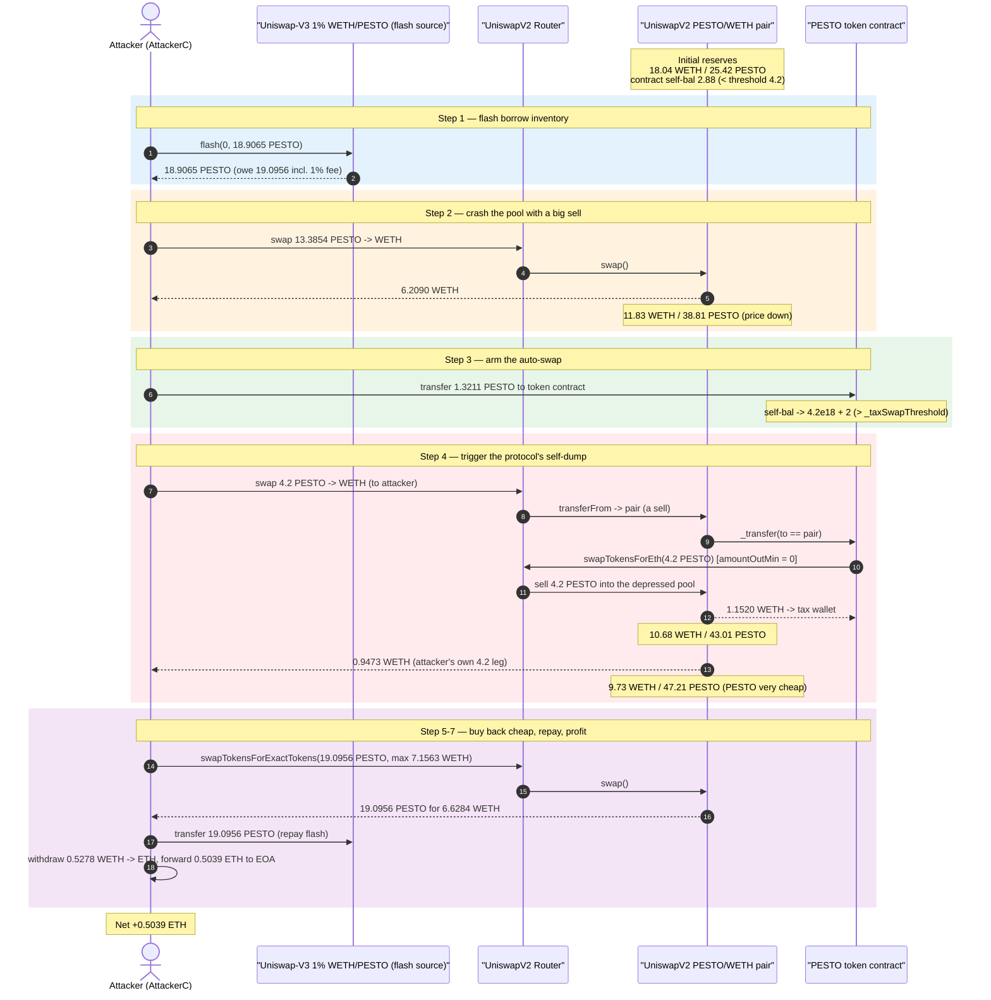
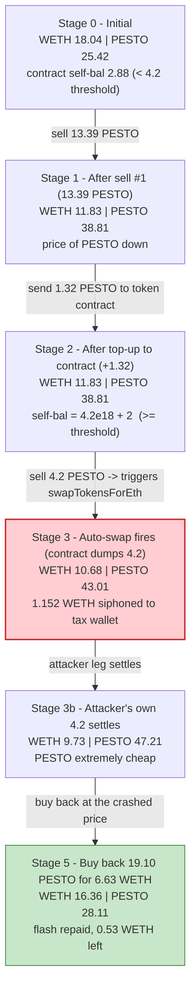
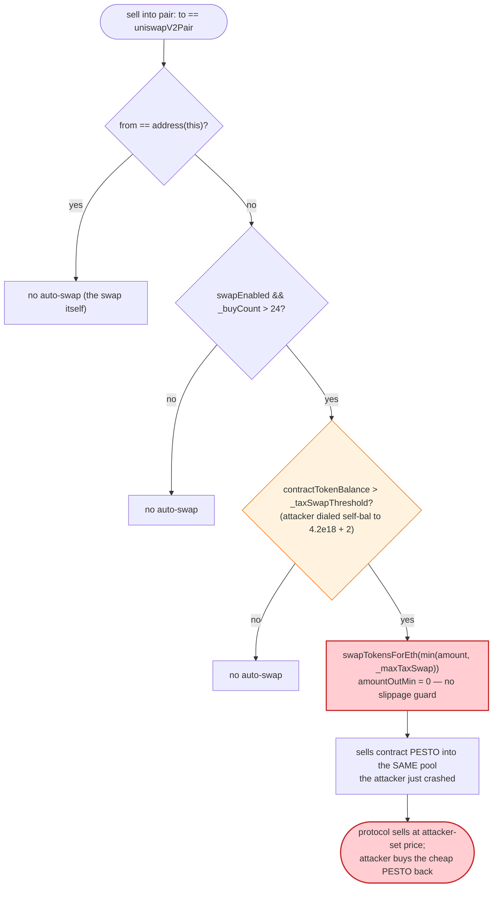

# PESTO (Pesto The Baby King Penguin) Exploit — Flash-Loan-Driven Tax Auto-Swap Self-Sandwich

> One-line summary: the token's on-transfer auto-swap dumps the contract's
> accumulated 70%-transfer-tax balance into its own thin Uniswap-V2 pool at a
> price the attacker controls, letting a flash loan engineer the dump and pocket
> the resulting WETH.

> **Reproduction:** the PoC compiles & runs in an isolated Foundry project at
> [this project folder](.) (the umbrella DeFiHackLabs repo does not whole-compile,
> so this PoC was extracted into a standalone project).
> Full verbose trace: [output.txt](output.txt).
> Verified vulnerable source: [PestoTheBabyKingPenguin.sol](sources/PestoTheBabyKingPenguin_E81C4A/PestoTheBabyKingPenguin.sol).

---

## Key info

| | |
|---|---|
| **Loss** | ~**0.5039 ETH** profit to the attacker (~$1.3–1.4K at Sept-2024 prices) |
| **Vulnerable contract** | `PestoTheBabyKingPenguin` (PESTO) — [`0xE81C4A73bfDdb1dDADF7d64734061bE58d4c0b4C`](https://etherscan.io/address/0xE81C4A73bfDdb1dDADF7d64734061bE58d4c0b4C#code) |
| **Victim pool** | Uniswap-V2 PESTO/WETH pair — `0xBc6a213cbB34424670548eF4B3388f5FDBd07992` (token0 = WETH, token1 = PESTO) |
| **Flash-loan source** | Uniswap-V3 WETH/PESTO 1% pool — `0x03D93835F5cE4dD7F0EAAb019b33050939c722b1` |
| **Attacker EOA** | `0x7248939f65bdd23Aab9eaaB1bc4A4F909567486e` |
| **Attacker contract** | [`0xBdb0bc0941BA81672593Cd8B3F9281789F2754D1`](https://etherscan.io/address/0xbdb0bc0941ba81672593cd8b3f9281789f2754d1) (PoC deploys an equivalent `AttackerC`) |
| **Attack tx** | [`0x3d5b4a0d560e8dd750239b578e2b85921b523835b644714dc239a2db70cf067c`](https://app.blocksec.com/explorer/tx/eth/0x3d5b4a0d560e8dd750239b578e2b85921b523835b644714dc239a2db70cf067c) |
| **Chain / block / date** | Ethereum mainnet / 20,811,949 (fork at 20,811,948) / **2024-09-23** |
| **Compiler** | Token: Solidity v0.8.23, optimizer 200 runs |
| **Bug class** | Price manipulation via attacker-triggered on-transfer auto-swap of accumulated tax into a thin AMM pool |

---

## TL;DR

`PestoTheBabyKingPenguin` is a "tax token". Wallet-to-wallet transfers are taxed
70% (`_transferTax`), and the tax accumulates inside the token contract itself.
On any **sell into the Uniswap-V2 pair**, `_transfer` checks whether the
contract's own PESTO balance has grown past a hard-coded `_taxSwapThreshold`
(4.2 × 10¹⁸ base units); if so it **swaps that accumulated balance to ETH right
then, inside the user's transaction**, by selling it into the *same* PESTO/WETH
V2 pool ([PestoTheBabyKingPenguin.sol:243-256](sources/PestoTheBabyKingPenguin_E81C4A/PestoTheBabyKingPenguin.sol#L243-L256)).

The attacker abuses the fact that **they control both the timing and the price**
of that contract-side dump:

1. **Flash-borrow** 18.9065 PESTO from the V3 1% pool.
2. **Sell** 13.385 PESTO into the V2 pool — this pushes the V2 PESTO reserve up
   (price down) and leaves the attacker exactly `2 × threshold` worth of PESTO.
3. **Top up the contract** by sending 1.3211 PESTO *directly to the token
   contract address*, lifting its self-balance from 2.8789 → **4.2 × 10¹⁸ + 2**,
   i.e. just past `_taxSwapThreshold`.
4. **Sell** the remaining 4.2 PESTO into the V2 pool. Because the contract
   balance now exceeds the threshold, `_transfer` fires the **auto-swap**: the
   contract dumps its own 4.2 PESTO into the *already-depressed* pool, pushing the
   price down even further — but that ETH goes to the token's tax wallet, not the
   attacker. The attacker's value comes from the next step.
5. **Buy back** 19.0956 PESTO (= flash principal + fee) from the pool, now that it
   is heavily over-supplied with PESTO and cheap, spending only 6.6284 WETH.
6. **Repay** the flash loan and **withdraw** the leftover 0.5278 WETH as ETH;
   0.5039 ETH is forwarded to the attacker EOA.

Net: the attacker walks away with **0.5039 ETH** — value extracted from the V2
LPs and from the token's own tax wallet, because the protocol's self-swap was
forced to execute at a price the attacker had pre-crashed.

---

## Background — what PESTO does

PESTO ([source](sources/PestoTheBabyKingPenguin_E81C4A/PestoTheBabyKingPenguin.sol))
is a stock "stealth-launch meme tax token" of the genre that floods Etherscan.
Relevant features:

- **9 decimals**, fixed supply `_tTotal = 420,690,000,000 × 10⁹`.
- **Transfer tax** — `_transferTax = 70` (%). Any transfer where the sender has a
  positive `_buyCount` and the recipient is **not** the pair and **not** the
  router is taxed 70%; the tax is *added to the token contract's own balance*
  (`_balances[address(this)] += taxAmount`,
  [:259-262](sources/PestoTheBabyKingPenguin_E81C4A/PestoTheBabyKingPenguin.sol#L259-L262)).
- **Buy/sell tax** — `_finalBuyTax = _finalSellTax = 0` after `_buyCount` exceeds
  `_reduceSellTaxAt = 10`, so by the time of the attack ordinary buys/sells into
  the pair are tax-free.
- **On-transfer auto-swap** — on a sell into the pair, if the contract's PESTO
  balance exceeds `_taxSwapThreshold`, the contract sells up to `_maxTaxSwap` of
  *its own* PESTO into the pair for ETH and forwards it to `_taxWallet`
  ([:243-256](sources/PestoTheBabyKingPenguin_E81C4A/PestoTheBabyKingPenguin.sol#L243-L256)).

On-chain parameters at the fork block:

| Parameter | Value (base units, 9 decimals) | Meaning |
|---|---:|---|
| `_transferTax` | 70 | 70% tax on non-pair transfers |
| `_taxSwapThreshold` | `4,200,000,000 × 10⁹ = 4.2 × 10¹⁸` | min contract balance to trigger auto-swap |
| `_maxTaxSwap` | `4.2 × 10¹⁸` | max amount auto-swapped per trigger |
| `_maxTxAmount` | `8,400,000,000 × 10⁹ = 8.4 × 10¹⁸` | per-tx cap |
| `swapEnabled` | `true` | auto-swap armed |
| **Contract self-balance** | `2.878895419298712592 × 10¹⁸` | accumulated tax, *just below* threshold |
| V2 pool WETH reserve | `18.038172401356039473` WETH | the prize |
| V2 pool PESTO reserve | `25.424926301594866192 × 10¹⁸` | thin / manipulable |

The whole exploit hinges on three facts: the auto-swap fires **inside an
attacker-initiated transaction**, the dump price is the **current spot price of a
thin pool the attacker just moved**, and the threshold/amount are **fixed
constants** the attacker can engineer the contract balance up to.

---

## The vulnerable code

### 1. The on-transfer auto-swap dumps contract PESTO into the live pool

```solidity
function _transfer(address from, address to, uint256 amount) private {
    ...
    if (from != owner() && to != owner() && to != _taxWallet) {
        ...
        // sells into the pair are taxed at _finalSellTax == 0 here
        if(to == uniswapV2Pair && from!= address(this) ){
            taxAmount = amount.mul((_buyCount>_reduceSellTaxAt)?_finalSellTax:_initialSellTax).div(100);
        }

        uint256 contractTokenBalance = balanceOf(address(this));
        if (!inSwap && to == uniswapV2Pair && swapEnabled
                && contractTokenBalance > _taxSwapThreshold     // ⚠️ attacker-tunable
                && _buyCount > _preventSwapBefore) {
            if (block.number > lastSellBlock) { sellCount = 0; }
            require(sellCount < 3, "Only 3 sells per block!");
            swapTokensForEth(min(amount, min(contractTokenBalance, _maxTaxSwap))); // ⚠️ dumps into live pool
            uint256 contractETHBalance = address(this).balance;
            if (contractETHBalance > 0) { sendETHToFee(address(this).balance); }
            sellCount++;
            lastSellBlock = block.number;
        }
    }
    ...
}
```
[PestoTheBabyKingPenguin.sol:217-266](sources/PestoTheBabyKingPenguin_E81C4A/PestoTheBabyKingPenguin.sol#L217-L266)

### 2. `swapTokensForEth` sells into the SAME PESTO/WETH pool, at spot price

```solidity
function swapTokensForEth(uint256 tokenAmount) private lockTheSwap {
    address[] memory path = new address[](2);
    path[0] = address(this);
    path[1] = uniswapV2Router.WETH();
    _approve(address(this), address(uniswapV2Router), tokenAmount);
    uniswapV2Router.swapExactTokensForETHSupportingFeeOnTransferTokens(
        tokenAmount,
        0,                  // ⚠️ amountOutMin = 0 — accepts ANY price, no slippage guard
        path,
        address(this),
        block.timestamp
    );
}
```
[PestoTheBabyKingPenguin.sol:273-285](sources/PestoTheBabyKingPenguin_E81C4A/PestoTheBabyKingPenguin.sol#L273-L285)

### 3. The 70% transfer tax that feeds the contract balance

```solidity
if(_buyCount>0){
    taxAmount = amount.mul(_transferTax).div(100);   // 70%
}
...
if(taxAmount>0){
    _balances[address(this)]=_balances[address(this)].add(taxAmount);   // accrues to contract
    emit Transfer(from, address(this),taxAmount);
}
```
[PestoTheBabyKingPenguin.sol:228-262](sources/PestoTheBabyKingPenguin_E81C4A/PestoTheBabyKingPenguin.sol#L228-L262)

---

## Root cause — why it was possible

A Uniswap-V2 pool prices an asset purely from its instantaneous reserves. The
"sell my accumulated tax for ETH" routine here is a swap into that pool, executed
**synchronously inside the very transaction that triggers it**, with **no
slippage protection** (`amountOutMin = 0`). Whoever causes the trigger therefore
gets to choose the price at which the protocol sells.

The four design decisions that compose into a profitable manipulation:

1. **Auto-swap is reachable from any sell.** The trigger is a side effect of the
   ordinary `_transfer` path whenever `to == uniswapV2Pair` and the contract
   balance is over the threshold. An attacker reaches it just by selling into the
   pair — fully permissionless.
2. **The dump price is whatever the attacker just set.** The contract sells into
   the same thin PESTO/WETH pool the attacker has already pushed PESTO-heavy
   (price-down) in the same transaction, and `amountOutMin = 0` means it accepts
   any execution price.
3. **Threshold and swap size are fixed constants the attacker can dial in.**
   `_taxSwapThreshold` and `_maxTaxSwap` are both `4.2 × 10¹⁸`. By sending PESTO
   *directly to the token contract address*, the attacker lifts the contract
   balance from 2.8789 to exactly `4.2 × 10¹⁸ + 2`, guaranteeing the auto-swap
   fires and dumps the full `_maxTaxSwap`.
4. **The whole position is flash-loanable.** The attacker needs PESTO inventory
   only for the duration of the transaction; the V3 1% pool lends 18.9065 PESTO,
   the attacker buys back 19.0956 PESTO (principal + 1% fee) from the cheapened
   pool, and repays — all atomically, with no upfront capital (`deal` of
   4.59 × 10⁻¹⁶ ETH is only enough to pay the receive-callback dust).

The economic effect is a **self-sandwich**: the attacker depresses the pool, the
protocol is forced to sell *its own* tokens into that depressed pool (handing the
output ETH to the tax wallet, i.e. burning protocol value into the LPs), and then
the attacker buys the now-overweight PESTO back cheaply and unwinds the loan,
keeping the WETH it extracted on the way down.

---

## Preconditions

- `swapEnabled == true` and `_buyCount > _preventSwapBefore (24)` so the auto-swap
  arm is live (true on mainnet at the fork block).
- Contract self-balance starts below `_taxSwapThreshold` but reachable: 2.8789 ×
  10¹⁸ here, so a 1.3211 PESTO top-up crosses it.
- A thin PESTO/WETH V2 pool (≈18 WETH / 25.4 PESTO) so a ~13 PESTO sell moves the
  price materially.
- A flash-loan source of PESTO — the Uniswap-V3 1% WETH/PESTO pool holding
  18.9065 PESTO. No working capital required (the position is closed atomically).

---

## Attack walkthrough (with on-chain numbers from the trace)

The V2 pair is `token0 = WETH`, `token1 = PESTO`, so in every `Sync` event
`reserve0 = WETH`, `reserve1 = PESTO`. All figures are taken directly from the
`Sync`/`Swap`/`Flash` events and storage diffs in [output.txt](output.txt).
Amounts are shown in whole-token units (÷10¹⁸ base units).

| # | Step | Action | V2 WETH reserve | V2 PESTO reserve | Contract self-bal | Attacker effect |
|---|------|--------|----------------:|-----------------:|------------------:|-----------------|
| 0 | **Initial** | — | 18.0382 | 25.4249 | 2.8789 | Honest pool; tax not yet swappable. |
| 1 | **Flash borrow** ([:1578](output.txt)) | V3 1% pool flashes 18.9065 PESTO to attacker | 18.0382 | 25.4249 | 2.8789 | Attacker holds 18.9065 PESTO; owes 19.0956 (incl. 1% fee). |
| 2 | **Sell #1** ([:1599](output.txt)) | swap 13.3854 PESTO → 6.2090 WETH (to attacker) | 11.8292 | 38.8104 | 2.8789 | Pool pushed PESTO-heavy; price of PESTO down ~46%. Attacker left holding 5.5211 PESTO. |
| 3 | **Top-up contract** ([:1635](output.txt)) | transfer 1.3211 PESTO → token contract | 11.8292 | 38.8104 | **4.2 × 10¹⁸ + 2** | Contract balance now *just over* `_taxSwapThreshold`. Attacker left with exactly 4.2 PESTO. |
| 4 | **Sell #2 → triggers AUTO-SWAP** ([:1648-1693](output.txt)) | attacker sells 4.2 PESTO into pair; `_transfer` fires `swapTokensForEth(4.2 PESTO)` | 10.6772 | 43.0104 | ~0 | Contract dumps its 4.2 PESTO into the depressed pool for **1.1520 WETH → tax wallet**. (This is the abused self-swap.) |
| 4b | (same call, attacker's own 4.2) ([:1711](output.txt)) | attacker's 4.2 PESTO settles into pool → 0.9473 WETH | 9.7299 | 47.2104 | 0 | Attacker now holds 7.1563 WETH total (6.2090 + 0.9473). |
| 5 | **Buy back** ([:1737-1764](output.txt)) | swapTokensForExactTokens: 19.0956 PESTO out for 6.6284 WETH in | 16.3583 | 28.1148 | 0 | Pool re-balanced; attacker reacquires exactly the flash repayment amount cheaply. |
| 6 | **Repay flash** ([:1767](output.txt)) | transfer 19.0956 PESTO → V3 pool | 16.3583 | 28.1148 | 0 | Loan closed (`Flash` event paid1 = 0.1891 fee). |
| 7 | **Withdraw + payout** ([:1784-1791](output.txt)) | withdraw 0.5278 WETH → ETH; forward 0.5039 ETH to EOA | 16.3583 | 28.1148 | 0 | **Attacker profit = 0.5039 ETH.** |

### Why each magic number

- **`flash 18906536720334536200`** — essentially the entire PESTO balance of the
  V3 pool (`18906536720334536215`), the maximum borrowable inventory.
- **`amtIn = selfPesto + tokenSupplyAddr − 8.4 × 10¹⁸ − 2 = 13.3854 PESTO`** —
  sized so that after sell #1 the attacker is left holding exactly
  `2 × (threshold) = 8.4 × 10¹⁸` PESTO, split into the 1.3211 top-up and the 4.2
  trigger sell. (`8400000000000000002 = 2 × (_taxSwapThreshold) + 2`.)
- **`top-up 1321104580701287410`** — the precise amount that lifts the contract
  self-balance from `2.878895419298712592` to `4.2 × 10¹⁸ + 2`, i.e. one wei past
  `_taxSwapThreshold`, arming the auto-swap.
- **`trigger sell 4.2 × 10¹⁸`** — equal to `_maxTaxSwap`, the most the contract
  will auto-dump in one go, maximizing the protocol-side sell into the crashed
  pool.
- **`buy back 19095602087537881562`** — exactly `flash principal + 1% fee`, the
  amount needed to repay the V3 flash loan.

### Profit accounting (WETH / ETH)

| Direction | Amount (WETH) |
|---|---:|
| Received — sell #1 (13.3854 PESTO → WETH) | +6.2090 |
| Received — sell #2 attacker leg (4.2 PESTO → WETH) | +0.9473 |
| **Subtotal WETH held** | **7.1563** |
| Spent — buy back 19.0956 PESTO | −6.6284 |
| **WETH remaining → withdrawn as ETH** | **0.5278** |
| Forwarded to attacker EOA | **0.5039** |
| Dust kept in attacker contract | 0.0240 |

The 0.5039 ETH was extracted from the V2 LPs and from the protocol's tax wallet
(whose 1.1520 WETH of forced sell-output left the pool cheaper for the attacker's
buy-back). The flash principal + fee netted to zero.

---

## Diagrams

### Sequence of the attack



### Pool / contract-balance state evolution



### The flaw inside `_transfer` / `swapTokensForEth`



---

## Remediation

1. **Never auto-swap synchronously inside a user-triggered transfer.** Triggering
   an AMM sell of the contract's tax balance from within `_transfer` lets the
   triggerer choose the price. Move tax liquidation to a separate, access-gated
   keeper function (the contract already has `manualSwap()` restricted to
   `_taxWallet`) and remove the in-`_transfer` path entirely.
2. **Set a meaningful `amountOutMin`.** `swapTokensForEth` passes `0`, accepting
   any execution price. Even a TWAP-anchored minimum-out would make the
   self-sandwich unprofitable.
3. **Do not let externally-sent tokens dial protocol state.** The auto-swap
   trigger keys off `balanceOf(address(this))`, which anyone can inflate by
   sending PESTO directly to the contract. Track an internal `accruedTax`
   accumulator that only increases from real tax events, rather than reading raw
   balance.
4. **Rate-limit / cap reserve impact.** The `"Only 3 sells per block!"` guard
   limits frequency but not size; cap the auto-swap to a small fraction of pool
   reserves so a single dump cannot move the price enough to be sandwiched.
5. **Deepen liquidity / use an oracle for any price-sensitive action.** A pool of
   ~18 WETH is trivially manipulable; price-dependent protocol logic should never
   read raw V2 spot.

---

## How to reproduce

The PoC was extracted into a standalone Foundry project (the umbrella
DeFiHackLabs repo has several unrelated PoCs that fail to compile under a
whole-project `forge test`):

```bash
_shared/run_poc.sh 2024-09-PestoToken_exp -vvvvv
```

- RPC: an Ethereum **mainnet archive** endpoint is required (fork block
  20,811,948). `foundry.toml` uses an Infura archive endpoint.
- Result: `[PASS] testPoC()`, attacker ETH balance rises from
  `0.000000000000000459` to `0.503881906767766532` (≈ **+0.5039 ETH**).

Expected tail:

```
Ran 1 test for test/PestoToken_exp.sol:ContractTest
[PASS] testPoC() (gas: 1659125)
  before attack: balance of attacker: 0.000000000000000459
  after attack: balance of attacker: 0.503881906767766532
Suite result: ok. 1 passed; 0 failed; 0 skipped
```

---

*Reference: post-mortem by TenArmor — https://x.com/TenArmorAlert/status/1838225968009527652 (PESTO, Ethereum, ~$1.4K).*
