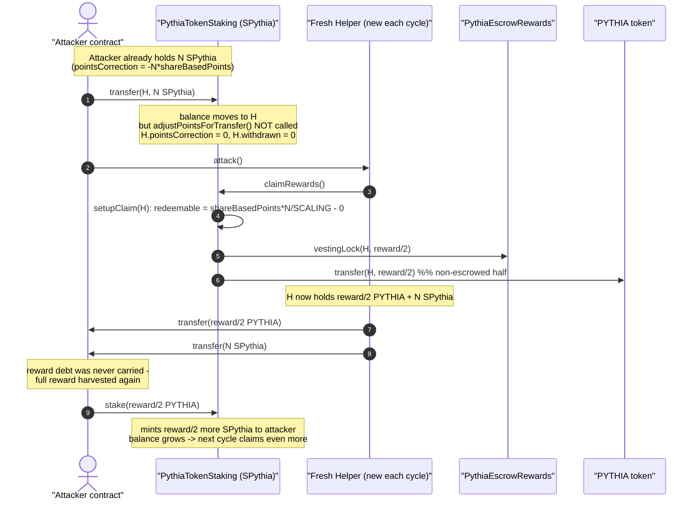
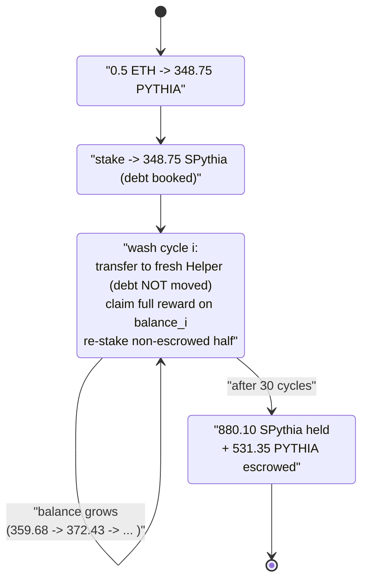
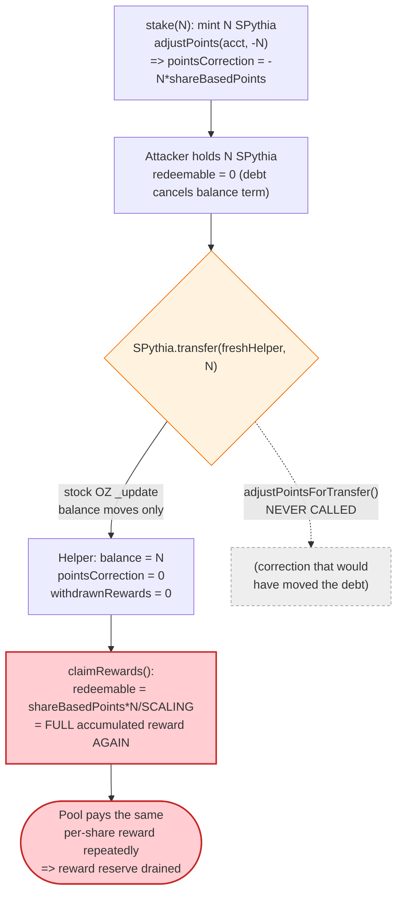

# Pythia Staking Exploit — Reward-Debt Reset via Receipt-Token Transfer

> **Vulnerability classes:** vuln/logic/state-update · vuln/logic/reward-calculation

> One-line summary: `PythiaTokenStaking` is a MasterChef-style reward pool whose receipt token (`SPythia`) is a *plain* ERC20 — transferring it moves the shares but **never moves the reward-debt accounting**, so an attacker can wash their entire stake through fresh addresses and re-claim the full accumulated reward over and over until the reward pool is drained.

> **Reproduction:** the PoC compiles & runs in an isolated Foundry project at
> [this project folder](.) (the umbrella DeFiHackLabs repo contains many unrelated PoCs that
> do not whole-compile, so this one was extracted). Full verbose trace:
> [output.txt](output.txt). Verified vulnerable sources:
> [PythiaTokenStaking.sol](sources/PythiaTokenStaking_e2910b/contracts_PythiaTokenStaking.sol)
> and [AbstractRewards.sol](sources/PythiaTokenStaking_e2910b/contracts_base_AbstractRewards.sol).

---

## Key info

| | |
|---|---|
| **Loss** | ~**21 ETH** (per PoC header). In the reproduced fork, the attacker turned a **0.5 ETH** stake (≈348.75 PYTHIA) into **880.10 SPythia** (2.52× inflation) plus 531.35 PYTHIA escrowed in throwaway vesting locks — i.e. it harvested the staking contract's entire PYTHIA reward pool, which then converts to the headline ETH loss when unstaked & sold. |
| **Vulnerable contract** | `PythiaTokenStaking` — [`0xe2910b29252F97bb6F3Cc5E66BfA0551821C7461`](https://etherscan.io/address/0xe2910b29252F97bb6F3Cc5E66BfA0551821C7461#code) |
| **Reward / escrow** | `PythiaEscrowRewards` — [`0x0EF1C026c6Ed555432a39Ae2b5D8c246e75eF75e`](https://etherscan.io/address/0x0EF1C026c6Ed555432a39Ae2b5D8c246e75eF75e#code) |
| **Reward & deposit token** | `PYTHIA` — [`0x66149ab384Cc066FB9E6bC140F1378D1015045E9`](https://etherscan.io/address/0x66149ab384Cc066FB9E6bC140F1378D1015045E9#code) |
| **Liquidity** | PYTHIA/WETH Uniswap-V2 pair `0xb0128508DfAF85D49F119D59F46E2aAC40391dcE` |
| **Attacker EOA** | [`0xd861e6f1760d014d6ee6428cf7f7d732563c74c0`](https://etherscan.io/address/0xd861e6f1760d014d6ee6428cf7f7d732563c74c0) |
| **Attack contract** | [`0x542533536e314180e1b9f00b2c046f6282eb3647`](https://etherscan.io/address/0x542533536e314180e1b9f00b2c046f6282eb3647) |
| **Attack tx** | [`0x7e19f8edb1f1666322113f15d7674593950ac94bbc25d2aff96adabdcae0a6c3`](https://etherscan.io/tx/0x7e19f8edb1f1666322113f15d7674593950ac94bbc25d2aff96adabdcae0a6c3) |
| **Chain / block / date** | Ethereum mainnet / fork at 20,667,428 (`20667429 - 1`) / Sep 3, 2024 |
| **Compiler** | Solidity ^0.8.20 (staking), test on ^0.8.15 |
| **Bug class** | Broken staking reward accounting — receipt token transferable without reward-debt (`pointsCorrection`) adjustment |
| **Reference** | https://x.com/QuillAudits_AI/status/1830976830607892649 |

---

## TL;DR

`PythiaTokenStaking` is `ERC20 + AbstractRewards`. When you `stake(amount)` it **mints** you `amount`
of the staking receipt token *SPythia* and books a "reward debt" (`pointsCorrection`) so you cannot
claim rewards that accrued before you staked. This is the textbook MasterChef / `dividend-token`
pattern.

The fatal mistake: `AbstractRewards` *ships* a helper, `adjustPointsForTransfer(from, to, shares)`
([AbstractRewards.sol:60-64](sources/PythiaTokenStaking_e2910b/contracts_base_AbstractRewards.sol#L60-L64)),
that is supposed to move the reward-debt alongside any share transfer — **but `PythiaTokenStaking`
never calls it.** It only adjusts points inside `mint`/`burn`
([PythiaTokenStaking.sol:63-71](sources/PythiaTokenStaking_e2910b/contracts_PythiaTokenStaking.sol#L63-L71)),
and it does **not** override OpenZeppelin's ERC20 `_update`. So a plain `SPythia.transfer(...)` moves
the *balance* (which drives the reward formula) while leaving the sender's negative `pointsCorrection`
behind and giving the **recipient zero reward debt**.

A fresh address that receives SPythia therefore looks, to the reward math, like it has held those
shares since genesis. `getCumulativePayouts(fresh) = shareBasedPoints * balance / SCALING_FACTOR` with
no correction term — it can immediately claim the **entire accumulated reward** on the full balance.

The attacker loops this:

1. Buy PYTHIA with 0.5 ETH, `stake` it → mint 348.75 SPythia.
2. `transfer` the SPythia to a brand-new `Helper` contract (reward debt **not** carried).
3. Helper `claimRewards()` → pulls full cumulative PYTHIA reward (21.86 PYTHIA in cycle 1).
4. Helper ships the PYTHIA reward **and** the SPythia back to the attacker.
5. Attacker `stake`s the freed PYTHIA reward → mints *more* SPythia.
6. Repeat 30× — each cycle the (re-staked, growing) balance is re-claimed in full.

After 30 cycles the attacker holds **880.10 SPythia** (2.52× the initial stake), having drained the
staking pool's PYTHIA reward reserve. No flash loan, no oracle, no price manipulation — purely an
accounting reset.

---

## Background — what Pythia staking does

`PythiaTokenStaking`
([source](sources/PythiaTokenStaking_e2910b/contracts_PythiaTokenStaking.sol)) is a single-sided
staking pool:

- You deposit `depositToken` (PYTHIA) via `stake(amount)`; it mints you `amount` of an ERC20 receipt
  token whose symbol is `SPythia` (the contract *is* that ERC20).
- Rewards are paid in `rewardToken` (also PYTHIA) and are pro-rata to your SPythia balance, using the
  classic "magnified dividend" math in `AbstractRewards`
  ([source](sources/PythiaTokenStaking_e2910b/contracts_base_AbstractRewards.sol)).
- `distributeRewards()` periodically grows a global `shareBasedPoints` accumulator
  (`shareBasedPoints += amount * SCALING_FACTOR / totalSupply`), and each user's claimable amount is
  `shareBasedPoints * balanceOf(user) / SCALING_FACTOR + pointsCorrection[user]/SCALING_FACTOR -
  withdrawnRewards[user]`.
- `claimRewards()` pays half the reward immediately (`escrowPortion` = 50% in the trace) and locks the
  other half in `PythiaEscrowRewards`.

The whole correctness of this scheme rests on one invariant:

> **Whenever SPythia shares move between addresses, the reward-debt term `pointsCorrection` must move
> with them, so that `cumulativePayouts` stays continuous.**

`AbstractRewards.adjustPointsForTransfer` exists precisely to maintain it. It is simply never wired up.

---

## The vulnerable code

### 1. Points are only adjusted on mint/burn — never on transfer

```solidity
// PythiaTokenStaking.sol
function mint(address account, uint256 amount) internal {
    super._update(address(0), account, amount);
    adjustPoints(account, -int256(amount));   // book reward debt on mint
}

function burn(address account, uint256 amount) internal {
    super._update(account, address(0), amount);
    adjustPoints(account, int256(amount));     // release reward debt on burn
}

function stake(uint256 amount) external nonReentrant {
    require(amount > 0, "Amount must be greater than 0");
    depositToken.safeTransferFrom(_msgSender(), address(this), amount);
    mint(_msgSender(), amount);                // <- mint receipt + adjustPoints
    emit Deposited(amount, _msgSender());
}
```
[PythiaTokenStaking.sol:63-81](sources/PythiaTokenStaking_e2910b/contracts_PythiaTokenStaking.sol#L63-L81)

There is **no `_update` / `_transfer` override** in `PythiaTokenStaking`. A normal
`SPythia.transfer()` runs OpenZeppelin's stock `_update`, moving only the balance. `adjustPoints` /
`adjustPointsForTransfer` are *not* on that path.

### 2. The reward formula reads the *current* balance with no carried correction

```solidity
// AbstractRewards.sol
function getCumulativePayouts(address _account) public view override returns (uint256) {
    return ((shareBasedPoints * getAccountBalance(_account)).toInt256()
            + pointsCorrection[_account]).toUint256() / SCALING_FACTOR;
}

function getRedeemablePayouts(address _account) public view override returns (uint256) {
    return getCumulativePayouts(_account) - withdrawnRewards[_account];
}

function setupClaim(address _account) internal returns (uint256) {
    uint256 redeemableShare = getRedeemablePayouts(_account);
    if (redeemableShare > 0) {
        withdrawnRewards[_account] = withdrawnRewards[_account] + redeemableShare;
        emit RewardsWithdrawn(_account, redeemableShare);
    }
    return redeemableShare;
}
```
[AbstractRewards.sol:37-58](sources/PythiaTokenStaking_e2910b/contracts_base_AbstractRewards.sol#L37-L58)

### 3. The unused fix that *should* have been called on every transfer

```solidity
// AbstractRewards.sol — defined, exported in the interface... and never called
function adjustPointsForTransfer(address _from, address _to, uint256 _shares) internal {
    int256 magnitudeCorrection = (shareBasedPoints * _shares).toInt256();
    pointsCorrection[_from] = pointsCorrection[_from] + magnitudeCorrection;
    pointsCorrection[_to]   = pointsCorrection[_to]   - magnitudeCorrection;
}
```
[AbstractRewards.sol:60-64](sources/PythiaTokenStaking_e2910b/contracts_base_AbstractRewards.sol#L60-L64)

For a fresh recipient, `withdrawnRewards = 0` and `pointsCorrection = 0`, so:

```
redeemable(fresh) = shareBasedPoints * balance / SCALING_FACTOR
```

i.e. the **full** accumulated reward on the whole balance — exactly what was already paid to the
original staker, claimable a second time by the new holder.

---

## Root cause — why it was possible

The receipt token (`SPythia`) is freely transferable, but it is **also the unit of reward
accounting**. The two facts together require that every transfer rebalances `pointsCorrection`.
`PythiaTokenStaking` updates reward debt on `mint`/`burn` only and forgets to hook the ERC20
transfer path:

1. **No `_update` override.** OZ ERC20's `_update` (the single chokepoint through which `transfer`,
   `transferFrom`, mint, and burn all flow) is left stock. The protocol *did* route mint/burn through
   its own `mint`/`burn` wrappers but never centralized the points logic in `_update`, so plain
   transfers slip past it.
2. **The corrective helper is dead code.** `adjustPointsForTransfer` is written, is in the
   `IAbstractRewards`-adjacent base, and is exactly the right fix — but no call site exists.
3. **Reward debt does not travel with shares.** A sender keeps their (now-meaningless) negative
   `pointsCorrection`; a fresh recipient starts at `pointsCorrection = 0` and
   `withdrawnRewards = 0`, so the receiving address reads as *fully un-claimed since genesis*.
4. **Claims are per-address and stateless across addresses.** `withdrawnRewards` is keyed by address,
   so spawning a new address resets the "already withdrawn" ledger to zero. There is no global
   per-share claim ceiling.

Result: shares can be "washed" through unlimited fresh addresses, each of which re-claims the same
accumulated reward. The pool pays out far more than it ever distributed, draining its PYTHIA reward
balance.

Note the attacker triggered **zero** new `RewardsDistributed` events — it harvested the
*already-accumulated* `shareBasedPoints` (the contract held ~3,201 PYTHIA in reward/escrow reserves at
the fork block), repeatedly.

---

## Preconditions

- The staking pool has a non-zero accumulated `shareBasedPoints` (i.e. some rewards were distributed
  to existing stakers before the attack). True at the fork block.
- The pool holds enough `rewardToken` (PYTHIA) to satisfy the inflated claims (the prize being
  stolen).
- The attacker can acquire a starting stake of PYTHIA (here, 0.5 ETH bought ≈348.75 PYTHIA via the
  Uniswap-V2 pair).
- No flash loan / no special role needed — the staking, transfer, and claim functions are all
  permissionless.

---

## Attack walkthrough (with on-chain numbers from the trace)

All figures are taken directly from the events / `storage changes` in [output.txt](output.txt).
`escrowPortion = 50%`, so each gross claim is split evenly into a *paid-out* half (re-staked) and an
*escrowed* half (locked in `PythiaEscrowRewards`, owned by the throwaway Helper, recoverable later).

| # | Step | Concrete value (from trace) |
|---|------|------------------------------|
| 0 | Seed: `swapExactETHForTokensSupportingFeeOnTransferTokens` 0.5 ETH → PYTHIA. Pair reserves `35,227 PYTHIA / 48.85 WETH` | received **348.749489853950455333 PYTHIA** |
| 1 | `stake(348.75)` → mint 348.75 SPythia; books `pointsCorrection = -348.75 * shareBasedPoints` | attacker SPythia = 348.75 |
| 2 | Loop iter 1 — `transfer(Helper#1, 348.75 SPythia)` (reward debt **not** moved) | Helper#1 SPythia = 348.75, `pointsCorrection = 0` |
| 3 | Helper#1 `claimRewards()` → `RewardsWithdrawn 21.857434…`; pays 10.928 PYTHIA, escrows 10.928 PYTHIA (lock id 66) | gross **21.857 PYTHIA**, paid-out **10.928** |
| 4 | Helper#1 ships 10.928 PYTHIA **and** 348.75 SPythia back to attacker | attacker PYTHIA = 10.928, SPythia = 348.75 |
| 5 | Attacker `stake(10.928)` → mint 10.928 more SPythia | attacker SPythia = **359.678** |
| 6 | Loop iter 2 — fresh Helper#2 claims on 359.678 SPythia | gross **22.542 PYTHIA**, paid-out 11.271 |
| … | … 30 iterations total, each with a fresh Helper and a larger balance … | per-cycle gross rises 21.86 → 53.48 PYTHIA |
| 30 | Final `stake` then `transfer(attacker EOA, 880.095670488019990059 SPythia)` | attacker SPythia = **880.0957** |

Totals across the 30 cycles:

- **Gross rewards harvested:** 1,062.69 PYTHIA
- **Paid-out (re-staked) half:** 531.35 PYTHIA
- **Escrowed half (in Helper-owned vesting locks):** 531.35 PYTHIA
- **Initial stake:** 348.75 PYTHIA  →  **Final SPythia:** 880.10 = `348.75 + 531.35` (re-staked), a
  **2.52×** inflation of the receipt position from a single legitimate deposit.

The 880.10 SPythia is fully redeemable for PYTHIA via `unstake()` (1:1, minus any withdraw fee),
and the 531.35 escrowed PYTHIA vests out later — together these constitute the drained reward pool
that converts to the headline ~21 ETH loss when sold back through the pair.

### Profit / loss accounting

| Flow | Amount |
|---|---:|
| Attacker outlay | 0.5 ETH (≈ 348.75 PYTHIA staked) |
| SPythia held at end | 880.0957 SPythia (≡ ~880.10 PYTHIA claim on the pool) |
| Escrowed PYTHIA (Helper vesting locks) | 531.35 PYTHIA |
| **Receipt-token inflation** | **2.52×** the initial stake, from accounting alone |
| Net effect on protocol | Staking pool's PYTHIA reward reserve drained; honest stakers' rewards stolen (≈ 21 ETH realized) |

---

## Diagrams

### Sequence of one wash cycle (repeated 30×)



### Receipt-position growth over the 30 cycles



### Why the reset works — reward-debt is left behind



---

## Remediation

1. **Centralize all share movement in `_update` and adjust reward debt there.** Override OZ ERC20's
   `_update(from, to, value)` and, for non-mint/non-burn transfers, call `adjustPointsForTransfer(from,
   to, value)` so the reward-debt travels with the shares. This is the single fix that closes the bug:

   ```solidity
   function _update(address from, address to, uint256 value) internal override {
       super._update(from, to, value);
       if (from != address(0) && to != address(0)) {
           adjustPointsForTransfer(from, to, value); // currently dead code
       }
   }
   // and remove the ad-hoc super._update + adjustPoints from mint()/burn(),
   // letting _update + a mint/burn branch handle points uniformly.
   ```

2. **Make the receipt token non-transferable** if transferability is not a product requirement. A
   soulbound / non-transferable staking position eliminates the entire class (you can only `stake` /
   `unstake`, and points are always adjusted by `mint`/`burn`).

3. **Enforce a per-share global claim ceiling.** Track cumulative rewards distributed per share and
   reject any claim that would let total paid-out exceed total distributed; address-scoped
   `withdrawnRewards` alone cannot detect the wash because each new address starts fresh.

4. **Delete or wire up dead accounting helpers.** A defined-but-uncalled `adjustPointsForTransfer` is a
   red flag in review; either it is on the transfer path or it should not exist.

5. **Add an invariant test:** for any sequence of stake/transfer/claim, `sum(rewardsPaid) <=
   sum(rewardsDistributed)`. A simple stateful fuzz of `stake -> transfer -> claim` would have caught
   this immediately.

---

## How to reproduce

```bash
_shared/run_poc.sh 2024-09-Pythia_exp -vvvvv
```

- RPC: an **Ethereum mainnet archive** endpoint is required (the fork block 20,667,428 is from
  Sep 2024). `foundry.toml` uses an Infura archive endpoint.
- The PoC measures the attacker's `SPythia` balance (the receipt token) before/after, which is the
  cleanest single number that demonstrates the accounting inflation.
- Result: `[PASS] testExploit()` with the attacker going from **0 → 880.0957 SPythia** off a 0.5 ETH
  stake.

Expected tail:

```
  Attacker Before exploit SPythia Balance: 0.000000000000000000
  Attacker After exploit SPythia Balance: 880.095670488019990059

Suite result: ok. 1 passed; 0 failed; 0 skipped; finished in 118.68s (...)
Ran 1 test suite ...: 1 tests passed, 0 failed, 0 skipped (1 total tests)
```

---

*Vulnerable source verified on Etherscan and downloaded under
[sources/](sources/). PoC: [test/Pythia_exp.sol](test/Pythia_exp.sol).*
