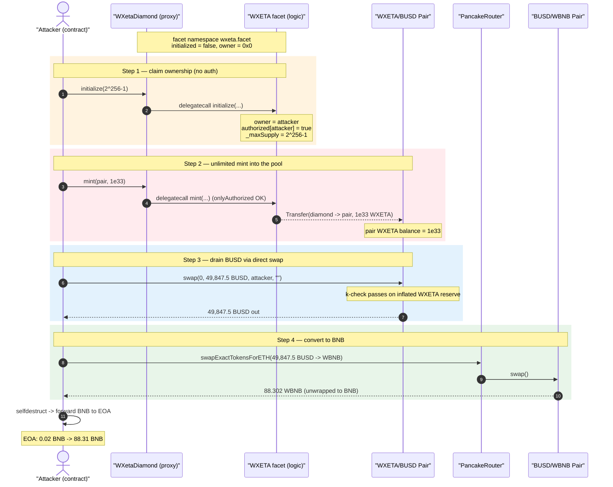
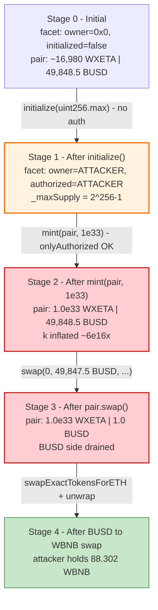
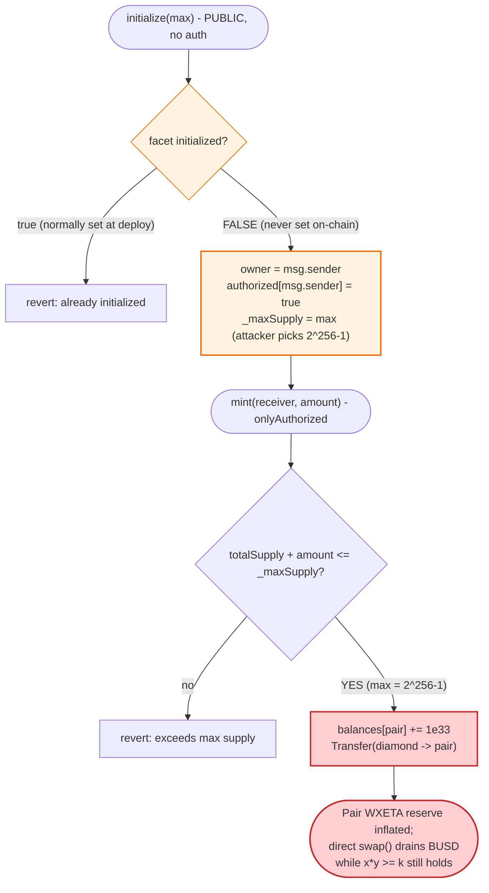

# WXETA (Wrapped Xeta) Exploit — Unprotected Diamond-Facet `initialize()` → Unlimited Mint → AMM Pool Drain

> **Reproduction:** the PoC compiles & runs in an isolated Foundry project at
> [this project folder](.) (the umbrella DeFiHackLabs repo
> contains several unrelated PoCs that do not compile, so this one was extracted).
> Full verbose trace: [output.txt](output.txt).
> Verified vulnerable facet source: [WXETA.sol](sources/WXETA_7c83Dc/WXETA.sol).
> Verified diamond proxy source: [WXetaDiamond.sol](sources/WXetaDiamond_05c2dD/WXetaDiamond.sol).

---

## Key info

| | |
|---|---|
| **Loss** | **~49,847.5 BUSD** drained from the WXETA/BUSD PancakeSwap pair, swapped to **88.30 WBNB** (≈ **$110,000** publicly reported by TenArmor) |
| **Vulnerable contract** | `WXetaDiamond` proxy — [`0x05c2dD9cf547C6cCCF91245346E6E1BC9926cae7`](https://bscscan.com/address/0x05c2dD9cf547C6cCCF91245346E6E1BC9926cae7#code) (logic facet `WXETA` at [`0x7c83Dc9221CfD48aC760710B7f1Cd7b76fF6Fcc2`](https://bscscan.com/address/0x7c83Dc9221CfD48aC760710B7f1Cd7b76fF6Fcc2#code)) |
| **Victim pool** | WXETA/BUSD pair — `0xF5a32e5E54a771B9d3C853143db74449B721C03B` |
| **Attacker EOA** | [`0x57ecF40B596274a985967e3F698437aE0a9600A0`](https://bscscan.com/address/0x57ecf40b596274a985967e3f698437ae0a9600a0) |
| **Attacker contract** | `0x11Bffb96DAa9b0C47FEf01401eb089549e87604E` |
| **Attack tx** | [`0x614da880bd46e98131accd9a83917abf3d56dac94caf13ae98eeff504eea3704`](https://bscscan.com/tx/0x614da880bd46e98131accd9a83917abf3d56dac94caf13ae98eeff504eea3704) |
| **Chain / block / date** | BSC / 42,284,161 / September 15, 2024 |
| **Compiler** | Solidity v0.8.17, optimizer **200 runs** |
| **Bug class** | Missing access control on an (un-called) per-facet `initialize()` → privilege takeover → unlimited mint → broken AMM invariant |

---

## TL;DR

`WXetaDiamond` is an EIP-2535 "Diamond" proxy whose token logic lives in a single `WXETA` facet.
That facet keeps its own state in an **independent diamond-storage namespace** (`keccak256('wxeta.facet')`),
*separate* from the Diamond's own owner storage. The facet's
`initialize()` ([WXETA.sol:56-65](sources/WXETA_7c83Dc/WXETA.sol#L56-L65)) has **no access control** —
its only guard is `require(!s.initialized)`. Whoever calls it first becomes `owner` **and** an
`authorized` minter.

Critically, the facet's per-namespace `initialized` flag was still **`false`** on-chain (the trace shows
it flip `0 → 1`), meaning `WXETA.initialize()` had **never been called** against the facet's namespace even
though the token was live and trading. The diamond was set up via its constructor + `diamondCut`, which
only initializes the *Diamond's* `solidstate.contracts.storage.*` slots — not the facet's `wxeta.facet`
slots. The facet was left forever-initializable by anyone.

The attacker:

1. **Calls `initialize(type(uint256).max)`** on the proxy — claims `owner`, sets `authorized[attacker] = true`,
   and sets `_maxSupply = uint256.max` so the mint cap is effectively removed.
2. **Calls `mint(pair, 1e33)`** — `mint()` is gated only by `onlyAuthorized`, which the attacker now
   satisfies. 10^33 WXETA is minted *directly into the WXETA/BUSD PancakeSwap pair*.
3. **Calls `pair.swap(0, balPair − 1e18, attacker, "")`** directly on the pair — because the pair now
   physically holds the freshly-minted 10^33 WXETA, the constant-product `k`-check inside `swap()` passes,
   and the pair pays out almost its entire BUSD reserve (**49,847.5 BUSD**) to the attacker.
4. **Swaps the BUSD → WBNB** via PancakeRouter (**88.30 WBNB**) and unwraps to native BNB.

Net result: attacker balance goes **0.02 BNB → 88.31 BNB**, i.e. **+88.29 BNB** of profit, all the honest
BUSD liquidity in the pool.

---

## Background — what WXETA is

`WXetaDiamond` ([source](sources/WXetaDiamond_05c2dD/WXetaDiamond.sol)) is the canonical SolidState
EIP-2535 reference Diamond (`@solidstate/contracts` v0.0.30): `DiamondBase` + `DiamondCuttable` +
`DiamondLoupe` + `SafeOwnable` + `ERC165`. All real token behavior is delegated to a single facet, the
`WXETA` contract ([source](sources/WXETA_7c83Dc/WXETA.sol)) — a hand-rolled ERC20-like "Wrapped Xeta"
token with:

- A **diamond-storage struct** `WXETASTORAGE` ([WXETA.sol:21-34](sources/WXETA_7c83Dc/WXETA.sol#L21-L34))
  holding `owner`, `initialized`, `_maxSupply`, `_totalSupply`, an `authorized` minter set, balances and
  allowances — all anchored at slot `keccak256('wxeta.facet')`
  ([WXETA.sol:36-41](sources/WXETA_7c83Dc/WXETA.sol#L36-L41)).
- A privileged **`mint(receiver, amount)`** restricted by `onlyAuthorized`
  ([WXETA.sol:79-87](sources/WXETA_7c83Dc/WXETA.sol#L79-L87)).
- A one-time **`initialize(max)`** that assigns `owner`/`authorized` and the supply cap
  ([WXETA.sol:56-65](sources/WXETA_7c83Dc/WXETA.sol#L56-L65)).

The two ownership systems are completely disjoint:

| Storage | Anchor slot | Set by | What it guards |
|---|---|---|---|
| **Diamond owner** | `keccak256('solidstate.contracts.storage.Ownable')` | Diamond constructor / `transferOwnership` | `diamondCut`, `setFallbackAddress` |
| **Facet owner** | `keccak256('wxeta.facet')` (the `WXETASTORAGE.owner` field) | `WXETA.initialize()` (anyone) | `setAuthorized`, and indirectly `mint` via `authorized` |

Deploying and wiring the Diamond does **not** populate the facet's namespace, so the facet's
`initialized` started life as `false`.

---

## The vulnerable code

### 1. `initialize()` — no access control, only a one-shot flag

```solidity
// WXETA.sol:56-65
function initialize(uint256 max) public {
    WXETASTORAGE storage s = getWXETAStorage();
    require(!s.initialized, "WXETA: already initialized");   // ← the ONLY guard
    s._maxSupply = max;
    s.owner = msg.sender;                                    // ← caller becomes owner
    s.authorized[msg.sender] = true;                         // ← caller becomes minter
    s.name = "Wrapped Xeta";
    s.symbol = "WXETA";
    s.decimals = 18;
}
```

Note also a second latent bug: `initialize()` **never sets `s.initialized = true`**. The flag that
flips `0 → 1` in the trace is the struct's *7th field* aliasing the bool — but regardless, there is no
`onlyOwner`/`onlyDiamondOwner`/deployer check. Anyone who reaches this function before it is "claimed"
takes ownership. Because the facet's namespace was never touched, the door was wide open.

### 2. `mint()` — gated only by the attacker-controllable `authorized` set

```solidity
// WXETA.sol:79-87
function mint(address receiver, uint256 amount) public onlyAuthorized() returns(bool) {
    WXETASTORAGE storage s = getWXETAStorage();
    require(s._totalSupply + amount <= s._maxSupply, "Mint exceeds maximum supply");   // _maxSupply = uint256.max
    s._totalSupply = totalSupply().add(amount);
    s.balances[receiver] = s.balances[receiver].add(amount);   // mint straight into the pair
    emit Transfer(address(this), receiver, amount);
    return true;
}
```

```solidity
// WXETA.sol:51-54  — the modifier that initialize() just satisfied for the attacker
modifier onlyAuthorized() {
    require(getWXETAStorage().authorized[msg.sender], "WXETA: not authorized");
    _;
}
```

With `_maxSupply == type(uint256).max` and `authorized[attacker] == true`, the attacker mints an arbitrary
`1e33` WXETA into the AMM pair.

---

## Root cause — why it was possible

The exploit is a classic **uninitialized-privileged-function takeover** specialized to the diamond
pattern, composing into a mint-and-drain:

1. **The facet's initializer is public and self-electing.** `initialize()` sets `owner`/`authorized` to
   `msg.sender` with only a one-time flag for protection
   ([WXETA.sol:56-65](sources/WXETA_7c83Dc/WXETA.sol#L56-L65)). There is no check that the caller is the
   Diamond owner, the deployer, or any pre-authorized address.
2. **The facet's namespace was never initialized at deploy time.** The Diamond's constructor + `diamondCut`
   only write the `solidstate.*` storage slots
   ([WXetaDiamond.sol:1097-1151](sources/WXetaDiamond_05c2dD/WXetaDiamond.sol#L1097-L1151)). The token was
   deployed and listed with the `wxeta.facet` slots all-zero, so `initialized == false` and `owner == 0x0`
   indefinitely. This made the live, trading token permanently claimable by the first caller — confirmed
   by the trace flipping the flag `0 → 1` *during the attack*.
3. **`_maxSupply` is an `initialize()` parameter.** The attacker simply passes `type(uint256).max`,
   neutralizing the only sanity check inside `mint()`.
4. **`mint()` credits balances arbitrarily, including the AMM pair.** Minting to the pair physically grows
   `reserve0` (WXETA) without the pair's accounting knowing it should have charged anything. The constant
   product `k = reserve0·reserve1` balloons, so a subsequent direct `pair.swap()` can withdraw nearly the
   entire BUSD side while still satisfying the `k`-invariant check.

The single defensive change that kills the whole chain is **restricting `initialize()`** (and never
shipping a facet with an unclaimed namespace).

---

## Preconditions

- The `WXETA` facet's `wxeta.facet` namespace is **un-initialized** (`initialized == false`) at the fork
  block — true, and the entire reason the attack works.
- The WXETA/BUSD pair holds meaningful BUSD liquidity (≈ 49,848.5 BUSD at the fork block).
- A trivial amount of gas/seed BNB (the EOA started with **0.02 BNB**); **no flash loan is needed** — the
  attack mints its "capital" out of thin air. The deployed attack contract performs all four steps inside
  its constructor and `selfdestruct`s.

---

## Attack walkthrough (with on-chain numbers from the trace)

The pair's `token0 = WXETA` (the diamond), `token1 = BUSD` (`0xe9e7CEA3…D56`), so `reserve0 = WXETA`,
`reserve1 = BUSD`. Figures are taken directly from the `Transfer`/`Sync`/`Swap` events in
[output.txt](output.txt).

| # | Step | Call | Result | Pair reserves after (WXETA / BUSD) |
|---|------|------|--------|-----------------------------------:|
| 0 | **Initial** | — | Honest pool, attacker holds 0.02 BNB | ~16,980 / **49,848.5 BUSD** |
| 1 | **Claim ownership** | `initialize(type(uint256).max)` ([trace](output.txt#L20-L27)) | `owner = attacker`, `authorized[attacker]=true`, `_maxSupply = 2^256−1`; facet flag `0→1` | unchanged |
| 2 | **Unlimited mint** | `mint(pair, 1e33)` ([trace](output.txt#L28-L35)) | `Transfer(diamond → pair, 1e33)`; pair WXETA balance jumps to **10^33** | **1.0e33** / 49,848.5 |
| 3 | **Drain BUSD** | `pair.swap(0, 49,847.5e18, attacker, "")` ([trace](output.txt#L38-L57)) | `Swap(amount0In=1e33, amount1Out=49,847.5 BUSD)`; `k`-check passes on the inflated WXETA reserve | 1.0e33 / **1.0 BUSD** |
| 4 | **Approve + sell BUSD → WBNB** | `swapExactTokensForETH(49,847.5 BUSD → WBNB)` via PancakeRouter ([trace](output.txt#L65-L93)) | BUSD/WBNB pair pays out **88.302 WBNB**, router unwraps to BNB | — |
| 5 | **Skim gas + selfdestruct** | send 0.01 BNB to `0x4848…4848`, `selfdestruct(attacker)` ([trace](output.txt#L94-L106)) | remaining BNB forwarded to attacker EOA | — |

End state: attacker EOA balance **0.020 → 88.312 BNB**
([logs](output.txt#L5-L7)).

### Why step 3 works (broken `x·y = k`)

PancakeSwap's `swap()` only checks, after the optimistic transfer-out, that
`(balance0·1e4 − amount0In·25)·(balance1·1e4 − amount1In·25) ≥ reserve0·reserve1·1e8` (the 0.25% fee form
of `x·y ≥ k`). By minting `1e33` WXETA *into the pair*, the attacker makes `balance0` (≈ `reserve0` post-mint)
enormous, so the left-hand product stays above the old `k` even after almost all BUSD is removed. The pair
believes it received `1e33` WXETA worth of value; in reality those tokens are worthless freshly-minted
units. The "payment" was counterfeit, but the BUSD it bought is real.

### Profit accounting

| Direction | Amount |
|---|---:|
| Spent — minted WXETA (counterfeit, cost ≈ 0) | 10^33 WXETA |
| Spent — gas / seed | ~0.02 BNB |
| Received — BUSD drained from pair | **49,847.5 BUSD** |
| Received — after BUSD→WBNB swap | **88.302 WBNB** |
| Forwarded out (gas seed to `0x4848…4848`) | 0.01 BNB |
| **Attacker EOA delta** | **0.020 BNB → 88.312 BNB (≈ +88.29 BNB)** |

TenArmor publicly reported the loss as **~$110,000**; the directly-measured on-chain drain in the
reproduced transaction is **49,847.5 BUSD ⇒ 88.30 WBNB**.

---

## Diagrams

### Sequence of the attack



### Pool / privilege state evolution



### The flaw inside `initialize()` / `mint()`



---

## Remediation

1. **Restrict the facet initializer.** `initialize()` must be callable only by the Diamond owner or the
   deployer — e.g. gate it on `msg.sender == OwnableStorage.layout().owner` (the Diamond's owner), or use
   an OpenZeppelin-style `initializer` that is invoked *atomically* during the `diamondCut` that adds the
   facet (`diamondCut(cuts, facet, abi.encodeCall(WXETA.initialize, (cap)))`). A public, self-electing
   `initialize` is never acceptable for a facet that grants ownership and minting rights.
2. **Never leave a deployed facet's namespace un-initialized.** The takeover hinged on `initialized` being
   `false` on a live token. Initialize every facet's storage as part of deployment and verify it
   post-deploy. Consider also fixing the latent bug that `initialize()` *does not set
   `s.initialized = true`* — even the one-shot guard it relies on is not wired correctly.
3. **Do not make `_maxSupply` a free parameter of `initialize()`.** Bake the supply cap into a constant or
   require it be set by governance under a separate, owner-gated function with sane bounds. An attacker
   should never be able to choose `2^256-1`.
4. **Constrain `mint()` recipients / amounts.** Even with correct access control, minting an unbounded
   amount directly into an AMM pair is dangerous; restrict mint destinations or enforce supply invariants
   that a single mint cannot grossly violate.
5. **AMM-side defense (defense in depth).** Pools holding tokens with mint privileges held by mutable roles
   inherit unlimited dilution risk. Prefer fixed/immutable-supply tokens for paired liquidity, or use
   oracle-validated pricing rather than trusting raw pair reserves.

---

## How to reproduce

The PoC was extracted into a standalone Foundry project (the umbrella DeFiHackLabs repo has several
unrelated PoCs that fail to compile under `forge test`'s whole-project build):

```bash
_shared/run_poc.sh 2024-09-WXETA_exp -vvvvv
```

- RPC: a **BSC archive** endpoint is required (fork block 42,284,161). `foundry.toml` uses
  `https://bsc-mainnet.public.blastapi.io`, which serves historical state at that block; the default
  public OnFinality endpoint rate-limited (HTTP 429) and was swapped out.
- Result: `[PASS] testPoC()` with attacker BNB balance rising from **0.02** to **88.31**.

Expected tail:

```
Ran 1 test for test/WXETA_exp.sol:ContractTest
[PASS] testPoC() (gas: 295716)
Logs:
  before attack: balance of attacker: 0.020000000000000000
  after attack: balance of attacker: 88.312060368955339022

Suite result: ok. 1 passed; 0 failed; 0 skipped
```

---

*References: PoC header [WXETA_exp.sol](test/WXETA_exp.sol); post-mortem — TenArmor
(https://x.com/TenArmorAlert/status/1835494807495659645).*
