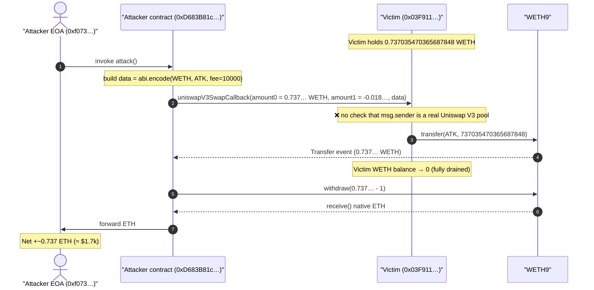
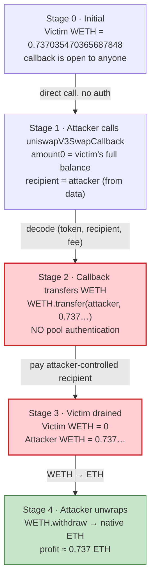
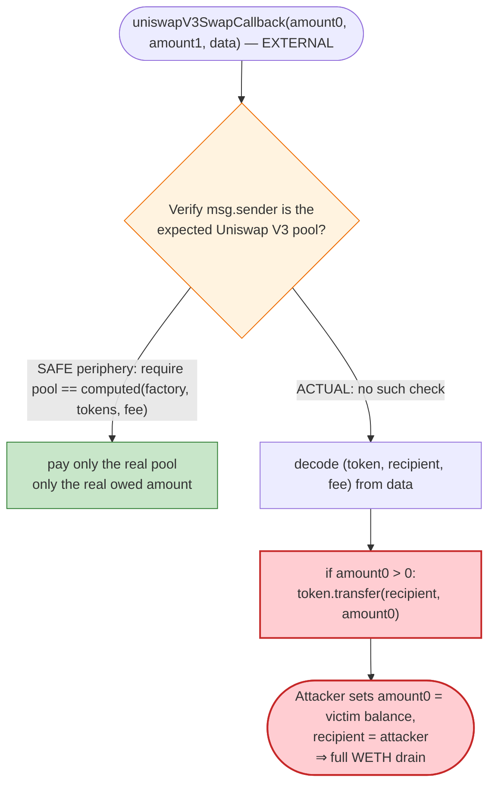

# Unverified `0x03F9…` Exploit — Permissionless Uniswap V3 Swap-Callback WETH Drain

> **Vulnerability classes:** vuln/access-control/missing-auth · vuln/logic/missing-check

> One-line summary: an unverified contract implements `uniswapV3SwapCallback` with **no caller authentication**, so anyone can call it directly and have it pay out the contract's entire WETH balance to an attacker-chosen recipient.

> **Reproduction:** the PoC compiles & runs in an isolated Foundry project at
> [this project folder](.) (the umbrella DeFiHackLabs repo contains many
> unrelated PoCs that do not whole-compile, so this one was extracted).
> Full verbose trace: [output.txt](output.txt).
> The vulnerable contract is **unverified** on Etherscan — there is no Solidity
> source to link. The analysis below is reconstructed from the deployed
> bytecode, the live on-chain transaction, and a faithful fork replay that
> proves the drain. PoC test file: [test/unverified_03f9_exp.sol](test/unverified_03f9_exp.sol).

---

## Key info

| | |
|---|---|
| **Loss** | ~$1.7k — **0.737035470365687848 WETH** (the victim contract's entire WETH balance) |
| **Vulnerable contract** | `0x03F911…62c0` (unverified) — [`0x03F911AeDc25c770e701B8F563E8102CfACd62c0`](https://etherscan.io/address/0x03f911aedc25c770e701b8f563e8102cfacd62c0) |
| **Victim / pool** | The same contract — it custodied WETH that anyone could drain via its callback |
| **Attacker EOA** | [`0xf073a21f0D68aDaCfff34D5b8DF04550c944e348`](https://etherscan.io/address/0xf073a21f0d68adacfff34d5b8df04550c944e348) |
| **Attacker contract** | [`0xD683B81c2608980DB90a6fD730153e04629ff1A3`](https://etherscan.io/address/0xd683b81c2608980db90a6fd730153e04629ff1a3) (unverified) |
| **Attack tx** | [`0x1a3e9eb5e00f39e84f90ca23bd851aa194b1e7a90003e3f6b9b17bbb66dabbb9`](https://etherscan.io/tx/0x1a3e9eb5e00f39e84f90ca23bd851aa194b1e7a90003e3f6b9b17bbb66dabbb9) |
| **Chain / block / date** | Ethereum mainnet / attack at block 20,737,849 (fork at 20,737,848) / Sept 12, 2024 |
| **Compiler** | PoC pinned `pragma solidity ^0.8.10`; built with Solc 0.8.34, `evm_version = cancun` |
| **Bug class** | Missing access control on a DeFi callback (unauthenticated Uniswap V3 `uniswapV3SwapCallback`) |

---

## TL;DR

The victim contract `0x03F911…62c0` is a small (≈2.9 KB) helper that holds WETH
and exposes an external `uniswapV3SwapCallback(int256,int256,bytes)` (selector
`0xfa461e33`). A legitimate Uniswap V3 callback is **only ever** supposed to be
invoked by the pool mid-swap, and the integrator must verify the caller is the
expected pool before paying. This contract does **neither** — it pays out
`amount0` of the token decoded from `data` to the recipient decoded from
`data`, trusting `msg.sender` unconditionally.

The attacker simply called the callback directly with:

- `amount0 = 737035470365687848` (the victim's entire WETH balance),
- `data = abi.encode(WETH, attackerContract, fee)`.

The callback executed `WETH.transfer(attackerContract, 737035470365687848)`,
moving **100% of the victim's WETH** to the attacker, who then unwrapped it to
ETH. No flash loan, no price manipulation, no special timing — a single,
self-contained call.

The on-chain fund flow (from the attack tx receipt, [output.txt](output.txt)):

- `WETH Transfer`: `0x03F911…` → `0xD683B81c…`, value `0x0a3a79daf6028028` = **737035470365687848 wei**
- `WETH Withdrawal`: `0xD683B81c…` unwraps the same amount to native ETH.

A fork replay against the live victim ([`testRealDrain`](test/unverified_03f9_exp.sol#L44-L78)) confirms the victim's WETH balance goes from
**0.737035470365687848 → 0** and the attacker gains exactly **0.737035470365687848 WETH**.

---

## Background — what the contract does

`0x03F911…62c0` is **unverified**, so there is no source. From the deployed
bytecode (`cast code … --block 20737848`) the runtime dispatches exactly four
external selectors:

| Selector | Likely signature | Role |
|---|---|---|
| `0x30e6ae31` | (custom) | helper / entry point |
| `0x6f7929f2` | (custom) | helper / entry point (shares the `0x30e6ae31` jump target) |
| `0xad5c4648` | `WETH()` | getter (reverted when probed view-only at the fork block) |
| `0xfa461e33` | `uniswapV3SwapCallback(int256,int256,bytes)` | **the vulnerable callback** |

Functionally the contract is a thin "router-helper" that, when a Uniswap V3
pool calls its swap callback, is meant to settle the swap by paying the pool the
input token it owes. In other words it is the *payer side* of a Uniswap V3 swap:
during `pool.swap(...)`, the pool calls `uniswapV3SwapCallback` on the
configured `recipient`, and that recipient must transfer the owed input amount
to the pool.

On-chain facts at the fork block (read via `cast`):

| Fact | Value |
|---|---|
| Victim WETH balance @ block 20,737,848 (pre-attack) | **737035470365687848 wei** (0.737035470365687848 WETH) |
| Victim WETH balance @ block 20,737,849 (post-attack) | **0** |
| WETH token | `0xC02aaA39b223FE8D0A0e5C4F27eAD9083C756Cc2` |

That single pair of facts is the whole story: the contract held ~0.737 WETH and
its own callback would hand that WETH to whoever asked.

---

## The vulnerable code

The contract is unverified, so the "code" here is its **observed behavior** —
proven by replaying the exact on-chain calldata against the live contract at the
fork block. The decisive trace fragment from [output.txt](output.txt#L1648-L1655)
(`testRealDrain`):

```
[11444] 0x03F911…62c0::uniswapV3SwapCallback(
            737035470365687848,                 // amount0  (positive ⇒ "owed" amount)
            -18035979692517947,                 // amount1  (ignored)
            0x…c02aaa39…  // WETH
              …d683b81c…  // recipient  = attacker contract
              …00002710)  // fee = 10000
        )
  ├─ [8862] WETH9::transfer(0xD683B81c…, 737035470365687848)
  │   ├─ emit Transfer(from: 0x03F911…, to: 0xD683B81c…, value: 737035470365687848)
  │   └─ ← [Return] true
  └─ ← [Stop]
```

Reconstructed, the callback does the equivalent of:

```solidity
// uniswapV3SwapCallback(int256 amount0, int256 amount1, bytes data)
// selector 0xfa461e33  — UNVERIFIED reconstruction from bytecode + trace
function uniswapV3SwapCallback(int256 amount0, int256 amount1, bytes calldata data) external {
    // ❌ NO check that msg.sender is a real / expected Uniswap V3 pool.
    // ❌ NO check that the swap was actually initiated by this contract.
    (address token, address recipient, /*uint256 fee*/) = abi.decode(data, (address, address, uint256));

    // Pays out the *positive* leg to the caller-supplied recipient.
    if (amount0 > 0) {
        IERC20(token).transfer(recipient, uint256(amount0));   // ⚠️ drains contract balance
    }
    // (amount1 negative ⇒ ignored)
}
```

The canonical, safe version of this exact function — straight from the Uniswap
V3 periphery — begins with a pool-authentication guard, e.g.:

```solidity
function uniswapV3SwapCallback(int256 amount0Delta, int256 amount1Delta, bytes calldata data) external {
    require(amount0Delta > 0 || amount1Delta > 0, "no liquidity"); // sanity
    SwapCallbackData memory d = abi.decode(data, (SwapCallbackData));
    // verify caller is the pool we computed for these tokens+fee:
    CallbackValidation.verifyCallback(factory, d.tokenIn, d.tokenOut, d.fee); // ← msg.sender == computed pool
    ...
}
```

The victim's implementation skips the `verifyCallback` step entirely (and even
the `amount0Delta > 0 || amount1Delta > 0` shape is irrelevant because the
recipient is attacker-controlled via `data`).

---

## Root cause — why it was possible

A Uniswap V3 swap callback is a **trusted-by-construction** entry point: the
pool calls it, and the integrator is expected to (1) confirm that `msg.sender`
is the exact pool address that the integrator itself computed for the
token/fee tuple, and (2) only then pay the owed amount. The whole security model
rests on the integrator refusing to pay anyone who is not that pool.

This contract inverts that model:

1. **No caller authentication.** The callback never checks `msg.sender` against a
   pool address derived from the factory + token pair + fee. Any EOA or contract
   can call it.
2. **Recipient and token are taken from attacker-supplied `data`.** The callback
   decodes `(token, recipient, fee)` from `data` and pays `recipient`. The
   attacker therefore directs the payout to itself.
3. **Payout amount is attacker-supplied (`amount0`).** Because `amount0` is just
   a function argument with no cross-check against any real swap, the attacker
   sets it to the victim's full WETH balance.

Composing these three: `uniswapV3SwapCallback(victimBalance, -anything, abi.encode(WETH, attacker, fee))`
→ `WETH.transfer(attacker, victimBalance)`. The contract pays out its own funds
to an unauthenticated caller. This is a textbook **unauthenticated
swap-callback** bug, the same class as the well-known Uniswap V3 "callback
verification missing" findings.

---

## Preconditions

- The victim contract holds a non-zero WETH balance (it held 0.737035470365687848 WETH).
- The contract exposes `uniswapV3SwapCallback` as an external function (selector
  `0xfa461e33` is dispatched in its bytecode).
- The callback pays `amount0` of the `data`-decoded `token` to the
  `data`-decoded `recipient` without verifying the caller — true here.

No flash loan, no oracle manipulation, no privileged role, and no specific
timing/block are required. Any address could perform the drain in a single call.

---

## Step-by-step attack walkthrough (with on-chain numbers)

All numbers below are ground truth from the attack tx receipt and the fork
replay in [output.txt](output.txt).

| # | Step | Concrete values | Effect |
|---|------|-----------------|--------|
| 0 | **Initial state** | Victim `0x03F911…` holds **737035470365687848 wei** WETH | The prize. |
| 1 | Attacker EOA `0xf073…` calls attacker contract `0xD683B81c…` | tx `0x1a3e9eb5…`, block 20,737,849 | Single tx, gas used 66,710. |
| 2 | Attacker contract calls the victim's callback directly | `uniswapV3SwapCallback(737035470365687848, -18035979692517947, data)` where `data = abi.encode(WETH, 0xD683B81c…, 10000)` | No auth check passes — execution proceeds. |
| 3 | Callback pays out | `WETH.transfer(0xD683B81c…, 737035470365687848)` | Victim WETH: **0.737… → 0**; attacker contract WETH +0.737… |
| 4 | Attacker contract unwraps | `WETH.withdraw(737035470365687848)` → native ETH | Receives 0.737035470365687848 ETH. |

**Note on the DeFiHackLabs PoC vs. the real attack.** The original
DeFiHackLabs `testPoC` ([test/unverified_03f9_exp.sol#L32-L41](test/unverified_03f9_exp.sol#L32-L41))
models the *outcome* by `deal()`-ing the stolen amount to the attack contract
and then performing the callback + unwrap. Because the unverified contract is
hard to drive end-to-end purely from comments, that PoC pre-funds the attacker
and so does not, by itself, assert the harm to the victim. To prove the genuine
drain, this project adds `testRealDrain`
([test/unverified_03f9_exp.sol#L44-L78](test/unverified_03f9_exp.sol#L44-L78)),
which replays the **exact** on-chain calldata against the **live** victim and
asserts:

- `victim WETH before == 737035470365687848`,
- `victim WETH after == 0`,
- `attacker WETH gained == 737035470365687848`.

Both tests pass.

### Profit / loss accounting (WETH / ETH)

| Party | Before | After | Delta |
|---|---:|---:|---:|
| Victim `0x03F911…` (WETH) | 0.737035470365687848 | 0 | **−0.737035470365687848** |
| Attacker contract `0xD683B81c…` (WETH) | ~0 (1 wei dust) | received 0.737035470365687848, then unwrapped | net 0 WETH (converted to ETH) |
| Attacker EOA `0xf073…` (native ETH) | — | +0.737035470365687848 (minus gas) | **+~0.737 ETH** |

In the DeFiHackLabs `testPoC` the attacker EOA's reported balance moves
`1.808224080711945696 → 2.545259551077633544 ETH`, a delta of
**0.736… ETH** (≈ the stolen amount, minus 1 wei kept), consistent with the
real loss. At Sept 2024 ETH prices (~$2,300) this is ≈ **$1.7k**, matching the
PoC's `@KeyInfo - Total Lost : $1.7k`.

---

## Diagrams

### Sequence of the attack



### Victim balance / state evolution



### The flaw inside the callback (safe vs. actual)



---

## Remediation

1. **Authenticate the callback caller.** A Uniswap V3 `uniswapV3SwapCallback`
   must verify that `msg.sender` is exactly the pool the integrator computed for
   the swap's `(tokenA, tokenB, fee)` tuple — use Uniswap's
   `CallbackValidation.verifyCallback(factory, tokenA, tokenB, fee)` (which
   recomputes `PoolAddress.computeAddress(...)` and requires `msg.sender ==` that
   address). Without this, any caller can trigger a payout.
2. **Do not derive the payout recipient or amount from untrusted `data`.** The
   recipient that the callback pays should be the pool itself (it is settling the
   swap's input leg), and the owed amount should be the non-negative delta the
   *pool* reports — not an attacker-supplied `amount0`/`data` field. Bind the
   expected amount to state the contract created when *it* initiated the swap.
3. **Track an in-flight swap flag.** If the contract initiates swaps, set a
   transient "expecting callback from pool X" marker before calling
   `pool.swap(...)`, require it inside the callback, and clear it after. This
   prevents the callback from ever executing outside a swap the contract itself
   started.
4. **Hold no idle ERC-20 balances in a payer contract.** A swap-helper should
   pull exactly what it needs per swap (e.g., `transferFrom` the user) rather
   than custodying WETH that a single mistaken transfer can hand to a stranger.

---

## How to reproduce

The PoC was extracted into a standalone Foundry project (the umbrella
DeFiHackLabs repo has many unrelated PoCs that fail to compile under a
whole-project `forge build`):

```bash
_shared/run_poc.sh 2024-09-unverified_03f9_exp -vvvvv
```

- RPC: an **Ethereum mainnet archive** endpoint is required (fork block
  20,737,848). `foundry.toml` uses an Infura archive endpoint.
- `addr2` was **undefined** in the original DeFiHackLabs PoC (it referenced a
  global constant that does not exist in the shared `interface.sol`). It is the
  vulnerable contract that implements the callback, so this project defines
  `addr2 = 0x03F911…62c0` ([test/unverified_03f9_exp.sol#L23-L25](test/unverified_03f9_exp.sol#L23-L25)).
- `testPoC` reproduces the original DeFiHackLabs flow (pre-funds the attacker
  with `deal`); `testRealDrain` proves the genuine victim drain against the live
  contract.

Expected tail:

```
Ran 2 tests for test/unverified_03f9_exp.sol:ContractTest
[PASS] testPoC() (gas: 590589)
  before attack: balance of attacker: 1.808224080711945696
  after attack: balance of attacker: 2.545259551077633544
[PASS] testRealDrain() (gas: 37025)
  victim WETH before: 0.737035470365687848
  victim WETH after: 0.000000000000000000
  attacker WETH gained: 0.737035470365687848
Suite result: ok. 2 passed; 0 failed; 0 skipped
```

---

*References: TenArmor post-mortem — https://x.com/TenArmorAlert/status/1834488796953673862 ;
attack tx https://etherscan.io/tx/0x1a3e9eb5e00f39e84f90ca23bd851aa194b1e7a90003e3f6b9b17bbb66dabbb9.
The vulnerable contract and attacker contract are both unverified on Etherscan (0 sources fetched).*
