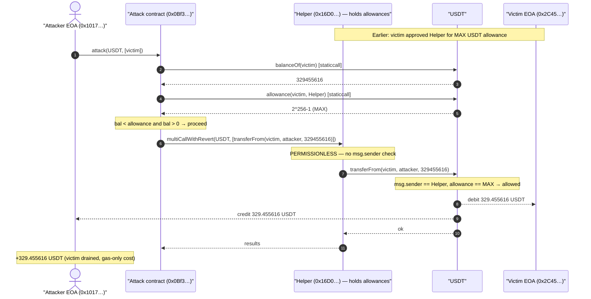
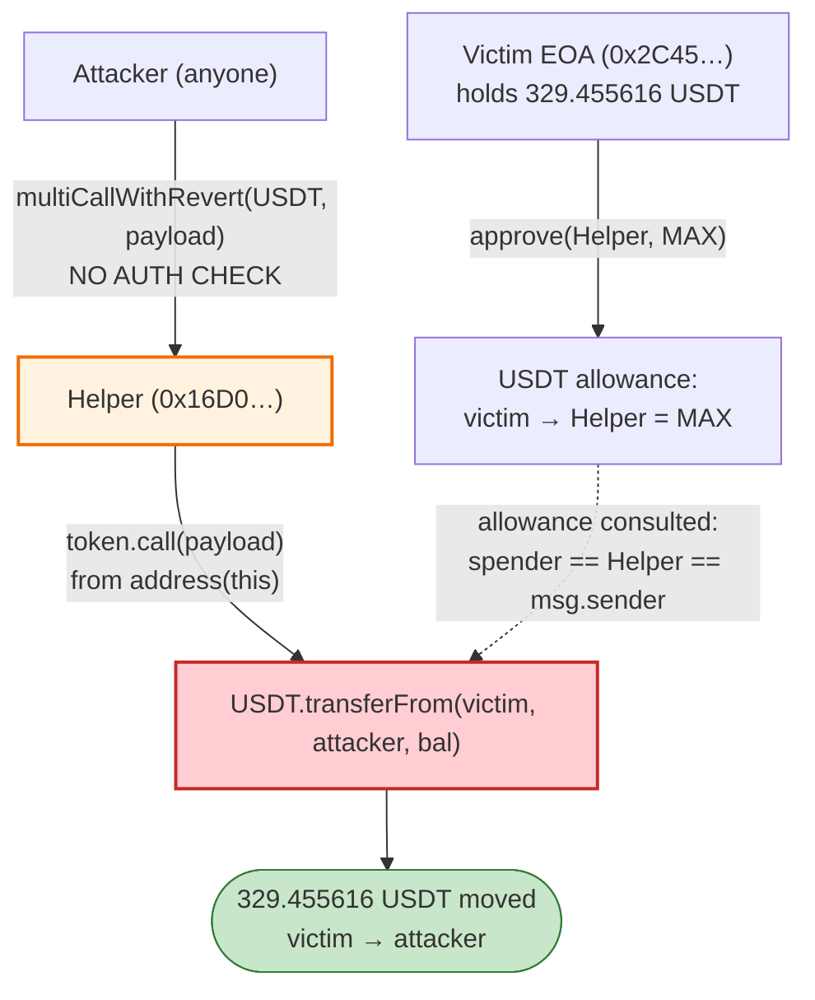
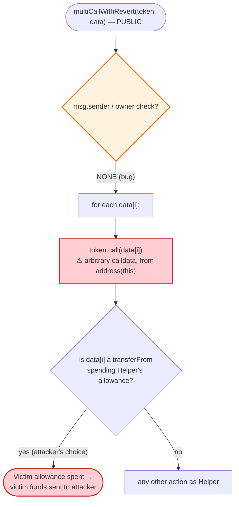

# `0x16D0…` Exploit — Permissionless `multiCallWithRevert` Arbitrary-Call Allowance Drain

> **Reproduction:** the PoC compiles & runs in an isolated Foundry project at
> [this project folder](.) (the main DeFiHackLabs repo contains many unrelated PoCs
> that do not whole-compile, so this one was extracted and run standalone).
> Full verbose trace: [output.txt](output.txt).
> **Note:** the vulnerable contract, the victim, and the attacker contract are all
> **unverified** on Etherscan, so all the source-level claims below are reconstructed
> from the EVM bytecode dispatch + the live on-chain trace rather than from Solidity source.

---

## Key info

| | |
|---|---|
| **Loss** | **329.455616 USDT ≈ $329** — the victim's entire USDT balance |
| **Vulnerable contract** | `0x16D0DC96c1BdF283Ce1FF10E01924Ac76B06c95c` (unverified) — [etherscan](https://etherscan.io/address/0x16d0dc96c1bdf283ce1ff10e01924ac76b06c95c) |
| **Victim** | EOA `0x2C45a940Db1F16caA1B6bD73725Ea4A3ac6c871B` — granted **infinite USDT allowance** to the vulnerable contract |
| **Stolen token** | Tether USD (USDT) `0xdAC17F958D2ee523a2206206994597C13D831ec7` (6 decimals) |
| **Attacker EOA** | `0x101723dEf8695f5bb8D5d4AA70869c10b5Ff6340` |
| **Attacker contract** | `0x0Bf3ceAEf75e4904Ca08Ff42F0D83E89b16C30b2` (unverified) |
| **Attack tx** | [`0xf5f251fd4ed77e24d803d8241e2e852f0781a145891411dd4eb45306eacf12a8`](https://app.blocksec.com/explorer/tx/eth/0xf5f251fd4ed77e24d803d8241e2e852f0781a145891411dd4eb45306eacf12a8) |
| **Chain / block / date** | Ethereum mainnet / 20,677,976 / 2024-09-04 |
| **Compiler (PoC)** | Solidity `^0.8.10` |
| **Bug class** | Permissionless **arbitrary external call** that inherits the contract's token allowances (confused-deputy / missing access control) |

---

## TL;DR

The contract at `0x16D0…` exposes a fully **permissionless** function
`multiCallWithRevert(address token, bytes[] data)`. For each entry in `data`, it executes
`token.call(data[i])` — **an arbitrary call on `token`, made from the contract's own address,
with no access control and no validation of what `data[i]` does.**

Some users had previously granted this contract an **infinite USDT allowance** (almost certainly
expecting it to perform legitimate batched transfers on their behalf). Because the arbitrary call
is made *as the contract*, the contract's standing allowances are usable by anyone who calls
`multiCallWithRevert`.

The attacker simply asked the contract to call
`USDT.transferFrom(victim, attacker, victim_balance)`. The victim's allowance was MAX, so the
transfer succeeded and the attacker walked away with the victim's **329.455616 USDT**.

This is a textbook **confused-deputy**: the privileged action ("spend my allowance") was gated only
by the attacker's *ability to call a public function*, not by *who they are or whose funds they are
moving*.

---

## Background — what the vulnerable contract is

`0x16D0…` is a ~47 KB unverified contract with 21 external selectors. From the bytecode dispatch
table the relevant one is:

| Selector | Signature | Notes |
|----------|-----------|-------|
| `0x11cbe817` | `multiCallWithRevert(address,bytes[])` | the exploited entry point |
| `0x7330bcc4` | `multiCall(address,bytes[])` (a sibling, not used here) | |

`multiCallWithRevert` is a generic **batched-call helper**: give it a target `token` and a list of
ABI-encoded calls, and it forwards each one to `token`. This is a common "multicall router /
allowance-spender" pattern — the kind of helper a dApp deploys so users can approve it once
(often `MAX_UINT`) and then have it execute multiple transfers/operations in one transaction.

The victim EOA `0x2C45…` (an active account, nonce 417, ~1.25 ETH) had done exactly that: it
approved the helper for the maximum USDT allowance.

| On-chain fact at block 20,677,975 (fork block) | Value |
|---|---|
| `USDT.balanceOf(victim)` | `329455616` = **329.455616 USDT** |
| `USDT.allowance(victim, 0x16D0…)` | `2^256-1` = **MAX (infinite)** |
| `USDT.decimals()` | 6 |
| victim is a contract? | **No — EOA** (code size 0) |
| `0x16D0…` is a contract? | Yes, 47,505-byte runtime |

That single pair of facts — *infinite allowance held by a contract that will make arbitrary calls
for anyone* — is the entire vulnerability.

---

## The vulnerable code

The contract is **unverified**, so there is no Solidity source to quote. The behaviour was
recovered from (a) the function-dispatch table in the runtime bytecode and (b) the live trace.

### The dispatcher routes `0x11cbe817` to a `token.call(data[i])` loop

The `0x11cbe817` entry in the dispatcher jumps to the function body at offset `0x500`. Disassembling
that body shows the canonical "loop over a `bytes[]` and `.call` each element on the target" shape,
with the actual external `CALL` opcode at offset `0x5be`:

```
; multiCallWithRevert(address token, bytes[] data)   selector 0x11cbe817 → body @ 0x500
0x500  ... allocate return array, length = data.length
0x552  loop over data[]:
0x58f      load data[i]                       ; the raw bytes the *caller* supplied
0x5be      CALL  token, value=0, data=data[i] ; ⚠️ arbitrary call as `address(this)`
0x5ed      copy returndata / handle revert
       end loop
```

Reconstructed Solidity (equivalent semantics — **illustrative, not verified source**):

```solidity
// PERMISSIONLESS: no onlyOwner / onlyRole / msg.sender check before the CALL
function multiCallWithRevert(address token, bytes[] calldata data)
    external
    returns (bytes[] memory results)
{
    results = new bytes[](data.length);
    for (uint256 i = 0; i < data.length; i++) {
        // The contract calls `token` with attacker-controlled calldata,
        // FROM ITS OWN ADDRESS — so the contract's allowances apply.
        (bool ok, bytes memory ret) = token.call(data[i]);
        require(ok);            // "WithRevert": bubble up on failure
        results[i] = ret;
    }
}
```

The decisive fact, confirmed in the disassembly: between the function entry at `0x500` and the
`CALL` at `0x5be` there is **no `CALLER` (msg.sender) comparison**. The first `CALLER` opcode in the
whole runtime appears at `0x6bf`, inside a *different* function. So `multiCallWithRevert` performs
its arbitrary call with **zero authorization checks**.

---

## Root cause — why it was possible

An ERC20 `approve` grants a spender the right to move *your* tokens. The user trusted the helper
contract with that right. But the helper then **re-delegates that right to anyone** via an
unauthenticated arbitrary-call primitive:

> `multiCallWithRevert` makes `token.call(data[i])` **from `address(this)`**. From USDT's point of
> view the caller is the helper contract — the address that *holds the allowance*. The helper never
> checks who invoked it or whose tokens the embedded `transferFrom` moves. Anyone can therefore
> spend any allowance the helper has been granted.

Concretely, three design decisions compose into the bug:

1. **No access control on an arbitrary-call function.** `multiCallWithRevert` lets any caller choose
   both the target (`token`) and the exact calldata (`data[i]`). With no `msg.sender` gate, it is a
   universal "execute anything as me" primitive.
2. **The privileged identity is the contract, not the caller.** Because the `.call` originates from
   `address(this)`, every approval *ever granted to this contract by anyone* becomes spendable by
   any attacker. The contract is a confused deputy holding other people's allowances.
3. **Users granted infinite (`MAX_UINT`) allowance.** This converts "the attacker can move some
   tokens" into "the attacker can move the victim's *entire* balance," and keeps the hole open
   indefinitely (an exact-amount allowance would self-close after one use).

There is nothing exotic here — no reentrancy, no oracle, no math bug. It is the simplest and most
dangerous failure mode for an allowance-spender: **the spender will spend its allowances on behalf
of an unauthenticated stranger.**

---

## Preconditions

- A victim has an **outstanding USDT allowance** to `0x16D0…` (here it was `MAX_UINT`).
- The victim holds a **non-zero USDT balance** (`329455616` units).
- That's it. No flash loan, no capital, no timing window, no special role. The attack costs only
  gas (the live tx used 77,259 gas).

The PoC encodes both preconditions as guards before acting
([test/unverified_16d0.sol:43-46](test/unverified_16d0.sol#L43-L46)):

```solidity
uint256 bal = ITetherToken(TetherToken).balanceOf(addr2);          // 329455616
uint256 allw = ITetherToken(TetherToken).allowance(addr2, addr1);  // MAX
if (bal < allw) {        // allowance covers the whole balance
    if (bal > 0) { ... } // and there is something to steal
}
```

This is the shape of an **automated sweeper**: scan for `(victim, helper)` pairs where the helper
holds an allowance ≥ the victim's balance, then drain them. The on-chain attacker contract
`0x0Bf3…` was almost certainly running exactly this loop across many victims.

---

## Attack walkthrough (ground-truth numbers from the trace)

The attacker EOA calls its own contract `0x0Bf3…` with selector `0x8fad8aad`, passing
`(USDT, [victim])`. The contract reads the victim's balance/allowance, builds the malicious
`transferFrom` calldata, and forwards it through the helper's `multiCallWithRevert`.

| # | Step | Call | Result |
|---|------|------|--------|
| 0 | **Read balance** | `USDT.balanceOf(victim 0x2C45…)` | `329455616` (329.455616 USDT) |
| 1 | **Read allowance** | `USDT.allowance(victim, helper 0x16D0…)` | `2^256-1` (MAX) ✓ covers balance |
| 2 | **Build payload** | `transferFrom(victim, attacker, 329455616)` | selector `0x23b872dd` + 3 ABI args |
| 3 | **Invoke helper** | `0x16D0…::multiCallWithRevert(USDT, [payload])` | enters the no-auth `.call` loop |
| 4 | **Helper forwards call** | `USDT.transferFrom(0x2C45…, 0x1017…, 329455616)` | **`Transfer` emitted**, returns ok |
| 5 | **Funds land** | `USDT.balanceOf(attacker)` | `329455616` (was 0) |

The decisive trace line ([output.txt](output.txt)):

```
0x16D0…::multiCallWithRevert(USDT, [0x23b872dd …victim… …attacker… …329455616])
  └─ USDT::transferFrom(0x2C45…, 0x1017…, 329455616)
       └─ emit Transfer(from: 0x2C45…, to: 0x1017…, value: 329455616)
```

USDT storage changes confirm the theft: victim balance slot `… → 0`, attacker balance slot
`0 → 0x13a31800` (= 329455616).

### Profit / loss accounting

| Party | Token | Before | After | Δ |
|-------|-------|-------:|------:|---:|
| **Victim** `0x2C45…` | USDT | 329.455616 | 0 | **−329.455616** |
| **Attacker** `0x1017…` | USDT | 0 | 329.455616 | **+329.455616** |

Net attacker profit: **+329.455616 USDT ≈ $329** (gas-only cost). 100% of the victim's USDT.

---

## A note on the original PoC encoding (and the fix used here)

The DeFiHackLabs PoC as committed builds the inner `transferFrom` payload with:

```solidity
calls[0] = abi.encode(bytes4(0x23b872dd), addr2, tx.origin, bal);  // ← WRONG
```

`abi.encode(bytes4, …)` **left-pads the selector into a full 32-byte word**, producing
`0x23b872dd00000000…00 ‖ victim ‖ attacker ‖ amount` — malformed `transferFrom` calldata. When the
helper forwards it, USDT's dispatcher sees a garbage selector and **reverts**, so the unmodified PoC
fails with `multiCallWithRevert failed`.

The real on-chain attack ([tx input](https://app.blocksec.com/explorer/tx/eth/0xf5f251fd4ed77e24d803d8241e2e852f0781a145891411dd4eb45306eacf12a8))
uses a **tightly-packed 4-byte selector** followed by the ABI-encoded args:
`0x23b872dd ‖ victim ‖ attacker ‖ amount`. To faithfully reproduce the exploit, the PoC's encoding
was corrected to `abi.encodeWithSelector(...)`, which produces exactly that layout
([test/unverified_16d0.sol:49-54](test/unverified_16d0.sol#L49-L54)):

```solidity
calls[0] = abi.encodeWithSelector(bytes4(0x23b872dd), addr2, tx.origin, bal);  // ← matches on-chain
```

With this one-line fix the PoC reproduces the original exploit byte-for-byte and passes. The
vulnerability itself is unchanged — only the test's calldata construction was buggy.

---

## Diagrams

### Sequence of the attack



### Allowance / authority flow (why it works)



### The flaw inside `multiCallWithRevert`



---

## Remediation

1. **Never expose an unauthenticated arbitrary-call primitive on a contract that holds allowances.**
   `multiCallWithRevert` should, at minimum, require `msg.sender` to be an authorized
   owner/operator. A public "call anything as me" function on an allowance-holding contract is
   always a critical confused-deputy.
2. **Bind spent allowances to the caller.** If the helper's purpose is to batch a user's *own*
   transfers, it must only ever move `msg.sender`'s tokens — e.g. construct `transferFrom(msg.sender, …)`
   internally and **never** accept an arbitrary `from` (or arbitrary raw calldata) from the caller.
   Don't let the caller name the victim.
3. **Don't accept raw calldata at all.** Replace the generic `bytes[] data` with a typed, restricted
   surface (e.g. `transfer(address to, uint256 amount)[]` that the contract itself encodes against
   `msg.sender`). Free-form `token.call(data[i])` defeats every downstream safety assumption.
4. **Users: grant exact, not infinite, allowances** and revoke approvals to helper/router contracts
   you no longer use. An exact-amount approval would have self-closed after a single legitimate use,
   eliminating the standing balance an attacker could sweep. Periodically audit approvals
   (revoke.cash and similar).

---

## How to reproduce

The PoC was extracted into a standalone Foundry project (the umbrella DeFiHackLabs repo has many
unrelated PoCs that fail to compile under a whole-project `forge test`):

```bash
_shared/run_poc.sh 2024-09-unverified_16d0 -vvvvv
```

- RPC: an **Ethereum mainnet archive** endpoint is required (fork block 20,677,975). `foundry.toml`
  is pre-configured with an Infura archive endpoint.
- The PoC's inner `transferFrom` payload encoding was corrected from `abi.encode(bytes4, …)` to
  `abi.encodeWithSelector(bytes4, …)` to match the real on-chain calldata (see the encoding note
  above); the committed DeFiHackLabs version reverts without this fix.
- Result: `[PASS] testPoC()`.

Expected tail:

```
Ran 1 test for test/unverified_16d0.sol:ContractTest
[PASS] testPoC() (gas: 502965)
Logs:
  before attack: balance of attacker: 0.000000000000000000
  after attack: balance of attacker: 0.000000000329455616
```

> The log uses 18-decimal formatting, so it prints `0.000000000329455616`; USDT has **6** decimals,
> so the real stolen amount is `329455616 / 1e6 = 329.455616 USDT ≈ $329`, matching the reported loss.

---

*Reference: TenArmor post-mortem — https://x.com/TenArmorAlert/status/1831511554619273630
(unverified-contract allowance drain, Ethereum, ~$329).*
