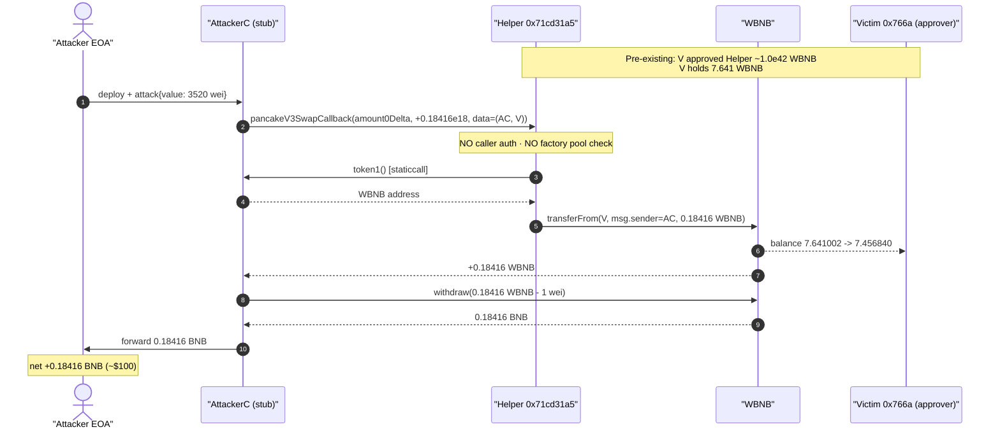
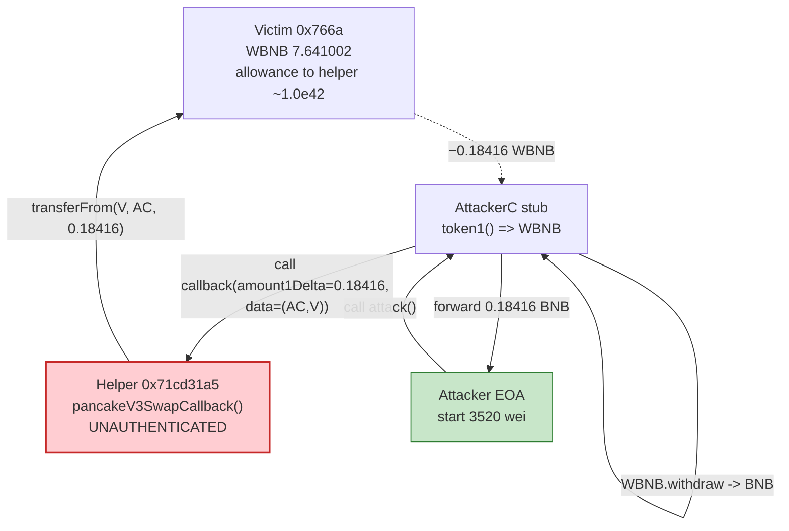
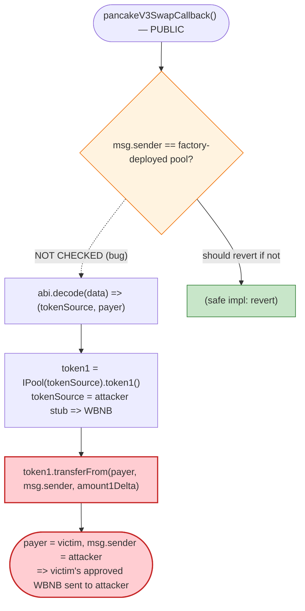

# 0x71cd Swap-Helper Exploit — Permissionless `pancakeV3SwapCallback` Drains a Pre-Approved Victim

> **Reproduction:** the PoC compiles & runs in an isolated Foundry project at
> [this project folder](.) (the umbrella DeFiHackLabs repo does not whole-compile, so this
> PoC was extracted). Full verbose trace: [output.txt](output.txt).
> Both on-chain contracts are **source-unverified** on BscScan; the vulnerable callback logic
> below is reconstructed from the live execution trace + on-chain `cast` probes, and the raw
> runtime bytecode of the helper is saved at
> [sources/addr2_71cd31_bytecode.txt](sources/addr2_71cd31_bytecode.txt).

---

## Key info

| | |
|---|---|
| **Loss** | ~$100 — **0.18416 WBNB** pulled from the victim's pre-approved WBNB allowance |
| **"Vulnerable contract" (PoC header)** | `0x766a0936FF0aD045d39871846194eDBd5DF63a58` — actually the **victim EOA** ([bscscan](https://bscscan.com/address/0x766a0936ff0ad045d39871846194edbd5df63a58)) |
| **Actually-exploited contract** | swap helper `0x71cd31a564FF30ba61d7167a02Babc1484034E84` ([bscscan](https://bscscan.com/address/0x71cd31a564ff30ba61d7167a02babc1484034e84)) — UNVERIFIED |
| **Token drained** | WBNB `0xbb4CdB9CBd36B01bD1cBaEBF2De08d9173bc095c` |
| **Helper owner** | `0xa1626d9A9233807cD661872BfAc7F2D0A8A51E1a` (EOA) |
| **Attacker EOA** | `0xbA35D089adDaC99A8e7BcD1a25712B1702623Ae3` |
| **Attacker contract** | `0xD310431E98412Eb9a7c66808478bF08fdea81E2a` (re-deployed in PoC at `0x8D4A30Fa...`) |
| **Attack tx** | [`0x73d459ad3c926f5247a2018197d13b2a0acbc1fc46e1e54525c210a46130a56b`](https://app.blocksec.com/explorer/tx/bsc/0x73d459ad3c926f5247a2018197d13b2a0acbc1fc46e1e54525c210a46130a56b) |
| **Chain / block / date** | BSC / 42,357,807 / 2024-09-18 09:26 UTC |
| **Compiler (PoC)** | Solidity `^0.8.10` (test pinned), EVM `cancun` |
| **Bug class** | Missing caller authentication in an AMM swap callback (un-trusted-target / spoofable-pool callback) → theft of a pre-approved token allowance |
| **Post-mortem** | [TenArmor (X)](https://x.com/TenArmorAlert/status/1836339028616188321) |

---

## TL;DR

The contract at `0x71cd31a5…` is a small **swap-helper / router-like contract** that exposes a public
`pancakeV3SwapCallback(int256 amount0Delta, int256 amount1Delta, bytes data)` entry point
(selector `0x23a69e75`, present in its runtime bytecode). A genuine Uniswap/Pancake V3 callback is
*only ever called by a real pool*, and a correct implementation **verifies that `msg.sender` is a
pool the factory deployed** before paying. This helper does **neither** — it:

1. decodes `data` into an attacker-controlled `(tokenSource, payer)` pair,
2. reads `token1()` from `tokenSource` (the *attacker's own contract*, which simply returns WBNB), and
3. executes `WBNB.transferFrom(payer, msg.sender, amount1Delta)` — pulling WBNB **from `payer` to
   whoever called the callback**.

Because the callback is **permissionless** and never checks the caller against a known pool, any EOA
can call it directly, pass `payer =` a wallet that has approved the helper, set `amount1Delta` to any
value within that wallet's allowance, and have the WBNB sent to themselves.

The victim EOA `0x766a0936…` had granted the helper a **near-infinite WBNB allowance
(~1.0e42)** and held **7.641 WBNB**. The attacker called the callback once with
`amount1Delta = 0.18416 WBNB`, received that WBNB into their contract, unwrapped it to BNB, and forwarded
it to their EOA. Net theft in this PoC: **0.18416 WBNB (~$100)** — and the attacker could have pulled
the victim's *entire* 7.641-WBNB balance the same way.

---

## Background — what the helper does

`0x71cd31a564FF30ba61d7167a02Babc1484034E84` is an **unverified** ~11.4 KB contract whose runtime
bytecode dispatches the following selectors (from
[sources/addr2_71cd31_bytecode.txt](sources/addr2_71cd31_bytecode.txt)):

| Selector | Signature | Role |
|---|---|---|
| `0x23a69e75` | `pancakeV3SwapCallback(int256,int256,bytes)` | ⚠️ the exploited callback |
| `0xfa461e33` | `uniswapV3SwapCallback(int256,int256,bytes)` | sibling callback (same hazard class) |
| `0x8da5cb5b` | `owner()` | returns `0xa1626d9A…` |
| `0x0418f1bc` / `0x2c8958f6` / `0x4541d9ae` | (helper entrypoints, e.g. swap routing) | — |

It is **not a real V3 pool** — `token0()`, `token1()`, `fee()` and `factory()` all revert when called
on it (verified with `cast` at the fork block). It is a *consumer* of V3 pools that, for convenience,
hosts the pool-payment callback and **pulls funds from a `payer` it is told to trust via `data`**. In
the normal happy path, the helper would call `pool.swap(...)`, the real pool would call this callback
back, and the callback would pay the pool out of the user's allowance. The fatal omission is that the
callback does not bind that payment to a swap *it* initiated, nor to a pool the factory deployed.

The role of `0x766a0936…` (called the "vulnerable contract" in the PoC header) is, in reality, just
the **victim**: an EOA (`code == 0x`) that had previously approved WBNB to the helper. The genuine bug
lives entirely in the helper's callback.

---

## The vulnerable code

Both contracts are unverified, so there is no Solidity to link line-by-line. The callback's behaviour
is reconstructed exactly from the trace and matches the canonical *broken* swap-callback pattern:

```solidity
// 0x71cd31a5… — pancakeV3SwapCallback (selector 0x23a69e75), reconstructed from trace
function pancakeV3SwapCallback(
    int256 amount0Delta,
    int256 amount1Delta,
    bytes calldata data
) external {                                   // ⚠️ NO access control
    // ⚠️ NO check that msg.sender is a pool deployed by the V3 factory
    (address tokenSource, address payer) = abi.decode(data, (address, address));

    IERC20 token1 = IERC20(IPool(tokenSource).token1());   // tokenSource is attacker-controlled → WBNB
    // pay the (positive) owed amount to the caller, OUT OF payer's pre-approved allowance
    token1.transferFrom(payer, msg.sender, uint256(amount1Delta));   // ⚠️ funds → msg.sender
}
```

What the live trace proves (from [output.txt](output.txt)):

```text
AttackerC::attack{value: 3520}()
  └─ 0x71cd31a5…::pancakeV3SwapCallback(-247659866327218868765, 184162062600000000, 0x…8d4a30fa…766a0936…)
       ├─ AttackerC::token1() [staticcall] ⇒ 0xbb4C…095c  (WBNB)     // tokenSource = AttackerC
       └─ WBNB::transferFrom(0x766a0936…, AttackerC, 184162062600000000)
            └─ emit Transfer(from: 0x766a0936…, to: AttackerC, value: 0.18416e18)
```

- `data = (0x8d4a30fa… , 0x766a0936…)` — word 0 = the **attacker contract** (whose `token1()` returns
  WBNB), word 1 = the **victim** `0x766a0936…` used as `payer`.
- `amount1Delta = 51156128500000 * 3600 = 184162062600000000` (0.18416 WBNB) — the attacker freely
  chose this.
- The helper does `transferFrom(victim, attacker, 0.18416 WBNB)` with **no verification whatsoever**.

The PoC then unwraps and exfiltrates ([test/unverified_766a_exp.sol:58-65](test/unverified_766a_exp.sol#L58)):

```solidity
function withdraw() public {
    uint bal = IERC20(wbnb).balanceOf(address(this));      // 0.18416 WBNB
    if (bal > 1) {
        wbnb.call(abi.encodeWithSignature("withdraw(uint256)", bal - 1)); // WBNB → BNB
    }
}
```

---

## Root cause — why it was possible

A Uniswap/Pancake **V3 swap callback is a privileged trust boundary**: the pool transfers the output
*first* and then calls `…SwapCallback`, trusting the integrator to pay the owed input *inside* the
callback. The canonical safe implementation (see Uniswap's `PancakeV3Pool` / periphery) does:

```solidity
// what a correct callback MUST do
CallbackValidation.verifyCallback(factory, decoded.poolKey);   // msg.sender == real pool ?
// only then pay decoded.payer → msg.sender
```

The helper omits that verification entirely. Three independent failures compose into the theft:

1. **No caller authentication.** The callback does not check `msg.sender == computePoolAddress(...)`.
   Anyone can call it directly; it does not require a real pool to be the caller.
2. **`payer` and `tokenSource` are attacker-supplied via `data`.** The callback uses `data` as ground
   truth for *whose* funds to move and *which* token, instead of deriving them from a swap it itself
   started. So the attacker names the victim as `payer` and points `token1()` at their own stub.
3. **It moves funds to `msg.sender` (the caller), not to a pool it is settling with.** Combined with
   (1), the caller and the recipient are the same attacker — the "payment" becomes a withdrawal.

The enabling **precondition on the victim's side** is a large standing WBNB allowance: `0x766a0936…`
had approved the helper for ~`1.0e42` WBNB (verified on-chain) and held `7.641` WBNB. Every wei of
that allowance was drainable by anyone who could reach the callback. The attacker only needed
`3520 wei` of gas money (`deal(attacker, 3.52e-15 ether)`) — there is no capital requirement, no
flash loan, nothing.

In short: **a spoofable, unauthenticated AMM callback turned a victim's routine token approval into a
public "withdraw my WBNB" button.**

---

## Preconditions

- A wallet (`0x766a0936…`) has a **standing WBNB allowance** to the helper. (On-chain: `allowance ≈
  1.0e42`, balance `7.641 WBNB`.)
- The helper's `pancakeV3SwapCallback` is **public and unauthenticated** (verified: selector present;
  no `verifyCallback`-style guard in the executed path).
- The attacker can deploy a trivial contract exposing `token1() → WBNB` and pass `(self, victim)` as
  `data`. No price, no liquidity, no pool interaction is required.
- Gas only — the PoC funds the attacker with `3,520 wei` and still nets `0.18416 BNB`.

---

## Attack walkthrough (with on-chain numbers from the trace)

All figures are taken directly from [output.txt](output.txt) (events, calls, and the storage diff on
the WBNB contract).

| # | Step | Actor | Concrete numbers | Effect |
|---|------|-------|------------------|--------|
| 0 | **Initial state** | — | victim `0x766a` WBNB balance = **7.641002 WBNB**; allowance(victim→helper) ≈ **1.0e42** | Drainable allowance is live. |
| 1 | Deploy `AttackerC`; fund with `3,520 wei` | attacker | `attC.attack{value: 3520}()` | Attacker contract exposes `token1() → WBNB`. |
| 2 | **Call the callback directly** | `AttackerC` → helper | `pancakeV3SwapCallback(-247659866327218868765, 184162062600000000, abi.encode(attC, victim))` | No caller check; helper proceeds. |
| 3 | Helper reads token | helper → `AttackerC` | `token1()` ⇒ `0xbb4C…095c` (WBNB) | Attacker's stub dictates the token. |
| 4 | **Helper pulls victim's WBNB to attacker** | helper → WBNB | `transferFrom(victim, attC, 184162062600000000)` | Victim WBNB: `7.641002 → 7.456840` (−**0.18416 WBNB**). |
| 5 | Unwrap | `AttackerC` → WBNB | `withdraw(184162062599999999)` (keeps 1 wei) | 0.18416 WBNB → BNB. |
| 6 | Exfiltrate | `AttackerC` → attacker EOA | `attacker.call{value: 184162062600003519}("")` | Attacker EOA balance: `3520 wei → 0.184162 BNB`. |

The WBNB storage diff confirms step 4 to the wei:

```text
WBNB slot 0x604ab3…  (victim 0x766a balance)
  before 0x6a0a4b1a639e0100 = 7,641,002,294,500,000,000  (7.641002 WBNB)
  after  0x677c04aed13daf00 = 7,456,840,231,900,000,000  (7.456840 WBNB)
  delta                      =   184,162,062,600,000,000  (0.18416 WBNB)
```

### Profit / loss accounting

| Account | Before | After | Δ |
|---|---:|---:|---:|
| Attacker EOA (BNB) | 0.000000000000003520 | 0.184162062600003519 | **+0.18416 BNB** |
| Attacker contract (WBNB) | 0 | 0.000000000000000001 (1 wei dust) | +1 wei |
| Victim `0x766a` (WBNB) | 7.641002 | 7.456840 | **−0.18416 WBNB** |

Net attacker profit ≈ **0.18416 BNB ≈ $100** (matches the PoC header `Total Lost : 100 USD`). Note
the loss is bounded only by what the attacker *chose* to pull this transaction; the victim's full
**7.641 WBNB** balance (and its ~1e42 allowance) was equally exposed.

---

## Diagrams

### Sequence of the attack



### Where the funds move (state flow)



### The flaw inside the callback



---

## Remediation

1. **Authenticate the callback caller.** Inside `pancakeV3SwapCallback` / `uniswapV3SwapCallback`,
   recompute the expected pool address from the factory + pool key (`token0`, `token1`, `fee`) and
   `require(msg.sender == expectedPool)`. This is exactly what Uniswap/Pancake's
   `CallbackValidation.verifyCallback` does and it is mandatory for any contract that hosts a V3
   callback.
2. **Bind payment to a swap this contract started.** Track an in-flight swap context (set immediately
   before calling `pool.swap(...)`, cleared after) and have the callback refuse to pay unless it is
   executing inside that exact, contract-initiated swap. A callback that can run "standalone" is a
   withdrawal function in disguise.
3. **Never derive `payer` from untrusted `data` for an unauthenticated path.** If `data` must carry a
   payer, the callback must first prove `msg.sender` is the legitimate pool; only then is honoring
   `payer` safe (the user explicitly initiated the swap).
4. **Minimize standing allowances (victim-side).** Approve routers/helpers for the exact amount needed
   per operation, or use permit-style single-use approvals, and revoke leftover allowances. An
   unlimited allowance to a contract whose callback can be invoked by anyone is a latent "drain me"
   permission.
5. **Move funds to the settling pool, not to `msg.sender` blindly.** Even with authentication, the
   recipient of the owed token should be the pool being settled, established by the contract's own
   swap call — not whatever address happened to invoke the callback.

---

## How to reproduce

The PoC was extracted into a standalone Foundry project (the umbrella DeFiHackLabs repo does not
whole-compile under `forge test`):

```bash
_shared/run_poc.sh 2024-09-unverified_766a_exp -vvvvv
```

- RPC: a **BSC archive** endpoint is required (fork block 42,357,807). `foundry.toml` was switched to
  `https://bsc-mainnet.public.blastapi.io` after the default OnFinality endpoint returned HTTP 429
  (rate-limited); blastapi serves historical state at that block.
- Result: `[PASS] testPoC()` with the attacker's BNB balance rising from `3,520 wei` to
  `0.184162062600003519 BNB`.

Expected tail:

```
Ran 1 test for test/unverified_766a_exp.sol:ContractTest
[PASS] testPoC() (gas: 562809)
Logs:
  before attack: balance of attacker: 0.000000000000003520
  after attack: balance of attacker: 0.184162062600003519
  after attack: balance of address(attC): 0.000000000000000001

Suite result: ok. 1 passed; 0 failed; 0 skipped
```

---

*Both on-chain contracts are source-unverified; analysis reconstructed from the execution trace and
on-chain `cast` reads. Reference: TenArmor — https://x.com/TenArmorAlert/status/1836339028616188321 (BSC, ~$100).*
