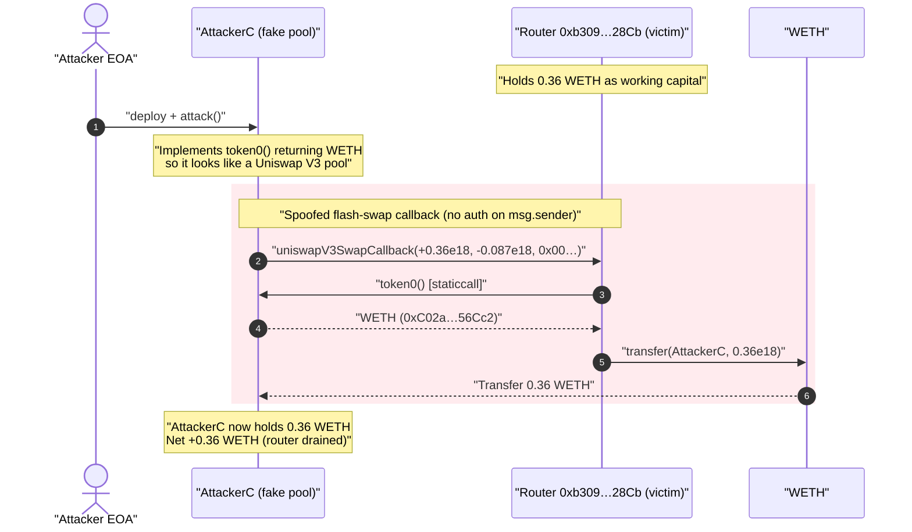
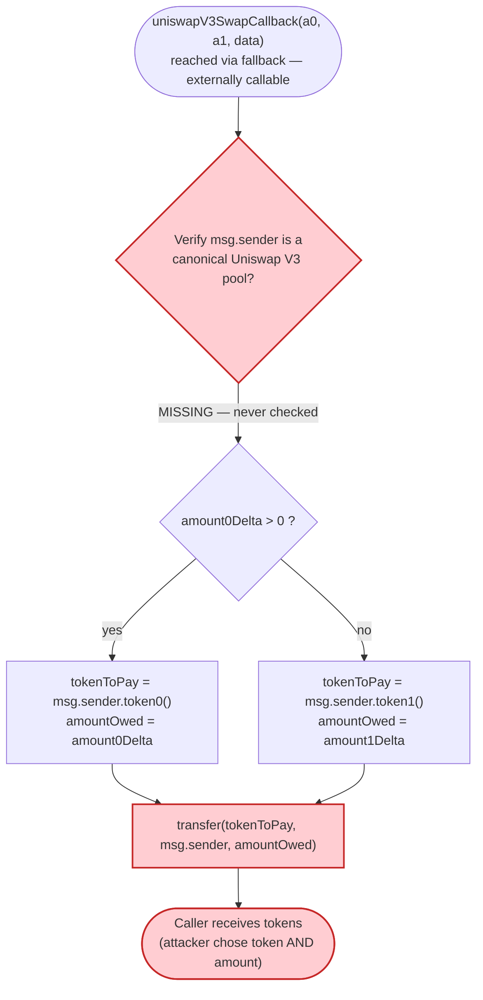
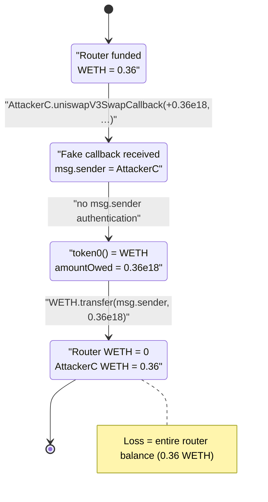

# Unverified `0xb309…28Cb` MEV Router — Unprotected `uniswapV3SwapCallback` Token Drain

> **Vulnerability classes:** vuln/access-control/missing-auth · vuln/logic/missing-check

> One-line summary: a MEV / arbitrage router contract pays out tokens to **whoever calls its
> Uniswap-V3 flash-swap callback**, because the callback never checks that `msg.sender` is a real
> Uniswap V3 pool — so anyone can fabricate a callback and walk off with the router's token balance.

> **Reproduction:** the PoC compiles & runs in this isolated Foundry project
> ([this folder](.)). Full verbose trace: [output.txt](output.txt). The vulnerable contract is
> **unverified** on Etherscan, so the analysis below is reconstructed from the on-chain bytecode
> (selector dispatch + `cast disassemble`), the live fork trace, and the PoC.

---

## Key info

| | |
|---|---|
| **Loss** | **0.36 WETH** drained in this tx (≈ $0.9k at Sept-2024 prices; the campaign across the two known txs is reported as ~$1.5k) |
| **Vulnerable contract** | Unverified MEV router — [`0xb3094734FE249A7b0110dC12D66F6C404aDA28Cb`](https://etherscan.io/address/0xb3094734fe249a7b0110dc12d66f6c404ada28cb) |
| **Victim** | The router itself (it held 0.36 WETH as working capital / unswept profit) |
| **Attacker EOA** | [`0xfe51ffcd2af4748d77130646988F966733583dc1`](https://etherscan.io/address/0xfe51ffcd2af4748d77130646988f966733583dc1) |
| **Attack contract** | [`0xA826daCf14a462bca2A6e4de4c27F20ED7B43B1D`](https://etherscan.io/address/0xa826dacf14a462bca2a6e4de4c27f20ed7b43b1d) |
| **Attack tx** | [`0x83c71a83656b0fecfa860e76a9becf738930b3f1b2510c7d0339ab585090a82d`](https://app.blocksec.com/explorer/tx/eth/0x83c71a83656b0fecfa860e76a9becf738930b3f1b2510c7d0339ab585090a82d) |
| **Similar tx** | [`0xf93db4cdee0ed2af06067a9c953ebc62dd17f70be37961636c42d698cc23e932`](https://app.blocksec.com/explorer/tx/eth/0xf93db4cdee0ed2af06067a9c953ebc62dd17f70be37961636c42d698cc23e932) |
| **Chain / block / date** | Ethereum mainnet / fork at 20,683,452 (attack at 20,683,453) / Sept 4, 2024 |
| **Compiler** | Unknown (unverified); runtime bytecode is hand-rolled assembly-style dispatch, ~20 KB |
| **Bug class** | Missing access control on an AMM flash-swap callback (un-authenticated `uniswapV3SwapCallback`) |

---

## TL;DR

`0xb309…28Cb` is a **MEV / arbitrage router** that performs Uniswap-V3 flash swaps. A V3 swap works by
optimistically sending the output to the recipient and then `swap()` invokes
`uniswapV3SwapCallback(amount0Delta, amount1Delta, data)` on the caller, expecting the caller to pay the
owed input back to the pool inside that callback. This router implements that callback in its **fallback
handler**: it reads `token0()`/`token1()` **from `msg.sender`** (the supposed pool) and `transfer`s the
positive delta of that token back to `msg.sender`
([reconstructed from runtime bytecode](#the-vulnerable-code)).

The fatal omission: **the callback never verifies that `msg.sender` is an actual Uniswap V3 pool**
(no factory/`computeAddress`/`PoolKey` check, no `require(msg.sender == authorizedPool)`). It trusts
that whoever calls the callback "must be" a pool that just paid out, and dutifully pays the "input" leg.

The attacker therefore:

1. Deploys a contract that *pretends to be a pool* by implementing `token0()` returning **WETH**.
2. Calls the router's `uniswapV3SwapCallback` directly with `amount0Delta = +0.36e18` (a positive delta
   means "you owe me this much token0").
3. The router calls `attacker.token0()` → WETH, then `WETH.transfer(msg.sender, 0.36e18)` — handing the
   attacker its **entire** WETH balance. No real swap ever happened; no pool was involved.

Net result: **0.36 WETH** moved from the router to the attacker contract, free of charge.

---

## Background — what the contract does

The contract is an unverified, gas-optimized **MEV/arbitrage router**. Its selector dispatch table
(decoded from the runtime head, confirmed with `cast 4byte`) is:

| Selector | Function | Note |
|---|---|---|
| `0x205c2878` | `withdrawTo(address,uint256)` | owner sweep of ETH |
| `0x5b2e9917` | `withdrawERCTo(address,address,uint256)` | owner sweep of ERC20 |
| `0x31f57072` | `onMorphoFlashLoan(uint256,bytes)` | Morpho flash-loan callback |
| `0xf69cd2d2` | `threeEyedMan()` | bot owner/branding tag |
| `0x7df3471e`, `0x8642d12d`, `0x96ce0a56`, `0xbd90555a`, `0x56eff5b7` | misc routing / quoting entry points | |

The interesting behavior lives in the **fallback** (runtime offset `0x91`). The fallback decodes a
tightly packed calldata layout and, for the flash-swap-callback shape, repays the owed leg of a swap. It
references `token0()` (`0dfe1681`), `token1()` (`d21220a7`), `transfer` (`a9059cbb`) and `balanceOf`
(`70a08231`) — all of which line up with the live trace.

At the fork block the router's balances were:

| Asset | Balance held by `0xb309…28Cb` |
|---|---|
| **WETH** (`0xC02a…56Cc2`) | **0.360000000000000000 WETH** |
| ETH | 0 |

That 0.36 WETH is precisely what the attacker drained — the contract's whole liquid balance.

---

## The vulnerable code

The contract is unverified, so there is no Solidity source to link. The logic below is reconstructed
from the runtime bytecode (the selector `0xfa461e33 = uniswapV3SwapCallback(int256,int256,bytes)` is
**absent** from the dispatch table and is handled by the packed-calldata fallback at `0x91`), the
`cast disassemble` output ([token0/token1/transfer selectors](output.txt)), and the observed trace.

Decompiled to readable Solidity, the callback path is equivalent to:

```solidity
// fallback() — handles uniswapV3SwapCallback(amount0Delta, amount1Delta, data) among other shapes
fallback() external payable {
    // ... packed-calldata parsing: extract amount0Delta, amount1Delta, flags ...

    // Decide which token leg is owed (positive delta = router owes that token)
    address tokenToPay;
    uint256 amountOwed;
    if (amount0Delta > 0) {
        tokenToPay = IUniswapV3Pool(msg.sender).token0();   // ⚠️ trusts msg.sender is a pool
        amountOwed = uint256(amount0Delta);
    } else {
        tokenToPay = IUniswapV3Pool(msg.sender).token1();   // ⚠️ trusts msg.sender is a pool
        amountOwed = uint256(amount1Delta);
    }

    // ⚠️ NO check that msg.sender is a canonical Uniswap V3 pool
    IERC20(tokenToPay).transfer(msg.sender, amountOwed);     // pays the "input" to the caller
}
```

The **observed trace** ([output.txt](output.txt)) makes the flow concrete:

```
AttackerC::attack()
  └─ 0xb3094734…::uniswapV3SwapCallback(360000000000000000, -86965571293199577, 0x00…00)
       ├─ AttackerC::token0() [staticcall]            → WETH (0xC02a…56Cc2)   ← msg.sender == attacker
       ├─ WETH9::transfer(AttackerC, 360000000000000000)                      ← 0.36 WETH out
       │    └─ emit Transfer(from: 0xb3094734…, to: AttackerC, value: 0.36e18)
       └─ Stop
```

The router calls `token0()` on **the attacker's contract** (because the attacker is `msg.sender`), the
attacker returns WETH, and the router transfers 0.36 WETH to the attacker.

---

## Root cause — why it was possible

Uniswap V3's flash-swap pattern is **callback-based and inherently dangerous to implement**: the pool
optimistically transfers the output to the recipient *first*, then calls
`uniswapV3SwapCallback(...)` on the caller and expects the input to be repaid before `swap()` returns. A
correct integrator MUST authenticate the callback caller, because the callback is the place where it
*pays out funds*. The canonical guard is one of:

```solidity
// recompute the pool address from the factory + PoolKey and require it matches
CallbackValidation.verifyCallback(factory, tokenA, tokenB, fee);
// or
require(msg.sender == expectedPool, "unauthorized callback");
```

This router has **none** of that. Its `uniswapV3SwapCallback` handler:

1. **Does not verify `msg.sender`** is a Uniswap V3 pool (no factory/CREATE2 address recomputation, no
   stored "active pool" check, no `PoolKey` validation).
2. **Reads the token to pay from `msg.sender` itself** (`token0()`/`token1()`), so the caller fully
   controls *which* token is paid — the attacker simply returns WETH.
3. **Reads the amount to pay from the attacker-supplied `amountDelta`**, so the caller fully controls
   *how much* is paid (capped only by the router's balance).

Because all three inputs to "transfer X of token Y to the caller" are attacker-controlled, the callback
collapses into a public `withdraw(anything the contract holds)` for anyone willing to impersonate a pool.

This is the textbook **unprotected flash-loan / flash-swap callback** bug: a function that is meant to be
invoked *only re-entrantly by a trusted pool mid-swap* is left externally callable with no caller
authentication, turning the repayment leg into a free token faucet.

---

## Preconditions

- The router holds a non-zero balance of some ERC20 it is willing to "repay" — here **0.36 WETH** sitting
  as working capital / un-swept profit. The drained amount is bounded by the router's balance of the
  chosen token.
- The attacker controls a contract that implements `token0()` (and/or `token1()`) returning the target
  token address — trivial to deploy (the PoC's `AttackerC.token0()` returns WETH).
- No real Uniswap V3 pool, flash loan, or capital is required. The "swap" is entirely fictional; the
  attacker just calls the callback directly. (The attack costs only gas.)

---

## Step-by-step attack walkthrough (with ground-truth numbers from the trace)

`amount0Delta = +360000000000000000` (`0.36e18`, positive ⇒ router owes token0).
`amount1Delta = -86965571293199577` (negative ⇒ ignored; this is the leg the "pool" would have paid out).
`data = abi.encodePacked(uint8(0), uint256(0))` (only the leading byte / flags are read).

| # | Step | Caller → Callee | Concrete values | Effect |
|---|------|-----------------|-----------------|--------|
| 0 | **Initial** | — | Router WETH balance = **0.360000000000000000** | Honest router holds 0.36 WETH. |
| 1 | **Deploy fake pool** | attacker EOA → `new AttackerC` | `AttackerC.token0()` ⇒ WETH | Attacker contract masquerades as a Uniswap V3 pool. |
| 2 | **Spoof callback** | `AttackerC` → router `uniswapV3SwapCallback(0.36e18, −0.087e18, 0x00…)` | selector `0xfa461e33` | Router enters its fallback repayment path. |
| 3 | **Router resolves token** | router → `AttackerC.token0()` (staticcall) | returns `0xC02a…56Cc2` (WETH) | Router decides it owes **WETH** because `amount0Delta > 0`. |
| 4 | **Router pays the caller** | router → `WETH.transfer(AttackerC, 0.36e18)` | `Transfer(from: router, to: AttackerC, 0.36e18)` | **0.36 WETH leaves the router** to the attacker. |
| 5 | **Final** | — | Router WETH = 0; `AttackerC` WETH = **0.360000000000000000** | Drain complete. |

Final assertion in the PoC ([test/unverified_a89f_exp.sol:36](test/unverified_a89f_exp.sol#L36)):

```
after attack: balance of address(attC): 0.360000000000000000
```

### Profit / loss accounting

| Party | WETH before | WETH after | Δ |
|---|---:|---:|---:|
| Router `0xb309…28Cb` | 0.36 | 0.00 | **−0.36** |
| Attacker `AttackerC` | 0.00 | 0.36 | **+0.36** |

The attacker's gain equals the router's loss to the wei (0.36 WETH). Cost to the attacker: gas only
(no capital, no flash loan).

---

## Diagrams

### Sequence of the attack



### Control flow inside the callback (the flaw)



### Router WETH-balance state evolution



---

## Remediation

1. **Authenticate the callback caller.** The single fix that closes the bug: inside
   `uniswapV3SwapCallback`, verify `msg.sender` is a genuine Uniswap V3 pool — recompute the pool address
   from the factory and `PoolKey` (Uniswap's `CallbackValidation.verifyCallback`) or require
   `msg.sender == <the pool this router itself just called>` stored in transient/lock state.
2. **Never derive the payout token/amount from the untrusted caller.** Do not call `token0()`/`token1()`
   on `msg.sender`; use the `PoolKey`/tokens the router itself selected when it initiated the swap, and
   the deltas it expected — not raw attacker-supplied values.
3. **Use a re-entrancy/locked-pool guard.** Set an "active pool" address before calling `pool.swap(...)`
   and clear it after; reject any callback whose `msg.sender` is not the currently active pool. This also
   prevents the callback from being invoked outside a swap the router itself started.
4. **Do not leave funds idle in a router.** A flash-swap router should hold zero standing balance between
   transactions; sweep profit immediately. Idle balances are the only thing this class of bug can steal.
5. **Apply the same fix to every callback.** The contract also exposes `onMorphoFlashLoan(...)`; all such
   lender/pool callbacks must authenticate their caller identically.

---

## How to reproduce

The PoC was extracted into a standalone Foundry project (the umbrella DeFiHackLabs repo has many
unrelated PoCs that fail to whole-compile under `forge test`):

```bash
_shared/run_poc.sh 2024-09-unverified_a89f_exp -vvvvv
```

- RPC: an **Ethereum mainnet archive** endpoint is required (fork block 20,683,452).
  `foundry.toml` uses an Infura archive endpoint.
- Result: `[PASS] testPoC()` with the attacker contract ending on **0.36 WETH**.

Expected tail:

```
Ran 1 test for test/unverified_a89f_exp.sol:ContractTest
[PASS] testPoC() (gas: 290344)
Logs:
  after attack: balance of address(attC): 0.360000000000000000

Suite result: ok. 1 passed; 0 failed; 0 skipped
```

---

*Vulnerable contract is unverified on Etherscan; analysis reconstructed from runtime bytecode
(`cast code` / `cast disassemble`), the live mainnet fork trace ([output.txt](output.txt)), and the
PoC ([test/unverified_a89f_exp.sol](test/unverified_a89f_exp.sol)). Post-mortem reference:
TenArmorAlert — https://x.com/TenArmorAlert/status/1831637553415610877.*
