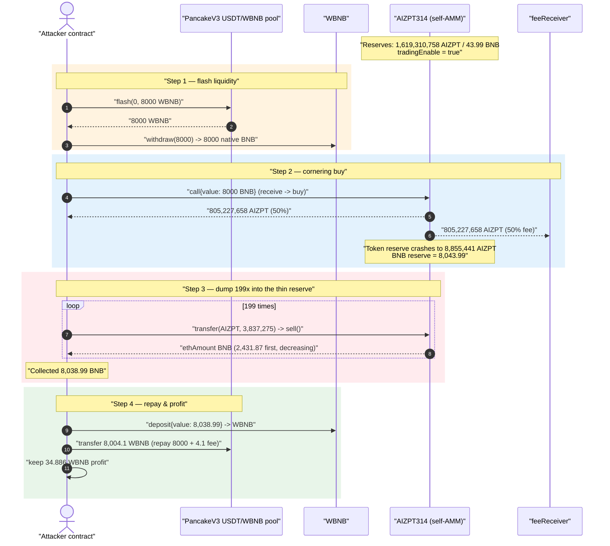
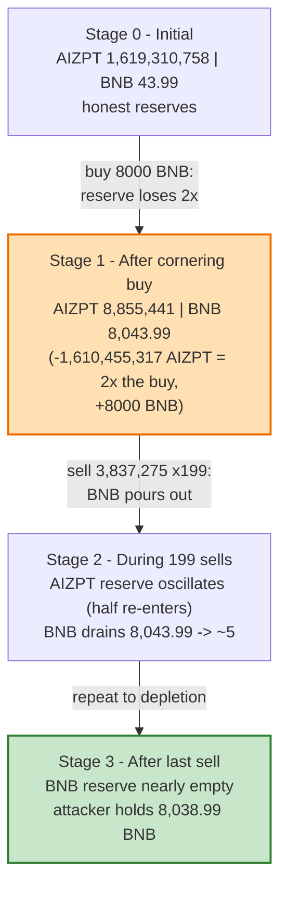
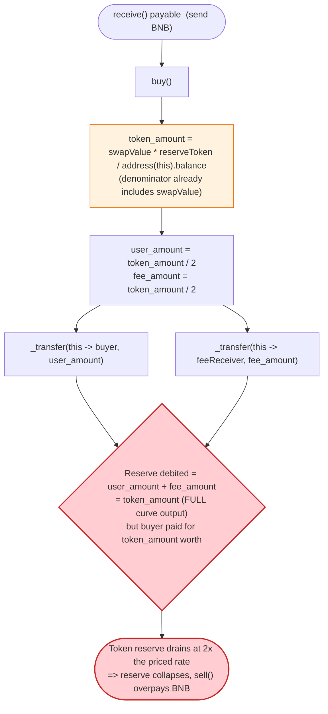

# AIZPT314 Exploit — ERC-314 "Buy Mints 2× From Reserve" Price-Skew Drain

> **Vulnerability classes:** vuln/oracle/spot-price · vuln/logic/fee-calculation · vuln/defi/slippage

> **Reproduction:** the PoC compiles & runs in an isolated Foundry project at
> [this project folder](.) (the umbrella DeFiHackLabs repo contains many unrelated
> PoCs that do not whole-compile, so this one was extracted).
> Full verbose trace: [output.txt](output.txt).
> Verified vulnerable source: [AIZPT314.sol](sources/AIZPT314_Be779D/AIZPT314.sol).

---

## Key info

| | |
|---|---|
| **Loss** | **34.88564338 WBNB** (~$20K USD at the time) drained from the AIZPT314 token's own liquidity |
| **Vulnerable contract** | `AIZPT314` — [`0xBe779D420b7D573C08EEe226B9958737b6218888`](https://bscscan.com/address/0xBe779D420b7D573C08EEe226B9958737b6218888#code) |
| **Victim "pool"** | The token contract itself — it *is* the AMM (self-contained ERC-314 model). The 43.99 BNB it held was the prize. |
| **Flash-loan source** | PancakeSwap V3 pool `0x36696169C63e42cd08ce11f5deeBbCeBae652050` (USDT/WBNB), flashed 8000 WBNB |
| **Attacker EOA** | [`0x3026c464d3bd6ef0ced0d49e80f171b58176ce32`](https://bscscan.com/address/0x3026c464d3bd6ef0ced0d49e80f171b58176ce32) |
| **Attacker contract** | [`0x8408497c18882bfb61be9204cfff530f4ee18320`](https://bscscan.com/address/0x8408497c18882bfb61be9204cfff530f4ee18320) (PoC re-deploys an equivalent `AttackerC`) |
| **Attack tx** | [`0x5e694707337cca979d18f9e45f40e81d6ca341ed342f1377f563e779a746460d`](https://bscscan.com/tx/0x5e694707337cca979d18f9e45f40e81d6ca341ed342f1377f563e779a746460d) |
| **Chain / block / date** | BSC / 42,846,998 / 2024-10-05 09:33 UTC |
| **Compiler** | Solidity v0.8.18, optimizer 200 runs |
| **Bug class** | Broken AMM invariant — `buy()` removes **2×** the bought amount from reserve (user + equal "fee" mint) while pricing off `address(this).balance`, letting a buyer corner the token supply and dump it back for nearly all the BNB |

---

## TL;DR

`AIZPT314` is an [ERC-314](https://github.com/Devil-0x1/ERC-314) "no-router AMM" token: the token
*is* its own liquidity pool. You send it BNB via `receive()` and it mints/transfers you tokens
(`buy`); you `transfer` tokens to the contract and it sends you BNB (`sell`). Reserves are simply
`address(this).balance` (BNB) and `_balances[address(this)]` (tokens).

The fatal asymmetry is in `buy()`
([AIZPT314.sol:167-183](sources/AIZPT314_Be779D/AIZPT314.sol#L167-L183)):

```solidity
uint256 token_amount = (swapValue * _balances[address(this)]) / (address(this).balance);
uint256 user_amount  = token_amount * 50 / 100;
uint256 fee_amount   = token_amount - user_amount;
_transfer(address(this), msg.sender, user_amount);   // buyer gets 50%
_transfer(address(this), feeReceiver, fee_amount);    // feeReceiver gets the OTHER 50%
```

`token_amount` is the full constant-product output, but **the buyer only receives half** — the
other half is shipped to `feeReceiver`. So a single buy removes `token_amount` tokens from the
reserve while only `user_amount = token_amount/2` ends up priced into what the buyer paid. The
reserve is depleted twice as fast as the pricing curve assumes, collapsing the token reserve and
making each subsequent `sell()` return a huge slice of the BNB balance.

The attacker, with a flash-loaned 8000 BNB:

1. **Buys once** for 8000 BNB → receives **805,227,658 AIZPT**, while the contract's token reserve
   crashes from **1,619,310,758 → 8,855,441 AIZPT** (it lost 1,610,455,317 — *both* halves).
2. **Sells 199 times**, 3,837,275 AIZPT each, into the now token-starved reserve. Because the token
   reserve (8.85M) is tiny next to the BNB balance (8,043 BNB), the very first sell alone returns
   **2,431.87 BNB**, and the 199 sells together return **8,038.99 BNB**.
3. **Repays** the 8000 WBNB flash loan + 4.1 WBNB fee and keeps the rest.

Net profit: **34.88564338 WBNB** — essentially the token's entire 43.99 BNB of real liquidity,
minus what was consumed by the buy spread and the flash fee.

---

## Background — what AIZPT314 does

`AIZPT314` ([source](sources/AIZPT314_Be779D/AIZPT314.sol)) is an ERC-314-style token. Unlike a
normal ERC-20 that lists on PancakeSwap, an ERC-314 token embeds the AMM directly:

- **Reserves are the contract's own balances.** `getReserves()` returns
  `(address(this).balance, _balances[address(this)])`
  ([:101-103](sources/AIZPT314_Be779D/AIZPT314.sol#L101-L103)) — i.e. native BNB held and tokens
  held.
- **Buy = send BNB.** `receive()` calls `buy()`
  ([:204-206](sources/AIZPT314_Be779D/AIZPT314.sol#L204-L206)); the BNB you send is the swap input.
- **Sell = `transfer(tokens)` to the contract.** `transfer` routes `to == address(this)` into
  `sell()` ([:71-79](sources/AIZPT314_Be779D/AIZPT314.sol#L71-L79)).
- **Liquidity** is bootstrapped once via `addLiquidity()` and the LP is the `liquidityProvider`
  ([:126-139](sources/AIZPT314_Be779D/AIZPT314.sol#L126-L139)).

On-chain state at the fork block (read with `cast` at block 42,846,997):

| Parameter | Value |
|---|---|
| `tradingEnable` | **true** (already live — no gate to bypass) |
| `owner` | `0x0000…0000` (ownership renounced) |
| `liquidityProvider` | `0xF74A9765CD2E91Fdb71D87Fc7bE4292E001E926E` |
| `feeReceiver` | `0x93fBf6b2D322C6C3e7576814d6F0689e0A333e96` |
| `totalSupply` | 8,917,193,330.256982131 AIZPT |
| **BNB reserve** (`address(this).balance`) | **43.989751682608782922 BNB** ← the prize |
| **Token reserve** (`balanceOf(self)`) | **1,619,310,758.617008133 AIZPT** |

---

## The vulnerable code

### `buy()` — removes 2× the bought amount from the reserve

[AIZPT314.sol:167-183](sources/AIZPT314_Be779D/AIZPT314.sol#L167-L183):

```solidity
function buy() internal {
    require(tradingEnable, 'Trading not enable');

    uint256 swapValue = msg.value;

    uint256 token_amount = (swapValue * _balances[address(this)]) / (address(this).balance);

    require(token_amount > 0, 'Buy amount too low');

    uint256 user_amount = token_amount * 50 / 100;
    uint256 fee_amount = token_amount - user_amount;

    _transfer(address(this), msg.sender, user_amount);
    _transfer(address(this), feeReceiver, fee_amount);

    emit Swap(msg.sender, swapValue, 0, 0, user_amount);
}
```

Two compounding flaws:

1. **`address(this).balance` already includes `msg.value`.** When `receive()` runs, the BNB has
   already been credited to the contract, so the denominator is `reserveBNB + swapValue`. That alone
   is the standard ERC-314 "off-by-the-input" pricing bug, but it is the *minor* issue here.
2. **The reserve loses `token_amount`, the buyer gains `token_amount / 2`.** The full
   constant-product quantity is debited from the reserve, but split 50/50 between buyer and
   `feeReceiver`. The pricing math therefore *understates how fast the reserve drains*: every buy
   shrinks the token reserve at twice the rate the curve implies. After one large buy the token
   reserve is left tiny relative to the BNB reserve.

### `sell()` — prices off the (now-tiny) token reserve, pays out native BNB

[AIZPT314.sol:185-202](sources/AIZPT314_Be779D/AIZPT314.sol#L185-L202):

```solidity
function sell(uint256 sell_amount) internal {
    require(tradingEnable, 'Trading not enable');

    uint256 ethAmount = (sell_amount * address(this).balance) / (_balances[address(this)] + sell_amount);

    require(ethAmount > 0, 'Sell amount too low');
    require(address(this).balance >= ethAmount, 'Insufficient ETH in reserves');

    uint256 swap_amount = sell_amount * 50 / 100;
    uint256 burn_amount = sell_amount - swap_amount;

    _transfer(msg.sender, address(this), swap_amount);   // half back to reserve
    _transfer(msg.sender, address(0), burn_amount);       // half burned
    payable(msg.sender).transfer(ethAmount);              // pay out BNB

    emit Swap(msg.sender, 0, sell_amount, ethAmount, 0);
}
```

`ethAmount = sell_amount * reserveBNB / (reserveToken + sell_amount)`. With `reserveToken` collapsed
to ~8.85M by the buy and `reserveBNB` still ~8,043 BNB, even a 3.8M-token sell satisfies
`sell_amount` comparable to `reserveToken`, so `ethAmount ≈ reserveBNB × sell/(reserveToken+sell)`
returns a large fraction of the BNB. The attacker simply repeats it.

### No slippage / no invariant check

There is **no minimum-output check, no `k` (constant-product) preservation check, and no per-block
trade limit** anywhere. `getAmountOut` ([:157-165](sources/AIZPT314_Be779D/AIZPT314.sol#L157-L165))
exists but is a view helper that callers are never forced to honour, and even it embeds the same
`/2` skew in the buy branch.

---

## Root cause — why it was possible

The protocol tries to be a self-contained AMM but breaks the one invariant an AMM must preserve:
**the reserve change on a trade must equal the counterparty's token movement.**

In a correct constant-product swap, buying `Δt` tokens for `Δe` BNB moves *exactly* `Δt` out of the
reserve to the buyer. Here, `buy()` computes the full curve output `token_amount` but then sends
**only half to the buyer and the other half to a third party (`feeReceiver`)**, while still debiting
the *whole* `token_amount` from the reserve. The reserve is therefore drained at 2× the rate the
price curve accounts for. Equivalently: the buyer pays the constant-product price for `token_amount`
tokens but the *pool* behaves as if `2 × token_amount` were sold.

Concretely, the chain of design errors:

1. **"Fee" is paid in freshly-handed-out reserve tokens, not skimmed from the buyer.** A proper fee
   reduces the buyer's output; this one *doubles the reserve outflow*. After the attacker's single
   8000-BNB buy, the token reserve drops from 1.619B to 8.85M — a 99.45% reduction — even though the
   attacker only "bought" 805M.
2. **Sell prices off the live, manipulated reserve with no invariant guard.** Once the token reserve
   is tiny, `sell()` pays out BNB roughly proportional to `sell/(reserve+sell)`, which is near-1 for
   modest sells. The first sell alone reclaimed 2,431 BNB.
3. **Reserves are spot balances (`address(this).balance` / `balanceOf(self)`).** They can be moved
   within a single transaction with zero cost basis, so a flash loan turns the whole sequence into a
   free, atomic operation.
4. **No `tradingEnable` obstacle.** Trading was already on and ownership renounced, so the attack was
   a single permissionless call with no setup.

This is the well-known ERC-314 class of bug (AIZPT, and many sibling "314" tokens — TIME314, etc. —
were drained the same way in 2024). The reference ERC-314 template carried this exact `token_amount`
vs `user_amount` reserve-accounting flaw.

---

## Preconditions

- `tradingEnable == true` (it was — set permanently when liquidity was added). No bypass needed.
- The token holds real BNB liquidity worth taking (43.99 BNB here).
- Enough BNB to perform the cornering buy. It is fully recovered intra-transaction, so it is
  **flash-loanable** — the PoC flash-borrows 8000 WBNB from a PancakeSwap V3 USDT/WBNB pool, unwraps
  it to native BNB, and repays at the end.

---

## Step-by-step attack walkthrough (with on-chain numbers from the trace)

All figures are taken directly from [output.txt](output.txt). The attacker contract's
`pancakeV3FlashCallback` ([test/AIZPTToken_exp.sol:45-57](test/AIZPTToken_exp.sol#L45-L57)) does all
the work.

| # | Step | Token reserve (AIZPT) | BNB reserve | Note |
|---|------|----------------------:|------------:|------|
| 0 | **Initial** | 1,619,310,758.617 | 43.9897 | Honest self-AMM. |
| 1 | **Flash-borrow** 8000 WBNB from PancakeV3 pool; `withdraw()` → 8000 native BNB | 1,619,310,758.617 | 43.9897 | Working capital sourced atomically. |
| 2 | **Buy:** `AIZPT.call{value: 8000 BNB}` → `buy()`. Buyer gets 805,227,658.714 AIZPT; an equal 805,227,658.714 minted to `feeReceiver` | **8,855,441.189** | 8,043.9897 | Reserve loses **1,610,455,317** tokens (2× the buy); BNB reserve now 8,043.99. |
| 3 | **Sell #1:** `transfer(AIZPT, 3,837,275)` → `sell()` returns **2,431.867 BNB** | ~10,773,078 | 5,612.12 | Half of sold tokens go back to reserve, half burned; BNB pours out. |
| 4 | **Sells #2–#199** (198 more), 3,837,275 each, returning steadily less BNB (1,473.87 → … → 0.0494) | grows as half re-enters reserve | shrinks toward ~5 BNB | 199 sells total. |
| 5 | **Sum of all 199 sells** = **8,038.985643380696 BNB** received by attacker | — | — | Equals attacker's native balance. |
| 6 | **`deposit{value: 8038.9856…}`** → wrap to WBNB | — | — | Trace `Deposit` event matches to the wei. |
| 7 | **Repay** 8,004.1 WBNB to PancakeV3 pool (8000 principal + 4.1 fee) | — | — | Flash loan closed. |
| 8 | **Sweep** remaining **34.88564338069605 WBNB** to attacker EOA | — | — | Profit. |

Verified arithmetic (matches the trace exactly):

- Buy: `token_amount = 8000e18 × 1,619,310,758.617e18 / (43.99e18 + 8000e18) = 1,610,455,317.428…`,
  `user_amount = 805,227,658.714153558292228633` ✓ (exact wei match to trace).
- First sell: `3,837,275e18 × 8,043.9897e18 / (8,855,441.189e18 + 3,837,275e18) =
  2,431.867246969999197480` BNB ✓ (exact wei match).
- Profit: `8,038.985643380696052125 − 8,004.1 = 34.885643380696052125` WBNB ✓ (exact wei match to
  the final `balanceOf(attacker)`).

### Profit accounting (WBNB)

| Direction | Amount (WBNB) |
|---|---:|
| Borrowed (flash) | 8,000.000000000 |
| Spent — buy (8000 BNB into AIZPT) | 8,000.000000000 |
| Received — 199 sells (sum) | 8,038.985643381 |
| Repaid — principal + fee | 8,004.100000000 |
| **Net profit** | **+34.885643381** |

The 34.88 BNB profit is drawn from the token's original 43.99 BNB of liquidity (the difference, ~9.1
BNB, was consumed by the buy/sell spread and the 4.1 BNB flash fee and stays trapped in the now-thin
reserve).

---

## Diagrams

### Sequence of the attack



### Pool (self-AMM) state evolution



### The flaw inside `buy()` — reserve drains 2× per buy



---

## Remediation

1. **Pay fees by reducing the buyer's output, never by minting extra reserve to a third party.**
   The buyer should receive `token_amount` and the reserve should drop by exactly `token_amount`. If
   a fee is desired, take it as a *cut of the BNB input* or a *cut of the buyer's tokens* — e.g.
   `user_amount = token_amount; reserveDebit = token_amount;` and skim BNB to `feeReceiver`. The
   reserve change must equal the buyer's token movement.
2. **Exclude `msg.value` from the buy denominator.** Price off the pre-trade reserve:
   `token_amount = swapValue * reserveToken / (address(this).balance - msg.value)`, matching standard
   constant-product math.
3. **Enforce the constant-product invariant on every trade.** After each buy/sell, require
   `reserveBNB_after * reserveToken_after >= reserveBNB_before * reserveToken_before` (minus an
   explicit fee). A simple `k`-check would have made this attack revert.
4. **Add slippage / minimum-output parameters** so integrators cannot be sandwiched and a single
   actor cannot move price arbitrarily in one call.
5. **Do not derive reserves from raw spot balances** that are mutable within a single transaction;
   at minimum, cap per-block reserve movement or require trades to settle against a committed reserve
   value so flash-loan-funded cornering is not free.
6. **Abandon the ERC-314 self-AMM template** for production tokens — list on an audited AMM
   (PancakeSwap) where reserves, fees, and the `k` invariant are battle-tested.

---

## How to reproduce

The PoC was extracted into a standalone Foundry project (the umbrella DeFiHackLabs repo has many
unrelated PoCs that fail to compile under a single `forge test` build):

```bash
_shared/run_poc.sh 2024-10-AIZPTToken_exp -vvvvv
```

- RPC: a **BSC archive** endpoint is required (fork block 42,846,997). `foundry.toml` uses
  `https://bsc-mainnet.public.blastapi.io`, which serves historical state at that block; the default
  OnFinality public endpoint rate-limits (HTTP 429) and was swapped out.
- Result: `[PASS] testPoC()` with `Final balance in wBNB : 34885643380696052125` (= 34.8856 WBNB).

Expected tail:

```
Ran 1 test for test/AIZPTToken_exp.sol:AIZPTToken_exp
[PASS] testPoC() (gas: 4112450)
  Final balance in wBNB : 34885643380696052125

Suite result: ok. 1 passed; 0 failed; 0 skipped
```

---

*Reference: SlowMist Hacked / DeFiHackLabs — AIZPT (ERC-314), BSC, 2024-10-05, ~34.88 BNB (~$20K).
PoC author: [rotcivegaf](https://twitter.com/rotcivegaf).*
