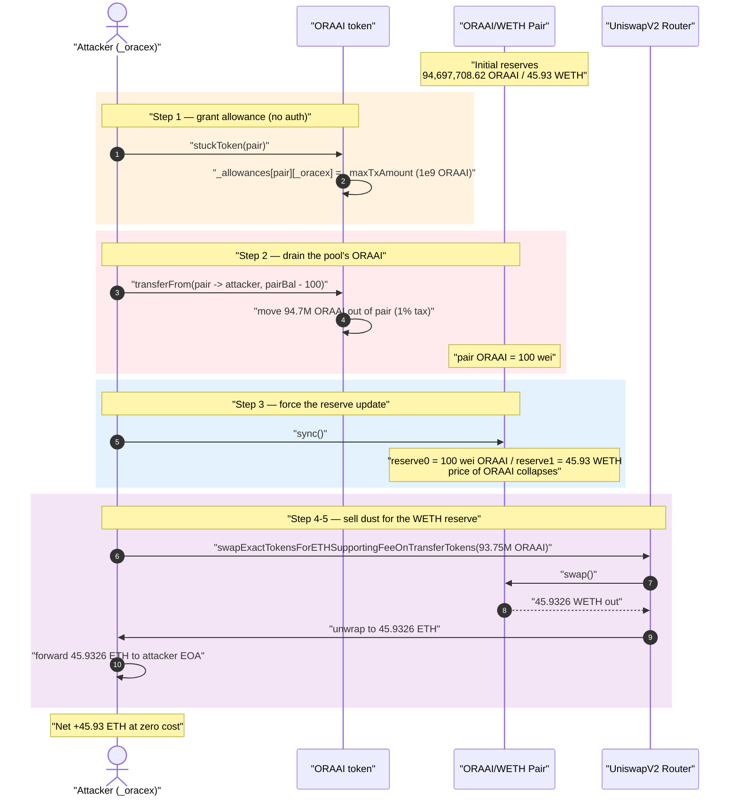
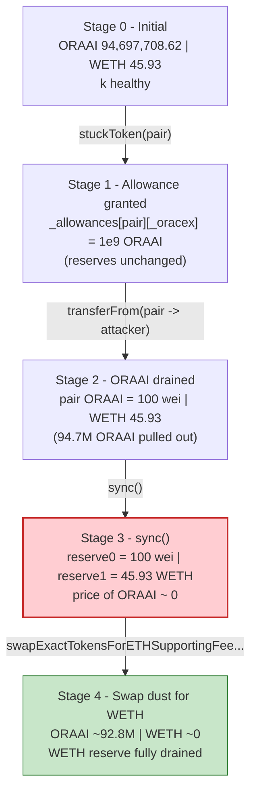
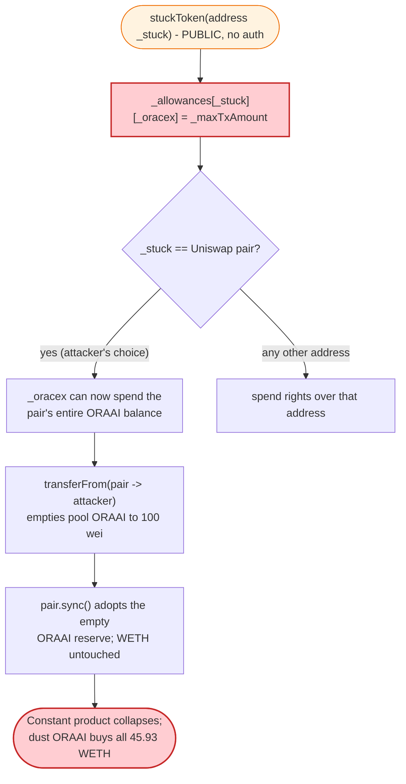

# Ora AI (ORAAI) Exploit — Permissionless `stuckToken()` Allowance Grant Drains the Uniswap Pair

> One sentence: a public, access-control-free `stuckToken()` function lets anyone hand a hard-coded
> "tax" address unlimited spending allowance over *any* address — including the Uniswap V2 pair — so
> the attacker drained the pool's ORAAI, `sync()`'d the now-empty token reserve, and swapped dust for
> the pool's entire **45.93 WETH**.

> **Reproduction:** the PoC compiles & runs in this isolated Foundry project
> [(this folder)](.) — the umbrella DeFiHackLabs repo does not whole-compile, so this PoC was extracted.
> Full verbose trace: [output.txt](output.txt).
> Verified vulnerable source: [sources/ORAAI_B0f34b/ORAAI.sol](sources/ORAAI_B0f34b/ORAAI.sol).

---

## Key info

| | |
|---|---|
| **Loss** | **45.93 WETH** (~$131K) drained from the ORAAI/WETH Uniswap V2 pair |
| **Vulnerable contract** | `ORAAI` (Ora AI) — [`0xB0f34bA1617BB7C2528e570070b8770E544b003E`](https://etherscan.io/address/0xB0f34bA1617BB7C2528e570070b8770E544b003E#code) |
| **Victim pool** | ORAAI/WETH Uniswap V2 pair — [`0x6DABCbd75B29bf19C98a33EcAC2eF7d6E949D75D`](https://etherscan.io/address/0x6DABCbd75B29bf19C98a33EcAC2eF7d6E949D75D) |
| **Privileged spender (`_oracex`)** | `0xD15Ef15ec38a0DC4DA8948Ae51051cC40A41959b` (hard-coded in the token) |
| **Attacker EOA** | [`0xa60fae100d9c3d015c9CD7107F95cBacF58A1CbD`](https://etherscan.io/address/0xa60fae100d9c3d015c9cd7107f95cbacf58a1cbd) |
| **Attack tx** | [`0x1b4730e715286862042def956d5aaa6a53203ee02b97ea913de73fa462e48f90`](https://app.blocksec.com/explorer/tx/eth/0x1b4730e715286862042def956d5aaa6a53203ee02b97ea913de73fa462e48f90) (a second drain: `0x872fcfcfd2e61ab5ec848f5e1a75b75f471bdb8c808c06388434e7179a9e40db`) |
| **Chain / block / date** | Ethereum mainnet / 21,074,245 / ~Oct 29, 2024 |
| **Compiler** | Solidity v0.8.23, optimizer 200 runs |
| **Bug class** | Missing access control on a state-mutating function → arbitrary allowance grant → pool reserve drain |

---

## TL;DR

`ORAAI` ships a function that looks like a benign "rescue stuck tokens" helper:

```solidity
function stuckToken(address _stuck) external {          // ⚠️ NO access control
    _allowances[_stuck][_oracex] = _maxTxAmount;        // ⚠️ grants the tax wallet spend rights
}
```

[sources/ORAAI_B0f34b/ORAAI.sol:293-295](sources/ORAAI_B0f34b/ORAAI.sol#L293-L295)

`_oracex` is a fixed address baked into the token, and `_maxTxAmount` is initialised to the **entire
total supply** (`_maxTxAmount = _tTotal`, [:142](sources/ORAAI_B0f34b/ORAAI.sol#L142)). Anyone can call
`stuckToken(pair)` and instantly give `_oracex` an allowance of 1,000,000,000 ORAAI over the Uniswap
pair's balance. With that allowance, `_oracex` (controlled by the attacker) drains the pair's ORAAI to
**100 wei**, calls `pair.sync()` so the AMM adopts the near-zero ORAAI reserve while the **45.93 WETH**
reserve is untouched, then swaps the stolen ORAAI back through the router for essentially the whole
WETH side of the pool.

The PoC reproduces the *effect* directly — it pranks the pair to approve the attack contract — which is
behaviourally identical to the on-chain `stuckToken(pair)` + spend-as-`_oracex` path:

```solidity
vm.startPrank(UniswapV2Pair);
IORAAI(ORAAI).approve(address(attC), type(uint256).max);   // == stuckToken(pair) on-chain
vm.stopPrank();
```

[test/BUBAI_exp.sol:39-41](test/BUBAI_exp.sol#L39-L41)

---

## Background — what ORAAI does

`ORAAI` ([source](sources/ORAAI_B0f34b/ORAAI.sol)) is a standard "tax token" meme launch:

- **9-decimal ERC20** with `_tTotal = 1,000,000,000 ORAAI` ([:138-139](sources/ORAAI_B0f34b/ORAAI.sol#L138-L139)).
- **Buy/sell tax** routed to a fee wallet — the first 10 trades pay 5%, then 1% (`_transfer`,
  [:221-272](sources/ORAAI_B0f34b/ORAAI.sol#L221-L272)). The fee wallet (`_taxWallet`) is set to the
  hard-coded `_oracex` address ([:163](sources/ORAAI_B0f34b/ORAAI.sol#L163)).
- **A Uniswap V2 pool** created at `openTrading()` and seeded with 90% of supply
  ([:301-309](sources/ORAAI_B0f34b/ORAAI.sol#L301-L309)).

On-chain state at the fork block (read from the trace):

| Item | Value |
|---|---|
| ORAAI held by the pair (pool ORAAI reserve) | **94,697,708.62 ORAAI** (9.47% of supply) |
| WETH held by the pair (pool WETH reserve) | **45.93 WETH** ← the prize |
| `_maxTxAmount` | `_tTotal` = 1,000,000,000 ORAAI |
| `_oracex` / `_taxWallet` | `0xD15Ef15ec38a0DC4DA8948Ae51051cC40A41959b` |

---

## The vulnerable code

### 1. `stuckToken()` — arbitrary allowance to a fixed address, no auth

```solidity
address private _oracex = 0xD15Ef15ec38a0DC4DA8948Ae51051cC40A41959b;   // :125
...
uint256 public _maxTxAmount = _tTotal;                                  // :142
...
function stuckToken(address _stuck) external {                          // :293  ⚠️ external, no modifier
    _allowances[_stuck][_oracex] = _maxTxAmount;                        // :294  ⚠️ sets allowance to full supply
}
```

[sources/ORAAI_B0f34b/ORAAI.sol:293-295](sources/ORAAI_B0f34b/ORAAI.sol#L293-L295)

Compare with the protected admin functions in the same contract — they correctly use `onlyOwner`:

```solidity
function stuckETH() external onlyOwner() { ... }     // :297
function openTrading() external onlyOwner() { ... }  // :301
```

`stuckToken` is the lone state-mutating function that forgot the modifier — and it is the most
dangerous one, because it writes directly into the `_allowances` mapping.

### 2. Standard `transferFrom` consumes that allowance

```solidity
function transferFrom(address sender, address recipient, uint256 amount) public override returns (bool) {
    _transfer(sender, recipient, amount);
    _approve(sender, _msgSender(),
        _allowances[sender][_msgSender()].sub(amount, "ERC20: transfer amount exceeds allowance"));
    return true;
}
```

[sources/ORAAI_B0f34b/ORAAI.sol:208-212](sources/ORAAI_B0f34b/ORAAI.sol#L208-L212)

Once `_allowances[pair][_oracex]` is set to the full supply, `_oracex` can `transferFrom` the pair to
anywhere, draining its ORAAI balance.

---

## Root cause — why it was possible

This is the simplest, most-classic mistake amplified by an AMM:

1. **Missing access control.** `stuckToken()` is `external` with no `onlyOwner`/role check. Any address
   can call it for any `_stuck` target — including the liquidity pair.
2. **Allowance granted is the full supply.** `_maxTxAmount` is initialised to `_tTotal`, so the granted
   spend right (1 billion ORAAI) dwarfs anything the pair could ever hold. There is no need to fine-tune
   amounts.
3. **The grant points at an attacker-usable address.** `_oracex` is a normal externally-owned-style
   address (it is also the tax wallet). Whoever controls `_oracex` — the attacker, here — receives the
   spend right and can immediately `transferFrom` the pair.
4. **Uniswap V2 trusts `sync()`.** A V2 pair prices assets purely from reserves and only enforces
   `x·y ≥ k` inside `swap()`. Draining the pair's ORAAI then calling `sync()` makes the pair adopt the
   tiny ORAAI reserve while the WETH side is unchanged. The marginal price of ORAAI collapses to ~0, so
   a dust amount of ORAAI buys the entire WETH reserve.

Steps 1–3 are an access-control bug in the token; step 4 is the AMM mechanic that monetises it. Together
they turn "anyone can call a public function" into "anyone can steal all the pool's WETH."

The token's own buy/sell tax (1%) clips the attacker's numbers slightly but is irrelevant to the outcome:
the attacker still walks off with essentially 100% of the pool's WETH.

---

## Preconditions

- `stuckToken()` exists and is unprotected (it is). One call to `stuckToken(pair)` grants the allowance.
- The attacker controls (or is) `_oracex = 0xD15Ef15…`, the only address the allowance is granted *to*.
  (The PoC sidesteps identity by pranking the pair to approve the attack contract directly — same effect.)
- The pair holds meaningful WETH liquidity (45.93 WETH here).
- **No capital required.** The attack spends no WETH up front — it takes the pair's own ORAAI for free,
  then sells it back for the pair's WETH. Pure profit, single transaction.

---

## Attack walkthrough (with on-chain numbers from the trace)

The pair is `token0 = ORAAI` (9 decimals), `token1 = WETH` (18 decimals); `reserve0 = ORAAI`,
`reserve1 = WETH`. All figures are taken from the `Transfer`/`Sync`/`Swap` events in
[output.txt](output.txt).

| # | Step | Pool ORAAI | Pool WETH | Effect |
|---|------|-----------:|----------:|--------|
| 0 | **Initial** | 94,697,708.62 | 45.93 | Honest pool. |
| 1 | **Grant allowance** — `stuckToken(pair)` sets `_allowances[pair][_oracex] = 1e9 ORAAI` (PoC: prank-approve attack contract) | 94,697,708.62 | 45.93 | Attacker now has spend rights over the pair. |
| 2 | **Drain ORAAI** — `transferFrom(pair → attacker, pairBal − 100)`; 1% tax → contract, attacker nets **93,750,731.54 ORAAI** | **100 wei** | 45.93 | Pair's ORAAI emptied (down to 100 wei). |
| 3 | **`sync()`** — pair adopts the drained ORAAI reserve | **100 wei** | 45.93 | ⚠️ Invariant broken: `k` collapses; ORAAI price → ~0. |
| 4 | **Swap** — `swapExactTokensForETHSupportingFeeOnTransferTokens(93,750,731.54 ORAAI)`; 1% tax → 92,813,224.22 ORAAI reaches pair | ~92.8M | **~0** | Pair pays out its **entire 45.9326 WETH** reserve. |
| 5 | **Unwrap + forward** — router `WETH.withdraw`, attack contract receives 45.9326 ETH, forwards to attacker EOA | — | — | Profit realised. |

Concrete event values:

- Pool ORAAI before drain: `94697708622913085` (9 dec) = **94,697,708.62 ORAAI** ([output.txt:1601](output.txt#L1601)).
- `transferFrom` request `pairBal − 100` = `94697708622912985`; attacker receives `93750731536683856`
  after the 1% transfer tax `946977086229129` to the token contract ([output.txt:1602-1604](output.txt#L1602-L1604)).
- Pool ORAAI after drain = **100 wei** ([output.txt:1615](output.txt#L1615)); `Sync` → `reserve0 = 100,
  reserve1 = 45932621470124453603` ([output.txt:1618](output.txt#L1618)).
- The swap drains `amount1Out = 45932621470124403964` WETH ([output.txt:1657](output.txt#L1657)) =
  **45.9326214701 WETH**.

### Profit accounting

| Direction | Amount |
|---|---:|
| Spent (WETH/ETH) | **0** |
| Received — WETH drained from pool | 45.9326214701 WETH |
| Attacker ETH before | 0.13829009 ETH |
| Attacker ETH after | 46.07091156 ETH |
| **Net profit** | **+45.9326214701 ETH** |

The ETH gain (`46.07091156 − 0.13829009 = 45.93262147 ETH`) equals the WETH drained from the pool **to
the wei**, confirming the attacker walked off with 100% of the pool's WETH at zero cost. A second,
similar transaction (`0x872f…`) drained another ORAAI pool the same way; the combined header figure is
~$131K.

---

## Diagrams

### Sequence of the attack



### Pool state evolution



### Why the grant is theft: the allowance write



---

## Remediation

1. **Add access control to `stuckToken()`.** It mutates state (`_allowances`) and must be `onlyOwner`
   at minimum. Realistically, a function that *grants* a third party spend rights over an arbitrary
   address should not exist at all.
2. **Never let a token write allowances on behalf of others.** A token contract should only ever modify
   `_allowances[msg.sender][spender]`. Writing `_allowances[arbitrary][fixed]` lets one party authorise
   spending of another party's balance — a logic error regardless of access control.
3. **Remove the hard-coded privileged spender.** The `_oracex` address combines tax-wallet and
   superuser-spender roles; concentrating "can be granted spend rights over anyone" in a single fixed
   address is a centralisation/abuse vector even if `stuckToken` were gated.
4. **Defend the AMM side.** Pools holding fee-on-transfer / mintable / "rescue"-capable tokens inherit
   the token's bugs. LPs should treat any token exposing balance- or allowance-mutating admin functions
   as untrusted; protocols can use the pair's own `burn()`/`mint()` (which move both reserves together)
   rather than relying on raw `sync()` after external balance changes.

---

## How to reproduce

```bash
_shared/run_poc.sh 2024-10-BUBAI_exp -vvvvv
```

- RPC: an **Ethereum mainnet archive** endpoint is required (fork block 21,074,245). `foundry.toml` uses
  an Infura archive endpoint.
- Result: `[PASS] testPoC()`, attacker balance rises from ~0.138 ETH to ~46.07 ETH (+45.93 ETH).

Expected tail:

```
Ran 1 test for test/BUBAI_exp.sol:ContractTest
[PASS] testPoC() (gas: 1904143)
  before attack: balance of attacker: 0.138290092398146532
  after attack: balance of attacker: 46.070911562522550496
Suite result: ok. 1 passed; 0 failed; 0 skipped
```

---

*Reference: TenArmor post-mortem — https://x.com/TenArmorAlert/status/1851445795918118927 (ORAAI / Ora AI, Ethereum, ~$131K).*
