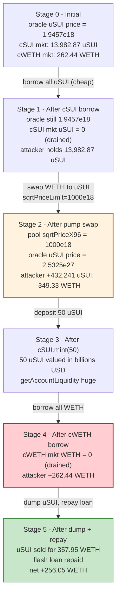
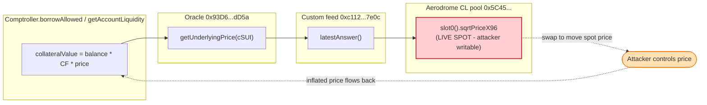

# CompoundFork (Pike Finance "uSUI") Exploit — Spot-Price Oracle Manipulation of a Compound v2 Fork

> **Reproduction:** the PoC compiles & runs in an isolated Foundry project at
> [this project folder](.) (the umbrella DeFiHackLabs repo contains many unrelated
> PoCs that fail a whole-repo build, so this one was extracted).
> Full verbose trace: [output.txt](output.txt).
> The lending protocol's contracts (oracle, comptroller, cTokens) are **unverified** on
> Basescan; the verified-source analysis below is for the manipulable price source — an
> **Aerodrome Slipstream CL pool** ([sources/CLPool_eC8E53](sources/CLPool_eC8E53)) — and the
> Chainlink ETH/USD aggregator ([sources/EACAggregatorProxy_71041d](sources/EACAggregatorProxy_71041d)).
> The oracle's pricing logic is fully reconstructed from the on-chain call trace.

---

## Key info

| | |
|---|---|
| **Loss** | ~$1M total protocol drain; the reproduced WETH leg = **256.05 WETH** (≈ $632K @ ~$2,470/ETH) |
| **Vulnerable contract** | Price oracle `0x93D6…dD5a` — [`0x93D619623abc60A22Ee71a15dB62EedE3EF4dD5a`](https://basescan.org/address/0x93D619623abc60A22Ee71a15dB62EedE3EF4dD5a#code) (unverified) — uses Aerodrome CL pool **`slot0()` spot price** for the uSUI feed |
| **Victim markets** | `cWETH` [`0x5c52…8aF8`](https://basescan.org/address/0x5c52649d3c1E1d0ddF6a46e1C25A25D9fb148aF8) and `cSUI` [`0xA209…551B`](https://basescan.org/address/0xA2092F9A2a5dD84D6DF7d175673eC8A7357C551B) of a Compound-v2 fork; Comptroller [`0xf91d…43D3`](https://basescan.org/address/0xf91d26405fB5e489B7c4bbC11b9a5402aE9243D3) |
| **Manipulated pool** | Aerodrome Slipstream WETH/uSUI CL pool `0x5C45b0F48c326f79b56709d8F63CE2beE7697106` (impl `0xeC8E…5831`) |
| **Attacker EOA** | [`0x81d5187c8346073b648f2d44b9e269509513aae2`](https://basescan.org/address/0x81d5187c8346073b648f2d44b9e269509513aae2) |
| **Attacker contract** | [`0x7562846468089cf0e8f7b38ac53406b895284901`](https://basescan.org/address/0x7562846468089cf0e8f7b38ac53406b895284901) |
| **Attack tx** | [`0x6ab5b7b51f780e8c6c5ddaf65e9badb868811a95c1fd64e86435283074d3149e`](https://basescan.org/tx/0x6ab5b7b51f780e8c6c5ddaf65e9badb868811a95c1fd64e86435283074d3149e) |
| **Chain / block / date** | Base / 21,512,062 / 2024-10-24 23:44 UTC |
| **Flash-loan source** | Morpho Blue `0xBBBB…FFCb`, 800 WETH, fee-free (`onMorphoFlashLoan`) |
| **Compiler** | PoC: Solidity `^0.8.0`; pool source `=0.7.6` |
| **Bug class** | DeFi price-oracle manipulation — lending oracle uses a manipulable AMM **spot** price (`slot0().sqrtPriceX96`) instead of a TWAP |

---

## TL;DR

A Compound-v2 fork on Base (the "Pike"/uSUI markets) priced its `uSUI` collateral via a custom
price feed `0xc112…7e0c` that reads the **instantaneous** `slot0().sqrtPriceX96` of an Aerodrome
Slipstream CL pool. Spot price in a concentrated-liquidity AMM is freely movable inside a single
transaction by swapping against (or simply re-pricing) the pool.

The attacker, inside a single 800-WETH Morpho flash loan:

1. **Drained the cheap collateral first** — deposited 15 WETH as `cWETH` collateral, entered the
   market, and **borrowed the entire 13,982.87 uSUI** sitting in the `cSUI` market while uSUI was
   still cheap (oracle price ≈ 1.95).
2. **Pumped the uSUI oracle price** — swapped WETH into the WETH/uSUI CL pool with
   `sqrtPriceLimitX96 = 1000e18`, pushing the pool's `slot0` price to the limit. The lending
   oracle's reported uSUI price jumped from **1.9457e18 → 2.53e27**, a **~1.3 billion-x** inflation.
2.b   Bought 432,241 uSUI in that same swap.
3. **Re-deposited the (now astronomically valued) uSUI** — minted `cSUI` with 50 uSUI; with the
   inflated oracle, `getAccountLiquidity` now reported enormous collateral value.
4. **Borrowed the entire `cWETH` market** — drew 262.44 WETH (everything the cWETH market held)
   against the fake collateral.
5. **Unwound** — dumped all uSUI back into the pool for 357.95 WETH, repaid the 800-WETH flash loan,
   and walked off with the difference.

Net WETH profit (reproduced): **256.05 WETH**. The bad debt left behind (un-repaid cWETH + cSUI
borrows against worthless inflated collateral) is what makes the total protocol loss ≈ $1M.

---

## Background — what the protocol does

The lending protocol is a textbook **Compound v2 fork** (Comptroller + `CErc20` cTokens behind
upgradeable delegators):

- **Comptroller** `0xf91d…43D3` (impl `0x94A9…e943`) — risk engine. `enterMarkets`, `borrowAllowed`,
  and `getAccountLiquidity` all multiply each cToken balance by the oracle's
  `getUnderlyingPrice(cToken)` and the market's collateral factor to decide whether an account is
  solvent enough to borrow.
- **cTokens** — `cWETH` `0x5c52…8aF8` and `cSUI` `0xA209…551B`, both delegators pointing at the same
  `CErc20Delegate` implementation `0x37b6…9e4f`. Standard `mint` (supply), `borrow`, `getAccountSnapshot`.
- **Price oracle** `0x93D6…dD5a` (the address the PoC labels `pitfalls`) — for `cSUI`, it resolves
  the underlying (`uSUI` `0xb050…6ea4`) and reads its USD price from a **custom feed**
  `0xc112…7e0c`. That feed's `latestAnswer()` is the broken component: it reads
  `slot0()` of the Aerodrome WETH/uSUI CL pool `0x5C45…Bb70` (i.e. the **live spot price**) and
  combines it with a Chainlink ETH/USD answer to produce a USD price for uSUI.

The collateral asset uSUI therefore had a price that any swapper could move at will within one block.

The Aerodrome Slipstream CL pool is a Uniswap-V3-style concentrated-liquidity pool. Its `slot0`
holds the current sqrt-price:

```solidity
// sources/CLPool_eC8E53/contracts_core_CLPool.sol:53-69
struct Slot0 {
    // the current price
    uint160 sqrtPriceX96;
    int24 tick;
    uint16 observationIndex;
    uint16 observationCardinality;
    uint16 observationCardinalityNext;
    bool unlocked;
}
Slot0 public override slot0;
```

`slot0.sqrtPriceX96` is overwritten on **every** swap ([CLPool.sol:833](sources/CLPool_eC8E53/contracts_core_CLPool.sol#L833)),
so reading it returns the price as of the last swap in the block — fully attacker-controlled.

---

## The vulnerable code

### 1. The oracle reads the AMM **spot** price (reconstructed from the trace)

The oracle `0x93D6…dD5a` is unverified, but its call tree is unambiguous. For `getUnderlyingPrice(cSUI)`
([output.txt:118-153](output.txt)) it does:

```
oracle.getUnderlyingPrice(cSUI)
 ├─ cSUI.symbol()          → "cSUI"
 ├─ cSUI.underlying()      → uSUI (0xb050…6ea4)
 ├─ feed(0xc112…).decimals() → 8
 └─ feed(0xc112…).latestAnswer()
      ├─ pool.token0()             → WETH (0x4200…0006)
      ├─ pool.slot0()              → sqrtPriceX96   ← ⚠️ LIVE SPOT PRICE
      ├─ ethUsdAgg.latestAnswer()  → 0x0b990696 (ETH/USD, 8 dp)
      └─ uSUI.decimals()           → 18
   → returns 1_945_780_700_000_000_000  (1.9457e18)   [before manipulation]
```

The single line that matters is the `slot0()` read on the CL pool. There is **no TWAP, no observation
window, no bound check** — the feed trusts the instantaneous sqrt-price.

### 2. The spot price is overwritten by any swap

```solidity
// sources/CLPool_eC8E53/contracts_core_CLPool.sol — inside swap()
// after the swap step loop completes:
slot0.sqrtPriceX96 = state.sqrtPriceX96;   // :833  ← new spot price persisted
```

So a swap with a chosen `sqrtPriceLimitX96` lets the caller dictate the post-swap spot price the
oracle will read on the very next call in the same transaction.

### 3. The Comptroller solvency check trusts the oracle linearly

`getAccountLiquidity` ([output.txt:564-609](output.txt)) and `borrowAllowed` both compute
`collateralValue = Σ (cTokenBalance · exchangeRate · collateralFactor · getUnderlyingPrice(cToken))`.
With the uSUI price inflated ~1.3e9×, 50 uSUI of `cSUI` collateral is valued as if it were billions of
dollars, so the account is reported as massively over-collateralised and may borrow the entire cWETH
market.

---

## Root cause — why it was possible

> The lending oracle derives a **collateral asset's price from a manipulable AMM spot price**
> (`slot0().sqrtPriceX96` of a single CL pool), and the risk engine trusts that price linearly when
> sizing borrows. Spot price in an AMM is not a price feed — it is the *result* of the last trade and
> can be moved arbitrarily within one transaction.

The composing decisions:

1. **Spot, not TWAP.** The custom uSUI feed `0xc112…7e0c` reads `slot0()` directly. A Uniswap-V3-style
   pool exposes `observe()`/cumulative ticks precisely so integrators can compute a manipulation-
   resistant TWAP; this feed ignored them and used the live price.
2. **Thin / single-pool liquidity.** The WETH/uSUI CL pool was shallow enough that ~349 WETH plus a
   chosen `sqrtPriceLimitX96 = 1000e18` slammed the price to the limit, yielding a 1.3-billion-x
   oracle move.
3. **No sanity bounds on the oracle output.** No min/max price, no deviation check vs. a second source,
   no circuit breaker. A price that jumps nine orders of magnitude in one block was accepted verbatim.
4. **Order of operations is irrelevant to the attacker.** Because both the borrow check *and* the
   collateral valuation read the same manipulable price, the attacker can first borrow the under-priced
   asset (uSUI), then inflate the price and borrow against it — extracting both sides.

---

## Preconditions

- The cSUI market holds borrowable uSUI (13,982.87 uSUI at the fork block) and the cWETH market holds
  borrowable WETH (262.44 WETH) — both are drained.
- The uSUI price feed reads a CL pool whose `slot0` the attacker can move; the pool must be thin enough
  that the available capital moves it to the chosen limit.
- Capital to (a) post a token of cWETH collateral, (b) buy uSUI to pump the pool. All of it is
  **flash-loanable** — the PoC takes an 800-WETH, fee-free Morpho flash loan and repays it in full.
- The fork block (Base 21,512,062) requires a **Base archive RPC**; Infura returned
  `error 4444: pruned history unavailable`, so the project uses the public `https://mainnet.base.org`.

---

## Attack walkthrough (with on-chain numbers from the trace)

All figures are taken directly from the call/Swap events in [output.txt](output.txt).
WETH = `0x4200…0006`, uSUI = `0xb050…6ea4`. cToken underlying prices are the oracle's
`getUnderlyingPrice` returns (1e18-scaled, but cross-decimal so the absolute number is only meaningful
relatively).

| # | Step | Trace | Key quantities |
|---|------|-------|---------------|
| 0 | **Flash loan** 800 WETH from Morpho | [:26](output.txt) | +800 WETH |
| 1 | `weth.approve(cWETH)`, `cWETH.mint(15 WETH)` → post 15 WETH as collateral | [:46](output.txt) | 15 WETH locked |
| 2 | `enterMarkets([cSUI])` | [:90](output.txt) | cSUI = collateral mkt |
| 3 | **Borrow ALL uSUI from cSUI** while uSUI is cheap (oracle uSUI ≈ 1.9457e18) | [:105](output.txt) | **+13,982.87 uSUI** drained from cSUI mkt |
| 4 | Move WETH + uSUI to `Helper`, run `Helper.d()` | [:92-99](output.txt) | — |
| 5 | **Pump pool**: `exactInputSingle(WETH→uSUI, sqrtPriceLimitX96 = 1000e18)` | [:283](output.txt), Swap [:394](output.txt) | spends **349.33 WETH**, gets **432,241 uSUI**; pool sqrtPriceX96 → `1000e18` |
| 5.b | Oracle now reports uSUI price = **2.5325e27** (was 1.9457e18) | [:475](output.txt) | **~1.3e9× inflation** |
| 6 | `cSUI.mint(50 uSUI)` — deposit a sliver of uSUI as collateral | [:512](output.txt) | 50 uSUI → cSUI |
| 7 | `getAccountLiquidity` confirms huge fake collateral | [:564](output.txt) | "rich on paper" |
| 8 | **Borrow ALL WETH from cWETH** against fake collateral | [:610](output.txt) | **+262.44 WETH** drained from cWETH mkt |
| 9 | **Dump uSUI back**: `exactInputSingle(uSUI→WETH)` | [:739](output.txt), Swap [:858](output.txt) | sells **446,174 uSUI** → **+357.95 WETH** |
| 10 | Helper sends 1,056.05 WETH back to attack contract; `selfdestruct` | [:938](output.txt) | — |
| 11 | **Repay** 800-WETH flash loan (`transferFrom` → Morpho) | [:951](output.txt) | −800 WETH |
| 12 | Transfer remainder to test runner | [:960](output.txt) | **256.05 WETH profit** |

### Oracle price before vs. after the pump

| | uSUI oracle price (`getUnderlyingPrice(cSUI)`) | pool `sqrtPriceX96` |
|---|---:|---:|
| Before pump ([:118-153](output.txt)) | `1,945,780,700,000,000,000` (1.9457e18) | `2,858,318,274,747,956,646,160,580,417,568` |
| After pump ([:475-511](output.txt)) | `2,532,537,576,160,000,000,000,000,000` (2.5325e27) | `1,000,000,000,000,000,000,000` (= the chosen limit, 1000e18) |
| **Factor** | **≈ 1.30 × 10⁹** | price reset to the swap limit |

### Profit accounting (WETH)

| Direction | Amount (WETH) | Source |
|---|---:|---|
| Flash-loan in | +800.00 | Morpho [:26](output.txt) |
| Collateral deposit (`cWETH.mint`) | −15.00 | [:46](output.txt) |
| Pump swap (WETH→uSUI) | −349.33 | Swap [:394](output.txt) |
| Borrow from cWETH market | +262.44 | [:610](output.txt) |
| Dump swap (uSUI→WETH) | +357.95 | Swap [:858](output.txt) |
| Flash-loan repay | −800.00 | [:953](output.txt) |
| **Net profit** | **+256.05** | test runner balance [:960](output.txt) |

> Reconciliation: starting from the 800 WETH loan, the attacker ends with
> `800 − 15 − 349.33 + 262.44 + 357.95 = 1,056.06` WETH in hand, repays 800, nets **256.05 WETH**.
> The 13,982.87 uSUI it also borrowed from cSUI is part of what it dumped (along with the 432,241 uSUI
> bought) in the final swap. The protocol is left holding the attacker's worthless 50-uSUI position as
> "collateral" against two fully-drained markets — the ~$1M bad debt.

---

## Diagrams

### Sequence of the attack

```mermaid
sequenceDiagram
    autonumber
    actor A as "Attacker (EXPLOIT_DO3)"
    participant M as "Morpho (flash loan)"
    participant CW as "cWETH market"
    participant CS as "cSUI market"
    participant O as "Price Oracle (slot0 spot)"
    participant P as "Aerodrome WETH/uSUI CL pool"

    A->>M: flashLoan(WETH, 800)
    activate M
    M-->>A: 800 WETH

    rect rgb(227,242,253)
    Note over A,CS: Phase 1 - drain the cheap collateral
    A->>CW: mint(15 WETH) as collateral
    A->>CS: enterMarkets([cSUI])
    A->>O: getUnderlyingPrice(cSUI) = 1.9457e18 (cheap)
    A->>CS: borrow(13,982.87 uSUI)
    CS-->>A: 13,982.87 uSUI (market emptied)
    end

    rect rgb(255,243,224)
    Note over A,P: Phase 2 - pump the oracle
    A->>P: swap WETH to uSUI, sqrtPriceLimitX96 = 1000e18
    P-->>A: 432,241 uSUI ; slot0 price slammed to limit
    A->>O: getUnderlyingPrice(cSUI) = 2.5325e27 (about 1.3e9x)
    end

    rect rgb(255,235,238)
    Note over A,CW: Phase 3 - borrow against fake collateral
    A->>CS: mint(50 uSUI)  (tiny deposit, now valued in billions)
    A->>CW: borrow(262.44 WETH)
    CW-->>A: 262.44 WETH (market emptied)
    end

    rect rgb(232,245,233)
    Note over A,P: Phase 4 - unwind and exit
    A->>P: swap 446,174 uSUI to WETH
    P-->>A: 357.95 WETH
    A->>M: repay 800 WETH
    deactivate M
    Note over A: Net +256.05 WETH (markets left with bad debt)
    end
```

### Pool / oracle state evolution



### Where the trust breaks (oracle data flow)



---

## Remediation

1. **Never price collateral from AMM spot.** Replace the `slot0()` read in feed `0xc112…7e0c` with a
   manipulation-resistant **TWAP** (`pool.observe()` over a multi-minute window) or, better, a
   Chainlink/redundant feed for uSUI. Spot `sqrtPriceX96` must never feed a lending solvency check.
2. **Bound and cross-check oracle output.** Reject prices that deviate beyond a sane band from a second
   independent source, and add absolute min/max sanity limits. A 1.3-billion-x intra-block move should
   trip a circuit breaker, not be accepted.
3. **Require deep, multi-source liquidity before listing a collateral.** uSUI was priced off a single
   thin CL pool; a few hundred WETH moved its price nine orders of magnitude. Collateral assets need
   liquidity depth commensurate with the borrowable value behind them, ideally across multiple venues.
4. **Use cumulative-price observations the pool already exposes.** The CL pool stores observations for
   exactly this purpose; integrators should read TWAPs, not the instantaneous tick.
5. **Cap per-block oracle movement / add update delays.** Even with a TWAP, freeze borrows when the
   reference price jumps abnormally within a short window.

---

## How to reproduce

The PoC was extracted into a standalone Foundry project (the umbrella DeFiHackLabs repo has many
unrelated PoCs that fail under a whole-repo `forge build`):

```bash
_shared/run_poc.sh 2024-10-CompoundFork_exploit -vvvvv
```

- RPC: a **Base archive** endpoint is required. Infura/most public Base RPCs prune block 21,512,062 and
  fail with `error 4444: pruned history unavailable`; `foundry.toml` therefore uses the public archive
  `https://mainnet.base.org` (drpc.org also has the depth but rate-limits with HTTP 429 mid-fork).
- Dependencies copied into the project root so `import "../basetest.sol"` resolves:
  [basetest.sol](basetest.sol) (which imports [tokenhelper.sol](tokenhelper.sol)).
- Result: `[PASS] testExploit()` with an attacker WETH balance going from 0 → **256.054617598590406175**.

Expected tail:

```
  Attacker Before exploit WETH Balance: 0.000000000000000000
  Attacker After exploit WETH Balance: 256.054617598590406175
...
Ran 1 test for test/CompoundFork_exploit.sol:CompoundFork
[PASS] testExploit() (gas: ...)
Suite result: ok. 1 passed; 0 failed; 0 skipped
```

---

*References: PoC header — Phalcon explorer tx `0x6ab5b7b5…d3149e`; @Phalcon_xyz thread
https://x.com/Phalcon_xyz/status/1849636437349527725 (Base, "uSUI"/Compound-fork, ~$1M).*
