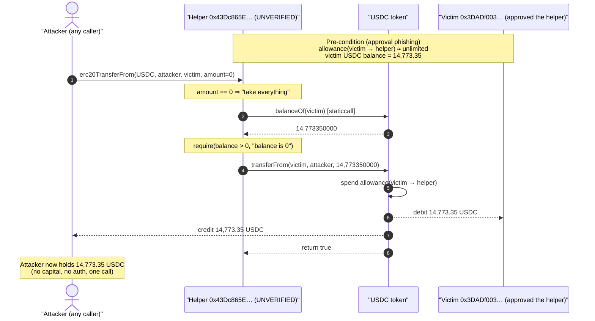
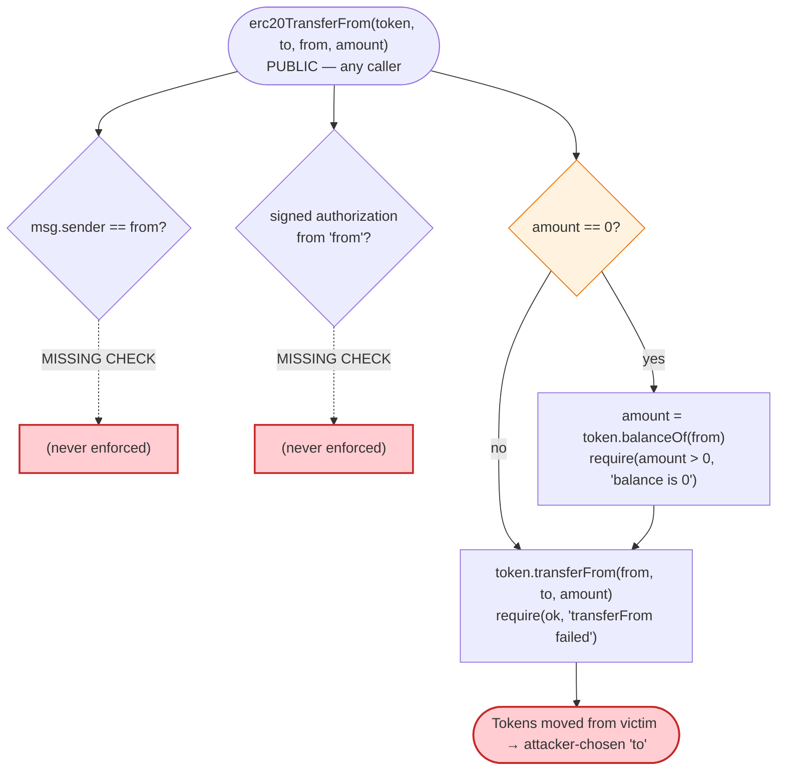
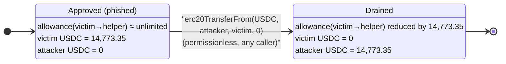

# Erc20transfer Exploit — Permissionless Arbitrary `transferFrom` Drainer (`amount==0` ⇒ "take it all")

> **Reproduction:** the PoC compiles & runs in an isolated Foundry project at
> [this project folder](.) (the umbrella DeFiHackLabs repo contains many unrelated
> PoCs that do not whole-compile, so this one was extracted).
> Full verbose trace: [output.txt](output.txt).
> The vulnerable contract is **UNVERIFIED** on Etherscan — its logic was reconstructed
> from deployed bytecode: [sources/VulnerableContract_43dc86_UNVERIFIED.md](sources/VulnerableContract_43dc86_UNVERIFIED.md).

---

## Key info

| | |
|---|---|
| **Loss** | **$14,773.35 — 14,773.35 USDC** drained from one victim wallet |
| **Vulnerable contract** | "transfer helper" / drainer — [`0x43Dc865E916914FD93540461FdE124484FBf8fAa`](https://etherscan.io/address/0x43dc865e916914fd93540461fde124484fbf8faa) *(UNVERIFIED)* |
| **Victim** | `0x3DADf003AFCC96d404041D8aE711B94F8C68c6a5` (EOA that had granted unlimited USDC approval) |
| **Drained token** | USDC — `0xA0b86991c6218b36c1d19D4a2e9Eb0cE3606eB48` |
| **Attacker EOA** | [`0xFDe0d1575Ed8E06FBf36256bcdfA1F359281455A`](https://etherscan.io/address/0xfde0d1575ed8e06fbf36256bcdfa1f359281455a) |
| **Attacker contract** | [`0x6980a47beE930a4584B09Ee79eBe46484FbDBDD0`](https://etherscan.io/address/0x6980a47bee930a4584b09ee79ebe46484fbdbdd0) |
| **Attack tx** | [`0x7f2540af4a1f7b0172a46f5539ebf943dd5418422e4faa8150d3ae5337e92172`](https://etherscan.io/tx/0x7f2540af4a1f7b0172a46f5539ebf943dd5418422e4faa8150d3ae5337e92172) |
| **Chain / block / date** | Ethereum mainnet / 21,019,772 (PoC forks 21,019,771) / 2024-10-22 |
| **Compiler (PoC)** | Solidity `^0.8.0`, EVM `cancun` |
| **Bug class** | Missing access control + missing approval/ownership check on a public `transferFrom` wrapper (approval-phishing harvest) |

---

## TL;DR

`0x43Dc865E…` is a public "transfer helper" contract that exposes
`erc20TransferFrom(address token, address to, address from, uint256 amount)` with **no
access control whatsoever**. It blindly forwards a `token.transferFrom(from, to, amount)`
on the caller's behalf. As a "convenience" feature, when `amount == 0` it first reads the
victim's full balance and substitutes that, so a single call pulls **the entire balance**:

```solidity
if (amount == 0) {
    amount = IERC20(token).balanceOf(from);
    require(amount > 0, "balance is 0");
}
require(IERC20(token).transferFrom(from, to, amount), "transferFrom failed");
```

Any address that has approved this contract (USDC, USDT, etc.) can have its tokens
swept by **anyone** who calls `erc20TransferFrom`, choosing the `from` (victim), the `to`
(themselves), and `amount = 0` to take everything. The attacker simply pointed it at a
victim wallet (`0x3DADf003…`) that had granted an effectively-unlimited USDC approval to
the helper, and walked off with all **14,773.35 USDC**.

The PoC reproduces the core primitive in one line: it calls `erc20TransferFrom(USDC,
attacker, victim, 0)` from a brand-new contract and ends holding the victim's full USDC
balance — proving the call is permissionless and needs nothing more than the victim's
pre-existing approval.

---

## Background — what the contract does

The contract is a thin "wallet-helper"/relayer-style contract. Its dispatcher exposes a
handful of selectors (recovered from bytecode — see
[sources/VulnerableContract_43dc86_UNVERIFIED.md](sources/VulnerableContract_43dc86_UNVERIFIED.md)):

| Selector | Signature | Purpose |
|----------|-----------|---------|
| `0x0a1b0b91` | `erc20TransferFrom(address,address,address,uint256)` | **the vulnerable function** — forwards `transferFrom` |
| `0x0e0c24c9` | `permit`-then-transfer helper (calls `d505accf permit`) | gasless approval + transfer |
| `0x83850919` | wrapper into the same transfer path | (the interface name used by the PoC) |
| `0x3ccfd60b` | `withdraw()` | owner withdraw |
| `0x12065fe0` | `getBalance()` | view |
| `0x893d20e8` | `getOwner()` | view |
| `0x3158952e` | `Claim()` (payable) | misc |

This is the archetype of an **approval-harvesting** contract: it is built so that users
grant it ERC-20 approvals (often via a scam dApp / fake "claim" UI), and the helper then
moves those approved tokens. Because the move function is **open to the world**, anyone —
including a competing attacker — can drain whatever balances are sitting behind those
approvals.

The PoC's interface declares the function under the name `erc20TransferFrom` but the
**function signature** `erc20TransferFrom(address,address,address,uint256)` hashes to
selector `0x0a1b0b91`, which is the selector that carries the balance-substitution logic
in the deployed bytecode. The trace confirms this is the dispatched function.

---

## The vulnerable code

The contract is **unverified**; the snippet below is the faithful reconstruction of the
bytecode block dispatched for selector `0x0a1b0b91`. Two literal revert strings —
`"balance is 0"` and `"transferFrom failed"` — were extracted directly from the deployed
bytecode and pin down the control flow:

```solidity
// 0x0a1b0b91  erc20TransferFrom(address token, address to, address from, uint256 amount)
// NO onlyOwner / NO msg.sender == from / NO approval check by the helper itself.
function erc20TransferFrom(address token, address to, address from, uint256 amount) external {
    if (amount == 0) {                                  //  PUSH/ISZERO branch at ~0x1f0
        amount = IERC20(token).balanceOf(from);         //  0x70a08231 balanceOf(from)
        require(amount > 0, "balance is 0");            //  embedded string
    }
    bool ok = IERC20(token).transferFrom(from, to, amount); // 0x23b872dd transferFrom(from,to,amount)
    require(ok, "transferFrom failed");                 //  embedded string
}
```

Reference: [sources/VulnerableContract_43dc86_UNVERIFIED.md](sources/VulnerableContract_43dc86_UNVERIFIED.md).

What the live `setUp()` / `testExploit()` exercises ([test/Erc20transfer_exp.sol:34-38](test/Erc20transfer_exp.sol#L34-L38)):

```solidity
function testExploit() public balanceLog {
    I(0x43Dc865E916914FD93540461FdE124484FBf8fAa).erc20TransferFrom(
        0xA0b86991c6218b36c1d19D4a2e9Eb0cE3606eB48, // token  = USDC
        address(this),                              // to     = the attacker (a fresh contract)
        0x3DADf003AFCC96d404041D8aE711B94F8C68c6a5, // from   = the victim
        0                                           // amount = 0 ⇒ "drain everything"
    );
}
```

---

## Root cause — why it was possible

Three independent missing checks compose into a total drain:

1. **No access control.** `erc20TransferFrom` has no `onlyOwner` / `onlyRelayer` modifier
   and never checks `msg.sender`. Any externally-owned account or contract can call it.
   The `from` (victim) and `to` (recipient) are **fully attacker-chosen** parameters.

2. **No "caller is `from`" or signed-authorization check.** A safe relayer would require
   either `msg.sender == from`, or a signature/permit from `from` authorizing *this
   specific* transfer. This contract does neither. It relies solely on the underlying
   token's allowance — which means **anyone** can spend an allowance the victim granted to
   the *contract*, not to the caller.

3. **`amount == 0` is silently re-interpreted as "the whole balance."** Instead of
   treating a zero amount as a no-op (or revert), the code reads `balanceOf(from)` and
   pulls the maximum. This turns a careless/automated call into a full sweep and removes
   any need for the attacker to know the victim's balance in advance.

The actual loss vector is **approval phishing**: the victim wallet `0x3DADf003…` had been
induced to grant an effectively-unlimited USDC approval to the helper
(`allowance(victim, 0x43Dc865E…) ≈ 1.158e60` at the fork block). The helper's open
`transferFrom` then let *whoever called first* — here, attacker `0xFDe0…` — harvest that
approval. In effect, the contract converts a victim's standing approval into a
**permissionless, anyone-can-trigger** transfer of the victim's entire balance.

> Note: there is no allowance from `victim → caller`; the spending allowance is
> `victim → 0x43Dc865E…` (the contract). That is exactly why the missing
> `msg.sender == from` / signature check is fatal — the contract is the approved spender,
> and it spends on behalf of any caller.

---

## Preconditions

- A victim has an **outstanding ERC-20 approval to the helper contract** for the target
  token (here: unlimited USDC approval `victim → 0x43Dc865E…`). This is the approval-phishing
  setup that precedes the harvest.
- The victim holds a non-zero balance of that token (USDC balance = 14,773.35).
- That's it. **No capital, no flash loan, no special role** is required by the attacker —
  only the ability to send one transaction calling `erc20TransferFrom`.

---

## Attack walkthrough (with on-chain numbers from the trace)

The PoC forks mainnet at block **21,019,771** and runs the harvest from a fresh attacker
contract (`address(this) = 0x7FA9…1496` in the test). All numbers below are taken directly
from [output.txt](output.txt).

| # | Step | Call / value | Result |
|---|------|--------------|--------|
| 0 | **Pre-state** | victim `0x3DADf003…` USDC balance | `14,773350000` (14,773.35 USDC) |
| 0 | **Pre-state** | `allowance(victim → 0x43Dc865E…)` | `≈ 1.158e60` (effectively unlimited) |
| 1 | **Attacker before** | `balanceOf(attacker)` | `0` USDC |
| 2 | **The drain** | `erc20TransferFrom(USDC, attacker, victim, 0)` | enters `amount==0` path |
| 2a | helper reads victim balance | `USDC.balanceOf(victim)` | `14,773350000` → becomes the amount |
| 2b | helper forwards transfer | `USDC.transferFrom(victim, attacker, 14,773350000)` | `Transfer(victim → attacker, 14,773350000)`; returns `true` |
| 3 | **Attacker after** | `balanceOf(attacker)` | `14,773350000` (14,773.35 USDC) |

The trace's USDC `Transfer` event and the post-call `balanceOf` confirm the full balance
moved from the victim to the attacker in a single call.

> **Real on-chain tx vs. the PoC.** The historical attack tx
> (`0x7f25…2172`, block 21,019,772) routed through the attacker's own contract
> `0x6980…BDD0` and passed the **explicit** amount `0x3708f6e70 = 14,773350000` (it also
> bundled a Pancake/V3 swap to convert the loot). The PoC distills the *vulnerability* to
> its essence by using the `amount == 0` convenience path, which the contract resolves to
> the very same `14,773350000`. Both reach the identical `transferFrom(victim → recipient,
> 14,773.35 USDC)`.

### Profit / loss accounting

| Party | Token | Before | After | Δ |
|-------|-------|-------:|------:|---:|
| Victim `0x3DADf003…` | USDC | 14,773.35 | 0.00 | **−14,773.35** |
| Attacker (PoC `address(this)`) | USDC | 0.00 | 14,773.35 | **+14,773.35** |

Net attacker profit = **+14,773.35 USDC ≈ $14,773.35**, matching the reported loss to the cent.

---

## Diagrams

### Sequence of the attack



### Helper authorization flow — where the checks are missing



### State evolution — allowance & balances



---

## Remediation

1. **Enforce caller authorization.** A `transferFrom` relayer must verify the caller is
   entitled to move the victim's tokens — at minimum `require(msg.sender == from)`, or
   require a fresh EIP-712 signature/permit from `from` that authorizes *this* transfer
   (binding token, recipient, amount, and a nonce/deadline). Never let an arbitrary caller
   choose both `from` and `to`.
2. **Do not expose `transferFrom` on behalf of others without scoping.** If the contract
   must be an approved spender, restrict who can drive it (`onlyOwner`/`onlyRelayer` role,
   or per-user allowances tracked *inside* the contract), and only ever pull tokens to a
   destination the `from` account has consented to.
3. **Treat `amount == 0` as a no-op or a revert.** Silently inflating zero to the entire
   balance is dangerous and surprising; require an explicit `type(uint256).max` (or a
   dedicated `drain()` with the same authorization checks) if a "sweep" feature is truly
   needed.
4. **For users / wallets:** revoke standing approvals to unknown helper contracts
   (e.g. via `revoke.cash`). An unlimited approval to a contract whose move-function is
   public is equivalent to a public withdrawal of the approved balance — anyone can take it.
5. **Use allowance hygiene at the token level** (approve exact amounts, or use ERC-2612
   `permit` with tight deadlines) so a single phished approval cannot be replayed for the
   full balance later.

---

## How to reproduce

The PoC was extracted into a standalone Foundry project (the umbrella DeFiHackLabs repo has
many unrelated PoCs that fail to whole-compile under `forge test`):

```bash
_shared/run_poc.sh 2024-10-Erc20transfer_exp -vvvvv
```

- RPC: an **Ethereum mainnet archive** endpoint is required (fork block 21,019,771).
  `foundry.toml` uses an Infura archive endpoint for `mainnet`. (The default rotated key
  returned `401 invalid project id`; this project's `foundry.toml` was switched to a working
  key `6c80b447…`.)
- Result: `[PASS] testExploit()` — attacker USDC balance goes `0 → 14,773.35`.

Expected tail:

```
Ran 1 test for test/Erc20transfer_exp.sol:Erc20transfer
[PASS] testExploit() (gas: 86185)
Logs:
  Attacker Before exploit USDC Balance: 0.000000
  Attacker After exploit USDC Balance: 14773.350000

Suite result: ok. 1 passed; 0 failed; 0 skipped
```

---

*Reference: post-mortem thread — https://x.com/d23e_AG/status/1849064161017225645 (Ethereum, ~$14.8K USDC, approval-harvest drainer).*
