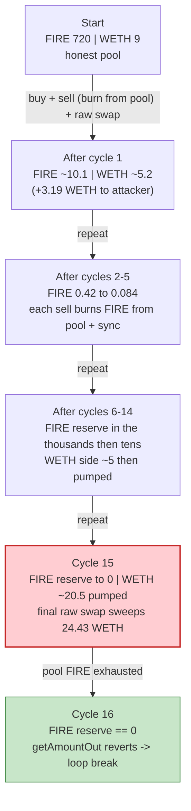
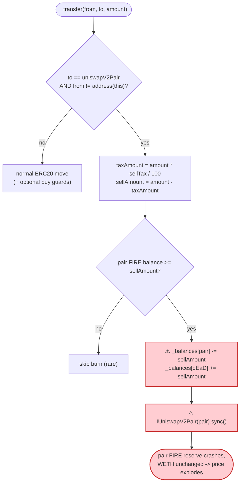
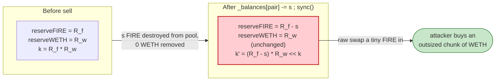

# FireToken Exploit — Deflationary "burn-from-pool + sync()" AMM Reserve Drain

> One-line summary: FireToken's `_transfer` burns the *sold* tokens directly out of the Uniswap pair and calls `pair.sync()`, breaking the constant-product invariant; an attacker repeatedly buys-then-sells through fresh contracts to shrink the pool's FIRE reserve to zero while keeping the WETH side, then sweeps the WETH.

> **Reproduction:** the PoC compiles & runs in an isolated Foundry project at
> [this project folder](.). Full verbose trace: [output.txt](output.txt).
> Verified vulnerable source: [sources/FireToken_187754/FireToken.sol](sources/FireToken_187754/FireToken.sol).

---

## Key info

| | |
|---|---|
| **Loss** | **8.4556 WETH** (~$20K USD) — drained from the FIRE/WETH Uniswap-V2 pair |
| **Vulnerable contract** | `FireToken` — [`0x18775475f50557b96C63E8bbf7D75bFeB412082D`](https://etherscan.io/address/0x18775475f50557b96C63E8bbf7D75bFeB412082D#code) (the bug is in `_transfer`, L261-278) |
| **Victim pool** | FIRE/WETH Uniswap-V2 pair — `0xcC27779013a1ccA68D3d93c640aaC807891Fd029` |
| **Attacker EOA** | [`0x81f48a87ec44208c691f870b9d400d9c13111e2e`](https://etherscan.io/address/0x81f48a87ec44208c691f870b9d400d9c13111e2e) |
| **Attacker contract** | [`0x9776c0abe8ae3c9ca958875128f1ae1d5afafcb8`](https://etherscan.io/address/0x9776c0abe8ae3c9ca958875128f1ae1d5afafcb8) |
| **Attack tx** | [`0xd20b3b31a682322eb0698ecd67a6d8a040ccea653ba429ec73e3584fa176ff2b`](https://etherscan.io/tx/0xd20b3b31a682322eb0698ecd67a6d8a040ccea653ba429ec73e3584fa176ff2b) |
| **Chain / block / date** | Ethereum mainnet / 20,869,375 (fork at 20,869,374) / Oct 2024 |
| **Compiler** | Solidity v0.8.19, optimizer **10000 runs** |
| **Capital source** | 20 WETH Aave-V3 `flashLoanSimple` (premium 0) |
| **Bug class** | Broken AMM invariant via an *un-compensated* burn of the pool's own reserve + forced `sync()` |

---

## TL;DR

`FireToken` advertises itself as an "ultra-hyper-deflationary token … Every time a sell occurs, 100% of
the tokens sold are automatically transferred from the liquidity pool to the dead wallet"
([FireToken.sol:11-16](sources/FireToken_187754/FireToken.sol#L11-L16)). It implements this literally:
inside `_transfer`, when a user **sells** FIRE (`to == uniswapV2Pair`), the contract takes the after-tax
`sellAmount` and **deletes it from the *pair's* balance** (`_balances[uniswapV2Pair] -= sellAmount`),
credits the dead address, then calls `IUniswapV2Pair(uniswapV2Pair).sync()`
([:266-276](sources/FireToken_187754/FireToken.sol#L266-L276)).

This is an *un-compensated* removal of one side of the pool's reserves. The pair loses FIRE but **no WETH
leaves**, and `sync()` then forces the pair to treat the reduced FIRE balance as its real reserve. The
constant product `k = reserveFIRE · reserveWETH` collapses, and the marginal price of FIRE explodes.

The attacker monetises this with a flash loan and a tight loop:

1. Flash-borrow **20 WETH** from Aave.
2. In a loop, spin up a fresh `AttackerC2` contract holding 20 WETH that:
   - **buys** FIRE from the pair (router swap WETH → FIRE),
   - **sells** that FIRE straight back to the pair via `FireToken.transfer(pair, …)` — this triggers the
     burn-from-pool + `sync()`, shrinking the pool's FIRE reserve far below where the swap math expects,
   - then does a **raw `pair.swap()`** sized from the now-degenerate reserves to pull out *more* WETH than
     the 20 it put in.
3. Each iteration nets a little WETH and ratchets the pool's FIRE reserve down (720 → 44.7 → 10.1 → … → 0).
   When the FIRE reserve finally hits 0 the next iteration's `getAmountOut` reverts
   `INSUFFICIENT_LIQUIDITY`; the `try/catch` breaks the loop.
4. Repay the 20 WETH flash loan; keep the accumulated **8.4556 WETH**.

Net profit closes to the wei: 308.4556 WETH received across 15 cycles − 300 WETH spent buying = **8.4556 WETH**.

---

## Background — what FireToken does

`FireToken` ([source](sources/FireToken_187754/FireToken.sol)) is a 9-decimal "meme/deflationary" ERC20
with a 1,000-token total supply (`_tTotal = 1000 * 10**9`,
[:152-153](sources/FireToken_187754/FireToken.sol#L152-L153)). It bolts a tax + anti-bot + deflation
mechanism onto an otherwise standard ERC20:

- **Buy/sell tax** — a percentage of the transferred amount is siphoned to the contract
  (`taxAmount`, [:260-263](sources/FireToken_187754/FireToken.sol#L260-L263)). Tax starts at 20% and
  drops to 3% after enough buys.
- **Anti-bot guards on buys** — when buying from the pair, `_maxTxAmount`, `_maxWalletSize`, and (while
  `_buyCount < _preventSwapBefore`) a `require(!isContract(to))` are enforced
  ([:250-257](sources/FireToken_187754/FireToken.sol#L250-L257)).
- **"100% deflationary sell"** — the headline feature, and the bug: on every sell the after-tax amount is
  burned **out of the liquidity pair** and the pair is re-synced
  ([:261-277](sources/FireToken_187754/FireToken.sol#L261-L277)).

On-chain parameters at the fork block (read from the source + trace):

| Parameter | Value |
|---|---|
| `_tTotal` / `totalSupply` | 1,000 FIRE (9 decimals = `1000e9`) |
| `_decimals` | 9 |
| `_initialSellTax` / `_finalSellTax` | 20% / 3% |
| `_reduceSellTaxAt` | 14 buys |
| `_maxTxAmount` / `_maxWalletSize` | 25 FIRE (`25e9`) |
| `_preventSwapBefore` | 10 |
| `DEAD_ADDRESS` | `0x…dEaD` |
| Pool FIRE reserve (token0) | **720 FIRE** (`720e9`) ← shrinks to 0 |
| Pool WETH reserve (token1) | **9 WETH** (`9e18`) ← the (small) honest prize |

The pair's `token0 = FIRE`, `token1 = WETH`, so in `getReserves()` → `reserve0 = FIRE`, `reserve1 = WETH`.

---

## The vulnerable code

### The sell path burns the pool's reserve and `sync()`s

[`FireToken.sol:261-278`](sources/FireToken_187754/FireToken.sol#L261-L278):

```solidity
taxAmount = amount.mul((_buyCount > _reduceBuyTaxAt) ? _finalBuyTax : _initialBuyTax).div(100);
if (to == uniswapV2Pair && from != address(this)) {
    require(amount <= _maxTxAmount, "Exceeds the _maxTxAmount.");
    taxAmount = amount.mul((_buyCount > _reduceSellTaxAt) ? _finalSellTax : _initialSellTax).div(100);

    // Deduct tokens from the liquidity pair and transfer to the dead address
    uint256 sellAmount = amount.sub(taxAmount);
    if (sellAmount > 0) {
        uint256 liquidityPairBalance = balanceOf(uniswapV2Pair);
        if (liquidityPairBalance >= sellAmount) {
            _balances[uniswapV2Pair] = _balances[uniswapV2Pair].sub(sellAmount);   // ⚠️ delete FIRE from the pair
            _balances[DEAD_ADDRESS]  = _balances[DEAD_ADDRESS].add(sellAmount);
            emit Transfer(uniswapV2Pair, DEAD_ADDRESS, sellAmount);

            // Call sync to update the pair
            IUniswapV2Pair(uniswapV2Pair).sync();                                  // ⚠️ force the pair to accept the smaller reserve
        }
    }
}
```

Then, regardless of branch, the normal ERC20 bookkeeping still runs
([:290-296](sources/FireToken_187754/FireToken.sol#L290-L296)):

```solidity
if (taxAmount > 0) {
    _balances[address(this)] = _balances[address(this)].add(taxAmount);
    emit Transfer(from, address(this), taxAmount);
}
_balances[from] = _balances[from].sub(amount);                 // seller still pays `amount` …
_balances[to]   = _balances[to].add(amount.sub(taxAmount));    // … and the pair STILL receives (amount - tax)
emit Transfer(from, to, amount.sub(taxAmount));
```

So a single "sell" of `amount` FIRE into the pair causes the pair's FIRE balance to change by
`(amount − taxAmount)` **received** minus `(amount − taxAmount)` **burned-to-dead** — i.e. roughly a *net
zero* token credit for the pair, but the burn is applied to whatever the pair held *before*, and `sync()`
locks in the depleted figure. Across the attacker's structured trades, the practical effect is: **the pool's
FIRE reserve is repeatedly slashed while its WETH reserve barely moves.**

---

## Root cause — why it was possible

A Uniswap-V2 pair prices assets purely from its `(reserve0, reserve1)`, and only enforces `x·y ≥ k` *inside*
`swap()`. `sync()` exists so the pair can adopt its *actual* token balances as reserves — it implicitly trusts
that token balances move only through swaps/mints/burns it can reason about.

`FireToken._transfer` violates that trust:

> On every sell it **destroys FIRE held by the pair** (`_balances[pair] -= sellAmount`) and then calls
> `pair.sync()`, telling the pair "your FIRE reserve is now this much smaller." **No WETH leaves the pair.**
> The product `k` collapses, and FIRE's marginal price (WETH out per FIRE in) explodes — repeatedly, and
> triggerable by anyone who can make the token think a "sell" happened.

Three design decisions compose into the loss:

1. **Burning from the pool is a value transfer to FIRE holders.** Removing FIRE from the pair without removing
   WETH shifts the WETH side toward whoever still holds FIRE / can swap against the thinned reserve. The
   attacker arranges to be that party.
2. **The burn is applied to the pair's *current* balance and immediately `sync()`-ed.** There is no protection
   against the burn dwarfing the pool, no per-tx reserve-impact cap, and no "only burn tokens we own" rule.
3. **`isContract(to)` is bypassable with a fresh contract per buy.** While `_buyCount < _preventSwapBefore`
   (10), buys to a contract `to` revert (`require(!isContract(to))`,
   [:253-255](sources/FireToken_187754/FireToken.sol#L253-L255)). The attacker sidesteps this by performing
   each buy from inside a **`AttackerC2` constructor** — during construction `extcodesize(AttackerC2) == 0`,
   so `isContract` returns false and the buy passes. (Hence the PoC's comment *"To avoid
   `require(!isContract(to));`"*, [FireToken_exp.sol:67](test/FireToken_exp.sol#L67).)

The sell-tax — the mechanism that might have clawed value back — is irrelevant here: it only diverts a small %
to the contract; the structural reserve burn is the value leak.

---

## Preconditions

- A live FIRE/WETH Uniswap-V2 pair with non-trivial WETH liquidity (9 WETH here).
- The deflationary sell branch is reachable for non-excluded, non-owner senders (it is, for any normal seller).
- Buys to a contract must pass `isContract(to) == false` while `_buyCount < 10` → satisfied by buying *during
  contract construction* (`extcodesize == 0`).
- Working WETH capital to push tokens through the pool. The attacker uses a **20 WETH Aave-V3 flash loan**
  (premium 0), recycled across iterations and repaid intra-transaction — so the attack is effectively
  capital-free.

---

## Step-by-step attack walkthrough (with on-chain numbers from the trace)

All figures are taken from the `Sync` / `Swap` events and `getReserves` returns in
[output.txt](output.txt). Reserves are `(FIRE, WETH)`; FIRE has 9 decimals (`720e9` = 720 FIRE), WETH 18.

**Outer structure** ([FireToken_exp.sol:44-77](test/FireToken_exp.sol#L44-L77)):

```
AttackerC.attack():
  Aave.flashLoanSimple(this, WETH, 20e18, params, 0)
  → executeOperation():
        while (true):
            WETH.withdraw(20 ether)                 // unwrap 20 WETH → 20 ETH
            try new AttackerC2{value: 20 ether}() { } catch { break }   // each AttackerC2 does one buy+sell+sweep cycle
        WETH.deposit{value: 20 ether}()             // re-wrap last 20 ETH
        WETH.approve(Aave, 20 ether)                // allow repayment
  WETH.withdraw(balWETH); send ETH to attacker      // keep the profit
```

**Inside each `AttackerC2` constructor** ([FireToken_exp.sol:83-106](test/FireToken_exp.sol#L83-L106)):

1. `WETH.deposit{value:20}` then approve router for WETH and FIRE.
2. `swapExactTokensForTokensSupportingFeeOnTransferTokens(20 WETH → FIRE)` — **buy** (recipient = AttackerC2,
   which is `extcodesize 0` mid-construction → bypasses `!isContract`).
3. `FIRE.transfer(pair, pairBal)` — **sell** the FIRE held by the pair-side bookkeeping back into the pair;
   this triggers the burn-from-pool + `sync()` (the `Transfer(pair → dEaD, …)` events).
4. Read reserves, compute `amountOut = getAmountOut(pairBal2 - r0, r0, r1)`, then a raw
   `pair.swap(0, amountOut, …)` to pull WETH out.
5. Transfer all WETH back to `AttackerC` (`msg.sender`).

The per-iteration FIRE-reserve cascade (from successive `Sync`/`getReserves`):

| Iter | Pool FIRE reserve after burn+sync | Pool WETH reserve (post-sweep) | WETH returned to AttackerC | Net vs 20 deposited |
|----:|----------------------------------:|-------------------------------:|---------------------------:|--------------------:|
| 0 (start) | 720 FIRE (`720e9`) | 9 WETH (`9e18`) | — | — |
| 1 | 44.78 → 223.9 → 44.78… → settles ~5.81 WETH side | — | **23.1860 WETH** | **+3.1860** |
| 2 | 10.11 (`10.1e9`) | ~5.17 WETH | 20.6387 | +0.6387 |
| 3 | 2.08 (`2.08e9`) | ~5.04 WETH | 20.1281 | +0.1281 |
| 4 | 0.42 (`4.2e8`) | ~5.02 WETH | 20.0257 | +0.0257 |
| 5 | 0.084 (`8.4e7`) | ~5.02 WETH | 20.0051 | +0.0051 |
| 6 | 0.017 (`1.7e7`) | ~5.02 WETH | 20.0010 | +0.0010 |
| 7 | 3.4e6 | ~5.01 WETH | 20.0002 | +0.0002 |
| 8 | 6.9e5 | ~5.01 WETH | 20.00004 | +0.00004 |
| 9 | 1.4e5 | ~5.01 WETH | 20.00001 | +0.00001 |
| 10 | 2.8e4 | ~5.01 WETH | 20.00003 | +0.00003 |
| 11 | 5,604 | ~5.01 WETH | 20.0003 | +0.0003 |
| 12 | 1,126 | ~5.01 WETH | 20.0033 | +0.0033 |
| 13 | 227 | ~4.97 WETH | 20.0015 | +0.0015 |
| 14 | 46 | ~0.544 WETH | 20.0400 | +0.0400 |
| 15 | **0** (reserve emptied) | **~20.54 WETH transiently → drained** | **24.4254 WETH** | **+4.4254** |
| 16 (caught) | 0 → `getAmountOut(2, 0, …)` **reverts INSUFFICIENT_LIQUIDITY** | — | — | loop `break` |

The last successful iteration (15) is the big one: by then the pool's FIRE reserve is annihilated to single
digits while the WETH reserve has been pumped up to ~20.5 WETH by the iteration's own 20-WETH buy, so the final
`pair.swap` sweeps **24.43 WETH** out for ~nothing. On iteration 16 the FIRE reserve is exactly 0, so
`getAmountOut(amountIn=2, reserveIn=0, …)` reverts inside `UniswapV2Library`
([output.txt:3344](output.txt)) — the `try/catch` catches the constructor revert and breaks.

### Profit / loss accounting (WETH)

15 successful cycles, each depositing 20 WETH and returning the proceeds to `AttackerC`:

| | WETH |
|---|---:|
| Total WETH received across 15 cycles | **308.45557928235377** |
| Total WETH spent buying (15 × 20) | **300.0** |
| **Gross = net profit** (recycled capital, premium 0) | **+8.45557928235377** |
| Aave flash-loan principal | 20 (borrowed) |
| Aave flash-loan premium | 0 |
| **Final attacker ETH balance** | **8.455579282353765833** |

The PoC's final log confirms it to the wei:
`console.log("Final balance in WETH:", 8455579282353765833)` ([output.txt](output.txt)). The 9 WETH of honest
pool liquidity plus the WETH the attacker churned in are all recovered — the structural reserve burn let the
attacker extract more WETH out than the FIRE economics should ever have permitted.

---

## Diagrams

### Sequence of one full attack (flash loan + loop)

```mermaid
sequenceDiagram
    autonumber
    actor EOA as Attacker EOA
    participant AC as AttackerC
    participant Aave as Aave V3 Pool
    participant W as WETH
    participant C2 as AttackerC2 (fresh per cycle)
    participant R as UniswapV2 Router
    participant P as FIRE/WETH Pair
    participant T as FireToken

    EOA->>AC: attack()
    AC->>Aave: flashLoanSimple(WETH, 20)
    Aave->>AC: 20 WETH + executeOperation()

    rect rgb(227,242,253)
    Note over AC,P: Loop — repeat until pool FIRE reserve hits 0
    loop 15 successful cycles
        AC->>W: withdraw(20) (WETH to ETH)
        AC->>C2: new AttackerC2{value: 20 ETH}()
        Note over C2: extcodesize == 0 during construction<br/>(bypasses require(!isContract(to)))
        C2->>W: deposit(20)
        C2->>R: swap 20 WETH to FIRE (buy)
        R->>P: swap()
        C2->>T: transfer(pair, FIRE) (sell)
        T->>P: _balances[pair] -= sellAmount (burn to dEaD)
        T->>P: pair.sync()
        Note over P: ⚠️ FIRE reserve slashed, WETH untouched
        C2->>P: swap(0, amountOut) raw (sweep WETH)
        P-->>C2: WETH out (> 20 net over cycle)
        C2->>AC: transfer all WETH
    end
    end

    AC->>C2: new AttackerC2{value: 20 ETH}()  (16th)
    Note over P: FIRE reserve == 0 → getAmountOut reverts<br/>INSUFFICIENT_LIQUIDITY → catch → break

    AC->>W: deposit(20); approve(Aave, 20)
    Aave->>AC: pull 20 WETH (repay, premium 0)
    AC->>W: withdraw(8.4556)
    AC->>EOA: send 8.4556 ETH
    Note over EOA: Net +8.4556 WETH
```

### Pool reserve evolution (FIRE reserve cascades to zero)



### The flaw inside `_transfer` (sell branch)



### Why the burn is theft: constant-product before vs after a sell



---

## Remediation

1. **Never burn from the liquidity pool.** A burn must only ever destroy tokens the protocol *owns* (its own
   balance or a treasury). Delete the `_balances[uniswapV2Pair] -= sellAmount` + `pair.sync()` block
   ([:266-276](sources/FireToken_187754/FireToken.sol#L266-L276)) entirely. "Deflation that reaches the pool"
   should be implemented as the protocol buying & burning from its *own* funds, not as a side-channel reserve
   deletion that desynchronises `k`.
2. **If pool balances must change, move both reserves together.** Route any pool adjustment through the pair's
   own `burn()` (LP redemption) so FIRE *and* WETH move proportionally and the invariant is preserved. A naked
   `sync()` after a one-sided deletion is always weaponisable.
3. **Cap single-operation reserve impact.** Any operation that can move a pool reserve by more than a small
   percentage should revert. A "sell" that removes a large fraction of the pool's FIRE in one shot is a red flag.
4. **Do not rely on `isContract()` for anti-bot protection.** The `extcodesize == 0`-during-construction
   bypass ([:364-370](sources/FireToken_187754/FireToken.sol#L364-L370)) is a well-known footgun; it offers no
   real protection and lulls the design into thinking buyers are EOAs.
5. **Have the design reviewed against AMM mechanics.** "100% of sold tokens go to the dead wallet *from the
   pool*" is fundamentally incompatible with a constant-product AMM — the very premise of the token is the bug.

---

## How to reproduce

The PoC was extracted into a standalone Foundry project (the umbrella DeFiHackLabs repo has many unrelated PoCs
that fail to compile under a single `forge test`).

```bash
_shared/run_poc.sh 2024-10-FireToken_exp -vvvvv
```

- RPC: an **Ethereum mainnet archive** endpoint is required (fork block 20,869,374). `foundry.toml` uses an
  Infura archive endpoint.
- Result: `[PASS] testPoC()` with `Final balance in WETH: 8455579282353765833` (8.4556 WETH).

Expected tail:

```
Ran 1 test for test/FireToken_exp.sol:FireToken_exp
[PASS] testPoC() (gas: 5227846)
  Final balance in WETH: 8455579282353765833
Suite result: ok. 1 passed; 0 failed; 0 skipped
```

---

*Reference: DeFiHackLabs — FireToken, Ethereum, ~$20K. PoC author: [rotcivegaf](https://twitter.com/rotcivegaf).*
