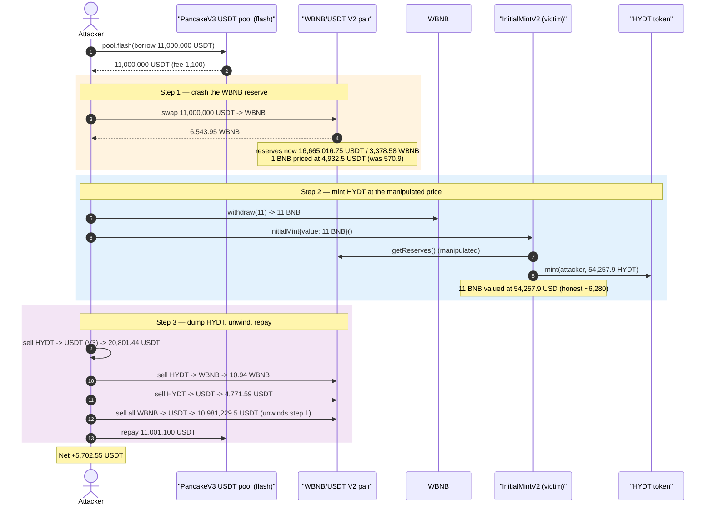
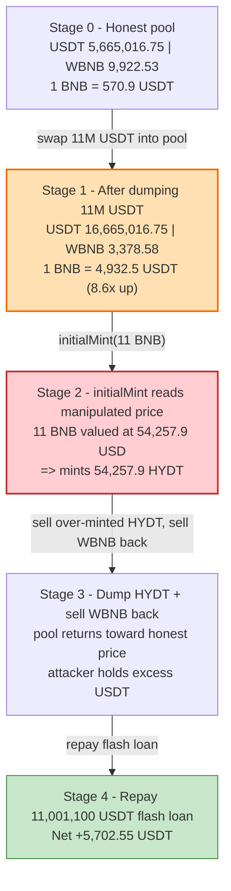
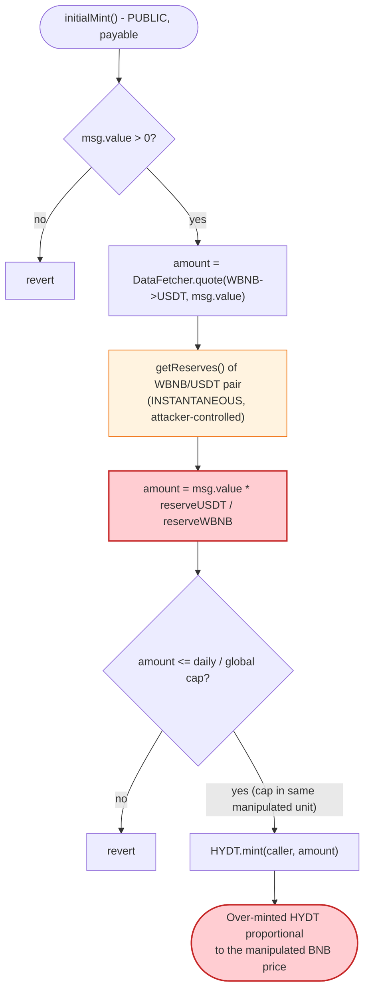

# HYDT Protocol Exploit — Spot-Reserve Oracle Lets `initialMint()` Print HYDT at a Manipulated BNB/USD Price

> **Reproduction:** the PoC compiles & runs in an isolated Foundry project at
> [this project folder](.) (the umbrella DeFiHackLabs repo contains many unrelated PoCs
> that do not whole-compile, so this one was extracted).
> Full verbose trace: [output.txt](output.txt).
> Verified vulnerable source: [contracts_InitialMintV2.sol](sources/InitialMintV2_A2268F/contracts_InitialMintV2.sol)
> and the oracle library [contracts_libraries_DataFetcher.sol](sources/InitialMintV2_A2268F/contracts_libraries_DataFetcher.sol).

---

## Key info

| | |
|---|---|
| **Loss** | ~$5,800 USDT (TenArmor / BlockSec figure). Reproduced net profit in this PoC: **5,702.55 USDT**, repaid an 11,000,000 USDT flash loan + 1,100 USDT fee. |
| **Vulnerable contract** | `InitialMintV2` — [`0xA2268Fcc2FE7A2Bb755FbE5A7B3Ac346ddFeDB9B`](https://bscscan.com/address/0xA2268Fcc2FE7A2Bb755FbE5A7B3Ac346ddFeDB9B#code) |
| **Same-bug contract** | `Reserve` (deposit pricing) — [`0xc5161aE3437C08036B98bDb58cfE6bBfF876c177`](https://bscscan.com/address/0xc5161aE3437C08036B98bDb58cfE6bBfF876c177#code) |
| **Minted asset** | `HYDT` stablecoin — [`0x9810512Be701801954449408966c630595D0cD51`](https://bscscan.com/address/0x9810512Be701801954449408966c630595D0cD51#code) |
| **Manipulated pool** | PancakeSwap V2 **WBNB/USDT** pair — `0x16b9a82891338f9bA80E2D6970FddA79D1eb0daE` |
| **Flash-loan source** | PancakeSwap V3 USDT pool — `0x92b7807bF19b7DDdf89b706143896d05228f3121` |
| **Attack tx** | `0xa9df1bd97cf6d4d1d58d3adfbdde719e46a1548db724c2e76b4cd4c3222f22b3` |
| **Chain / block / date** | BSC / 42,985,310 / October 10, 2024 |
| **Compiler** | PoC `^0.8.10`; victim `0.8.19` |
| **Bug class** | Oracle / price manipulation — spot AMM reserve ratio used as a trusted price feed |
| **Credit** | [@TenArmorAlert](https://x.com/TenArmorAlert/status/1844241843518951451) |

---

## TL;DR

HYDT is a USD-pegged stablecoin. Its `InitialMintV2.initialMint()` lets anyone send BNB and receive
HYDT **"at 1 HYDT per USD at current BNB/USD rates"**. The "current BNB/USD rate" is read with
`DataFetcher.quote(...)`, which is just the **instantaneous reserve ratio** of the PancakeSwap V2
WBNB/USDT pair:

```solidity
amountB = (amountA * reserveB) / reserveA;   // spot price, no TWAP, no slippage, no manipulation guard
```

([contracts_libraries_DataFetcher.sol:33-42](sources/InitialMintV2_A2268F/contracts_libraries_DataFetcher.sol#L33-L42))

Because that price comes straight from a manipulable pool, an attacker flash-borrows a huge amount of
USDT, dumps it into the WBNB/USDT pair to crash the WBNB reserve (making BNB look ~8.6× more
expensive), then calls `initialMint()` with a tiny 11 BNB. The protocol values those 11 BNB at
**54,257.9 USD** instead of the honest **~6,280 USD**, and mints **54,257.9 HYDT** to the attacker.
The attacker then sells the over-minted HYDT across PancakeSwap V2/V3, unwinds the manipulation,
repays the flash loan, and keeps the difference — **5,702.55 USDT**.

---

## Background — what HYDT / InitialMintV2 does

HYDT is the stable unit of the "Hydro Protocol" family on BSC. The relevant pieces:

- **`HYDT`** ([source](sources/HYDT_981051/contracts_HYDT.sol)) — an ERC20 whose `mint()` is gated by
  `CALLER_ROLE` (`mint(...) external override onlyRole(CALLER_ROLE)`,
  [contracts_HYDT.sol:69-71](sources/HYDT_981051/contracts_HYDT.sol#L69-L71)). The minting contracts
  hold that role; the attacker never calls `mint` directly.
- **`InitialMintV2`** ([source](sources/InitialMintV2_A2268F/contracts_InitialMintV2.sol)) — the bootstrap
  sale contract. Send BNB → it forwards the BNB to the `Reserve` and mints you HYDT equal to the
  **USD value** of the BNB you sent, "1 HYDT = 1 USD." It has a global cap (`INITIAL_MINT_LIMIT = 30,000,000`)
  and a per-day cap (`DAILY_INITIAL_MINT_LIMIT = 700,000`).
- **`Reserve`** ([source](sources/Reserve_c5161a/contracts_Reserve.sol)) — receives the BNB and tracks
  its USD value, again via `DataFetcher.quote(...)` ([contracts_Reserve.sol:63](sources/Reserve_c5161a/contracts_Reserve.sol#L63)).
- **`DataFetcher`** — the shared "oracle." It reads `getReserves()` of a PancakeSwap V2 pair and returns
  a pro-rata `quote`. **This is the entire price feed for the mint.**

The whole peg model assumes "BNB/USD as told by the WBNB/USDT pool" is trustworthy. It is not — a V2
pool reserve ratio can be moved arbitrarily within a single transaction.

---

## The vulnerable code

### 1. The mint prices BNB with a raw spot quote

```solidity
function initialMint() external payable {
    require(msg.value > 0, "InitialMint: insufficient BNB amount");
    ...
    // amount = USD value of the deposited BNB, read from the live pool reserves
    uint256 amount = DataFetcher.quote(PANCAKE_FACTORY, msg.value, WBNB, USDT);

    require(INITIAL_MINT_LIMIT >= initialMints.amount + amount, "...");
    require(DAILY_INITIAL_MINT_LIMIT >= dailyInitialMints.amount + amount, "...");
    initialMints.amount      += amount;
    dailyInitialMints.amount += amount;
    SafeETH.safeTransferETH(RESERVE, msg.value);
    HYDT.mint(_msgSender(), amount);   // ⚠️ mints 1 HYDT per "USD" of manipulated valuation

    emit InitialMint(_msgSender(), msg.value, amount, 1 * 1e18);
}
```

([contracts_InitialMintV2.sol:155-185](sources/InitialMintV2_A2268F/contracts_InitialMintV2.sol#L155-L185))

### 2. `quote` is a pure reserve ratio — no manipulation resistance

```solidity
function quote(address factory, uint256 amountA, address tokenA, address tokenB)
    internal view returns (uint256 amountB)
{
    require(amountA > 0, "DataFetcher: INSUFFICIENT_AMOUNT");
    (uint256 reserveA, uint256 reserveB) = getReserves(factory, tokenA, tokenB);
    amountB = (amountA * reserveB) / reserveA;   // ⚠️ instantaneous spot price
}
```

([contracts_libraries_DataFetcher.sol:33-42](sources/InitialMintV2_A2268F/contracts_libraries_DataFetcher.sol#L33-L42))

`getReserves` simply calls `IPancakePair(pair).getReserves()`
([contracts_libraries_DataFetcher.sol:21-31](sources/InitialMintV2_A2268F/contracts_libraries_DataFetcher.sol#L21-L31)),
the *current* reserves — which the attacker controls for the duration of the transaction.

### 3. The `Reserve` deposit path repeats the exact same flaw

```solidity
uint256 totalReserve = DataFetcher.quote(PANCAKE_FACTORY, totalReserveBNB, WBNB, USDT);
emit In(_msgSender(), msg.value, totalReserveBNB, totalReserve);
```

([contracts_Reserve.sol:63-65](sources/Reserve_c5161a/contracts_Reserve.sol#L63-L65)) — this is the
`In(..., 11e18, 136.34e18, 672509.03e18)` event seen in the trace at the moment of the mint.

---

## Root cause — why it was possible

A PancakeSwap/Uniswap V2 pair's `getReserves()` returns the *instantaneous* balances. The marginal
price `reserveUSDT / reserveWBNB` can be pushed to any value within one transaction by trading against
the pool — and reverted just as quickly. Using it as the **sole, un-averaged** price source for minting
a "stablecoin" means the attacker, not the market, decides how much HYDT each BNB is worth.

Concretely the design defects that compose into the bug:

1. **Spot oracle, no TWAP.** `DataFetcher.quote` is a one-block reserve ratio. There is no time-weighted
   average, no Chainlink feed, no sanity band. Whatever the pool says *right now* is taken as gospel.
2. **Permissionless mint at attacker-chosen price.** `initialMint()` is open to anyone; the attacker
   simply manipulates the pool first, then mints in the same transaction.
3. **The mint mints `amount` HYDT for a deposit valued at `amount` USD** — so over-pricing the BNB by
   8.6× over-mints HYDT by 8.6×. The over-minted HYDT is real, fungible, and immediately sellable.
4. **The caps are denominated in the same manipulated unit.** `DAILY_INITIAL_MINT_LIMIT = 700,000` USD
   is computed from the same manipulated `amount`, so 11 BNB inflated to 54,257 "USD" sails under the
   cap while actually being only ~6,280 USD of value — the cap never bites.

The attacker's profit is bounded by HYDT/USDT/WBNB liquidity available to dump the over-minted HYDT
(hence the relatively modest ~$5.8K despite an 8.6× mispricing), but the mechanism is a textbook
single-transaction spot-oracle manipulation.

---

## Preconditions

- `block.timestamp > _initialMints.startTime` (initial minting active — true at the fork block).
- The minted "USD" amount stays under `INITIAL_MINT_LIMIT` and `DAILY_INITIAL_MINT_LIMIT`. The
  inflated 54,257.9 "USD" is below the 700,000/day cap, so the mint succeeds.
- The WBNB/USDT V2 pair must be deep enough to swing the price but shallow enough on the WBNB side that
  11M USDT meaningfully crashes the WBNB reserve. At the fork block the pair held ~9,922 WBNB and
  ~5.66M USDT — perfect for this.
- Working capital to manipulate the pool. The attacker used an **11,000,000 USDT flash loan** from a
  PancakeSwap V3 pool (`0x92b7…3121`), fully repaid intra-transaction (fee 1,100 USDT).

---

## Attack walkthrough (with on-chain numbers from the trace)

The WBNB/USDT pair `0x16b9…0daE` has `token0 = USDT`, `token1 = WBNB`, so `reserve0 = USDT`,
`reserve1 = WBNB`. All figures are taken directly from the `getReserves`/`Sync`/`Swap`/`InitialMint`
events in [output.txt](output.txt).

| # | Step | Trace evidence | Result |
|---|------|----------------|--------|
| 0 | **Flash-borrow 11,000,000 USDT** from PancakeV3 pool `0x92b7…3121`; callback `pancakeV3FlashCallback(fee0 = 1,100 USDT)` | [output.txt:57-62](output.txt) | Attacker holds 11,000,000 USDT, owes 11,001,100. |
| 1 | **Crash the WBNB reserve** — swap all 11,000,000 USDT → WBNB on the WBNB/USDT V2 pair | pre-swap reserves USDT 5,665,016.75 / WBNB 9,922.53 ([:88](output.txt)); post-swap `Sync(USDT 16,665,016.75, WBNB 3,378.58)` ([:102](output.txt)); received **6,543.95 WBNB** ([:93](output.txt)) | Pool now prices **1 BNB ≈ 4,932.5 USDT** (honest was ≈ 570.9). |
| 2 | **`WBNB.withdraw(11)`** → 11 native BNB | [:110-113](output.txt) | Attacker has 11 BNB to feed the mint. |
| 3 | **`InitialMintV2.initialMint{value: 11 BNB}()`** — mint reads the manipulated pool | `getReserves → 16,665,016.75 USDT / 3,378.58 WBNB` ([:122-123](output.txt)); `InitialMint(user, 11e18, 54,257.9e18, 1e18)` ([:139](output.txt)) | 11 BNB valued at **54,257.9 USD** → **54,257.9 HYDT minted** (honest value ≈ 6,280 → ~8.64× over-mint). |
| 4 | **Sell ½ HYDT (27,128.95) on Pancake V3** HYDT→USDT | `exactInputSingle` ([:153](output.txt)); received **20,801.44 USDT** ([:156](output.txt)) | Realize part of the over-mint. |
| 5 | **Sell ¼ HYDT (16,339.65) → WBNB** on V2 | `Swap … amount1Out 10.94 WBNB` ([:224](output.txt)) | 10.94 WBNB. |
| 6 | **Sell remaining HYDT (16,339.65) → USDT** on V2 | `Swap … amount0Out 4,771.59 USDT` ([:267](output.txt)) | 4,771.59 USDT. |
| 7 | **Sell all WBNB (6,543.89) → USDT** on V2 (unwinds step 1 manipulation) | `Swap … amount0Out 10,981,229.5 USDT` ([:309](output.txt)) | 10,981,229.5 USDT back. |
| 8 | **Repay flash loan**: transfer 11,001,100 USDT to V3 pool | `Transfer … value 11,001,100` ([:317](output.txt)) | Debt cleared. |
| 9 | **Profit** | `[End] Attacker USDT after exploit: 5702.553132…` ([:338](output.txt)) | **+5,702.55 USDT**. |

### Price-manipulation math

| | Honest (pre-attack) | Manipulated (during mint) |
|---|---:|---:|
| WBNB/USDT reserves | 5,665,016.75 USDT / 9,922.53 WBNB | 16,665,016.75 USDT / 3,378.58 WBNB |
| Implied BNB price | `5,665,016.75 / 9,922.53` ≈ **570.9 USDT/BNB** | `16,665,016.75 / 3,378.58` ≈ **4,932.5 USDT/BNB** |
| Value of 11 BNB | ≈ **6,280 USD** | `11 × 16,665,016.75 / 3,378.58` ≈ **54,257.9 USD** |
| HYDT minted | (would be ≈ 6,280) | **54,257.9 HYDT** |
| Over-mint factor | — | **≈ 8.64×** |

### Profit accounting (USDT)

| Direction | Amount (USDT) |
|---|---:|
| Borrowed (flash) | 11,000,000.00 |
| Received — sell ½ HYDT on V3 | +20,801.44 |
| Received — sell ¼ HYDT → USDT on V2 | +4,771.59 |
| Received — sell all WBNB → USDT on V2 | +10,981,229.52 |
| (USDT consumed to acquire the 6,543.95 WBNB in step 1) | −11,000,000.00 |
| Repaid — flash principal + fee | −11,001,100.00 |
| **Net profit** | **+5,702.55** |

> The exact reconciliation is non-trivial because the attacker cycles USDT↔WBNB↔HYDT through three
> pools, but the trace's begin/end balances are unambiguous: **0 USDT in, 5,702.55 USDT out**, with the
> flash loan fully repaid. The profit is the over-minted HYDT's resale value net of the manipulation
> round-trip slippage and the 1,100 USDT flash fee.

---

## Diagrams

### Sequence of the attack



### Pool / price state evolution



### The flaw inside `initialMint` / `DataFetcher.quote`



---

## Remediation

1. **Do not price mints from a spot AMM reserve ratio.** Replace `DataFetcher.quote` with a
   manipulation-resistant oracle: a Chainlink BNB/USD feed (with staleness + deviation checks), or at
   minimum a Uniswap/Pancake V2 **TWAP** sampled over a window long enough that single-block
   manipulation is uneconomic.
2. **Sanity-band the price.** Reject mints when the AMM-derived BNB price deviates more than a small
   percentage from a trusted reference, so a flash-loan swing trips a revert instead of a mint.
3. **Apply the fix everywhere the same library is used.** `Reserve.in/withdraw`
   ([contracts_Reserve.sol:63,74](sources/Reserve_c5161a/contracts_Reserve.sol#L63)) and
   `InitialMintV2.getCurrentPrice/initialMint` all funnel through `DataFetcher.quote`/`quoteRouted`;
   fixing only one path leaves the protocol exploitable through the others.
4. **Denominate caps in a trusted unit.** The daily/global mint caps are meant as circuit breakers but
   are computed from the manipulated valuation, so they never engage. Compute them against the
   oracle-validated USD value.
5. **Consider mint cooldowns / per-tx limits.** Even with a better oracle, allowing an unbounded mint in
   a single transaction concentrates risk; small per-transaction limits blunt any residual mispricing.

---

## How to reproduce

The PoC was extracted into a standalone Foundry project (the umbrella DeFiHackLabs repo has many
unrelated PoCs that fail to whole-compile under `forge test`):

```bash
_shared/run_poc.sh 2024-10-HYDT_exp -vvvvv
```

- RPC: a **BSC archive** endpoint is required (fork block 42,985,310). `foundry.toml` uses
  `https://bsc-mainnet.public.blastapi.io`, which serves historical state at that block; the default
  setup endpoint (`bnb.api.onfinality.io/public`) rate-limited (HTTP 429) and was swapped out.
- Result: `[PASS] testExploit()` with the attacker ending with **5,702.55 USDT** profit from a zero
  starting balance.

Expected tail:

```
Ran 1 test for test/HYDT_exp.sol:ContractTest
  [Begin] Attacker USDT before exploit: 0.000000000000000000
  pancakeV3FlashCallback
  [End] Attacker USDT after exploit: 5702.553132048443050854
[PASS] testExploit() (gas: 3222603)
Suite result: ok. 1 passed; 0 failed; 0 skipped
```

---

*Reference: TenArmor alert — https://x.com/TenArmorAlert/status/1844241843518951451 ; BlockSec explorer
tx `0xa9df1bd97cf6d4d1d58d3adfbdde719e46a1548db724c2e76b4cd4c3222f22b3` (BSC, ~$5.8K).*
