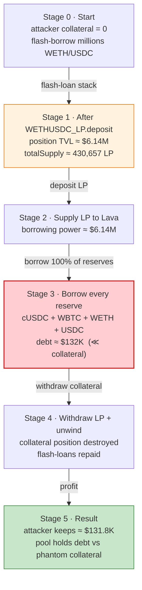
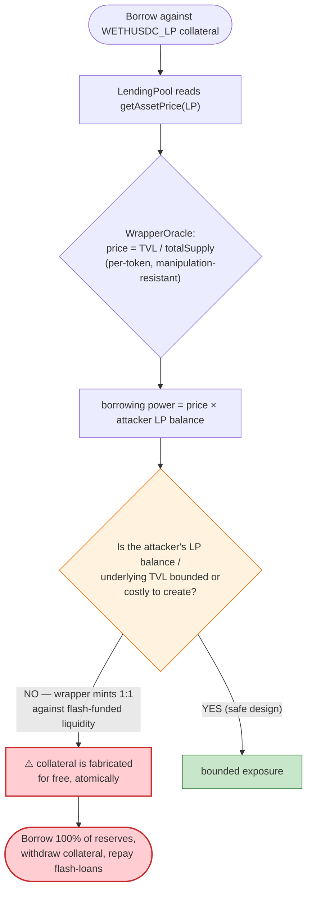

# Lava Lending Exploit — Flash-Inflated Uniswap-V3-LP Collateral Drains an Aave-V2 Fork

> **Vulnerability classes:** vuln/oracle/price-manipulation · vuln/governance/flash-loan-attack

> A self-funded Uniswap-V3 LP-wrapper position is used as collateral in an Aave-V2-style lending
> market, inflated with stacked flash-loans, and then used to borrow out **100% of every reserve**
> before the collateral is withdrawn — leaving the pool with bad debt.

> **Reproduction:** the PoC compiles & runs in an isolated Foundry project at
> [this project folder](.). Full verbose trace: [output.txt](output.txt).
> The LP-pricing oracle source is verified: [WrapperOracle](sources/WrapperOracle_D13a2f/src_UniV3_oracle_WrapperOracle.sol)
> and [ChangeDenominator](sources/ChangeDenominator_142247/src_UniV3_oracle_ChangeDenominator.sol).
> The lending market (Aave-V2 fork) is verified: [LendingPool / GenericLogic](sources/LendingPool_ed482b/contracts_protocol_libraries_logic_GenericLogic.sol).
> The LP-wrapper token itself (`0x6700…`) is **UNVERIFIED** on Arbiscan — its internals are
> reconstructed from the trace and the verified oracle's interface.

---

## Key info

| | |
|---|---|
| **Loss** | ~**$131.8K** — 1 USDC, 125,795.6 USDC (cUSDC reserve), 0.00679 WBTC, 2.25 WETH |
| **Vulnerable contract (collateral)** | `WETHUSDC_LP` ("Uniswap V3 WETH USDC LP" wrapper) — [`0x6700b021a8bCfAE25A2493D16d7078c928C13151`](https://arbiscan.io/address/0x6700b021a8bCfAE25A2493D16d7078c928C13151) |
| **Victim protocol** | Lava Lending — Aave-V2 fork `LendingPool` proxy [`0x3Ff516B89ea72585af520B64285ECa5E4a0A8986`](https://arbiscan.io/address/0x3Ff516B89ea72585af520B64285ECa5E4a0A8986) (impl `0xed482B…`) |
| **LP price oracle** | `ChangeDenominator` [`0x142247F71B11da7C6F3FCF01Af9908Db814c6eb9`](https://arbiscan.io/address/0x142247F71B11da7C6F3FCF01Af9908Db814c6eb9) → `WrapperOracle` [`0xD13a2f836B60847D72d5E6eDe6dBD0d604D27C0c`](https://arbiscan.io/address/0xD13a2f836B60847D72d5E6eDe6dBD0d604D27C0c) |
| **Attacker EOA** | [`0x8a0dfb61cad29168e1067f6b23553035d83fcfb2`](https://arbiscan.io/address/0x8a0dfb61cad29168e1067f6b23553035d83fcfb2) |
| **Attack contract** | [`0x69fa61eb4dc4e07263d401b01ed1cfceb599dab8`](https://arbiscan.io/address/0x69fa61eb4dc4e07263d401b01ed1cfceb599dab8) |
| **Attack tx** | [`0xb5cfa4ae4d6e459ba285fec7f31caf8885e2285a0b4ff62f66b43e280c947216`](https://arbiscan.io/tx/0xb5cfa4ae4d6e459ba285fec7f31caf8885e2285a0b4ff62f66b43e280c947216) |
| **Chain / block / date** | Arbitrum One / 259,645,908 / Oct 2024 |
| **Compiler** | LendingPool: Solidity 0.6.12 · Oracle: Solidity ≥0.8.0 |
| **Bug class** | Manipulable LP-token collateral oracle + self-controllable, flash-inflated collateral position |

---

## TL;DR

Lava Lending is an Aave-V2 fork that accepts a **fungible wrapper token for a Uniswap-V3 WETH/USDC
position** (`WETHUSDC_LP`, `0x6700…`) as collateral. The lending pool values that collateral by
calling its price oracle, which ultimately resolves to a MakerDAO-`GUniLPOracle`-style
[`WrapperOracle.latestAnswer()`](sources/WrapperOracle_D13a2f/src_UniV3_oracle_WrapperOracle.sol#L162-L182):

```
LP price = (r0·p0 + r1·p1) / totalSupply
```

where `r0, r1` are the *fair reserves* of the underlying UniV3 position (computed at a
Chainlink-derived `sqrtPriceX96`, so the price-per-token is **not** spot-manipulable) and
`totalSupply` is the wrapper's share supply.

The flaw is **not** in the per-token price calculation — it is that the **collateral position
itself is fully attacker-controlled and can be created/destroyed for free inside one transaction**.
The wrapper's `deposit()` pulls real WETH+USDC into the UniV3 position and mints LP shares 1:1 to the
caller. So an attacker who flash-borrows millions of WETH/USDC can:

1. **Stack four flash-loans** (Algebra → Aave-V3 → Saddle/SwapFlashLoan → Balancer) to amass
   working capital with no collateral.
2. **`deposit()` ≈ 1,403 WETH + 2.71M USDC** into the `WETHUSDC_LP` wrapper, minting itself
   ~430,623 LP shares backed by a **$6.14M** fair-valued UniV3 position.
3. **Supply those LP shares to Lava Lending** — borrowing power jumps to ≈ $6.14M.
4. **Borrow 100% of every reserve** (cUSDC, WBTC, WETH, USDC) — sized to each reserve's full aToken
   balance.
5. **Withdraw / unwind the LP collateral and repay the flash-loans**, keeping the borrowed reserves.
   Because the borrowed assets (~$132K) are dwarfed by the inflated collateral, the lending pool's
   health checks pass at every step, and the attacker simply walks the loans out the door.

Net result: the attacker drains the lending pool of ~**$131.8K** and leaves it holding worthless
"debt" against a collateral position that no longer exists.

---

## Background — what Lava Lending is

Lava Lending is a near-verbatim **Aave V2** fork deployed on Arbitrum. Its
[`LendingPool`](sources/LendingPool_ed482b/contracts_protocol_lendingpool_LendingPool.sol) supports
`deposit`/`withdraw`/`borrow`/`repay` against per-asset reserves, each with its own LTV and
liquidation threshold, valued through an
[`AaveOracle`](sources/AaveOracle_11A859/contracts_misc_AaveOracle.sol).

The distinctive (and fatal) feature is that one of the listed collateral assets is **not a simple
ERC20** but `WETHUSDC_LP` (`0x6700…`), a wrapper that represents a managed Uniswap-V3 WETH/USDC
liquidity position as a fungible, 12-decimal ERC20. Its on-chain identity:

| Property | Value |
|---|---|
| `name()` | `"Uniswap V3 WETH USDC LP"` |
| `symbol()` | `"WETH-USDC LP"` |
| `decimals()` | `12` |
| `token0()` | WETH (`0x82aF…Bab1`) |
| `token1()` | USDC.e (`0xFF970A…5CC8`) |
| `totalSupply()` @ fork block | 33,076,054,894,077 ≈ **33.08 LP** |
| Underlying UniV3 pool | `0xC31E…fa443` (WETH/USDC 0.05%) |

The wrapper exposes a `deposit(startKey, assetType, vaultId, quantizedAmount)` /
`compound()` / `withdraw(amount)` interface, and the oracle-facing
`getAssetsBasedOnPrice(uint160 sqrtPriceX96)` → `(amount0, amount1)`.

To price this LP collateral, Lava registered a chain of two contracts in `AaveOracle`:

```
AaveOracle.getAssetPrice(WETHUSDC_LP)
   └─ ChangeDenominator.latestAnswer()          // re-denominates token/USD ÷ USD/USD
        └─ WrapperOracle.latestAnswer()         // GUniLPOracle-style: TVL / totalSupply
             ├─ Chainlink WETH/USD  → 244509000000  ($2,445.09)
             ├─ Chainlink USDC/USD  → 100000648     ($1.00)
             └─ WETHUSDC_LP.getAssetsBasedOnPrice(fairSqrtPriceX96)
```

---

## The vulnerable code

### 1. The LP-token collateral is priced as `TVL / totalSupply`

[`WrapperOracle.latestAnswer()`](sources/WrapperOracle_D13a2f/src_UniV3_oracle_WrapperOracle.sol#L162-L182):

```solidity
function latestAnswer() public view override returns (int256) {
    uint256 p0 = _getWADPrice(true);   // token0 (WETH) USD price, from Chainlink
    uint256 p1 = _getWADPrice(false);  // token1 (USDC) USD price, from Chainlink

    // sqrtPriceX96 derived from the *Chainlink* prices — NOT the pool spot price
    uint160 sqrtPriceX96 = _toUint160(_sqrt(_mul(_mul(p0, UNIT_1), (1 << 96)) / (_mul(p1, UNIT_0))) << 48);

    // fair reserves of the underlying position at that price
    (uint256 r0, uint256 r1) = IWrapper(pool).getAssetsBasedOnPrice(sqrtPriceX96);
    require(r0 > 0 || r1 > 0, "invalid-balances");
    uint256 totalSupply = IWrapper(pool).totalSupply();
    uint256 decimals    = IWrapper(pool).decimals();
    require(totalSupply >= 1e9, "total-supply-too-small");

    // Token Price = TVL / Token Supply
    uint256 preq = _add(_mul(p0, _mul(r0, TO_WAD_0)), _mul(p1, _mul(r1, TO_WAD_1))) / totalSupply;
    return int256(preq / (10 ** (18 - decimals)));
}
```

This is faithful to MakerDAO's `GUniLPOracle` and is **resistant to the usual spot-price
manipulation** (line [28](sources/WrapperOracle_D13a2f/src_UniV3_oracle_WrapperOracle.sol#L28): "We
derive the sqrtPriceX96 via Chainlink Oracles to prevent price manipulation in the pool"). The
*per-token* price it produces is honest.

### 2. The lending pool multiplies that price by the user's *raw* collateral balance

[`GenericLogic.calculateUserAccountData`](sources/LendingPool_ed482b/contracts_protocol_libraries_logic_GenericLogic.sol#L185-L199):

```solidity
vars.tokenUnit       = 10**vars.decimals;
vars.reserveUnitPrice = IPriceOracleGetter(oracle).getAssetPrice(vars.currentReserveAddress); // LP price

if (vars.liquidationThreshold != 0 && userConfig.isUsingAsCollateral(vars.i)) {
    vars.compoundedLiquidityBalance = IERC20(currentReserve.aTokenAddress).balanceOf(user);

    uint256 liquidityBalanceETH =
        vars.reserveUnitPrice.mul(vars.compoundedLiquidityBalance).div(vars.tokenUnit);

    vars.totalCollateralInETH = vars.totalCollateralInETH.add(liquidityBalanceETH);   // ← borrowing power
    ...
}
```

Borrowing power is `LP_price × (LP shares supplied)`. Both factors are **controlled by the
attacker**: `LP_price` is `TVL/totalSupply` and the attacker mints as many shares (and as large an
underlying position) as a flash-loan can fund.

### 3. The wrapper mints/burns shares 1:1 against deposited liquidity

The `WETHUSDC_LP` wrapper (`0x6700…`, unverified) behaves like a Gelato/Arrakis G-UNI vault:
`deposit()` transfers the caller's WETH + USDC into its UniV3 position and mints shares; `withdraw()`
burns shares and returns the underlying. Crucially **anyone can grow the position arbitrarily and get
collateral credit for it**, then shrink it back. The trace shows the wrapper's `totalSupply` swinging
from 33.08 LP → ~430,657 LP (after the big deposit) and back down to ~2.14 LP (after the unwind) over
the course of the single attack transaction.

---

## Root cause — why it was possible

The oracle did its job (manipulation-resistant *per-token* pricing). The vulnerability is at the
**protocol-design layer**:

1. **The collateral asset is freely self-mintable inside one transaction.** Accepting a UniV3-LP
   wrapper whose supply and underlying TVL are unbounded and attacker-controllable means an attacker
   can synthesize *any amount* of "collateral" with borrowed capital, take loans against it, and
   destroy it again — all atomically. There is no cost basis and no time at risk.

2. **Borrowing power scales linearly with attacker-supplied balance.** `liquidityBalanceETH =
   price × balance`. With a flash-funded $6.14M position, the attacker's borrowing power (even at a
   conservative LTV) far exceeds the ~$132K of reserves actually present, so every `validateBorrow`
   health check trivially passes.

3. **No protection against "borrow then withdraw collateral" within the same atomic context.**
   Because the borrowed reserves (~$132K) are tiny relative to the inflated collateral, the
   position's health factor stays above 1 even *after* the borrows, letting the attacker withdraw the
   LP collateral, unwind the underlying liquidity, repay the flash-loans, and keep the loans. The
   pool is left with debt positions backed by a phantom LP balance.

4. **Flash-loanability removes the capital requirement entirely.** Four nested flash-loans provide
   the WETH+USDC needed to inflate the position, so the attack costs only gas.

In short: a manipulation-*resistant* oracle does not save a lending market that lets a borrower
**fabricate the collateral itself**. The correct mitigation is to never accept self-mintable,
flash-inflatable LP wrappers as collateral (or to bound/oracle the *total* position value, not the
attacker's instantaneous share balance).

---

## Preconditions

- `WETHUSDC_LP` is a listed, collateral-enabled reserve in Lava Lending with a non-zero LTV /
  liquidation threshold.
- The wrapper's `deposit()` mints shares to the caller against liquidity it pulls in, and `withdraw()`
  returns it — i.e. the position is freely growable/shrinkable by the borrower.
- Flash-loan liquidity available for WETH and USDC (Algebra, Aave V3, Saddle/SwapFlashLoan, Balancer
  all hold enough) to inflate the underlying position. The whole attack is atomic and self-financing.
- The four target reserves (cUSDC, WBTC, WETH, USDC) hold withdrawable liquidity in their aTokens.

---

## Attack walkthrough (with on-chain numbers from the trace)

All figures are taken from [output.txt](output.txt). The attacker nests four flash-loans, then
operates entirely inside the innermost (`receiveFlashLoan`) callback.

| # | Step | Trace evidence | Effect |
|---|------|----------------|--------|
| 0 | **Flash-loan stack** | `AlgebraPool.flash` (L45) → `aavePoolV3.flashLoan` 1,500 WETH + 8M cUSDC + 1.139M USDC (L65) → `SwapFlashLoan.flashLoan` (L137) → `balancerVault.flashLoan` 1.255M USDC (L156) | Amasses millions of WETH/USDC with zero collateral. |
| 1 | **Mint inflated LP** — `WETHUSDC_LP.deposit(1.403e21, …)` (L198) | wrapper pulls ≈ **1,402.89 WETH + 2,705,510 USDC** into its UniV3 position; mints LP to attacker | `getAssetsBasedOnPrice(fair) → (1402.89 WETH, 2,705,510 USDC)`, `totalSupply ≈ 430,657 LP`. Position TVL ≈ **$6.14M**. |
| 2 | **Supply LP as collateral** — `LendingPool.deposit(WETHUSDC_LP, …)` | aToken `0x2254898…` minted to attacker | `getUserAccountData` (L507) → huge `totalCollateralETH`; borrowing power ≈ $6.14M. |
| 3 | **AttackerC2 sub-borrow** — deposit cUSDC, `borrow(WETHUSDC_LP, 0.4306 LP)` (L691) | grabs more LP shares cheaply | Splits collateral across two accounts to maximise extractable value. |
| 4 | **Reshape position** — `compound()` (L937), `withdraw()` (L966), 2nd `deposit()` (L1022), UniV3 `swap`s (L1119, L2053) + `flash` (L1847) | wrapper `totalSupply` shrinks toward ~2.14 LP while position composition is re-tuned | Tunes the position so the borrows can be taken and the collateral later pulled out. |
| 5 | **Drain reserve 1** — `borrow(cUSDC, 6,630,792,705,184)` (L2785) | == full cUSDC reserve aToken balance (L2702) | Attacker takes **100%** of the cUSDC reserve. |
| 6 | **Drain reserve 2** — `borrow(WBTC, 679,208)` (L2932) | sized to full WBTC reserve | Takes all available WBTC. |
| 7 | **Drain reserve 3** — `borrow(WETH, 153,407,712,731,719,084)` (L3127) | sized to full WETH reserve | Takes all available WETH. |
| 8 | **Drain reserve 4** — `borrow(USDC, 298,077,739)` (L3332) | sized to full USDC reserve | Takes all available USDC. |
| 9 | **Unwind & repay** — `LendingPool.withdraw(WETHUSDC_LP, …)` (L855), `WETHUSDC_LP.withdraw()` (L1892), Uniswap/Algebra swaps, flash-loan repayments (L307, L173, L126) | LP collateral pulled out; position deflated; all flash-loans repaid | Lending pool left with bad debt; attacker keeps the borrowed reserves. |

### Oracle price arithmetic (verified against the trace)

At one of the borrow-time `getAssetPrice(WETHUSDC_LP)` calls (around L2802), the wrapper reported a
small re-tuned position and `WrapperOracle.latestAnswer()` returned `19,882,470,829,012,667,148`.
Recomputing from the trace inputs reproduces it **to the wei**:

```
amount0 = 6,977,753,674,067,197 wei WETH  (0.006978 WETH)      # from getAssetsBasedOnPrice
amount1 = 25,523,659 USDC                 (25.52 USDC)
p0      = 2445.09e18  (WETH/USD WAD)       p1 = 1.00000648e18  (USDC/USD WAD)
totalSupply = 2,141,839,436,882           (2.1418 LP, 12 dec)

preq  = (p0·amount0·1 + p1·amount1·1e12) / totalSupply
price = preq / 10^(18-12)  =  19,882,470,829,012,667,148   ✓  (matches on-chain)
```

The point is that the *per-token* number is honest — the exploit lives in the attacker's freedom to
choose how large the underlying position (and hence their collateral credit) is at the moment of
borrowing.

### Profit accounting

| Asset | Amount kept | Decimals | ≈ USD |
|---|---:|---:|---:|
| USDC | 1 | 6 | $1 |
| cUSDC (native USDC reserve) | 125,795.603292 | 6 | $125,796 |
| WBTC | 0.00679208 | 8 | ~$460 |
| WETH | 2.250000000003 | 18 | ~$5,501 |
| **Total** | | | **≈ $131,758** |

(Matches the PoC header's "1 USDC, 125795.6 cUSDC, 0.0067 WBTC, 2.25 WETH (~$130K)".)

---

## Diagrams

### Sequence of the attack

```mermaid
sequenceDiagram
    autonumber
    actor A as Attacker (AttackerC)
    participant FL as "Flash lenders<br/>(Algebra/Aave/Saddle/Balancer)"
    participant W as "WETHUSDC_LP wrapper<br/>(0x6700)"
    participant U as "UniV3 WETH/USDC pool<br/>(0xC31E)"
    participant L as "Lava LendingPool<br/>(0x3Ff5)"
    participant O as "LP oracle<br/>(ChangeDenominator→WrapperOracle)"

    rect rgb(227,242,253)
    Note over A,FL: Step 0 — stack 4 flash-loans (no collateral)
    A->>FL: flash WETH + USDC (millions)
    end

    rect rgb(255,243,224)
    Note over A,U: Step 1 — fabricate collateral
    A->>W: deposit(~1,403 WETH + ~2.71M USDC)
    W->>U: add liquidity to UniV3 position
    W-->>A: mint ~430,623 LP shares
    Note over W: position TVL ≈ $6.14M
    end

    rect rgb(232,245,233)
    Note over A,O: Step 2 — supply LP, get borrowing power
    A->>L: deposit(WETHUSDC_LP, LP shares)
    L->>O: getAssetPrice(WETHUSDC_LP)
    O->>W: getAssetsBasedOnPrice(fairSqrtPriceX96)
    W-->>O: (fair r0, r1)
    O-->>L: price = TVL / totalSupply
    Note over L: totalCollateralETH ≈ $6.14M
    end

    rect rgb(255,235,238)
    Note over A,L: Steps 5–8 — drain every reserve (full balances)
    A->>L: borrow cUSDC (entire reserve)
    A->>L: borrow WBTC (entire reserve)
    A->>L: borrow WETH (entire reserve)
    A->>L: borrow USDC (entire reserve)
    end

    rect rgb(243,229,245)
    Note over A,FL: Step 9 — pull collateral, unwind, repay flash-loans
    A->>L: withdraw(WETHUSDC_LP)
    A->>W: withdraw() (burn LP, recover liquidity)
    A->>FL: repay all flash-loans
    end

    Note over A: keeps ~$131.8K of borrowed reserves; pool left with bad debt
```

### Collateral vs. debt over the attack



### Why the design is unsound



---

## Remediation

1. **Do not accept self-mintable / flash-inflatable LP wrappers as collateral.** A collateral asset
   whose supply and underlying value can be created and destroyed atomically by the borrower violates
   the basic lending assumption that collateral has a stable, externally-set value. This is the root
   fix.
2. **If LP collateral is required, decouple borrowing power from the borrower's instantaneous
   balance.** Use supply caps, per-block/borrow-time mint-and-borrow guards, or a settled (e.g.
   previous-block / time-weighted) collateral snapshot so that liquidity minted in the same
   transaction as a borrow cannot count toward borrowing power.
3. **Add a same-transaction borrow-then-withdraw guard.** Disallow withdrawing collateral that was
   deposited, and borrowing against it, within the same transaction (or enforce a minimum holding
   period / re-check health post-withdraw against a settled snapshot).
4. **Bound single-operation collateral impact.** Reject deposits that would let one account's
   collateral exceed a sane fraction of total pool liquidity, and rate-limit LP wrapper
   mint/burn within the lending context.
5. **General principle:** a manipulation-resistant *price* oracle (here, the `GUniLPOracle`-style
   `WrapperOracle`) is necessary but **not sufficient** — the protocol must also ensure the
   *quantity* of collateral cannot be fabricated. Lava had the former and lacked the latter.

---

## How to reproduce

The PoC was extracted into a standalone Foundry project (the umbrella DeFiHackLabs repo has many
unrelated PoCs that fail to compile under a single `forge test` build):

```bash
_shared/run_poc.sh 2024-10-LavaLending_exp -vvvvv
```

- RPC: an **Arbitrum archive** endpoint is required (fork block 259,645,907). `foundry.toml` uses an
  Infura key with Arbitrum access (`…<YOUR_INFURA_KEY>`); the default project key
  lacked Arbitrum entitlement and returned `HTTP 401 project ID does not have access to this network`.
- Result: `[PASS] testPoC()` with the final balances below.

Expected tail:

```
Ran 1 test for test/LavaLending_exp.sol:LavaLending_exp
[PASS] testPoC() (gas: 15220649)
Logs:
  Final balance in usdc : 1000000
  Final balance in cUSDC: 125795603292
  Final balance in wbtc : 679208
  Final balance in weth : 2250000000003267796
```

---

*Reference: SlowMist Hacked / DeFiHackLabs (Lava Lending, Arbitrum, ~$130K). PoC author:
[rotcivegaf](https://twitter.com/rotcivegaf).*
