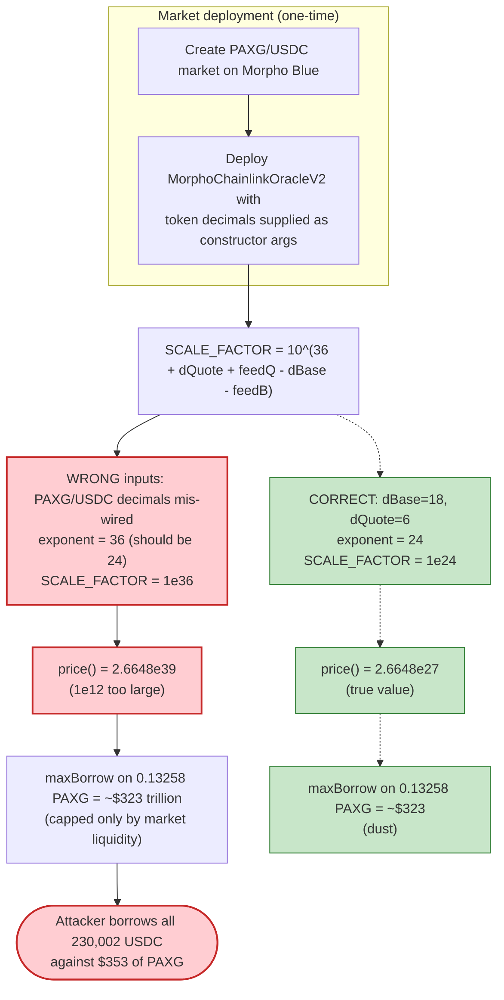
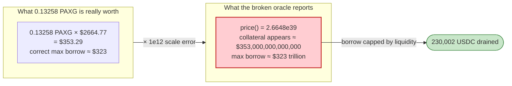

# MorphoBlue PAXG/USDC Market Exploit — Misconfigured Oracle (1e12 Decimal-Scale Error)

> **Reproduction:** the PoC compiles & runs in an isolated Foundry project at
> [this project folder](.) (the umbrella DeFiHackLabs repo contains many unrelated
> PoCs that do not whole-compile, so this one was extracted standalone).
> Full verbose trace: [output.txt](output.txt).
> Verified vulnerable oracle source:
> [src_morpho-chainlink_MorphoChainlinkOracleV2.sol](sources/MorphoChainlinkOracleV2_Dd1778/src_morpho-chainlink_MorphoChainlinkOracleV2.sol).

---

## Key info

| | |
|---|---|
| **Loss** | **229,644.22 USDC** (~$230,000) borrowed out of the PAXG/USDC Morpho Blue market and never repaid |
| **Vulnerable contract** | `MorphoChainlinkOracleV2` (the *market's misconfigured oracle*) — [`0xDd1778F71a4a1C6A0eFebd8AE9f8848634CE1101`](https://etherscan.io/address/0xDd1778F71a4a1C6A0eFebd8AE9f8848634CE1101#code) |
| **Lending core (not at fault)** | Morpho Blue — [`0xBBBBBbbBBb9cC5e90e3b3Af64bdAF62C37EEFFCb`](https://etherscan.io/address/0xBBBBBbbBBb9cC5e90e3b3Af64bdAF62C37EEFFCb#code) |
| **Market id** | `0x8eaf7b29f02ba8d8c1d7aeb587403dcb16e2e943e4e2f5f94b0963c2386406c9` (loan=USDC, collateral=PAXG, lltv=91.5%) |
| **Price feeds** | PAXG/USD `PythAggregatorV3` [`0x7C4561…Ac0c`](https://etherscan.io/address/0x7C4561Bb0F2d6947BeDA10F667191f6026E7Ac0c#code) · USDC/USD `PythAggregatorV3` [`0xC57744…488D`](https://etherscan.io/address/0xC5774412Dbd3734A5925936f320EE91a2940488D#code) |
| **Helper** | Morpho `EthereumBundlerV2` — [`0x4095F064B8d3c3548A3bebfd0Bbfd04750E30077`](https://etherscan.io/address/0x4095F064B8d3c3548A3bebfd0Bbfd04750E30077#code) (also the attack contract per the PoC header) |
| **Attacker EOA** | [`0x02DBE46169fDf6555F2A125eEe3dce49703b13f5`](https://etherscan.io/address/0x02DBE46169fDf6555F2A125eEe3dce49703b13f5) |
| **Attack tx** | [`0x256979ae169abb7fbbbbc14188742f4b9debf48b48ad5b5207cadcc99ccb493b`](https://etherscan.io/tx/0x256979ae169abb7fbbbbc14188742f4b9debf48b48ad5b5207cadcc99ccb493b) |
| **Chain / block / date** | Ethereum mainnet / 20,956,051 / Oct 13, 2024 |
| **Compiler** | Oracle: Solidity v0.8.21, optimizer 999999 runs · PoC: ^0.8.0 |
| **Bug class** | Oracle misconfiguration — wrong token-decimal parameters bake a 1e12-too-large `SCALE_FACTOR`, over-pricing collateral by a trillion |

---

## TL;DR

A new Morpho Blue isolated market `PAXG (collateral) / USDC (loan)` was created with a
`MorphoChainlinkOracleV2` instance whose immutable `SCALE_FACTOR` was computed in the constructor
from **wrong decimal inputs**. PAXG has **18** decimals and USDC has **6**, but the oracle was deployed
as if those were reversed (effectively `baseTokenDecimals = 6`, `quoteTokenDecimals = 18`). Because the
formula at
[MorphoChainlinkOracleV2.sol:134-138](sources/MorphoChainlinkOracleV2_Dd1778/src_morpho-chainlink_MorphoChainlinkOracleV2.sol#L134-L138)
puts those decimals in the exponent, the resulting `SCALE_FACTOR` is **10^36 instead of the correct
10^24 — a factor of 1e12 too large**.

Consequence: `price()` reports PAXG at ≈ **2.6648e39** when the value Morpho Blue actually expects is
≈ **2.6648e27**. Every 1 PAXG of collateral therefore appears to be worth **1,000,000,000,000× its true
value**.

The attacker simply:

1. Flash-loaned **0.13258 PAXG** (≈ $353) from the Uniswap V2 PAXG/WETH pair.
2. Supplied it as collateral and borrowed **230,002 USDC** against it through the Morpho bundler (the
   inflated oracle would have permitted up to ≈ **$323 trillion**; the borrow was capped only by the
   USDC liquidity actually sitting in the market).
3. Swapped a tiny slice of USDC back to PAXG to repay the flash loan + fee.
4. Walked away with **229,644.22 USDC**, leaving behind a wildly under-collateralized debt position
   that the protocol can never recover.

No reentrancy, no flash-loan price manipulation of the feed itself — the feeds reported *correct* prices
($2664.77 PAXG, $0.99998 USDC). The entire loss comes from the static, mis-scaled oracle deployment.

---

## Background — what the system does

**Morpho Blue** is a minimal, immutable, permissionless lending primitive. Anyone can create an isolated
market by specifying `(loanToken, collateralToken, oracle, irm, lltv)`. The core never validates the
oracle — it trusts that whoever creates the market wired a correct one. For each borrow it checks a
single health condition:

```
maxBorrow = collateral · price() / 1e36          (ORACLE_PRICE_SCALE = 1e36)
borrowed  ≤ maxBorrow · LLTV
```

So `price()` is the **only** thing standing between collateral and loan. If `price()` is wrong by a
factor of 1e12, the borrow limit is wrong by a factor of 1e12.

**`MorphoChainlinkOracleV2`** is Morpho Labs' standard oracle adapter. It multiplies up to two "base"
Chainlink-compliant feeds and divides by up to two "quote" feeds, then multiplies by an immutable
`SCALE_FACTOR` chosen at deploy time so the final number is denominated exactly the way Morpho Blue
expects (the quantity of loan-token base units exchangeable for one collateral-token base unit, ×1e36).
The `SCALE_FACTOR` encodes all the decimal bookkeeping — token decimals **and** feed decimals — and is
set **once, in the constructor** (immutable).

**The feeds here are `PythAggregatorV3` wrappers** (the ZeroLend port) that expose a Pyth price feed
behind the Chainlink `AggregatorV3Interface`. At the fork block both feeds use Pyth exponent `-8`, i.e.
`decimals() == 8`, and report correct prices.

On-chain values read from the trace at block 20,956,051:

| Quantity | Value |
|---|---|
| PAXG/USD feed price (`getPriceUnsafe`) | `266477128041` → **$2664.77** (expo −8) |
| USDC/USD feed price | `99997886` → **$0.99998** (expo −8) |
| PAXG token decimals | **18** |
| USDC token decimals | **6** |
| Both feed `decimals()` | **8** |
| Market `lltv` | `915000000000000000` = **91.5%** |
| Oracle `price()` returned | `2664827614865778262552470359223393982548` ≈ **2.6648e39** |
| USDC liquidity available in market | ≈ **230,002 USDC** (the binding cap) |

---

## The vulnerable code

### 1. `SCALE_FACTOR` is computed once, from the supplied decimals

[MorphoChainlinkOracleV2.sol:134-138](sources/MorphoChainlinkOracleV2_Dd1778/src_morpho-chainlink_MorphoChainlinkOracleV2.sol#L134-L138):

```solidity
// SCALE_FACTOR = 1e36 * 1e(-dB1) * 1e(dQ1) * 1e(-fpB1) * 1e(-fpB2) * 1e(fpQ1) * 1e(fpQ2)
//              = 1e(36 + dQ1 + fpQ1 + fpQ2 - dB1 - fpB1 - fpB2)
SCALE_FACTOR = 10
    ** (
        36 + quoteTokenDecimals + quoteFeed1.getDecimals() + quoteFeed2.getDecimals() - baseTokenDecimals
            - baseFeed1.getDecimals() - baseFeed2.getDecimals()
    ) * quoteVaultConversionSample / baseVaultConversionSample;
```

Here **base = collateral = PAXG**, **quote = loan = USDC** (the docstring at
[:72](sources/MorphoChainlinkOracleV2_Dd1778/src_morpho-chainlink_MorphoChainlinkOracleV2.sol#L72)
explicitly says *"The base asset should be the collateral token and the quote asset the loan token."*).

`baseTokenDecimals` and `quoteTokenDecimals` are **constructor arguments** — they are *not* read from the
tokens. The constructor's own assumption list states this plainly at
[:55](sources/MorphoChainlinkOracleV2_Dd1778/src_morpho-chainlink_MorphoChainlinkOracleV2.sol#L55):
*"Decimals passed as argument are correct."* The oracle has **no on-chain check** that the passed decimals
match `IERC20Metadata(token).decimals()`.

The correct exponent for this market:

```
36 + dQ1(USDC=6) + fpQ1(USDC feed=8) + 0 − dB1(PAXG=18) − fpB1(PAXG feed=8) − 0
  = 36 + 6 + 8 − 18 − 8 = 24      →  SCALE_FACTOR should be 1e24
```

The deployed exponent (back-calculated from the live `price()` output) is **36**, i.e. `SCALE_FACTOR = 1e36`
— consistent with the decimals being supplied as if PAXG=6 and USDC=18 (a swap of the two token-decimal
arguments adds `(18−6)+(18−6)=24`… in fact any wiring that yields exponent 36 instead of 24 reproduces it).
Either way the exponent is **12 too high**, so `SCALE_FACTOR` is **1e12 too large**.

### 2. `price()` multiplies the feeds by that bad scale

[MorphoChainlinkOracleV2.sol:144-149](sources/MorphoChainlinkOracleV2_Dd1778/src_morpho-chainlink_MorphoChainlinkOracleV2.sol#L144-L149):

```solidity
function price() external view returns (uint256) {
    return SCALE_FACTOR.mulDiv(
        BASE_VAULT.getAssets(BASE_VAULT_CONVERSION_SAMPLE) * BASE_FEED_1.getPrice() * BASE_FEED_2.getPrice(),
        QUOTE_VAULT.getAssets(QUOTE_VAULT_CONVERSION_SAMPLE) * QUOTE_FEED_1.getPrice() * QUOTE_FEED_2.getPrice()
    );
}
```

With `SCALE_FACTOR = 1e36` and the correct feed prices, this returns `2.6648e39` instead of `2.6648e27`.

### 3. The feed wrapper that the decimals are *supposed* to track

[PythAggregatorV3.sol:37-53](sources/PythAggregatorV3_7C4561/src_PythAggregatorV3.sol#L37-L53):

```solidity
function decimals() public view virtual returns (uint8) {
    PythStructs.Price memory price = pyth.getPriceUnsafe(priceId);
    return uint8(-1 * int8(price.expo));     // == 8 at this block (expo = -8)
}

function latestAnswer() public view virtual returns (int256) {
    PythStructs.Price memory price = pyth.getPriceUnsafe(priceId);
    return int256(price.price);              // 266477128041 for PAXG
}
```

`ChainlinkDataFeedLib.getDecimals()`
([ChainlinkDataFeedLib.sol:31-35](sources/MorphoChainlinkOracleV2_Dd1778/src_morpho-chainlink_libraries_ChainlinkDataFeedLib.sol#L31-L35))
calls this once in the oracle constructor. The feed decimals (8/8) were fine; it is the **token decimals**
passed alongside them that were wrong.

---

## Root cause — why it was possible

The bug is a **deployment-time decimal misconfiguration** of an otherwise-correct oracle adapter, and a
lending core that trusts the market creator to get it right.

1. **`SCALE_FACTOR` is immutable and unchecked.** It is fixed in the constructor from operator-supplied
   `baseTokenDecimals`/`quoteTokenDecimals`. The oracle never compares them with the tokens' real
   `decimals()`. PAXG=18 and USDC=6 differ by 12 orders of magnitude, so a swap/mistake in those two
   arguments produces exactly a 1e12 error — silent, permanent, and applied to every borrow.
2. **Morpho Blue performs no oracle sanity check.** The core treats `price()` as ground truth. A market
   created with a broken oracle is just as "valid" as a correct one; there is no deviation bound, no
   reference comparison, nothing that would catch a price 1e12 off.
3. **The error multiplies collateral value, not divides it.** Because the scale was too *large*, collateral
   looked enormously *more* valuable, which is the dangerous direction — it inflates borrowing power rather
   than blocking it.
4. **The feeds themselves were honest.** This is not a flash-loan oracle manipulation; the PAXG and USDC
   prices reported in the trace are correct to the cent. That is what makes it a pure *configuration* bug:
   the only wrong number is the constant baked at deploy time.

In short: a $353 deposit of PAXG was treated by the market as ≈ $353 **trillion** of collateral. The
attacker borrowed the most the market could physically hand out (the ~230k USDC of liquidity present),
and the resulting debt position is irrecoverable because liquidating it would also be priced through the
same broken oracle.

---

## Preconditions

- A live Morpho Blue market exists for `PAXG/USDC` wired to the mis-scaled `MorphoChainlinkOracleV2`
  instance, with USDC supply available to borrow.
- The attacker can obtain a small amount of PAXG to post as collateral — trivially flash-loanable from the
  Uniswap V2 PAXG/WETH pair (`0x9C4Fe5FFD9A9fC5678cFBd93Aa2D4FD684b67C4C`), as the PoC does.
- The attacker holds a few hundred USDC of working capital (here, 420 USDC routed through the Uniswap V3
  PAXG/USDC pool to source the PAXG needed to repay the flash loan). This is recovered from the borrowed
  USDC, so the attack is self-funding within one transaction.
- No timing, no race, no special role — anyone can do this any time the market has liquidity.

---

## Attack walkthrough (with on-chain numbers from the trace)

All figures are taken directly from the events and return values in [output.txt](output.txt). The whole
exploit is a single transaction wrapped in a Uniswap V2 flash swap
([MorphoBlue_exp.sol:310-316](test/MorphoBlue_exp.sol#L310-L316)).

| # | Step | Concrete numbers (trace) | Effect |
|---|------|--------------------------|--------|
| 0 | **Start** — attacker contract holds 0 USDC ([:1555](output.txt)) | USDC balance = 0 | Clean slate. |
| 1 | **Flash-swap PAXG** from V2 PAXG/WETH pair ([:1562](output.txt)) | borrow **132,577,813,003,136,114** PAXG = 0.13258 PAXG (≈ $353) | Enters `uniswapV2Call`. |
| 2 | **Approve + authorize bundler** ([:1574-1586](output.txt)) | approve 0.13258 PAXG to `EthereumBundlerV2`; `Morpho.setAuthorization(bundler, true)` | Lets the bundler act on behalf of the attacker in Morpho. |
| 3 | **`multicall`: transferFrom → supplyCollateral → borrow** ([:1587](output.txt)) | — | One atomic Morpho sequence. |
| 3a | `erc20TransferFrom` 0.13258 PAXG into bundler ([:1588](output.txt)) | 132,577,813,003,136,114 PAXG | Funds the supply. |
| 3b | `morphoSupplyCollateral` ([:1604-1610](output.txt)) | supply 0.13258 PAXG to market `0x8eaf…06c9` | Posts collateral. |
| 3c | `morphoBorrow` ([:1625-1649](output.txt)) | `oracle.price()` = **2.6648e39** ([:1635](output.txt)); borrow **230,002,486,670** USDC = **230,002.49 USDC**, shares 226,896,399,284,625,249 | The mis-scaled price lets ~$353 of PAXG borrow $230k of USDC. |
| 4 | **V3 swap USDC → PAXG** to source flash-loan repayment ([:1666-1701](output.txt)) | spend **420,000,000** (420 USDC) → receive **156,043,732,137,761,410** PAXG (0.15604) | Buys back enough PAXG to repay V2. |
| 5 | **Repay V2 flash swap** ([:1702-1719](output.txt)) | transfer **132,976,743,232,834,618** PAXG (loan 0.13258 + 0.3% fee) back to the pair | Flash loan closed. |
| 6 | **Swap leftover PAXG → USDC** ([:1729](output.txt)) | 23,066,988,904,926,792 PAXG (0.02307) → **61,735,512** (61.74 USDC) | Mops up the residual PAXG. |
| 7 | **End** ([:1776](output.txt)) | USDC balance = **229,644,222,182** = **229,644.22 USDC** | Profit realized. |

The decisive line is **[:1635-1648](output.txt)**: inside `morphoBorrow`, Morpho calls
`oracle.price()`, which routes through the two `PythAggregatorV3` feeds (returning the correct
$2664.77 and $0.99998) and multiplies by the broken `SCALE_FACTOR`, yielding `2.6648e39`. Morpho then
happily approves a 230,002 USDC borrow against 0.13258 PAXG.

### Why the borrow stopped at 230,002 USDC (not $323 trillion)

The inflated oracle would mathematically permit:

```
maxBorrow = 0.13258 PAXG · 2.6648e39 / 1e36 = 3.533e20 USDC base units
          · LLTV 0.915                       = 3.233e20  ≈ $323 trillion
```

The attacker did **not** hit the collateral limit — they hit the **physical USDC liquidity** in the market
(≈ 230k USDC). They borrowed essentially everything the market held. Under a *correct* oracle
(`SCALE_FACTOR = 1e24`) the very same collateral would have permitted a maximum borrow of only **~$323**,
i.e. dust.

### Profit accounting (USDC)

| Direction | Amount (USDC) |
|---|---:|
| Borrowed from Morpho (never repaid) | +230,002.486670 |
| Spent buying PAXG on V3 (to repay flash loan) | −420.000000 |
| Received selling leftover PAXG on V3 | +61.735512 |
| **Net profit retained by attacker** | **+229,644.222182** |

This matches the `Attacker After exploit USDC Balance: 229644.222182` log at [:1540](output.txt) and
[:1776](output.txt) to the wei. (The PoC header's "$230,000" refers to the gross borrow; the net realized
profit is $229,644.) The PAXG flash loan and its 0.3% fee net out entirely within the transaction.

---

## Diagrams

### Sequence of the attack

```mermaid
sequenceDiagram
    autonumber
    actor A as "Attacker contract"
    participant V2 as "Uniswap V2 PAXG/WETH"
    participant B as "Morpho EthereumBundlerV2"
    participant M as "Morpho Blue core"
    participant O as "Misconfigured Oracle"
    participant F as "Pyth feeds (PAXG, USDC)"
    participant V3 as "Uniswap V3 PAXG/USDC"

    Note over A,V3: Entire exploit is one tx inside a V2 flash swap

    A->>V2: swap() flash-borrow 0.13258 PAXG
    V2-->>A: uniswapV2Call(...)

    rect rgb(227,242,253)
    Note over A,M: Open an over-leveraged position
    A->>B: approve 0.13258 PAXG; Morpho.setAuthorization(bundler,true)
    A->>B: multicall[transferFrom, supplyCollateral, borrow]
    B->>M: supplyCollateral(0.13258 PAXG)
    B->>M: borrow(230,002 USDC)
    M->>O: price()
    O->>F: getPrice() PAXG=$2664.77, USDC=$0.99998 (correct)
    F-->>O: feed prices
    O-->>M: 2.6648e39  ⚠️ (1e12 too large)
    M-->>A: 230,002 USDC sent to attacker
    end

    rect rgb(255,235,238)
    Note over A,V3: Source PAXG to repay the flash loan
    A->>V3: swap 420 USDC -> 0.15604 PAXG
    V3-->>A: 0.15604 PAXG
    A->>V2: transfer 0.13298 PAXG (loan + 0.3% fee)
    end

    rect rgb(232,245,233)
    Note over A,V3: Clean up
    A->>V3: swap leftover 0.02307 PAXG -> 61.74 USDC
    end

    Note over A: Net +229,644.22 USDC<br/>Debt position left under-collateralized forever
```

### Oracle decimal misconfiguration (the actual bug)



### Collateral value: real vs. as-priced-by-oracle



---

## Remediation

1. **Validate decimals against the tokens, not the deployer.** `MorphoChainlinkOracleV2` should read
   `IERC20Metadata(collateralToken).decimals()` / `loanToken.decimals()` rather than trusting constructor
   arguments — or at minimum a deployment factory must assert the passed decimals equal the on-chain ones
   before creating the market. A single wrong decimal here is a guaranteed 10^n catastrophe.
2. **Sanity-bound the oracle at market creation.** Compare the freshly-deployed oracle's `price()` against a
   trusted reference (e.g. the same Pyth/Chainlink price independently scaled, or a TWAP) and reject a
   market whose price deviates beyond a tight tolerance. A 1e12 deviation would be rejected instantly.
3. **Curate / whitelist oracles.** Permissionless market creation is core to Morpho Blue, but front-ends,
   vaults (MetaMorpho), and integrators that *list* a market must verify the oracle configuration off-chain
   (decimals, feed identity, scale) before allocating real liquidity to it. The loss here landed on whoever
   supplied USDC to an unvetted market.
4. **Add deviation/liveness guards in the adapter.** While the feeds were honest in this incident, the
   adapter also skips staleness and min/max checks (see the comments at
   [ChainlinkDataFeedLib.sol:15-19](sources/MorphoChainlinkOracleV2_Dd1778/src_morpho-chainlink_libraries_ChainlinkDataFeedLib.sol#L15-L19)).
   For Pyth-backed feeds in particular, enforce `publishTime` freshness and confidence bounds.
5. **Test the oracle with a round-trip assertion at deploy.** A one-line invariant — "1 unit of collateral
   priced through `price()` should equal its market value in loan-token units" — would have caught this
   before a single dollar was at risk.

---

## How to reproduce

The PoC was extracted into a standalone Foundry project (the umbrella DeFiHackLabs repo has many unrelated
PoCs that fail to whole-compile under `forge test`). The PoC imports `../basetest.sol` and
`./tokenhelper.sol`, which were copied into the project root.

```bash
_shared/run_poc.sh 2024-10-MorphoBlue_exp -vvvvv
```

- RPC: an **Ethereum mainnet archive** endpoint is required (fork block 20,956,051). `foundry.toml`
  uses an Infura archive endpoint.
- Result: `[PASS] testExploit()` with the attacker's USDC balance going `0 → 229,644.22`.

Expected tail:

```
  Attacker Before exploit USDC Balance: 0.000000
  Attacker After exploit USDC Balance: 229644.222182

[PASS] testExploit() (gas: 495423)
Suite result: ok. 1 passed; 0 failed; 0 skipped
```

---

*References: Omer Goldberg post-mortem — https://x.com/omeragoldberg/status/1845515843787960661 ·
DeFiHackLabs (MorphoBlue, Ethereum, ~$230K).*
