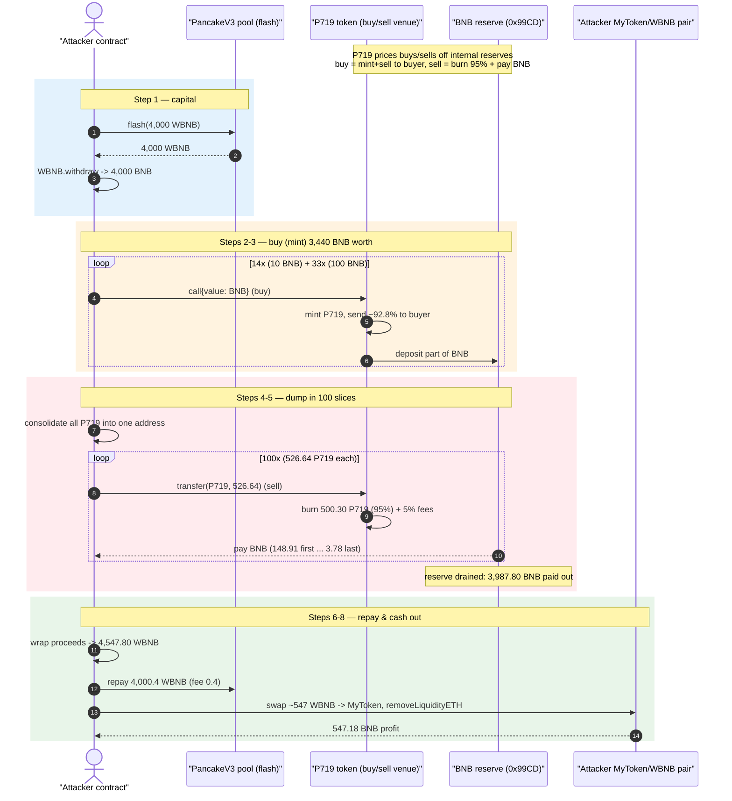
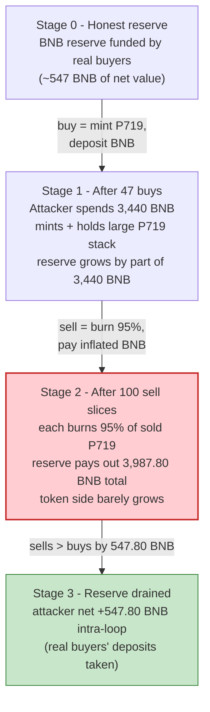
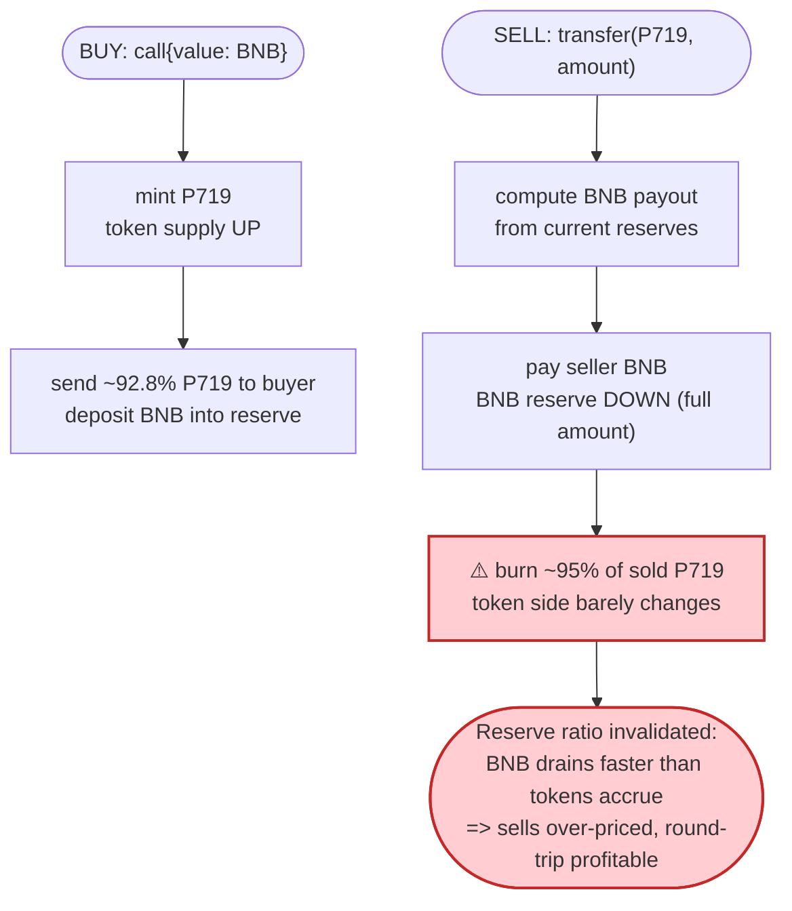

# P719 Token Exploit — Sell Price Inflated by an Un-Compensated Burn Inside `transfer()`

> **Reproduction:** the PoC compiles & runs in an isolated Foundry project at
> [this project folder](.) (the umbrella DeFiHackLabs repo contains many unrelated PoCs that do not
> compile together, so this one was extracted).
> Full verbose trace: [output.txt](output.txt). PoC: [test/P719Token_exp.sol](test/P719Token_exp.sol).
> The vulnerable `P719` contract is **unverified** on BscScan, so the analysis below reconstructs its
> behaviour from the on-chain execution trace (its emitted `Transfer`/`Swap` events and value flows).
> The only verified third-party source available is the PancakeV3 flash-loan pool:
> [PancakeV3Pool](sources/PancakeV3Pool_172fcD/contracts_PancakeV3Pool.sol).

---

## Key info

| | |
|---|---|
| **Loss** | **547.18 BNB** (~$312K) drained from the P719 token's internal BNB reserve |
| **Vulnerable contract** | `P719` (unverified) — [`0x6bEee2B57b064EAC5F432FC19009E3E78734Eabc`](https://bscscan.com/token/0x6beee2b57b064eac5f432fc19009e3e78734eabc) |
| **Victim** | The P719 token's own BNB reserve (held by the internal "vault" contract `0x99CD…16e62`); funded by users who had bought P719 |
| **Attacker EOA** | [`0xfeb19ae8c0448f25de43a3afcb7b29c9cef6eff6`](https://bscscan.com/address/0xfeb19ae8c0448f25de43a3afcb7b29c9cef6eff6) |
| **Attacker contract** | [`0x3f32c7cfb0a78ddea80a2384ceb4633099cbdc98`](https://bscscan.com/address/0x3f32c7cfb0a78ddea80a2384ceb4633099cbdc98) |
| **Attack tx** | [`0x9afcac8e82180fa5b2f346ca66cf6eb343cd1da5a2cd1b5117eb7eaaebe953b3`](https://bscscan.com/tx/0x9afcac8e82180fa5b2f346ca66cf6eb343cd1da5a2cd1b5117eb7eaaebe953b3) |
| **Chain / block / date** | BSC / 43,023,423 (fork at 43,023,422) / Oct 11, 2024 |
| **Flash-loan source** | PancakeV3 WBNB pool `0x172fcD…f546f849` (4,000 WBNB borrowed, 0.4 WBNB fee) |
| **Compiler (PoC)** | Solidity ^0.8.13 (EVM `cancun`) |
| **Bug class** | Broken internal-AMM invariant: sell price is set from a BNB reserve that is **not** reduced proportionally to the tokens the contract burns on every sell |

---

## TL;DR

`P719` is a "tax + burn" token that doubles as its **own** decentralized exchange. Sending BNB to the
contract acts as a **buy** (it mints P719 and hands most of it to the buyer), and `transfer`-ing P719
back to the contract acts as a **sell** (it burns ~95 % of the sold tokens, takes ~5 % as fees, and
pays the seller BNB). The BNB used to pay sellers comes from an internal reserve contract
(`0x99CD…16e62`) funded by prior buyers.

The fatal flaw: **on every sell the contract burns the bulk of the incoming tokens, but the sell
payout is priced as if those tokens stayed in the pool.** Burning the sold tokens shrinks the token
side of the price curve far faster than the BNB side, so each unit of P719 a seller dumps is paid out
at a *higher* effective BNB price than a constant-product curve would give. An attacker who buys
cheaply (minting fresh supply) and then dumps in many small slices extracts more BNB than they put in
— the surplus is exactly the BNB that earlier honest buyers deposited.

The attacker:

1. **Flash-borrows 4,000 WBNB** from a PancakeV3 pool and unwraps it to native BNB.
2. **Buys** P719 in 47 separate calls (14 × 10 BNB warm-up + 33 × 100 BNB = **3,440 BNB**), each buy
   minting fresh P719 and accumulating it across many throw-away contracts.
3. **Consolidates** all the P719 into one address, then **sells it back in 100 small slices**, which
   the contract over-prices and pays out **3,987.80 BNB** — a **+547.80 BNB** gross gain.
4. **Repays** the 4,000.4 WBNB flash loan and routes the leftover ~547 WBNB through the attacker's own
   throw-away MyToken/WBNB pair, finally calling `removeLiquidityETH` to walk away with
   **547.18 BNB** in clean profit.

---

## Background — what P719 does

`P719` is unverified, but the trace makes its design unambiguous. It is a self-contained
buy/sell venue rather than a normal ERC-20 sitting on a PancakeSwap pair:

- **Buy = send BNB to the token.** The PoC's helper does `P719.call{value: msg.value}("")`
  ([test/P719Token_exp.sol:157-159](test/P719Token_exp.sol#L157-L159)). The contract's `fallback`
  receives the BNB, mints P719 (a `Transfer(0x0 → P719)` event), forwards a fixed slice of the BNB to
  internal recipients, and sends the buyer ~92.8 % of the minted P719 (a `Swap` event with
  `amountIn = BNB`, `amountOut = P719`).
- **Sell = `transfer` P719 back to the token.** The PoC's helper does
  `IERC20(P719).transfer(P719, amount)` ([test/P719Token_exp.sol:162-166](test/P719Token_exp.sol#L162-L166)).
  The contract's overridden `transfer` detects `to == address(this)`, burns ~95 % of the amount to
  `0x0`, takes ~5 % as fees (to `0x2222…` and `0x3d5d…`), and pays the seller BNB (a `Swap` event with
  `amountIn = P719`, `amountOut = BNB`).
- **The BNB reserve** that funds sell payouts lives in a separate "vault" contract,
  `0x99CD55d6A838F465CaEba3B64e267ADF29516e62`, into which each buy deposits part of the BNB
  (`deposit{value: 1 BNB}(2074)` calls appear inside every buy).

Observed per-operation numbers from the trace (first 10-BNB buy at
[output.txt:1188-1214](output.txt#L1188), first sell at [output.txt:2425-2444](output.txt#L2425)):

| Operation | In | Minted / burned | Paid to user | Fees |
|---|---|---|---|---|
| **Buy** (10 BNB) | 10 BNB | mint 1,438.72 P719 | 928.21 P719 to buyer (`Swap` out) | 92.82 → `0x2222…`, 46.41 → `0x3d5d…`; remainder retained |
| **Sell** (526.64 P719) | 526.64 P719 | **burn 500.30 P719 → `0x0`** | **148.91 BNB** | 21.07 → `0x2222…`, 5.27 → `0x3d5d…` |

That single sell row is the whole game: of 526.64 P719 sold, **500.30 (95 %) is destroyed**, yet the
contract still pays out 148.91 BNB as though a full 526.64-token sale had hit a normal pool.

---

## The vulnerable code

P719 is unverified, so there is no Solidity to quote. The defect is visible directly in the
trace's event sequence for a single sell ([output.txt:2426-2441](output.txt#L2426)):

```text
0x6bEee2…Eabc::transfer(0x6bEee2…Eabc, 526.636 P719)          // attacker "sells" by transferring to the token
  ├─ AttackerC2::receive{value: 148.913 BNB}                  // ⚠️ BNB paid out FIRST, priced on pre-burn reserves
  ├─ emit Swap(seller, amountIn=0, amountOut=500.304 P719, BNBout=148.913, 0)
  ├─ emit Transfer(0x6bEee2…Eabc → 0x0,        500.304 P719)  // ⚠️ 95% of the sold tokens BURNED
  ├─ emit Transfer(0x6bEee2…Eabc → 0x2222…,     21.065 P719)  // 4% fee
  └─ emit Transfer(0x6bEee2…Eabc → 0x3d5d…,      5.266 P719)  // 1% fee
```

Contrast with the buy ([output.txt:1199-1203](output.txt#L1199)):

```text
0x6bEee2…Eabc::fallback{value: 10 BNB}                        // buy
  ├─ emit Transfer(0x0 → 0x6bEee2…Eabc, 1438.720 P719)        // mint fresh supply
  ├─ emit Transfer(0x6bEee2…Eabc → buyer, 928.206 P719)       // ~92.8% handed to buyer
  ├─ emit Swap(buyer, BNBin=10, 0, 0, P719out=928.206)
  ├─ emit Transfer(0x6bEee2…Eabc → 0x2222…, 92.820 P719)
  └─ emit Transfer(0x6bEee2…Eabc → 0x3d5d…, 46.410 P719)
```

The price on both sides is derived from the contract's internal "reserves" (BNB held by `0x99CD…`
versus P719 accounting state). The bug is the asymmetry between what those reserves *imply* and what
actually happens to supply:

- A **buy** *mints* tokens, so the token-side reserve and total supply both grow.
- A **sell** *burns* ~95 % of the incoming tokens, so the token-side reserve barely grows while the
  BNB-side reserve is debited the full payout.

Because the payout is computed before/independent of the burn, the BNB reserve empties out much faster
than the constant-product math would justify, and the *next* sell is priced even more favourably.

The only verified contract in scope, the PancakeV3 flash pool, is used merely as the capital source —
its `flash()` ([PancakeV3Pool.sol:822-845](sources/PancakeV3Pool_172fcD/contracts_PancakeV3Pool.sol#L822-L845))
lends 4,000 WBNB and only requires `balanceBefore + fee ≤ balanceAfter` at the end, which the attacker
satisfies after draining P719.

---

## Root cause — why it was possible

P719 tries to be an automated market maker for itself but **does not preserve a consistent
relationship between its priced reserves and its real token supply.** A correct constant-product venue
guarantees `x · y = k`: every token added to the pool on a sell must remain in the pool so that the
price moves against the seller. P719 instead destroys 95 % of every sold token *after* (or independent
of) computing the BNB payout. The effect:

1. **Sells are systematically over-priced.** The BNB-out is calculated as if the full sell amount
   entered the reserve, but only ~5 % effectively does. So each P719 dumped pulls out more BNB than the
   pool can sustain, and the imbalance compounds with each subsequent sell.
2. **Buys mint, sells burn — the round-trip is profitable.** The attacker buys at one (cheaper) price
   while *minting* new supply, then sells that supply back at the inflated effective price. Over the
   full sequence: **3,440 BNB spent on buys → 3,987.80 BNB received on sells** (a 547.80 BNB intra-loop
   surplus, see the accounting table). That surplus is paid out of the BNB reserve that earlier
   *honest* buyers had deposited into `0x99CD…`.
3. **Everything is permissionless and atomic.** Buying (`call{value}`) and selling
   (`transfer(P719, amount)`) require no privileges, so the entire buy→sell round trip fits in one
   flash-loaned transaction. No price oracle, no per-tx volume cap, and no check that the burn keeps
   the reserve ratio honest.
4. **Slicing maximises extraction.** The attacker sells in **100 small slices** rather than one block.
   The first slice is paid 148.91 BNB; the last only 3.78 BNB ([output.txt:2428](output.txt#L2428) vs
   [output.txt:5002](output.txt#L5002)). Selling small amounts repeatedly keeps each slice on the
   favourable part of the (broken) curve and squeezes the reserve down to almost nothing.

In short: **the token mints on buys, burns on sells, but prices both sides off reserves that the burn
silently invalidates.** The constant-product invariant is broken in the seller's favour by design, and
an attacker with flash-loan capital converts that into a one-shot drain of the BNB reserve.

---

## Preconditions

- The P719 BNB reserve (in `0x99CD…16e62`) must hold enough BNB to pay the inflated sell proceeds —
  i.e. the protocol must have accumulated real user deposits. At the fork block it held the ~547 BNB of
  net value the attacker walked off with.
- Buy and sell entry points are permissionless (anyone can `call{value}` to buy and `transfer` to
  sell), so no special role is required.
- Working capital to front the buys. Peak outlay was **3,440 BNB**; it is fully recovered intra-tx,
  hence **flash-loanable**. The PoC borrows 4,000 WBNB from a PancakeV3 pool
  ([test/P719Token_exp.sol:91-93](test/P719Token_exp.sol#L91-L93)).
- The attacker's clean-up pair (MyToken/WBNB) is created by the attacker itself purely to convert the
  surplus WBNB into withdrawable BNB; it is not a precondition of the bug.

---

## Attack walkthrough (with on-chain numbers from the trace)

All figures are taken directly from the trace in [output.txt](output.txt).

| # | Step | Concrete numbers | Effect |
|---|------|------------------|--------|
| 0 | **Set the stage** — deploy throw-away `MyToken`, seed a tiny MyToken/WBNB Pancake pair (100 MyToken + 0.001 BNB) | [output.txt:32-90](output.txt#L32) | Pair used later only to cash out surplus WBNB. |
| 1 | **Flash-borrow** 4,000 WBNB from PancakeV3 pool `0x172fcD…`; unwrap to native BNB | [output.txt:1161](output.txt#L1161), [output.txt:1173](output.txt#L1173) | Attacker now holds 4,000 BNB; owes 4,000.4 WBNB. |
| 2 | **Warm-up buys** — 14 buys of 10 BNB each (140 BNB total) | each mints ~1,438 P719, e.g. [output.txt:1188-1214](output.txt#L1188) | Seeds the buy/mint loop; first buy yields 928.21 P719. |
| 3 | **Main buys** — 33 buys of 100 BNB each (3,300 BNB total) | [output.txt:108-112 of PoC](test/P719Token_exp.sol#L108) | Accumulates large P719 balances across 33 contracts. Total buy spend = **3,440 BNB**. |
| 4 | **Consolidate** all bought P719 into a single `AttackerC2` via `transferFrom` | [test/P719Token_exp.sol:116-120](test/P719Token_exp.sol#L116) | One address now holds the full P719 stack to slice up. |
| 5 | **Dump** the stack as **100 sell slices** of 526.64 P719 each (`transfer` to P719) | first sell pays 148.91 BNB ([output.txt:2425-2444](output.txt#L2425)); last pays 3.78 BNB ([output.txt:4999-5018](output.txt#L4999)) | Each sell burns 500.30 P719 (95 %) yet pays inflated BNB. **Total received = 3,987.80 BNB.** |
| 6 | **Wrap** all proceeds back to WBNB | `WBNB.deposit{value: 4,547.80}` [output.txt:5019](output.txt#L5019) | Attacker now holds 4,547.80 WBNB. |
| 7 | **Repay** flash loan: transfer 4,000.4 WBNB back to the V3 pool | [output.txt:5062-5067](output.txt#L5062), `Flash(... paid1 = 0.4 WBNB)` [output.txt:5073](output.txt#L5073) | Loan satisfied (balanceBefore + 0.4 ≤ balanceAfter). |
| 8 | **Cash out** — swap leftover ~547.4 WBNB through own MyToken pair, then `removeLiquidityETH` | [output.txt:5031](output.txt#L5031), [output.txt:5088](output.txt#L5088) | Final attacker balance = **547.18 BNB** ([output.txt:5151 / console.log](output.txt#L5151)). |

### Sell over-pricing in numbers

The first sell ([output.txt:2426-2441](output.txt#L2426)): seller pushes **526.64 P719** into the
contract; the contract **burns 500.30 + fees 26.33 = 526.64 P719** (the entire amount leaves
circulation, almost none stays in the priced reserve) yet pays out **148.91 BNB**. A faithful
constant-product pool that *kept* those 526.64 tokens would have paid far less and moved the price hard
against the seller. By annihilating the tokens it just "bought," P719 leaves its BNB reserve exposed to
the next slice at an only-slightly-worse price — which is why 100 small slices extract the reserve
nearly in full.

### Profit accounting (BNB)

| Direction | Amount (BNB) |
|---|---:|
| Spent — 14 warm-up buys (10 BNB each) | 140.00 |
| Spent — 33 main buys (100 BNB each) | 3,300.00 |
| **Total spent on buys** | **3,440.00** |
| Received — 100 sell slices | **3,987.80** |
| **Intra-loop surplus** (sells − buys) | **+547.80** |
| Less flash-loan fee | −0.40 |
| Less cash-out swap slippage (own pair) | ≈ −0.22 |
| **Net profit (final BNB balance)** | **+547.18** |

The flash loan (4,000 WBNB) is fully repaid; the 547.18 BNB profit is precisely the
sells-minus-buys surplus net of the 0.4 WBNB flash fee and minor slippage when converting the leftover
WBNB through the attacker's own MyToken pair. That surplus is the BNB that prior honest buyers had paid
into P719's reserve.

---

## Diagrams

### Sequence of the attack



### Reserve evolution (why selling drains it)



### The pricing flaw — buy mints, sell burns, both priced off the same reserve



---

## Remediation

1. **Preserve the constant-product invariant on sells.** Do not destroy the tokens a seller hands in
   before/while pricing the payout. Either keep the sold tokens in the priced reserve (so the price
   moves against the seller as in a real AMM), or recompute the reserve consistently so the burn
   reduces the implied token reserve and the BNB payout *together*. The current design lets BNB leave
   without a matching, persistent increase in the token reserve.
2. **Make buy and sell symmetric.** A buy that mints and a sell that burns can never round-trip to a
   profit if and only if the pricing of each direction accounts for the supply change it causes.
   Audit the round-trip: for any `buy(x)` immediately followed by `sell(received)`, the user must end
   with **less** value than they started, net of fees.
3. **Drive prices from a manipulation-resistant source, not transient internal reserves.** If the token
   must self-price, use a TWAP/oracle or bound the per-transaction reserve impact so a single sequence
   cannot empty the reserve.
4. **Cap single-transaction and per-block volume.** A 100-slice dump that pulls the entire reserve in
   one transaction should be impossible; cap the BNB payable per block or per address per interval.
5. **Don't let buy minting be free working capital.** Because buys mint fresh supply, an attacker can
   manufacture an arbitrarily large sell stack with flash-loaned BNB. Rate-limit or fee minting so the
   round trip cannot be made profitable with borrowed capital.

---

## How to reproduce

The PoC was extracted into a standalone Foundry project (the umbrella DeFiHackLabs repo has many
unrelated PoCs that fail to compile under a whole-project `forge test`):

```bash
_shared/run_poc.sh 2024-10-P719Token_exp -vvvvv
```

- RPC: a **BSC archive** endpoint is required (fork block 43,023,422). `foundry.toml` uses
  `https://bsc-mainnet.public.blastapi.io`, which serves historical state at that block; the default
  public endpoint (`bnb.api.onfinality.io`) rate-limits (HTTP 429) and must be swapped out.
- Result: `[PASS] testPoC()` with `Final balance in WETH: 547180977558295682131` (547.18 BNB).

Expected tail:

```
Ran 1 test for test/P719Token_exp.sol:P719Token_exp
[PASS] testPoC() (gas: 55644272)
Logs:
  Final balance in WETH: 547180977558295682131

Suite result: ok. 1 passed; 0 failed; 0 skipped
```

---

*References: TenArmor — https://x.com/TenArmorAlert/status/1844929489823989953 ; PoC author
[rotcivegaf](https://twitter.com/rotcivegaf). Total lost ≈ 547.18 BNB (~$312K) on BSC, Oct 11 2024.*
