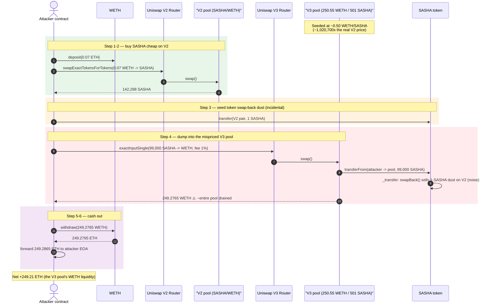
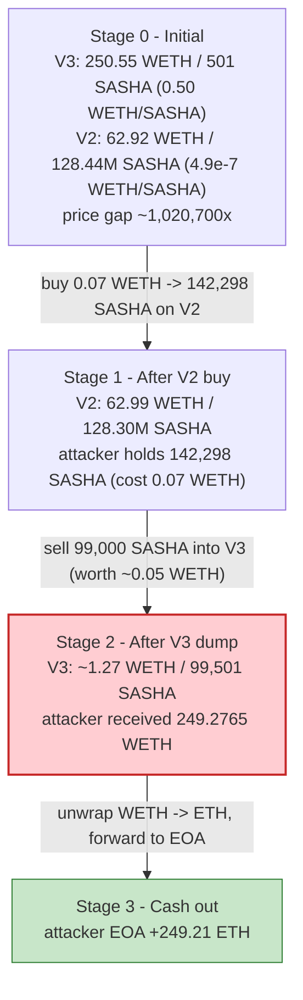
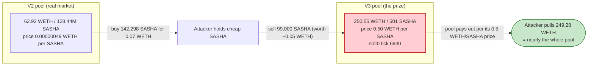

# SASHA Token Exploit — Draining a Deployer-Seeded, Massively Mispriced Uniswap V3 Pool

> **Vulnerability classes:** vuln/oracle/spot-price · vuln/oracle/price-manipulation

> **Reproduction:** the PoC compiles & runs in an isolated Foundry project at
> [this project folder](.) (the umbrella DeFiHackLabs repo contains many unrelated
> PoCs that do not all compile, so this one was extracted standalone).
> Full verbose trace: [output.txt](output.txt).
> Verified vulnerable token source: [sources/SASHA_D1456D/SASHA.sol](sources/SASHA_D1456D/SASHA.sol).
> The victim pool is a stock [Uniswap V3 pool](sources/UniswapV3Pool_5EAc59/UniswapV3Pool.sol)
> — the *bug is not in its code*, it is in how the pool was **priced and seeded**.

---

## Key info

| | |
|---|---|
| **Loss** | **~249.28 WETH (~$600K)** drained from the SASHA/WETH Uniswap **V3** pool |
| **Vulnerable contract** | `SASHA` token — [`0xD1456D1b9CEb59abD4423a49D40942a9485CeEF6`](https://etherscan.io/address/0xD1456D1b9CEb59abD4423a49D40942a9485CeEF6#code) |
| **Victim pool** | SASHA/WETH **V3** 1% pool — [`0x5EAc5992e8c7cC6B04bad2C5bBC00D101d4C8264`](https://etherscan.io/address/0x5EAc5992e8c7cC6B04bad2C5bBC00D101d4C8264) (held 250.55 WETH / 501 SASHA) |
| **Reference market** | SASHA/WETH **V2** pool — [`0xB23FC1241e1Bc1a5542a438775809d38099838fe`](https://etherscan.io/address/0xB23FC1241e1Bc1a5542a438775809d38099838fe) (62.92 WETH / 128.44M SASHA) |
| **Attacker EOA** | `0x493c5655D40B051a64bc88A6af21D73d3A9B72A2` ("Shezmu Attacker 3"); PoC pranks `0x81F48A87Ec44208c691f870b9d400D9c13111e2E` |
| **Attack contract** | [`0x991493900674b10bdf54bdfe95b4e043257798cf`](https://etherscan.io/address/0x991493900674b10bdf54bdfe95b4e043257798cf) |
| **Attack tx** | [`0xd9fdc7d03eec28fc2453c5fa68eff82d4c297f436a6a5470c54ca3aecd2db17e`](https://app.blocksec.com/explorer/tx/eth/0xd9fdc7d03eec28fc2453c5fa68eff82d4c297f436a6a5470c54ca3aecd2db17e) |
| **Chain / block / date** | Ethereum mainnet / 20,905,302 (fork at −1) / Oct 2024 |
| **Compiler** | SASHA token: Solidity v0.8.25, optimizer off |
| **Bug class** | Mispriced / asymmetrically-seeded AMM pool — cross-pool arbitrage drain (effectively a self-rug of LP funds) |

---

## TL;DR

There were **two** SASHA/WETH liquidity pools on-chain priced more than **a million times apart**:

- The honest **V2** pool priced SASHA at **~0.00000049 WETH each** (62.92 WETH against 128.44M SASHA).
- A **V3** pool — seeded by the SASHA deployer — priced SASHA at **~0.50 WETH each**
  (250.55 WETH against only **501 SASHA**). Its `slot0` price (`sqrtPriceX96`) corresponds to a tick of
  **6930 ⇒ 2.0 SASHA per WETH ⇒ 0.50 WETH per SASHA**. That is **~1,020,700×** the real V2 price.

A single round trip closes that gap and pockets the V3 pool's entire WETH balance:

1. **Buy cheap on V2** — swap **0.07 WETH** for **142,298 SASHA** (real price).
2. **Dump into the mispriced V3 pool** — sell **99,000 SASHA** via `exactInputSingle`. Because the V3
   pool values SASHA at ~0.5 WETH and only holds 250.55 WETH, the swap pulls out essentially the whole
   pool: **249.28 WETH**.
3. **Unwrap & leave.** WETH → ETH → attacker.

Net profit = **249.28 WETH − 0.07 WETH spent − gas ≈ 249.21 ETH**. The 99,000 SASHA "sold" was worth
only **~0.0485 WETH** at the real market price, so the attacker exchanged ~0.05 WETH of value for ~250
WETH of real liquidity. This is a self-inflicted loss baked into the V3 pool's seeding parameters, not a
code vulnerability inside any single contract.

---

## Background — what SASHA is

`SASHA` ("Sasha Cat", [source](sources/SASHA_D1456D/SASHA.sol)) is a meme ERC20 with the
usual "tax + auto-swap" boilerplate bolted on:

- **Trading gate / fees** — buy/sell taxes (`buyFee`, `sellFee`) and an `opentrade` flag
  ([SASHA.sol:507-520](sources/SASHA_D1456D/SASHA.sol#L507-L520)).
- **Auto swap-back** — when the token's own balance exceeds `swapTokensAtAmount`, a transfer to/from a
  flagged AMM pair triggers `swapBack()`, which sells the accumulated tax tokens for ETH via the V2
  router ([`_transfer`:596-650](sources/SASHA_D1456D/SASHA.sol#L596-L650),
  [`swapBack`:666-674](sources/SASHA_D1456D/SASHA.sol#L666-L674)).

The on-chain parameters at the fork block (read via `cast`):

| Parameter | Value |
|---|---|
| `totalSupply` | 1,000,000,000 SASHA (1e27 wei) |
| `buyFee` / `sellFee` | **0 / 0** (no tax was actually taken) |
| `swapTokensAtAmount` | **0** (so `canSwap` is always true) |
| `opentrade` / `swapEnable` | **true / true** |

Crucially, the token's tax machinery is almost a no-op here (0% fees) — it is **not** the source of the
loss. The loss comes entirely from the **economic state of the V3 pool**, summarized below.

### The two pools at the fork block

| Pool | WETH side | SASHA side | Implied WETH-per-SASHA |
|---|---:|---:|---:|
| **V2** (`0xB23F…38fe`) — honest market | 62.92 WETH | 128,443,370 SASHA | **0.00000049** |
| **V3** (`0x5EAc…8264`) — deployer-seeded | **250.55 WETH** | **501 SASHA** | **0.50** |

The V3 pool holds **~1,020,700× more WETH per SASHA** than the real market. Whoever can put ~500 SASHA
into that pool can pull out its ~250 WETH.

---

## The vulnerable code / state

There is no single "buggy line." The vulnerability is the **pool's seeding price**, which any SASHA
holder can exploit. The token contract participates only as the asset being moved; its swap-back logic
is incidental (the attacker even tickles it by sending 1 SASHA to the V2 pair, but with 0% fees this
moves only dust).

### 1. The V3 pool price is set ~1M× above the real market

The pool is a stock Uniswap V3 pool. Its `slot0` at the fork block:

```text
sqrtPriceX96 = 112040559449696682440053769011   (tick 6930)
token0 = WETH, token1 = SASHA
price (token1/token0)  = (sqrtPriceX96 / 2^96)^2 ≈ 2.0    SASHA per WETH
price (token0/token1)                            ≈ 0.50   WETH per SASHA
```

Compared to the V2 reference market price of `62.92e18 / 128.44e24 ≈ 4.9e-7` WETH per SASHA, the V3 pool
over-values SASHA by a factor of **≈ 1,020,700×**.

### 2. The token's swap-back is *not* the bug (0% fee, dust-only)

```solidity
// SASHA.sol — _transfer override
uint256 contractTokenBalance = balanceOf(address(this));
bool canSwap = contractTokenBalance >= swapTokensAtAmount;   // swapTokensAtAmount = 0 ⇒ usually true
if (canSwap && swapEnable && !swapping && auto1[from] && ...) {
    swapping = true; swapBack(); swapping = false;
}
...
bool takeFee = !swapping && !_isExcludedFromFees[from] && !_isExcludedFromFees[to];
uint256 fees = 0;
if (takeFee) {
    if (auto1[to]) { fees = amount.mul(sellFee).div(100); }   // sellFee = 0 ⇒ fees = 0
    ...
}
super._transfer(from, to, amount);                            // full amount moves
```

[SASHA.sol:612-649](sources/SASHA_D1456D/SASHA.sol#L612-L649). With `sellFee = buyFee = 0`, the token
collects no tax, and `swapBack()` only ever has the dust the attacker deliberately sends. This is why
the trace shows `swapExactTokensForETHSupportingFeeOnTransferTokens` being invoked from inside SASHA's
`transferFrom` during the V3 callback for a trivial `489,519,303,415` wei of WETH (~4.9e-7 ETH) — pure
noise relative to the 249 WETH drained.

---

## Root cause — why it was possible

Uniswap pools are pure price-from-reserves AMMs. A V3 pool seeded at a deliberately absurd price simply
*offers* that price to anyone who trades against it. The four facts that compose into the loss:

1. **Asymmetric, mispriced V3 seeding.** Someone (the SASHA deployer) created a V3 1% pool and added
   ~250 WETH of real liquidity against only ~500 SASHA, pinning the price at ~0.5 WETH/SASHA — over a
   million times the token's real market price. All of that 250 WETH is purchasable for ~500 SASHA.
2. **A cheap source of SASHA exists.** The honest V2 pool sells 142,298 SASHA for **0.07 WETH**, so the
   ~500–99,000 SASHA needed to drain the V3 pool costs only cents. The attacker doesn't even need to be
   the deployer — *any* address can buy SASHA on V2 and dump it into V3.
3. **No price-band / oracle protection.** The V3 pool has no notion that its price is detached from the
   wider market; concentrated liquidity in the active tick range just gets swept. The 99,000-SASHA sell
   moves the price far past the pool's range and consumes nearly the entire 250.55 WETH.
4. **The token's tax/anti-bot defenses are off.** `buyFee = sellFee = 0`, `opentrade = true`,
   `swapTokensAtAmount = 0`: nothing in the token throttles or taxes the dump. (Even a sell tax would
   only have clawed back a fraction; the mispricing is so extreme it would still be hugely profitable.)

In practice this is a **rug-shaped loss**: the WETH parked in the V3 pool by the deployer/LPs is
walked off with by whoever arbitrages the V3↔V2 gap first. The "Shezmu Attacker 3" label on the EOA
indicates this address was the one who captured it.

---

## Preconditions

- A SASHA/WETH **V3** pool exists, seeded at a price ~1M× above the real V2 market and holding real WETH
  (250.55 WETH at the fork block).
- A cheaper SASHA source exists (the V2 pool) so the attacker can acquire the dump tokens for ~cents.
- SASHA is freely transferable: `opentrade = true`, and the attacker's addresses are not blocked.
- Tiny working capital: the live attack used **0.08 ETH** of seed (0.07 ETH for the V2 buy + dust). It
  is trivially self-funding and needs no flash loan.

---

## Attack walkthrough (with on-chain numbers from the trace)

All figures are taken directly from the events/calls in [output.txt](output.txt).
V2 pool: `token0 = WETH`, `token1 = SASHA`. V3 pool: `token0 = WETH`, `token1 = SASHA`.

| # | Step | Concrete numbers | Effect |
|---|------|------------------|--------|
| 0 | **Initial state** | V3 pool: **250.55 WETH / 501 SASHA** (≈0.50 WETH/SASHA). V2 pool: 62.92 WETH / 128.44M SASHA (≈4.9e-7 WETH/SASHA). | A ~1,020,700× price gap exists between the two pools. |
| 1 | **Fund & wrap** — attacker contract deploys, receives 0.08 ETH, `WETH.deposit{value: 0.07 ETH}` | +0.07 WETH | Working capital. |
| 2 | **Buy cheap on V2** — `swapExactTokensForTokensSupportingFeeOnTransferTokens(0.07 WETH → SASHA)` | got **142,298.849 SASHA**; V2 reserves → 62.99 WETH / 128.30M SASHA | Attacker now holds 142,298 SASHA bought for 0.07 WETH. |
| 3 | **Seed swap-back dust** — `SASHA.transfer(V2 pair, 1 SASHA)` | 1 SASHA sent to V2 pair | Pre-loads the token's `swapBack()` path (incidental; 0% fee). |
| 4 | **Dump into mispriced V3** — `exactInputSingle(99,000 SASHA → WETH, fee 1%)` | V3 pool pays out **249.276511929373786924 WETH**; V3 pool → 99,501 SASHA / ~1.27 WETH | The pool's ~250 WETH is drained for 99,000 SASHA worth only ~0.0485 WETH at real price. |
| 4a | *(inside V3 callback)* SASHA `transferFrom` triggers `swapBack()` selling the 1-SASHA dust on V2 | ~489,519,303,415 wei WETH (≈4.9e-7 ETH) to `devWallet` | Noise; not material to the loss. |
| 5 | **Unwrap** — `WETH.withdraw(249.276511929373786924)` | 249.2765 WETH → ETH | Contract now holds ~249.2865 ETH. |
| 6 | **Withdraw to attacker** — `attacker.transfer(address(this).balance)` | 249.2865 ETH out | — |

### Profit accounting (ETH / WETH)

| Direction | Amount |
|---|---:|
| Spent — V2 buy | 0.07 WETH |
| Spent — dust seed (1 SASHA) | ~0 |
| **WETH received from V3 dump** | **249.276511929373786924** |
| Contract balance at withdraw (0.08 seed − 0.07 deposited + 249.2765) | **249.286511929373786924 ETH** |
| **Net (`attacker.balance − 1 ether`, after gas)** | **249.206511929373786924 ETH** |

Value of the 99,000 SASHA actually sold, at the real V2 price (~4.9e-7 WETH/SASHA): **≈ 0.0485 WETH**.
The attacker exchanged ~0.05 WETH of real value for ~249 WETH of real liquidity — the gap is the
mispriced V3 pool's WETH.

---

## Diagrams

### Sequence of the attack



### Pool / price-gap state evolution



### Why the V3 pool overpays



---

## Why each magic number

- **`deposit 0.07 WETH` / V2 buy:** the minimum capital needed to acquire enough SASHA (142,298) to feed
  the V3 dump. SASHA is dirt-cheap on V2, so a fraction of an ETH buys far more than required.
- **`transfer 1 SASHA` to the V2 pair:** seeds the SASHA token's `swapBack()` path so the later V3
  callback doesn't revert on a degenerate swap. With 0% fee it is purely defensive plumbing and moves no
  material value.
- **`exactInputSingle(99,000 SASHA)`:** sized to push the V3 price through its active liquidity range and
  extract essentially all of the pool's 250.55 WETH. Selling more SASHA would yield diminishing returns
  (the pool's WETH is finite); 99,000 already captures 249.28 of the 250.55 WETH.
- **`WETH.withdraw(249.276511929373786924)`:** exactly the WETH received from the V3 dump, unwrapped to
  native ETH for exfiltration.

---

## Remediation

This is fundamentally an **economic / operational** failure, not a fixable line of Solidity. Mitigations:

1. **Never seed an AMM pool at a price detached from the real market.** Concentrated V3 liquidity placed
   at ~1M× the token's actual price is free money for the first arbitrageur. If a pool must be seeded,
   add liquidity at the prevailing market price across a sane range.
2. **Use one canonical, deep pool and route trades through it.** Multiple thin pools at wildly different
   prices invite cross-pool arbitrage drains. If a second pool is unavoidable, keep it tightly arbitraged
   or remove its standalone WETH liquidity.
3. **Protect LP funds with price/oracle guards.** Anything that relies on a pool's instantaneous price
   (or that holds protocol-owned liquidity in it) should validate against a TWAP/oracle and refuse to
   trade far outside a band.
4. **Don't ship dead-but-attached "tax/swap-back" machinery.** SASHA's auto-swap logic with 0% fees and
   `swapTokensAtAmount = 0` adds reentrant external calls (`swapExactTokensForETH…` inside `transferFrom`)
   for no benefit, widening the attack surface. Remove unused fee/swap paths.
5. **For LPs / would-be victims:** before adding liquidity to a token's pool, check whether the price
   matches the token's other pools. A single pool quoting a price orders of magnitude off the rest of the
   market is a red flag that the liquidity will be arbitraged away.

---

## How to reproduce

The PoC was extracted into a standalone Foundry project (the umbrella DeFiHackLabs repo has many
unrelated PoCs that fail to compile under one whole-project build):

```bash
_shared/run_poc.sh 2024-10-SASHAToken_exp -vvvvv
```

- RPC: an **Ethereum mainnet archive** endpoint is required (fork at block 20,905,301).
  `foundry.toml` uses an archive endpoint; the key is supplied via `ct_secrets.sh` (never committed).
- Result: `[PASS] testExploit()` with `balance: 249206511929373786924` (≈ 249.21 ETH profit).

Expected tail:

```
Ran 1 test for test/SASHAToken_exp.sol:SASHAToken_exp
[PASS] testExploit() (gas: 1203931)
  balance:  249206511929373786924
Suite result: ok. 1 passed; 0 failed; 0 skipped
```

---

*Reference: DeFiHackLabs — 2024-10 SASHA / "Shezmu Attacker 3", Ethereum, ~249 ETH (~$600K).*
