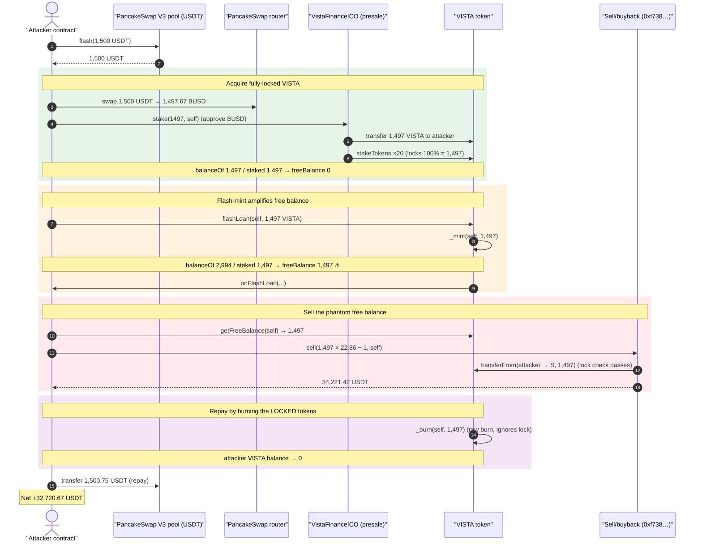
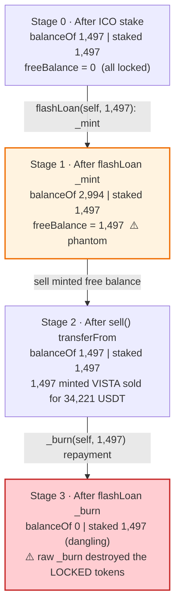
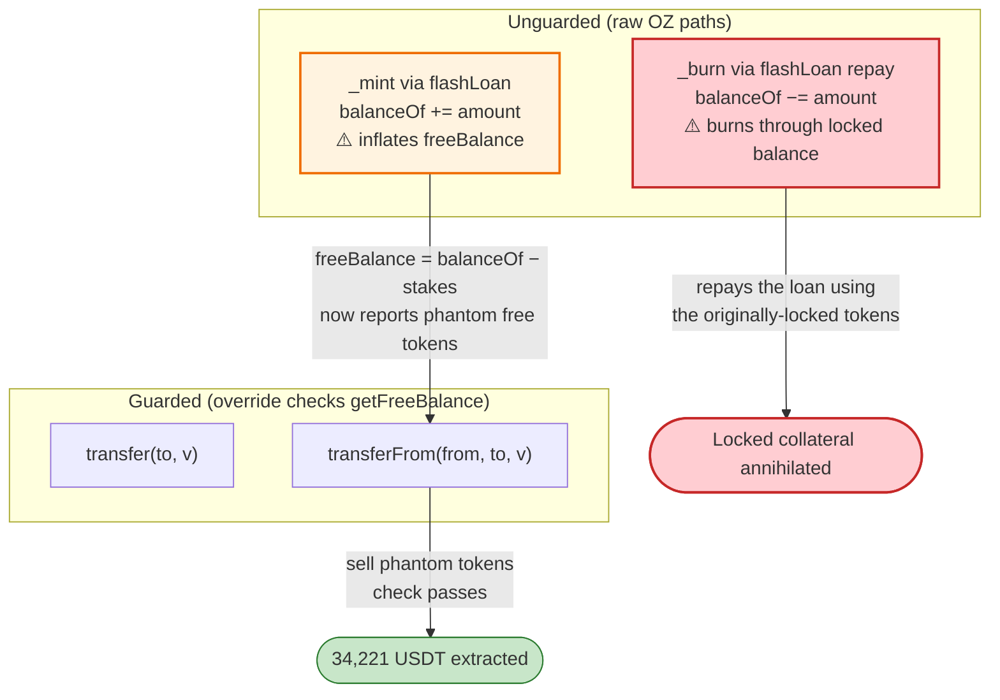

# Vista Finance Exploit — Flash-Mint Burns Through the Staking Lock to Sell Free Collateral

> **Vulnerability classes:** vuln/access-control/broken-logic · vuln/logic/incorrect-state-transition

> **Reproduction:** the PoC compiles & runs in an isolated Foundry project at
> [this project folder](.) (the umbrella DeFiHackLabs repo contains many unrelated PoCs
> that do not all compile together, so this one was extracted).
> Full verbose trace: [output.txt](output.txt).
> Verified vulnerable source: [sources/VistaFinance_493361/VistaFinance.sol](sources/VistaFinance_493361/VistaFinance.sol).

---

## Key info

| | |
|---|---|
| **Loss** | ~**29,000 USDT** (PoC nets **32,720.67 USDT** at the fork block) drained from the Vista "sell/buyback" contract |
| **Vulnerable contract** | `VistaFinance` (VISTA token) — [`0x493361D6164093936c86Dcb35Ad03b4C0D032076`](https://bscscan.com/address/0x493361D6164093936c86Dcb35Ad03b4C0D032076#code) |
| **Victim** | Vista **sell/buyback** contract `0xf738de9913bc1e21b1a985bb0E39Db75091263b7` (unverified) — pays 22.86 USDT per VISTA |
| **Price oracle** | `vistaForcePlan` — [`0xB9c3401c846f3aC4ccD2BDB1901E41C1dA463E10`](https://bscscan.com/address/0xB9c3401c846f3aC4ccD2BDB1901E41C1dA463E10#code) (`price()` = 22.86e18) |
| **ICO / staking entry** | `VistaFinanceICO` — [`0x7C98b0cEEaFCf5b5B30871362035f728955b328c`](https://bscscan.com/address/0x7C98b0cEEaFCf5b5B30871362035f728955b328c#code) |
| **Attacker EOA** | reported by TenArmor / BlockSec |
| **Attack tx** | [`0x84c385aab658d86b64e132e8db0c092756d5a9331a1131bf05f8214d08efba56`](https://app.blocksec.com/explorer/tx/bsc/0x84c385aab658d86b64e132e8db0c092756d5a9331a1131bf05f8214d08efba56) |
| **Chain / block / date** | BSC / 43,305,237 / Oct 21, 2024 |
| **Compiler** | Solidity v0.8.18, optimizer 200 runs |
| **Bug class** | Broken staking-lock invariant: ERC-3156 flash-mint inflates `balanceOf`, the lock check is computed against the **inflated** balance, and the final raw `_burn` destroys the locked tokens |
| **Source** | TenArmor — https://x.com/TenArmorAlert/status/1848403791881900130 |

---

## TL;DR

`VistaFinance` is an `ERC20FlashMint` token that **also** enforces a staking lock: `transfer` and
`transferFrom` revert unless the caller's *free balance* (`balanceOf − sumOfActiveStakes`) covers the
amount being moved ([VistaFinance.sol:4059-4073](sources/VistaFinance_493361/VistaFinance.sol#L4059-L4073)).

The two features are mutually incompatible. The standard OpenZeppelin `flashLoan`
([VistaFinance.sol:3541-3563](sources/VistaFinance_493361/VistaFinance.sol#L3541-L3563)) **mints** the
borrowed amount straight into the borrower's `balanceOf` and, at the end, **burns** it back with the
**raw, unchecked `_burn`** — neither path consults the staking lock.

That hands an attacker a free-balance amplifier:

1. Buy exactly `N` VISTA through the ICO, which **stakes 100 % of it** (20 × 5 % lock tranches) → free balance `0`.
2. `flashLoan(self, N)` → `_mint(self, N)` makes `balanceOf = 2N`, but `stakedAmount` is still `N`, so
   **`getFreeBalance` now reports `N`** even though every "real" VISTA the attacker owns is locked.
3. Inside the callback, sell that phantom free balance `N` to the protocol's fixed-price buyback
   contract (22.86 USDT / VISTA) via `transferFrom` — the lock check passes because it is computed
   against the inflated balance.
4. `flashLoan` then `_burn(self, N)` to repay. Because `_burn` ignores the lock, it simply destroys
   `N` VISTA out of the attacker's remaining balance — which is now the **originally-staked** tokens.

Net: the attacker sold `N` VISTA-worth of buyback proceeds (34,221 USDT) while only ever paying for
`N` VISTA once (1,497 BUSD, itself funded by a USDT flash loan that is repaid in full). The locked
collateral is annihilated by the flash-loan repayment burn, so the attacker walks away with the
buyback's USDT. Profit ≈ **32,720 USDT**.

---

## Background — what Vista Finance does

`VistaFinance` ([source](sources/VistaFinance_493361/VistaFinance.sol)) is a governance/utility ERC20
(`ERC20 + ERC20Burnable + ERC20Permit + ERC20Votes + ERC20FlashMint + AccessControl`) with a bolted-on
**vesting lock**:

- **Staking lock** — admin-only `stakeTokens(wallet, amount, lockDuration)` records a `Stake{amount, releaseTime}`
  per user ([:4075-4081](sources/VistaFinance_493361/VistaFinance.sol#L4075-L4081)). `transfer`/`transferFrom`
  refuse to move tokens unless the user's *free* balance exceeds the amount
  ([:4059-4073](sources/VistaFinance_493361/VistaFinance.sol#L4059-L4073)).
- **Free balance** — `getFreeBalance(user)` = `balanceOf(user) − Σ active-stake amounts`
  ([:4087-4114](sources/VistaFinance_493361/VistaFinance.sol#L4087-L4114)).
- **Flash mint** — the un-modified OpenZeppelin `ERC20FlashMint.flashLoan`, with **zero fee** and a
  burn-to-`address(0)` repayment ([:3494-3563](sources/VistaFinance_493361/VistaFinance.sol#L3494-L3563)).

The supporting pieces:

- **`VistaFinanceICO`** ([source](sources/VistaFinanceICO_7C98b0/VistaFinanceICO.sol)) — `stake(amount, sponsor)`
  takes BUSD, sends the buyer `amount` VISTA, **and immediately locks 100 % of it** in 20 monthly
  tranches of 5 % each ([:39-60](sources/VistaFinanceICO_7C98b0/VistaFinanceICO.sol#L39-L60)).
- **The sell/buyback contract** (`0xf738…63b7`, unverified) — reads `price()` (22.86 USDT) from the
  `vistaForcePlan` oracle, pulls VISTA from the seller via `transferFrom`, and pays out USDT at that
  fixed price. This is the pot of USDT the attacker drains.

The on-chain parameters at the fork block:

| Parameter | Value |
|---|---|
| Flash-loan fee | **0** (`_flashFee` returns 0, `_flashFeeReceiver` = `address(0)` → repayment is a pure burn) |
| `maxFlashLoan` | `type(uint256).max − totalSupply()` (effectively unbounded) |
| ICO lock | `stake()` locks **20 × 5 % = 100 %** of purchased VISTA |
| Buyback price | `price()` = **22.86 USDT / VISTA** |
| Attacker starting capital | **0** (everything is flash-loaned) |

---

## The vulnerable code

### 1. The lock check is `balanceOf − stakes`, computed live

```solidity
function transferFrom(address _from, address _to, uint256 _value) public virtual override returns (bool) {
    uint256 balance = getFreeBalance(_from);
    require(balance > _value, 'Tokens are Staked');
    super.transferFrom(_from, _to, _value);
    return true;
}
...
function getFreeBalance(address _userAddress) public returns (uint256) {
    ...
    uint256 balance = balanceOf(_userAddress);          // ⚠️ includes flash-minted tokens
    ...                                                 //    (prunes expired stakes)
    uint256 freeBalance = balance - stakedAmount;       // ⚠️ inflated by the flash mint
    return freeBalance;
}
```
[VistaFinance.sol:4067-4073](sources/VistaFinance_493361/VistaFinance.sol#L4067-L4073),
[:4087-4114](sources/VistaFinance_493361/VistaFinance.sol#L4087-L4114)

### 2. `flashLoan` mints into `balanceOf` and burns with the raw `_burn`

```solidity
function flashLoan(IERC3156FlashBorrower receiver, address token, uint256 amount, bytes calldata data)
    public virtual override returns (bool)
{
    require(amount <= maxFlashLoan(token), "ERC20FlashMint: amount exceeds maxFlashLoan");
    uint256 fee = flashFee(token, amount);
    _mint(address(receiver), amount);                   // ⚠️ balanceOf += amount, no lock awareness
    require(
        receiver.onFlashLoan(msg.sender, token, amount, fee, data) == _RETURN_VALUE,
        "ERC20FlashMint: invalid return value"
    );
    address flashFeeReceiver = _flashFeeReceiver();      // == address(0)
    _spendAllowance(address(receiver), address(this), amount + fee);
    if (fee == 0 || flashFeeReceiver == address(0)) {
        _burn(address(receiver), amount + fee);          // ⚠️ raw _burn: ignores the staking lock
    } else { ... }
    return true;
}
```
[VistaFinance.sol:3541-3563](sources/VistaFinance_493361/VistaFinance.sol#L3541-L3563)

The custom `_burn` override just forwards to OZ `_burn` + a votes checkpoint
([:4052-4057](sources/VistaFinance_493361/VistaFinance.sol#L4052-L4057),
[:3869-3873](sources/VistaFinance_493361/VistaFinance.sol#L3869-L3873)) — it never calls
`getFreeBalance`, so it can (and does) burn through locked balance.

This is exactly the original report's note: *"flashloan will burn the token, but not check the token is freezed or not."*

---

## Root cause — why it was possible

The staking lock is an **invariant**: *"a user can never move more than `balanceOf − Σ stakes`."* The
token enforces it on the only two mutators it overrode — `transfer` and `transferFrom`. But it left
**two balance-changing primitives unguarded**:

1. **`_mint` via `flashLoan`** inflates `balanceOf` without inflating `stakedAmount`, so it inflates
   `getFreeBalance` 1:1. A user with 100 % of their balance locked can flash-mint `N` and suddenly have
   `N` "free" tokens to move — *those phantom tokens are indistinguishable from real free balance to the
   lock check.*
2. **`_burn` via the flash repayment** ignores the lock entirely. So the loan can be repaid by burning
   the **locked** tokens, while the freshly-minted tokens were already spent (sold) during the callback.

Composed, the two gaps let the attacker convert *locked* VISTA into *spendable* VISTA for the duration
of a single flash loan: sell the minted tokens, repay by burning the locked tokens. The vesting lock —
the entire point of routing ICO buyers through 20 tranches — is bypassed in one transaction.

The fixed-price buyback contract is the actual victim: it paid 22.86 USDT for each VISTA the attacker
"sold," but every one of those VISTA was a transient flash-mint that no longer exists after the
transaction. The protocol effectively bought back tokens that were created and destroyed within the
same call.

Two design decisions turn this from a curiosity into a profitable drain:

- **The flash loan is free** (`fee == 0`, fee receiver `address(0)`), so the repayment is a clean burn
  with no economic cost.
- **The buyback price is a fixed 22.86 USDT** read from an oracle, far above what the attacker paid to
  enter (1,497 BUSD for 1,497 VISTA ≈ 1 USDT/VISTA via the ICO). The 22.86× spread is the margin the
  attacker harvests.

---

## Preconditions

- A VISTA holder whose tokens are **staked/locked** (the attacker manufactures this by buying through
  the ICO, which locks 100 % of the purchase).
- A **fixed-price buyback / sell venue** that pays more per VISTA than the ICO entry price and uses
  `transferFrom` (so it is subject to — and fooled by — the inflated free-balance check).
- The token exposes `ERC20FlashMint.flashLoan` with no override to (a) exclude minted balance from the
  lock or (b) check the lock on burn. Both hold here.
- Working capital to bootstrap the BUSD for the ICO purchase. The attacker uses a **PancakeSwap V3
  USDT flash loan** (1,500 USDT, 0.05 % fee = 0.75 USDT), so net starting capital is **0**.

---

## Attack walkthrough (with on-chain numbers from the trace)

All figures are read directly from [output.txt](output.txt). The attacker (`ContractTest`) starts and
ends with 0 of its own capital; everything is flash-loaned.

| # | Step | Call | Concrete numbers |
|---|------|------|------------------|
| 0 | **Start** | — | Attacker USDT = **0** ([:1621](output.txt#L1621)) |
| 1 | **PancakeSwap V3 flash loan** | `pool.flash(self, 1500e18 USDT, 0, "")` | Borrows **1,500 USDT**; fee **0.75 USDT** ([:1622-1632](output.txt#L1622-L1632)) |
| 2 | **Swap USDT→BUSD** | `router.swapExact…(1500 USDT → BUSD)` | Receives **1,497.67 BUSD** ([:1643-1678](output.txt#L1643-L1678)) |
| 3 | **ICO stake** | `presale.stake(1497, self)` | Pays **1,497 BUSD**; receives **1,497 VISTA**; ICO calls `stakeTokens` ×20 → **1,497 VISTA fully locked** (20 × 74.85) ([:1692-1864](output.txt#L1692-L1864)) |
| 4 | **State after stake** | `getFreeBalance(self)` | balance **1,497** − staked **1,497** = **free balance 0** |
| 5 | **Flash-mint VISTA** | `VISTA.flashLoan(self, VISTA, 1497e18, "")` | `_mint(self, 1497)` → balance **2,994**, staked **1,497** ([:1876-1877](output.txt#L1876-L1877)) |
| 6 | **Free balance inflated** | `getFreeBalance(self)` (inside callback) | returns **1,497e18** (= `2994 − 1497`) ([:1879-1880](output.txt#L1879-L1880)) |
| 7 | **Sell phantom VISTA** | `sale.sell(1497·22.86 − 1, self)` | Oracle `price()` = **22.86** ([:1887-1888](output.txt#L1887-L1888)); pulls **1,497 VISTA** via `transferFrom` (lock check passes on inflated balance) ([:1891-1898](output.txt#L1891-L1898)); pays out **34,221.42 USDT** ([:1899-1904](output.txt#L1899-L1904)) |
| 8 | **Repay flash mint** | end of `flashLoan` | `_burn(self, 1497e18)` → attacker balance **2,994 − 1,497(sold) − 1,497(burned) = 0**; the burned 1,497 were the **originally-locked** tokens ([:1908-1914](output.txt#L1908-L1914)) |
| 9 | **Repay V3 flash loan** | `USDT.transfer(pool, 1500.75)` | Returns **1,500.75 USDT** to the V3 pool ([:1915-1920](output.txt#L1915-L1920)) |
| 10 | **End** | `USDT.balanceOf(self)` | **32,720.67 USDT** ([:1931-1933](output.txt#L1931-L1933)) |

### Profit accounting (USDT)

| Direction | Amount (USDT) |
|---|---:|
| In — buyback `sell()` proceeds | +34,221.42 |
| Out — PancakeSwap V3 flash-loan repayment (1,500 + 0.75 fee) | −1,500.75 |
| **Net profit** | **+32,720.67** |

The 1,497 BUSD "spent" on the ICO is itself bought with the borrowed 1,500 USDT, which is repaid in the
final step — so the attacker's only true input is the 0.75 USDT flash fee, fully covered by the
proceeds. (The reported headline loss is ~29k USDT; the PoC nets 32.72k at this specific block, the
difference being price/route slippage versus the original mainnet transaction.)

---

## Diagrams

### Sequence of the attack



### Free-balance state evolution (the broken invariant)



### Why the lock is bypassed: which mutators check `getFreeBalance`



---

## Why each magic number

- **1,500 USDT flash loan / 1,497 ICO stake:** sized so the resulting VISTA balance (1,497) is small
  enough to fund cheaply yet large enough that the 22.86× buyback spread covers the flash fee with a
  large margin. The ICO multiplies by `10**18` internally, so the attacker passes `1497` (whole units).
- **`getFreeBalance × 22_860_000_000_000_000_000 / 1e18 − 1`:** the buyback pays `price()` = 22.86 USDT
  per VISTA. The attacker computes the maximum USDT the buyback will pay for its free balance; the `−1`
  avoids an off-by-one rounding revert in the `sell` contract. `1,497 × 22.86 = 34,221.42`.
- **20 × 5 % ICO lock tranches:** the ICO design locks the *entire* purchase, which is precisely what
  makes the attack legible — the attacker's whole 1,497 VISTA is collateral that the flash-mint then
  "frees" on paper.

---

## Remediation

1. **Make the lock invariant a property of `_update`/`_beforeTokenTransfer`, not of two public
   wrappers.** Enforcing the free-balance check only in `transfer`/`transferFrom` leaves `_mint`,
   `_burn`, and any future internal mover unguarded. Move the check to the lowest-level hook so it
   applies uniformly.
2. **Exclude flash-minted balance from `getFreeBalance` (or disable flash mint).** A token that vests
   balances and also offers `ERC20FlashMint` must reconcile the two: either track a `flashMinted[user]`
   amount and subtract it in `getFreeBalance`, or simply do **not** inherit `ERC20FlashMint`. The OZ
   flash-mint extension was never designed to coexist with a transfer-restricting overlay.
3. **Never repay a flash loan by burning unrestricted balance.** If flash mint is retained, the
   repayment `_burn` must burn *only* the previously-minted amount and must fail if the borrower's
   non-minted (i.e., locked) balance would be touched.
4. **Do not pay a fixed oracle price for tokens via `transferFrom`-based buybacks without verifying the
   seller's tokens are "real."** The buyback contract should, at minimum, snapshot total supply / the
   seller's *vested* balance, or require the sold tokens to have been held (unlocked) for a minimum
   period — a fixed-price sink is a magnet for any balance-inflation bug in the token.
5. **Charge a non-zero flash fee and/or restrict flash-mint recipients.** A free, unbounded flash mint
   on a token with economic side-effects (vesting, buybacks, governance weight) is a standing hazard.

---

## How to reproduce

The PoC was extracted into a standalone Foundry project:

```bash
_shared/run_poc.sh 2024-10-VISTA_exp -vvvvv
```

- RPC: a **BSC archive** endpoint is required (fork block 43,305,237). `foundry.toml` uses
  `https://bsc-mainnet.public.blastapi.io`, which serves historical state at that block; most pruned
  public BSC RPCs fail with `header not found` / `missing trie node`.
- Result: `[PASS] testExploit()` with the attacker ending on **32,720.67 USDT** from a 0-capital start.

Expected tail:

```
[PASS] testExploit() (gas: 1499812)
  [Begin] Attacker USDT before exploit: 0.000000000000000000
  pancakeV3FlashCallback
  [End] Attacker USDT after exploit: 32720.669999999999999999

Suite result: ok. 1 passed; 0 failed; 0 skipped
```

---

*Reference: TenArmor Alert — https://x.com/TenArmorAlert/status/1848403791881900130 ; BlockSec Explorer —
https://app.blocksec.com/explorer/tx/bsc/0x84c385aab658d86b64e132e8db0c092756d5a9331a1131bf05f8214d08efba56*
