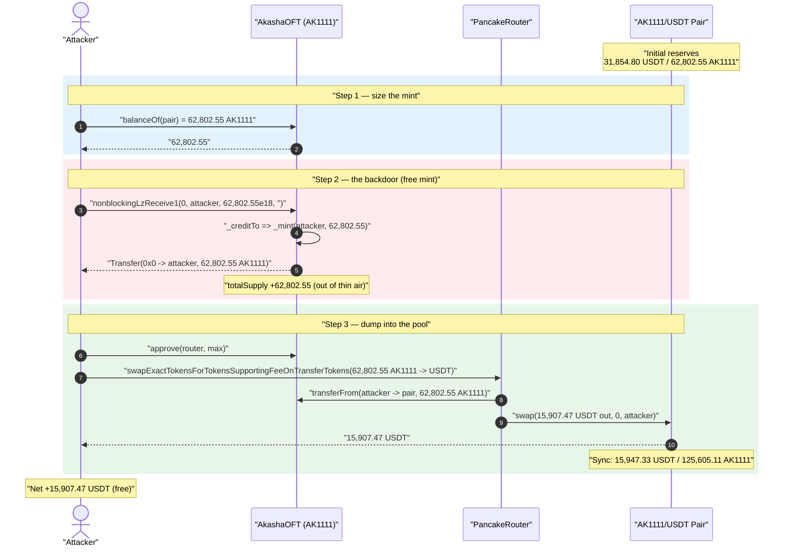
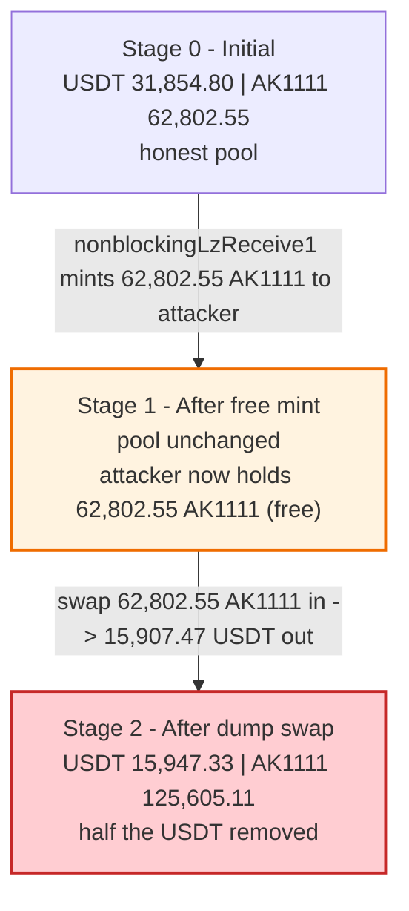

# AkashaOFT (AK1111) Exploit — Permissionless `nonblockingLzReceive1()` Free-Mint Backdoor

> **Vulnerability classes:** vuln/access-control/missing-auth · vuln/bridge/missing-validation

> **Reproduction:** the PoC compiles & runs in an isolated Foundry project at
> [this project folder](.) (the umbrella DeFiHackLabs repo contains many unrelated
> PoCs that do not whole-compile under `forge test`, so this one was extracted).
> Full verbose trace: [output.txt](output.txt).
> Verified vulnerable source: [contracts_token_oft_v1_OFT.sol](sources/AkashaOFT_c3B1b4/contracts_token_oft_v1_OFT.sol).

---

## Key info

| | |
|---|---|
| **Loss** | ~**15,907.5 USDT** drained from the AK1111/USDT PancakeSwap pair in this single PoC tx (incident reported at ~$31.5K total) |
| **Vulnerable contract** | `AkashaOFT` (AK1111) — [`0xc3B1b45e5784A8efececfC0BE2E28247d3f49963`](https://bscscan.com/address/0xc3B1b45e5784A8efececfC0BE2E28247d3f49963#code) |
| **Victim pool** | AK1111/USDT PancakeSwap V2 pair — [`0x794ed5E8251C4A8D321CA263D9c0bC8Ecf5fA1FF`](https://bscscan.com/address/0x794ed5E8251C4A8D321CA263D9c0bC8Ecf5fA1FF) |
| **Attacker EOA** | [`0xCe21C6e4fa557A9041FA98DFf59A4401Ef0a18aC`](https://bscscan.com/address/0xCe21C6e4fa557A9041FA98DFf59A4401Ef0a18aC) |
| **Attacker contract** | [`0xbFD7280B11466bc717EB0053A78675aed2C2E388`](https://bscscan.com/address/0xbFD7280B11466bc717EB0053A78675aed2C2E388) |
| **Attack tx** | [`0xc29c98da0c14f4ca436d38f8238f8da1c84c4b1ee6480c4b4facc4b81a013438`](https://bscscan.com/tx/0xc29c98da0c14f4ca436d38f8238f8da1c84c4b1ee6480c4b4facc4b81a013438) |
| **Chain / block / date** | BSC / 44,280,828 (fork block) / Nov 24, 2024 |
| **Compiler** | Solidity v0.8.12, optimizer **200 runs** |
| **Bug class** | Missing access control → unrestricted `_mint` (free-mint backdoor in a LayerZero OFT) |

---

## TL;DR

`AkashaOFT` is a LayerZero **OFT v1** (Omnichain Fungible Token) where new supply is normally minted
**only** when a cross-chain message arrives through the LayerZero endpoint. That path is heavily
guarded: `lzReceive` requires `msg.sender == lzEndpoint` and a matching `trustedRemote`, and the
public `nonblockingLzReceive` requires `msg.sender == address(this)`.

The deployer bolted on an extra, look-alike function — **`nonblockingLzReceive1`** — that bypasses
every one of those checks:

```solidity
function nonblockingLzReceive1(uint16 _srcChainId, address _srcAddress, uint256 _nonce, bytes memory _payload)
    public virtual override
{
    _creditTo(_srcChainId, _srcAddress, _nonce);   // _creditTo(_, to, amount) => _mint(to, amount)
}
```

It is `public`, has **no access control**, and treats its `_nonce` argument as the **mint amount**.
[contracts_token_oft_v1_OFT.sol:26-33](sources/AkashaOFT_c3B1b4/contracts_token_oft_v1_OFT.sol#L26-L33)

The attacker simply:

1. Reads how much AK1111 the PancakeSwap pair holds (its `reserve1` = 62,802.55 AK1111).
2. Calls `nonblockingLzReceive1(0, attacker, 62802.55e18, "")` → mints **62,802.55 AK1111 for free**.
3. Swaps that entire free mint into the pool for **15,907.5 USDT**, draining the USDT side.

No flash loan, no capital, no setup. One free mint + one swap.

---

## Background — what AkashaOFT (AK1111) is

`AkashaOFT` ([contracts_AkashaOFT.sol](sources/AkashaOFT_c3B1b4/contracts_AkashaOFT.sol)) is a thin
wrapper around the LayerZero **OFT v1** reference implementation:

```
AkashaOFT  ─is─►  OFT  ─is─►  OFTCore, ERC20
                              OFTCore ─is─►  NonblockingLzApp ─is─►  LzApp
```

In the legitimate OFT design, tokens are *burned* on the source chain (`_debitFrom`) and *minted* on
the destination chain (`_creditTo` → `ERC20._mint`). The destination mint can only be reached via the
LayerZero endpoint message pipeline:

```
lzEndpoint ──► LzApp.lzReceive ──► NonblockingLzApp._blockingLzReceive
            ──► this.nonblockingLzReceive ──► _nonblockingLzReceive
            ──► OFTCore._sendAck ──► _creditTo ──► _mint
```

Every hop in that pipeline is access-controlled:

- `LzApp.lzReceive`: `require(_msgSender() == address(lzEndpoint), "LzApp: invalid endpoint caller")`
  and a `trustedRemote` match
  ([contracts_lzApp_LzApp.sol:42-50](sources/AkashaOFT_c3B1b4/contracts_lzApp_LzApp.sol#L42-L50)).
- `NonblockingLzApp.nonblockingLzReceive`:
  `require(_msgSender() == address(this), "NonblockingLzApp: caller must be LzApp")`
  ([contracts_lzApp_NonblockingLzApp.sol:54-63](sources/AkashaOFT_c3B1b4/contracts_lzApp_NonblockingLzApp.sol#L54-L63)).

On-chain facts at the fork block (from the trace,
[output.txt:1581-1604](output.txt#L1581-L1604)):

| Parameter | Value |
|---|---|
| AK1111 `totalSupply` (before) | 1,000,001,002 AK1111 |
| AK1111 held by the pair (pool reserve1) | **62,802.5536 AK1111** ← target |
| USDT held by the pair (pool reserve0) | **31,854.8012 USDT** ← the prize |
| Attacker AK1111 balance (before) | 0 |
| Attacker USDT balance (before) | 26.5422 (test-harness dust) |

---

## The vulnerable code

### 1. The unguarded mint backdoor (`OFT.nonblockingLzReceive1`)

[contracts_token_oft_v1_OFT.sol:26-33](sources/AkashaOFT_c3B1b4/contracts_token_oft_v1_OFT.sol#L26-L33):

```solidity
function nonblockingLzReceive1(
    uint16 _srcChainId,
    address _srcAddress,
    uint256 _nonce,          // ⚠️ semantically the MINT AMOUNT, not a nonce
    bytes memory _payload
) public virtual override {  // ⚠️ public, no auth, no trustedRemote, no endpoint check
    _creditTo(_srcChainId, _srcAddress, _nonce);
}
```

And `_creditTo` is just an unconditional `_mint`
([contracts_token_oft_v1_OFT.sol:51-58](sources/AkashaOFT_c3B1b4/contracts_token_oft_v1_OFT.sol#L51-L58)):

```solidity
function _creditTo(uint16, address _toAddress, uint _amount) internal virtual override returns (uint) {
    _mint(_toAddress, _amount);   // ERC20._mint — mints _amount to _toAddress
    return _amount;
}
```

So `nonblockingLzReceive1(anyChain, recipient, amount, "")` ⇒ `_mint(recipient, amount)` for an
**arbitrary `recipient`** and **arbitrary `amount`**, callable by **anyone**.

### 2. The look-alike stub in the parent (the camouflage)

The same selector exists as an **empty body** in the parent `NonblockingLzApp`
([contracts_lzApp_NonblockingLzApp.sol:65-70](sources/AkashaOFT_c3B1b4/contracts_lzApp_NonblockingLzApp.sol#L65-L70)):

```solidity
function nonblockingLzReceive1(uint16 _srcChainId, address _srcAddress, uint256 _nonce, bytes memory _payload)
    public virtual { }   // looks harmless here…
```

…but `OFT` `override`s it with the live `_mint`. A reviewer skimming `NonblockingLzApp` sees a no-op;
the dangerous override lives one file away in `OFT`. The same file also carries two further hardcoded
backdoors (`retryMessag2` / `retryMessag3`,
[:97-121](sources/AkashaOFT_c3B1b4/contracts_lzApp_NonblockingLzApp.sol#L97-L121)) that sweep the
contract's balances to whoever matches a hardcoded `keccak256(msg.sender)` hash — strong evidence the
whole token was a deliberately rugged / backdoored deployment rather than an honest OFT.

### 3. Contrast: the legitimate selector *is* properly guarded

`nonblockingLzReceive` (no "1") in the same parent — the real LayerZero function — does have the guard
the backdoor lacks
([contracts_lzApp_NonblockingLzApp.sol:54-63](sources/AkashaOFT_c3B1b4/contracts_lzApp_NonblockingLzApp.sol#L54-L63)):

```solidity
function nonblockingLzReceive(uint16 _srcChainId, bytes calldata _srcAddress, uint64 _nonce, bytes calldata _payload)
    public virtual
{
    require(_msgSender() == address(this), "NonblockingLzApp: caller must be LzApp"); // ← the guard
    _nonblockingLzReceive(_srcChainId, _srcAddress, _nonce, _payload);
}
```

The "1" variant copies the *name* but drops the `require`.

---

## Root cause — why it was possible

The minting privilege of an OFT is supposed to be reachable through exactly **one** path: an
authenticated LayerZero message (`lzEndpoint` + `trustedRemote`), which proves an equal amount of
supply was burned on another chain. The OFT's whole accounting invariant — *global supply across all
chains is conserved* — rests on that single guarded entry point.

`nonblockingLzReceive1` punches a second, **unauthenticated** hole straight into `_mint`:

> Any address can call `nonblockingLzReceive1(_, recipient, amount, "")` and `_mint(recipient, amount)`.
> No endpoint check, no trusted-remote check, no `msg.sender == address(this)` check, no owner check,
> no corresponding burn on any chain.

Two design choices compose into a critical bug:

1. **No access control on a mint-capable function.** The single most important invariant of any token
   — "only authorized code can increase supply" — is violated outright. The function is `public` and
   anyone can call it.
2. **Parameter overloading hides intent.** The third argument is named `_nonce` (mimicking the real
   LayerZero signature) but is fed directly to `_mint` as the *amount*. A caller controls exactly how
   many tokens are conjured.

Because the attacker can mint *any* amount, they choose the amount that is most profitable to dump:
the entire AK1111 reserve currently sitting in the pool, so the swap pulls out close to half of the
pool's USDT without crossing into deeply unfavorable price territory.

---

## Preconditions

- A liquid AK1111/USDT market exists (the PancakeSwap pair holds real USDT). **No other precondition.**
- **No capital required.** The mint is free; the attacker's starting balance is irrelevant.
- **No flash loan, no timing window, no special role.** `nonblockingLzReceive1` is permissionless and
  always callable.

---

## Attack walkthrough (with on-chain numbers from the trace)

The pair's `token0 = USDT` (`0x55d3…955`), `token1 = AK1111` (`0xc3B1…963`), since
`USDT < AK1111` by address. So `reserve0 = USDT`, `reserve1 = AK1111`. All figures below come directly
from the calls/events in [output.txt:1573-1635](output.txt#L1573-L1635).

| # | Step | Call / event | AK1111 in pool | USDT in pool | Attacker AK1111 | Attacker USDT |
|---|------|------|---:|---:|---:|---:|
| 0 | **Initial** | `getReserves()` → (31,854.80 USDT, 62,802.55 AK1111) | 62,802.55 | 31,854.80 | 0 | 26.54 |
| 1 | **Read target** | `ak1111.balanceOf(pair)` = 62,802.5536 | 62,802.55 | 31,854.80 | 0 | 26.54 |
| 2 | **Free mint** | `nonblockingLzReceive1(0, attacker, 62802.5536e18, "")` → `Transfer(0x0 → attacker, 62,802.55)`; totalSupply 1,000,001,002 → 1,000,063,804.55 | 62,802.55 | 31,854.80 | **62,802.55** | 26.54 |
| 3 | **Approve** | `approve(router, type(uint256).max)` | 62,802.55 | 31,854.80 | 62,802.55 | 26.54 |
| 4 | **Swap in** | router `transferFrom(attacker → pair, 62,802.55 AK1111)` | **125,605.11**¹ | 31,854.80 | 0 | 26.54 |
| 5 | **Swap out** | `pair.swap(15,907.47 USDT out, 0, attacker, "")` → `Sync(reserve0=15,947.33 USDT, reserve1=125,605.11 AK1111)` | 125,605.11 | **15,947.33** | 0 | **15,934.01** |

¹ After the attacker's 62,802.55 AK1111 is added to the pair's pre-existing 62,802.55, the pair's
AK1111 balance is 125,605.11 (the trace's `balanceOf(pair)` = `1.256e23`). The constant-product math
on that balance yields 15,907.47 USDT out (≈ half the 31,854.80 USDT reserve).

**Why the swap returns ~half the USDT reserve:** the attacker doubles the pool's AK1111 side
(62,802.55 → 125,605.11) in one swap. With PancakeSwap's 0.25% fee, doubling the input reserve pulls
out `≈ reserveOut × (in·9975) / (reserveIn·10000 + in·9975)` ≈ `31,854.80 × 0.4996 ≈ 15,907.5` USDT.

### Profit accounting (USDT)

| Direction | Amount (USDT) |
|---|---:|
| Attacker USDT before (harness dust) | 26.5422 |
| Attacker USDT after | 15,934.0086 |
| **Net profit** | **+15,907.4665** |

The 15,907.47 USDT extracted equals the USDT the pool paid out for the free-minted AK1111 — i.e. the
attacker walked off with roughly half of the pool's entire USDT reserve, having spent nothing. (The
~$31.5K headline loss reported for the incident is larger than this single reproduced tx, consistent
with the real attacker repeating the free-mint/dump and/or draining additional liquidity beyond what
this minimal PoC reproduces.)

---

## Diagrams

### Sequence of the attack



### Pool state evolution



### The flaw: legitimate mint path vs. the backdoor

```mermaid
flowchart TD
    subgraph Legit["Legitimate mint path (all guarded)"]
        L0["LayerZero endpoint"] --> L1["LzApp.lzReceive<br/>require msg.sender == lzEndpoint<br/>require trustedRemote match"]
        L1 --> L2["NonblockingLzApp._blockingLzReceive"]
        L2 --> L3["nonblockingLzReceive<br/>require msg.sender == address(this)"]
        L3 --> L4["_nonblockingLzReceive -> _sendAck"]
        L4 --> L5["_creditTo -> _mint"]
    end

    subgraph Backdoor["Backdoor path (zero guards)"]
        B0(["Anyone (EOA / contract)"]) --> B1["nonblockingLzReceive1<br/>PUBLIC - no checks at all"]
        B1 --> B2["_creditTo(_, recipient, _nonce)"]
        B2 --> B3(["_mint(recipient, arbitrary amount)"])
    end

    style B1 fill:#ffcdd2,stroke:#c62828,stroke-width:2px
    style B3 fill:#ffcdd2,stroke:#c62828,stroke-width:2px
    style L1 fill:#c8e6c9,stroke:#2e7d32
    style L3 fill:#c8e6c9,stroke:#2e7d32
```



---

## Remediation

1. **Delete `nonblockingLzReceive1` (and `retryMessag2` / `retryMessag3`).** They have no legitimate
   purpose; the real LayerZero receive pipeline (`lzReceive` → `_blockingLzReceive` →
   `nonblockingLzReceive`) is the only mint path an OFT needs. These look-alike functions are
   straightforward backdoors.
2. **Never expose a mint-capable function without access control.** If a manual mint entry point is
   genuinely required, gate it with `onlyOwner` / a role and, for an OFT, never let it bypass the
   cross-chain burn↔mint conservation invariant.
3. **Audit by selector, not by file.** A function named like a known-safe one (`nonblockingLzReceive`
   vs `nonblockingLzReceive1`) and stubbed empty in a parent while `override`n to `_mint` in a child is
   a classic camouflage pattern. Diff the deployed contract against the canonical LayerZero OFT
   reference and flag every added/renamed function.
4. **Treat parameter naming as part of the spec.** A `uint256 _nonce` argument forwarded directly into
   `_mint` as the amount is a red flag — argument names that lie about their use should fail review.
5. **For integrators / LPs:** never provide liquidity against an OFT (or any token) whose verified
   source contains unauthenticated paths into `_mint`, or hardcoded `keccak256(msg.sender)` owner
   checks. Both are present here.

---

## How to reproduce

The PoC was extracted into a standalone Foundry project (the umbrella DeFiHackLabs repo has many
unrelated PoCs that fail to compile under `forge test`'s whole-project build). The extra local imports
`../basetest.sol` and `./tokenhelper.sol` were copied into the project root alongside the shared
`interface.sol`.

```bash
_shared/run_poc.sh 2024-11-Ak1111_exp -vvvvv
```

- RPC: a **BSC archive** endpoint is required (fork block 44,280,828). `foundry.toml` uses
  `https://bsc-mainnet.public.blastapi.io`, which serves historical state at that block; most public
  BSC RPCs prune it and fail with `header not found` / `missing trie node`.
- Result: `[PASS] testExploit()`; the attacker's USDT balance rises from 26.54 to **15,934.01 USDT**.

Expected tail:

```
[PASS] testExploit() (gas: 142678)
Logs:
  Attacker Before exploit USDT Balance: 26.542161622221038197
  Attacker After exploit USDT Balance: 15934.008614585204780810

Suite result: ok. 1 passed; 0 failed; 0 skipped; finished in 4.73s
```

---

*Reference: TenArmor alert — https://x.com/TenArmorAlert/status/1860554838897197135 (AK1111, BSC, ~$31.5K).*
