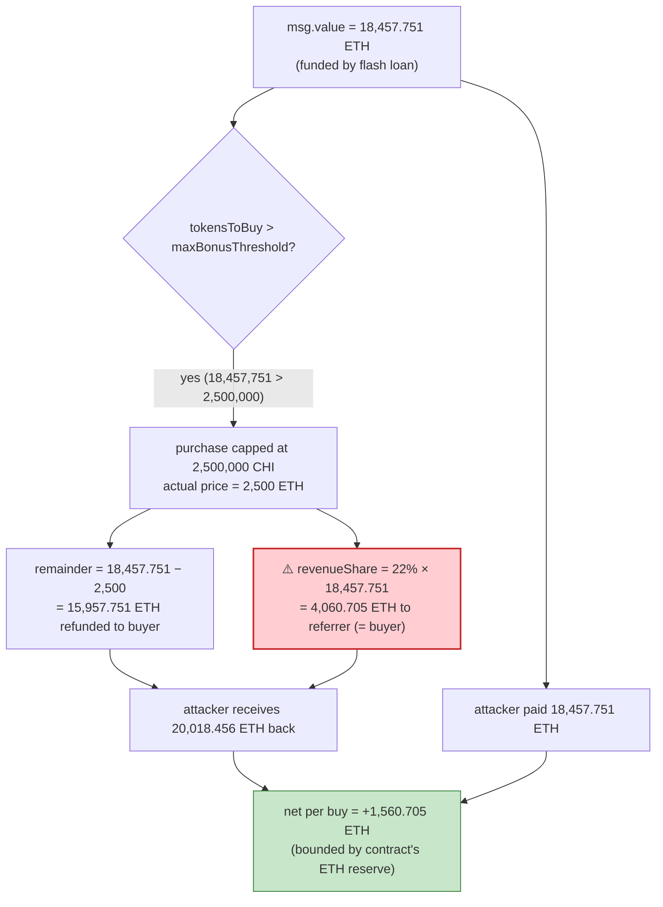
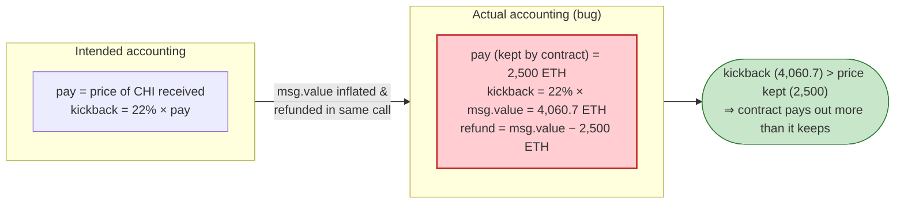

# ChiSale Exploit — Revenue-Share Computed on Full `msg.value` (Self-Referral ETH Drain)

> **Vulnerability classes:** vuln/logic/fee-calculation · vuln/logic/incorrect-order-of-operations · vuln/access-control/broken-logic

> **Reproduction:** the PoC compiles & runs in an isolated Foundry project at
> [this project folder](.) (the umbrella DeFiHackLabs repo contains many
> unrelated PoCs that do not whole-compile, so this one was extracted).
> Full verbose trace: [output.txt](output.txt).
> Verified vulnerable source: [ChiSale.sol](sources/ChiSale_050163/ChiSale.sol).

---

## Key info

| | |
|---|---|
| **Loss** | ~$16.3k — **5.78078 ETH** drained from the `ChiSale` contract's ETH reserves |
| **Vulnerable contract** | `ChiSale` — [`0x050163597D9905bA66400f7B3CA8f2ef23DF702D`](https://etherscan.io/address/0x050163597d9905ba66400f7b3ca8f2ef23df702d#code) |
| **Token sold** | `ChiToken` (CHI, **0 decimals**) — [`0x71E1f8E809Dc8911FCAC95043bC94929a36505A5`](https://etherscan.io/address/0x71E1f8E809Dc8911FCAC95043bC94929a36505A5) |
| **Flash-loan source** | Balancer Vault — `0xBA12222222228d8Ba445958a75a0704d566BF2C8` (0 fee) |
| **Attacker EOA** | [`0xe60329a82c5add1898ba273fc53835ac7e6fd5ca`](https://bscscan.com/address/0xe60329a82c5add1898ba273fc53835ac7e6fd5ca) (per PoC header); on-chain replay sender `0xEE4073183E07Aa0FC1B96D6308793840f02B6e88` |
| **Attacker contract** | `0x931b8905C310Ab133373f50ba66FEba2793F80eA` (flash-loan recipient / receiver) |
| **Helper contract** | `0x83F015Cf92626fBA4368a2C8489eB01FA3e6044b` (`test()` wrapper around `buy()`, unverified) |
| **Attack tx** | [`0x586a2a4368a1a45489a8a9b4273509b524b672c33e6c544d2682771b44f05e87`](https://app.blocksec.com/explorer/tx/eth/0x586a2a4368a1a45489a8a9b4273509b524b672c33e6c544d2682771b44f05e87) |
| **Chain / block / date** | Ethereum mainnet / 21,132,838 / Nov 7, 2024 |
| **Compiler** | Solidity **v0.4.21**, optimizer off |
| **Bug class** | Incorrect refund/payout accounting — revenue share paid on the *full* `msg.value` instead of the *actual* purchase amount; combined with permissionless self-referral |

---

## TL;DR

`ChiSale.buy()` is a 2018-era token-sale contract. A buyer sends ETH; the contract gives out
`tokensToBuy = msg.value / 0.001 ETH` CHI, refunds any unused ETH, and pays a **22% "revenue share"**
to the `referralAddress`.

There are two independent design flaws that compose into a money pump:

1. **The 22% revenue share is computed on `msg.value`** — the *entire* ETH sent — even when most of
   that ETH is immediately refunded because the purchase was capped at `maxBonusThreshold`
   ([ChiSale.sol:261-263](sources/ChiSale_050163/ChiSale.sol#L261-L263)).
2. **There is no check that `referralAddress != msg.sender`** — a buyer can name *themselves* as the
   referrer ([ChiSale.sol:252](sources/ChiSale_050163/ChiSale.sol#L252) only excludes the
   contract's own address and the zero address).

So an attacker sends a deliberately **oversized** `msg.value`, lists themselves as referrer, and the
contract:

- caps the purchase at `maxBonusThreshold` (2,500,000 CHI = `2,500 ETH` of actual purchase),
- **refunds** `msg.value − 2,500 ETH`, and
- **pays the attacker 22% of the full `msg.value`** as "revenue share".

Net per buy = `0.22 × msg.value − 2,500 ETH`. With `msg.value ≈ 18,457.75 ETH`, that is
`+1,560.71 ETH` extracted from the contract's reserves. The attacker funded the oversized `msg.value`
with a **25,000 WETH Balancer flash loan (0 fee)**, repaid it in the same transaction, and walked away
with the **5.78078 ETH** that was actually sitting in the `ChiSale` contract.

---

## Background — what ChiSale does

`ChiSale` ([source](sources/ChiSale_050163/ChiSale.sol)) sells the **CHI** ERC-20 token (an
integer-only token, `decimals = 0`, [ChiToken.sol:46](sources/ChiToken_71E1f8/ChiToken.sol#L46)) at a
fixed price with a tiered bonus and a referral kickback:

- **Fixed price.** `TOKEN_PRICE = 0.001 ether`, i.e. `1 ETH = 1000 CHI`
  ([ChiSale.sol:109](sources/ChiSale_050163/ChiSale.sol#L109)).
- **Bonus tiers.** Early buyers get extra CHI (75% down to 2%), tracked by `tokensSold`,
  `bonusIndex`, and 9 `bonusTiers`. The sale is meant to run until ~2,000,000 CHI are sold.
- **Referral / revenue share.** `REVENUE_SHARE_PERCENTAGE = 22`
  ([ChiSale.sol:115](sources/ChiSale_050163/ChiSale.sol#L115)). If a buyer passes a `referralAddress`
  other than the sale contract or `address(0)`, that address receives `22% of msg.value`.
- **Purchase cap & refund.** A buyer cannot acquire more than `maxBonusThreshold` CHI; any ETH beyond
  the cap (or beyond a whole-token boundary) is refunded as `remainder`.

On-chain state at the fork block (read with `cast`):

| Parameter | Value |
|---|---|
| `TOKEN_PRICE` | `0.001 ETH` (`1e15` wei) |
| `REVENUE_SHARE_PERCENTAGE` | **22%** |
| `getSoldTokens()` (`tokensSold`) | **6,507 CHI** |
| `maxBonusThreshold` (slot 4) | **2,500,000 CHI** |
| `bonusTiers.length` (slot 1) | 9 |
| CHI balance held by the sale contract | **2,488,617 CHI** |
| CHI decimals | **0** |

The single fact that makes the bug *profitable rather than merely wrong* is the 22% kickback being
**larger than the actual price paid** whenever the purchase is capped: refund returns the over-payment,
but the kickback is still scored against the gross `msg.value`.

---

## The vulnerable code

### 1. Purchase is capped, but `remainder` returns the over-payment

```solidity
function buy(address referralAddress) external payable {
    uint256 tokensToBuy = msg.value / TOKEN_PRICE;          // gross token count
    uint256 tokenBalance = chiContract.balanceOf(address(this));
    uint256 remainder = msg.value % TOKEN_PRICE;

    if (maxBonusThreshold < tokenBalance) {
        maxBonusThreshold = tokenBalance;
    }

    // Purchase is limited to maxBonusThreshold; the rest of msg.value is refunded.
    if (tokensToBuy > maxBonusThreshold) {
        tokensToBuy = maxBonusThreshold;
        remainder = msg.value - tokensToBuy * TOKEN_PRICE;  // ⚠️ everything above the cap is refunded
    }
    ...
```
([ChiSale.sol:189-224](sources/ChiSale_050163/ChiSale.sol#L189-L224))

### 2. The 22% revenue share is paid on the **full** `msg.value`, and self-referral is allowed

```solidity
    if (referralAddress != address(this) && referralAddress != address(0)) {   // ⚠️ no `!= msg.sender`
        referralAddress.send(
            msg.value * REVENUE_SHARE_PERCENTAGE / 100                         // ⚠️ on gross msg.value
        );
    }

    if (remainder > 0) {
        msg.sender.transfer(remainder);                                        // refunds the over-payment
    }

    LogChiPurchase(msg.sender, referralAddress, tokensToBuy, now);
}
```
([ChiSale.sol:252-273](sources/ChiSale_050163/ChiSale.sol#L252-L273))

The comment at [ChiSale.sol:254-260](sources/ChiSale_050163/ChiSale.sol#L254-L260) reasons only about
*overflow safety* of `msg.value * 22 / 100` — it never considers that `msg.value` may be vastly larger
than the value actually consumed by the purchase.

---

## Root cause — why it was possible

The contract's intended invariant is *"a buyer pays for the CHI they receive; the referrer earns 22%
of that payment."* Both halves of that statement are broken:

> **`referralAddress.send(msg.value * 22 / 100)` pays out against the gross ETH sent, while
> `msg.sender.transfer(remainder)` simultaneously hands back the unused portion of that very same ETH.**

When the purchase is capped at `maxBonusThreshold`, the *actual* purchase price is
`tokensToBuy * TOKEN_PRICE = maxBonusThreshold * 0.001 ETH = 2,500 ETH`, but the kickback is
`0.22 × msg.value`, which the attacker inflates arbitrarily by sending more ETH (then getting it all
back via `remainder`). Because nothing prevents `referralAddress == msg.sender`, the attacker is both
the buyer *and* the referrer, so the kickback flows straight back to them.

The economics per call (capped purchase):

```
attacker out:  msg.value
attacker in :  remainder            = msg.value − maxBonusThreshold·TOKEN_PRICE
            +  revenueShare(self)    = 0.22 · msg.value
net change  =  0.22·msg.value − maxBonusThreshold·TOKEN_PRICE
            =  0.22·msg.value − 2,500 ETH
```

For any `msg.value > 2,500 / 0.22 ≈ 11,364 ETH`, the buyer profits. The only thing limiting the take is
how much ETH the `ChiSale` contract actually held in reserve to pay out (`send`/`transfer` would silently
no-op or revert otherwise). A **Balancer flash loan** supplies the large `msg.value` as transient
working capital at 0 fee; the contract's real ETH balance (≈5.78 ETH) is what ends up in the attacker's
pocket.

Four design decisions compose into the loss:

1. **Kickback on gross `msg.value`** rather than on the capped, actually-paid amount.
2. **Over-payment is refunded** in the same call, so sending a huge `msg.value` is free.
3. **Self-referral is permitted** (only `address(this)` and `address(0)` are excluded), so the buyer
   collects their own kickback.
4. **`buy()` is permissionless** and the sale has no time limit, so anyone can trigger it whenever the
   contract holds ETH.

---

## Preconditions

- The `ChiSale` contract holds some ETH (its accumulated sale proceeds) — this is the cap on what can
  be stolen. At the fork block it held ≈5.78 ETH net-extractable.
- `tokensToBuy > maxBonusThreshold` so the purchase is capped and a large `remainder` is refunded —
  trivially satisfied by sending a large `msg.value`.
- A source of large transient ETH/WETH to inflate `msg.value`. The attacker used a **25,000 WETH
  Balancer flash loan** ([ChiSale_exp.sol:47-64](test/ChiSale_exp.sol#L47-L64)), unwrapped to ETH
  inside `receiveFlashLoan`, then re-wrapped and repaid (0 fee).
- The vulnerable functions are permissionless; no privileged role is needed.

---

## Attack walkthrough (with on-chain numbers from the trace)

All figures are taken directly from the call/`storage` data in [output.txt](output.txt).
The PoC re-uses the **original on-chain attacker contract** (`0x931b…80eA`) as the Balancer flash-loan
recipient, so the live `receiveFlashLoan` callback executes verbatim.

| # | Step | Actor / call | ETH / token effect |
|---|------|--------------|--------------------|
| 0 | **Initial** | `ChiSale.getSoldTokens() = 6,507`; CHI balance = `2,488,617`; `maxBonusThreshold = 2,500,000` | honest sale state |
| 1 | **Flash loan** 25,000 WETH | `Vault.flashLoan(0x931b…, [WETH], [25000e18])` → transfers 25,000 WETH to attacker | working capital, fee = 0 |
| 2 | **Unwrap** | `WETH.withdraw(25000e18)` | attacker now holds 25,000 ETH |
| 3 | **Setup buy (via helper)** | `helper.test{value: 1,993.493 ETH}` → `ChiSale.buy{1,993.493 ETH}(referrer = attacker)` | `tokensToBuy = 1,993,493`; +462,619 bonus → **2,456,112 CHI** sent to helper; `tokensSold 6,507 → 2,000,000`; `bonusIndex 0 → 9`; **22% kickback `438.568 ETH` → attacker** |
| 4 | **Exploit buy (self-referral)** | `ChiSale.buy{value: 18,457.751 ETH}(referrer = attacker)` | `tokensToBuy` capped `18,457,751 → 2,500,000`; CHI balance only 32,505 so **32,505 CHI** sent; `tokensSold 2,000,000 → 4,500,000` |
| 4a | ↳ **revenue share (self)** | `attacker.send(18,457.751 × 22%)` | **+4,060.70532 ETH** back to attacker |
| 4b | ↳ **remainder refund** | `attacker.transfer(18,457.751 − 2,500)` | **+15,957.75145 ETH** back to attacker |
| 5 | **Re-wrap & repay** | `WETH.deposit{25000e18}` + `WETH.transfer(Vault, 25000e18)` | flash loan repaid in full |
| 6 | **Forward profit** | `attacker → EOA 0xEE40…` | **5.78078 ETH** |

Step 4 is the money pump: the attacker sent **18,457.75 ETH** and got back
**15,957.75 + 4,060.71 = 20,018.46 ETH**, a gross gain of **1,560.71 ETH** from the contract's reserves
— the contract paid out a 22% kickback (4,060.71 ETH) for a purchase that only consumed 2,500 ETH of
actual value.

### Profit / loss accounting (ETH)

| Flow | Amount |
|---|---:|
| Flash loan in (Balancer) | +25,000.000 |
| Setup buy #1 cost (funded by helper) | −1,993.493 |
| Setup buy #1 kickback → attacker | +438.568 |
| Exploit buy #2 sent | −18,457.751 |
| Exploit buy #2 remainder refund | +15,957.751 |
| Exploit buy #2 self-revenue-share | +4,060.705 |
| Flash loan repaid | −25,000.000 |
| **Net to attacker EOA** | **+5.78078** |

Attacker EOA balance: **5.285453 ETH → 11.066233 ETH** (`+5.78078 ETH`, the `0xEE40…` fallback at the
end of the trace). At ~$2,820/ETH this is ≈ **$16.3k**, matching the PoC header.

> The net (5.78 ETH) is much smaller than the per-buy leak (1,560 ETH) because it is bounded by the ETH
> the `ChiSale` contract actually held; `send()`/`transfer()` cannot pay out more than the contract's
> balance, so the attacker can only sweep the existing reserve, not mint ETH from nothing.

---

## Diagrams

### Sequence of the attack

```mermaid
sequenceDiagram
    autonumber
    actor A as "Attacker contract (0x931b…80eA)"
    participant V as "Balancer Vault"
    participant W as "WETH9"
    participant H as "Helper (0x83F0…)"
    participant S as "ChiSale (0x0501…702D)"
    participant C as "CHI token"

    Note over S: Initial state<br/>tokensSold=6,507<br/>maxBonusThreshold=2,500,000<br/>CHI bal=2,488,617<br/>ETH reserve ≈ 5.78

    A->>V: flashLoan(self, [WETH], [25,000e18])
    V->>W: transfer 25,000 WETH → attacker
    V->>A: receiveFlashLoan(...)

    rect rgb(232,245,233)
    Note over A,C: Unwrap + setup buy
    A->>W: withdraw(25,000e18) → 25,000 ETH
    A->>H: test{value: 1,993.493 ETH}(ChiSale, ..., referrer=attacker)
    H->>S: buy{value: 1,993.493 ETH}(referrer = attacker)
    S->>C: transfer 2,456,112 CHI → helper
    S-->>A: send 438.568 ETH (22% kickback)
    Note over S: tokensSold 6,507 → 2,000,000; bonusIndex 0 → 9
    end

    rect rgb(255,235,238)
    Note over A,C: Exploit buy — self-referral, oversized msg.value
    A->>S: buy{value: 18,457.751 ETH}(referrer = attacker)
    Note over S: tokensToBuy 18,457,751 → capped 2,500,000
    S->>C: transfer 32,505 CHI → attacker
    S-->>A: send 4,060.705 ETH (22% of FULL msg.value) ⚠️
    S-->>A: transfer 15,957.751 ETH (remainder refund)
    Note over S: paid out 22% on 18,457 ETH for a 2,500 ETH purchase
    end

    rect rgb(227,242,253)
    Note over A,V: Repay flash loan
    A->>W: deposit{value: 25,000 ETH}
    A->>W: transfer 25,000 WETH → Vault
    end

    A->>A: forward 5.78078 ETH → EOA 0xEE40…
    Note over A: Net profit +5.78078 ETH (≈ $16.3k)
```

### ETH flow through the exploit buy (the leak)



### Why the kickback exceeds the price paid



---

## Why each magic number

- **25,000 WETH flash loan:** transient working capital so `msg.value` on the exploit buy can be far
  above the 2,500 ETH purchase cap. Balancer charges **0 fee**, so borrowing is free; it is repaid in
  full within `receiveFlashLoan`.
- **First (setup) buy of `1,993.493 ETH`:** drives `tokensSold` from 6,507 to exactly **2,000,000**
  (`6,507 + 1,993,493 = 2,000,000`), exhausting all 9 bonus tiers (`bonusIndex 0 → 9`). This drains
  most of the CHI inventory and leaves the sale in a clean, fully-bonused state for the second buy; the
  attacker is named as referrer so the 22% (438.568 ETH) of even this leg flows back to them.
- **Exploit buy of `18,457.751 ETH`:** sized so `0.22 × msg.value` (4,060.7 ETH) comfortably exceeds the
  2,500 ETH purchase cap, maximizing the per-call leak while staying within the attacker's flash-loaned
  balance. `maxBonusThreshold = 2,500,000` ⇒ purchase capped at `2,500 ETH`.
- **Self as `referralAddress`:** the only addresses excluded from the kickback are `address(this)` and
  `address(0)`; naming the buyer's own address routes the 22% straight back to the attacker.

---

## Remediation

1. **Compute the revenue share on the amount actually paid, not on gross `msg.value`.** After capping,
   the paid amount is `tokensToBuy * TOKEN_PRICE`; use that as the base:
   `referralAddress.send(tokensToBuy * TOKEN_PRICE * REVENUE_SHARE_PERCENTAGE / 100)`. This makes the
   kickback strictly smaller than the value retained, eliminating the pump.
2. **Forbid self-referral.** Require `referralAddress != msg.sender` (in addition to the existing
   `!= address(this)` / `!= address(0)` checks) so a buyer cannot pay themselves the kickback.
3. **Validate that payouts ≤ value retained.** The contract should never `send` more ETH than the
   purchase actually contributed; an explicit invariant `kickback + remainder <= msg.value` and
   `kickback <= paidAmount` would have caught this.
4. **Use checked `send`/`transfer` semantics carefully.** The use of `send()` (which ignores failures)
   for the kickback means an attacker can still drain reserves silently; the larger lesson is to derive
   all payouts from the *settled* purchase price.
5. **Prefer pull-payments for referral rewards** to remove any control-flow / refund interaction with
   the buyer.

---

## How to reproduce

The PoC was extracted into a standalone Foundry project (the umbrella DeFiHackLabs repo has many
unrelated PoCs that fail to compile under a whole-project `forge build`):

```bash
_shared/run_poc.sh 2024-11-ChiSale_exp -vvvvv
```

- RPC: an **Ethereum mainnet archive** endpoint is required (fork block `21,132,837`). `foundry.toml`
  uses an Infura archive endpoint.
- The test re-uses the original on-chain attacker contract `0x931b8905C310Ab133373f50ba66FEba2793F80eA`
  as the Balancer flash-loan recipient, so the live `receiveFlashLoan` callback runs verbatim against
  forked state.
- Result: `[PASS] testPoC()` with the attacker EOA balance rising from 5.285 ETH to 11.066 ETH.

Expected tail:

```
Ran 1 test for test/ChiSale_exp.sol:ContractTest
[PASS] testPoC() (gas: 864543)
  before attack: balance of attacker: 5.285453757312471491
  after attack: balance of attacker: 11.066233757312471478

Suite result: ok. 1 passed; 0 failed; 0 skipped
```

---

*Reference: TenArmor post-mortem — https://x.com/TenArmorAlert/status/1854357930382156107 (ChiSale, Ethereum, ~$16.3K).*
