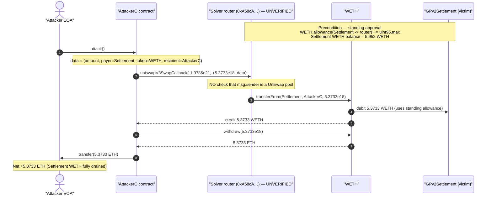
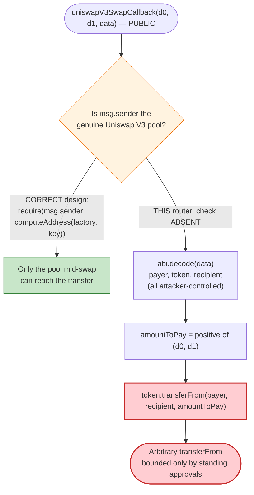
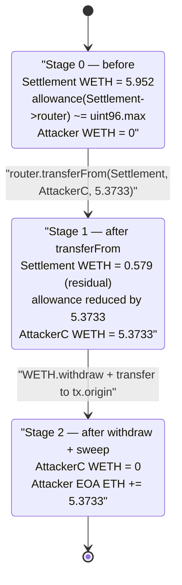

# CoW Protocol Solver-Router Exploit — Unvalidated `uniswapV3SwapCallback` Drains Settlement's Residual WETH

> **Vulnerability classes:** vuln/access-control/missing-auth · vuln/logic/missing-check

> One-line summary: A CoW Protocol solver's swap-helper router implemented `uniswapV3SwapCallback` so that it blindly pulled `tokenIn.transferFrom(payer, recipient, amount)` for whatever `payer`/`token`/`amount` the *caller* supplied — without ever verifying the caller was a real Uniswap V3 pool. Because the GPv2Settlement contract had granted this router an effectively-unlimited WETH allowance, anyone could call the callback directly and steal the settlement contract's residual WETH.

> **Reproduction:** the PoC compiles & runs in this isolated Foundry project at
> [this project folder](.). Full verbose trace: [output.txt](output.txt).
> The vulnerable router (`0xA58cA…`) is **unverified** on Etherscan, so its logic is reconstructed from
> its on-chain bytecode/disassembly (saved at [sources/A58cA_callback_bytecode.txt](sources/A58cA_callback_bytecode.txt))
> and the live execution trace. The counterparty `GPv2Settlement` source is in
> [sources/GPv2Settlement_9008D1](sources/GPv2Settlement_9008D1/src_contracts_GPv2Settlement.sol).

---

## Key info

| | |
|---|---|
| **Loss (this tx)** | **5.373296932158610028 WETH** drained from the GPv2Settlement contract (PoC-verified). The DeFiHackLabs header cites **~$59K total** across the attacker's full campaign of similar callback calls. |
| **Vulnerable contract** | CoW solver swap-helper / router — [`0xA58cA3013Ed560594557f02420ed77e154De0109`](https://etherscan.io/address/0xA58cA3013Ed560594557f02420ed77e154De0109) (**unverified**) |
| **Victim / fund source** | CoW Protocol `GPv2Settlement` — [`0x9008D19f58AAbD9eD0D60971565AA8510560ab41`](https://etherscan.io/address/0x9008d19f58aabd9ed0d60971565aa8510560ab41#code) (held a leftover unlimited WETH allowance to the router) |
| **Stolen token** | WETH — [`0xC02aaA39b223FE8D0A0e5C4F27eAD9083C756Cc2`](https://etherscan.io/address/0xc02aaa39b223fe8d0a0e5c4f27ead9083c756cc2) |
| **Attacker EOA** | [`0x00baD13FA32E0000E35B8517E19986B93F000034`](https://etherscan.io/address/0x00bad13fa32e0000e35b8517e19986b93f000034) |
| **Attacker contract** | [`0x67004E26F800c5EB050000200075f049AA0090c3`](https://etherscan.io/address/0x67004e26f800c5eb050000200075f049aa0090c3) |
| **Attack tx** | [`0x2fc9f2fd393db2273abb9b0451f9a4830aa2ebd5490d453f1a06a8e9e5edc4f9`](https://etherscan.io/tx/0x2fc9f2fd393db2273abb9b0451f9a4830aa2ebd5490d453f1a06a8e9e5edc4f9) |
| **Chain / block / date** | Ethereum mainnet / fork at 21,135,437 (tx in 21,135,438) / November 2024 |
| **Compiler** | PoC `^0.8.10`; `GPv2Settlement` `v0.7.6`; router `0xA58cA…` compiled with solc `0.8.x` (per `dsolcC` bytecode tag) |
| **Bug class** | Missing caller authentication in a swap callback (unverified-pool / arbitrary-`transferFrom` via standing token approval) |

> **Reference:** Ten Armor post-mortem — https://x.com/TenArmorAlert/status/1854538807854649791

---

## TL;DR

A *solver* in CoW Protocol is an externally-operated agent that fills user orders by routing them through
AMMs (Uniswap, Pancake, etc.). To do that, the GPv2Settlement contract — which transiently custodies the
tokens being settled — issues ERC20 approvals to the solver's helper/router contracts so they can move
funds on its behalf during a batch.

The solver's router at `0xA58cA…` exposes the standard Uniswap-style swap-callback functions:

```
fa461e33  uniswapV3SwapCallback(int256,int256,bytes)
23a69e75  pancakeV3SwapCallback(int256,int256,bytes)
923b8a2a  swapCallback(uint256,uint256,bytes)
022c0d9f  swap(uint256,uint256,address,bytes)
```

A correct Uniswap V3 callback **must** verify that `msg.sender` is the exact pool address it just asked to
swap (the canonical pattern re-derives the pool from `factory`+`PoolKey` and `require`s equality). This
router did **not**. Its `uniswapV3SwapCallback`:

1. ABI-decodes the trailing `data` into `(amount, payer, token, recipient)`-style fields, and
2. immediately calls `token.transferFrom(payer, recipient, amount)` —

trusting the caller-supplied `payer`, `token`, `recipient`, and amount with no check on who is calling.

Because `GPv2Settlement` had previously approved this router for an essentially infinite WETH allowance
(`7.922e28` ≈ `type(uint96).max`), the attacker simply called the callback **directly**, naming the
settlement contract as `payer`, WETH as the token, and themselves as the recipient. The router obediently
executed `WETH.transferFrom(GPv2Settlement, attacker, 5.3733 WETH)`, draining the settlement contract's
entire residual WETH balance (`5.952 WETH`) less rounding. The attacker then unwrapped to ETH and swept it.

No flash loan, no AMM manipulation, no privileged role — just an unauthenticated callback sitting behind a
standing approval.

---

## Background — CoW Protocol settlement & solvers

CoW Protocol (Coincidence of Wants) is a batch-auction DEX. Users sign off-chain orders; competing
**solvers** propose batch settlements and the winning solver calls
[`GPv2Settlement.settle(...)`](sources/GPv2Settlement_9008D1/src_contracts_GPv2Settlement.sol#L121-L126),
which is gated by `onlySolver`:

```solidity
// sources/GPv2Settlement_9008D1/src_contracts_GPv2Settlement.sol:87-90
modifier onlySolver {
    require(authenticator.isSolver(msg.sender), "GPv2: not a solver");
    _;
}
```

During a settlement the contract runs arbitrary solver-supplied `interactions` (pre/intra/post), and it
holds the traded tokens transiently. To bridge user funds into external AMMs, the settlement contract (or the
solver's own infrastructure) grants ERC20 approvals to the solver's router contracts. **These approvals are
the dangerous standing primitive**: as long as the settlement contract has any balance of an approved token,
anyone who can make the approved router move that token can drain it.

The router `0xA58cA…` is the solver's helper. Its bytecode contains the strings `"executeSwap: msg.value
should be…"`, `"Unsupported AMM type"`, and `"Slippage tolerance exceeded"` — it is a generic multi-AMM swap
executor. The bug is not in CoW's `GPv2Settlement` core (that contract is well-audited); it is in the
**solver's router callback**, which the standing settlement approval turned into a free drain.

The on-chain facts at the fork block (read via `cast`):

| Fact | Value |
|---|---|
| WETH allowance: `GPv2Settlement → 0xA58cA…` | **79,228,162,508,891,040,661,385,340,307** (`≈ type(uint96).max`, effectively unlimited) |
| WETH balance of `GPv2Settlement` | **5.952132053145257822 WETH** (residual from prior settlements) |
| Router `0xA58cA…` code size | 2,128 bytes (a real deployed contract) |
| Attacker EOA ETH (pre-attack) | 2.281407927242330328 (gas only) |

---

## The vulnerable code

The router is unverified, so the snippets below are reconstructed from its bytecode and confirmed by the
live trace. The relevant disassembly fragment (the `transferFrom` selector and its call setup) lives at
[sources/A58cA_callback_bytecode.txt](sources/A58cA_callback_bytecode.txt):

```
000004c7: PUSH4 0x23b872dd      ; transferFrom(address,address,uint256) selector
000004cc: PUSH1 0xe0
000004ce: SHL
...
000004f3: PUSH4 0x23b872dd
000004f8: SWAP1
000004f9: PUSH1 0x64            ; calldata length 0x64 = 4 + 3*32 → transferFrom(from,to,amount)
...                              ; → CALL into the token contract
```

Reconstructed logic of the vulnerable callback (semantically equivalent to the bytecode + trace):

```solidity
// 0xA58cA3013Ed560594557f02420ed77e154De0109 (UNVERIFIED — reconstructed)
function uniswapV3SwapCallback(
    int256 amount0Delta,
    int256 amount1Delta,
    bytes calldata data
) external {
    // ❌ NO check that msg.sender is the Uniswap V3 pool that should be calling back.
    // The canonical Uniswap pattern requires:
    //   require(msg.sender == PoolAddress.computeAddress(factory, key), "not pool");

    // decode (amount, payer, token, recipient) from data
    (uint256 amount, address payer, address token, address recipient) = abi.decode(
        data, (uint256, address, address, address)
    );

    // pay the "owed" delta out of `payer`'s balance using THIS router's standing allowance
    uint256 amountToPay = amount0Delta > 0 ? uint256(amount0Delta) : uint256(amount1Delta);
    IERC20(token).transferFrom(payer, recipient, amountToPay);   // ⚠️ arbitrary transferFrom
}
```

The two independent failures that combine into the vulnerability:

1. **No caller authentication.** A Uniswap-style swap callback is only ever supposed to be invoked by the
   pool mid-swap, and the implementer must prove that by re-deriving the pool address and `require`-ing
   `msg.sender == pool`. This callback skips that check entirely, so *any* address can call it.
2. **Caller-controlled `transferFrom` against a standing allowance.** The `payer` and `token` come straight
   from the attacker's `data`, and the amount comes from the attacker's `amountXDelta`. The router pays out of
   whatever address the caller names, using whatever approval that address has granted the router.

`GPv2Settlement` supplied the third ingredient: an unlimited WETH approval to this router plus a non-zero
WETH balance.

---

## Root cause — why it was possible

A swap callback is a **trusted re-entry point**: the AMM pool calls it during `swap()` so the swapper can pay
in the input token. The entire security model depends on **the callee verifying that the caller is the
genuine pool**. Uniswap V3 / Pancake V3 codify this with `PoolAddress.computeAddress(factory, poolKey)` and a
mandatory `require(msg.sender == pool)`. Omit that check, and the callback degenerates into:

> "Anyone may instruct me to `transferFrom(<any payer>, <any recipient>, <any amount>)` of `<any token>`."

That is exactly an *arbitrary `transferFrom` primitive* — limited only by which approvals the router holds.
The router holds standing approvals from the CoW settlement contract (a design necessity for solvers), so the
primitive becomes "drain the settlement contract of any token it has approved this router for, up to its
balance."

The attacker did not even need to bother making the encoded `amount` (`1976408883179648193852`) match the
transferred amount — the trace shows the router paid out the *positive `amountXDelta`* (`amount1Delta =
5373296932158610028`), and used the decoded `data` only for `payer`, `token`, and `recipient`. This is fully
consistent with a callback that computes `amountToPay = positive delta` and reads the routing addresses from
`data`.

This is the same vulnerability class as the **Pancake/Uniswap "unverified swap callback"** bugs and prior
solver-infrastructure incidents: the fund-holding party (settlement) approves a helper, the helper's callback
is unauthenticated, and the approval is converted into a free withdrawal.

---

## Preconditions

- The router `0xA58cA…` holds a **standing ERC20 approval** from a contract that has a balance of that token.
  Here: `WETH allowance(GPv2Settlement → router) ≈ uint96.max`, and `GPv2Settlement` held `5.952 WETH`.
- The router's `uniswapV3SwapCallback` (and siblings) is **externally callable with no `msg.sender`
  validation**. (Confirmed: the function selector is in the public dispatch table and the trace shows a direct
  EOA-initiated call succeeding.)
- The attacker can craft the `data` blob to name `payer = GPv2Settlement`, `token = WETH`,
  `recipient = attacker`, and pass a positive `amountXDelta` ≤ the victim's balance.
- No flash loan, no AMM state, no timing, and no privileged role are required.

---

## Step-by-step attack walkthrough (numbers from the live trace)

All numbers below are pulled directly from [output.txt](output.txt).

| # | Step | Concrete value | Effect |
|---|------|---------------|--------|
| 0 | **Initial** — attacker EOA balance | 2.281407927242330328 ETH | Gas money only; no WETH. |
| 1 | Deploy `AttackerC` ([test/CoW_exp.sol:50-73](test/CoW_exp.sol#L50-L73)) | contract `0xe937…D213` | Holds the attack logic. |
| 2 | Build `data = abi.encode(1976408883179648193852, GPv2Settlement, WETH, attacker)` | — | Names the victim as `payer`, WETH as token, attacker as recipient. |
| 3 | **Call** `router.uniswapV3SwapCallback(-1978613680814188858940, 5373296932158610028, data)` ([test/CoW_exp.sol:61-65](test/CoW_exp.sol#L61-L65)) | `amount0Delta = -1.9786e21`, `amount1Delta = +5.3733e18` | Router treats the *positive* delta as the amount to pay. |
| 4 | Router executes `WETH.transferFrom(GPv2Settlement, AttackerC, 5373296932158610028)` (trace L23) | **5.373296932158610028 WETH** | Drains the settlement's WETH using the unlimited approval. |
| 5 | `WETH.balanceOf(AttackerC)` → `withdraw(bal)` ([test/CoW_exp.sol:67-68](test/CoW_exp.sol#L67-L68)) | 5.373296932158610028 WETH → ETH | Unwrap to native ETH. |
| 6 | `payable(tx.origin).transfer(balance)` ([test/CoW_exp.sol:69](test/CoW_exp.sol#L69)) | 5.373296932158610028 ETH | Sweep ETH to the attacker EOA (no coinbase tip in the PoC). |
| 7 | **Final** — attacker EOA balance | 7.654704859400940356 ETH | Net **+5.373296932158610028 ETH**. |

The single observable state mutation in the trace is the WETH ledger update inside `transferFrom`
(trace L23-L30): the settlement's WETH balance and the router's allowance both decrease by `5.3733e18`, and
the attacker contract's WETH balance is created at that amount — then immediately unwrapped.

### Profit accounting

| Direction | Amount (ETH) |
|---|---:|
| Attacker EOA before | 2.281407927242330328 |
| WETH drained from `GPv2Settlement` → unwrapped → swept | +5.373296932158610028 |
| Attacker EOA after | 7.654704859400940356 |
| **Net profit (this tx)** | **+5.373296932158610028 ETH** |

The PoC paid no coinbase tip (the contract comment notes "*all to the attacker*"), so the full drained
amount is realized profit. The DeFiHackLabs header's **~$59K** figure reflects the attacker's broader
campaign of repeated callback calls against this and similar approvals; this single reproduced transaction
accounts for ~5.37 WETH of it.

---

## Diagrams

### Sequence of the attack



### Where the trust check is missing



### Victim state evolution (WETH)



---

## Remediation

1. **Authenticate the swap callback.** Every `*SwapCallback` MUST verify the caller is the exact pool it
   asked to swap. For Uniswap/Pancake V3 this means re-deriving the pool from the factory + `PoolKey` carried
   in `data` and `require(msg.sender == pool)`. A callback that does an unconditional `transferFrom` for
   caller-supplied parameters is an open arbitrary-transfer primitive.
2. **Never pay out of a caller-named `payer`.** The router should pay from a context it set up itself (the
   `payer` recorded when *it* initiated the swap), not from a `payer` field decoded out of the inbound
   callback `data`.
3. **Eliminate standing/unlimited approvals from the settlement to solver helpers.** Approve the exact amount
   needed for the current settlement and reset to zero afterward (`approve(router, 0)` post-batch), or use a
   pull pattern (`permit2` with scoped, expiring allowances). A residual unlimited approval to a buggy helper
   is what turned a router bug into a settlement-contract drain.
4. **Hold zero idle balance in the settlement contract.** The contract should net to zero token balances at
   the end of each batch; residual WETH (here 5.952) is what was left to steal.
5. **Audit solver infrastructure, not just the core.** The CoW core (`GPv2Settlement`) was sound; the loss
   came entirely from an under-audited, unverified solver helper. Solver routers that hold protocol approvals
   should be held to the same review bar as the core.

---

## How to reproduce

```bash
_shared/run_poc.sh 2024-11-CoW_exp -vvvvv
```

- RPC: an **Ethereum mainnet archive** endpoint is required (the fork is at block 21,135,437). `foundry.toml`
  uses an Infura archive endpoint; if it returns `401 invalid project id` / rate-limits, swap the `/v3/<key>`
  for another key as noted in the project comments.
- Result: `[PASS] testPoC()`, attacker ETH balance `2.2814… → 7.6547…` (net **+5.3733 ETH**).

Expected tail:

```
Ran 1 test for test/CoW_exp.sol:ContractTest
[PASS] testPoC() (gas: 345407)
Logs:
  before attack: balance of attacker: 2.281407927242330328
  after attack: balance of attacker: 7.654704859400940356

Suite result: ok. 1 passed; 0 failed; 0 skipped
```

---

*Reference: DeFiHackLabs entry "CoW" (Ethereum, ~$59K). Post-mortem: Ten Armor —
https://x.com/TenArmorAlert/status/1854538807854649791*
