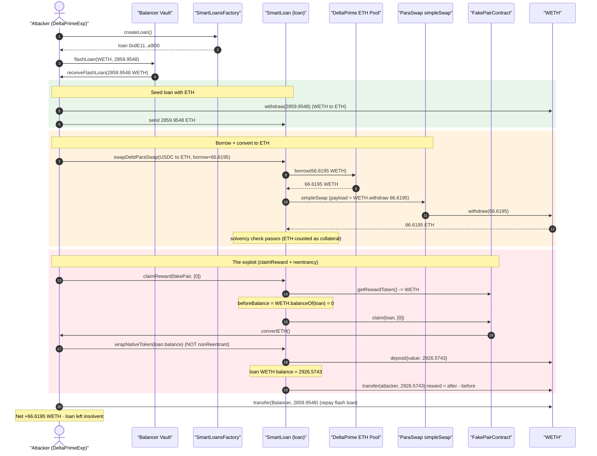
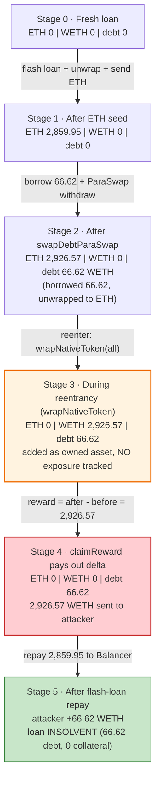
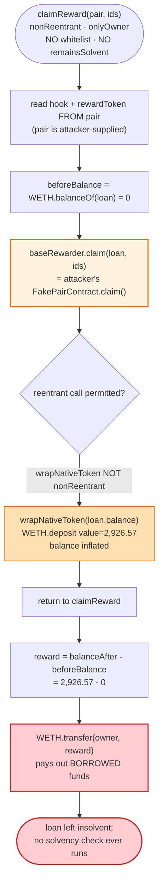

# DeltaPrime Exploit — Unwhitelisted `claimReward()` Pair + Cross-Function Reentrancy Drains a SmartLoan's Borrowed Funds as "Reward"

> **Reproduction:** the PoC compiles & runs in an isolated Foundry project at
> [this project folder](.) (the umbrella DeFiHackLabs repo contains many unrelated
> PoCs that do not whole-compile, so this one was extracted).
> Full verbose trace: [output.txt](output.txt).
> Verified vulnerable source: [TraderJoeV2Facet.sol](sources/TraderJoeV2ArbitrumFacet_D6002c/contracts_facets_TraderJoeV2Facet.sol).

---

## Key info

| | |
|---|---|
| **Loss** | **66.6195 WETH per loop** drained from a DeltaPrime lending pool in the reproduced tx (≈ $211K at the time). The full campaign across multiple pools/loops totaled **~$4.75M**. |
| **Vulnerable contract** | `TraderJoeV2ArbitrumFacet` (the `claimReward(ILBPair,uint256[])` facet of a DeltaPrime SmartLoan) — [`0xD6002c3f5A53107cb11cC0b8DE5F76f61f18Cb5d`](https://arbiscan.io/address/0xD6002c3f5A53107cb11cC0b8DE5F76f61f18Cb5d#code) |
| **SmartLoan beacon / factory** | beacon `0x62Cf82FB0484aF382714cD09296260edc1DC0c6c` · factory(TUP) `0xFf5e3dDaefF411a1dC6CcE00014e4Bca39265c20` |
| **Victim pool (this loop)** | WETH lending pool `0x2E2fE9Bc7904649b65B6373bAF40F9e2E0b883c5` (impl `0x0b4c71fc70B6b65c04fD62b10191Ee7999761a5A`) |
| **Attacker EOA** | [`0xb87881637b5c8e6885c51ab7d895e53fa7d7c567`](https://arbiscan.io/address/0xb87881637b5c8e6885c51ab7d895e53fa7d7c567) |
| **Attacker contract** | [`0x0b2bcf06f740c322bc7276b6b90de08812ce9bfe`](https://arbiscan.io/address/0x0b2bcf06f740c322bc7276b6b90de08812ce9bfe) |
| **Attack tx** | [`0x6a2f989b5493b52ffc078d0a59a3bf9727d134b403aa6e0bf309fd513a728f7f`](https://arbiscan.io/tx/0x6a2f989b5493b52ffc078d0a59a3bf9727d134b403aa6e0bf309fd513a728f7f) |
| **Chain / block / date** | Arbitrum / 273,278,741 / 2024-11-11 (UTC) |
| **Compiler** | Solidity v0.8.17, optimizer 1, runs 10 |
| **Bug class** | Missing input validation (un-whitelisted pair) + cross-function reentrancy + missing solvency post-check → borrowed funds paid out as "reward" |

---

## TL;DR

A DeltaPrime SmartLoan is an isolated borrowing account (a beacon proxy) with a TraderJoe-V2
integration facet. Its `claimReward(ILBPair pair, uint256[] ids)` function is meant to claim TJ-V2
liquidity-mining rewards and forward them to the loan owner. It:

1. **Trusts an attacker-supplied `pair` with no whitelist check** — it reads the "reward hook" and
   "reward token" from `pair` itself
   ([TraderJoeV2Facet.sol:91-110](sources/TraderJoeV2ArbitrumFacet_D6002c/contracts_facets_TraderJoeV2Facet.sol#L91-L110)).
   Every other liquidity function in the same facet calls `isPairWhitelisted(pair)`; this one does not.
2. **Computes the reward as a raw balance delta** `balanceAfter − balanceBefore` around an external
   `baseRewarder.claim()` call — and that external call is **attacker code**.
3. **Has no `remainsSolvent` modifier**, so it never checks the loan is still backed after paying out.

The attacker exploits this by making `pair` point at a `FakePairContract` whose `claim()` reenters
the very same SmartLoan. Because `claimReward` is `nonReentrant` but **`wrapNativeToken()` is not**
([SmartLoanWrappedNativeTokenFacet.sol:16-26](sources/SmartLoanWrappedNativeTokenFacet_121b59/contracts_facets_SmartLoanWrappedNativeTokenFacet.sol#L16-L26)),
the reentrant call succeeds. During the reentrancy the attacker has already stuffed the loan with
**ETH it borrowed from DeltaPrime + ETH from a Balancer flash loan**, and `wrapNativeToken()` turns
all of it into WETH inside the loan. When control returns, `claimReward` sees a huge WETH balance
increase and **transfers the entire amount to the attacker as "reward"**.

Per loop the attacker walks away with the WETH it borrowed from DeltaPrime's pool (the flash loan is
repaid, leaving the borrowed amount as pure profit). In the reproduced transaction that is
**66.6195 WETH**; the live campaign repeated the pattern across DeltaPrime pools for ~$4.75M total.

---

## Background — what DeltaPrime is

DeltaPrime is an under-collateralized / margin lending protocol. Users open a **SmartLoan** — an
isolated account contract (beacon proxy, created by `SmartLoansFactory.createLoan()`,
[SmartLoansFactory.sol](sources/SmartLoansFactory_8b5c03/contracts_SmartLoansFactory.sol)). The
loan holds the user's collateral, can `borrow()` from shared lending **pools** (WETH, USDC, …), and
exposes DeFi integration **facets** (TraderJoe, Uniswap, ParaSwap debt-swap, native-token wrapping…)
that operate on the loan's own funds. A `remainsSolvent` modifier on the dangerous facet functions
ensures that, after each operation, the loan's collateral still covers its debt
(`SolvencyFacetProdArbitrum`, [source](sources/SolvencyFacetProdArbitrum_Ca605C/)).

Two facets matter here:

- **`TraderJoeV2ArbitrumFacet`** — claims TJ-V2 liquidity-mining rewards and forwards them to the
  loan owner.
- **`SmartLoanWrappedNativeTokenFacet`** — `wrapNativeToken()` wraps the loan's native ETH into WETH.

The exploit composes a flaw in the first with a property of the second.

---

## The vulnerable code

### 1. `claimReward(ILBPair, uint256[])` — no whitelist, attacker-defined reward token, no solvency check

[TraderJoeV2Facet.sol:91-110](sources/TraderJoeV2ArbitrumFacet_D6002c/contracts_facets_TraderJoeV2Facet.sol#L91-L110):

```solidity
function claimReward(ILBPair pair, uint256[] calldata ids)
    external nonReentrant noOwnershipTransferInLast24hrs onlyOwner   // ⚠️ NO remainsSolvent, NO whitelist
{
    ILBHookLens lbHookLens = ILBHookLens(getJoeV2LBHookLens());
    ILBHookLens.Parameters memory hookLens = lbHookLens.getHooks(address(pair)); // pair is attacker-supplied
    address baseRewarder = hookLens.hooks;                                       // → attacker's FakePair

    if (baseRewarder == address(0)) revert TraderJoeV2NoRewardHook();

    address rewardToken = address(ILBHooksBaseRewarder(baseRewarder).getRewardToken()); // attacker chooses WETH
    bool isNative = (rewardToken == address(0));
    uint256 beforeBalance = isNative ? address(this).balance
                                     : IERC20(rewardToken).balanceOf(address(this));

    ILBHooksBaseRewarder(baseRewarder).claim(address(this), ids);  // ⚠️ EXTERNAL CALL into attacker code (reentrancy)

    uint256 reward = isNative ? address(this).balance - beforeBalance
                              : IERC20(rewardToken).balanceOf(address(this)) - beforeBalance;
    if (reward > 0) {
        if (isNative) { payable(msg.sender).safeTransferETH(reward); }
        else          { rewardToken.safeTransfer(msg.sender, reward); } // ⚠️ pays out the whole balance delta
    }
}
```

Contrast with the sibling functions in the same file, which **do** validate the pair:

```solidity
function fundLiquidityTraderJoeV2(...)      { if (!isPairWhitelisted(address(pair))) revert ...; ... }   // L113
function withdrawLiquidityTraderJoeV2(...)  ... canRepayDebtFully noBorrowInTheSameBlock remainsSolvent  // L141-142
function addLiquidityTraderJoeV2(...)        ... noBorrowInTheSameBlock remainsSolvent                    // L165, L171
```

So `claimReward` is the **only** outward-facing TJ-V2 function that (a) accepts an un-whitelisted
`pair`, (b) derives the reward token from that untrusted `pair`, (c) does an external call into a
contract the `pair` names, **and** (d) lacks `remainsSolvent`.

### 2. `wrapNativeToken()` — reentrant-reachable, mints WETH from loan ETH, no exposure tracking

[SmartLoanWrappedNativeTokenFacet.sol:16-26](sources/SmartLoanWrappedNativeTokenFacet_121b59/contracts_facets_SmartLoanWrappedNativeTokenFacet.sol#L16-L26):

```solidity
function wrapNativeToken(uint256 amount) onlyOwnerOrInsolvent public {  // ⚠️ NOT nonReentrant
    require(amount <= address(this).balance, "Not enough native token to wrap");
    IWrappedNativeToken wrapped = IWrappedNativeToken(DeploymentConstants.getNativeToken());
    wrapped.deposit{value: amount}();                                   // ETH → WETH inside the loan
    if (wrapped.balanceOf(address(this)) != 0) {
        DiamondStorageLib.addOwnedAsset(getNativeTokenSymbol(), address(wrapped)); // registers WETH as owned
    }
    emit WrapNative(msg.sender, amount, block.timestamp);
    // NOTE: unlike depositNativeToken() it never calls tokenManager.increaseProtocolExposure(...)
}
```

Because `wrapNativeToken` omits `nonReentrant`, it can be called **while `claimReward` is mid-execution**
(the keccak-slot `nonReentrant` guard,
[ReentrancyGuardKeccak.sol](sources/TraderJoeV2ArbitrumFacet_D6002c/contracts_ReentrancyGuardKeccak.sol),
only blocks functions that *share* the modifier). It converts the loan's native ETH into WETH,
inflating the WETH balance that `claimReward` is measuring.

### 3. `swapDebtParaSwap()` — the borrow + ParaSwap-driven WETH→ETH conversion

[AssetsOperationsFacet.sol:269-297](sources/AssetsOperationsArbitrumFacet_CA60C5/contracts_facets_AssetsOperationsFacet.sol#L269-L297):

```solidity
function swapDebtParaSwap(bytes32 _fromAsset, bytes32 _toAsset, uint256 _repayAmount,
                          uint256 _borrowAmount, bytes4 selector, bytes memory data)
    external onlyOwnerOrInsolvent remainsSolvent nonReentrant
{
    ...
    Pool toAssetPool = Pool(tokenManager.getPoolAddress(_toAsset));
    toAssetPool.borrow(_borrowAmount);                       // borrow 66.62 WETH from the ETH pool
    ...
    address(toToken).safeApprove(PARA_TRANSFER_PROXY, _borrowAmount);
    (bool success, ) = PARA_ROUTER.call(abi.encodePacked(selector, data)); // ParaSwap simpleSwap
    require(success, "Swap failed");
    ...
    _processRepay(tokenManager, fromAssetPool, address(fromToken), _repayAmount, ...); // _repayAmount = 0
}
```

The attacker passes a ParaSwap `simpleSwap` payload whose only "exchange" step is
`WETH.withdraw(66.62)` — i.e. it just **unwraps the borrowed WETH into native ETH**, which the
ParaSwap router then forwards to the SmartLoan. Net effect: the loan now holds **66.62 native ETH**,
its WETH balance is back to 0, and it carries a 66.62-WETH debt. The trailing RedStone price calldata
appended to the call lets `remainsSolvent` value the position; with native ETH counted as collateral
the loan stays solvent and the call returns.

---

## Root cause — why it was possible

The drain is a **composition of three independent defects** in the SmartLoan facets:

1. **Un-trusted `pair` / reward token (missing input validation).** `claimReward(ILBPair,uint256[])`
   reads the reward hook and reward token from a `pair` address the caller supplies, with **no
   `isPairWhitelisted` check** (every sibling TJ-V2 function has one). The attacker therefore controls
   both *which contract gets the external call* and *which token is treated as the reward*.

2. **External call to attacker code without reentrancy isolation across facets.** `claimReward`'s
   `baseRewarder.claim()` lands in the attacker's `FakePairContract.claim()`. `claimReward` is
   `nonReentrant`, but the reentered `wrapNativeToken()` is **not**, so the cross-function reentrancy
   is not blocked. Mid-claim, the attacker inflates the loan's WETH balance.

3. **Reward = raw balance delta + no solvency post-check.** The "reward" is computed as
   `WETH.balanceOf(this)` *after* minus *before* the external call, and the result is sent to the
   owner with **no `remainsSolvent` modifier**. So WETH that originated from the loan's *own borrowed
   funds* (not from any rewarder) is paid out, and the loan is left insolvent.

Stacking these, the attacker turns "claim my LP rewards" into "mint WETH from money I borrowed against
the protocol, then have the protocol hand it to me as a reward, and never check that I'm still
solvent." A Balancer flash loan provides the extra ETH used to satisfy the in-flight solvency math and
maximize the borrow; it is fully repaid, so the borrowed pool funds are pure profit.

> Supporting detail: `wrapNativeToken` also fails to call `tokenManager.increaseProtocolExposure(...)`
> (compare `depositNativeToken` at
> [SmartLoanWrappedNativeTokenFacet.sol:28-40](sources/SmartLoanWrappedNativeTokenFacet_121b59/contracts_facets_SmartLoanWrappedNativeTokenFacet.sol#L28-L40)),
> so the wrapped WETH appears as an unaccounted balance jump — exactly the delta `claimReward` then
> pays out.

---

## Preconditions

- Anyone can open a SmartLoan via `SmartLoansFactory.createLoan()` — the attacker owns the loan it
  exploits, so `onlyOwner` / `onlyOwnerOrInsolvent` are trivially satisfied.
- The TJ-V2 facet's `claimReward(ILBPair,uint256[])` must be callable with an arbitrary `pair`
  (true — no whitelist).
- `wrapNativeToken()` must be reentrant-reachable from inside `claimReward` (true — it isn't
  `nonReentrant`).
- Working capital in WETH to (a) seed the loan and (b) maximize the borrow within the solvency check.
  This is supplied by a **Balancer flash loan** (`feeAmount = 0`) and fully repaid intra-tx, so the
  attack is self-funding.
- A DeltaPrime ETH lending pool with borrowable liquidity (the WETH pool held ~99.59 ETH free; the
  attacker borrowed 66.62).

---

## Attack walkthrough (with on-chain numbers from the trace)

All figures are taken directly from [output.txt](output.txt). The exploit runs entirely inside the
Balancer flash-loan callback `receiveFlashLoan()`.

| # | Step | Concrete value (from trace) | Effect |
|---|------|-----------------------------|--------|
| 0 | `createLoan()` → fresh SmartLoan; deploy `FakePairContract` | loan `0xdE116…a9D0`, fake pair `0x5615…b72f` | Attacker owns an empty isolated loan. |
| 1 | **Balancer flash loan** of the vault's entire WETH | **2,859.9548 WETH** (fee 0) | Working capital obtained. |
| 2 | `WETH.withdraw(all)` then send ETH to loan | 2,859.9548 ETH → loan balance | Loan now holds 2,859.95 native ETH. |
| 3 | `swapDebtParaSwap(USDC→ETH, repay=0, borrow=66.62…)` → pool `borrow(66.62)` | **borrow 66.6195 WETH** from ETH pool | Loan owes 66.62 WETH; pool free liq was 99.59 ETH. |
| 3a| ParaSwap `simpleSwap` payload = `WETH.withdraw(66.62)` | 66.6195 WETH → 66.6195 ETH → loan | Borrowed WETH becomes native ETH in the loan; `remainsSolvent` passes. |
| 4 | **`claimReward(fakePair, [0])`**: reads `getRewardToken()` = WETH, snapshots `beforeBalance` (WETH = 0) | beforeBalance = 0 | Reward baseline set *before* the reentrancy. |
| 5 | `fakePair.claim(loan,[0])` reenters → `convertETH()` → **`wrapNativeToken(loan.balance)`** | **`WETH.deposit{value: 2,926.5743}`** | All ETH (2,859.95 flash + 66.62 borrowed) wrapped → loan WETH balance = **2,926.5743**. |
| 6 | `claimReward` resumes: `reward = 2,926.5743 − 0` → `WETH.transfer(attacker, reward)` | **transfer 2,926.5743 WETH to attacker** | Loan's entire WETH (incl. borrowed funds) paid out as "reward". No solvency check. |
| 7 | Repay flash loan: `WETH.transfer(Balancer, 2,859.9548)` | −2,859.9548 WETH | Flash loan + 0 fee repaid. |
| 8 | **End of tx** | attacker WETH = **66.6195** | Net profit = borrowed amount; loan left insolvent (66.62 WETH debt, no collateral). |

Balance reconciliation (WETH):

```
attacker received from claimReward "reward" :  2,926.574316817644077039
attacker repaid to Balancer flash loan      : -2,859.954771512993088821
-----------------------------------------------------------------------
net profit                                   :     66.619545304650988218
```

which is exactly the amount borrowed from DeltaPrime's ETH pool via `swapDebtParaSwap` — confirming
the attacker simply walked off with the protocol's borrowed liquidity.

### Profit / loss accounting (this loop)

| Party | Delta |
|---|---:|
| Attacker | **+66.6195 WETH** |
| DeltaPrime ETH lending pool | −66.6195 WETH (bad debt — borrowed, never repaid, loan insolvent) |
| Balancer vault | 0 (flash loan repaid in full, fee 0) |

The live campaign repeated this loop against multiple DeltaPrime pools for a reported **~$4.75M** total.

---

## Diagrams

### Sequence of the attack



### SmartLoan state evolution (native ETH / WETH balance & debt)



### The flaw inside `claimReward()`



---

## Why each magic number

- **Flash loan = 2,859.9548 WETH** — the *entire* WETH balance of the Balancer vault, used as free
  working capital so the loan looks well-collateralized to `remainsSolvent` during the borrow. Repaid
  in full (fee 0), so it nets to zero.
- **`_borrowAmount = 66.619545304650988218 WETH`** — sized just under the WETH pool's free liquidity
  (~99.59 ETH) and within what the seeded ETH collateral keeps solvent. This is the actual stolen
  amount.
- **`_repayAmount = 0`** — the debt-swap repays nothing; `swapDebtParaSwap` is used purely as a
  borrow-and-unwrap primitive, not to repay USDC.
- **ParaSwap payload = `WETH.withdraw(66.62)`** — converts the borrowed WETH to native ETH so the loan
  ends the swap holding ETH (untracked as WETH exposure), ready for `wrapNativeToken` to re-mint as a
  "reward".
- **`wrapNativeToken(loan.balance) = 2,926.5743`** — wraps *all* loan ETH (flash + borrowed) so the
  reward delta is maximized.

---

## Remediation

1. **Whitelist the `pair` in `claimReward`.** Add `if (!isPairWhitelisted(address(pair))) revert
   TraderJoeV2PoolNotWhitelisted();` — identical to `fundLiquidityTraderJoeV2` /
   `withdrawLiquidityTraderJoeV2` / `addLiquidityTraderJoeV2`. This removes the attacker's control over
   the external-call target and reward token, which is the linchpin of the exploit.
2. **Add `remainsSolvent` to `claimReward`.** Any function that can move value out of the loan must
   re-check collateralization afterward. With this modifier the final payout would revert because the
   loan is left insolvent.
3. **Make `wrapNativeToken()` (and all value-touching facet functions) `nonReentrant`.** A single
   shared reentrancy domain across facets prevents the cross-function reentrancy. At minimum, the
   reward-balance delta must not span an external call into a caller-controlled contract.
4. **Do not derive a "reward" from a raw balance delta around an untrusted external call.** Pull the
   reward amount/return value directly from the (trusted, whitelisted) rewarder rather than measuring
   `balanceOf` before/after, so self-deposited funds can never be mistaken for rewards.
5. **Fix exposure accounting in `wrapNativeToken`.** It should call
   `tokenManager.increaseProtocolExposure(...)` like `depositNativeToken`, so the wrapped WETH is
   tracked rather than appearing as a free balance jump.

---

## How to reproduce

The PoC was extracted into a standalone Foundry project (the umbrella DeFiHackLabs repo fails to
whole-compile under `forge test`). The PoC reads a RedStone price-data blob from
`./src/test/2024-11/DelatPrimePriceData.txt`; that file was replicated at the same relative path
inside this project so the `vm.readFile` call resolves.

```bash
_shared/run_poc.sh 2024-11-DeltaPrime_exp -vvvvv
```

- RPC: an **Arbitrum archive** endpoint is required (fork block 273,278,741). `foundry.toml` uses an
  Infura archive endpoint.
- Result: `[PASS] testExploit()` with the attacker's WETH balance going `0 → 66.619545…`.

Expected tail:

```
Ran 1 test for test/DeltaPrime_exp.sol:DeltaPrimeExp
[PASS] testExploit() (gas: 3917927)
  Attacker WETH balance before exploit: 0.000000000000000000
  Attacker WETH balance after exploit: 66.619545304650988218
Suite result: ok. 1 passed; 0 failed; 0 skipped
```

---

*Reference: DeFiHackLabs PoC header — DeltaPrime, Arbitrum, ~$4.75M. SlowMist Hacked database.*
