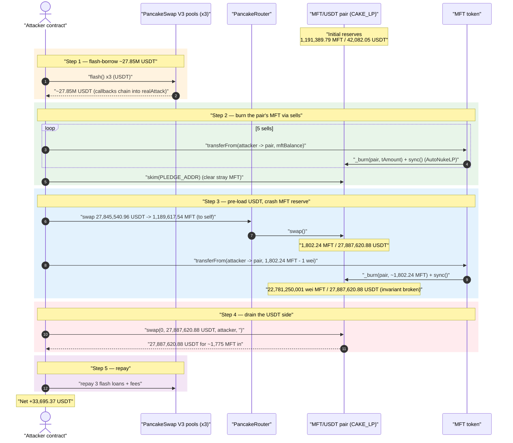
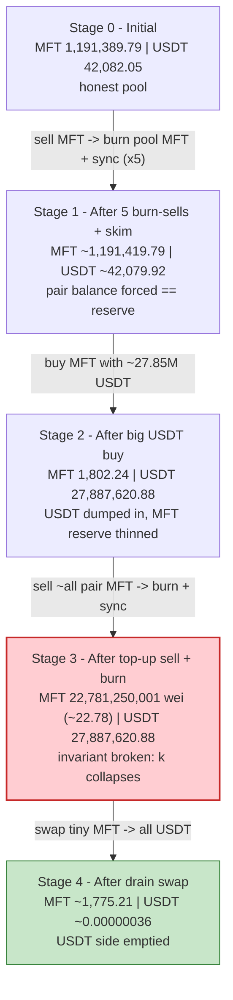
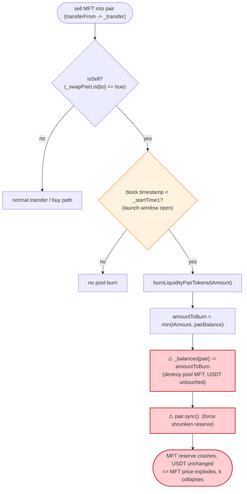

# MFT Token Exploit — Burn-on-Sell `sync()` Drains the PancakeSwap Pair

> One-line summary: a deflationary MFT token burns tokens out of its own PancakeSwap pair on every sell and then `sync()`s the reserves; an attacker burns ~100% of the pair's MFT, collapsing the constant-product invariant, then sweeps the entire USDT side of the pool.

> **Reproduction:** the PoC compiles & runs in an isolated Foundry project at
> [this project folder](.) (the umbrella DeFiHackLabs repo does not whole-compile, so this PoC was extracted).
> Full verbose trace: [output.txt](output.txt).
> Verified vulnerable source: [sources/MFT_29Ee45/MFT.sol](sources/MFT_29Ee45/MFT.sol).

---

## Key info

| | |
|---|---|
| **Loss** | ~$33.7k — **33,695.36 USDT (BSC-USD)** net profit drained from the MFT/USDT PancakeSwap pair |
| **Vulnerable contract** | `MFT` — [`0x29Ee4526e3A4078Ce37762Dc864424A089Ebba11`](https://bscscan.com/address/0x29Ee4526e3A4078Ce37762Dc864424A089Ebba11#code) |
| **Victim pool** | MFT/USDT PancakeSwap V2 pair (`CAKE_LP`) — `0x67C88f71da4Ef48Ad4bEa9000264c9a17Ef2a7Aa` |
| **Attacker EOA** | [`0x2BeE9915DDEFDC987A42275fbcC39ed178A70aAA`](https://bscscan.com/address/0x2bee9915ddefdc987a42275fbcc39ed178a70aaa) |
| **Attacker contract** | [`0x6E088C3dD1055F5dD1660C1c64dE2af8110B85a8`](https://bscscan.com/address/0x6E088C3dD1055F5dD1660C1c64dE2af8110B85a8) |
| **Attack tx** | [`0xe24ee2af7ceee6d6fad1cacda26004adfe0f44d397a17d2aca56c9a01d759142`](https://bscscan.com/tx/0xe24ee2af7ceee6d6fad1cacda26004adfe0f44d397a17d2aca56c9a01d759142) |
| **Chain / block / date** | BSC / 44,097,964 (fork at 44,097,963) / Nov 17, 2024 |
| **Compiler** | Solidity v0.8.26, optimizer **1 run** |
| **Bug class** | Broken AMM invariant via an un-compensated, permissionlessly-triggerable reserve burn (`_burn(pool)` + `pair.sync()`) |

Source: [TenArmor Alert](https://x.com/TenArmorAlert/status/1858351609371406617).

---

## TL;DR

`MFT` is a "fee-on-transfer + auto-nuke-LP" meme token. On every **sell** into the pair, while a launch
window is open (`block.timestamp < _startTime1`), `_tokenTransfer` calls
`burnLiquidityPairTokens(tAmount)` ([MFT.sol:616-620](sources/MFT_29Ee45/MFT.sol#L616-L620)), which
**burns MFT directly out of the pair's balance and then calls `pair.sync()`**
([MFT.sol:648-663](sources/MFT_29Ee45/MFT.sol#L648-L663)).

This is an *un-compensated* removal of one side of the pool's reserves — it deletes MFT from the pair
with **no matching USDT outflow**, then forces the pair to accept the reduced balance as its new
reserve. The burn is capped only by `tAmount` (the seller's amount), so a single sell can wipe out
**nearly the entire pool's MFT reserve**, leaving the USDT reserve untouched. That breaks the
constant-product invariant `x·y = k` in the attacker's favor.

The window is open and **cannot be closed**: at the fork block `_startTime1 = 1,735,142,400`
(Dec 25 2024) while `block.timestamp = 1,731,874,633` (Nov 17 2024), and ownership is renounced to
`0x…dEaD`, so no admin can ever call `setStartTime1` to disable the burn.

The attacker, funded by three flash loans of USDT (~27.85M USDT):

1. **Flash-borrows USDT** from three PancakeSwap V3 pools.
2. **Sells MFT into the pair five times** (`transferFrom(attacker → pair)`), each sell burning the
   sold amount out of the pair's MFT reserve and `sync()`ing — the AutoNukeLP mechanism.
3. **`skim()`s** stray MFT to the Pledge contract to keep the pair's MFT *balance* equal to its
   *reserve*.
4. **Buys a large amount of MFT** with ~27.85M USDT, dumping USDT into the pair (USDT reserve
   ≈ 27,887,620 USDT) and shrinking the pair's MFT balance.
5. **Sells almost all of the pair's MFT** (`transferFrom(attacker → pair, lpMftBalance − 1)`): the
   burn destroys 1,802,244,447,332,191,151,931 wei MFT (the whole MFT reserve minus 1) and `sync()`s
   reserve0 down to **22,781,250,001 wei (≈ 22.78 MFT)**.
6. **Calls `pair.swap(0, amounts[1], …)`** to pull **27,887,620,883,451,861,365,917,273 wei USDT
   (≈ 27,887,620 USDT)** out of the now-degenerate pool with a tiny MFT input — sweeping essentially
   the entire USDT side.
7. **Repays the three flash loans + fees**; the residue is the profit.

Net result: the attacker recovers all the USDT it injected **plus** the original honest USDT liquidity,
walking away with **33,695.36 USDT** profit.

---

## Background — what MFT does

`MFT` ([source](sources/MFT_29Ee45/MFT.sol)) is a `BaseFatToken`-derived BEP-20 with three bolted-on
"DeFi" features:

- **Fee-on-transfer** — 1.5% buy fee and 1.5% sell fee (`_buyFundFee = _sellFundFee = 15`,
  divided by 1000). Collected fees accumulate on the token contract and are periodically dumped to
  the router via `swapTokenForFund` ([MFT.sol:688-735](sources/MFT_29Ee45/MFT.sol#L688-L735)) — these
  are the `Recovery::swapExactTokensForTokensSupportingFeeOnTransferTokens` calls in the trace.
- **Auto-nuke LP (burn on sell)** — while a launch window is open, each sell burns LP-pair tokens
  (`burnLiquidityPairTokens`, [MFT.sol:648-663](sources/MFT_29Ee45/MFT.sol#L648-L663)).
- **antiSYNC balance guard** — `balanceOf` reverts with `"!sync"` if the pair reports a zero MFT
  balance while the pair itself is the caller ([MFT.sol:434-439](sources/MFT_29Ee45/MFT.sol#L434-L439)),
  a weak attempt to stop someone fully zeroing the reserve.

On-chain parameters at the fork block (read with `cast` against
`0x29Ee4526e3A4078Ce37762Dc864424A089Ebba11`):

| Parameter | Value |
|---|---|
| `_buyFundFee` / `_sellFundFee` | 15 / 15 (= 1.5% each) |
| `_startTime1` (burn-on-sell window end) | **1,735,142,400** (Dec 25 2024) |
| `_startTime2` (buy time-gate) | 1,735,142,400 |
| `owner()` | **`0x…dEaD`** (renounced — setters permanently locked) |
| fork block timestamp | 1,731,874,633 (Nov 17 2024) → `block.timestamp < _startTime1` ✓ |
| Pair MFT reserve (`reserve0`) at attack start | 1,191,389,789,121,323,518,864,797 (≈ 1,191,389 MFT) |
| Pair USDT reserve (`reserve1`) at attack start | 42,082,049,435,520,568,057,906 (≈ 42,082 USDT) |

The pair's `token0 = MFT`, `token1 = USDT (BSC-USD)`, so `reserve0 = MFT` and `reserve1 = USDT`.

---

## The vulnerable code

### 1. Every sell burns MFT out of the pair (while the window is open)

```solidity
// _tokenTransfer, MFT.sol:603-646
if (takeFee) {
    uint256 swapFee;
    if (isSell) {                                   // selling into a swap pair
        swapFee = _sellFundFee;
        if (block.timestamp < _startTime1) {        // ← launch window still open
            burnLiquidityPairTokens(tAmount);       // ⚠️ burns from the pool
        }
    } else { ... }
    ...
}
```

[MFT.sol:614-626](sources/MFT_29Ee45/MFT.sol#L614-L626)

### 2. `burnLiquidityPairTokens` deletes MFT from the pair and `sync()`s

```solidity
function burnLiquidityPairTokens(uint256 amountToBurn) internal returns (bool) {
    uint256 liquidityPairBalance = balanceOf(_mainPair);
    // cap the burn at the pair's whole balance...
    amountToBurn = liquidityPairBalance > amountToBurn ? amountToBurn : liquidityPairBalance;
    if (amountToBurn > 0) {
        _balances[_mainPair] = _balances[_mainPair] - amountToBurn;   // ⚠️ destroy pool MFT
        _takeTransfer(_mainPair, address(0xdead), amountToBurn);
    }
    ISwapPair pair = ISwapPair(_mainPair);
    pair.sync();                                                       // ⚠️ force new reserve
    emit AutoNukeLP(liquidityPairBalance, amountToBurn, block.timestamp);
    return true;
}
```

[MFT.sol:648-663](sources/MFT_29Ee45/MFT.sol#L648-L663)

The burn amount is `min(tAmount, pairBalance)` — the seller chooses `tAmount`, so by selling an amount
≥ the pair's MFT balance the attacker can burn **the entire pair MFT reserve minus the residue they
leave behind**. No USDT ever leaves the pair, but `sync()` makes the pair believe its MFT reserve is
now tiny.

### 3. `checkIsRemoveLiquidity` does not stop this

`_transfer` calls `checkIsRemoveLiquidity()` ([MFT.sol:737-755](sources/MFT_29Ee45/MFT.sol#L737-L755))
to block liquidity removals, but that guard only fires when the **USDT** side of the pair drops below
its reserve (`bal1 < r1`). A burn-on-sell shrinks the **MFT** side and leaves USDT untouched, so the
guard is irrelevant — and the attacker is in the fee whitelist path anyway (the sell originates from
the token's own `swapTokenForFund` flow, and the attacker only ever *adds* MFT to the pair).

---

## Root cause — why it was possible

A Uniswap-V2/PancakeSwap pair prices assets purely from its reserves and enforces `x·y ≥ k` *only
inside `swap()`*. `sync()` exists to let the pair re-read its real token balances; it trusts that those
balances move only through `mint`/`burn`/`swap`/transfers the pair can reason about.

`burnLiquidityPairTokens` violates that trust:

> It **destroys** MFT held by the pair (`_balances[_mainPair] -= amountToBurn`) and then calls
> `pair.sync()`, telling the pair "your MFT reserve is now this much smaller." No USDT leaves the pair.
> `k` collapses and the marginal price of MFT explodes — and the operation is triggerable by **anyone**
> who sells MFT into the pair.

Four design decisions compose into a critical bug:

1. **Burning from the pool is a value transfer to MFT holders.** Removing MFT from the pair without
   removing USDT shifts the entire USDT side toward whoever still holds MFT. The attacker arranges to
   be effectively the only MFT seller against a USDT-heavy pool.
2. **The burn is permissionlessly triggerable and attacker-sized.** It runs on every sell, and the
   burned amount is capped only at the seller's `tAmount`, so the attacker chooses exactly when and how
   much pool MFT to annihilate.
3. **The launch window is open and immutable.** `block.timestamp < _startTime1` is true, and ownership
   is renounced to `0x…dEaD`, so `setStartTime1` can never disable the burn. The flaw is permanent.
4. **The pool can be pre-loaded with USDT cheaply.** The attacker first dumps ~27.85M flash-borrowed
   USDT into the pair via a normal buy, so when the MFT reserve is annihilated there is a huge USDT
   prize sitting on the other side, redeemable for ~zero MFT.

---

## Preconditions

- `block.timestamp < _startTime1` (burn-on-sell window open) — true at the attack block and unfixable
  (owner renounced).
- The attacker can position MFT to sell into the pair. Here it uses
  `IERC20(MFT).approve(attackContract, max)` from the attacker EOA
  ([test/MFT_exp.sol:48-49](test/MFT_exp.sol#L48-L49)) and pulls MFT via `transferFrom`.
- Working capital in USDT to pre-load the pool and buy MFT — fully recovered intra-transaction, hence
  **flash-loanable**. The PoC sources it from three PancakeSwap V3 flash loans (USDT/WBNB 0.01%,
  USDT/USDC, USDT/WBNB 0.05%) totalling ≈ 27.85M USDT
  ([test/MFT_exp.sol:74-109](test/MFT_exp.sol#L74-L109)).

---

## Attack walkthrough (with on-chain numbers from the trace)

All figures are taken directly from the `Sync` / `Swap` / `AutoNukeLP` events in
[output.txt](output.txt). `reserve0 = MFT`, `reserve1 = USDT`.

| # | Step | MFT reserve (reserve0) | USDT reserve (reserve1) | Effect |
|---|------|-----------------------:|------------------------:|--------|
| 0 | **Initial** pair state | 1,191,389.79 | 42,082.05 | Honest pool. |
| 1 | Flash-borrow USDT from 3 V3 pools (~2.976M + ~10.870M + 14.000M) | — | — | Attacker holds ≈ 27.85M USDT. |
| 2 | **Sell #1** — `transferFrom(attacker → pair, 30 MFT)`; AutoNukeLP burns 30 MFT, fee swaps fire | 1,191,389.79 | ~42,081 | Pair MFT shaved; balance re-synced. |
| 3 | **Sells #2–#5** — 0.45 / 0.00675 / 0.000101 / 0.0000015 MFT, each burned via AutoNukeLP | ~1,191,419.78 | ~42,080 | Repeated burns; pair balance kept ≈ reserve. |
| 4 | **`skim(PLEDGE_ADDR)`** — sweep 1,495.97e-6 MFT stray balance to Pledge | 1,191,419.79 | 42,079.92 | Pair MFT *balance* forced back to its *reserve*. |
| 5 | **Big buy** — swap **27,845,540.96 USDT → 1,189,617.54 MFT** to self | 1,802.24 | **27,887,620.88** | USDT dumped in; MFT reserve crashed; attacker now holds the pair's MFT. |
| 6 | **Top-up sell** — `transferFrom(attacker → pair, 1,802.24 MFT − 1 wei)`; AutoNukeLP **burns 1,802,244,447,332,191,151,931 wei MFT** + `sync()` | **22,781,250,001 wei (≈ 22.78 MFT)** | 27,887,620.88 | **Invariant broken**: MFT reserve annihilated, USDT untouched. |
| 7 | **Drain** — `pair.swap(0, 27,887,620.88 USDT, attacker, "")` paid with `lpMftBalance − reserve0` MFT | 1,775.21 | ~0.00000036 | Sweeps the entire USDT reserve for a tiny MFT input. |
| 8 | **Repay** flash loan 1 (USDT/USDC), loan 2 (USDT/WBNB 0.05%), loan 0 (USDT/WBNB 0.01%) + fees | — | — | All three V3 flashes settled in-tx. |

The fixed-point of step 6: `burnLiquidityPairTokens(1802.24 MFT − 1)` burns
`min(tAmount, pairBalance) = pairBalance − 1` and `sync()`s `reserve0` to **22,781,250,001 wei**, while
the pair still holds the ~27.887M USDT the attacker dumped in at step 5. Step 7 then exchanges almost
no MFT for almost all of that USDT.

### Profit accounting (USDT)

| | Amount (USDT) |
|---|---:|
| Attacker USDT balance **before** | 26.54 |
| Attacker USDT balance **after** | 33,721.91 |
| **Net profit** | **+33,695.37** |

(Logged in the trace as `Attacker Before exploit USDT Balance: 26.54…` → `Attacker After exploit USDT
Balance: 33,721.91…`.) The profit is the original honest USDT liquidity (~42k USDT pool, of which the
attacker pockets the realizable portion after fees and flash-loan premiums), recovered after repaying
all three flash loans.

---

## Diagrams

### Sequence of the attack



### Pool state evolution



### The flaw inside `_tokenTransfer` / `burnLiquidityPairTokens`



---

## Why each magic number

- **`transfer2(MFT, 14_000_000)`** ([test/MFT_exp.sol:52](test/MFT_exp.sol#L52)): sets the third flash
  loan to 14,000,000 × 1e18 USDT from the USDT/WBNB 0.05% pool; the first two flash loans borrow each
  pool's *entire* USDT balance (≈ 2.976M and ≈ 10.870M). Total working capital ≈ 27.85M USDT, sized so
  the step-5 buy can dominate the pool's USDT side.
- **Five sells of MFT into the pair** (the token contract's own balance, then dust): each fires
  AutoNukeLP, repeatedly burning the pair's MFT and keeping the pair *balance* == *reserve* so the
  later math (`amounttIn = lpMftBalance − reserve0`) is exact.
- **`mft.transferFrom(attacker, pair, lpMftBalance − 1 wei)`**
  ([test/MFT_exp.sol:137](test/MFT_exp.sol#L137)): a sell whose `tAmount` ≥ the pair's MFT balance, so
  `burnLiquidityPairTokens` burns the **entire** MFT reserve minus the 1-wei residue, dodging the
  `antiSYNC` "!sync" guard (which only triggers on a *zero* pair balance).
- **`pair.swap(0, amounts[1], …)`** with `amounttIn = lpMftBalance − reserve0`
  ([test/MFT_exp.sol:144-149](test/MFT_exp.sol#L144-L149)): supplies just enough MFT to satisfy the
  pair's post-burn `getAmountsOut`, extracting essentially the whole USDT reserve.

---

## Remediation

1. **Never burn from the liquidity pool.** A burn must only destroy tokens the protocol *owns* (its own
   balance or a treasury). Removing the `_balances[_mainPair] -= amountToBurn` + `pair.sync()` path
   ([MFT.sol:648-663](sources/MFT_29Ee45/MFT.sol#L648-L663)) eliminates the bug entirely. If
   "deflation reaching LPs" is a product goal, implement it as the protocol buying & burning from its
   own funds — never as a side-channel reserve deletion.
2. **Do not call `pair.sync()` after mutating the pair's reserve.** Routing balance changes through the
   pair's own `burn()` (LP redemption) moves *both* reserves together and preserves `k`.
3. **Make the burn non-attacker-sized and non-attacker-timed.** If an auto-nuke must exist, cap the
   per-operation pool impact to a small percentage of the reserve, and never let the burned amount be
   driven by the seller's `tAmount`.
4. **Do not rely on renounced-ownership + a time window for safety.** Because ownership is renounced to
   `0x…dEaD`, the dangerous `_startTime1` window can never be closed; the mechanism should be removed in
   code, not gated behind an immutable timestamp.
5. **Cap single-operation reserve impact at the pool.** Any operation that can move a pool reserve by
   more than a few percent is a red flag — a sell that burns ~100% of the pool's MFT is the extreme
   case here.

---

## How to reproduce

The PoC was extracted into a standalone Foundry project (the umbrella DeFiHackLabs repo does not
whole-compile under `forge test`):

```bash
_shared/run_poc.sh 2024-11-MFT_exp -vvvvv
```

- RPC: a **BSC archive** endpoint is required (fork block 44,097,963). `foundry.toml` uses
  `https://bsc-mainnet.public.blastapi.io`, which serves historical state at that block; most public
  BSC RPCs prune it and fail with `header not found` / `missing trie node`.
- Result: `[PASS] testExploit()` — attacker USDT balance rises from 26.54 to 33,721.91.

Expected tail:

```
[PASS] testExploit() (gas: 2983327)
Logs:
  Attacker Before exploit USDT Balance: 26.542161622221038197
  Attacker After exploit USDT Balance: 33721.906764047994414989

Suite result: ok. 1 passed; 0 failed; 0 skipped; finished in 17.53s
```

---

*Reference: TenArmor Alert — https://x.com/TenArmorAlert/status/1858351609371406617 (MFT, BSC, ~$33.7K).*
