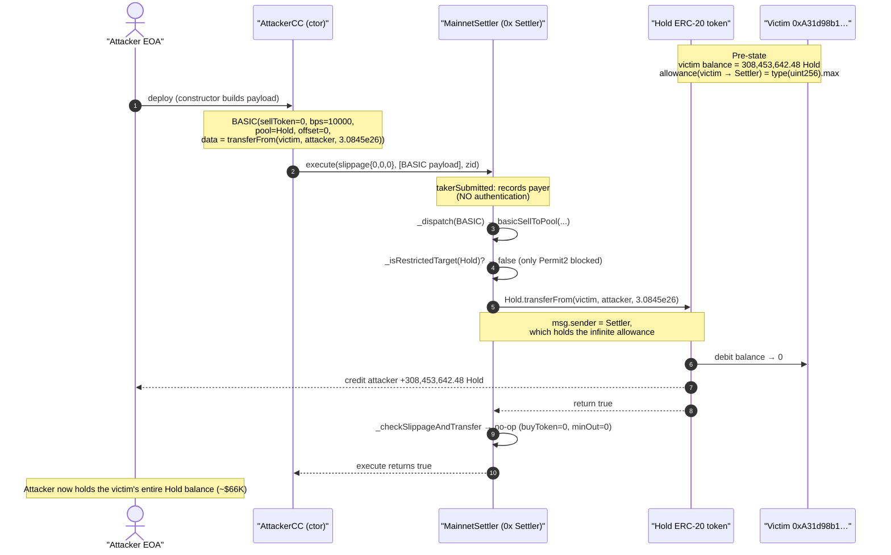
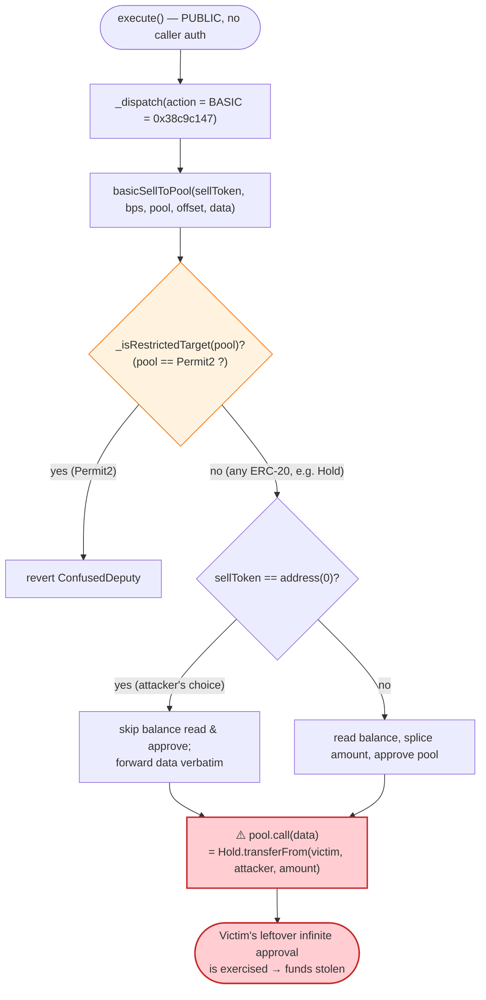
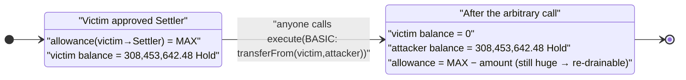

# 0x Protocol "Settler" Exploit — Arbitrary External Call via `BASIC` Action Drains a Leftover Approval

> **Vulnerability classes:** vuln/dependency/unsafe-external-call · vuln/access-control/missing-auth

> **Reproduction:** the PoC compiles & runs in an isolated Foundry project at
> [this project folder](.) (the umbrella DeFiHackLabs repo
> contains many unrelated PoCs that do not whole-compile, so this one was extracted).
> Full verbose trace: [output.txt](output.txt).
> Verified vulnerable source: [src_flat_MainnetFlat.sol](sources/MainnetSettler_70bf66/src_flat_MainnetFlat.sol).

---

## Key info

| | |
|---|---|
| **Loss** | ~$66,000 — **308,453,642.48 "Hold" (EVERYBODY) tokens** drained from a single victim |
| **Vulnerable contract** | `MainnetSettler` (0x Protocol Settler v1.7) — [`0x70bf6634eE8Cb27D04478f184b9b8BB13E5f4710`](https://etherscan.io/address/0x70bf6634eE8Cb27D04478f184b9b8BB13E5f4710#code) |
| **Stolen token** | `Hold` (sym "Hold", labelled "EVERYBODY") — [`0x68B36248477277865c64DFc78884Ef80577078F3`](https://etherscan.io/address/0x68B36248477277865c64DFc78884Ef80577078F3#code) |
| **Victim** | `0xA31d98b1aA71a99565EC2564b81f834E90B1097b` — held the tokens, had an *infinite* approval to the Settler |
| **Attacker EOA** | [`0x3A38877312D1125d2391663CBa9f7190953Bf2d9`](https://etherscan.io/address/0x3a38877312d1125d2391663cba9f7190953bf2d9) |
| **Attacker contracts** | [`0x285d37b0480910f977cd43c9bd228527bfad816e`](https://etherscan.io/address/0x285d37b0480910f977cd43c9bd228527bfad816e) (deployer) → `AttackerCC` |
| **Attack tx** | [`0xfab5912f858b3768b7b7d312abcc02b64af7b1e1b62c4f29a2c1a2d1568e9fa2`](https://etherscan.io/tx/0xfab5912f858b3768b7b7d312abcc02b64af7b1e1b62c4f29a2c1a2d1568e9fa2) |
| **Chain / block / date** | Ethereum mainnet / 21,230,768 (PoC forks 21,230,767) / Nov 21, 2024 |
| **Compiler** | Solidity v0.8.25, optimizer 10,000 runs |
| **Bug class** | Confused-deputy / arbitrary external call — the router forwards an attacker-chosen `transferFrom` on an attacker-chosen token, exploiting a victim's leftover unlimited approval |

---

## TL;DR

0x Protocol's `Settler` is a swap router whose `execute()` entry point runs a list of "actions". One
of those actions, **`BASIC`**, is a generic "call this `pool` with this `data`" primitive used to
talk to arbitrary AMMs/aggregators. Its *only* target restriction is that the target must not be the
Permit2 contract ([`_isRestrictedTarget`](sources/MainnetSettler_70bf66/src_flat_MainnetFlat.sol#L2974-L2976)).
Everything else is permitted.

Because `execute()` is **permissionless** and `BASIC` lets the caller pick *both* the target contract
and the raw calldata, anyone can make the Settler perform an arbitrary call **with the Settler as
`msg.sender`**. The attacker pointed `BASIC` at the `Hold` ERC-20 token and supplied the calldata for:

```
Hold.transferFrom(victim, attacker, 308_453_642.48e18)
```

The victim (`0xA31d98b1…`) had earlier granted the Settler an **unlimited (`type(uint256).max`)
approval** for `Hold` — a normal thing to do before swapping through 0x. The Settler dutifully
executed the `transferFrom`, moving the victim's entire `Hold` balance to the attacker. No swap, no
slippage check (the attacker set `buyToken = address(0)`, `minAmountOut = 0`), no signature: a single
constructor call drained the victim.

This is the canonical "router that makes arbitrary calls + users with leftover approvals = free
drain" pattern.

---

## Background — what the Settler does

0x Protocol's `Settler` ([`MainnetSettler`](sources/MainnetSettler_70bf66/src_flat_MainnetFlat.sol))
is a stateless on-chain settlement/router contract. A taker calls
[`execute(AllowedSlippage, bytes[] actions, bytes32)`](sources/MainnetSettler_70bf66/src_flat_MainnetFlat.sol#L3435-L3459)
with a list of encoded *actions*; the contract decodes each action's 4-byte selector and dispatches
it. Supported actions include `UNISWAPV3`, `UNISWAPV2`, `VELODROME`, `RFQ`, `TRANSFER_FROM` (Permit2),
`POSITIVE_SLIPPAGE`, and the generic **`BASIC`**.

`BASIC` exists so the router can interact with arbitrary pools/settlement venues it doesn't have a
hard-coded adapter for. Its signature is:

```solidity
function BASIC(address sellToken, uint256 bps, address pool, uint256 offset, bytes calldata data) external;
```

The router computes how much of `sellToken` it currently holds, splices that amount into `data` at
`offset`, optionally approves `pool`, and then calls `pool.call(data)`. In the intended flow `data`
is a swap call to a DEX and `sellToken` is the token being sold.

At the fork block, the relevant on-chain facts (read via `cast`) were:

| Fact | Value |
|---|---|
| Victim's `Hold` balance | **308,453,642.481581939556432141** (`3.0845e26`, 18 decimals) |
| Victim's `Hold` allowance to the Settler | **`type(uint256).max`** (`1.157e77`) — unlimited |
| `Hold` token | standard OpenZeppelin-style ERC-20, symbol "Hold", supply `1e29` |
| `execute()` access control | **none** — `takerSubmitted` modifier just records `msg.sender` as payer |

Those two victim facts — *holds tokens* and *has an infinite, never-revoked approval to the Settler* —
are the entire attack surface. The Settler holds no funds of its own, but it holds **permission** over
the victim's funds.

---

## The vulnerable code

### 1. `execute()` is permissionless and runs the first action through `BASIC`

```solidity
function execute(AllowedSlippage calldata slippage, bytes[] calldata actions, bytes32 /* zid & affiliate */ )
    public
    payable
    takerSubmitted            // ← see below: NO authentication, just records the payer
    returns (bool)
{
    if (actions.length != 0) {
        (bytes4 action, bytes calldata data) = actions.decodeCall(0);
        if (!_dispatchVIP(action, data)) {
            if (!_dispatch(0, action, data)) {     // ← BASIC is dispatched here
                revert ActionInvalid(0, action, data);
            }
        }
    }
    ...
    _checkSlippageAndTransfer(slippage);           // ← bypassed: buyToken=0, minAmountOut=0
    return true;
}
```
[src_flat_MainnetFlat.sol:3435-3459](sources/MainnetSettler_70bf66/src_flat_MainnetFlat.sol#L3435-L3459)

The `takerSubmitted` modifier provides no caller authentication whatsoever — it only stamps the
caller as the transient "payer":

```solidity
modifier takerSubmitted() override {
    address msgSender = _operator();
    TransientStorage.setPayer(msgSender);
    _;
    TransientStorage.clearPayer(msgSender);
}
```
[src_flat_MainnetFlat.sol:3143-3148](sources/MainnetSettler_70bf66/src_flat_MainnetFlat.sol#L3143-L3148)

### 2. `BASIC` performs an arbitrary external call to a caller-chosen target

```solidity
} else if (action == ISettlerActions.BASIC.selector) {        // selector 0x38c9c147
    (IERC20 sellToken, uint256 bps, address pool, uint256 offset, bytes memory _data) =
        abi.decode(data, (IERC20, uint256, address, uint256, bytes));
    basicSellToPool(sellToken, bps, pool, offset, _data);
}
```
[src_flat_MainnetFlat.sol:3326-3330](sources/MainnetSettler_70bf66/src_flat_MainnetFlat.sol#L3326-L3330)

```solidity
function basicSellToPool(IERC20 sellToken, uint256 bps, address pool, uint256 offset, bytes memory data) internal {
    if (_isRestrictedTarget(pool)) {        // ⚠️ the ONLY guard: pool must not be Permit2
        revert ConfusedDeputy();
    }
    ...
    } else if (address(sellToken) == address(0)) {   // ← attacker sets sellToken = 0 to skip
        if (offset != 0) revert InvalidOffset();      //   the balance/approve splicing entirely
    } else { ... }
    (success, returnData) = payable(pool).call{value: value}(data);   // ⚠️ ARBITRARY CALL
    success.maybeRevert(returnData);
    if (returnData.length == 0 && pool.code.length == 0) revert InvalidTarget();
}
```
[src_flat_MainnetFlat.sol:2781-2823](sources/MainnetSettler_70bf66/src_flat_MainnetFlat.sol#L2781-L2823)

### 3. The only target restriction is "not Permit2"

```solidity
ISignatureTransfer internal constant _PERMIT2 = ISignatureTransfer(0x000000000022D473030F116dDEE9F6B43aC78BA3);

function _isRestrictedTarget(address target) internal pure virtual override returns (bool) {
    return target == address(_PERMIT2);     // ⚠️ blocks ONLY Permit2 — any token is allowed
}
```
[src_flat_MainnetFlat.sol:2972-2976](sources/MainnetSettler_70bf66/src_flat_MainnetFlat.sol#L2972-L2976)

Note the deliberate carve-out: 0x blocks Permit2 as a target precisely because the Settler holds
Permit2 *approval power* over users' tokens, and a `BASIC` call to Permit2 could then move those
funds. But that protection is **token-specific only for Permit2-mediated transfers**. It does
**nothing** for *direct* ERC-20 `approve()` allowances that users grant to the Settler address itself
— which is exactly what the victim here had done.

---

## Root cause — why it was possible

A swap router that (a) is callable by anyone and (b) exposes a primitive to make an *arbitrary call
to an arbitrary contract with arbitrary calldata* is, by definition, a **confused deputy**: it will
exercise any authority it has been granted on behalf of whoever asks. The Settler's authority over a
user's tokens comes in two forms:

1. **Permit2 allowances** — for these, 0x correctly forbids `BASIC` from targeting Permit2
   (`_isRestrictedTarget`).
2. **Plain ERC-20 `approve()` allowances granted directly to the Settler address** — for these there
   is **no protection at all**. The `BASIC` action can target the very token the user approved and
   call `transferFrom(victim, attacker, amount)`.

The victim had granted the Settler an **unlimited direct ERC-20 approval** on `Hold`. Whether that
approval was set by an integrator/aggregator, a stale UI flow, or the user manually, the Settler now
held `type(uint256).max` spending power over the victim's `Hold` balance — power any anonymous caller
could redirect.

The three design facts that compose into the drain:

1. **Permissionless entry.** `execute()` has no caller check; `takerSubmitted` only records the payer.
   Anyone can submit actions.
2. **`BASIC` = arbitrary call.** The caller fully controls `pool` (call target) and `data` (calldata).
   Setting `sellToken = address(0)` even skips the router's own balance/approve bookkeeping, so the
   call is forwarded verbatim.
3. **Guard too narrow.** `_isRestrictedTarget` blocks only the Permit2 address, not the universe of
   ERC-20 tokens over which the Settler may hold a direct allowance.

The slippage backstop in
[`_checkSlippageAndTransfer`](sources/MainnetSettler_70bf66/src_flat_MainnetFlat.sol#L3273-L3296) is
toothless here: it only does anything when `minAmountOut != 0` or `buyToken != address(0)`. The
attacker set both to zero, so the function is a no-op.

---

## Preconditions

- A victim address holding ERC-20 tokens **and** carrying a **non-zero direct `approve()` allowance to
  the Settler** for that token. Here it was an *infinite* (`type(uint256).max`) `Hold` allowance held
  by `0xA31d98b1…` — confirmed on-chain at the fork block.
- The token must use a standard `transferFrom(from, to, amount)` that honours allowances. `Hold` is a
  vanilla OpenZeppelin-style ERC-20 — [EVERYBODY.sol:298-305](sources/EVERYBODY_68B362/EVERYBODY.sol#L298-L305).
- No capital, no flash loan, no signature: the attacker simply needs the victim's allowance to exist.
  The whole exploit runs inside a contract constructor.

---

## Attack walkthrough (with on-chain numbers from the trace)

The attacker deploys `AttackerC`, which in its constructor deploys `AttackerCC`, whose constructor
builds the malicious action array and calls `MainnetSettler.execute(...)`. The single `BASIC` action
carries an embedded `transferFrom` payload.

The `actions[0]` bytes are `abi.encodePacked(call1, call2)` where the dispatcher reads `call1`'s first
4 bytes as the action selector (`0x38c9c147` = `BASIC`) and the rest as the ABI-encoded `BASIC`
arguments. Decoding `BASIC(sellToken, bps, pool, offset, data)`:

| BASIC arg | Value in PoC | Meaning |
|---|---|---|
| `sellToken` | `address(0)` | hits the `sellToken == 0` branch → skips balance read & approve, forwards `data` verbatim |
| `bps` | `10000` | ignored on the zero-token path |
| `pool` | `0x68B362…` (`Hold` token) | **the call target** — not Permit2, so the guard passes |
| `offset` | `0` | required to be 0 on the zero-token path |
| `data` | `Hold.transferFrom(victim, attacker, 3.0845e26)` | **the arbitrary calldata** (selector `0x23b872dd`, 100 bytes) |

| # | Step | Concrete values from trace |
|---|------|----------------------------|
| 0 | **Pre-state** | Victim `Hold` balance = 308,453,642.481581939556432141; allowance(victim → Settler) = `type(uint256).max`; attacker `Hold` balance = 0 |
| 1 | Attacker deploys `AttackerC` → `AttackerCC` | inside `AttackerCC`'s constructor |
| 2 | `AttackerCC` calls `MainnetSettler.execute(slippage{0,0,0}, [BASIC payload], 0xe0b1…)` | permissionless; `takerSubmitted` records `AttackerCC` as payer |
| 3 | Settler dispatches `BASIC` → `basicSellToPool(0, 10000, Hold, 0, transferFrom-data)` | `_isRestrictedTarget(Hold)` = false ✓ |
| 4 | Settler executes `Hold.transferFrom(victim, attacker, 308453642481581939556432141)` | `msg.sender` to the token = Settler, which has the infinite allowance |
| 5 | `Transfer(victim → attacker, 3.0845e26)`; allowance ↓ from MAX | victim balance slot → **0**; allowance slot → `0xff…00da66…` (still huge) |
| 6 | `_checkSlippageAndTransfer` | no-op (`buyToken = 0`, `minAmountOut = 0`) |
| 7 | **Post-state** | attacker `Hold` balance = **308,453,642.481581939556432141**; victim = 0 |

The trace's storage diff on the `Hold` token confirms the mechanics:

```
@ 0xd6a8...668b2 : 0 → 0x..ff259976e827cb6369390d   (attacker balance, +3.0845e26)
@ 0x4c1e...26581 : 0x..ff259976e827cb6369390d → 0    (victim balance, → 0)
@ 0x92f9...26f79 : 0xffff...ffff → 0xffff...00da66…   (allowance MAX → MAX − amount)
```

### Profit / loss accounting

| Party | Token | Before | After | Δ |
|---|---|---:|---:|---:|
| Victim `0xA31d98b1…` | Hold | 308,453,642.4816 | 0 | **−308,453,642.4816** |
| Attacker `0x3A388773…` | Hold | 0 | 308,453,642.4816 | **+308,453,642.4816** |

USD value of the stolen `Hold` tokens at the time of the hack ≈ **$66,000** (per the PoC header /
TenArmor post-mortem). The attacker spent only gas.

---

## Diagrams

### Sequence of the attack



### Control flow inside the Settler (where the guard fails to help)



### Allowance / balance state evolution



Note the residual: because the original allowance was `type(uint256).max`, the post-attack allowance
is still astronomically large — had the victim ever re-acquired `Hold`, it could have been drained
again.

---

## Remediation

1. **Never expose an unconstrained arbitrary-call primitive in a contract that holds spending
   authority over user funds.** The `BASIC` action lets the caller specify both target and calldata.
   At minimum, restrict `BASIC` targets to an allow-list of known DEX/aggregator contracts, or forbid
   targeting any address that is an ERC-20 the Settler may hold approvals for.
2. **Block self-as-spender transfers.** Reject any `BASIC` `data` whose decoded selector is
   `transferFrom`/`transfer`/`approve` (or, more robustly, any call that could move tokens *the Settler
   has been approved for*). The Permit2 carve-out in `_isRestrictedTarget` shows the team understood
   the confused-deputy risk — it simply wasn't generalised to direct ERC-20 approvals.
3. **Do not rely on users *not* leaving approvals to the router.** A correct stateless router should
   only ever move funds it pulls *in the same call* via Permit2 / signed permits, and should never be
   exploitable through a standing `approve()` to its own address. Treat any direct allowance to the
   router as an attack vector and design so it cannot be exercised by an unauthenticated caller.
4. **Make the slippage/settlement check unconditional.** Here `_checkSlippageAndTransfer` is a no-op
   when `buyToken == 0` and `minAmountOut == 0`, so an attacker can run actions with no net "buy". A
   router that performed an action should be required to deliver *something* back to the taker, making
   pure-drain action sequences economically pointless.
5. **User mitigation:** revoke unlimited approvals to swap routers after use, and prefer Permit2 /
   signature-bound, single-use approvals over standing `approve(MAX)` to router addresses.

> 0x Protocol's recommended response to this class of issue is to migrate to a newer Settler
> deployment and to ensure integrators use Permit2 rather than direct allowances to the Settler.

---

## How to reproduce

The PoC was extracted into a standalone Foundry project (the umbrella DeFiHackLabs repo has many
unrelated PoCs that fail to compile under `forge test`'s whole-project build):

```bash
_shared/run_poc.sh 2024-11-MainnetSettler_exp -vvvvv
```

- RPC: an **Ethereum mainnet archive** endpoint is required (the fork block 21,230,767 needs
  historical state). `foundry.toml`'s `mainnet` alias points at an Infura archive endpoint.
- Result: `[PASS] testPoC()`; the attacker's `Hold` balance goes from 0 to 308,453,642.48.

Expected tail:

```
Ran 1 test for test/MainnetSettler_exp.sol:ContractTest
[PASS] testPoC() (gas: 174891)
Logs:
  before attack: balance of attacker: 0.000000000000000000
  after attack: balance of attacker: 308453642.481581939556432141

Suite result: ok. 1 passed; 0 failed; 0 skipped
```

---

*References: TenArmor post-mortem — https://x.com/TenArmorAlert/status/1859416451473604902 ; attack tx
`0xfab5912f858b3768b7b7d312abcc02b64af7b1e1b62c4f29a2c1a2d1568e9fa2` on Etherscan.*
