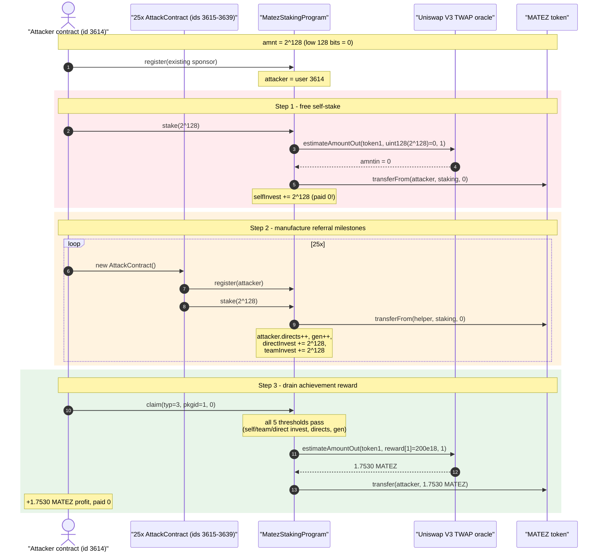
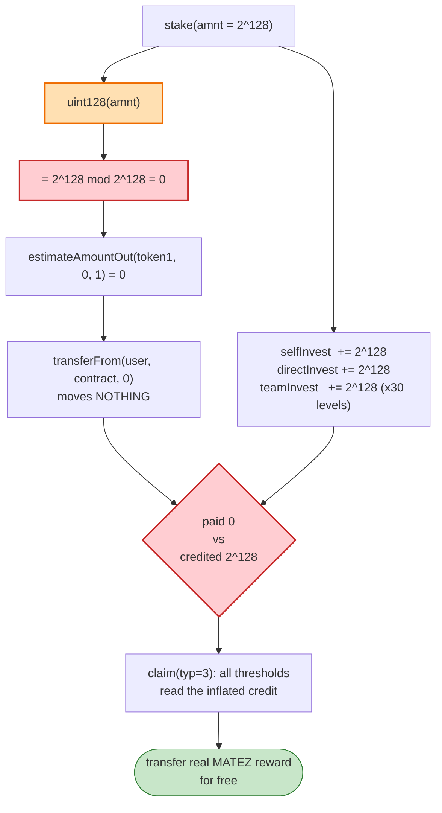
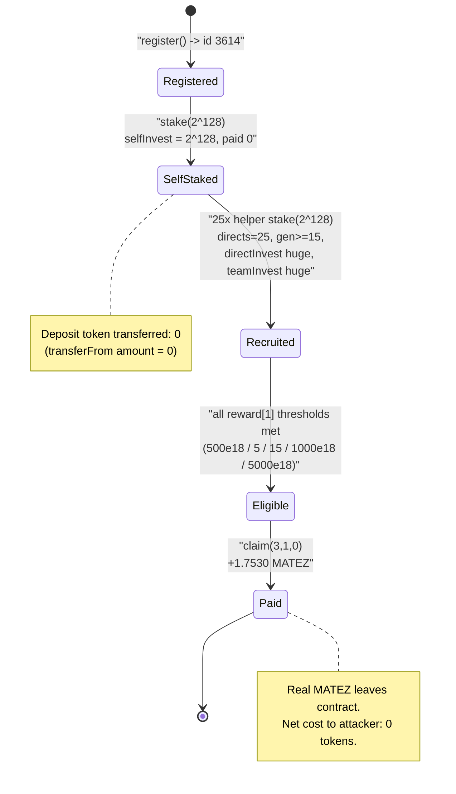

# Matez Staking Exploit — `uint128` Truncation Lets Anyone Stake "for Free"

> **Vulnerability classes:** vuln/arithmetic/overflow · vuln/logic/state-update

> **Reproduction:** the PoC compiles & runs in an isolated Foundry project at
> [this project folder](.) (the umbrella DeFiHackLabs repo contains many unrelated
> PoCs that do not whole-compile under `forge test`, so this one was extracted).
> Full verbose trace: [output.txt](output.txt).
> Verified vulnerable source: [MatezStakingProgram.sol](sources/MatezStakingProgram_326FB7/MatezStakingProgram.sol).

---

## Key info

| | |
|---|---|
| **Loss** | ~$80,000 — the staking contract pays out reward tokens it should never have owed |
| **Vulnerable contract** | `MatezStakingProgram` — [`0x326FB70eF9e70f8f4c38CFbfaF39F960A5C252fa`](https://bscscan.com/address/0x326FB70eF9e70f8f4c38CFbfaF39F960A5C252fa#code) |
| **Reward / deposit token** | `MATEZ` (BEP20) — [`0x010C0D77055A26D09bb474EF8d81975F55bd8Fc9`](https://bscscan.com/address/0x010C0D77055A26D09bb474EF8d81975F55bd8Fc9) |
| **Price oracle** | Uniswap-V3-style MATEZ/token1 pool — `0xC0319e8f278BE2228Fd0baD12EdFEC7B25d16d54` (TWAP `observe`) |
| **Attacker EOA** | [`0xd4f04374385341da7333b82b230cd223143c4d62`](https://bscscan.com/address/0xd4f04374385341da7333b82b230cd223143c4d62) |
| **Attack contract** | [`0x0aD02ce1b8EB978FD8dc4abeC5bf92Dfa81Ed705`](https://bscscan.com/address/0x0aD02ce1b8EB978FD8dc4abeC5bf92Dfa81Ed705) |
| **Attack tx** | [`0x840b0dc64dbb91e8aba524f67189f639a0bc94ee9256c57d79083bb3fd46ec91`](https://bscscan.com/tx/0x840b0dc64dbb91e8aba524f67189f639a0bc94ee9256c57d79083bb3fd46ec91) |
| **Chain / block / date** | BSC / 44,222,632 (forked at 44,222,631) / Nov 2024 |
| **Compiler** | Solidity v0.7.6, optimizer **off** (0 runs) |
| **Bug class** | Integer truncation (`uint256 → uint128` downcast) decoupling *paid amount* from *credited amount* |
| **Source** | TenArmor — https://x.com/TenArmorAlert/status/1859830885966905670 |

---

## TL;DR

`MatezStakingProgram.stake(uint256 amnt)` is supposed to pull `amnt`-worth of deposit tokens from the
user and credit them with an investment of `amnt`. But it computes the **amount to pull** through a
price oracle that takes a **`uint128`**, while it credits the user's accounting with the **full
`uint256 amnt`**:

```solidity
uint256 amntin = estimateAmountOut(address(token1), uint128(amnt), 1); // ← amnt is DOWNCAST to uint128
depositToken.transferFrom(msg.sender, address(this), amntin);          // pull `amntin`
users[msg.sender].selfInvest += amnt;                                  // ← credit the FULL uint256
```

If the user passes `amnt = 2^128 = 340282366920938463463374607431768211456`, then `uint128(amnt) == 0`,
so `estimateAmountOut(...) == 0` and `transferFrom(..., 0)` **moves no tokens at all**. Yet
`selfInvest += 2^128` records a colossal "investment", and the same `amnt` cascades into
`directInvest` and `teamInvest` of the entire upline ([`updateDis`](sources/MatezStakingProgram_326FB7/MatezStakingProgram.sol#L251-L260)).

The attacker then:

1. Registers, and calls `stake(2^128)` — pays **0**, gets credited **2^128** of `selfInvest`.
2. Deploys **25 throwaway `AttackContract`s**, each of which registers with the attacker as sponsor and
   calls `stake(2^128)` — again paying **0**, but each one bumps the attacker's `directs`, `gen`,
   `directInvest`, and `teamInvest` past the achievement-reward thresholds.
3. Calls `claim(typ = 3, pkgid = 1, 0)` — the "Achievement reward" branch. All five eligibility checks
   pass because every counter is astronomically inflated, and the contract pays out
   `reward[1] = 200 USD-worth` of MATEZ = **1.7530 MATEZ** for free.

The whole sequence cost the attacker **zero deposit tokens** and could be repeated for each reward tier
to drain the staking contract's MATEZ balance. The PoC reproduces one iteration; the on-chain campaign
repeated it for ~$80K total.

---

## Background — what MatezStakingProgram does

`MatezStakingProgram` ([source](sources/MatezStakingProgram_326FB7/MatezStakingProgram.sol)) is an MLM /
"staking" referral program with three user-facing entry points:

- **`register(sponsor)`** ([:199-210](sources/MatezStakingProgram_326FB7/MatezStakingProgram.sol#L199-L210)) —
  joins the program under a sponsor, assigning the caller a sequential `id`.
- **`stake(amnt)`** ([:224-249](sources/MatezStakingProgram_326FB7/MatezStakingProgram.sol#L224-L249)) —
  deposits `amnt`, accruing `selfInvest` for the caller, `directInvest` for the sponsor, and `teamInvest`
  across 30 levels of upline. The amount of deposit token actually pulled is computed from a
  Uniswap-V3 TWAP oracle (`estimateAmountOut`).
- **`claim(typ, pkgid, amount)`** ([:355-411](sources/MatezStakingProgram_326FB7/MatezStakingProgram.sol#L355-L411)) —
  a three-in-one function: `typ==1` daily ROI, `typ==2` balance withdrawal, `typ==3` **achievement
  rewards** based on team-building milestones (directs, generations, self/team/direct investment).

The achievement-reward thresholds (`typ==3`) are configured by these arrays
([:178-183](sources/MatezStakingProgram_326FB7/MatezStakingProgram.sol#L178-L183)):

| Index | `selfBrequired` | `teamDrequired` (directs) | `teamrequired` (gen) | `businessDrequired` (directInvest) | `businessTrequired` (teamInvest) | `reward` |
|------:|----------------:|--------------------------:|---------------------:|-----------------------------------:|---------------------------------:|---------:|
| **1** | 500e18 | 5 | 15 | 1000e18 | 5000e18 | **200e18** |
| 2 | 500e18 | 8 | 25 | 2000e18 | 20000e18 | 500e18 |
| … | … | … | … | … | … | … |

The reward is denominated in USD-ish units (e.g. `200e18`) and converted to MATEZ at the current TWAP
before transfer. The legitimate intent: a real participant who has staked $500+, recruited 5 directs /
15 generations, and grown $1000 direct- / $5000 team-investment earns 200 USD of MATEZ. **The bug lets
the attacker fake all of those numbers without spending a cent.**

---

## The vulnerable code

### 1. `stake()` — paid amount and credited amount come from different widths

[MatezStakingProgram.sol:224-249](sources/MatezStakingProgram_326FB7/MatezStakingProgram.sol#L224-L249):

```solidity
function stake(uint256 amnt) public {
    require(users[msg.sender].id != 0, "Register Before Deposit!");

    users[msg.sender].invest_count++;
    address sponsor = users[msg.sender].sponsor;
    if (users[msg.sender].invest_count == 1) {
        users[sponsor].directs++;        // ← sponsor's direct count grows
        addteam(sponsor);                // ← sponsor's generation count grows (recursive)
    }
    uint256 amntin = estimateAmountOut(address(token1), uint128(amnt), 1); // ⚠️ DOWNCAST amnt -> uint128
    depositToken.transferFrom(msg.sender, address(this), amntin);          //   pull `amntin` (==0 for 2^128)
    users[msg.sender].selfInvest += amnt;                                  // ⚠️ credit FULL uint256

    users[sponsor].directInvest += amnt;                                   // ⚠️ sponsor credited FULL uint256

    uint40 o_id = users[msg.sender].invest_count;
    orders[msg.sender][o_id].amount = amnt;
    orders[msg.sender][o_id].timestamp = uint40(block.timestamp);
    orders[msg.sender][o_id].last_claim = uint40(block.timestamp);
    orders[msg.sender][o_id].status = true;

    updateDis(msg.sender, amnt);          // ⚠️ propagate FULL uint256 to 30 levels of teamInvest
    emit upgrade_package(users[msg.sender].id, amnt);
}
```

`estimateAmountOut` ([:69-120](sources/MatezStakingProgram_326FB7/MatezStakingProgram.sol#L69-L120)) takes
`uint128 amountIn` (it is a thin wrapper over Uniswap-V3's `OracleLibrary.getQuoteAtTick`, which is
defined for `uint128 baseAmount`). The author therefore wrote `uint128(amnt)` to fit the oracle's
signature — silently throwing away the top 128 bits of the user-supplied `amnt`. Solidity 0.7's
explicit cast `uint128(x)` truncates modulo `2^128` with **no revert**.

### 2. `updateDis()` — the truncation contaminates the whole referral tree

[MatezStakingProgram.sol:251-260](sources/MatezStakingProgram_326FB7/MatezStakingProgram.sol#L251-L260):

```solidity
function updateDis(address user, uint256 _pkg) internal {
    address sponsor = users[user].sponsor;
    for (uint256 i = 1; i <= 30; i++) {
        if (users[sponsor].id != 0) {
            users[sponsor].teamInvest += _pkg;   // ← adds the FULL 2^128 to each upline's teamInvest
        }
        sponsor = users[sponsor].sponsor;
    }
}
```

### 3. `claim(typ == 3)` — the achievement reward the attacker drains

[MatezStakingProgram.sol:401-410](sources/MatezStakingProgram_326FB7/MatezStakingProgram.sol#L401-L410):

```solidity
if (typ == 3) {
    require(
        users[msg.sender].selfInvest    >= selfBrequired[pkgid]    &&
        users[msg.sender].teamInvest    >= businessTrequired[pkgid] &&
        users[msg.sender].directs       >= teamDrequired[pkgid]    &&
        users[msg.sender].gen           >= teamrequired[pkgid]     &&
        users[msg.sender].directInvest  >= businessDrequired[pkgid] &&
        rewardStatus[msg.sender][pkgid] == false,
        "You Can Not Claim for reward."
    );

    rewardStatus[msg.sender][pkgid] = true;
    uint256 amntin = estimateAmountOut(address(token1), uint128(reward[pkgid]), 1);
    depositToken.transfer(msg.sender, amntin);     // ← pays out real MATEZ
    incomes[msg.sender].reward += reward[pkgid];
    emit ClaimCall(addressToId[msg.sender], reward[pkgid], 3);
}
```

Every one of those five `>=` checks is satisfied by accounting that the attacker inflated for free.

---

## Root cause — why it was possible

The single defect is **a type-width mismatch between the value used to charge the user and the value used
to credit the user**:

> `estimateAmountOut(token1, uint128(amnt), 1)` computes the deposit-token amount to pull from a
> **truncated** `amnt`, while `selfInvest`, `directInvest`, and `teamInvest` are all incremented by the
> **untruncated** `uint256 amnt`.

For any `amnt` whose low 128 bits are zero (e.g. `amnt = 2^128`, `2·2^128`, …), the contract pulls
`transferFrom(..., 0)` — moving **nothing** — yet records an investment equal to the full `amnt`. The
two quantities should be the same economic value; the careless cast decoupled them.

This is compounded by three design decisions that turn a "free credit" into a "free withdrawal":

1. **Self-sponsored Sybil tree is permissionless.** `register(sponsor)` only requires the sponsor to
   exist. The attacker registers, then has 25 fresh contracts register *under itself*, so the achievement
   counters (`directs`, `gen`) that are meant to prove real recruitment can be self-manufactured.
2. **All milestone gates read the same poisoned accounting.** `selfInvest`, `directInvest`, `teamInvest`
   are exactly the variables inflated by the truncation bug, and `directs`/`gen` are inflated by the
   Sybil tree. There is no independent check that the deposit-token balance actually grew.
3. **The reward is paid in real tokens at a real price.** The truncation only needs to flip the
   eligibility booleans; the payout itself (`reward[pkgid]` → MATEZ via TWAP) is genuine value leaving
   the contract.

A safe implementation would (a) revert on `amnt > type(uint128).max` (or use a checked `SafeCast`), and
(b) credit accounting from the *same* value that was actually transferred (`amntin`), not from the raw
`amnt`.

---

## Preconditions

- The attacker (and its helper contracts) must `register` first — trivial, permissionless, only needs a
  pre-existing sponsor (`0x80d93e9451A6830e9A531f15CCa42Cb0357D511f`, an existing user).
- `amnt` must have its low 128 bits zero so the oracle quote (and hence the transfer) truncates to 0. The
  attacker uses `amnt = 2^128`.
- Enough self-sponsored `stake` calls to clear the lowest reward tier's `directs ≥ 5` and `gen ≥ 15`
  checks — the PoC uses **25** helper contracts.
- The staking contract must hold MATEZ to pay the reward (it did). **No capital, no flash loan, and no
  price manipulation are required** — the deposit leg costs literally 0 tokens.

---

## Attack walkthrough (with on-chain numbers from the trace)

User IDs are sequential. The attacker contract becomes user **3614**; the 25 helper `AttackContract`s
become users **3615 … 3639**, each registering with sponsor id `3614`. All figures are taken directly
from the events in [output.txt](output.txt).

| # | Step | Trace evidence | Effect on attacker (id 3614) |
|---|------|----------------|------------------------------|
| 0 | **Initial** — attacker MATEZ balance | `Attacker Before exploit MATEZ Balance: 0.000…` | 0 MATEZ |
| 1 | `register(0x80d9…511f)` | `Register(: 3614, : Matez…, : 1)` ([:23-24](output.txt)) | joins, `id = 3614` |
| 2 | `stake(2^128)` | `transferFrom(Matez, staking, amount: 0)` then `upgrade_package(: 3614, : 3.402e38)` ([:32-48](output.txt)) | **paid 0 MATEZ**; `selfInvest += 2^128` |
| 3 | `new AttackContract()` ×25 → each `register(3614)` + `stake(2^128)` | 25× `Register(: 3615…3639, …, : 3614)` + 25× `transferFrom(…, amount: 0)` ([:49-798](output.txt)) | each pays 0; bumps attacker `directs` (→25), `gen` (≥15), `directInvest` (+2^128 each), `teamInvest` (+2^128 each) |
| 4 | `claim(3, 1, 0)` | `transfer(Matez, attacker, 1753044885823151963)` then `ClaimCall(: 3614, : 2e20, : 3)` ([:799-812](output.txt)) | reward tier 1 (`200e18`) → **1.7530 MATEZ paid out for free** |
| 5 | **Final** — attacker MATEZ balance | `Attacker After exploit MATEZ Balance: 1.753044885823151963` | **+1.7530 MATEZ profit** |

The key truncation is directly visible in the trace: `stake` is invoked with
`340282366920938463463374607431768211456` (`3.402e38`), and the resulting
`transferFrom(..., amount: 0)` moves **zero** tokens — while the achievement reward at the end transfers
out **1.753044885823151963 MATEZ** of real value.

### Why `amnt = 2^128`

`2^128 = 340282366920938463463374607431768211456`. The contract casts `uint128(amnt)`:

```
uint128(2^128) = 2^128 mod 2^128 = 0
```

So `estimateAmountOut(token1, 0, 1) = 0` (Uniswap's `getQuoteAtTick` with `baseAmount = 0` returns 0),
and `transferFrom(..., 0)` succeeds while moving nothing. Meanwhile `selfInvest += 2^128` makes the
attacker's recorded investment ≈ `3.4e38`, dwarfing every threshold (`500e18` … `10000000e18`). Any
multiple of `2^128` would work identically; `2^128` is just the smallest convenient value.

### Profit / loss accounting

| Token leg | Amount | Direction |
|---|---:|---|
| MATEZ pulled by 26 `stake` calls (`transferFrom`, amount 0 each) | **0** | attacker → contract |
| MATEZ paid out by `claim(typ=3, pkgid=1)` | **1.7530448858 MATEZ** (`reward[1] = 200 USD` at TWAP) | contract → attacker |
| **Net profit (this iteration)** | **+1.7530448858 MATEZ** | — |

This is one iteration over reward tier 1. The same registered identity can claim higher tiers
(`pkgid = 2…8`, rewards up to `300000e18`) because the inflated counters exceed *every* tier's thresholds
(`rewardStatus[msg.sender][pkgid]` is tracked per tier, so each tier pays once). Repeating across the
attacker's many Sybil identities is what scaled the real-world loss to ~$80K.

---

## Diagrams

### Sequence of the attack



### How the truncation decouples paid vs. credited



### Attacker accounting state evolution (user 3614)



---

## Remediation

1. **Reject oversized stakes / use checked casts.** Before truncating, enforce
   `require(amnt <= type(uint128).max)` or use OpenZeppelin `SafeCast.toUint128(amnt)` so any value with
   non-zero high bits reverts instead of silently becoming `0`.
2. **Credit accounting from the *transferred* amount, not the raw input.** The canonical fix is to make the
   charged value and the credited value the same quantity — e.g. measure the actual balance delta from the
   `transferFrom` and increment `selfInvest`/`directInvest`/`teamInvest` by that, never by an unvalidated
   user-supplied `amnt`. A zero transfer must produce a zero credit.
3. **Don't let achievement gates trust self-manufactured referral metrics.** `directs`/`gen` can be
   trivially Sybil-inflated by self-sponsored registrations. Reward eligibility should require evidence
   that real deposit value entered the system (e.g. minimum *transferred* token thresholds), or
   independent off-chain verification of recruits.
4. **Validate `pkgid` bounds.** `claim(typ=3)` indexes six arrays with `pkgid` and reverts only via array
   bounds; an explicit `require(pkgid >= 1 && pkgid < reward.length)` clarifies intent and avoids relying
   on revert-on-OOB.
5. **Keep `stake` widths consistent end-to-end.** Use a single integer width (`uint256` with explicit
   bounds, or `uint128` validated at the boundary) for the deposit amount throughout `stake`, `updateDis`,
   `orders`, and `claim` so a downcast can never appear only on the "charge" side.

---

## How to reproduce

The PoC was extracted into a standalone Foundry project (the umbrella DeFiHackLabs repo has several
unrelated PoCs that fail to whole-compile under `forge test`):

```bash
_shared/run_poc.sh 2024-11-Matez_exp -vvvvv
```

- RPC: a **BSC archive** endpoint is required (fork block 44,222,631). `foundry.toml` uses
  `https://bnb.api.onfinality.io/public`, which serves historical state at that block; pruned public RPCs
  fail with `header not found` / `missing trie node`.
- Result: `[PASS] testExploit()`, attacker MATEZ balance goes `0 → 1.753044885823151963`.

Expected tail:

```
Ran 1 test for test/Matez_exp.sol:Matez
[PASS] testExploit() (gas: 7222750)
Logs:
  Attacker Before exploit MATEZ Balance: 0.000000000000000000
  Attacker After exploit MATEZ Balance: 1.753044885823151963

Suite result: ok. 1 passed; 0 failed; 0 skipped
```

---

*Reference: TenArmor — https://x.com/TenArmorAlert/status/1859830885966905670 (Matez, BSC, ~$80K).*
