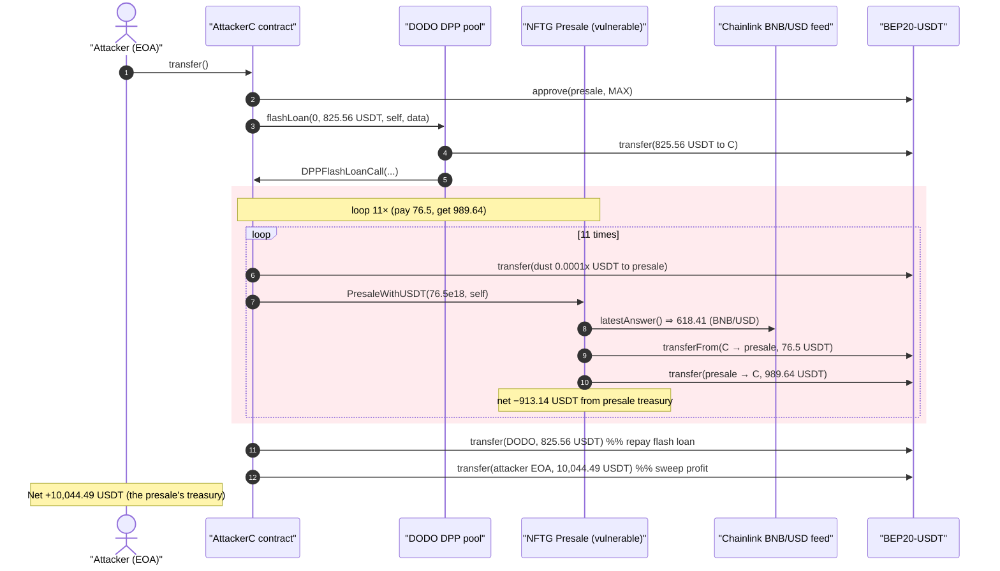
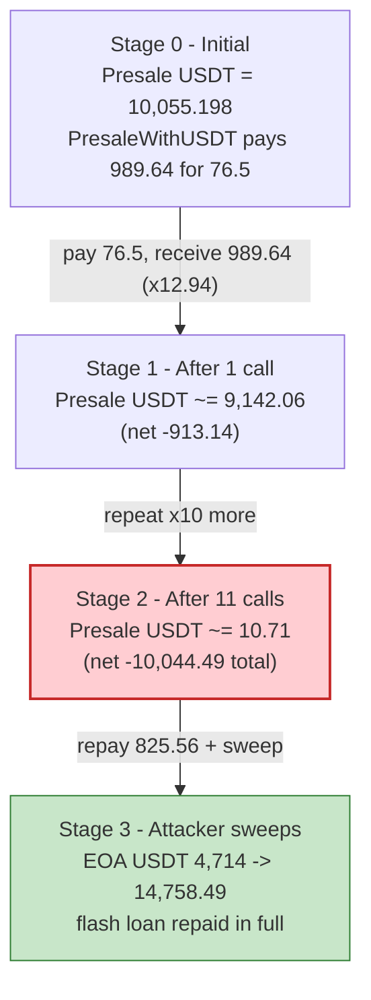
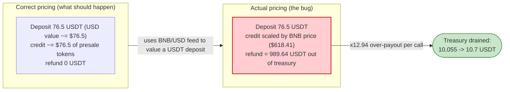

# NFTG Presale Exploit — Mispriced `PresaleWithUSDT()` Pays ~13× the USDT Deposited

> **Reproduction:** the PoC compiles & runs in an isolated Foundry project at
> [this project folder](.) (the umbrella DeFiHackLabs repo
> contains several unrelated PoCs that do not whole-compile, so this one was extracted).
> Full verbose trace: [output.txt](output.txt).
> The vulnerable presale contract is **unverified** on BscScan — its behaviour below is
> reconstructed from the on-chain trace plus `cast` probes; the supporting contracts
> (Chainlink BNB/USD proxy) are verified and downloaded under [sources/](sources/).

---

## Key info

| | |
|---|---|
| **Loss** | ~$10,044 — **10,044.49 BEP20-USDT** drained from the presale contract |
| **Vulnerable contract** | NFTG Presale (unverified) — [`0x5fbBb391d54f4FB1d1CF18310c93d400BC80042E`](https://bscscan.com/address/0x5fbBb391d54f4FB1d1CF18310c93d400BC80042E) |
| **Victim** | The same presale contract (held the USDT proceeds) |
| **Attacker EOA** | [`0x5af00B07a55F55775e4d99249DC7d81F5bc14c22`](https://bscscan.com/address/0x5af00b07a55f55775e4d99249dc7d81f5bc14c22) |
| **Attacker contract** | [`0x6deF9e4a6bb9C3bfE0648A11D3FfF14447079e78`](https://bscscan.com/address/0x6def9e4a6bb9c3bfe0648a11d3fff14447079e78) (PoC redeploys; live used this one) |
| **Attack tx** | [`0xbd330fd17d0f825042474843a223547132a49abb0746a7e762a0b15cf4bd28f6`](https://bscscan.com/tx/0xbd330fd17d0f825042474843a223547132a49abb0746a7e762a0b15cf4bd28f6) |
| **Chain / block / date** | BSC / 44,348,366 / Nov 26, 2024 |
| **Compiler (PoC)** | Solidity `^0.8.10`, `evm_version = cancun` |
| **Bug class** | Oracle/denomination mismatch in presale pricing → fixed ~12.94× over-payout per deposit |
| **Funding** | DODO DPP flash loan (825.56 USDT, zero fee) — pure working capital, repaid in full |

---

## TL;DR

The NFTG presale contract exposes a public function `PresaleWithUSDT(uint256 amount, address recipient)`
(selector `0x85d07203`). The intended flow is "deposit USDT, receive presale tokens valued via the
Chainlink **BNB/USD** feed." But the contract's accounting is broken: for a fixed deposit of
**76.5 USDT** it pays the recipient a *constant* **989.64 USDT** back out of its own treasury —
a **~12.94× return** — every single call.

The over-payout is keyed off the BNB/USD oracle reading
([`latestAnswer() = 61,840,939,882` → $618.41](output.txt), 8 decimals). The presale evidently
multiplies the deposit by a BNB-denominated unit price while only *charging* a flat USDT amount, so
the buyer pays in cheap USDT but is credited as if paying in BNB-equivalent value. The result is a
risk-free arbitrage against the presale's USDT balance.

The attacker simply:

1. Flash-borrows 825.56 USDT from a DODO DPP pool (zero fee) for working capital.
2. Approves the presale to spend its USDT, then calls `PresaleWithUSDT(76.5e18, self)` **11 times**
   inside the flash-loan callback. Each call nets `989.64 − 76.5 = 913.14` USDT.
3. Repays the 825.56 USDT flash loan and sweeps the remaining **10,044.49 USDT** to the EOA.

The presale's USDT balance falls from **10,055.20 → 10.71 USDT** — essentially emptied to the wei.

---

## Background — what the protocol does

NFTG ran a token presale on BSC. The presale contract at `0x5fbBb391…` accepts BEP20-USDT deposits
through `PresaleWithUSDT(uint256, address)` and credits the buyer with presale allocation priced via
a Chainlink oracle. On-chain probes confirm:

- The contract is **unverified** (8,260 bytes of bytecode; common getters like `rate()`, `price()`,
  `priceFeed()`, `usdt()`, `name()`, `token()` all revert — the real getter names are non-standard).
- It is owned by `0x76eBdad3F69695dBD60cb64411562325cCfbEceD`.
- It held **10,055.198 USDT** at the fork block (the prize).
- On each `PresaleWithUSDT` call it reads the price oracle three times then settles.

The price oracle it consults is the **canonical Chainlink BNB/USD feed** on BSC:

| Contract | Address | Role |
|---|---|---|
| `EACAggregatorProxy` | [`0x0567F2323251f0Aab15c8dFb1967E4e8A7D42aeE`](https://bscscan.com/address/0x0567F2323251f0Aab15c8dFb1967E4e8A7D42aeE) | Chainlink **BNB / USD**, `decimals() = 8` |
| underlying `AccessControlledOffchainAggregator` | `0xa6E8fEe84f9Bd528aD71917c9DdbB1fd3214f280` | returns `latestAnswer() = 61,840,939,882` ($618.41) |

That the price feed is **BNB/USD** (not a USDT or NFTG feed) is the crux: the presale prices a USDT
deposit using a BNB-per-USD scale, inflating the credited value by roughly the BNB price.

The DODO **DPP** pool at `0x6098A5638d8D7e9Ed2f952d35B2b67c34EC6B476` is only used as a free
flash-loan source; it is not part of the bug.

---

## The vulnerable code

The presale contract is **not verified on BscScan**, so a literal source snippet is unavailable. The
*observable* contract behaviour, reconstructed line-by-line from the trace
([output.txt:44-71](output.txt)), is:

```
// pseudo-reconstruction of PresaleWithUSDT(uint256 amount, address recipient)
// selector 0x85d07203  — confirmed via `cast 4byte`
function PresaleWithUSDT(uint256 amount /* 76.5e18 */, address recipient) external {
    uint256 p = BNB_USD_FEED.latestAnswer();      // 61_840_939_882  ($618.41, 8 decimals)
    // ... (feed read 3×) ...
    USDT.transferFrom(msg.sender, address(this), DEPOSIT);   // pulls a FIXED 76.5 USDT
    // BROKEN: credited value is scaled by the BNB price, not the USDT actually paid
    uint256 payout = _credit(amount, p);          // == 989.635670427665 USDT, constant
    USDT.transfer(recipient, payout);             // pays out of the presale's OWN treasury
}
```

The two ground-truth facts from the trace that define the bug:

- **Input charged is fixed at 76.5 USDT** regardless of the `amount` argument
  ([output.txt:57](output.txt) — `transferFrom(attacker, presale, 76_500000000000000000)`).
- **Output paid is a constant 989.635670427665 USDT** every call
  ([output.txt:65-66](output.txt) — `transfer(presale → attacker, 989_635670427665056608)`).

The contract reads the Chainlink **BNB/USD** proxy, whose source *is* verified — the relevant
`latestAnswer()` pass-through is in
[sources/EACAggregatorProxy_0567F2/EACAggregatorProxy.sol](sources/EACAggregatorProxy_0567F2/EACAggregatorProxy.sol):

```solidity
function latestAnswer()
    external
    view
    returns (int256)
{
    return aggregator.latestAnswer();   // BNB/USD ≈ $618.41 at block 44,348,366
}
```

There is nothing wrong with the oracle — it is being **misused** by the presale.

---

## Root cause — why it was possible

A presale that sells allocation for stablecoin deposits must price the deposit in the **same unit it
charges**. This contract instead:

1. **Charges a flat USDT amount** (76.5 USDT pulled by `transferFrom`), but
2. **Credits the buyer using a BNB-denominated unit price** sourced from the Chainlink BNB/USD feed.

So the buyer effectively pays "76.5" of one thing and is credited "76.5 × (BNB-price factor)" of
another — and because the presale settles the credit *in USDT out of its own balance*, the mismatch
manifests as a direct **~12.94× cash refund**: pay 76.5 USDT, receive 989.64 USDT.

The four design failures that compose into the loss:

1. **Denomination mismatch / wrong oracle.** Using a BNB/USD feed to value a USDT deposit conflates
   two currencies. The deposit's USD value is trivially `amount` (USDT ≈ $1); multiplying by the BNB
   price (~$618) is meaningless and inflates the credit by orders of magnitude.
2. **Payout settled in the deposited asset.** The presale pays the (inflated) credit back in USDT
   from its own treasury, turning a pricing bug into an immediately drainable balance.
3. **No per-account / per-deposit limits.** `PresaleWithUSDT` can be called arbitrarily many times in
   one transaction; the attacker looped it 11 times in a single flash-loan callback.
4. **Permissionless and flash-loan-compatible.** Anyone can call it, the only capital required is a
   fleeting USDT balance (here borrowed from DODO at zero fee and repaid in the same tx), so the
   attack has **no real cost**.

---

## Preconditions

- The presale holds a non-trivial USDT balance to pay out (here **10,055.198 USDT**).
- `PresaleWithUSDT` is callable by anyone with a USDT balance ≥ the fixed deposit and an approval to
  the presale (the PoC sets `approve(presale, type(uint256).max)`).
- Working capital to seed the first deposits — fully recoverable, hence flash-loanable. The PoC uses
  a **DODO DPP** flash loan of 825.56 USDT (zero fee), repaid intra-transaction.
- The BNB/USD oracle returns a large value (~$618) — the larger the BNB price, the larger the
  over-payout multiple.

---

## Step-by-step attack walkthrough (ground-truth numbers from the trace)

All figures are taken directly from [output.txt](output.txt). The attack contract's
`DPPFlashLoanCall` ([test/NFTG_exp.sol:49-58](test/NFTG_exp.sol#L49-L58)) runs the loop.

| # | Step | Trace ref | USDT in | USDT out | Running net |
|---|------|-----------|--------:|---------:|------------:|
| 0 | Approve presale to spend attacker USDT (`type(uint256).max`) | [L24](output.txt) | — | — | 0 |
| 1 | DODO DPP `flashLoan(0, 825.5555, attacker, …)` → lends 825.56 USDT | [L29-32](output.txt) | +825.56 | — | +825.56 (debt) |
| 2 | Dust transfer 0.00011 USDT → presale, then `PresaleWithUSDT(76.5e18, self)` #1 | [L38-71](output.txt) | −76.5 | +989.64 | +913.14 |
| 3 | Dust transfer 0.00012 USDT → presale, then `PresaleWithUSDT` #2 | [L72-105](output.txt) | −76.5 | +989.64 | +1,826.27 |
| 4 | `PresaleWithUSDT` #3 (dust 0.00013) | [L106-…](output.txt) | −76.5 | +989.64 | +2,739.41 |
| 5 | `PresaleWithUSDT` #4 (dust 0.00014) | — | −76.5 | +989.64 | +3,652.54 |
| 6 | `PresaleWithUSDT` #5 (dust 0.00015) | — | −76.5 | +989.64 | +4,565.68 |
| 7 | `PresaleWithUSDT` #6 (dust 0.00016) | — | −76.5 | +989.64 | +5,478.81 |
| 8 | `PresaleWithUSDT` #7 (dust 0.00017) | — | −76.5 | +989.64 | +6,391.95 |
| 9 | `PresaleWithUSDT` #8 (dust 0.00018) | — | −76.5 | +989.64 | +7,305.09 |
| 10 | `PresaleWithUSDT` #9 (dust 0.00019) | — | −76.5 | +989.64 | +8,218.22 |
| 11 | `PresaleWithUSDT` #10 (dust 0.00020) | — | −76.5 | +989.64 | +9,131.36 |
| 12 | `PresaleWithUSDT` #11 (dust 0.00021) | [L384-411](output.txt) | −76.5 | +989.64 | +10,044.49 |
| 13 | Repay flash loan: `transfer(DODO, 825.5555 USDT)` | [L412-417](output.txt) | −825.56 | — | +10,044.49 |
| 14 | Sweep `balanceOf(self)` = 10,044.49 USDT → attacker EOA | [L418-425](output.txt) | — | — | **+10,044.49** |

The 11 tiny "dust" transfers (0.00011 → 0.00021 USDT, total **0.00176 USDT**) sent into the presale
just before each `PresaleWithUSDT` call are negligible and are effectively absorbed into the deposit;
they do not affect the economics. The real value flow is the fixed **76.5 in / 989.64 out** per call.

### Per-call economics

- Deposit charged: **76.5 USDT** (`7.65e19`).
- Payout received: **989.635670427665 USDT** (`9.89635670427665e20`) — *constant across all 11 calls*.
- Net per call: **+913.135670 USDT** (**12.94×** return).
- BNB/USD oracle reading used: **$618.41** (`61,840,939,882`, 8 decimals).

### Profit / loss accounting (USDT)

| Item | Amount |
|---|---:|
| Attacker USDT before attack | 4,714.000000 |
| Flash loan borrowed (DODO DPP) | +825.555500 |
| 11 × deposits paid into presale | −841.500000 |
| 11 × dust transfers into presale | −0.001760 |
| 11 × payouts received from presale | +10,885.992375 |
| Flash loan repaid | −825.555500 |
| **Net to attacker contract → swept to EOA** | **+10,044.490615** |
| Attacker USDT after attack | **14,758.490615** |
| **Presale USDT before → after** | **10,055.198 → 10.707** |

Profit `= 14,758.49 − 4,714.00 = 10,044.49 USDT`, which equals the presale's drained balance to the
wei — confirming the attacker simply walked off with the presale's treasury.

---

## Diagrams

### Sequence of the attack



### Presale treasury evolution



### Why the deposit is mispriced (denomination mismatch)



---

## Remediation

1. **Price the deposit in the unit it is charged.** A USDT deposit's USD value is the USDT amount
   itself (USDT ≈ $1) — do **not** multiply it by a BNB/USD oracle reading. If a presale must convert
   between assets, use the *correct* feed for the *deposited* asset and verify decimals/denomination.
2. **Never let credit exceed deposit value.** The settlement output (in any asset) must be derived
   from the verified USD value of the deposit; an invariant `payoutValueUSD ≤ depositValueUSD` would
   have blocked the 12.94× refund.
3. **Don't settle credits out of an open treasury.** Mint/allocate presale tokens on a vesting ledger
   rather than paying liquid USDT back to the buyer; a pricing bug should never become a direct
   balance drain.
4. **Add per-account and per-tx limits / rate limiting** on `PresaleWithUSDT`, and consider a
   one-deposit-per-block or KYC-gated cap so the function cannot be looped 11× in a single
   flash-loan callback.
5. **Use fresh, validated oracle data** (check `updatedAt`, `answeredInRound`, positive answer, and
   correct decimals) — though here the oracle was correct and merely the *wrong* feed for the asset.
6. **Verify and audit the presale contract before holding funds.** This contract was deployed
   unverified with a non-standard interface; an audit would have caught the denomination mismatch.

---

## How to reproduce

The PoC was extracted into a standalone Foundry project (the umbrella DeFiHackLabs repo has several
unrelated PoCs that fail to compile under `forge test`'s whole-project build):

```bash
_shared/run_poc.sh 2024-11-NFTG_exp -vvvvv
```

- RPC: a **BSC archive** endpoint is required (fork block 44,348,366). `foundry.toml` uses
  `https://bsc-mainnet.public.blastapi.io`, which serves historical state at that block; most public
  BSC RPCs prune it and fail with `header not found` / `missing trie node`.
- Result: `[PASS] testPoC()`, attacker USDT **4,714 → 14,758.49** (profit **10,044.49 USDT**).

Expected tail:

```
  before attack: balance of attacker: 4714.000000000000000000
  after attack: balance of attacker: 14758.490614704315622688

Suite result: ok. 1 passed; 0 failed; 0 skipped
Ran 1 test suite: 1 tests passed, 0 failed, 0 skipped (1 total tests)
```

---

*Reference: TenArmor post-mortem — https://x.com/TenArmorAlert/status/1861430745572745245 (NFTG presale, BSC, ~$10K).*
