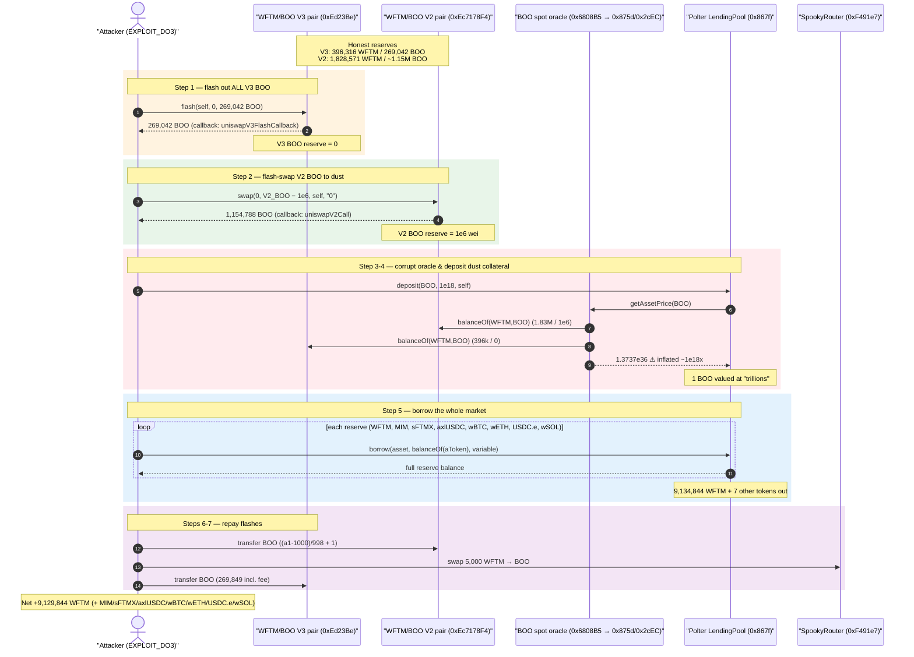
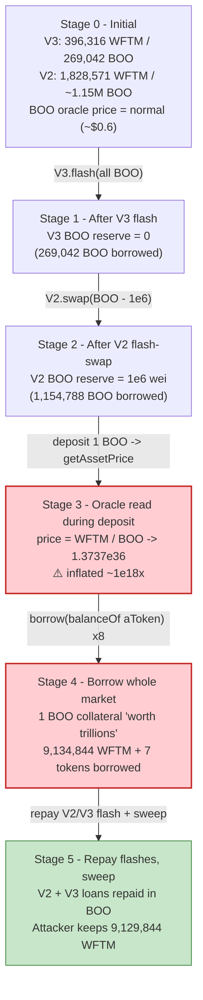
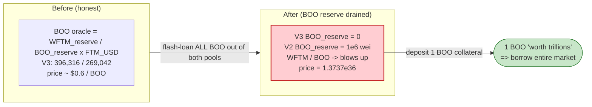

# Polter Finance Exploit — Spot-Reserve Price Oracle Manipulation Drains an Aave-V2 Lending Market

> **Reproduction:** the PoC compiles & runs in an isolated Foundry project at
> [this project folder](.) (the umbrella DeFiHackLabs repo does not whole-compile, so this PoC was
> extracted into a standalone forge project).
> Full verbose trace: [output.txt](output.txt).
> Verified vulnerable contract is the lending market proxy: [LendingPool proxy source](sources/LendingPool_867fAa).
> The price-oracle contracts that hold the actual bug were deployed on Fantom Opera (chainid 250),
> which **lost Etherscan-V2 source access after the Sonic migration** and is not on Sourcify/Blockscout
> — so their logic is reconstructed below directly from the live execution trace.

---

## Key info

| | |
|---|---|
| **Loss** | ~$7M — attacker borrowed out the entire lending market against 1 BOO of "collateral". This PoC measures the **WFTM leg only: 9,129,844.12 WFTM** drained, plus 7 other reserve tokens (MIM, sFTMX, axlUSDC, wBTC, wETH, USDC.e, wSOL) sent to the attacker EOA. |
| **Vulnerable contract** | Polter `LendingPool` / "Pitfall" — [`0x867fAa51b3A437B4E2e699945590Ef4f2be2a6d5`](https://ftmscan.com/address/0x867fAa51b3A437B4E2e699945590Ef4f2be2a6d5#code) (Aave-V2 fork proxy; impl `0xD47aE558...`). Root cause lives in its **price oracle** [`0x6808B5cE79d44E89883c5393b487c4296aBb69fe`](https://ftmscan.com/address/0x6808B5cE79d44E89883c5393b487c4296aBb69fe) → BOO feed [`0x80663EDff...`](https://ftmscan.com/address/0x80663EDff11e99e8E0B34cb9C3E1fF32E82A80Fe) / `0x875d564a...` / `0x2cECa12a...`. |
| **Victim / collateral asset** | SpookySwap BOO token `0x841FAD6EAe12c286d1Fd18d1d525DFfA75C7EFFE`; oracle-backing pools: WFTM/BOO **V3** pair `0xEd23Be0cc3912808eC9863141b96A9748bc4bd89` and the V2 pair `0xEc7178F4C41f346b2721907F5cF7628E388A7a58`. |
| **Attacker EOA** | [`0x511f427Cdf0c4e463655856db382E05D79Ac44a6`](https://ftmscan.com/address/0x511f427Cdf0c4e463655856db382E05D79Ac44a6) |
| **Attacker contract** | [`0xA21451aC32372C123191B3a4FC01deB69F91533a`](https://ftmscan.com/address/0xA21451aC32372C123191B3a4FC01deB69F91533a) (PoC re-deploys as `EXPLOIT_DO3`) |
| **Attack tx** | [`0x5118df23e81603a64c7676dd6b6e4f76a57e4267e67507d34b0b26dd9ee10eac`](https://ftmscan.com/tx/0x5118df23e81603a64c7676dd6b6e4f76a57e4267e67507d34b0b26dd9ee10eac) |
| **Chain / block / date** | Fantom Opera / 97,508,838 / 2024-11-16 (~18:00 UTC) |
| **Compiler** | LendingPool: Solidity 0.7.6 (Aave-V2 fork); PoC: ^0.8.x |
| **Bug class** | Oracle manipulation — DeFi lending price feed reads **manipulable spot AMM reserves** (not a TWAP/Chainlink-anchored value), inflatable inside a single flash-loaned transaction |

---

## TL;DR

Polter Finance is an **Aave-V2 fork** lending market on Fantom that accepted SpookySwap's **BOO** as a
collateral asset. Its price oracle for BOO derived the BOO price from the **instantaneous token balances
of the SpookySwap BOO/WFTM pools** (`WFTM.balanceOf(pool) / BOO.balanceOf(pool)`-style spot pricing),
rather than a manipulation-resistant Chainlink feed or TWAP.

The attacker exploited this in **one transaction**:

1. Take a **flash loan of the entire BOO reserve** out of the WFTM/BOO **Uniswap-V3** pool
   (`0xEd23Be...`), leaving that pool with **0 BOO**.
2. Inside the V3 callback, take a nested **flash swap** of nearly all BOO out of the **V2** pool
   (`0xEc7178F4...`) too, leaving it with exactly **1e6 wei** of BOO.
3. With both backing pools nearly empty of BOO, the oracle's spot `WFTM/BOO` ratio explodes: the
   oracle returns a BOO price of **`1.3737…e36`** (≈ **1.37e18 USD per BOO** at 18-decimal/ETH-base
   scaling) — astronomically above BOO's real ~$0.6 price.
4. Deposit just **1 BOO (1e18 wei)** into Polter as collateral. At the inflated oracle price that single
   token is valued at trillions of dollars, so the account's borrowing power is effectively unlimited.
5. **Borrow the full available balance of every reserve** — WFTM, MIM, sFTMX, axlUSDC, wBTC, wETH,
   USDC.e, wSOL — draining the market.
6. Repay the V2 flash swap and the V3 flash loan (BOO is plentiful again once borrowed/swapped back),
   keep the borrowed assets. Net for the WFTM leg: **+9,129,844.12 WFTM**.

The collateral was real-BOO worth pennies; the loans were worth ~$7M. The lending market never used a
price source the attacker couldn't move with their own flash-loaned capital.

---

## Background — what Polter Finance is

Polter Finance ("Pitfall") is a fork of **Aave V2** deployed on Fantom. The on-chain target
`0x867fAa51b3A437B4E2e699945590Ef4f2be2a6d5` is the `LendingPool` behind an Aave-style immutable-admin
upgradeability proxy — the verified Sourcify source confirms the Aave codebase layout
(`contracts/protocol/libraries/aave-upgradeability/...`,
[BaseImmutableAdminUpgradeabilityProxy.sol](sources/LendingPool_867fAa/contracts_protocol_libraries_aave-upgradeability_BaseImmutableAdminUpgradeabilityProxy.sol#L16-L29)).
Every state-changing call (`deposit`, `borrow`, `getReserveData`, `getReserveNormalizedIncome`)
`delegatecall`s into the implementation at `0xD47aE558623638F676C1E38dAd71B53054F54273`, exactly as
seen in the trace ([output.txt:79](output.txt), [:172](output.txt)).

Like Aave V2, every collateral/borrow accounting decision is denominated through a single
`PriceOracle` (`getPriceOracle()` from the addresses provider `0x975EC106...`) that exposes
`getAssetPrice(asset)`. For most reserves this resolved to ordinary Chainlink-style feeds. **For BOO it
resolved to a custom feed that priced BOO off live SpookySwap pool balances.** That feed is the bug.

### The four-contract oracle chain for BOO (reconstructed from the trace)

`getAssetPrice(BOO)` on the Polter price oracle `0x6808B5...` does **not** hit a Chainlink aggregator.
Instead it calls a custom `fetchPrice()` on `0x80663EDff...`, which combines two SpookySwap-derived
feeds, each of which *reads the live ERC20 balances of a BOO/WFTM pool* and divides:

| Contract | Role | What it reads (from the trace) |
|---|---|---|
| `0x6808B5cE79d44E89883c5393b487c4296aBb69fe` | Polter `PriceOracle.getAssetPrice(BOO)` | calls `fetchPrice()` below ([output.txt:198-199](output.txt)) |
| `0x80663EDff11e99e8E0B34cb9C3E1fF32E82A80Fe` | BOO `fetchPrice()` aggregator | reads `latestRoundData()` of the two pool feeds, picks the result, scales by an FTM/USD Chainlink feed |
| `0x875d564a6a86F6154592B88f7A107a517F00cc17` | **V2-pool spot feed** | `WFTM.balanceOf(0xEc7178F4… V2 pair)` and `BOO.balanceOf(0xEc7178F4…)` ([output.txt:207-209](output.txt)) |
| `0x2cECa12a53E428D37a62448Fc818bf2e15b7E462` | **V3-pool spot feed** | `WFTM.balanceOf(0xEd23Be… V3 pair)` and `BOO.balanceOf(0xEd23Be…)` ([output.txt:233-239](output.txt)) |
| `0xf4766552D15AE4d256Ad41B6cf2933482B0680dc` / `0xd62d2aFe…` | FTM/USD Chainlink | used only to convert the WFTM-denominated ratio to USD (legitimate) |

The price is essentially **`(WFTM reserve / BOO reserve) × FTM_USD`**. When the attacker zeroes out the
BOO reserves, the divisor collapses and the price detonates.

---

## The vulnerable code

The price-oracle contracts are not source-verified on any reachable explorer for Fantom Opera (the
Etherscan-V2 chainlist only lists **Sonic 146**, not Fantom **250**; FTMScan's legacy API host is
unreachable; Sourcify and Blockscout have no source for these addresses). The behaviour is therefore
documented from the on-chain trace, which is unambiguous about *what data the oracle reads*.

**What the BOO feed effectively does** (semantically equivalent reconstruction):

```solidity
// 0x875d564a... / 0x2cECa12a...  — spot price from pool balances (NOT a TWAP)
function latestRoundData() external view returns (..., int256 answer, ...) {
    uint256 wftmReserve = WFTM.balanceOf(pool);   // live, manipulable
    uint256 booReserve  = BOO.balanceOf(pool);    // live, manipulable
    // price of BOO in WFTM = wftmReserve / booReserve, then scaled to USD via FTM/USD feed
    answer = int256(wftmReserve * FTM_USD * SCALE / booReserve);  // ⚠️ divisor is attacker-controlled
    ...
}
```

The trace proves the inputs are raw balances, not cached cumulative prices:

```text
# V2-pool feed 0x875d564a... reads the V2 pair balances:
0x21be...WFTM::balanceOf(0xEc7178F4… V2 pair) → 1,828,570.94 WFTM   (output.txt:207-208)
0x841F...BOO ::balanceOf(0xEc7178F4… V2 pair) → 1,000,000 wei BOO   (output.txt:209)   ← attacker left 1e6

# V3-pool feed 0x2cECa12a... reads the V3 pair balances:
0x21be...WFTM::balanceOf(0xEd23Be… V3 pair) → 396,315.88 WFTM       (output.txt:233-234)
0x841F...BOO ::balanceOf(0xEd23Be… V3 pair) → 0                     (output.txt:235)    ← flash-drained
# → getAssetPrice(BOO) returns 1,373,782,984,830,617,596,185,131,540,000,000,000 = 1.3737e36 (output.txt:252)
```

With the V3 BOO reserve at **0** and the V2 BOO reserve at **1e6 wei**, the `WFTM/BOO` ratio is enormous,
so the oracle reports a BOO price of `1.3737e36` for the **entire duration of the attack** — every one
of the 8 `borrow()` calls is priced against this same inflated number
([output.txt:252](output.txt), [:462](output.txt), [:712](output.txt), [:992](output.txt), …).

### How that single number authorizes the borrow

Inside the implementation's `borrow()` (Aave-V2 `ValidationLogic.validateBorrow`), the user's
`availableBorrowsETH` is `collateralETH × LTV`. The attacker's only collateral is **1e18 BOO** deposited
at [output.txt:78](output.txt):

```text
0x867f...LendingPool::deposit(BOO, 1_000_000_000_000_000_000, attacker, 0)   (output.txt:78)
```

`1e18 BOO × 1.3737e36 (oracle price) ≈ 1.37e18`-scaled collateral value — for Aave-V2's 18-decimal /
ETH-base accounting this dwarfs the entire market's borrowable value, so the health-factor check passes
for borrowing **everything**.

---

## Root cause — why it was possible

Aave V2's entire risk model rests on **one assumption**: `getAssetPrice(asset)` returns a value an
attacker cannot move cheaply within a transaction. Mainnet Aave satisfies this with Chainlink feeds.
Polter Finance broke it by wiring BOO's price to a **spot AMM reserve ratio**:

> The BOO oracle computes price as `WFTM_reserve / BOO_reserve` of SpookySwap pools, reading the pools'
> **current ERC20 balances**. Those balances are fully controllable inside a flash loan: borrow the BOO
> out, the divisor goes to ~0, and the reported BOO price goes to ~infinity — **for free, reverted at
> the end of the same transaction**.

The composing design errors:

1. **Spot price, not TWAP / not a hardened feed.** A Uniswap-style pool's instantaneous reserve ratio is
   the canonical manipulable oracle. Using it directly (and worse, *via raw `balanceOf` reads* rather
   than even `getReserves()` with the pool's own accounting) means any actor who can move the reserves
   moves the price 1:1.
2. **The reserves are flash-loanable.** The very pools that *back the oracle* (the WFTM/BOO V3 pair and
   the V2 pair) expose `flash()` / `swap()`, so the attacker borrows the price-determining liquidity at
   zero capital cost, reads the corrupted price, and returns it — classic flash-loan oracle attack
   ([R15: flash-loan precondition manipulation]).
3. **Division by a manipulable, near-zero divisor.** With `BOO_reserve → 1e6` (or 0 in the V3 leg), the
   price isn't merely *off* — it's inflated by **~18 orders of magnitude**, large enough that a single
   BOO of collateral can borrow an entire multi-asset market.
4. **Thin-liquidity collateral listing.** BOO's backing pools were small relative to Polter's TVL, so
   the cost to corner them (a flash loan repaid same-tx) was negligible against the ~$7M payout.

This is the same family of bug as numerous AMM-spot-oracle lending exploits (Cream, Inverse, etc.): the
lending protocol trusted a price source whose inputs the borrower controls.

---

## Preconditions

- Polter must list **BOO** as a collateral asset priced via the spot-reserve feed (it did).
- The BOO/WFTM pools must expose a flash facility (`UniswapV3Pool.flash` and the V2 pair's
  `swap`-with-callback) — both did, so **no upfront capital** is required.
- The lending market must hold borrowable balances of the other reserves (it held the ~$7M being drained).
- A small amount of gas; everything else is flash-loaned and repaid within the single transaction.

In the PoC these are reproduced exactly by forking Fantom at block **97,508,838**, one block before the
real exploit transaction. No `deal`/cheatcode funding of the attacker is needed — the capital comes from
the on-chain pools themselves.

---

## Attack walkthrough (with on-chain numbers from the trace)

All figures are read from the events/returns in [output.txt](output.txt). BOO = SpookySwap token
`0x841F…`; WFTM = `0x21be…`; V3 pair = `0xEd23Be…`; V2 pair = `0xEc7178F4…`.

| # | Step | Concrete numbers (from trace) | Effect |
|---|------|-------------------------------|--------|
| 0 | **Initial** | V3 pair holds 396,315.88 WFTM + 269,042.23 BOO; V2 pair holds 1,828,570.94 WFTM + ~1.155M BOO | Honest pools; BOO oracle reports normal price. |
| 1 | **V3 flash loan** — `WFTM_SpookyToken_V3Pool.flash(self, 0, BOO_reserve)` borrows the entire BOO side (269,042.23 BOO) ([output.txt:22](output.txt)) | V3 pair BOO → **0** | Drains the V3 feed's BOO reserve. Flash fee = 807.13 BOO. |
| 2 | **Nested V2 flash swap** — `JFTM_SpookyToken_V2Pool.swap(0, V2_BOO − 1e6, self, "0")` pulls 1,154,788.11 BOO out of the V2 pair, leaving exactly **1e6 wei** ([output.txt:45-46](output.txt)) | V2 pair BOO → **1,000,000 wei** | Drains the V2 feed's BOO reserve to dust. Triggers the V2 `uniswapV2Call` callback. |
| 3 | **(inside V2 callback) Deposit 1 BOO** — `LendingPool.deposit(BOO, 1e18, self, 0)` ([output.txt:78](output.txt)) | Collateral = 1 BOO | At the corrupted oracle price (1.3737e36) this is "worth" trillions. |
| 4 | **Oracle now corrupt** — `getAssetPrice(BOO)` returns **1,373,782,984,830,617,596,185,131,540,000,000,000** ([output.txt:252](output.txt)) | BOO priced ~1.37e18 USD-scaled | Borrowing power effectively unlimited. |
| 5 | **Borrow every reserve in full** (`borrow(asset, balanceOf(aToken), variable)`) — see table below | All 8 reserves drained to the attacker | The actual theft. |
| 6 | **Repay V2 flash** — `BOO.transfer(V2 pair, (a1·1000)/998 + 1)` ([output.txt:157 logic](output.txt)) | V2 flash settled | BOO obtained from the borrowed/round-tripped supply. |
| 7 | **Repay V3 flash** — swap 5,000 WFTM→BOO via SpookyRouter ([output.txt:2614](output.txt)), then `BOO.transfer(V3 pair, needToRepay)` (269,849.36 BOO incl. fee, [output.txt:2652](output.txt)) | V3 flash settled | Loan closed; attack profitable. |
| 8 | **Sweep to owner** — surplus BOO + **9,129,844.12 WFTM** transferred out ([output.txt:2678](output.txt)) | Attacker holds the loot | Final WFTM balance **9,129,844.12**. |

### The 8 borrows (each priced against the corrupted BOO collateral)

| Reserve | Address | Amount borrowed | Trace |
|---|---|---:|---|
| WFTM | `0x21be370D…` | 9,134,844.118945 WFTM | [output.txt:171](output.txt) |
| MIM | `0x82f0B8B4…` | 8,763.798906 MIM | [output.txt:351](output.txt) |
| sFTMX | `0xd7028092…` | 1,997,342.444872 sFTMX | [output.txt:567](output.txt) |
| axlUSDC | `0x1B6382DB…` | 26,002.496452 (6-dec) axlUSDC | [output.txt:817](output.txt) |
| wBTC | `0xf1648C50…` | 0.23379639 wBTC (8-dec) | [output.txt:1105](output.txt) |
| wETH | `0x69592103…` | 10.960867 wETH | [output.txt:1419](output.txt) |
| USDC.e | `0x2F733095…` | 56,881.01775 (6-dec) USDC.e | [output.txt:1767](output.txt) |
| wSOL | `0xd9902 1C2…` | 475.247372561 wSOL (9-dec) | [output.txt:2157](output.txt) |

Each borrow targets `token.balanceOf(reserveData.aTokenAddress)` — i.e. it takes **the entire
available liquidity** of that reserve, not a fixed amount.

### Profit accounting (WFTM leg, the PoC's measured asset)

| Direction | Amount (WFTM) |
|---|---:|
| Borrowed — WFTM reserve | +9,134,844.12 |
| Spent — WFTM→BOO swap to source V3 flash repayment | −5,000.00 |
| **Net WFTM kept by attacker** | **+9,129,844.12** |

Plus the full balances of MIM, sFTMX, axlUSDC, wBTC, wETH, USDC.e and wSOL, all forwarded to the
attacker EOA. The publicly reported total loss across all assets was **~$7M**. The PoC's balance log
records the WFTM leg:

```text
Attacker Before exploit WFTM Balance: 0.000000000000000000
Attacker After  exploit WFTM Balance: 9129844.118945021990073601
```

---

## Diagrams

### Sequence of the attack



### Pool / oracle state evolution



### Why the price detonates: divide by the manipulated reserve



---

## Why each magic number

- **`spookyToken.balanceOf(V3 pool)` as the flash amount (269,042 BOO):** borrow *exactly* the whole BOO
  side of the V3 pair so its BOO reserve hits **0** — maximizing the divisor collapse in the V3 feed.
- **`spookyToken.balanceOf(V2 pool) − 1e6` (1,154,788 BOO):** drain the V2 pair down to a residual
  **1e6 wei** of BOO. Leaving a tiny non-zero amount keeps the V2 feed's division from reverting on
  divide-by-zero while still producing a near-infinite ratio (the trace shows the V3 leg's zero-reserve
  branch *does* revert with `panic 0x12` and the aggregator falls back to the dust-reserve value,
  [output.txt:247](output.txt)).
- **`deposit(BOO, 1e18)`:** only **1 BOO** of collateral is needed; at price 1.3737e36 even a single
  token authorizes borrowing the whole market, so the attacker risks the bare minimum.
- **`borrow(asset, token.balanceOf(reserveData.aTokenAddress))`:** for each reserve, borrow the entire
  liquid balance held by its aToken — i.e., take everything the market can lend.
- **`5e21` (5,000 WFTM) router swap:** buys back enough BOO to top up the V3 flash repayment
  (`needToRepay = flashed BOO + fee`); the rest of the repayment BOO comes from the round-tripped supply.
- **`(a1 * 1000) / 998 + 1`:** SpookySwap V2's 0.2%-fee flash-swap repayment formula
  (`amountIn ≥ amountOut · 1000/998`), `+1` to cover integer rounding.

---

## Remediation

1. **Never price collateral off spot AMM reserves.** Replace the BOO feed with a manipulation-resistant
   source: a Chainlink price feed, or — if none exists — a long-window **TWAP** (Uniswap-V3 observation
   cardinality / cumulative-price oracle) that cannot be moved within one block/transaction. Reading
   raw `token.balanceOf(pool)` is the worst possible oracle and must be removed entirely.
2. **Treat oracle inputs as flash-loanable.** Any price derived from a pool whose liquidity is itself
   flash-borrowable is exploitable for free. The risk review for listing a collateral asset must ask:
   *"can the price-determining state be cheaply moved inside a transaction?"* — if yes, the asset cannot
   be listed against that oracle.
3. **Use multiple independent sources with sanity bounds.** Cross-check the AMM-derived price against an
   independent feed and **revert if they diverge beyond a tolerance** (e.g. ±X%). A price that jumps
   ~1e18x should never be accepted.
4. **Restrict / vet thin-liquidity collateral.** Assets whose backing-pool depth is small relative to
   the lending market's borrowable TVL should carry conservative LTVs, supply caps, or be excluded —
   the cost to corner them must exceed the borrowable payout.
5. **Add a circuit breaker on collateral value.** Cap the per-account or per-asset collateral value the
   oracle can attribute, and pause borrowing when an oracle reports an implausible price, so a corrupted
   feed cannot authorize draining the whole market in one transaction.

---

## How to reproduce

The PoC was extracted into a standalone Foundry project (the umbrella DeFiHackLabs repo does not
whole-compile under `forge test`). The PoC's local imports (`../basetest.sol` → `./tokenhelper.sol`,
`../interface.sol`) were copied into the project so the import paths resolve.

```bash
_shared/run_poc.sh 2024-11-PolterFinance_exploit -vvvvv
```

- **RPC:** a **Fantom Opera archive** endpoint is required (fork block 97,508,838 is from Nov-2024).
  The default `https://fantom-mainnet.public.blastapi.io` is **discontinued** (returns "Blast API is no
  longer available"); `foundry.toml` was switched to **`https://rpcapi.fantom.network`** (the Fantom
  Foundation archive), which serves historical state at that block. `drpc.org`'s free tier rate-limits
  archive storage reads (HTTP 408) and is not reliable here.
- **Result:** `[PASS] testExploit()` with the attacker's WFTM balance going `0 → 9,129,844.12`.

Expected tail:

```text
[PASS] testExploit() (gas: 7794073)
  Attacker Before exploit WFTM Balance: 0.000000000000000000
  Attacker After exploit WFTM Balance: 9129844.118945021990073601

Suite result: ok. 1 passed; 0 failed; 0 skipped; finished in 82.20s
Ran 1 test suite: 1 tests passed, 0 failed, 0 skipped (1 total tests)
```

---

*References: PoC header / DeFiHackLabs (`src/test/2024-11/PolterFinance_exploit.sol`); post-mortem
thread https://twitter.com/Bcpaintball26/status/1857865758551805976. Reported total loss ~$7M on Fantom.
Vulnerable price-oracle contracts are unverified on reachable Fantom-Opera explorers (Etherscan-V2 covers
only Sonic 146, not Fantom 250) — oracle logic above is reconstructed from the verbatim execution trace.*
